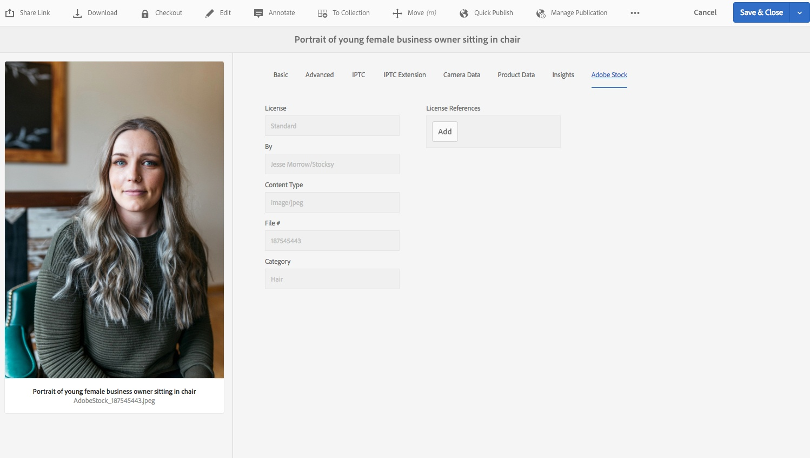

# 在[!DNL Adobe Experience Manager Assets] {#use-adobe-stock-assets-in-aem-assets}中使用[!DNL Adobe Stock]資產

組織可將其[!DNL Adobe Stock]企業計畫與[!DNL Experience Manager Assets]整合，以確保授權資產可廣泛用於其創意和行銷專案，並具備[!DNL Experience Manager]的強大資產管理功能。

[!DNL Adobe Stock] 服務可讓設計人員和企業針對其所有創意專案，取用數百萬個高品質、優質且免版稅的像片、向量、插圖、視訊、範本和3D資產。[!DNL Experience Manager] 使用者可以快速尋找、預覽和授權儲 [!DNL Adobe Stock] 存在中的資產，而 [!DNL Experience Manager]不需離開介 [!DNL Experience Manager] 面。

## 必備條件 {#prerequisites}

整合需要[enterprise [!DNL Adobe Stock] plan](https://stockenterprise.adobe.com/)。

## 整合[!DNL Experience Manager]和[!DNL Adobe Stock] {#integrate-aem-and-adobe-stock}

若要允許[!DNL Experience Manager]和[!DNL Adobe Stock]之間通訊，請在[!DNL Experience Manager]中建立IMS組態和[!DNL Adobe Stock]組態。

>[!NOTE]
>
>只有組織的[!DNL Experience Manager]管理員和[!DNL Admin Console]管理員才能執行需要管理員權限的整合。

### 建立IMS設定{#create-an-ims-configuration}

1. 在[!DNL Experience Manager]使用者介面中，導覽至&#x200B;**[!UICONTROL 工具]** > **[!UICONTROL 安全]** > **[!UICONTROL AdobeIMS組態]**。 按一 **[!UICONTROL 下「建立]** 」，然後選 **[!UICONTROL 取「雲端解決方案]** > **[!UICONTROL Adobe Stock]**」。
1. 重複使用現有證書或選擇「建立新證書」。****
1. 按一下&#x200B;**[!UICONTROL 建立憑證]**。建立後，請下載公開金鑰。 按一下&#x200B;**[!UICONTROL 下一步]**。將[!UICONTROL AdobeIMS技術帳戶配置]畫面保持開啟，以便很快提供所需值。
1. 存取[Adobe開發人員主控台](https://console.adobe.io)。 請確定您的帳戶擁有需要整合之組織的管理員權限。
1. 按一下「**[!UICONTROL 建立新項目]**」，然後按一下「**[!UICONTROL 添加API]**」。 從您可用的API清單中選擇&#x200B;**[!UICONTROL Adobe Stock]**。 選擇[!UICONTROL OAUTH 2.0 Web]。
1. 提供&#x200B;**[!UICONTROL 預設重新導向URI]**&#x200B;和&#x200B;**[!UICONTROL 重新導向URI模式]**&#x200B;值。 按一下&#x200B;**[!UICONTROL 「儲存已設定的 API」]**。複製產生的ID和密碼。
1. 在[!UICONTROL AdobeIMS技術帳戶配置]畫面中，提供標題為&#x200B;**[!UICONTROL Title]**、**[!UICONTROL 授權伺服器]**、**[!UICONTROL API金鑰]**、**[!UICONTROL 用戶端密碼]**&#x200B;和&#x200B;**[!UICONTROL 有效負載]**。 有關這些值的詳細資訊，請參見[JWT驗證快速入門](https://www.adobe.io/authentication/auth-methods.html#!AdobeDocs/adobeio-auth/master/JWT/JWT.md)。

<!-- TBD: Update the URL to update the terminology when AIO team updates their documentation URL. Logged issue github.com/AdobeDocs/adobeio-auth/issues/63.
-->

### 在[!DNL Experience Manager] {#create-adobe-stock-configuration-in-aem}中建立[!DNL Adobe Stock]配置

1. 在[!DNL Experience Manager]中，導航至&#x200B;**[!UICONTROL 工具]** > **[!UICONTROL Cloud Services]** > **[!UICONTROL Adobe Stock]**。
1. 按一下「建立」以建立組態，並將它與您現有的IMS組態建立關聯。 ****&#x200B;選擇`PROD`作為環境參數。
1. 在&#x200B;**[!UICONTROL 授權資產路徑]**&#x200B;欄位中，保留原狀位置。 請勿變更您要儲存[!DNL Adobe Stock]資產的位置。
1. 新增所有必要屬性以完成建立。 按一下&#x200B;**[!UICONTROL 「儲存並關閉」]**。
1. 新增[!DNL Experience Manager]使用者或群組，讓其授權資產。

>[!NOTE]
>
>如果有多個[!DNL Adobe Stock]配置，請在[!UICONTROL 用戶首選項]面板中選擇所需的配置。 若要從[!DNL Experience Manager]首頁存取面板，請按一下使用者圖示，然後按一下「使用者偏好設定」**[!UICONTROL >>「Stock設定」]**。]****[!UICONTROL 

## 使用及管理[!DNL Experience Manager] {#usemanage}中的[!DNL Adobe Stock]資產

使用此功能，組織可以允許其用戶使用[!DNL Experience Manager Assets]中的[!DNL Adobe Stock]資產。 在[!DNL Experience Manager]使用者介面中，使用者可搜尋[!DNL Adobe Stock]資產並授權所需資產。

在[!DNL Experience Manager]中授權[!DNL Adobe Stock]資產後，就可像一般資產一樣使用及管理。 在[!DNL Experience Manager]中，使用者可以搜尋並預覽資產；複製及發佈資產；在[!DNL Brand Portal]上分享資產；透過[!DNL Experience Manager]案頭應用程式存取及使用資產；等等。

![搜尋資 [!DNL Adobe Stock] 產並篩選工作區的結 [!DNL Adobe Experience Manager] 果](assets/adobe-stock-search-results-workspace.png)

*圖：搜尋資 [!DNL Adobe Stock] 產並篩選介面的 [!DNL Experience Manager] 結果。*

**A.**[!DNL Adobe Stock] 搜尋與已提供 ID 之資產的類似資產。**B.** 搜尋與您選取的型態或方向相符的資產。**C.** 搜尋一或多個支援的資產類型 **D.** 開啟或收合篩選器窗格 **E.** 在 中為選取的資產授權並加以儲存 [!DNL Experience Manager]**F.**[!DNL Experience Manager] 將資產儲存在 中並加上浮水印 **G.**[!DNL Adobe Stock] 在 網站上探索與選取的資產類似的資產 **H.**[!DNL Adobe Stock] 在 網站上檢視選取的資產 **I.** 搜尋結果中選取的資產數目 **J.** 在卡片檢視與清單檢視之間切換

### 尋找資產{#find-assets}

您的[!DNL Experience Manager]使用者可以同時搜尋[!DNL Experience Manager]和[!DNL Adobe Stock]中的資產。 當搜索位置不限於[!DNL Adobe Stock]時，將顯示來自[!DNL Experience Manager]和[!DNL Adobe Stock]的搜索結果。

* 若要搜尋[!DNL Adobe Stock]資產，請按一下「Navigation **** > **[!UICONTROL 資產]** > **[!UICONTROL 搜尋Adobe Stock]**」。

* 若要搜尋[!DNL Adobe Stock]和[!DNL Experience Manager Assets]的資產，請按一下搜尋。

或者，開始在搜尋列中鍵入`Location: Adobe Stock`以選取[!DNL Adobe Stock]資產。 [!DNL Experience Manager] 提供已搜尋資產的進階篩選功能，讓使用者可使用篩選器（例如支援的資產類型、影像方向和授權狀態）快速將所需資產置入零位。

>[!NOTE]
>
>從[!DNL Adobe Stock]搜尋的資產只會顯示在[!DNL Experience Manager]中。 [!DNL Adobe Stock] 資產只有在使用者儲存資產 [!DNL Experience Manager] 或授權並儲存資產 [後，才](/help/assets/aem-assets-adobe-stock.md#saveassets) 會擷取 [並儲存在儲存庫中](/help/assets/aem-assets-adobe-stock.md#licenseassets)。已儲存在[!DNL Experience Manager]中的資產會顯示並反白顯示，以方便參考和存取。 此外，[!DNL Stock]資產會與一些額外的中繼資料一起儲存，以指出來源為[!DNL Stock]。

![搜尋結果中的 [!DNL Experience Manager] 資產和反 [!DNL Adobe Stock] 白顯示的搜尋篩選器](assets/aem-search-filters2.jpg)

*圖：在搜尋結果中 [!DNL Experience Manager] 搜尋篩選 [!DNL Adobe Stock] 素材並反白顯示。*

### 儲存並檢視所需資產{#saveassets}

選擇要保存在[!DNL Experience Manager]中的資產。 按一下頂端工具列中的[!UICONTROL Save]，並提供資產的名稱和位置。 未授權資產會以浮水印儲存在本機。

下次您搜尋資產時，儲存的資產會以徽章反白顯示，以指出此類資產可在[!DNL Experience Manager Assets]中使用。

>[!NOTE]
>
>最近新增的資產會顯示新徽章，而非授權徽章。

### 授權資產{#licenseassets}

使用者可使用[!DNL Adobe Stock]企業計畫的配額來授權[!DNL Adobe Stock]資產。 當您授權資產時，資產會儲存而無浮水印，而且可在[!DNL Experience Manager Assets]中搜尋及使用。

![對話方塊，以授權並儲存 [!DNL Adobe Stock] 資產於  [!DNL Experience Manager Assets]](assets/aem-stock_licenseandsave.jpg)

*圖：對話方塊，以授權並儲 [!DNL Adobe Stock] 存資產 [!DNL Experience Manager Assets]。*

### 存取中繼資料和資產屬性{#access-metadata-and-asset-properties}

使用者可以存取和預覽中繼資料，包括[!DNL Experience Manager]中儲存資產的[!DNL Adobe Stock]中繼資料屬性，並新增資產的&#x200B;**[!UICONTROL 授權參考]**。 不過，[!DNL Experience Manager]和[!DNL Adobe Stock]網站之間不會同步授權參考的更新。

使用者可以同時檢視授權和未授權資產的屬性。

*圖：檢視及存取已儲存資產的中繼資料和授權參考。*

## 已知限制{#known-limitations}

* **未顯示編輯影像警告**:授權影像時，使用者無法檢查影像是否為「僅供編輯使用」。為防止可能的誤用，管理員可以關閉Admin Console對編輯資產的存取。

* **顯示的許可證類型錯誤**:資產的授權類型可能顯示 [!DNL Experience Manager] 不正確。使用者可登入[!DNL Adobe Stock]網站以檢視授權類型。

* **參考欄位和中繼資料不會同步**:當使用者更新授權參考欄位時，授權參考資訊會在網站中更新， [!DNL Experience Manager] 但不會在網站上 [!DNL Adobe Stock] 更新。同樣地，如果用戶更新[!DNL Adobe Stock]網站上的參考欄位，則更新不會在[!DNL Experience Manager]中同步。

>[!MORELIKETHIS]
>
>* [使用資產的教 [!DNL Adobe Stock] 學影片 [!DNL Experience Manager Assets]](https://experienceleague.adobe.com/docs/experience-manager-learn/assets/creative-workflows/adobe-stock.html)
>* [[!DNL Adobe Stock] 企業計畫說明](https://helpx.adobe.com/enterprise/using/adobe-stock-enterprise.html)
>* [[!DNL Adobe Stock] 常見問答集](https://helpx.adobe.com/stock/faq.html)

