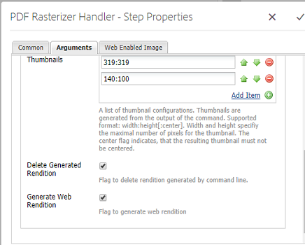

# 使用PDF點陣化器 {#using-pdf-rasterizer}

有時，當您上傳大型、內容密集的PDF或AI檔案至Adobe Experience Manager(AEM)Assets時，預設資料庫可能無法產生正確的輸出。 在這種情況下，Adobe的PDF點陣化器程式庫可產生比預設程式庫的輸出更可靠、更精確的輸出。

Adobe建議針對下列項目使用PDF點陣化器程式庫：

* 大量、內容密集的AI/PDF檔案
* AI/PDF檔案中未產生縮圖
* 具有Pantone Matching System(PMS)色彩的AI檔案

使用PDF點陣化器產生的縮圖和預覽，與現成可用的輸出相比，品質更佳，因此可跨裝置提供一致的檢視體驗。 Adobe PDF Rasterizer程式庫不支援任何色域轉換。 無論來源檔案的色域為何，都會輸出為RGB。

1. 從「封裝共用」在您的AEM例項上安裝PDF點陣 [化器套件](https://www.adobeaemcloud.com/content/marketplace/marketplaceProxy.html?packagePath=/content/companies/public/adobe/packages/cq640/product/assets/aem-assets-pdf-rasterizer-pkg)。

   >[!NOTE]
   >
   >PDF點陣化器程式庫僅適用於Windows和Linux。

1. 請在存取AEM Assets工作流程主控台 `https://[server]:[port]/workflow`。

   開啟「DAM更新資產」工作流程頁面。

1. 若要防止使用預設方法產生PDF和AI檔案的縮圖和Web轉譯，請依照下列步驟進行：

   * 開啟「 **[!UICONTROL 處理縮圖]** 」步驟，並根據需要在「縮圖」頁籤下添加或在「跳過Mime類型」欄位中添加縮圖，或在「縮圖類型 `application/pdf` 」欄位中添加或在「縮 `application/postscript`******** 圖」頁籤下添加縮圖。
   

   * 在「啟用 **[!UICONTROL 網頁的影像]** 」索引標籤中，根據您的需求，在「略過清單」 `application/pdf` (Skip List `application/postscript`**** )下新增或下方。
   

1. 開啟「點 **[!UICONTROL 陣化PDF/AI影像預覽轉譯」步驟]** ，並移除您要略過預設產生預覽影像轉譯的MIME類型。 例如，從「MIME類型」 `application/pdf`清單 `application/postscript`中 `application/illustrator` 刪除 **[!UICONTROL MIME類型]** 。

   

1. 將「 **[!UICONTROL PDF點陣化器處理常式]** 」步驟從側面板拖曳至「處理縮圖」 **[!UICONTROL 步驟的下方]** 。
1. 為「 **[!UICONTROL PDF點陣化器處理常式」步驟設定下列引數]** :

   * MIME類型： `application/pdf` 或 `application/postscript`

   * 命令: `PDFRasterizer -d -p 1 -s 1280 -t PNG -i ${file}`
   * 新增縮圖大小：319:319, 140:100, 48:48。 視需要新增自訂縮圖設定。
   該命令的命令行參 `PDFRasterizer` 數可以包括以下內容：

   * `-d`:標幟可讓文字、向量圖稿和影像順暢呈現。 建立更高品質的影像。 不過，加入此參數會導致命令執行緩慢，並增加影像大小。

   * `-p`:頁碼。 預設值是所有頁面。 &#39;*&#39;表示所有頁面。

   * `-s`:最大影像尺寸（高度或寬度）。 這會針對每個頁面轉換為DPI。 如果頁面大小不同，每個頁面可能會依不同的數量進行縮放。 預設值為實際頁面大小。

   * `-t`:輸出影像類型。 有效類型有JPEG、PNG、GIF和BMP。 預設值為JPEG。

   * `-i`:輸入PDF的路徑。 此參數為強制參數。

   * `-h`: 說明

1. 要刪除中間轉譯，請選擇「刪 **[!UICONTROL 除生成的轉譯」]**。
1. 若要讓PDF點陣化產生Web轉譯，請選取「產 **[!UICONTROL 生Web轉譯」]**。

   

1. 在「啟用網頁的影像」 **[!UICONTROL 索引標籤中指定設定]** 。

   

1. 儲存工作流程。
1. 若要啟用PDF點陣化器以使用PDF程式庫處理PDF頁面，請從工作流程主控台開啟 **[!UICONTROL DAM Process Subset]** model。
1. 從側面面板，拖曳「建立啟用網頁的影像轉譯」步驟 **[!UICONTROL 下的「PDF點陣化處理常式」步驟]** 。
1. 為「 **[!UICONTROL PDF點陣化器處理常式」步驟設定下列引數]** :

   * MIME類型： `application/pdf` 或 `application/postscript`

   * 命令: `PDFRasterizer -d -p 1 -s 1280 -t PNG -i ${file}`
   * 新增縮圖大小：319:319, 140:100, 48:48。 視需要新增自訂縮圖設定。
   PDFRasterizer命令的命令行參數可以包括：

   * `-d`:標幟可讓文字、向量圖稿和影像順暢呈現。 建立更高品質的影像。 不過，加入此參數會導致命令執行緩慢，並增加影像大小。

   * `-p`:頁碼。 預設值是所有頁面。 `*` 表示所有頁面。

   * `-s`:最大影像尺寸（高度或寬度）。 這會針對每個頁面轉換為DPI。 如果頁面大小不同，每個頁面可能會依不同的數量進行縮放。 預設值為實際頁面大小。

   * `-t`:輸出影像類型。 有效類型有JPEG、PNG、GIF和BMP。 預設值為JPEG。

   * `-i`:輸入PDF的路徑。 此參數為強制參數。

   * `-h`: 說明

1. 要刪除中間轉譯，請選擇「刪 **[!UICONTROL 除生成的轉譯」]**。
1. 若要讓PDF點陣化產生Web轉譯，請選取「產 **[!UICONTROL 生Web轉譯」]**。

   

1. 在「啟用網頁的影像」 **[!UICONTROL 索引標籤中指定設定]** 。

   

1. 儲存工作流程。
1. 將PDF或AI檔案上傳至AEM Assets。 PDF點陣化器會產生檔案的縮圖和網頁轉譯。
