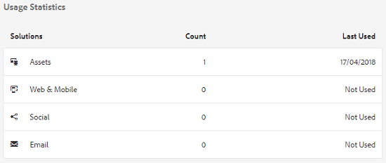

# Assets Insights {#asset-insights}

| 版本 | 文章連結 |
| -------- | ---------------------------- |
| AEM as a Cloud Service  | [按一下這裡](https://experienceleague.adobe.com/docs/experience-manager-cloud-service/content/assets/manage/assets-insights.html?lang=zh-Hant) |
| AEM 6.5 | 本文章 |

Assets Insights功能可讓您追蹤用於協力廠商網站、行銷活動和Adobe創意解決方案之影像的使用者評等和使用情況統計資料。 這有助於獲得有關其效能和人氣的深入分析。

[!DNL Assets]深入分析會擷取使用者活動詳細資料，例如影像的評分、點按和曝光次數（影像載入網站的次數）。 系統會根據這些統計資料，將分數指派給影像。 您可以使用評分和效能統計資料來選取常用影像，以包含在目錄、行銷活動等中。 您甚至可以根據這些統計資料制定封存和授權更新政策。

若要讓[!DNL Assets]深入分析從網站擷取影像的使用狀況統計資料，您必須在網站程式碼中包含影像的內嵌程式碼。

若要讓Assets Insights顯示資產的使用狀況統計資料，請先設定功能，以從Adobe Analytics擷取報表資料。 如需詳細資訊，請參閱[設定Assets Insights](/help/assets/configure-asset-insights.md)。 若要在內部部署安裝中使用此功能，請另外購買[!DNL Adobe Analytics]授權。 [!DNL Managed Services]的客戶會收到與[!DNL Experience Manager]繫結的[!DNL Analytics]授權。 請參閱[Managed Services產品說明](https://helpx.adobe.com/tw/legal/product-descriptions/adobe-experience-manager-managed-services.html)。

>[!NOTE]
>
>僅支援並為影像提供深入分析。

## 檢視影像的統計資料 {#viewing-statistics-for-an-image}

您可以從中繼資料頁面檢視Assets Insights分數。

1. 從[!DNL Assets]使用者介面(UI)，選取影像，然後從工具列按一下&#x200B;**[!UICONTROL 屬性]**。
1. 從「屬性」頁面，按一下「**[!UICONTROL Insights]**」標籤。
1. 檢閱&#x200B;**[!UICONTROL Insights]**&#x200B;索引標籤中資產的使用狀況詳細資料。 **[!UICONTROL 分數]**&#x200B;區段說明資產的資產使用總計和效能差距。

   使用分數說明資產在各種解決方案中的使用次數。

   **[!UICONTROL 曝光次數]**&#x200B;分數是資產載入網站上的次數。 在&#x200B;**[!UICONTROL 點按]**&#x200B;下顯示的數字是資產的點按次數。

1. 請檢閱&#x200B;**[!UICONTROL 使用統計資料]**&#x200B;區段，瞭解資產所屬的實體，以及最近使用它的創意解決方案。 使用量越高，資產在使用者中受歡迎的可能性就越大。 使用情況資料會顯示在下列標題下：

   * **資產**：資產屬於集合或複合資產的次數
   * **網頁與行動裝置**：資產屬於網站與應用程式一部分的次數
   * **社交**：解決方案中使用資產的次數，例如Adobe Social和Adobe Campaign
   * **電子郵件**：在電子郵件行銷活動中使用資產的次數

   

   >[!NOTE]
   >
   >由於Assets Insights功能通常會定期從Adobe Analytics擷取解決方案資料，因此「解決方案」區段可能不會顯示最新資料。 資料顯示的時間長度取決於Assets Insights為擷取Analytics資料而執行的擷取作業排程。

1. 要以圖形方式查看某個時段內資產的效能統計資訊，請在「效能統計資訊」部分中 **[!UICONTROL 選擇該時段]** 。詳細資訊 (包括點按次數和印象) 會顯示為圖形的趨勢線。

   

   >[!NOTE]
   >
   >與「解決方案」段落中的資料不同，「效能統計資料」段落會顯示最新的資料。

1. 若要取得您包含在網站中之資產的內嵌程式碼，以取得效能資料，請按一下資產縮圖下方的&#x200B;**[!UICONTROL 取得內嵌程式碼]**。 如需如何在協力廠商網頁中包含內嵌程式碼的詳細資訊，請參閱[在網頁中使用頁面追蹤器和內嵌程式碼](/help/assets/use-page-tracker.md)。

   

## 檢視影像的彙總統計資料 {#viewing-aggregate-statistics-for-images}

您可以使用前瞻分析檢視同時檢視資料夾內所有資產 **[!UICONTROL 的分數]**。

1. 在[!DNL Assets]使用者介面中，導覽至包含您要檢視其見解的資產的資料夾。
1. 按一下工具列中的[配置]，然後選擇&#x200B;**[!UICONTROL 前瞻分析檢視]**。
1. 頁面會顯示資產的使用情況分數。 比較各種資產的評等並得出深入見解。

## 排程背景工作 {#scheduling-background-job}

Assets Insights會定期從Adobe Analytics報表套裝擷取資產的使用情況資料。 根據預設，Assets Insights會在凌晨2:00每隔24小時執行背景工作以擷取資料。 不過，您可以從Web主控台設定&#x200B;**[!UICONTROL Adobe CQ DAM Asset Performance Report Sync Job]**&#x200B;服務，以修改頻率和時間。

1. 按一下[!DNL Experience Manager]標誌，然後前往&#x200B;**[!UICONTROL 工具]** > **[!UICONTROL 作業]** > **[!UICONTROL 網頁主控台]**。
1. 開啟&#x200B;**[!UICONTROL Adobe CQ DAM Asset效能報告同步工作]**&#x200B;服務設定。

   

1. 在屬性排程器運算式中，指定所需的排程器頻率和工作的開始時間。 儲存變更。
