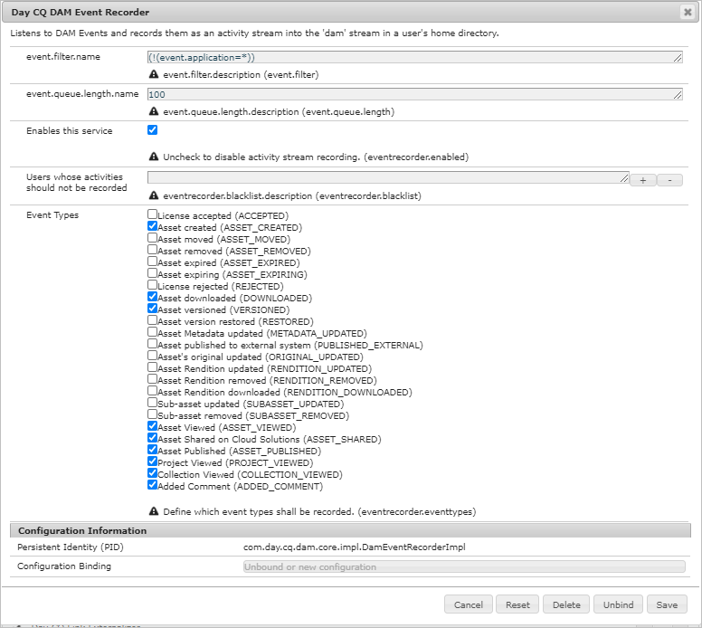

# 資產報表 {#asset-reports}

| 版本 | 文章連結 |
| -------- | ---------------------------- |
| AEM as a Cloud Service  | [按一下這裡](https://experienceleague.adobe.com/docs/experience-manager-cloud-service/content/assets/admin/asset-reports.html?lang=en) |
| AEM 6.5 | 本文 |

資產報表可讓您評估 [!DNL Adobe Experience Manager Assets] 部署。 使用 [!DNL Assets]，您可以為數位資產產生各種報表。 這些報表提供您系統使用情形、使用者與資產互動方式，以及下載和共用哪些資產的實用資訊。

使用報表中的資訊來衍生關鍵成功量度，以測量 [!DNL Assets] 和客戶。

此 [!DNL Assets] 報告框架使用 [!DNL Sling] 作業，以非同步方式處理報表請求。 它可針對大型存放庫進行擴充。 非同步報表處理可提高報表產生的效率和速度。

報表管理介面是直觀的，包含微調選項和控制項，可存取封存的報表和檢視報表執行狀態（成功、失敗和已排入佇列）。

產生報表時，您會透過電子郵件（選用）和收件匣通知收到通知。 您可以從報表清單頁面檢視、下載或刪除報表，該頁面會顯示所有先前產生的報表。

## 必備條件 {#prerequisite-for-reporting}

要生成報告，請執行以下操作：

* 啟用 [!UICONTROL Day CQ DAM事件記錄器] 服務 **[!UICONTROL 工具]** > **[!UICONTROL 操作]** > **[!UICONTROL Web主控台]**.
* 選取您要報告的活動或事件。 例如，若要產生下載資產的報表，請選取 [!UICONTROL 已下載資產（已下載）].

## 產生報表 {#generate-reports}

[!DNL Experience Manager Assets] 會為您產生下列標準報表：

* 上傳
* 下載
* 過期
* 修改
* 發佈
* [!DNL Brand Portal] 發佈
* 磁碟使用情況
* 檔案
* 連結共用

[!DNL Adobe Experience Manager] 管理員可輕鬆為您的實施產生和自訂這些報表。 管理員可依照下列步驟產生報表：

1. 在 [!DNL Experience Manager] 介面，按一下 **[!UICONTROL 工具]** > **[!UICONTROL 資產]** > **[!UICONTROL 報表]**.

   

1. 在 [!UICONTROL 資產報表] 頁面，按一下 **[!UICONTROL 建立]** 的上界。
1. 從 **[!UICONTROL 建立報表]** 頁面，選擇要建立的報表並按一下 **[!UICONTROL 下一個]**.

   

   >[!NOTE]
   >
   >依預設，內容片段和連結共用會包含在資產中 [!UICONTROL 下載] 報表。 選取適當的選項，以建立連結分享的報表，或從下載報表中排除內容片段。

   >[!NOTE]
   >
   >此 [!UICONTROL 下載] 報表只會顯示在個別選取後下載或使用快速動作下載的資產詳細資訊。 不過，它不包含下載資料夾內資產的詳細資訊。

1. 在儲存報表的CRX存放庫中設定報表詳細資訊，例如標題、說明、縮圖和資料夾路徑。 依預設，資料夾路徑為 `/content/dam`. 您可以指定不同的路徑。

   

   選擇報表的日期範圍。

   您可以選擇立即產生報表，或在日後的日期和時間產生。

   >[!NOTE]
   >
   >如果您選擇稍後排程報表，請務必在「日期和時間」欄位中指定日期和時間。 如果您未指定任何值，報表引擎會將其視為要立即產生的報表。

   設定欄位可能會因您建立的報表類型而異。 例如， **[!UICONTROL 磁碟使用情況]** 「報表」提供計算資產使用的磁碟空間時包含資產轉譯的選項。 您可以選擇在子資料夾中包含或排除資產，以便計算磁碟使用量。

   >[!NOTE]
   >
   >「磁 **[!UICONTROL 碟使用情況]** 」報表不包含日期範圍欄位，因為它僅表示目前的磁碟空間使用情況。

   

   當您建立 **[!UICONTROL 檔案]** 報告中，您可以包含/排除子資料夾。 不過，您不能為此報表包含資產轉譯。

   

   此 **[!UICONTROL 連結共用]** 報表會顯示資產的URL，這些資產是從內與外部使用者共用 [!DNL Assets]. 它包含共用資產之使用者的電子郵件ID、共用資產之使用者的電子郵件ID、連結的共用日期和到期日。欄無法自訂。

   此 **[!UICONTROL 連結共用]** 報表中，不會包含子資料夾和轉譯的選項，因為它只會發佈顯示在下方的共用URL `/var/dam/share`.

   

1. 按一下 **[!UICONTROL 下一個]** 的上界。

1. 在 **[!UICONTROL 配置列]** 頁面，則預設會選取某些欄以顯示在報表中。 您可以選取更多欄。 取消選取要在報表中排除的欄。

   

   若要顯示自訂欄名稱或屬性路徑，請在 `jcr:content` 節點。 或者，透過屬性路徑選擇器新增它。

   

1. 按一下 **[!UICONTROL 建立]** 的上界。 訊息會通知報表產生已開始。
1. 在 [!UICONTROL 資產報表] 頁面，則報表產生狀態會以報表工作的目前狀態為基礎，例如 [!UICONTROL 成功], [!UICONTROL 失敗], [!UICONTROL 已排隊]，或 [!UICONTROL 已排程]. 通知收件箱中會顯示相同的狀態。若要查看報告頁，請按一下報告連結。 或者，選取報表，然後按一下 **[!UICONTROL 檢視]** 的上界。

   

   按一下 **[!UICONTROL 下載]** 從工具列下載CSV格式的報表。

## 新增自訂欄 {#add-custom-columns}

您可以新增自訂欄至下列報表，以根據自訂需求顯示更多資料：

* 上傳
* 下載
* 過期
* 修改
* 發佈
* [!DNL Brand Portal] 發佈
* 檔案

若要將自訂欄新增至這些報表，請遵循下列步驟：

1. 在 [!DNL Manager interface]，按一下 **[!UICONTROL 工具]** > **[!UICONTROL 資產]** > **[!UICONTROL 報表]**.
1. 在 [!UICONTROL 資產報表] 頁面，按一下 **[!UICONTROL 建立]** 的上界。

1. 從 **[!UICONTROL 建立報表]** 頁面，選擇要建立的報表並按一下 **[!UICONTROL 下一個]**.
1. 視情況設定報表詳細資訊，例如標題、說明、縮圖、資料夾路徑和日期範圍。

1. 要顯示自定義列，請在「自定義列」下指定列 **[!UICONTROL 的名稱]**。

   

1. 在下新增屬性路徑 `jcr:content` 節點（使用屬性路徑選擇器）。 或者，在屬性路徑欄位中輸入路徑。

   

   若要新增更多自訂欄，請按一下 **[!UICONTROL 新增]** 重複步驟5和6。

1. 按一下 **[!UICONTROL 建立]** 的上界。 訊息會通知報表產生已開始。

## 配置清除服務 {#configure-purging-service}

若要移除您不再需要的報表，請從Web主控台設定「DAM報表清除」服務，以根據現有報表的數量和年齡來清除現有報表。

1. 從 `https://[aem_server]:[port]/system/console/configMgr`.
1. 開啟 **[!UICONTROL DAM報表清除服務]** 設定。
1. 在 `scheduler.expression.name` 欄位。 您也可以設定報表的年齡和數量臨界值。
1. 儲存變更。

## 疑難排解資訊、提示和限制 {#best-practices-and-limitations}

* 如果報表中的某些報表或數字無法使用或如預期運作，請確定 [!UICONTROL Day CQ DAM事件記錄器] 服務已啟用。

* 移除不再需要的報表。 使用DAM報表清除服務中的設定選項，設定清除報表的條件。

* 如果未生成磁碟使用情況報告，並且您正在使用 [!DNL Dynamic Media]，確認所有資產皆正確處理。 若要解析，請重新處理資產，然後重新產生報表。
