# 資產報表 {#asset-reports}

| 版本 | 文章連結 |
| -------- | ---------------------------- |
| AEM as a Cloud Service | [按一下這裡](https://experienceleague.adobe.com/docs/experience-manager-cloud-service/content/assets/admin/asset-reports.html?lang=zh-Hant) |
| AEM 6.5 | 本文章 |

資產報告可讓您評估[!DNL Adobe Experience Manager Assets]部署的公用程式。 透過[!DNL Assets]，您可以為您的數位資產產生各種報告。 這些報表提供關於您系統使用情況、使用者如何與資產互動，以及哪些資產已下載和共用的有用資訊。

使用報告中的資訊取得關鍵成功度量，以測量企業內和客戶對[!DNL Assets]的採用程度。

[!DNL Assets]報告架構使用[!DNL Sling]個工作，以循序方式非同步處理報告要求。 其可擴展至大型存放庫。 非同步報表處理可提高報表產生的效率和速度。

報表管理介面是直覺式的，並包含存取已封存報表和檢視報表執行狀態（成功、失敗和已排入佇列）的細微選項和控制項。

產生報表時，系統會透過電子郵件（選用）和收件匣通知來通知您。 您可以從報告清單頁面檢視、下載或刪除報告，該頁面會顯示所有先前產生的報告。

## 必備條件 {#prerequisite-for-reporting}

若要產生報表，請執行下列動作：

* 從&#x200B;**[!UICONTROL 工具]** > **[!UICONTROL 作業]** > **[!UICONTROL 網頁主控台]**&#x200B;啟用[!UICONTROL Day CQ DAM事件記錄器]服務。
* 選取您要報告的活動或事件。 例如，若要產生已下載資產的報表，請選取[!UICONTROL 已下載資產（已下載）]。

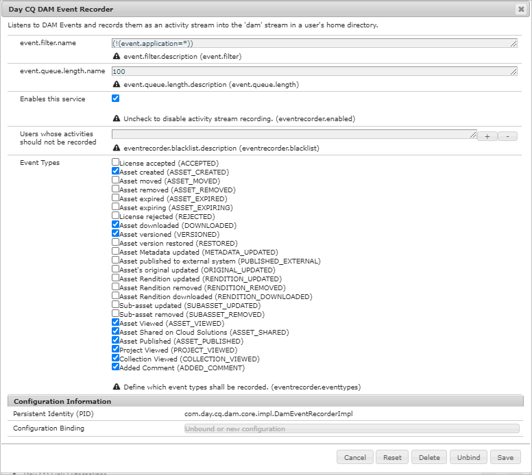

## 產生報表 {#generate-reports}

[!DNL Experience Manager Assets]為您產生下列標準報表：

* 上傳
* 下載
* 過期
* 修改
* 發佈
* [!DNL Brand Portal]發佈
* 磁碟使用情況
* 檔案
* 連結共用

[!DNL Adobe Experience Manager]管理員可針對您的實作輕鬆產生和自訂這些報表。 管理員可以依照下列步驟產生報表：

1. 在[!DNL Experience Manager]介面中，按一下&#x200B;**[!UICONTROL 工具]** > **[!UICONTROL Assets]** > **[!UICONTROL 報表]**。

   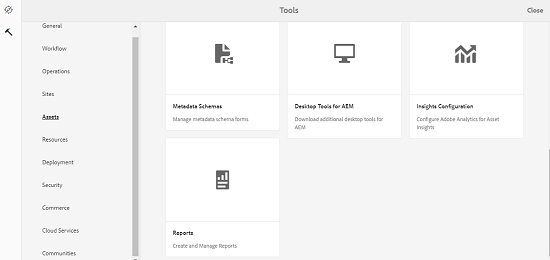

1. 在[!UICONTROL 資產報表]頁面上，按一下工具列中的&#x200B;**[!UICONTROL 建立]**。
1. 從&#x200B;**[!UICONTROL 建立報告]**&#x200B;頁面，選擇要建立的報告並按一下&#x200B;**[!UICONTROL 下一步]**。

   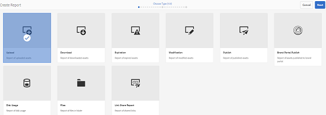

   >[!NOTE]
   >
   >依照預設，內容片段和連結共用會包含在資產[!UICONTROL 下載]報表中。 選取適當的選項以建立連結共用報表，或從下載報表中排除內容片段。

   >[!NOTE]
   >
   >「[!UICONTROL 下載]」報表只會顯示個別選取後下載的資產，或使用「快速動作」下載的資產的詳細資料。 但不包含下載資料夾內資產的詳細資訊。

1. 在儲存報表的CRX存放庫中設定報表詳細資訊，例如：標題、說明、縮圖和資料夾路徑。 預設的資料夾路徑為`/content/dam`。 您可以指定不同的路徑。

   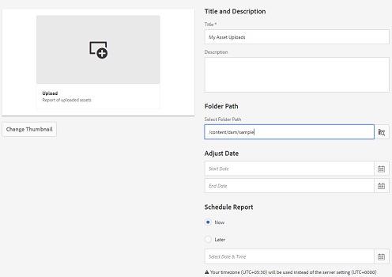

   選擇報表的日期範圍。

   您可以選擇現在產生報表，或在未來的日期和時間產生報表。

   >[!NOTE]
   >
   >如果您選擇稍後排程報表，請務必在「日期」和「時間」欄位中指定日期和時間。 如果您未指定任何值，報表引擎會將其視為要立即產生的報表。

   設定欄位可能會因您建立的報告型別而異。 例如，「**[!UICONTROL 磁碟使用量]**」報表提供選項，可在計算資產使用的磁碟空間時包含資產轉譯。 您可以選擇在子資料夾中包含或排除資產以計算磁碟使用量。

   >[!NOTE]
   >
   >「磁 **[!UICONTROL 碟使用情況]** 」報表不包含日期範圍欄位，因為它僅表示目前的磁碟空間使用情況。

   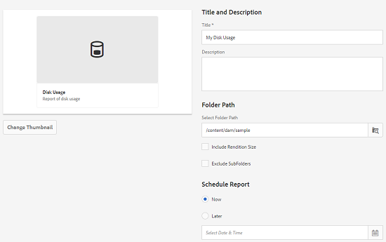

   建立&#x200B;**[!UICONTROL 檔案]**&#x200B;報告時，您可以包含/排除子資料夾。 不過，您無法包含此報表的資產轉譯。

   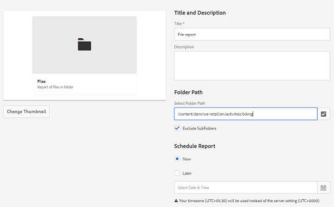

   「**[!UICONTROL 連結共用]**」報表會顯示資產的URL，這些資產是從[!DNL Assets]內與外部使用者共用的。 它包含共用資產之使用者的電子郵件ID、共用資產之使用者的電子郵件ID、連結的共用日期和過期日。 欄無法自訂。

   **[!UICONTROL 連結共用]**&#x200B;報告不包含子資料夾和轉譯的選項，因為它只會發佈顯示在`/var/dam/share`下的共用URL。

   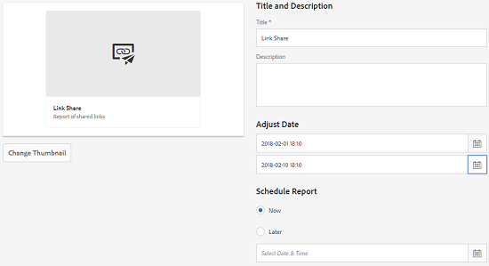

1. Click **[!UICONTROL Next]** from the toolbar.

1. In the **[!UICONTROL Configure Columns]** page, some columns are selected to appear in the report by default. You can select more columns. Cancel the selection of a column to exclude it in the report.

   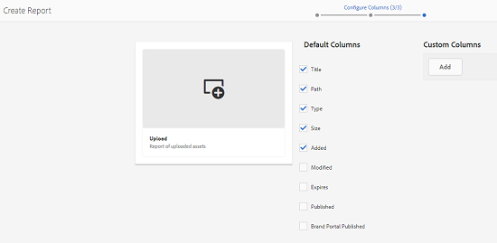

   To display a custom column name or property path, configure the properties for the asset binary under the `jcr:content` node in CRX. Alternatively, add it through property path picker.

   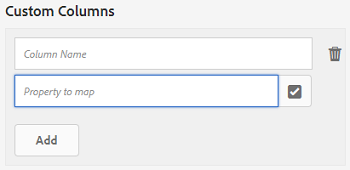

1. Click **[!UICONTROL Create]** from the toolbar. A message notifies that report generation has been initiated.
1. On the [!UICONTROL Asset Reports] page, the report generation status is based on the current state of the report job, for example, [!UICONTROL Success], [!UICONTROL Failed], [!UICONTROL Queued], or [!UICONTROL Scheduled]. The same status appears in the notifications inbox.To view the report page, click the report link. Alternatively, select the report, and click **[!UICONTROL View]** from the toolbar.

   <!--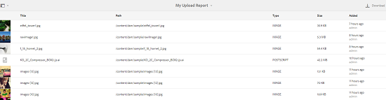-->
   [Report status](assets/report-status.JPG)

   Click **[!UICONTROL Download]** from the toolbar to download the report in CSV format.

## Add custom columns {#add-custom-columns}

You can add custom columns to the following reports to display more data for your custom requirements:

* 上傳
* 下載
* 過期
* 修改
* 發佈
* [!DNL Brand Portal]發佈
* 檔案

To add custom columns to these reports, follow these steps:

1. In the [!DNL Manager interface], click **[!UICONTROL Tools]** > **[!UICONTROL Assets]** > **[!UICONTROL Reports]**.
1. 在[!UICONTROL 資產報表]頁面上，按一下工具列中的&#x200B;**[!UICONTROL 建立]**。

1. 從&#x200B;**[!UICONTROL 建立報告]**&#x200B;頁面，選擇要建立的報告並按一下&#x200B;**[!UICONTROL 下一步]**。
1. Configure report details such as title, description, thumbnail, folder path, and date range as applicable.

1. 要顯示自定義列，請在「自定義列」下指定列 **[!UICONTROL 的名稱]**。

   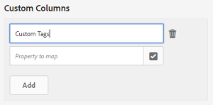

1. Add the property path under the `jcr:content` node in CRXDE using the property path picker. Alternatively, type the path in the property path field.

   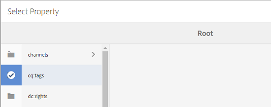

   To add more custom columns, click **[!UICONTROL Add]** and repeat steps 5 and 6.

1. Click **[!UICONTROL Create]** from the toolbar. A message notifies that report generation has been initiated.

## Configure purging service {#configure-purging-service}

To remove reports that you no longer require, configure the DAM Report Purge service from the web console to purge existing reports based on their quantity and age.

1. Access the web console (configuration manager) from `https://[aem_server]:[port]/system/console/configMgr`.
1. Open the **[!UICONTROL DAM Report Purge Service]** configuration.
1. Specify the frequency (time interval) for the purging service in the `scheduler.expression.name` field. You can also configure the age and the quantity threshold for reports.
1. 儲存變更。

## Troubleshooting information, tips, and limitations {#best-practices-and-limitations}

* If some reports or numbers in the reports are not available or as expected, ensure that [!UICONTROL Day CQ DAM Event Recorder] service is enabled.

* Remove the reports that are no longer required. Use the configuration options in the DAM Report Purge service to configure the criteria to purge reports.

* If the Disk Usage Report does not generate and you are using [!DNL Dynamic Media], ensure that all assets are proceed correctly. To resolve, reprocess the assets and then generate the report again.
