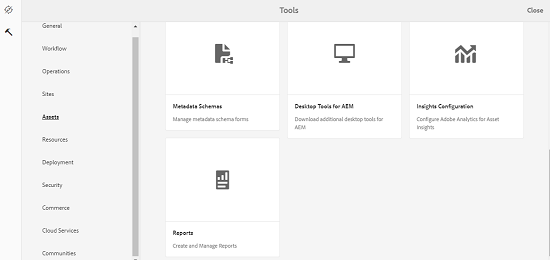

# 資產報表 {#asset-reports}

| 版本 | 文章連結 |
| -------- | ---------------------------- |
| AEM as a Cloud Service  | [按一下這裡](https://experienceleague.adobe.com/docs/experience-manager-cloud-service/content/assets/admin/asset-reports.html?lang=en) |
| AEM 6.5 | 本文章 |

資產報告可讓您評估[!DNL Adobe Experience Manager Assets]部署的公用程式。 透過[!DNL Assets]，您可以為您的數位資產產生各種報告。 這些報表提供關於您系統使用情況、使用者如何與資產互動，以及哪些資產已下載和共用的有用資訊。

使用報告中的資訊取得關鍵成功度量，以測量企業內和客戶對[!DNL Assets]的採用程度。

[!DNL Assets]報告架構使用[!DNL Sling]個工作，以循序方式非同步處理報告要求。 其可擴展至大型存放庫。 非同步報表處理可提高報表產生的效率和速度。

報表管理介面是直覺式的，並包含存取已封存報表和檢視報表執行狀態（成功、失敗和已排入佇列）的細微選項和控制項。

產生報表時，系統會透過電子郵件（選用）和收件匣通知來通知您。 您可以從報告清單頁面檢視、下載或刪除報告，該頁面會顯示所有先前產生的報告。

## 必備條件 {#prerequisite-for-reporting}

若要產生報表，請執行下列動作：

* 從&#x200B;**[!UICONTROL 工具]** > **[!UICONTROL 作業]** > **[!UICONTROL 網頁主控台]**&#x200B;啟用[!UICONTROL Day CQ DAM事件記錄器]服務。
* 選取您要報告的活動或事件。 例如，若要產生已下載資產的報表，請選取[!UICONTROL 已下載資產（已下載）]。

## 產生報表 {#generate-reports}

[!DNL Experience Manager Assets]為您產生下列標準報表：

* 上傳
* 下載
* 過期
* 修改
* 發佈
* [!DNL Brand Portal]發佈
* 磁碟使用情況
* 檔案
* 連結共用

[!DNL Adobe Experience Manager]管理員可針對您的實作輕鬆產生和自訂這些報表。 管理員可以依照下列步驟產生報表：

1. 在[!DNL Experience Manager]介面中，按一下&#x200B;**[!UICONTROL 工具]** > **[!UICONTROL Assets]** > **[!UICONTROL 報表]**。

   

1. 在[!UICONTROL 資產報表]頁面上，按一下工具列中的&#x200B;**[!UICONTROL 建立]**。
1. 從&#x200B;**[!UICONTROL 建立報告]**&#x200B;頁面，選擇要建立的報告並按一下&#x200B;**[!UICONTROL 下一步]**。

   

   >[!NOTE]
   >
   >依照預設，內容片段和連結共用會包含在資產[!UICONTROL 下載]報表中。 選取適當的選項以建立連結共用報表，或從下載報表中排除內容片段。

   >[!NOTE]
   >
   >「[!UICONTROL 下載]」報表只會顯示個別選取後下載的資產，或使用「快速動作」下載的資產的詳細資料。 但不包含下載資料夾內資產的詳細資訊。

1. 在儲存報表的CRX存放庫中設定報表詳細資訊，例如：標題、說明、縮圖和資料夾路徑。 預設的資料夾路徑為`/content/dam`。 您可以指定不同的路徑。

   

   選擇報表的日期範圍。

   您可以選擇現在產生報表，或在未來的日期和時間產生報表。

   >[!NOTE]
   >
   >如果您選擇稍後排程報表，請務必在「日期」和「時間」欄位中指定日期和時間。 如果您未指定任何值，報表引擎會將其視為要立即產生的報表。

   設定欄位可能會因您建立的報告型別而異。 例如，「**[!UICONTROL 磁碟使用量]**」報表提供選項，可在計算資產使用的磁碟空間時包含資產轉譯。 您可以選擇在子資料夾中包含或排除資產以計算磁碟使用量。

   >[!NOTE]
   >
   >「磁 **[!UICONTROL 碟使用情況]** 」報表不包含日期範圍欄位，因為它僅表示目前的磁碟空間使用情況。

   

   建立&#x200B;**[!UICONTROL 檔案]**&#x200B;報告時，您可以包含/排除子資料夾。 不過，您無法包含此報表的資產轉譯。

   

   「**[!UICONTROL 連結共用]**」報表會顯示資產的URL，這些資產是從[!DNL Assets]內與外部使用者共用的。 它包含共用資產之使用者的電子郵件ID、共用資產之使用者的電子郵件ID、連結的共用日期和到期日。欄無法自訂。

   **[!UICONTROL 連結共用]**&#x200B;報告不包含子資料夾和轉譯的選項，因為它只會發佈顯示在`/var/dam/share`下的共用URL。

   

1. 按一下工具列中的&#x200B;**[!UICONTROL 下一步]**。

1. 在&#x200B;**[!UICONTROL 設定資料行]**&#x200B;頁面中，預設會選取報表中顯示的某些資料行。 您可以選取更多欄。 取消選取欄以在報告中將其排除。

   

   若要顯示自訂欄名稱或屬性路徑，請在CRX的`jcr:content`節點下設定資產二進位檔的屬性。 或者，透過屬性路徑選擇器新增路徑。

   

1. 從工具列按一下&#x200B;**[!UICONTROL 「建立]**」。 訊息會通知已啟動報表產生作業。
1. 在[!UICONTROL 資產報表]頁面上，報表產生狀態是以報表工作的目前狀態為基礎，例如[!UICONTROL 成功]、[!UICONTROL 失敗]、[!UICONTROL 已排入佇列]或[!UICONTROL 已排程]。 相同的狀態會顯示在通知收件匣中。若要檢視報告頁面，請按一下報告連結。 或者，選取報告，然後按一下工具列中的&#x200B;**[!UICONTROL 檢視]**。

   <!---->
   [報告狀態](assets/report-status.JPG)

   按一下工具列中的「下載&#x200B;****」，以CSV格式下載報表。

## 新增自訂欄 {#add-custom-columns}

您可以將自訂欄新增到以下報表，以顯示更多符合自訂需求的資料：

* 上傳
* 下載
* 過期
* 修改
* 發佈
* [!DNL Brand Portal]發佈
* 檔案

若要新增自訂欄到這些報表，請執行下列步驟：

1. 在[!DNL Manager interface]中，按一下&#x200B;**[!UICONTROL 工具]** > **[!UICONTROL Assets]** > **[!UICONTROL 報表]**。
1. 在[!UICONTROL 資產報表]頁面上，按一下工具列中的&#x200B;**[!UICONTROL 建立]**。

1. 從&#x200B;**[!UICONTROL 建立報告]**&#x200B;頁面，選擇要建立的報告並按一下&#x200B;**[!UICONTROL 下一步]**。
1. 視情況設定標題、說明、縮圖、資料夾路徑和日期範圍等報表詳細資訊。

1. 要顯示自定義列，請在「自定義列」下指定列 **[!UICONTROL 的名稱]**。

   自訂資料行的名稱

1. 使用屬性路徑選擇器，在CRXDE中的`jcr:content`節點下新增屬性路徑。 或者，在屬性路徑欄位中輸入路徑。

   中的路徑對應屬性路徑

   若要新增更多自訂欄，請按一下[新增] ****&#x200B;並重複步驟5和6。

1. 從工具列按一下&#x200B;**[!UICONTROL 「建立]**」。 訊息會通知已啟動報表產生作業。

## 設定清除服務 {#configure-purging-service}

若要移除您不再需要的報表，請從Web主控台設定「DAM報表清除」服務，以根據其數量和年齡清除現有報表。

1. 從`https://[aem_server]:[port]/system/console/configMgr`存取Web主控台（組態管理員）。
1. 開啟&#x200B;**[!UICONTROL DAM報告清除服務]**&#x200B;設定。
1. 在`scheduler.expression.name`欄位中指定清除服務的頻率（時間間隔）。 您也可以設定報表的年齡和數量臨界值。
1. 儲存變更。

## 疑難排解資訊、提示和限制 {#best-practices-and-limitations}

* 如果報表中的某些報表或數字無法使用或無法如預期使用，請確定已啟用[!UICONTROL Day CQ DAM Event Recorder]服務。

* 移除不再需要的報表。 使用DAM報告清除服務中的設定選項來設定清除報告的條件。

* 如果未產生「磁碟使用量報表」，而您正在使用[!DNL Dynamic Media]，請確定所有資產皆正確繼續。 若要解決，請重新處理資產，然後再次產生報表。
