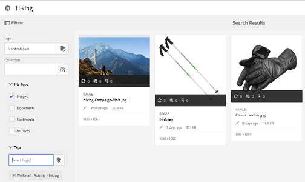

# 資產選擇器 {#asset-selector}

>[!NOTE]
>
>系統呼叫了資產選擇器 [資產選擇器](https://helpx.adobe.com/experience-manager/6-2/assets/using/asset-picker.html) 在舊版 [!DNL Experience Manager].

資產選擇器可讓您在 [!DNL Adobe Experience Manager] 資產。 您也可以使用資產選擇器擷取所選資產的中繼資料。 若要自訂資產選擇器介面，您可以使用支援的請求參數啟動它。 這些參數會設定特定案例的資產選取器內容。

目前，您可以傳遞要求參數 `assettype` (*影像/影片/文字*)和選取 `mode` (*單一/多個*)作為資產選取器的內容資訊，在整個選取項目中都保持不變。

資產選擇器使用HTML5 **Window.postMessage** 訊息，將所選資產的資料傳送給收件者。

資產選擇器以Granite的基礎選擇器辭匯為基礎。 依預設，資產選擇器會在瀏覽模式中運作。 不過，您可以使用Omnisearch體驗套用篩選器，以調整您對特定資產的搜尋。

您可以將任何網頁（無論其是否屬於CQ容器）與資產選擇器(`https://[AEM_server]:[port]/aem/assetpicker.html`)。

## 內容參數 {#contextual-parameters}

您可以在URL中傳遞下列要求參數，以在特定內容中啟動資產選取器：

| 名稱 | 值 | 範例 | 用途 |
|---|---|---|---|
| 資源尾碼(B) | 在URL中作為資源尾碼的資料夾路徑：`http://localhost:4502/aem/` `assetpicker.html/<folder_path>` | 若要啟動已選取特定資料夾的資產選取器，例如在資料夾中 `/content/dam/we-retail/en/activities` 選取，則URL應為： `http://localhost:4502/aem/assetpicker.html` `/content/dam/we-retail/en/activities?assettype=images` | 如果在啟動資產選取器時需要選取特定資料夾，請以資源尾碼的形式傳遞。 |
| 模式 | 單一，多個 | `http://localhost:4502/aem/assetpicker.html` `?mode=multiple`   `http://localhost:4502/aem/assetpicker.html` `?mode=single` | 在多個模式中，您可以使用資產選擇器同時選取數個資產。 |
| 對話方塊 | true,false | `http://localhost:4502/aem/assetpicker.html` `?dialog=true` | 使用這些參數，以Granite對話方塊的形式開啟資產選取器。 只有當您透過Granite路徑欄位啟動資產選取器，並將其設定為pickerSrc URL時，才適用此選項。 |
| 根 | `<folder_path>` | `http://localhost:4502/aem/` `assetpicker.html?assettype=images` `&root=/content/dam/we-retail/en/activities` | 使用此選項可指定資產選擇器的根資料夾。 在此情況下，資產選擇器可讓您僅選取根資料夾下的子資產（直接/間接）。 |
| 檢視模式 | 搜尋 |  | 若要以搜尋模式啟動資產選取器，並搭配assettype和mimetype參數。 |
| assettype(S) | 影像、文檔、多媒體、檔案 | <ul><li>`http://localhost:4502/aem/assetpicker.html?viewmode=search&assettype=images`</li> <li>`http://localhost:4502/aem/assetpicker.html?viewmode=search&assettype=documents`</li> <li>`http://localhost:4502/aem/assetpicker.html?viewmode=search&assettype=multimedia`</li> <li>`http://localhost:4502/aem/assetpicker.html?viewmode=search&assettype=archives`</li> | 使用此選項，根據傳遞的值來篩選資產類型。 |
| mimetype | mimetype(s)(`/jcr:content/metadata/dc:format`)（也支援萬用字元） | <ul><li>`http://localhost:4502/aem/assetpicker.html?viewmode=search&mimetype=image/png`</li>  <li>`http://localhost:4502/aem/assetpicker.html?viewmode=search&?mimetype=*png`</li>  <li>`http://localhost:4502/aem/assetpicker.html?viewmode=search&mimetype=*presentation`</li>  <li>`http://localhost:4502/aem/assetpicker?viewmode=search&mimetype=*presentation&mimetype=*png`</li></ul> | 使用它根據MIME類型篩選資產 |

## 使用資產選擇器 {#using-the-asset-selector}

1. 若要存取資產選擇器介面，請前往 `https://[AEM_server]:[port]/aem/assetpicker`.
1. 導覽至所需的資料夾，然後選取一或多個資產。

   

   或者，您也可以從OmniSearch方塊搜尋所需資產，然後選取它。

   

   如果您使用OmniSearch方塊搜尋資產，則可從 **[!UICONTROL 篩選器]** 窗格來定義搜索。

   

1. 點選/按一下 **[!UICONTROL 選擇]** 的上界。
