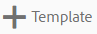

# Asset templates {#asset-templates}

資產範本是一類特殊的資產，可協助您快速將視覺化豐富的內容重新運用於數位和印刷媒體。 資產範本包含兩個部分：固定訊息區段和可編輯區段。

固定訊息區段可包含專屬內容，例如品牌標誌和禁止編輯的版權資訊。 可編輯的區段可在欄位中包含視覺和文字內容，可編輯這些內容以自訂訊息。

在確保全球標牌安全的同時，靈活地進行有限的編輯，使資產模板成為快速調整內容和發佈內容的理想構件，並作為各種功能的內容工件。 重新調整內容用途有助於降低管理印刷和數位通道的成本，並跨這些通道提供全方位且一致的體驗。

身為行銷人員，您可以在AEM Assets中儲存和管理範本，並使用單一基本範本輕鬆建立多種個人化的列印體驗。 您可以建立各種類型的行銷文宣，包括簡介手冊、傳單、明信片、名片等，以便向客戶清楚傳達行銷訊息。 您也可以從現有或新的列印輸出組合多頁列印輸出。 最重要的是，您可以輕鬆同時提供數位和印刷體驗，為使用者提供一致、整合的體驗。

雖然資產範本大多是Adobe inDesign檔案，但是熟悉Adobe inDesign並不妨礙您建立出色的文物。 您不需要將Adobe inDesign範本的欄位與建立目錄時所需的產品欄位對應。 您可以直接在Web介面上，在WYSIWYG模式下編輯範本。 不過，若要讓Adobe inDesign處理您的編輯變更，您必須先設定AEM Assets以與Adobe inDesign伺服器整合。

從網頁介面編輯Adobe inDesign範本的功能有助於促進創意與行銷人員之間的更緊密協作，同時縮短本地促銷活動的上市時間。

您可以使用資產範本執行下列動作：

* 從網頁介面修改可編輯的範本欄位
* 控制文字的基本樣式，例如字型大小、樣式和文字在標籤層級
* 使用內容選擇器變更範本中的影像
* 預覽範本編輯
* 合併多個範本檔案以建立多頁對象

當您為宣傳品選擇範本時，AEM Assets會建立範本復本供您編輯。 原始範本會保留，以確保全域標牌保持完整，並可重複使用以強製品牌一致性。

您可以以下列格式匯出父資料夾內的更新檔案：

* INDD
* PDF
* JPG

您也可以將這些格式的輸出下載到本機系統。

## 建立宣傳品 {#creating-a-collateral}

假設您想要建立數位可列印的宣傳品，例如簡介手冊、傳單和廣告，以便在即將到來的宣傳活動中展示，並與全球的經銷商分享。 根據範本建立宣傳品有助於跨通道提供統一的客戶體驗。 設計人員可以使用創意解決方案（例如InDesign）建立促銷活動範本（單頁或多頁），並為您上傳範本至AEM Assets。 在建立宣傳品之前，請事先將一或多個INDD範本上傳至Experience Manager，並在Experience manager中使用。

1. 按一下或點選AEM標誌，然後按一下／點選「資產」。

1. 從選項中選擇「模 **[!UICONTROL 板」]**。

   

1. 按一下／點 **[!UICONTROL 選「建立]**」，然後從功能表選擇您要建立的宣傳品。 例如，選擇「手 **[!UICONTROL 冊」]**。

   

1. 預先將一或多個INDD範本上傳至Experience Manager，並在Experience manager中使用。 選擇手冊的範本，然後按一下／點選「下 **[!UICONTROL 一步]**」。

   

1. 指定手冊的名稱和選用說明。

   

1. （可選）點選「 **[!UICONTROL 標籤]** 」並為手冊選取一或多個標籤。 點選「 **[!UICONTROL 確認]** 」以確認您的選擇。

   

1. 按一下&#x200B;**[!UICONTROL 「建立」]**。對話方塊會確認已建立新的手冊。 按一下／點選 **[!UICONTROL 「開啟]** 」，以編輯模式開啟手冊。

   <!-- -->

   或者，關閉對話方塊並導覽至您開始使用的「範本」頁面中的資料夾，以檢視您建立的手冊。 在卡片檢視中，文宣的類型會出現在其縮圖上。 例如，在此例中，手冊會顯示在縮圖上。

   

## 編輯宣傳品 {#editing-a-collateral}

您可以在建立宣傳品後立即加以編輯。 或者，您也可以從「範本」頁面或資產頁面開啟它。

1. 要開啟文宣進行編輯，請執行下列操作之一：

   * 開啟您在「建立宣傳品」步驟7中建立的宣傳品(在本例中 [為手冊)](/help/assets/asset-templates.md#creating-a-collateral)。
   * 從「模板」頁面，導航到建立宣傳品的資料夾，然後按一下／按一下宣傳品縮圖上的「編輯」快速操作。
   * 在宣傳品的資產頁面中，從工具列點選「 **[!UICONTROL 編輯]** 」。
   * 選擇宣傳品，然後從工具 **[!UICONTROL 欄點選]** 「編輯」。
   <!-- -->

   資產搜尋器和文字編輯器會顯示在頁面的左側。 文字編輯器預設為開啟。

   您可以使用文字編輯器修改要在文字欄位中顯示的文字。 您可以在標籤層級修改字型大小、樣式、顏色和文字。

   使用資產搜尋器，您可以瀏覽或搜尋AEM Assets中的影像，並將範本中可編輯的影像取代為您選擇的影像。

   

   可編輯的內容會顯示在右側。 若要在AEM Assets中編輯欄位，範本中的對應欄位必須在InDesign中加上標籤。 換句話說，它們應在InDesign中標示為可編輯。

   

   >[!NOTE]
   >
   >請確定您的AEM實例已與InDesign伺服器整合，讓AEM Assets能夠從InDesign範本擷取資料，並讓它可供編輯。 如需詳細資訊，請 [參閱「整合AEM資產與InDesign Server」](/help/assets/indesign.md)。

1. 若要修改可編輯欄位中的文字，請按一下／點選可編輯欄位清單中的文字欄位，並編輯欄位中的文字。

   

   您可以使用提供的選項來編輯文字屬性，例如字型樣式、顏色、大小。

1. 點選「 **[!UICONTROL 預覽]** 」可預覽文字變更。

   

1. 若要交換影像，請點選「資 **[!UICONTROL 產搜尋器」]**。

   

1. 從可編輯欄位清單中選取影像欄位，然後從資產選擇器拖曳所要的影像至可編輯欄位。

   

   您也可以使用關鍵字、標籤，並根據其發佈狀態來搜尋影像。 您可以瀏覽AEM Assets儲存庫，並導覽至所要影像的位置。

   

1. 點選「 **[!UICONTROL 預覽]** 」以預覽影像。

   

1. 要編輯多頁宣傳品中的特定頁面，請使用底部的頁面導覽器。

   

1. 點選 **[!UICONTROL 工具列上的]** 「預覽」，以預覽所有變更。 按一下／點選 **[!UICONTROL 「完成]** 」以保存對宣傳品的編輯更改。

   >[!NOTE]
   >
   >只有當宣傳品中的可編輯影像欄位沒有任何缺少的表徵圖時，才會啟用「預覽」和「完成」表徵圖。 如果您的文宣中遺失圖示，是因為AEM無法解析InDesign範本中的影像。 通常，AEM無法在下列情況下解析影像：
   >
   >    * 影像未內嵌在基礎的InDesign範本中
   >    * 從本機檔案系統連結影像
   >
   >若要啟用AEM來解析影像，請執行下列動作：
   >
   >    * 在建立InDesign範本時內嵌影像(請參 [閱關於連結和內嵌圖形](https://helpx.adobe.com/indesign/using/graphics-links.html))。
   >    * 將AEM載入您的本機檔案系統，然後將遺失的圖示與現有的AEM資產對應。
   >
   >如需有關使用InDesign檔案的詳細資訊，請參 [閱「在AEM中使用InDesign檔案的最佳實務」](https://helpx.adobe.com/experience-manager/kb/best-practices-idd-docs-aem.html)。

1. 若要產生手冊的PDF轉譯，請在對話方塊中選取Acrobat選項，然後按一下「繼 **[!UICONTROL 續]**」。
1. 宣傳品是在您開始使用的資料夾中建立的。 要查看轉譯，請開啟宣傳品並從「GlobalNav」列 **[!UICONTROL 表中選擇]** 「轉譯」。

   

1. 從轉譯清單中按一下／點選PDF轉譯，以下載PDF檔案。 開啟PDF檔案以檢閱文宣。

   

## 合併宣傳品 {#merge-collateral}

1. 按一下或點選AEM標誌，然後按一下／點選「導覽」頁面上的「資產」。
1. 從選項中選擇「模 **[!UICONTROL 板」]**。
1. 按一下／點選 **[!UICONTROL 「建立]** 」，然後從選 **[!UICONTROL 單選擇「合併]** 」。

   

1. 從「範本 [!UICONTROL 合併」頁面] ，點選「 **[!UICONTROL 合併」]**。

   

1. 導航到要合併的宣傳品的位置，按一下／點選要合併的宣傳品的縮圖以選擇它們。

   

   您也可以從Omnisearch方塊中搜尋範本。

   

   您可以瀏覽AEM Assets儲存庫或系列，並導覽至所需範本的位置，然後選取範本以進行合併。

   

   您可以套用各種篩選條件來搜尋所需的範本。 例如，您可以根據檔案類型或標籤來搜尋範本。

   

1. 從工具列按一下/ **[!UICONTROL 點選]** 「下一步」。
1. 在「預 **[!UICONTROL 覽與重新排序]** 」畫面中，視需要重新排列範本，並預覽要合併的範本選擇。 然後，從工具列按一下/ **[!UICONTROL 點選]** 「下一步」。

   

1. 在「配置模板」螢幕中，指定宣傳品的名稱。 （可選）指定您認為適當的任何標籤。 如果您想要匯出PDF格式的輸出，請選取 **Acrobat(.PDF)** 選項。 預設情況下，文宣將以JPG和InDesign格式導出。 要更改多頁文宣的顯示縮圖，請按一下／點選「更改縮 **[!UICONTROL 圖」]**。

   

1. 按一下／點 **[!UICONTROL 選「儲存]** 」，然後按一下／點選對話方 **[!UICONTROL 塊中的「確定]** 」以關閉對話方塊。 多頁宣傳資料是在您開始使用的資料夾中建立。

   >[!NOTE]
   >
   >您以後無法編輯合併的宣傳品，也無法用它來建立其他宣傳品。
