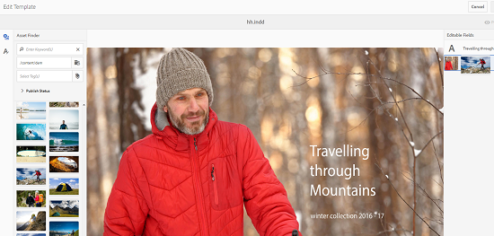

# 資產範本 {#asset-templates}

資產範本是一種特殊型別的資產，可協助您將視覺豐富的內容快速重新用於數位和印刷媒體。 資產範本包含固定傳訊區段和可編輯區段兩個部分。 固定傳訊區段可包含專有內容，例如已停用編輯的品牌標誌和版權資訊。 可編輯區段可在可編輯以自訂訊息的欄位中包含視覺和文字內容。

在保護全球招牌的同時進行有限編輯的彈性，讓資產範本成為快速調整與發佈內容的理想建置區塊，成為各種功能的內容人工因素。 重新調整內容用途有助於降低管理列印和數位頻道的成本，並在這些頻道中提供整體且一致的體驗。

身為行銷人員，您可以在[!DNL Experience Manager Assets]中儲存和管理範本，並使用單一基本範本輕鬆建立多個個人化列印體驗。 您可以建立各種型別的行銷宣傳品，包括小冊子、傳單、明信片、名片等，以便向客戶清楚傳達行銷訊息。 您也可以組合現有或新列印輸出的多頁列印輸出。 最重要的是，您可以輕鬆同時提供數位和列印體驗，為使用者提供一致的整合式體驗。

雖然資產範本多為[!DNL Adobe InDesign]個檔案，但[!DNL Adobe InDesign]的熟練程度並不妨礙建立亮麗的成品。 您不需要將[!DNL Adobe InDesign]範本的欄位對應到建立目錄時所需的產品欄位。 您可以直接在Web介面上以WYSIWYG模式編輯範本。 不過，若要讓[!DNL Adobe InDesign]處理您的編輯變更，您必須先設定[!DNL Experience Manager Assets]以與[!DNL Adobe InDesign Server]整合。

能夠從Web介面編輯[!DNL Adobe InDesign]範本，有助於促進創意和行銷人員之間的協同合作。 提升的內容速度可縮短行銷文宣的時間。

您可以使用資產範本達成下列目標：

* 從網頁介面修改可編輯的範本欄位。
* 控制文字的基本樣式，例如標籤層級的字型大小、樣式和文字。
* 使用內容選擇器變更範本中的影像。
* 預覽範本編輯。
* 合併多個範本檔案，以便建立多頁成品。

當您為宣傳品選擇範本時，[!DNL Experience Manager Assets]會建立您可編輯的範本復本。 原始範本會保留，以確保您的全域招牌保持不變，且可重複使用以強制執行品牌一致性。

您可以在父資料夾中以INDD、PDF或JPG格式匯出更新的檔案。 您也可以將這些格式的輸出下載到您的本機檔案系統。

## 建立附屬專案 {#creating-a-collateral}

假設您要建立數位可列印的宣傳品，例如手冊、傳單和廣告，以用於即將推出的行銷活動，並與全球奧特萊斯商店分享。 根據範本建立宣傳品有助於跨管道提供統一的客戶體驗。 設計人員可以使用創意解決方案（例如[!DNL InDesign]）建立行銷活動範本（單頁或多頁），並為您上傳範本至[!DNL Experience Manager Assets]。 在建立附屬品之前，請事先[!DNL Experience Manager]將一個或多個INDD範本上傳到並供使用。

1. 在[!DNL Experience Manager]介面中，選取[!UICONTROL Assets]。

1. 從選項中選擇&#x200B;**[!UICONTROL 範本]**。

   

1. 選取&#x200B;**[!UICONTROL 建立]**，然後從功能表中選擇您要建立的附屬資料。 例如，選擇&#x200B;**[!UICONTROL 手冊]**。

   

1. 請事先[!DNL Experience Manager]上傳一或多個INDD範本並供使用。 選擇手冊的範本，然後按一下&#x200B;**[!UICONTROL 下一步]**。
1. 指定手冊的名稱和說明（選用）。

   

1. （選擇性）按一下&#x200B;**[!UICONTROL 標籤]**，然後為手冊選取一或多個標籤。 按一下&#x200B;**[!UICONTROL 確認]**&#x200B;以確認您的選擇。
1. 按一下「**[!UICONTROL 建立]**」。對話方塊會確認已建立新手冊。 按一下&#x200B;**[!UICONTROL 開啟]**，以編輯模式開啟手冊。

   <!-- -->

   或者，關閉對話方塊，並導覽至您開始使用的「範本」頁面中的資料夾，以檢視您建立的手冊。 附屬資料的型別會顯示在卡片檢視的縮圖上。 例如，在此案例中，縮圖上會顯示單字[!UICONTROL 手冊]。

   

## 編輯附屬專案 {#editing-a-collateral}

您可以在建立附屬專案後立即編輯附屬專案。 或者，您也可以從[!UICONTROL 範本]頁面或資產頁面將其開啟。

1. 若要開啟要編輯的附屬資料，請執行下列任一項作業：

   * 開啟您在[建立宣傳品片段](/help/assets/asset-templates.md#creating-a-collateral)的步驟7中建立的宣傳品（此案例中的傳單）。
   * 從「範本」頁面，瀏覽至您建立宣傳品的資料夾，然後按一下宣傳品縮圖上的[!UICONTROL 編輯]快速動作。
   * 在附屬資料的資產頁面中，按一下工具列中的&#x200B;**[!UICONTROL 編輯]**。
   * 選取附屬專案，然後按一下工具列中的&#x200B;**[!UICONTROL 編輯]**。

   <!-- -->

   資產尋找器和文字編輯器會顯示在頁面左側。 文字編輯器預設為開啟。

   使用文字編輯器來修改您要顯示在文字欄位中的文字。 您可以在標籤層級修改字型大小、樣式、顏色和文字。

   若要使用資產尋找器，您可以瀏覽或搜尋[!DNL Experience Manager Assets]中的影像，並將範本中可編輯的影像取代為您選擇的影像。

   

   可編輯的影像會顯示在右側。 若要讓欄位在[!DNL Experience Manager Assets]中可編輯，範本中對應的欄位必須在[!DNL InDesign]中標籤。 換言之，它們應該在[!DNL InDesign]中標示為可編輯。

   >[!NOTE]
   >
   >確定您的[!DNL Experience Manager]部署已與[!DNL InDesign Server]整合，以讓[!DNL Experience Manager Assets]能夠從[!DNL InDesign]範本擷取資料，並使其可用於編輯。 如需詳細資訊，請參閱[整合Experience Manager Assets與InDesign Server](/help/assets/indesign.md)。

1. 若要修改可編輯欄位中的文字，請從可編輯欄位清單中按一下文字欄位，然後編輯欄位中的文字。

   

   您可以使用提供的選項編輯文字屬性，例如字型樣式、顏色和大小。

1. 選取「**[!UICONTROL 預覽]**」，以便預覽文字變更。

1. 若要交換影像，請選取&#x200B;**[!UICONTROL 資產尋找器]** 。

1. 從可編輯欄位清單中選取影像欄位，然後將所需的影像從資產選擇器拖曳至可編輯欄位。

   

   您也可以使用關鍵字、標籤並根據其發佈狀態來搜尋影像。 您可以瀏覽[!DNL Experience Manager Assets]存放庫並導覽至所需影像的位置。

   

1. 選取&#x200B;**[!UICONTROL 預覽]**，以便預覽影像。
1. 若要編輯多頁附屬資料中的特定頁面，請使用底部的頁面導覽器。

1. 在工具列上選取「**[!UICONTROL 預覽]**」，以便預覽所有變更。 選取&#x200B;**[!UICONTROL 完成]**，將編輯變更儲存至附屬專案。

   >[!NOTE]
   >
   >只有當附屬專案內的可編輯影像欄位沒有任何遺漏圖示時，才會啟用「預覽」和「完成」選項。 如果您的宣傳品中有缺少圖示，是因為[!DNL Experience Manager]無法解析[!DNL InDesign]範本中的影像。 通常，[!DNL Experience Manager]無法解析下列情況的影像：
   >
   >* 影像未內嵌於基礎[!DNL InDesign]範本中。
   >* 影像會從本機檔案系統連結。
   >
   >若要啟用[!DNL Experience Manager]以解析影像，請執行下列動作：
   >
   >* 建立[!DNL InDesign]範本時內嵌影像（請參閱[關於連結和內嵌圖形](https://helpx.adobe.com/tw/indesign/using/graphics-links.html)）。
   >* 將[!DNL Experience Manager]掛接至您的本機檔案系統，然後將遺漏的圖示與[!DNL Experience Manager]中的現有資產對應。
   >
   >如需有關使用[!DNL InDesign]檔案的詳細資訊，請參閱[使用Experience Manager](https://helpx.adobe.com/experience-manager/kb/best-practices-idd-docs-aem.html)中InDesign檔案的最佳實務。

1. 若要產生手冊的PDF轉譯，請在對話方塊中選取Acrobat選項，然後按一下[繼續]。**&#x200B;**
1. 附屬品片段會建立於您開始使用的資料夾中。 若要檢視轉譯，請開啟宣傳品，然後從GlobalNav清單中選擇&#x200B;**[!UICONTROL 轉譯]**。

   

1. 從轉譯清單中選取PDF轉譯，以便下載PDF檔案。 開啟PDF檔案以檢閱附屬資料。

   

## 合併附屬專案 {#merge-collateral}

1. 在[!DNL Experience Manager]介面中，選取[導覽]頁面上的[!UICONTROL Assets]。

1. 從選項中選取&#x200B;**[!UICONTROL 範本]**。

1. 選取&#x200B;**[!UICONTROL 建立]**，然後從功能表選取&#x200B;**[!UICONTROL 合併]**。

   

1. 從[!UICONTROL 範本合併]頁面，選取&#x200B;**[!UICONTROL 合併]** 。

1. 切換作業選項至您要合併的附屬專案位置，選取您要合併的附屬專案縮圖，以選取它們。

   

   您也可以從Omnisearch方塊搜尋範本。

   您可以瀏覽[!DNL Experience Manager Assets]存放庫或集合，並導覽至所需範本的位置，然後選取它們進行合併。

   您可以套用各種篩選器來搜尋所需的範本。 例如，您可以根據檔案型別或標籤來搜尋範本。

1. 從工具列選取&#x200B;**[!UICONTROL 下一步]**。
1. 在&#x200B;**[!UICONTROL 預覽與重新排序]**&#x200B;畫面中，視需要重新排列範本，並預覽要合併的範本選擇。 從工具列中選取&#x200B;**[!UICONTROL 下一步]**。

   

1. 在[!UICONTROL 設定範本]畫面中，指定附屬專案的名稱。 選擇性地指定您認為適當的任何標籤。 如果要以PDF格式匯出輸出，請選取&#x200B;**[!UICONTROL Acrobat (.PDF)]**。 依預設，宣傳品會以JPG和[!DNL InDesign]格式匯出。 若要變更多頁附屬資料的顯示縮圖，請按一下[變更縮圖]。**&#x200B;**

   

1. 選取「**[!UICONTROL 儲存]**」，然後選取「**[!UICONTROL 確定]**」以關閉對話方塊。 多頁附屬資料會在您開始使用的資料夾中建立。

   >[!NOTE]
   >
   >您稍後無法編輯合併的附屬專案，也無法用它來建立其他附屬專案。

## 最佳作法和限制 {#best-practices-limitations-tips}

* [!DNL Experience Manager]中的[!DNL InDesign]編輯器在標籤層級運作，且單一標籤下的所有文字都視為單一實體。 若要在編輯時保留文字格式和樣式，請分別標籤每個段落（或使用不同樣式的文字）。
