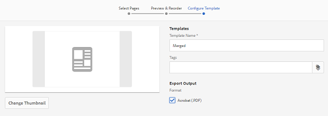

# 資產模板 {#asset-templates}

資產模板是一種特殊的資產類別，它有助於快速將視覺豐富的內容重新用於數字和印刷媒體。 資產模板包括固定消息部分和可編輯部分兩部分。 固定消息部分可以包含專有內容，如品牌徽標和禁用編輯的版權資訊。 可編輯部分可以包含可編輯以自定義消息傳遞的欄位中的視覺和文本內容。

在保護全球標牌的同時進行有限編輯的靈活性，使資產模板成為快速調整和分發內容的理想構建基塊，作為各種功能的內容工件。 重新調整內容用途有助於降低管理打印和數字渠道的成本，並跨這些渠道提供全面而一致的體驗。

作為營銷人員，您可以在 [!DNL Experience Manager Assets] 並使用單個基本模板輕鬆建立多個個性化打印體驗。 您可以建立各種類型的營銷宣傳資料，包括小冊子、傳單、明信片、名片等，以便向客戶清晰傳達您的營銷資訊。 也可以從現有或新打印輸出裝配多頁打印輸出。 最重要的是，您可以輕鬆同時提供數字和打印體驗，為用戶提供一致、整合的體驗。

雖然資產模板大多 [!DNL Adobe InDesign] 檔案，熟練程度 [!DNL Adobe InDesign] 不是創造恆星人工物的障礙。 您無需映射 [!DNL Adobe InDesign] 模板，在建立目錄時，您需要這些模板。 您可以直接在Web介面上在WYSIWYG模式下編輯模板。 但是， [!DNL Adobe InDesign] 要處理編輯更改，必須首先配置 [!DNL Experience Manager Assets] 與 [!DNL Adobe InDesign Server]。

編輯能力 [!DNL Adobe InDesign] 來自web介面的模板有助於促進創意人員和營銷人員之間的更大協作。 增加的內容速度減少了營銷抵押品的上市時間。

您可以使用資產模板實現以下目標：

* 修改Web介面中的可編輯模板欄位。
* 控制文本的基本樣式，例如在標籤級別上的字型大小、樣式和類型。
* 使用內容選取器更改模板中的影像。
* 預覽模板編輯。
* 合併多個模板檔案以建立多頁對象。

當您為宣傳資料選擇模板時， [!DNL Experience Manager Assets] 建立可編輯的模板副本。 原始模板將保留下來，這可確保您的全球標牌保持完整，並且可以重新使用以強製品牌一致性。

可以以INDD、PDF或JPG格式在父資料夾中導出更新的檔案。 您也可以將這些格式的輸出下載到本地檔案系統。

## 建立宣傳資料 {#creating-a-collateral}

請考慮您希望建立數字化可打印宣傳資料（如宣傳冊、傳單和廣告等）以供即將開展的活動使用，並與全球折扣商店共用的情形。 基於模板建立宣傳資料有助於跨渠道提供統一的客戶體驗。 設計人員可以使用創意解決方案(如 [!DNL InDesign] 將模板上載到 [!DNL Experience Manager Assets] 為你。 在建立宣傳資料之前，請將一個或多個INDD模板上載到並在中可用 [!DNL Experience Manager] 提前。

1. 在 [!DNL Experience Manager] 介面 [!UICONTROL 資產]。

1. 從選項中選擇 **[!UICONTROL 模板]**。

   

1. 按一下 **[!UICONTROL 建立]**，然後從菜單中選擇要建立的宣傳資料。 例如，選擇 **[!UICONTROL 手冊]**。

   

1. 將一個或多個INDD模板上載到並可用於 [!DNL Experience Manager] 提前。 為手冊選擇模板，然後按一下 **[!UICONTROL 下一個]**。
1. 指定手冊的名稱和可選說明。

   

1. （可選）按一下 **[!UICONTROL 標籤]** 並為手冊選擇一個或多個標籤。 按一下 **[!UICONTROL 確認]** 確認您的選擇。
1. 按一下&#x200B;**[!UICONTROL 建立]**。對話確認建立了新的手冊。 按一下 **[!UICONTROL 開啟]** 以編輯模式開啟手冊。

   <!-- -->

   或者，關閉對話框並導航到您開始使用的「模板」頁面中的資料夾，以查看您建立的手冊。 宣傳品的類型顯示在其縮略圖的卡視圖中。 例如，在本例中， [!UICONTROL 手冊] 表徵圖。

   

## 編輯宣傳資料 {#editing-a-collateral}

建立宣傳材料後，您可以立即對其進行編輯。 或者，從 [!UICONTROL 模板] 頁。

1. 要開啟要編輯的宣傳資料，請執行以下操作之一：

   * 開啟您在第7步中建立的宣傳資料（本例中為手冊） [建立宣傳資料](/help/assets/asset-templates.md#creating-a-collateral)。
   * 在「模板」頁中，導航到建立宣傳資料的資料夾，然後按一下 [!UICONTROL 編輯] 對宣傳資料的縮略圖進行快速操作。
   * 在宣傳品的資產頁面中，按一下 **[!UICONTROL 編輯]** 的子菜單。
   * 選擇宣傳品，然後按一下 **[!UICONTROL 編輯]** 的子菜單。

   <!-- -->

   資產查找器和文本編輯器顯示在頁面左側。 預設情況下，文本編輯器處於開啟狀態。

   可以使用文本編輯器修改要在文本欄位中顯示的文本。 可以在標籤級別修改字型大小、樣式、顏色和文字。

   使用資產查找器，您可以瀏覽或搜索 [!DNL Experience Manager Assets] 將模板中的可編輯影像替換為您選擇的影像。

   

   可編輯內容顯示在右側。 要在中編輯的欄位 [!DNL Experience Manager Assets]，必須在中標籤模板中的相應欄位 [!DNL InDesign]。 換句話說，它們應在 [!DNL InDesign]。

   >[!NOTE]
   >
   >確保 [!DNL Experience Manager] 部署與 [!DNL InDesign Server] 啟用 [!DNL Experience Manager Assets] 從 [!DNL InDesign] 並使其可供編輯。 有關詳細資訊，請參閱 [將Experience Manager Assets與InDesign Server](/help/assets/indesign.md)。

1. 要修改可編輯欄位中的文本，請按一下可編輯欄位清單中的文本欄位，然後編輯該欄位中的文本。

   

   可以使用提供的選項編輯文本屬性，例如字型樣式、顏色和大小。

1. 按一下 **[!UICONTROL 預覽]** 按鈕。

1. 要交換影像，請按一下 **[!UICONTROL 資產查找器]** 。

1. 從可編輯欄位清單中選擇影像欄位，然後將所需影像從資產選取器拖到可編輯欄位。

   

   您還可以使用關鍵字、標籤和基於其發佈狀態搜索影像。 您可以瀏覽 [!DNL Experience Manager Assets] 儲存庫並導航到所需映像的位置。

   

1. 按一下 **[!UICONTROL 預覽]** 的子菜單。
1. 要在多頁宣傳資料中編輯特定頁面，請使用底部的頁面導航器。

1. 按一下 **[!UICONTROL 預覽]** 的子菜單。 按一下 **[!UICONTROL 完成]** 以保存對宣傳資料的編輯更改。

   >[!NOTE]
   >
   >僅當宣傳資料中的可編輯影像欄位沒有任何缺少的表徵圖時，才啟用「預覽」和「完成」選項。 如果宣傳資料中缺少表徵圖，那是因為 [!DNL Experience Manager] 無法解析 [!DNL InDesign] 的下界。 通常， [!DNL Experience Manager] 在以下情況下無法解析映像：
   >
   >* 影像未嵌入到底層 [!DNL InDesign] 的下界。
   >* 映像從本地檔案系統連結。

   >
   >啟用 [!DNL Experience Manager] 要解析映像，請執行以下操作：
   >
   >* 建立時嵌入影像 [!DNL InDesign] 模板(請參閱 [關於連結和嵌入式圖形](https://helpx.adobe.com/indesign/using/graphics-links.html))。
   >* 山 [!DNL Experience Manager] 將丟失的表徵圖與現有資產映射到 [!DNL Experience Manager]。

   >
   >有關使用的詳細資訊 [!DNL InDesign] 文檔，請參閱 [使用InDesign文檔的最佳做法Experience Manager](https://helpx.adobe.com/experience-manager/kb/best-practices-idd-docs-aem.html)。

1. 要為手冊生成PDF格式副本，請在對話框中選擇「Acrobat」選項，然後按一下 **[!UICONTROL 繼續]**。
1. 宣傳資料是在您開始使用的資料夾中建立的。 要查看格式副本，請開啟宣傳資料並選擇 **[!UICONTROL 格式副本]** 清單中。

   

1. 從格式副本清單中按一下PDF格式副本以下載PDF檔案。 開啟PDF檔案以查看宣傳資料。

   

## 合併宣傳品 {#merge-collateral}

1. 在 [!DNL Experience Manager] 介面 [!UICONTROL 資產] 的下界。

1. 從選項中選擇 **[!UICONTROL 模板]**。

1. 按一下 **[!UICONTROL 建立]** 選擇 **[!UICONTROL 合併]** 的子菜單。

   

1. 從 [!UICONTROL 模板合併] 的 **[!UICONTROL 合併]** 。

1. 導航到要合併的宣傳資料的位置，按一下要合併的宣傳資料的縮略圖以選擇它們。

   

   也可以從「Omnisearch」(Omnisearch)框中搜索模板。

   您可以瀏覽 [!DNL Experience Manager Assets] 儲存庫或集合，並導航到所需模板的位置，然後選擇它們以合併。

   可以應用各種篩選器來搜索所需的模板。 例如，可以根據檔案類型或標籤搜索模板。

1. 按一下 **[!UICONTROL 下一個]** 的子菜單。
1. 在 **[!UICONTROL 預覽和重新排序]** 螢幕中，根據需要重新排列模板並預覽要合併的模板選擇。 然後，按一下 **[!UICONTROL 下一個]** 的子菜單。

   

1. 在 [!UICONTROL 配置模板] 螢幕中，指定宣傳品的名稱。 （可選）指定您認為合適的任何標籤。 如果要以PDF格式導出輸出，請選擇 **[!UICONTROL Acrobat(.PDF)]**。 預設情況下，宣傳品以JPG和 [!DNL InDesign] 的子菜單。 要更改多頁宣傳資料的顯示縮略圖，請按一下 **[!UICONTROL 更改縮略圖]**。

   

1. 按一下 **[!UICONTROL 保存]** 然後按一下 **[!UICONTROL 確定]** 的子菜單。 多頁宣傳資料是在您開始使用的資料夾中建立的。

   >[!NOTE]
   >
   >您以後不能編輯合併的宣傳資料，也不能使用它建立其他宣傳資料。

## 最佳做法和限制 {#best-practices-limitations-tips}

* 的 [!DNL InDesign] 編輯器 [!DNL Experience Manager] 在標籤級別工作，並且單個標籤下的所有文本都被視為單個實體。 要在編輯時保留文本格式和樣式，請分別標籤每個段落（或具有不同樣式的文本）。
