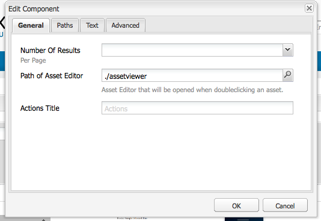
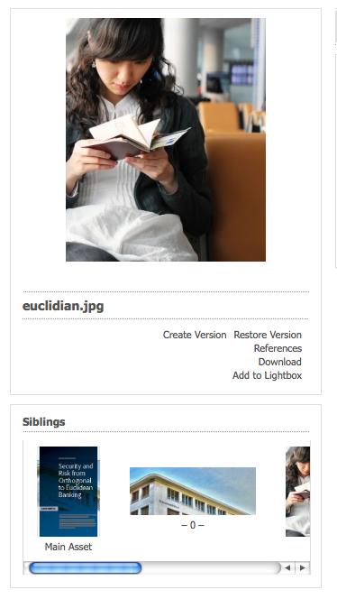

# 建立和配置資產編輯器頁 {#creating-and-configuring-asset-editor-pages}

本文檔介紹以下內容：

* 建立自定義資產編輯器頁的原因。
* 如何建立和自定義資產編輯器頁，這些頁是WCM頁，允許您查看和編輯元資料以及對資產執行操作。
* 如何同時編輯多個資產。

<!-- TBD: Add UICONTROL tags. Need PM review. Flatten the structure a bit. Re-write to remove Geometrixx mentions and to adhere to 6.5 default samples. -->

>[!NOTE]
>
>資產共用可用作開放原始碼引用實施。 請參閱 [資產共用共用](https://adobe-marketing-cloud.github.io/asset-share-commons/)。 未正式支援。

## 為什麼建立和配置資產編輯器頁？ {#why-create-and-configure-asset-editor-pages}

數字資產管理正在越來越多的場景中使用。 當從面向專業培訓用戶的小用戶組（如攝影師或分類學家）的小規模解決方案過渡到更大、更多樣化的用戶組（如業務用戶、WCM作者、記者等）時，強大的用戶介面 [!DNL Adobe Experience Manager Assets] 對於專業用戶來說，可以提供太多的資訊，而利益相關方開始請求特定的用戶介面或應用程式來訪問與他們相關的數字資產。

這些以資產為中心的應用程式可以是內部網中的簡單照片庫，員工可以通過貿易展訪問上傳照片，也可以在面向公共網站的新聞中心上傳照片。 以資產為中心的應用程式還可以擴展到完整的解決方案，包括購物車、結帳和驗證過程。

建立以資產為中心的應用程式在很大程度上成為一個配置過程，該過程不需要編碼、只需要瞭解用戶組及其需要以及所使用元資料的知識。 使用建立的以資產為中心的應用程式 [!DNL Assets] 可擴展：使用中等編碼工作可重複使用的元件來搜索、查看和修改資產。

以資產為中心的應用程式 [!DNL Experience Manager] 由「資產編輯器」(Asset Editor)頁面組成，該頁面可用於獲取特定資產的詳細視圖。 資產編輯器頁還允許編輯元資料，前提是訪問資產的用戶具有必要的權限。

<!--
## Create and configure an Asset Share page {#creating-and-configuring-an-asset-share-page}

You customize the DAM Finder functionality and create pages that have all the functionality you require, which are called Asset Share pages. To create a new Asset Share page, you add the page using the Geometrixx Asset Share template and then you customize the actions users can perform on that page, determine how viewers see the assets, and decide how users can build their queries.

Here are some use cases for creating a customized Asset Share page:

* Press Center for Journalists.
* Image Search Engine for internal business users.
* Image Database for website users.
* Media Tagging Interface for metadata editors.

### Create an Asset Share page {#creating-an-asset-share-page}

To create a new Asset Share page, you can either create it when you are working on web sites or from the digital asset manager.

>[!NOTE]
>
>By default, when you create an Asset Share page from **New** in the digital asset manager, an Asset viewer and Asset editor are automatically created for you.

To create an new Asset Share page in the **Websites** console:

1. In the **Websites** tab, navigate to the place where you want to create an asset share page and click **New**.

1. Select the **Asset Share** page and click **Create**. The new page is created and the asset share page is listed in the **Websites** tab.

The basic page created using the Geometrixx DAM Asset Share template looks as follows:

To customize your Asset Share page, you use elements from the sidekick and you also edit query builder properties. The page **Geometrixx Press Center** is a customized version of a page based on this template:

To create a new asset share page via the digital asset manager:

1. In the digital asset manager, in **New**, select **New Asset Share**.
1. In the **Title**, enter the name of the asset share page. If desired, enter a name for the URL.

   

1. Double-click the asset share page to open it and configure the page.

   

   By default, when you create an Asset Share page from **New**, an Asset viewer and Asset editor are automatically created for you.

#### Customize actions {#customizing-actions}

You can determine what actions users can perform on selected digital assets from a selection of predefined actions.

To add actions to the Asset Share page:

1. In the Asset Share page that you want to customize, click **Actions** in the sidekick.

The following actions are available:

 | Action | Description |
 |---|---|
 | [!UICONTROL Delete Action] | Users can delete the selected assets. |
 | [!UICONTROL Download Action] | Lets users download selected assets to their computers. |
 | [!UICONTROL Lightbox Action] | Saves assets to a "lightbox"   where you can perform other actions on them. This comes in handy when working   with assets across multiple pages. The lightbox can also be used as a   shopping cart for assets. |
 | [!UICONTROL Move Action] | Users can move the asset to another   location |
 | [!UICONTROL Tags Action] | Lets users add tags to selected assets |
 | [!UICONTROL View Asset Action] | Opens the asset in the Asset editor for   user manipulation. |

1. Drag the appropriate action to the **Actions** area on the page. Doing so creates a button that is used to execute that action.

#### Determine how search results are presented {#determining-how-search-results-are-presented}

You determine how results are displayed from a predefined list of lenses.

To change how search results are viewed:

1. In the Asset Share page that you want to customize, click Search.

1. Drag the appropriate lens to the top center of the page. In the Press Center, the lenses are already available. Users press the appropriate lens icon to display search results as desired.

The following lenses are available:

| Lens | Description |
|---|---|
| **[!UICONTROL List Lens]** |Presents the assets in a list fashion with details. |
| **[!UICONTROL Mosaic Lens]** |Presents assets in a mosaic fashion. |

#### Mosaic Lens {#mosaic-lens}

#### List Lens {#list-lens}

#### Customize the Query Builder {#customizing-the-query-builder}

The query builder lets you enter search terms and create content for the Asset Share page. When you edit the query builder, you also get to determine how many search results are displayed per page, which asset editor opens when you double-click an asset, the path the query searches, and customizes nodetypes.

To customize the query builder:

1. In the Asset Share page that you want to customize, click **Edit** in the Query Builder. By default, the **General** tab opens.
1. Select the number of results per page, the path of the asset editor (if you have a customized asset editor) and the Actions title.

1. Click the **Paths** tab. Enter a path or multiple paths that the search will run. These paths are overwritten if the user uses the Paths predicate.

1. Enter another node type, if desired.

1. In the **Query Builder URL** field, you can override or wrap the query builder and enter the new servlet URLs with the existing query builder component. In the **Feed URL** field, you can override the Feed URL as well.

1. In the **Text** field, enter the text you want to appear for results and page numbers of results. Click **OK** when finished making changes.

#### Add predicates {#adding-predicates}

Experience Manager Assets includes a number of predicates that you can add to the Asset Share page. These let your users further narrow searches. In some cases, they may override a query builder parameter (for example, the Path parameter).

To add predicates:

1. In the Asset Share page that you want to customize, click **Search**.

1. Drag the appropriate predicates to the Asset Share page underneath the query builder. Doing so creates the appropriate fields.

The following predicates are available:

| Predicate | Description |
|---|---|
| **[!UICONTROL Date Predicate]** |Lets users search for assets that were modified before and after certain dates. |
| **[!UICONTROL Options Predicate]** |The site owner can specify a property to search for (as in the property predicate, for example cq:tags) and a content tree to populate the options from (for example the tag tree). Doing so generates a list of options where the users can select the values (tags) that the selected property (tag property) should have. This predicate lets you build list controls like the list of tags, file types, image orientations, and so on. It is great for a fixed set of options. |
| **[!UICONTROL Path Predicate]** |Lets users define the path and subfolders, if desired. |
| **[!UICONTROL Property Predicate]** |The site owner specifies a property to search for, e.g. tiff:ImageLength and the user can then enter a value, e.g. 800. This returns all images that are 800 pixels high. Useful predicate if your property can have arbitrary values. |

For more information, see the [predicate Javadocs](https://helpx.adobe.com/experience-manager/6-5/sites/developing/using/reference-materials/javadoc/com/day/cq/search/eval/package-summary.html).

1. To configure the predicate further, double-click it. For example, when you open the Path Predicate, you need to assign the root path.

-->

## 建立和配置資產編輯器頁 {#creating-and-configuring-an-asset-editor-page}

您可以自定義資產編輯器以確定用戶如何查看和編輯數字資產。 為此，您將建立一個新的「資產編輯器」頁，然後自定義用戶可以在該頁上執行的視圖和操作。

>[!NOTE]
>
>如果要將自定義欄位添加到DAM資產編輯器，請添加新欄位 `cq:Widget` 節點到 `/apps/dam/content/asseteditors.`

### 「建立資產編輯器」頁 {#creating-the-asset-editor-page}

建立「資產編輯器」頁時，最好是在「資產共用」頁面正下方建立該頁面。

要建立「資產編輯器」頁：

1. 在 **[!UICONTROL 網站]** 頁籤，導航到要建立資產編輯器頁面的位置，然後按一下 **新建**。
1. 選擇 **Geometrixx資產編輯器** 按一下 **建立**。 將建立新頁面，並在 **網站** 頁籤。

使用Geometrixx資產編輯器模板建立的基本頁如下所示：

要自定義資產編輯器頁面，請使用旁鍵中的元素。 從中訪問的「資產編輯器」頁 **Geometrixx新聞中心** 是基於此模板的頁面的自定義版本：

#### 將資產編輯器設定為從資產共用頁開啟 {#setting-which-asset-editor-opens-from-an-asset-share-page}

建立自定義資產編輯器頁面後，需要確保按兩下建立的自定義資產共用在自定義編輯器頁面中開啟資產。

要設定「資產編輯器」頁：

1. 在「資產共用」頁中，按一下 **編輯** 查詢生成器旁邊。

1. 按一下 **常規** 的子菜單。

1. 在 **資產編輯器的路徑** 欄位中，輸入希望「資產共用」頁開啟資產的資產編輯器的路徑，然後按一下 **確定**。

#### 添加資產編輯器元件 {#adding-asset-editor-components}

通過向頁面添加元件，可確定資產編輯器具有的功能。

要添加資產編輯器元件：

1. 在要自定義的資產編輯器頁面中，選擇 **資產編輯器** 在側腿上。 將顯示所有可用的資產編輯器元件。

>[!NOTE]
>
>可定製的內容取決於可用的元件。 要啟用元件，請轉至「設計」模式，然後選擇需要啟用的元件。

1. 將元件從旁邊拖動到資產編輯器，並在元件對話框中進行任何修改。 下表對這些元件進行了說明，並在後面的詳細說明中進行了說明。

>[!NOTE]
>
>設計資產編輯器頁面時，將建立只讀或可編輯的元件。 用戶知道，如果鉛筆的影像出現在該元件中，則可以編輯欄位。 預設情況下，大多數元件都設定為只讀。

| Component | 說明 |
|---|---|
| **[!UICONTROL 元資料窗體] 和 [!UICONTROL 元資料文本欄位]** | 允許您向資產添加其他元資料並對該資產執行操作（如提交）。 |
| **[!UICONTROL 子資產]** | 用於自定義子資產。 |
| **標記** | 允許用戶選擇標籤並將其添加到資產。 |
| **[!UICONTROL 縮圖]** | 顯示資產的縮略圖及其檔案名，並允許您添加備用文本。 您也可以在此處添加資產編輯器操作。 |
| **[!UICONTROL 標題]** | 顯示可自定義的資產標題。 |

#### 元資料表單和文本欄位 — 配置視圖元資料元件 {#metadata-form-and-text-field-configuring-the-view-metadata-component}

元資料表單是包含開始和結束操作的表單。 在中間，輸入 **文本** 的子菜單。 請參閱 [Forms](/help/sites-authoring/default-components-foundation.md#form-component) 的子菜單。

1. 通過按一下 **編輯** 的子菜單。 如果需要，可以輸入「框」標題。 預設情況下，框標題為 **元資料**。 如果希望生成用於驗證的java-script客戶端代碼，請選中「客戶端驗證」複選框。

1. 通過按一下 **編輯** 的上界。 例如，您可能要建立 **[!UICONTROL 提交]** 選項，允許用戶提交其元資料更改。 （可選）您可以添加 **重置** 選項將元資料重置為其原始狀態。

1. 介於 **窗體開始** 和 **表單結束**，將元資料文本欄位拖到窗體。 用戶將元資料填充到這些文本欄位中，他們可以在這些文本欄位中提交或完成其他操作。

1. 按兩下欄位名稱，例如， **標題** 開啟元資料欄位並進行更改。 在 **常規** 頁籤 **編輯元件** 窗口，定義命名空間和欄位標籤以及類型，例如， `dc:title`。

請參閱 [自定義和擴展資產](/help/assets/extending-assets.md) 有關修改元資料表單中可用命名空間的資訊。

1. 按一下 **約束** 頁籤。 在此，您可以選擇是否需要欄位，並在必要時添加任何約束。

1. 按一下 **顯示** 頁籤。 在此，您可以為元資料欄位輸入新的寬度和行數。 選擇 **欄位為只讀** 複選框以允許用戶編輯元資料。

以下是包含各種欄位的元資料表單的示例：

然後，在「資產編輯器」頁上，用戶可以在元資料欄位中輸入值（如果可編輯）並執行結束操作（例如，提交更改）。

#### 子資產 {#sub-assets}

子資產元件是您查看和選擇子資產的位置。 您可以確定在 [主資產](/help/assets/assets.md#what-are-digital-assets) 和子資產。

按兩下子資產元件以開啟子資產對話框，您可以在其中更改主資產和任何子資產的標題。 預設值顯示在相應欄位的下方。

以下是已填充子資產元件的示例：

例如，如果選擇了子資產，請注意元件如何顯示相應的頁面，以及「框」標題從「子資產」更改為「同級」。

#### 標記 {#tags}

「標籤」元件是一個元件，用戶可以在其中將現有標籤分配給資產，這有助於以後的組織和檢索。 您可以使此元件為只讀，因此用戶無法添加標籤，但只能查看標籤。

按兩下「標籤」元件以開啟「標籤」對話框，在該對話框中可以根據需要從「標籤」中更改標題，並在其中選擇已分配的命名空間。 要使此欄位可編輯，請清除 **[!UICONTROL 隱藏編輯]** 的子菜單。 預設情況下，標籤是可編輯的。

如果用戶可以編輯標籤，則可以通過從「標籤」下拉菜單中選擇標籤來按一下鉛筆添加標籤。

以下是已填充的「標籤」元件：

#### 縮圖 {#thumbnail}

「縮略圖」元件是資產顯示選定縮略圖的位置（對於許多格式，縮略圖會自動提取）。 此外，元件還顯示檔案名， [可修改的操作](/help/assets/assets-finder-editor.md#adding-asset-editor-actions)。

按兩下縮略圖元件以開啟縮略圖對話框，在該對話框中可以更改替代文字。 預設情況下，縮略圖Alt文本預設為 **按一下以下載** 的下界。

以下是已填充的縮略圖元件的示例：

#### 標題 {#title}

「標題」元件顯示資產的標題和說明。

預設情況下，它處於只讀模式，因此用戶無法編輯它。 要使其可編輯，請按兩下該元件並清除 **隱藏編輯按鈕** 複選框。 此外，為多個資產輸入標題。

如果可以編輯「標題」(Title)，則可以通過按一下「鉛筆」(Pencil)開啟 **資產屬性** 的子菜單。 此外，還可以通過選擇日期和時間來開啟和關閉資產。

編輯 [!UICONTROL 標題]，用戶可以更改 **標題**。 **說明**，輸入 **開** 和 **關機時間** 開啟和關閉資產。

下面是填充的Title元件的示例：

#### 添加資產編輯器操作 {#adding-asset-editor-actions}

您可以從選定的預定義操作中確定用戶可以對選定數字資產執行哪些操作。

要向「資產編輯器」頁添加操作：

1. 在要自定義的資產編輯器頁面中，按一下 **資產編輯器** 在側腿上。

可以執行以下操作：

| 動作 | 說明 |
|---|---|
| [!UICONTROL 下載] | 允許用戶將所選資產下載到其電腦。 |
| [!UICONTROL 編輯] | 允許用戶編輯影像（互動式編輯） |
| [!UICONTROL 燈箱] | 將資產保存到「燈箱」中，您可以在其中對其執行其他操作。 在跨多頁處理資產時，此功能非常方便。 |
| [!UICONTROL 鎖定] | 允許用戶鎖定資產。 預設情況下不啟用此功能，需要在元件清單中啟用此功能。 |
| [!UICONTROL 引用] | 按一下此按鈕可顯示資產正在使用的頁面。 |
| [!UICONTROL 版本設定] | 用於建立和還原資產的版本。 |

1. 將相應操作拖到 **操作** 的子菜單。 它建立一個選項，用於執行在頁面上拖動的操作。

## 使用「資產編輯器」頁多編輯資產 {#multi-editing-assets-with-the-asset-editor-page}

與 [!DNL Experience Manager Assets] 您可以同時更改多個資產。 在選定資產後，您可以同時更改其：

* 標記
* 元資料

要使用「資產編輯器」頁對資產進行多次編輯：

1. 開啟Geometrixx **新聞中心** 頁：
   `https://localhost:4502/content/geometrixx/en/company/press.html`

1. 選擇資產：

   * 在Windows上： `Ctrl + click` 每個資產。
   * Mac: `Cmd + click` 每個資產。

   要選擇資產範圍，請執行以下操作：按一下第一個資產， `Shift + click` 最後一項資產。

1. 按一下 **編輯元資料** 的 **操作** 欄位（頁面的左部分）。
1. Geometrixx **按中心資產編輯器** 的上界。 資產的元資料顯示如下：

   * 標籤不適用於所有資產，而僅適用於少數資產，以斜體顯示。
   * 應用於所有資產的標籤以普通字型顯示。
   * 除標籤之外的元資料：僅當欄位的值與所有選定資產的值相同時，才會顯示該欄位的值。

1. 按一下 **下載** 下載包含資產原始格式副本的ZIP檔案。
1. 按一下「編輯」(Edit)「標籤」(Tags)選項旁邊的 **標籤** 的子菜單。

   * 不適用於所有資產但僅適用於少數資產的標籤具有灰色背景。
   * 應用於所有資產的標籤具有白色背景。

   您可以：

   * 按一下 `x` 刪除所有資產的標籤。
   * 按一下 `+` 將標籤添加到所有資產中。
   * 按一下 **箭頭** 並選擇一個標籤以向所有資產添加新標籤。

   按一下 **確定** 將更改寫入窗體。 位於 **標籤** 欄位。

1. 編輯「說明」(Description)欄位。 例如，將其設定為：

   `This is a common description`

   編輯欄位時，其值會在提交表單時覆蓋選定資產的現有值。

   注：編輯欄位時，將自動選中欄位旁的框。

1. 按一下 **更新元資料** 以提交表單並保存所有資產的更改。

   注：只修改已檢查的元資料。
