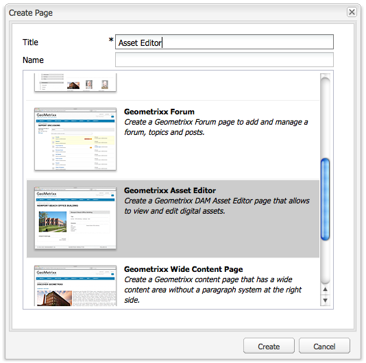

# 建立和配置資產編輯器頁{#creating-and-configuring-asset-editor-pages}

本檔案說明下列內容：

* 建立自訂資產編輯器頁面的原因。
* 如何建立和自訂資產編輯器頁面，這些頁面是WCM頁面，可讓您檢視和編輯中繼資料，以及對資產執行動作。
* 如何同時編輯多個資產。

<!-- TBD: Add UICONTROL tags. Need PM review. Flatten the structure a bit. Re-write to remove Geometrixx mentions and to adhere to 6.5 default samples. -->

>[!NOTE]
>
>「資產共用」可做為開放原始碼參考實作。 請參閱[資產共用共用共用](https://adobe-marketing-cloud.github.io/asset-share-commons/)。 未正式支援。

## 為何要建立和設定資產編輯器頁面？{#why-create-and-configure-asset-editor-pages}

數位資產管理正被越來越多的案例所使用。 當從專業訓練使用者的小型解決方案（例如攝影師或分類學者）移轉至較大且更多樣化的使用者群組（例如商業使用者、WCM作者、記者等）時，專業使用者的[!DNL Adobe Experience Manager Assets]強大使用者介面可提供太多資訊，而利益相關者會開始要求特定使用者介面或應用程式存取與他們相關的數位資產。

這些以資產為中心的應用程式可以是內部網路中簡單的像片收藏館，員工可從商業展覽或公開網站的新聞中心上傳像片。 以資產為中心的應用程式也可以延伸至完整的解決方案，包括購物車、結帳和驗證程式。

建立以資產為中心的應用程式，在很大程度上會變成不需撰寫程式碼的設定程式，只需瞭解使用者群組及其需求，以及所使用中繼資料的知識即可。 使用[!DNL Assets]建立的資產導向應用程式具有可擴充性：使用適中的編碼工作，可重複使用的元件來搜尋、檢視和修改資產。

[!DNL Experience Manager]中的資產導向應用程式包含資產編輯器頁面，可用來取得特定資產的詳細檢視。 資產編輯器頁面也允許編輯元資料，前提是訪問資產的用戶具有必要的權限。

<!--
## Create and configure an Asset Share page {#creating-and-configuring-an-asset-share-page}

You customize the DAM Finder functionality and create pages that have all the functionality you require, which are called Asset Share pages. To create a new Asset Share page, you add the page using the Geometrixx Asset Share template and then you customize the actions users can perform on that page, determine how viewers see the assets, and decide how users can build their queries.

Here are some use cases for creating a customized Asset Share page:

* Press Center for Journalists.
* Image Search Engine for internal business users.
* Image Database for website users.
* Media Tagging Interface for metadata editors.

### Create an Asset Share page {#creating-an-asset-share-page}

To create a new Asset Share page, you can either create it when you are working on web sites or from the digital asset manager.

>[!NOTE]
>
>By default, when you create an Asset Share page from **New** in the digital asset manager, an Asset viewer and Asset editor are automatically created for you.

To create an new Asset Share page in the **Websites** console:

1. In the **Websites** tab, navigate to the place where you want to create an asset share page and click **New**.

1. Select the **Asset Share** page and click **Create**. The new page is created and the asset share page is listed in the **Websites** tab.

The basic page created using the Geometrixx DAM Asset Share template looks as follows:

To customize your Asset Share page, you use elements from the sidekick and you also edit query builder properties. The page **Geometrixx Press Center** is a customized version of a page based on this template:

To create a new asset share page via the digital asset manager:

1. In the digital asset manager, in **New**, select **New Asset Share**.
1. In the **Title**, enter the name of the asset share page. If desired, enter a name for the URL.

   

1. Double-click the asset share page to open it and configure the page.

   

   By default, when you create an Asset Share page from **New**, an Asset viewer and Asset editor are automatically created for you.

#### Customize actions {#customizing-actions}

You can determine what actions users can perform on selected digital assets from a selection of predefined actions.

To add actions to the Asset Share page:

1. In the Asset Share page that you want to customize, click **Actions** in the sidekick.

The following actions are available:

 | Action | Description |
 |---|---|
 | [!UICONTROL Delete Action] | Users can delete the selected assets. |
 | [!UICONTROL Download Action] | Lets users download selected assets to their computers. |
 | [!UICONTROL Lightbox Action] | Saves assets to a "lightbox"   where you can perform other actions on them. This comes in handy when working   with assets across multiple pages. The lightbox can also be used as a   shopping cart for assets. |
 | [!UICONTROL Move Action] | Users can move the asset to another   location |
 | [!UICONTROL Tags Action] | Lets users add tags to selected assets |
 | [!UICONTROL View Asset Action] | Opens the asset in the Asset editor for   user manipulation. |

1. Drag the appropriate action to the **Actions** area on the page. Doing so creates a button that is used to execute that action.

#### Determine how search results are presented {#determining-how-search-results-are-presented}

You determine how results are displayed from a predefined list of lenses.

To change how search results are viewed:

1. In the Asset Share page that you want to customize, click Search.

1. Drag the appropriate lens to the top center of the page. In the Press Center, the lenses are already available. Users press the appropriate lens icon to display search results as desired.

The following lenses are available:

| Lens | Description |
|---|---|
| **[!UICONTROL List Lens]** |Presents the assets in a list fashion with details. |
| **[!UICONTROL Mosaic Lens]** |Presents assets in a mosaic fashion. |

#### Mosaic Lens {#mosaic-lens}

#### List Lens {#list-lens}

#### Customize the Query Builder {#customizing-the-query-builder}

The query builder lets you enter search terms and create content for the Asset Share page. When you edit the query builder, you also get to determine how many search results are displayed per page, which asset editor opens when you double-click an asset, the path the query searches, and customizes nodetypes.

To customize the query builder:

1. In the Asset Share page that you want to customize, click **Edit** in the Query Builder. By default, the **General** tab opens.
1. Select the number of results per page, the path of the asset editor (if you have a customized asset editor) and the Actions title.

1. Click the **Paths** tab. Enter a path or multiple paths that the search will run. These paths are overwritten if the user uses the Paths predicate.

1. Enter another node type, if desired.

1. In the **Query Builder URL** field, you can override or wrap the query builder and enter the new servlet URLs with the existing query builder component. In the **Feed URL** field, you can override the Feed URL as well.

1. In the **Text** field, enter the text you want to appear for results and page numbers of results. Click **OK** when finished making changes.

#### Add predicates {#adding-predicates}

Experience Manager Assets includes a number of predicates that you can add to the Asset Share page. These let your users further narrow searches. In some cases, they may override a query builder parameter (for example, the Path parameter).

To add predicates:

1. In the Asset Share page that you want to customize, click **Search**.

1. Drag the appropriate predicates to the Asset Share page underneath the query builder. Doing so creates the appropriate fields.

The following predicates are available:

| Predicate | Description |
|---|---|
| **[!UICONTROL Date Predicate]** |Lets users search for assets that were modified before and after certain dates. |
| **[!UICONTROL Options Predicate]** |The site owner can specify a property to search for (as in the property predicate, for example cq:tags) and a content tree to populate the options from (for example the tag tree). Doing so generates a list of options where the users can select the values (tags) that the selected property (tag property) should have. This predicate lets you build list controls like the list of tags, file types, image orientations, and so on. It is great for a fixed set of options. |
| **[!UICONTROL Path Predicate]** |Lets users define the path and subfolders, if desired. |
| **[!UICONTROL Property Predicate]** |The site owner specifies a property to search for, e.g. tiff:ImageLength and the user can then enter a value, e.g. 800. This returns all images that are 800 pixels high. Useful predicate if your property can have arbitrary values. |

For more information, see the [predicate Javadocs](https://helpx.adobe.com/experience-manager/6-5/sites/developing/using/reference-materials/javadoc/com/day/cq/search/eval/package-summary.html).

1. To configure the predicate further, double-click it. For example, when you open the Path Predicate, you need to assign the root path.

-->

## 建立並設定資產編輯器頁面{#creating-and-configuring-an-asset-editor-page}

您可自訂資產編輯器，以決定使用者如何檢視和編輯數位資產。 若要這麼做，請建立新的「資產編輯器」頁面，然後自訂使用者可在該頁面上執行的檢視和動作。

>[!NOTE]
>
>如果要向DAM資產編輯器添加自定義欄位，請向`/apps/dam/content/asseteditors.`添加新的`cq:Widget`節點

### 建立資產編輯器頁面{#creating-the-asset-editor-page}

建立「資產編輯器」頁面時，最佳做法是直接在「資產共用」頁面下方建立頁面。

要建立「資產編輯器」頁，請執行以下操作：

1. 在&#x200B;**[!UICONTROL Websites]**&#x200B;標籤中，導覽至您要建立資產編輯器頁面的位置，然後按一下&#x200B;**New**。
1. 選擇&#x200B;**Geometrixx資產編輯器**&#x200B;並按一下&#x200B;**建立**。 會建立新頁面，並在&#x200B;**Websites**&#x200B;標籤中列出該頁面。

使用「Geometrixx資產編輯器」模板建立的基本頁如下所示：

若要自訂資產編輯器頁面，請使用sidekick中的元素。 從&#x200B;**Geometrixx新聞中心**&#x200B;存取的資產編輯器頁面是基於此模板的自定義頁面版本：

#### 將資產編輯器設定為從資產共用頁面{#setting-which-asset-editor-opens-from-an-asset-share-page}開啟

建立自訂的「資產編輯器」頁面後，您必須確定，當您連按兩下所建立之自訂「資產共用」資產時，會在自訂的「編輯器」頁面中開啟資產。

要設定「資產編輯器」頁：

1. 在「資產共用」頁面中，按一下「查詢產生器」旁的「編輯」**。**

1. 如果&#x200B;**General**&#x200B;標籤尚未選中，請按一下它。

1. 在&#x200B;**資產編輯器的路徑**&#x200B;欄位中，輸入您希望「資產共用」頁面在中開啟資產的資產編輯器的路徑，然後按一下「確定」。****

#### 添加資產編輯器元件{#adding-asset-editor-components}

您可以借由將元件新增至頁面，來決定資產編輯器的功能。

要添加資產編輯器元件：

1. 在您要自訂的「資產編輯器」頁面中，在sidekick中選取&#x200B;**Asset Editor**。 將顯示所有可用的資產編輯器元件。

>[!NOTE]
>
>您可自訂的項目取決於可用的元件。 若要啟用元件，請移至「設計」模式，並選取您需要啟用的元件。

1. 將元件從側腳拖曳至資產編輯器，並在元件對話方塊中進行任何修改。 下表對這些元件進行了說明，並在後面的詳細說明中進行了說明。

>[!NOTE]
>
>在設計資產編輯器頁面時，您可以建立唯讀或可編輯的元件。 使用者知道，如果鉛筆的影像出現在該元件中，就可以編輯欄位。 依預設，大部分元件都會設為唯讀。

| 元件 | 說明 |
|---|---|
| **[!UICONTROL 中繼資] 料表 [!UICONTROL 單和中繼資料文字欄位]** | 可讓您新增其他中繼資料至資產，並對該資產執行動作，例如提交。 |
| **[!UICONTROL 子資產]** | 可讓您自訂子資產。 |
| **標記** | 可讓使用者選取並新增標籤至資產。 |
| **[!UICONTROL 縮圖]** | 顯示資產的縮圖及其檔案名稱，並讓您新增替代文字。 您也可以在此處新增資產編輯器動作。 |
| **[!UICONTROL 標題]** | 顯示可自訂的資產標題。 |

#### 中繼資料表單與文字欄位——設定檢視中繼資料元件{#metadata-form-and-text-field-configuring-the-view-metadata-component}

中繼資料表單是包含開始和結束動作的表單。 在中間，輸入&#x200B;**Text**&#x200B;欄位。 如需使用表單的詳細資訊，請參閱[Forms](/help/sites-authoring/default-components-foundation.md#form-component)。

1. 按一下表單「開始」區域中的&#x200B;**Edit**&#x200B;建立開始操作。 您可以視需要輸入「方塊」標題。 依預設，Box標題為&#x200B;**Metadata**。 如果要生成用於驗證的java-script客戶端代碼，請選中「客戶端驗證」複選框。

1. 通過按一下表單的「結束」區域中的&#x200B;**編輯**&#x200B;建立結束操作。 例如，您可能想要建立&#x200B;**[!UICONTROL Submit]**&#x200B;選項，讓使用者提交其中繼資料變更。 或者，您可以新增&#x200B;**Reset**&#x200B;選項，將中繼資料重設為其原始狀態。

1. 在&#x200B;**表單開始**&#x200B;和&#x200B;**表單結束**&#x200B;之間，將元資料文本欄位拖動到表單中。 使用者將中繼資料填入這些文字欄位，以提交或完成其他動作。

1. 連按兩下欄位名稱，例如&#x200B;**Title**&#x200B;以開啟中繼資料欄位並進行變更。 在&#x200B;**編輯元件**&#x200B;窗口的&#x200B;**常規**&#x200B;頁籤中，您定義了命名空間和欄位標籤以及類型，例如`dc:title`。

如需修改中繼資料表單中可用名稱空間的詳細資訊，請參閱[自訂和擴充資產](/help/assets/extending-assets.md)。

1. 按一下&#x200B;**Constraints**&#x200B;頁籤。 您可以在此處選擇欄位是否為必需欄位，並根據需要添加任何約束。

1. 按一下&#x200B;**Display**&#x200B;頁籤。 在這裡，您可以為中繼資料欄位輸入新的寬度和行數。 選擇&#x200B;**欄位為只讀**&#x200B;複選框，以允許用戶編輯元資料。

以下是包含各種欄位的中繼資料表單範例：

然後，在「資產編輯器」頁面上，使用者可以在中繼資料欄位中輸入值（如果可編輯），並執行結束動作（例如提交變更）。

#### 子資產 {#sub-assets}

子資產元件是您可以檢視及選取子資產的位置。 您可以決定[main asset](/help/assets/assets.md#what-are-digital-assets)和sub-assets下顯示的名稱。

連按兩下「子資產」元件以開啟子資產對話方塊，您可在其中變更主要資產和任何子資產的標題。 預設值會顯示在對應欄位下方。

以下是已填入子資產元件的範例：

例如，如果您選取子資產，請注意元件如何顯示適當的頁面，而「方塊」標題會從「子資產」變更為「同級」。

#### 標記 {#tags}

「標籤」元件是使用者可指派現有標籤至資產的元件，可協助日後組織與擷取。 您可將此元件設為唯讀，因此使用者無法新增標籤，但只能檢視標籤。

連按兩下「標籤」元件以開啟「標籤」對話方塊，您可在其中視需要從「標籤」中變更標題，以及選取已分配的名稱空間。 要使此欄位可以編輯，請清除「隱藏編輯」複選框。 ****&#x200B;依預設，標籤是可編輯的。

如果使用者可以編輯標籤，則可以從「標籤」下拉式選單中選取標籤，按一下鉛筆以新增標籤。

以下是已填入的「標籤」元件：

#### 縮圖 {#thumbnail}

Thumbnail元件是資產顯示所選縮圖的位置（對於許多格式，會自動擷取縮圖）。 此外，元件還顯示檔案名和可修改的](/help/assets/assets-finder-editor.md#adding-asset-editor-actions)操作。[

連按兩下縮圖元件，以開啟縮圖對話方塊，您可在其中變更alt文字。 依預設，縮圖alt文字預設為&#x200B;**按一下以下載**&#x200B;資產。

以下是已填入的Thumbnail元件的範例：

#### 標題 {#title}

「標題」元件會顯示資產的標題和說明。

依預設，它處於唯讀模式，因此使用者無法編輯它。 要使其可編輯，請按兩下該元件並清除「隱藏編輯按鈕」複選框。 ****&#x200B;此外，請輸入多個資產的標題。

如果可以編輯「標題」，您可以按一下「鉛筆」開啟「資產屬性」(**Asset Properties)**&#x200B;視窗，以新增標題和說明。 此外，您也可以選擇日期和時間來開啟或關閉資產。

在編輯[!UICONTROL Title]時，用戶可以更改&#x200B;**Title**、**Description**，並輸入&#x200B;**On**&#x200B;和&#x200B;**Off Times**&#x200B;以開啟和關閉資產。

以下是已填入Title元件的範例：

#### 添加資產編輯器操作{#adding-asset-editor-actions}

您可以從一系列預先定義的動作中，決定使用者可對選取的數位資產執行哪些動作。

要向「資產編輯器」頁添加操作，請執行以下操作：

1. 在您要自訂的「資產編輯器」頁面中，按一下側鍵中的「資產編輯器」。****

可執行下列動作：

| 動作 | 說明 |
|---|---|
| [!UICONTROL 下載] | 讓使用者下載選取的   資產。 |
| [!UICONTROL 編輯] | 讓使用者編輯影像   （互動式編輯） |
| [!UICONTROL 燈箱] | 將資產儲存至   「燈箱」，您可在此處執行其他動作。 這個來了   在跨多個頁面處理資產時非常方便。 |
| [!UICONTROL 鎖定] | 可讓使用者鎖定資產。 此   功能預設未啟用，而且必須在清單中啟用   元件。 |
| [!UICONTROL 引用] | 按一下此按鈕以顯示哪些頁面   資產正在使用中。 |
| [!UICONTROL 版本設定] | 可讓您建立和還原   資產的版本。 |

1. 將適當的動作拖曳至頁面上的&#x200B;**Actions**&#x200B;區域。 它會建立一個選項，用來執行拖曳至頁面上的動作。

## 使用資產編輯器頁面{#multi-editing-assets-with-the-asset-editor-page}進行多重編輯資產

使用[!DNL Experience Manager Assets]，您可一次變更數個資產。 在擁有選取的資產後，您可以同時變更其：

* 標記
* 中繼資料

若要使用「資產編輯器」頁面多重編輯資產：

1. 開啟Geometrixx **按中心**頁：
   `https://localhost:4502/content/geometrixx/en/company/press.html`

1. 選取資產：

   * 在Windows上：`Ctrl + click`每個資產。
   * 在Mac上：`Cmd + click`每個資產。

   若要選取資產範圍：按一下第一個資產，然後按一下`Shift + click`最後一個資產。

1. 在&#x200B;**動作**&#x200B;欄位（頁面左側）中按一下「編輯中繼資料&#x200B;**」。**
1. Geometrixx **按中心資產編輯器**&#x200B;頁面會在新標籤中開啟。 資產的中繼資料顯示如下：

   * 標籤（不適用於所有資產，但僅適用於少數資產）會以斜體顯示。
   * 套用至所有資產的標籤會以一般字型顯示。
   * 除標籤以外的中繼資料：只有在所有選取資產的欄位值相同時，才會顯示欄位值。

1. 按一下&#x200B;**下載**&#x200B;以下載包含資產原始轉譯的ZIP檔案。
1. 按一下&#x200B;**Tags**&#x200B;欄位旁的編輯標籤選項。

   * 標籤不會套用至所有資產，但只會套用至少數資產具有灰色背景。
   * 套用至所有資產的標籤具有白色背景。

   您可以：

   * 按一下`x`以移除所有資產的標籤。
   * 按一下`+`將標籤新增至所有資產。
   * 按一下&#x200B;**箭頭**&#x200B;並選取標籤，以新增標籤至所有資產。

   按一下&#x200B;**確定**&#x200B;將更改寫入表單。 **Tags**&#x200B;欄位旁的方塊會自動勾選。

1. 編輯「說明」欄位。 例如，將其設定為：

   `This is a common description`

   編輯欄位時，其值會在提交表單時覆寫所選資產的現有值。

   注意：編輯欄位時，會自動勾選欄位旁的方塊。

1. 按一下「更新中繼資料&#x200B;**」以提交表單並儲存所有資產的變更。**

   注意：僅會修改已勾選的中繼資料。
