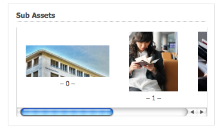

# 「建立和配置資產編輯器」頁 {#creating-and-configuring-asset-editor-pages}

本檔案說明下列內容：

* 建立自訂資產編輯器頁面的原因。
* 如何建立和自訂資產編輯器頁面，這些頁面是WCM頁面，可讓您檢視和編輯中繼資料，以及對資產執行動作。
* 如何同時編輯多個資產。

<!-- TBD: Add UICONTROL tags. Need PM review. Flatten the structure a bit. Re-write to remove Geometrixx mentions and to adhere to 6.5 OOTB samples. -->

>[!NOTE]
>
>「資產共用」可做為開放原始碼參考實作。 請參 [閱資產共用共用](https://adobe-marketing-cloud.github.io/asset-share-commons/)。 未正式支援。

## 為何要建立和設定資產編輯器頁面？ {#why-create-and-configure-asset-editor-pages}

數位資產管理正被越來越多的案例所使用。 從專業訓練使用者的小型解決方案（例如攝影師或分類學者）到更大且更多元化的使用者群組（例如商業使用者、WCM作者、記者等），專業使用者的Adobe Experience Manager(AEM)Assets強大的使用者介面可提供太多資訊，而相關人員會開始要求特定使用者介面或應用程式存取與他們相關的數位資產……

這些以資產為中心的應用程式可以是內部網路中的簡單像片收藏館，員工可從貿易展覽造訪或公開網站的新聞中心上傳像片，例如Geometrixx提供的範例。 以資產為中心的應用程式也可以延伸至完整的解決方案，包括購物車、結帳和驗證程式。

建立以資產為中心的應用程式，在很大程度上會變成不需撰寫程式碼的設定程式，只需瞭解使用者群組及其需求，以及所使用中繼資料的知識即可。 以AEM Assets建立的資產導向應用程式可擴充：使用適中的編碼工作，可重複使用的元件來搜尋、檢視和修改資產。

AEM中以資產為中心的應用程式包含資產編輯器頁面，可用來取得特定資產的詳細檢視。 資產編輯器頁面也允許編輯元資料，前提是訪問資產的用戶具有必要的權限。

## 建立和設定資產共用頁面 {#creating-and-configuring-an-asset-share-page}

您可自訂DAM Finder功能，並建立具有您所需所有功能的頁面，稱為「資產共用」頁面。 若要建立新的「資產共用」頁面，您可使用Geometrixx Asset Share範本新增頁面，然後自訂使用者可在該頁面上執行的動作、決定檢視者如何檢視資產，以及決定使用者如何建立查詢。

以下是建立自訂「資產共用」頁面的一些使用案例：

* 記者新聞中心
* 適用於內部商業使用者的影像搜尋引擎
* 網站使用者的影像資料庫
* 中繼資料編輯器的媒體標籤介面

### 建立資產共用頁面 {#creating-an-asset-share-page}

若要建立新的「資產共用」頁面，您可以在使用網站時或從數位資產管理員建立頁面。

>[!NOTE]
>
>依預設，當您從數位資產管理員的「新增」中建立「資產共用」頁面時，系統會自動為您建立資產檢視器和資產編輯器。 ****

若要在網站主控台中建立新的資產共 **用頁** :

1. 在「網 **站** 」標籤中，導覽至您要建立資產共用頁面的位置，然後按一下「新 **增」**。

1. 選取「資 **產共用** 」頁面，然後按 **一下「建立**」。 會建立新頁面，資產共用頁面會列在「網站」標 **簽中** 。

使用Geometrixx DAM Asset Share範本建立的基本頁面外觀如下：

若要自訂「資產共用」頁面，請使用sidekick中的元素，並編輯查詢產生器屬性。 頁面 **Geometrixx Press Center** 是以此範本為基礎的自訂頁面版本：

若要透過數位資產管理員建立新的資產共用頁面：

1. 在數位資產管理員的「新增 **」中**，選 **取「新增資產共用」**。
1. 在「標 **題**」中，輸入資產共用頁面的名稱。 視需要輸入URL的名稱。

   

1. 連按兩下資產共用頁面以開啟並設定頁面。

   

   依預設，當您從「新增」建立「資產共用」頁面時 ****，系統會自動為您建立資產檢視器和資產編輯器。

#### 自訂動作 {#customizing-actions}

您可以從一系列預先定義的動作中，決定使用者可對選取的數位資產執行哪些動作。

要向「資產共用」頁添加操作，請執行以下操作：

1. 在您要自訂的「資產共用」頁面中，按一下側 **點中** 的「動作」。

可執行下列動作：

| 動作 | 說明 |
|---|---|
| [!UICONTROL 刪除動作] | 使用者可以刪除選取的資產。 |
| [!UICONTROL 下載動作] | 可讓使用者將選取的資產下載至其電腦。 |
| [!UICONTROL Lightbox 動作] | 將資產儲存至「燈箱」，您可在其中執行其他動作。 在跨多個頁面處理資產時，此功能十分有用。 燈箱也可用作資產的購物車。 |
| [!UICONTROL 移動動作] | 使用者可將資產移至其他位置 |
| [!UICONTROL 標記動作] | 讓使用者將標籤新增至選取的資產 |
| [!UICONTROL 檢視資產動作] | 在「資產」編輯器中開啟資產，以供使用者控制。 |

1. 將適當的動作拖曳至頁 **面上** 「動作」區域。 這樣會建立用於執行該動作的按鈕。

#### 確定如何顯示搜索結果 {#determining-how-search-results-are-presented}

您可以從預先定義的鏡頭清單中決定結果的顯示方式。

若要變更搜尋結果的檢視方式：

1. 在您要自訂的「資產共用」頁面中，按一下「搜尋」。

1. 將適當的鏡頭拖曳至頁面的上方中心。 在Press Center中，已可使用鏡片。 使用者按下適當的鏡頭圖示，以視需要顯示搜尋結果。

有下列可用鏡頭：

| 鏡頭 | 說明 |
|---|---|
| **[!UICONTROL 列出鏡頭]** | 以清單方式呈現資產及詳細資訊。 |
| **[!UICONTROL 馬賽克鏡頭]** | 以馬賽克方式呈現資產。 |

#### 馬賽克鏡頭 {#mosaic-lens}

#### 列出鏡頭 {#list-lens}

#### 自訂查詢產生器 {#customizing-the-query-builder}

查詢產生器可讓您輸入搜尋詞，並建立「資產共用」頁面的內容。 當您編輯查詢產生器時，您也可以決定每頁顯示多少搜尋結果、當您連按兩下資產時會開啟哪個資產編輯器、查詢搜尋的路徑，以及自訂節點類型。

若要自訂查詢產生器：

1. 在您要自訂的「資產共用」頁面中，按一下「查詢產 **生器** 」中的「編輯」。 預設情況下，將開啟「 **常規** 」頁籤。
1. 選擇每頁結果數、資產編輯器的路徑（如果您有自訂的資產編輯器）和「動作」標題。

1. 按一下「 **路徑** 」標籤。 輸入將運行搜索的路徑或多個路徑。 如果用戶使用「路徑」述詞，則覆寫這些路徑。

1. 如果需要，輸入另一個節點類型。

1. 在「查 **詢產生器URL** 」欄位中，您可以覆寫或包住查詢產生器，並使用現有的查詢產生器元件輸入新的servlet URL。 在「動 **態消息URL** 」欄位中，您也可以覆寫動態消息URL。

1. 在「文 **字** 」欄位中，輸入要顯示結果和結果頁碼的文字。 完成 **更改後** ，按一下「確定」。

#### 新增謂語 {#adding-predicates}

AEM Assets包含許多可新增至「資產共用」頁面的謂詞。 這些功能可讓您的使用者進一步縮小搜尋範圍。 在某些情況下，它們可能會覆寫查詢產生器參數（例如，路徑參數）。

要添加謂語：

1. 在您要自訂的「資產共用」頁面中，按一下「搜 **尋」**。

1. 將適當的謂語拖曳至查詢產生器下方的「資產共用」頁面。 這樣做會建立適當的欄位。

以下謂語可用：

| 述詞 | 說明 |
|---|---|
| **[!UICONTROL 日期述詞]** | 可讓使用者搜尋在特定日期前後修改的資產。 |
| **[!UICONTROL 選項述詞]** | 網站擁有者可以指定要搜尋的屬性（如屬性述詞中的cq:tags），以及要從中填入選項的內容樹狀結構（如標籤樹狀結構）。 這樣做會產生選項清單，使用者可在其中選取所選屬性（tag屬性）應具有的值(tags)。 此謂語可讓您建立清單控制項，例如標籤清單、檔案類型、影像方向等。 它最適合固定的選項集。 |
| **[!UICONTROL 路徑述詞]** | 可讓使用者視需要定義路徑和子檔案夾。 |
| **[!UICONTROL 屬性述詞]** | 網站擁有者會指定要搜尋的屬性，例如tiff:ImageLength，然後使用者可輸入值，例如800。這會傳回高800像素的所有影像。 如果您的屬性可以具有任意值，則此謂語非常有用。 |

如需詳細資訊，請參 [閱predicate Javadocs](https://helpx.adobe.com/experience-manager/6-5/sites/developing/using/reference-materials/javadoc/com/day/cq/search/eval/package-summary.html)。

1. 要進一步配置謂語，請按兩下它。 例如，當您開啟「路徑謂語」時，需要指派根路徑。

## 「建立和配置資產編輯器」頁 {#creating-and-configuring-an-asset-editor-page}

您可自訂資產編輯器，以決定使用者如何檢視和編輯數位資產。 若要這麼做，請建立新的「資產編輯器」頁面，然後自訂使用者可在該頁面上執行的檢視和動作。

>[!NOTE]
>
>如果您想要將自訂欄位新增至DAM資產編輯器，請新增cq:Widget節點至 `/apps/dam/content/asseteditors.`

### 「建立資產編輯器」頁 {#creating-the-asset-editor-page}

建立「資產編輯器」頁面時，最佳做法是直接在「資產共用」頁面下方建立頁面。

要建立「資產編輯器」頁，請執行以下操作：

1. 在「網 **站** 」標籤中，導覽至您要建立資產編輯器頁面的位置，然後按一下「新 **增」**。
1. 選取「 **Geometrixx Asset Editor」（Geometrixx資產編輯器）** ，然後按一 **下「建立**」。 新頁面隨即建立，頁面會列在「網站」 **標籤** 中。

使用Geometrixx Asset Editor範本建立的基本頁面外觀如下：

若要自訂資產編輯器頁面，請使用sidekick中的元素。 從 **** Geometrixx Press Center存取的「資產編輯器」頁面是以此範本為基礎的頁面自訂版本：

#### 將「資產編輯器」設為從「資產共用」頁面開啟 {#setting-which-asset-editor-opens-from-an-asset-share-page}

建立自訂的「資產編輯器」頁面後，您必須確定，當您連按兩下所建立之自訂「資產共用」資產時，會在自訂的「編輯器」頁面中開啟資產。

要設定「資產編輯器」頁：

1. 在「資產共用」頁面中，按一下「 **查詢產生器** 」旁的「編輯」。

1. 如果尚未選 **擇** 「常規」頁籤，請按一下該頁籤。

1. 在「資 **產編輯器的路徑」欄位中** ，輸入您要讓「資產共用」頁面在中開啟資產的資產編輯器的路徑，然後按一下「確 **定」**。

#### 新增資產編輯器元件 {#adding-asset-editor-components}

您可以借由將元件新增至頁面，來決定資產編輯器的功能。

要添加資產編輯器元件：

1. 在您要自訂的「資產編輯器」頁面中，選取側 **點中的「資產編輯器** 」。 將顯示所有可用的資產編輯器元件。

>[!NOTE]
>
>您可自訂的項目取決於可用的元件。 若要啟用元件，請移至「設計」模式，並選取您需要啟用的元件。

1. 將元件從側腳拖曳至資產編輯器，並在元件對話方塊中進行任何修改。 下表對這些元件進行了說明，並在後面的詳細說明中進行了說明。

>[!NOTE]
>
>在設計資產編輯器頁面時，您可以建立唯讀或可編輯的元件。 使用者知道，如果鉛筆的影像出現在該元件中，就可以編輯欄位。 依預設，大部分元件都會設為唯讀。

| 元件 | 說明 |
|---|---|
| **[!UICONTROL 中繼資料表單]和中繼資[!UICONTROL 料文字欄位]** | 可讓您新增其他中繼資料至資產，並對該資產執行動作，例如提交。 |
| **[!UICONTROL 子資產]** | 可讓您自訂子資產。 |
| **標記** | 可讓使用者選取並新增標籤至資產。 |
| **[!UICONTROL 縮圖]** | 顯示資產的縮圖及其檔案名稱，並讓您新增替代文字。 您也可以在此處新增資產編輯器動作。 |
| **[!UICONTROL 標題]** | 顯示可自訂的資產標題。 |

#### 中繼資料表單與文字欄位——設定檢視中繼資料元件 {#metadata-form-and-text-field-configuring-the-view-metadata-component}

中繼資料表單是包含開始和結束動作的表單。 在中間輸入「文 **本** 」欄位。 如需使 [用表單的詳細資訊](/help/sites-authoring/default-components-foundation.md#form-component) ，請參閱表單。

1. 按一下表單「開始」區 **域中的** 「編輯」，建立開始動作。 您可以視需要輸入「方塊」標題。 依預設，「方塊」標題為「中繼 **資料」**。 如果要生成用於驗證的java-script客戶端代碼，請選中「客戶端驗證」複選框。

1. 通過按一下表單的「結 **束** 」區域中的「編輯」(Edit)建立「結束」(End)操作。 例如，您可能想要建立「提交」 **按鈕** ，讓使用者提交其中繼資料變更。 或者，您可以新增「重設 **」按鈕** ，將中繼資料重設為其原始狀態。

1. 在「表單開 **始** 」和「表 **單結束」之間**，將中繼資料文字欄位拖曳至表單。 使用者將中繼資料填入這些文字欄位，以提交或完成其他動作。

1. 連按兩下欄位名稱，例如 **Title** ，以開啟中繼資料欄位並進行變更。 在「編 **輯元件** 」窗口的「常規」頁籤中，定義命名空間和欄位標籤以及類型，例如 ****`dc:title`。

如需  修改中繼資料表單中可用名稱空間的詳細資訊，請參閱自訂和擴充AEM資產。

1. 按一下「約 **束** 」(Constraints)頁籤。 您可以在此處選擇欄位是否為必需欄位，並根據需要添加任何約束。

1. 按一下「顯 **示** 」標籤。 在這裡，您可以為中繼資料欄位輸入新的寬度和行數。 選取「 **欄位為唯讀** 」核取方塊，讓使用者編輯中繼資料。

以下是包含各種欄位的中繼資料表單範例：

然後，在「資產編輯器」頁面上，使用者可以在中繼資料欄位中輸入值（如果可編輯），並執行結束動作（例如提交變更）。

#### 子資產 {#sub-assets}

子資產元件是您可以檢視及選取子資產的位置。 您可以決定主要資產和子 [資產下](/help/assets/assets.md#what-are-digital-assets) ，顯示哪些名稱。

連按兩下「子資產」元件以開啟子資產對話方塊，您可在其中變更主要資產和任何子資產的標題。 預設值會顯示在對應欄位下方。

以下是已填入子資產元件的範例：

例如，如果您選取子資產，請注意元件如何顯示適當的頁面，而「方塊」標題會從「子資產」變更為「同級」。

#### 標記 {#tags}

「標籤」元件是使用者可指派現有標籤至資產的元件，可協助日後組織與擷取。 您可將此元件設為唯讀，因此使用者無法新增標籤，但只能檢視標籤。

連按兩下「標籤」元件以開啟「標籤」對話方塊，您可在其中視需要從「標籤」中變更標題，以及選取已分配的名稱空間。 若要讓此欄位可編輯，請清除「 **[!UICONTROL 隱藏編輯]** 」核取方塊。 依預設，標籤是可編輯的。

如果使用者可以編輯標籤，則可以從「標籤」下拉式選單中選取標籤，按一下鉛筆以新增標籤。

以下是已填入的「標籤」元件：

#### 縮圖 {#thumbnail}

Thumbnail元件是資產顯示所選縮圖的位置（對於許多格式，會自動擷取縮圖）。 此外，元件會顯示檔案名稱，以 [及您可修改的動作](/help/assets/assets-finder-editor.md#adding-asset-editor-actions)。

連按兩下縮圖元件，以開啟縮圖對話方塊，您可在其中變更alt文字。 依預設，縮圖alt文字預設為「按 **一下以下載資產** 」。

以下是已填入的Thumbnail元件的範例：

#### 標題 {#title}

「標題」元件會顯示資產的標題和說明。

依預設，它處於唯讀模式，因此使用者無法編輯它。 若要讓它可編輯，請連按兩下元件並清除「隱藏編 **輯按鈕** 」核取方塊。 此外，請輸入多個資產的標題。

如果可以編輯「標題」，您可以按一下「鉛筆」開啟「資產屬性」視窗，以新增標題 **和說明** 。 此外，您也可以選擇日期和時間來開啟或關閉資產。

當使用者按一下「鉛筆」圖示編輯「標題」時，可以變更「標 **題**」、「說明」 **，然後輸入** On **and Off Times****** 以開啟和關閉資產。

以下是已填入Title元件的範例：

#### 新增資產編輯器動作 {#adding-asset-editor-actions}

您可以從一系列預先定義的動作中，決定使用者可對選取的數位資產執行哪些動作。

要向「資產編輯器」頁添加操作，請執行以下操作：

1. 在您要自訂的「資產編輯器」頁面中，按一下側 **點中的「資產編輯器** 」。

可執行下列動作：

| 動作 | 說明 |
|---|---|
| [!UICONTROL 下載] | 可讓使用者將選取的資產下載至其電腦。 |
| [!UICONTROL 編輯] | 讓使用者編輯影像（互動式編輯） |
| [!UICONTROL 燈箱] | 將資產儲存至「燈箱」，您可在其中執行其他動作。 在跨多個頁面處理資產時，此功能十分有用。 |
| [!UICONTROL 鎖定] | 可讓使用者鎖定資產。 此功能預設未啟用，必須在元件清單中啟用。 |
| [!UICONTROL 引用] | 按一下此按鈕，以顯示資產使用的頁面。 |
| [!UICONTROL 版本設定] | 可讓您建立和還原資產的版本。 |

1. 將適當的動作拖曳至頁 **面上** 「動作」區域。 這樣會建立用於執行該動作的按鈕。

## 使用「資產編輯器」頁面進行多重編輯資產 {#multi-editing-assets-with-the-asset-editor-page}

有了AEM Assets，您一次可以變更數個資產。 在擁有選取的資產後，您可以同時變更其：

* 標記
* 中繼資料

若要使用「資產編輯器」頁面多重編輯資產：

1. 開啟Geometrixx **Press Center頁** :
   `https://localhost:4502/content/geometrixx/en/company/press.html`

1. 選取資產：

   * 在Windows上： `Ctrl + click` 每個資產。
   * 在Mac上： `Cmd + click` 每個資產。
   若要選取資產範圍：按一下第一個資產，然 `Shift + click` 後按一下最後一個資產。

1. 按一 **下「動作****** 」欄位（頁面左側）中的「編輯中繼資料」。
1. 「Geometrixx **Press Center Asset Editor** 」（Geometrixx按中心資產編輯器）頁面會在新標籤中開啟。 資產的中繼資料顯示如下：

   * 標籤（不適用於所有資產，但僅適用於少數資產）會以斜體顯示。
   * 套用至所有資產的標籤會以一般字型顯示。
   * 除標籤以外的中繼資料：只有在所有選取資產的欄位值相同時，才會顯示欄位值。

1. 按一 **下「下載** 」以下載包含資產原始轉譯的zip檔案。
1. 按一下「標籤」欄位旁 **的鉛筆圖示** ，以編輯標籤：

   * 標籤不會套用至所有資產，但只會套用至少數資產具有灰色背景。
   * 套用至所有資產的標籤具有白色背景。
   您可以：

   * 按一下 **x圖示** ，移除所有資產的標籤。
   * 按一下 **+圖示** ，將標籤新增至所有資產。
   * 按一 **下箭頭** ，並選取標籤，以新增標籤至所有資產。
   按一下 **確定** ，將更改寫入表單。 「標籤」欄位旁 **的方塊** ，會自動勾選。

1. 編輯「說明」欄位。 例如，將其設定為：

   `This is a common description`

   編輯欄位時，其值會在提交表單時覆寫所選資產的現有值。

   注意：編輯欄位時，會自動勾選欄位旁的方塊。

1. 按一 **下「更新中繼資料** 」以提交表單並儲存所有資產的變更。

   注意：僅會修改已勾選的中繼資料。
