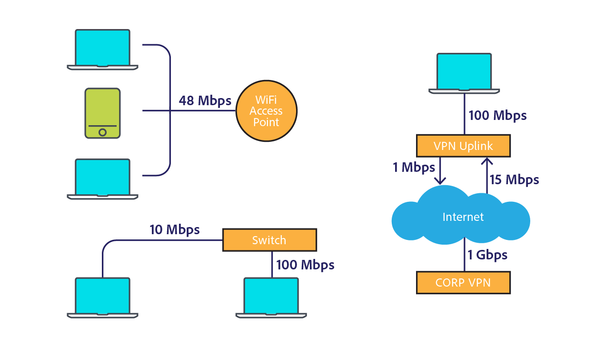

# [!DNL Assets]個網路考量事項 {#assets-network-considerations}

瞭解您的網路與瞭解[!DNL Adobe Experience Manager Assets]一樣重要。 網路可能會影響上傳、下載和使用者體驗。 繪製網路拓撲圖有助於找出網路中的瓶頸點和次最佳化區域，您必須修正這些區域才能改善網路效能和使用者體驗。

請確定您的網路圖表中包含下列專案：

* 從使用者端裝置（例如電腦、行動裝置和平板電腦）連線到網路。
* 公司網路的拓撲。
* 從公司網路和[!DNL Experience Manager]環境上行連線到網際網路。
* [!DNL Experience Manager]環境的拓撲。
* 定義[!DNL Experience Manager]網路介面的同時消費者。
* 已定義[!DNL Experience Manager]部署的工作流程。

## 從使用者端裝置連線到公司網路 {#connectivity-from-the-client-device-to-the-corporate-network}

首先，繪製個別使用者端裝置與企業網路之間的連線圖。 在這個階段，識別共用資源，例如WiFi連線，讓多位使用者存取相同的點或乙太網路交換器來上傳和下載資產。

使用者端裝置會以各種方式連線至企業網路，例如共用WiFi、乙太網路至共用交換器，以及VPN。 識別並瞭解此網路上的扼要點對於[!DNL Assets]規劃及修改網路很重要。

在圖表的左上方，有三個裝置被描繪為共用48 Mbps WiFi存取點。 如果所有裝置同時上傳，WiFi網路頻寬會在裝置之間共用。 相較於整個系統，使用者可能會在此分割的頻道上遇到三個使用者端不同的瓶頸。

測量WiFi網路的真實速度是一項挑戰，因為速度緩慢的裝置可能會影響存取點上的其他使用者端。 如果您打算使用WiFi進行資產互動，請同時從多個使用者端執行速度測試，以評估輸送量。

圖表左下角顯示兩個透過獨立通道連線至企業網路的裝置。 因此，每個裝置的最低速度可以是10 Mbps和100 Mbps。

右側顯示的電腦透過VPN以速度1 Mbps限制到公司網路的上游。 1Mbps連線的使用者體驗與1Gbps連線的使用者體驗大不相同。 視使用者互動的資產大小而定，其VPN上行鏈路可能不足以完成任務。

## 公司網路的拓撲 {#topology-of-the-corporate-network}

此圖表顯示公司網路中的上行鏈路速度比一般使用的速度要高。 這些管道是共用資源。 如果共用交換器預期可處理50個使用者端，則可能是瓶頸。 在初始圖表中，只有兩台電腦共用特定連線。

## 從公司網路和[!DNL Experience Manager]環境上行至網際網路 {#uplink-to-the-internet-from-the-corporate-network-and-aem-environment}

請務必考慮網際網路和VPC連線上的未知因素，因為網際網路的頻寬可能會因為尖峰負載或大規模提供者中斷而受損。 一般來說，網際網路連線非常可靠。 但是，它有時可能會引入瓶頸。

從公司網路到網際網路的上行鏈路上，可能有其他服務使用該頻寬。 請務必瞭解可以為Assets專用或優先處理多少頻寬。 例如，如果1Gbps連結的使用率已經是80%，您最多只能為[!DNL Experience Manager Assets]配置20%的頻寬。

企業防火牆和代理程式也可以以許多不同的方式影響頻寬。 這類裝置可使用服務品質、每位使用者的頻寬限制，或每位主機的位元速率限制，來排定頻寬優先順序。 這些是需要檢查的重要瓶頸，因為它們可能會大幅影響[!DNL Assets]使用者體驗。

在此範例中，企業有10 Gbps的上行鏈路。 它應該足夠大，以容納數個使用者端。 此外，防火牆還強制實行10 Mbps的主機速率限制。 即使網際網路的上行鏈路速度為10 Gbps，此限制仍可能會將單一主機的流量限製為10 Mbps。

這是最小的以使用者端為導向的瓶頸。 不過，您可以評估變更，或透過負責此防火牆的網路作業群組設定允許清單。

從範例圖表中，您可以推斷出6部裝置共用概念性的10Mbps通道。 根據使用的資產大小，這可能不足以達到使用者的期望。

## [!DNL Experience Manager]環境的拓撲 {#topology-of-the-aem-environment}

設計[!DNL Experience Manager]環境的拓撲需要系統組態及使用者環境中網路連線的詳細知識。

範例情境包括具有五部伺服器的發佈陣列、一個S3二進位存放區以及已設定的Dynamic Media。

Dispatcher與兩個實體（外部世界和[!DNL Experience Manager]部署）共用其100Mbps連線。 對於同時上載和下載作業，您應該將此數字除以2。 附加的外部儲存裝置使用個別的連線。

[!DNL Experience Manager]部署與多個服務共用其1Gbps連線。 從網路拓撲的觀點來看，這等同於使用不同服務共用單一通道。

檢閱從使用者端裝置到[!DNL Experience Manager]部署的網路，最小的瓶頸似乎是10 Mbit企業防火牆節流閥。 您可以在[Assets大小調整指南](assets-sizing-guide.md)中的大小計算器中使用這些值來判斷使用者體驗。

## [!DNL Experience Manager]部署的已定義工作流程 {#defined-workflows-of-the-aem-deployment}

在考量網路效能時，考量系統中可能發生的工作流程與發佈可能會很重要。 此外，您使用和I/O請求的S3或其他網路附加儲存裝置會消耗網路頻寬。 因此，即使在完全最佳化的網路中，效能也可能受到磁碟I/O的限制。

若要簡化資產擷取的相關程式（尤其是上傳大量資產時），請探索資產工作流程，並深入瞭解其設定。

評估內部工作流程拓撲時，您應該分析下列專案：

* 寫入資產的程式
* 修改資產/中繼資料時觸發的工作流程/事件
* 讀取資產的程式

以下是一些要考量的專案：

* XMP中繼資料讀取/回寫
* 自動啟用和復寫
* 浮水印
* 子資產擷取/頁面擷取
* 重疊的工作流程。

以下是資產工作流程定義的客戶範例。

