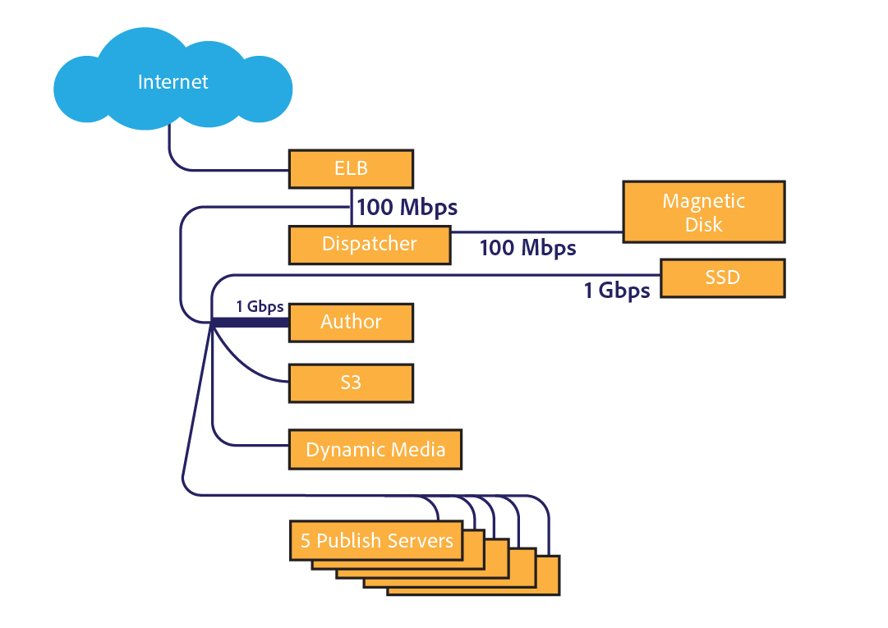

# [!DNL Assets] 網路考量 {#assets-network-considerations}

了解您的網路與了解網路同樣重要 [!DNL Adobe Experience Manager Assets]. 網路可能會影響上傳、下載和使用者體驗。 繪製網路拓撲圖有助於識別網路中必須修復的瓶頸和次優區域，以提高網路效能和用戶體驗。

請務必在網路圖中加入下列項目：

* 從客戶端設備（如電腦、移動設備和平板電腦）到網路的連接。
* 公司網路的拓撲。
* 從公司網路和 [!DNL Experience Manager] 環境。
* 拓撲 [!DNL Experience Manager] 環境。
* 定義 [!DNL Experience Manager] 網路介面。
* 定義的 [!DNL Experience Manager] 部署。

## 從客戶端設備到公司網路的連接 {#connectivity-from-the-client-device-to-the-corporate-network}

首先，繪製單個客戶端設備與公司網路之間的連接圖。 此階段需識別共用資源，例如WiFi連線，讓多個使用者存取相同的點或乙太網交換機，以上傳和下載資產。

客戶端設備以多種方式連接到企業網路，如共用WiFi、乙太網到共用交換機和VPN。 識別和了解此網路上的中斷點對於 [!DNL Assets] 規劃和修改網路。

在圖表左上角，三台設備被描述為共用一個48 Mbps WiFi接入點。 如果所有設備同時上傳，則設備之間共用WiFi網路頻寬。 與整個系統相比，用戶可能會在這個分割的通道上遇到三個客戶機的不同的阻塞點。

測量WiFi網路的真正速度是一項挑戰，因為速度較慢的設備可能會影響接入點上的其他客戶端。 如果您打算將WiFi用於資產互動，請同時從多個用戶端執行速度測試，以評估輸送量。

圖表左下角顯示通過獨立渠道連接到公司網路的兩台設備。 因此，每個設備的最低速度為10 Mbps和100 Mbps。

顯示在右側的電腦在VPN上的上游有限，速度為1 Mbps。 1Mbps連接的用戶體驗與1Gbps連接上的用戶體驗大不相同。 根據用戶交互的資產大小，其VPN上行鏈路可能不足於任務。

## 公司網路的拓撲 {#topology-of-the-corporate-network}

該圖表顯示公司網路內的上行鏈路速度高於通常使用的網路。 這些管道是共用資源。 如果共用交換機預期可處理50個客戶端，則可能是阻塞點。 在初始圖中，只有兩台電腦共用特定連接。

## 從公司網路和 [!DNL Experience Manager] 環境 {#uplink-to-the-internet-from-the-corporate-network-and-aem-environment}

在Internet和VPC連接上考慮未知因素非常重要，因為由於峰值負載或大規模提供商中斷，網際網路上的頻寬可能會受損。 一般來說，網際網路連接是可靠的。 然而，它有時會引入「斷點」。

在從公司網路到網際網路的上行鏈路上，可以使用頻寬提供其他服務。 請務必了解資產可以專用或優先安排多少頻寬。 例如，如果1 Gbps鏈路的利用率為80%，則您只能為 [!DNL Experience Manager Assets].

企業防火牆和代理還可以通過多種不同的方式來影響頻寬。 此類設備可以使用服務質量、每用戶頻寬限制或每主機位元速率限制來排定頻寬優先順序。 這些是需要檢查的重要問題，因為它們可能產生重大影響 [!DNL Assets] 使用者體驗。

在此示例中，企業有10 Gbps上行鏈路。 它應該足夠大，以容納多個客戶。 此外，防火牆還規定了10 Mbps的主機速率限制。 此限制可能將到單台主機的流量限制為10 Mbps，即使到網際網路的上行鏈路為10 Gbps。

這是最小的面向客戶端的瓶頸。 但是，您可以評估是否有更改或配置允許清單，該清單由負責此防火牆的網路操作組負責。

從示例圖中，可以得出6個設備共用10Mbps的概念通道。 視運用的資產規模而定，這可能不足以滿足使用者的期望。

## 拓撲 [!DNL Experience Manager] 環境 {#topology-of-the-aem-environment}

設計 [!DNL Experience Manager] 環境需要詳細了解系統配置以及網路在用戶環境中的連接方式。

範例案例包含一個發佈伺服器陣列，其中有五部伺服器、一部S3二進位存放區，以及一部已設定的Dynamic Media。

Dispatcher與外部世界和 [!DNL Experience Manager] 部署。 若要同時上傳和下載作業，您應將此數字除以二。 連接的外部儲存器使用單獨的連接。

此 [!DNL Experience Manager] 部署與多個服務共用1Gbps連接。 從網路拓撲的角度看，它等同於使用不同的服務共用一個通道。

從客戶端設備到 [!DNL Experience Manager] 部署時，最小的瓶頸似乎是10 Mbit企業防火牆限制。 您可以在 [資產規模調整指南](assets-sizing-guide.md) 以決定使用者體驗。

## 定義的 [!DNL Experience Manager] 部署 {#defined-workflows-of-the-aem-deployment}

考慮網路效能時，請務必考量系統中將發生的工作流程和發佈。 此外，您使用的S3或其他網路連接儲存和I/O請求佔用網路頻寬。 因此，即使在完全優化的網路中，效能也可能受磁碟I/O的限制。

若要簡化資產擷取的相關程式（尤其是上傳大量資產時），請探索資產工作流程，並深入了解其設定。

評估內部工作流拓撲時，應分析以下內容：

* 編寫資產的程式
* 修改資產/中繼資料時觸發的工作流程/事件
* 讀取資產的程式

以下是一些要考慮的項目：

* XMP中繼資料讀/回
* 自動激活和複製
* 水印
* 子資產擷取/頁面擷取
* 重疊的工作流程。

以下是資產工作流程定義的客戶範例。

