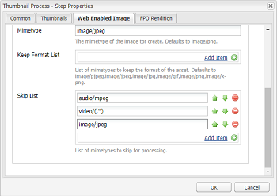

# 安裝並設定ImageMagick以搭配[!DNL Experience Manager Assets]使用 {#install-and-configure-imagemagick-to-work-with-aem-assets}

ImageMagick是用來建立、編輯、撰寫或轉換點陣圖影像的軟體外掛程式。 它能夠以各種格式（超過200種）讀取和寫入影像，包括PNG、JPEG、JPEG-2000、GIF、TIFF、DPX、EXR、WebP、Postscript、PDF和SVG。 使用ImageMagick來調整影像大小、翻轉、鏡射、旋轉、扭曲、傾斜和變形。 您也可以使用ImageMagick調整影像顏色、套用各種特殊效果，或繪製文字、線條、多邊形、橢圓和曲線。

使用命令列中的[!DNL Adobe Experience Manager]媒體處理常式，透過ImageMagick處理影像。 若要使用ImageMagick處理各種檔案格式，請參閱[Assets檔案格式最佳實務](/help/assets/assets-file-format-best-practices.md)。 若要瞭解所有支援的檔案格式，請參閱[Assets支援的格式](/help/assets/assets-formats.md)。

若要使用ImageMagick處理大型檔案，請考慮記憶體需求高於平常的情況、IM原則所需的潛在變更，以及效能的整體影響。 記憶體需求取決於各種因素，例如解析度、位元深度、色彩設定檔和檔案格式。 如果您要使用ImageMagick處理非常大型的檔案，請正確設定[!DNL Experience Manager]伺服器的基準。 最後會提供一些實用的資源。

>[!NOTE]
>
>如果您在[!DNL Adobe Managed Services] (AMS)上使用[!DNL Experience Manager]，如果您打算處理許多高解析度PSD或PSB檔案，請聯絡Adobe客戶支援。 [!DNL Experience Manager]可能無法處理超過30000 x 23000畫素的高解析度PSB檔案。

## 安裝ImageMagick {#installing-imagemagick}

ImageMagic安裝檔案有多種版本可供各種作業系統使用。 使用適用於您的作業系統的適當版本。

1. 下載適用於您作業系統的[ImageMagick安裝檔案](https://www.imagemagick.org/script/download.php)。
1. 若要在裝載[!DNL Experience Manager]伺服器的磁碟上安裝ImageMagick，請啟動安裝檔案。

1. 將路徑Environment變數設定為ImageMagic安裝目錄。
1. 若要檢查安裝是否成功，請執行`identify -version`命令。

## 設定命令列處理步驟 {#set-up-the-command-line-process-step}

您可以針對特定使用案例設定命令列處理步驟。 每次將JPEG影像檔案新增至[!DNL Experience Manager]伺服器上的`/content/dam`時，請執行這些步驟以產生翻轉的影像和縮圖（140x100、48x48、319x319和1280x1280）：

1. 在[!DNL Experience Manager]伺服器上，前往「工作流程」主控台(`https://[aem_server]:[port]/workflow`)並開啟&#x200B;**[!UICONTROL DAM更新資產]**&#x200B;工作流程模型。
1. 從&#x200B;**[!UICONTROL DAM Update Asset]**&#x200B;工作流程模型，開啟&#x200B;**[!UICONTROL EPS縮圖（由ImageMagick提供技術支援）]**&#x200B;步驟。
1. 在&#x200B;**[!UICONTROL 引數標籤]**&#x200B;中，將`image/jpeg`新增至&#x200B;**[!UICONTROL Mime型別]**&#x200B;清單。

   

1. 在&#x200B;**[!UICONTROL 命令]**&#x200B;方塊中，輸入下列命令：

   `convert ./${filename} -flip ./${basename}.flipped.jpg`

1. 選取&#x200B;**[!UICONTROL 刪除產生的轉譯]**&#x200B;和&#x200B;**[!UICONTROL 產生Web轉譯]**&#x200B;旗標。

   

1. 在&#x200B;**[!UICONTROL 啟用網頁的影像]**&#x200B;標籤中，指定尺寸1280x1280畫素之轉譯的詳細資料。 此外，請在&#x200B;**[!UICONTROL Mimetype]**&#x200B;方塊中指定`image/jpeg`。

   

1. 按一下&#x200B;**[!UICONTROL 確定]**&#x200B;以儲存變更。

   >[!NOTE]
   >
   >`convert`命令可能無法與某些Windows版本（例如Windows SE）一起執行，因為它與Windows安裝中的原生`convert`公用程式衝突。 在這種情況下，請提及ImageMagick公用程式的完整路徑。 例如，指定
   >
   >
   >`"C:\Program Files\ImageMagick-6.8.9-Q16\convert.exe" -define jpeg:size=319x319 ./${filename} -thumbnail 319x319 cq5dam.thumbnail.319.319.png`

1. 開啟&#x200B;**[!UICONTROL 處理縮圖]**&#x200B;步驟，並在&#x200B;**[!UICONTROL 略過MIME型別]**&#x200B;下新增MIME型別`image/jpeg`。

   

1. 在&#x200B;**[!UICONTROL 啟用網頁的影像]**&#x200B;索引標籤中，在&#x200B;**[!UICONTROL 略過清單]**&#x200B;下新增MIME型別`image/jpeg`。 按一下&#x200B;**[!UICONTROL 確定]**&#x200B;以儲存變更。

   

1. 儲存工作流程。

1. 若要驗證處理是否正確，請上傳JPG影像至[!DNL Assets]。 處理完成後，請檢查是否產生翻轉的影像和轉譯。

## 減少安全性弱點 {#mitigating-security-vulnerabilities}

使用ImageMagick處理影像時，有多個相關的安全漏洞。 例如，處理使用者提交的影像有遠端程式碼執行(RCE)的風險。

此外，各種影像處理外掛程式取決於ImageMagick資料庫，包括但不限於PHP的影像、Ruby的影像、Paperclip以及nodejs的影像。

如果您使用ImageMagick或受影響的程式庫，Adobe建議您至少執行下列其中一項工作（但最好是兩項都執行），以減少已知漏洞：

1. 在傳送至ImageMagick進行處理之前，請先確認所有影像檔案的開頭都是與您支援的影像檔案型別對應的預期[&quot;magic bytes&quot;](https://en.wikipedia.org/wiki/List_of_file_signatures)。
1. 使用原則檔案來停用易受攻擊的ImageMagick編碼器。 在`/etc/ImageMagick`找到ImageMagick的全域原則。
