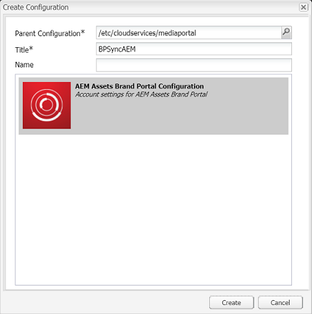

# 設定與品牌入口網站的AEM資產整合 {#configure-aem-assets-integration-with-brand-portal}

如果您是Adobe Experience Manager(AEM)Assets Brand Portal客戶，您可以將AEM Assets與Brand Portal整合，以便將資產發佈至Brand Portal。 您可以透過Adobe.io介面來設定此整合。

首先，在Marketing cloud公用閘道中建立包含驗證機制的應用程式。 接著，使用您從閘道取得的應用程式ID，在您的AEM Assets例項中建立描述檔。

使用此設定，將資產從AEM Assets發佈至品牌入口網站。 在後端，AEM伺服器會使用閘道驗證您的個人檔案，然後將AEM Assets與品牌入口網站整合。

>[!NOTE]
>
>用於設定Outh整合的使用者介面位於 [https://legacy-oauth.cloud.adobe.io/](https://legacy-oauth.cloud.adobe.io/)，此前位於 [https://marketing.adobe.com/developer/](https://marketing.adobe.com/developer/)。

## 建立JWT應用程式 {#create-jwt-application}

1. 使用您 [的Adobe](https://legacy-oauth.cloud.adobe.io/) ID登入https://legacy-oauth.cloud.adobe.io/。 **「JWT應用程式** 」(JWT Applications)頁面開啟。

   >[!NOTE]
   >
   >您只有在您是組織的系統管理員時，才能建立應用程式ID。 租用戶是您組織在Adobe Marketing cloud中註冊的技術名稱。

1. 選擇 **[!UICONTROL 添加應用程式]** ，以建立應用程式。
1. 指定應用程式的名稱和選用說明。
1. 從「組 **[!UICONTROL 織]** 」(Organization)清單中，選擇要為其同步資產的組織。
1. 從「范 **[!UICONTROL 圍]** 」清單中，選取dam-read **[!UICONTROL 、]** dam-sync **[!UICONTROL 、]********** dam-write-share和Cc-Share。
1. 按一下&#x200B;**[!UICONTROL 「新增」]**。建立JWT服務應用程式。 您可以編輯應用程式並儲存。
1. 複製為新應用程式產生的應用程式ID。

   >[!NOTE]
   >
   >請確定您不會不慎複製應用程式密碼，而非應用程式ID。

## 建立新的雲端設定 {#create-a-new-cloud-configuration}

1. 在您本 **[!UICONTROL 機AEM Assets例項的「導覽]** 」頁面中，按一下左側 **[!UICONTROL 的「工具]** 」圖示。

1. 導覽至「 **[!UICONTROL 雲端服務]>舊[!UICONTROL 版雲端服務」]**。

   

1. 在 **[!UICONTROL Cloud Services]**，在Adobe Experience cloud下找到Assets Brand **[!UICONTROL Portal]** 服務 ****。

   

1. 按一 **[!UICONTROL 下服務下方的]** 「立即設定」連結，以顯示「 **[!UICONTROL 建立設定」對話方塊]** 。
1. 在「 **[!UICONTROL 建立配置]** 」對話框中，指定新配置的標題和名稱，然後按一下「 **[!UICONTROL 建立」]**。

   

1. 在「 **[!UICONTROL AEM Assets品牌入口網站複製」對話方塊中]** ，在「租用戶URL」欄位中指 **[!UICONTROL 定您組織的URL]** 。
1. 在「用 **[!UICONTROL 戶端ID]** 」欄位中 [，貼上您在「建立應用程式」程式結尾所復](/help/assets/brand-portal-configuring-integration.md#create-jwt-application)制的應用程式ID。 選擇 **[!UICONTROL 確定]**。

   

1. 若要讓資產（從AEM發佈）公開提供給品牌入口網站的一般使用者，請啟用「公用資料夾發 **** 布」核取方塊。

   >[!NOTE]
   >
   >AEM 6.3.2.1以 **[!UICONTROL 後版本提供啟用「公用檔案夾發佈]** 」的選項。

1. 在「品 **[!UICONTROL 牌入口網站設定]** 」頁面中，按一 **[!UICONTROL 下「顯示公開金鑰]** 」以顯示您實例產生的公開金鑰。

   

   或者，按一 **[!UICONTROL 下「下載OAuth閘道的公開金鑰]** 」以下載包含公開金鑰的檔案。 然後，開啟檔案以顯示公開金鑰。

## 啟用整合 {#enable-integration}

1. 使用程式「新增設定至Marketing Cloud」最後一步中提及的下列方法 [之一顯示公開金鑰](/help/assets/brand-portal-configuring-integration.md#create-a-new-cloud-configuration)。

   * 按一 **[!UICONTROL 下「顯示公開金鑰]** 」按鈕以顯示金鑰。
   * 開啟包含索引鍵的下載檔案。

1. 開啟Marketing Cloud Developer Connection介面，然後按一下您在「建立應用程式」中建 [立的應用程式](/help/assets/brand-portal-configuring-integration.md#create-jwt-application)。
1. 將公鑰貼上到配置接 **[!UICONTROL 口的]** 「公鑰」欄位
1. 按一下&#x200B;**[!UICONTROL 「儲存」]**。訊息會確認應用程式已更新。

## 測試整合 {#test-the-integration}

1. 在您本 **[!UICONTROL 機AEM Assets例項的「導覽]** 」頁面中，按一下左側 **[!UICONTROL 的「工具]** 」圖示。

1. 導覽至「 **[!UICONTROL 部署]** > **[!UICONTROL 複製」]**。

   

1. 在「復 **[!UICONTROL 制]** 」頁中，按一下 **[!UICONTROL 作者上的代理]**。

   

1. 若要驗證AEM作者和品牌入口網站之間的連線，請開啟四個複製代理中的任何一個，然後按一下「 **[!UICONTROL 測試連線」]**。

   >[!NOTE]
   >
   >複製代理並行工作，共用作業分配，使發佈速度提高了原始速度的四倍。 在設定雲端服務後，不需要額外的設定，就可啟用依預設啟用的複製代理，以啟用多個資產的並行發佈。

   >[!NOTE]
   >
   >請避免禁用任何複製代理，因為這可能導致某些資產的複製失敗。

   

1. 查看測試結果底部以驗證複製是否成功。

   

複製成功後，您可以將資產、檔案夾和系列發佈至品牌入口網站。 如需詳細資訊，請參閱：

* [將資產和資料夾發佈至品牌入口網站](/help/assets/brand-portal-publish-folder.md)
* [將系列發佈至品牌入口網站](/help/assets/brand-portal-publish-collection.md)

## Publish assets to Brand Portal {#publish-assets-to-brand-portal}

複製成功後，您可以將資產、檔案夾和系列發佈至品牌入口網站。 若要將資產發佈至品牌入口網站，請依照下列步驟進行：

>[!NOTE]
>
>Adobe建議交錯排版，最好是在非尖峰時段進行，如此AEM作者就不會佔用過多的資源。

1. 從「資產」主控台中，選取您要發佈的資產／資料夾，然後從工具列按一 **[!UICONTROL 下「快速發佈]** 」選項。

   或者，選取您要發佈至品牌入口網站的資產。

   

1. 若要將資產發佈至品牌入口網站，可使用下列兩個選項：
   * [立即發佈資產](#publish-to-bp-now)
   * [稍後發佈資產](#publish-to-bp-now)

### 立即發佈資產 {#publish-to-bp-now}

若要將選取的資產發佈至品牌入口網站，請執行下列其中一項作業：

* 從工具列中選取「快 **[!UICONTROL 速發佈」]**。 然後，從功能表中選取「 **[!UICONTROL 發佈至品牌入口網站」]**。

* 從工具列中，選擇「管 **[!UICONTROL 理出版物」]**。

   1. 然後從「動作 **[!UICONTROL 」中]** ，選取「發佈至品牌 **[!UICONTROL 入口網站]**」，並從「 **[!UICONTROL Scheduling]** Now」(現 ****&#x200B;在排程)中選取「Publish」。 按一 **[!UICONTROL 下「下一步]**」。

   2. 在范 **[!UICONTROL 圍內]**，確認您的選擇，然後按一 **[!UICONTROL 下「發佈至品牌入口網站」]**。

出現訊息，指出資產已排入發佈至品牌入口網站的佇列。 登入品牌入口網站介面，以檢視已發佈的資產。

### 稍後發佈資產 {#publish-to-bp-later}

若要排程將資產發佈至品牌入口網站的日期或時間：

1. 在您選取要發佈的資產／檔案夾後，從頂端的工 **[!UICONTROL 具列選取「管理出版物]** 」。

1. 在「出 **[!UICONTROL 版物]** 」頁上，從「 **[!UICONTROL ActionAction]** 」中選擇「發佈到品牌 **[!UICONTROL 」並從「SchedulingPortal」中選]**********&#x200B;擇「Publish to Brand」。

   

1. 選擇啟 **[!UICONTROL 動日期]** ，並指定時間。 按一 **[!UICONTROL 下「下一步]**」。

1. 選擇啟 **動日期** ，並指定時間。 按一 **下「下一步**」。

1. 在「工作流 **[!UICONTROL 程」中指定]** 「工 **[!UICONTROL 作流」標題]**。 按一下「 **[!UICONTROL 稍後發佈]**」。

   

現在，請登入品牌入口網站，查看已發佈的資產是否可在品牌入口網站介面上使用。

