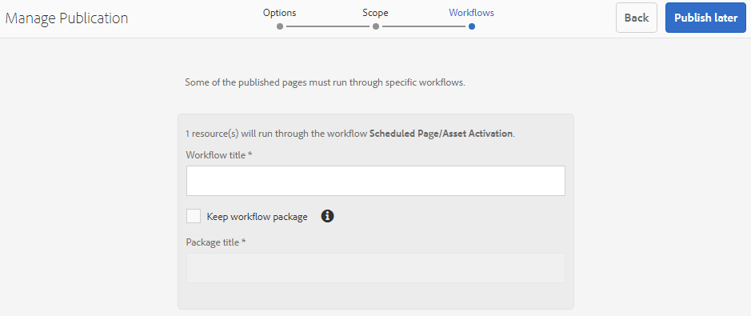

# 將Publish資產轉移至Brand Portal {#publish-assets-to-brand-portal}

| 版本 | 文章連結 |
| -------- | ---------------------------- |
| AEM as a Cloud Service  | [按一下這裡](https://experienceleague.adobe.com/docs/experience-manager-cloud-service/content/assets/brand-portal/publish-to-brand-portal.html?lang=zh-Hant) |
| AEM 6.5 | 本文章 |

身為Adobe Experience Manager (AEM) Assets管理員，您可以將資產和資料夾發佈到AEM Assets Brand Portal執行個體（或排程發佈工作流程在之後的日期/時間）。 不過，您必須先使用 Brand Portal 設定 AEM Assets。如需詳細資訊，請參閱[使用 Brand Portal 設定 AEM Assets](/help/assets/configure-aem-assets-with-brand-portal.md)。

複製成功後，您可以將資產、資料夾和集合發佈到Brand Portal。 若要將資產發佈至Brand Portal，請執行下列步驟：

>[!NOTE]
>
>Adobe 建議將發佈時間交錯開來，尤其建議選擇非尖峰時段，如此 AEM 作者才不會佔用過多資源。

1. 在Assets主控台中，選取您要發佈的資產/資料夾，然後在工具列按一下「快速Publish ]**」選項。**[!UICONTROL 

   或者，選取您要發佈至Brand Portal的資產。

   

1. 若要將資產發佈至Brand Portal，可使用下列兩個選項：
   * [立即Publish資產](#publish-to-bp-now)
   * [稍後Publish資產](#publish-to-bp-now)

## Publish資產立即 {#publish-to-bp-now}

若要將所選資產發佈至 Brand Portal，請執行下列其中一項操作：

* 在工具列中選取&#x200B;**[!UICONTROL 快速發佈]**。然後從功能表中選取&#x200B;**[!UICONTROL Publish到Brand Portal]**。

* 在工具列中選取&#x200B;**[!UICONTROL 管理出版物]**。

   1. 然後從&#x200B;**[!UICONTROL 動作]**&#x200B;選取&#x200B;**[!UICONTROL Publish到Brand Portal]**，再從&#x200B;**[!UICONTROL 排程]**&#x200B;選取&#x200B;**[!UICONTROL 立即]**。 按一下「**[!UICONTROL 下一步]**」。

   2. 在&#x200B;**[!UICONTROL 範圍]**&#x200B;內，確認您的選取專案，然後按一下&#x200B;**[!UICONTROL Publish至Brand Portal]**。

系統會顯示訊息，指出資產已排入佇列，等候發佈至 Brand Portal。登入 Brand Portal 介面可查看已發佈的資產。

## 稍後Publish資產 {#publish-to-bp-later}

若要將資產發佈至 Brand Portal 的動作安排在之後的日期或時間：

1. 選取要發佈的資產/資料夾後，從頂端的工具列選取&#x200B;**[!UICONTROL 管理出版物]**。

1. 在&#x200B;**[!UICONTROL 管理出版物]**&#x200B;頁面上，從&#x200B;**[!UICONTROL 動作]**&#x200B;選取&#x200B;**[!UICONTROL Publish到Brand Portal]**，並從&#x200B;**[!UICONTROL 排程]**&#x200B;選取&#x200B;**[!UICONTROL 稍後]**。

   

1. 選取&#x200B;**[!UICONTROL 啟用日期]**&#x200B;並指定時間。按一下&#x200B;**[!UICONTROL 下一步]**。

1. 選取&#x200B;**啟用日期**&#x200B;並指定時間。按一下&#x200B;**下一步**。

1. 在&#x200B;**[!UICONTROL 工作流程]**&#x200B;中指定&#x200B;**[!UICONTROL 工作流程標題]**。按一下&#x200B;**[!UICONTROL 稍後發佈]**。

   

現在，請登入Brand Portal以檢視已發佈的資產在Brand Portal介面上是否可用。

## 檢視已發佈至Brand Portal的檔案或資料夾 {#view-published-file-folder}

1. 登入 Brand Portal 介面可查看已發佈的資產 (視您安排的日期或時間而定)。

   

1. 切換到清單檢視以檢視資產目前的發佈狀態。

<!--2. On the [Asset Reports page](#https://experienceleague.adobe.com/en/docs/experience-manager-cloud-service/content/assets/admin/asset-reports), you can see the current state of the report job, for example, Success, Failed, Queued, or Scheduled.-->

