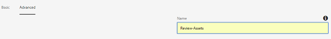
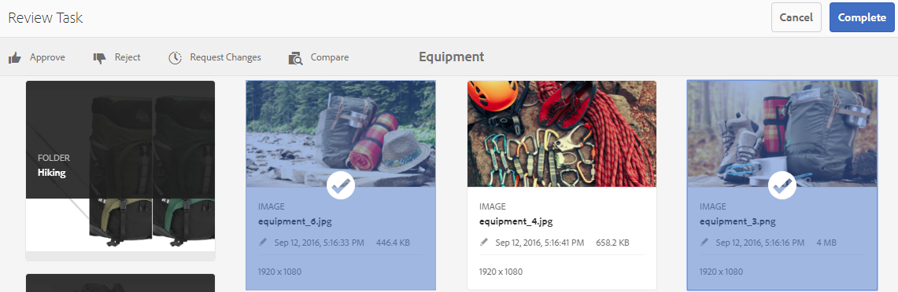

# 查看資料夾資產和集合 {#review-folder-assets-and-collections}

為資料夾或系列中的資產設定審核工作流程，並與審核者或創意合作夥伴分享，以尋求意見回應。

Adobe Experience Manager Assets可讓您為資料夾或系列中的資產設定臨機審核工作流程，並與審核者或創意合作夥伴共用，以尋求意見回應。

您可以將審閱工作流與項目關聯，也可以建立獨立的審閱任務。

共用資產後，審核者可以核准或拒絕資產。 通知會在工作流程的不同階段傳送，以通知預期的收件者有關完成各種工作的資訊。 例如，當您共用資料夾或系列時，審核者會收到資料夾／系列已共用以供審核的通知。

審核者完成審核（批准或拒絕資產）後，您會收到審核完成通知。

## 為資料夾建立審核任務 {#creating-a-review-task-for-folders}

1. 從「資產」使用者介面中，選取您要為其建立審核工作的檔案夾。
1. From the toolbar, click **[!UICONTROL Create Review Task]** to open the **[!UICONTROL Review Task]** page. If you cannot see the option in the toolbar, click **[!UICONTROL More]** and then select the option.

   

1. （可選）從「項 **[!UICONTROL 目]** 」清單中，選擇要與審閱任務關聯的項目。 預設情況下，選 **[!UICONTROL 擇「無]** 」選項。 如果不想將任何項目與審閱任務關聯，請保留此選項。

   >[!NOTE]
   >
   >只有您具有編輯者層級權限（或更高）的專案才會顯示在「專案」清 **[!UICONTROL 單中]** 。

1. 輸入複查任務的名稱，然後從「分配給」清單中選擇 **[!UICONTROL 審批人]** 。

   >[!NOTE]
   >
   >在「分配給」( **[!UICONTROL Assign To]** )清單中，選定項目的成員／組可作為批准者。

1. 輸入複查任務的說明、任務優先順序和到期日。

   

1. 在「高級」頁籤中，輸入要用於建立URI的標籤。

   

1. Click **[!UICONTROL Submit]**, and then click **[!UICONTROL Done]** to close the confirmation message. 新任務的通知將發送給批准者。
1. 以核准者身分登入資產，並導覽至資產UI。 若要核准資產，請按一 **[!UICONTROL 下「通知]** 」，然後從清單中選取審核工作。

   

1. In the **[!UICONTROL Review Task]** page, examine the details of the review task, and then click **[!UICONTROL Review]**.
1. In the **[!UICONTROL Review Task]** page, select assets, and click **[!UICONTROL Approve/Reject]** to approve or reject, as appropriate.

   

1. 從工具 **[!UICONTROL 列按一下]** 「完成」。 在對話方塊中，輸入註解，然後按一 **[!UICONTROL 下]** 「完成」確認。
1. 導覽至「資產」使用者介面並開啟檔案夾。 資產的核准狀態圖示會顯示在卡片檢視和清單檢視中。

   **卡片檢視**

   

   **清單檢視**

   

## 為系列建立審核工作 {#creating-a-review-task-for-collections}

1. 從「系列」頁面中，選擇要為其建立審閱任務的系列。
1. From the toolbar, click **[!UICONTROL Create Review Task]** to open the **[!UICONTROL Review Task]** page. If you cannot see the option on the toolbar, click **[!UICONTROL More]** and then select the option.

   

1. （可選）從「項 **[!UICONTROL 目]** 」清單中，選擇要與審閱任務關聯的項目。 預設情況下，選 **[!UICONTROL 擇「無]** 」選項。 如果不想將任何項目與審閱任務關聯，請保留此選項。

   >[!NOTE]
   >
   >只有您具有編輯者層級權限（或更高）的專案才會顯示在「專案」清 **[!UICONTROL 單中]** 。

1. 輸入複查任務的名稱，然後從「分配給」清單中選擇 **[!UICONTROL 審批人]** 。

   >[!NOTE]
   >
   >在「分配給」( **[!UICONTROL Assign To]** )清單中，選定項目的成員／組可作為批准者。

1. 輸入複查任務的說明、任務優先順序和到期日。

   

1. Click **[!UICONTROL Submit]**, and then click **[!UICONTROL Done]** to close the confirmation message. 新任務的通知將發送給批准者。
1. 以核准者身分登入資產，並導覽至資產主控台。 若要核准資產，請按一 **[!UICONTROL 下「通知]** 」，然後從清單中選取審核工作。
1. In the **[!UICONTROL Review Task]** page, examine the details of the review task, and then click **[!UICONTROL Review]**.
1. 系列中的所有資產都會顯示在檢閱頁面上。 選取資產，然後按一 **[!UICONTROL 下「核准／拒絕]** 」以核准或拒絕資產。

   

1. 從工具 **[!UICONTROL 列按一下]** 「完成」。 在對話方塊中，輸入註解，然後按一 **[!UICONTROL 下]** 「完成」確認。
1. 導覽至「系列」主控台，然後開啟系列。 資產的核准狀態圖示會同時出現在「卡片」和「清單」檢視中。

   

   *圖： 資訊卡檢視。*

   

   *圖： 清單檢視。*
