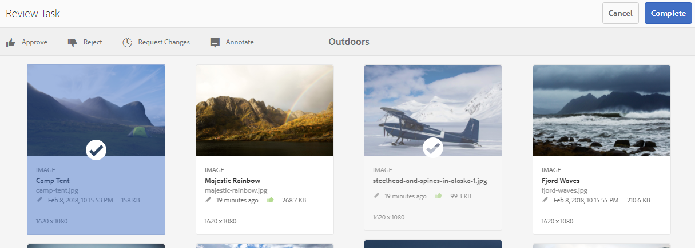

# 查看資料夾資產和集合 {#review-folder-assets-and-collections}

為資料夾或集合中的資產設定審核工作流程，並與審核者或創意合作夥伴共用，以尋求意見回饋。

[!DNL Adobe Experience Manager Assets] 可讓您為資料夾或集合中的資產設定臨機檢閱工作流程，並與審核者或創意合作夥伴共用，以尋求意見反應。

您可以將審核工作流與項目關聯，或建立獨立的審核任務。

共用資產後，審閱者可以批准或拒絕這些資產。 在工作流程的各個階段發送通知，以通知預期的收件者完成各種任務。 例如，當您共用資料夾或集合時，審核者會收到資料夾/集合已共用以供審核的通知。

審核者完成審核（批准或拒絕資產）後，您會收到審核完成通知。

## 建立資料夾{#creating-a-review-task-for-folders}的審核任務

1. 從[!DNL Assets]用戶介面中，選擇要為其建立審閱任務的資料夾。
1. 在工具欄中，按一下&#x200B;**[!UICONTROL 建立審閱任務]** 以開啟&#x200B;**[!UICONTROL 審閱任務]**&#x200B;頁。 如果您在工具列中看不到選項，請按一下「**[!UICONTROL 更多]**」，然後選取選項。

1. （可選）從&#x200B;**[!UICONTROL Project]**&#x200B;清單中，選擇要與審閱任務關聯的項目。 預設情況下，選擇&#x200B;**[!UICONTROL None]**&#x200B;選項。 如果您不想將任何項目與審閱任務關聯，請保留此選擇。

   >[!NOTE]
   >
   >只有您具有編輯者層級權限（或更高）的專案會顯示在&#x200B;**[!UICONTROL Projects]**&#x200B;清單中。

1. 輸入複核任務的名稱，然後從&#x200B;**[!UICONTROL 分配到]**&#x200B;清單中選擇批准者。

   >[!NOTE]
   >
   >在&#x200B;**[!UICONTROL 分配到]**&#x200B;清單中，所選項目的成員/組可作為批准者。

1. 輸入複核任務的說明、任務優先順序和到期日。

   

1. 在「高級」頁簽中，輸入用於建立URI的標籤。

   

1. 按一下&#x200B;**[!UICONTROL 提交]**，然後按一下&#x200B;**[!UICONTROL 完成]**&#x200B;以關閉確認訊息。 新任務的通知將發送給批准者。
1. 以核准者身分登入[!DNL Assets]，並導覽至[!DNL Assets] UI。 若要核准資產，請按一下「**[!UICONTROL 通知]**」，然後從清單中選取審核任務。

   

1. 在&#x200B;**[!UICONTROL 複查任務]**&#x200B;頁中，檢查複查任務的詳細資訊，然後按一下&#x200B;**[!UICONTROL 複查]**。
1. 在&#x200B;**[!UICONTROL 複查任務]**&#x200B;頁中，選擇資產，然後按一下&#x200B;**[!UICONTROL 批准/拒絕]**&#x200B;以酌情批准或拒絕。

   

1. 按一下工具欄中的&#x200B;**[!UICONTROL Complete]**。 在對話方塊中，輸入注釋並按一下&#x200B;**[!UICONTROL Complete]**&#x200B;以確認。
1. 導覽至[!DNL Assets]使用者介面並開啟資料夾。 資產的核准狀態圖示會顯示在卡片檢視和清單檢視中。

   **卡片檢視**

   

   **清單檢視**

   

## 為集合{#creating-a-review-task-for-collections}建立審核任務

1. 從「集合」頁中，選擇要為其建立審閱任務的集合。
1. 在工具欄中，按一下&#x200B;**[!UICONTROL 建立審閱任務]** 以開啟&#x200B;**[!UICONTROL 審閱任務]**&#x200B;頁。 如果您在工具列上看不到選項，請按一下「**[!UICONTROL 更多]**」，然後選取選項。

1. （可選）從&#x200B;**[!UICONTROL Project]**&#x200B;清單中，選擇要與審閱任務關聯的項目。 預設情況下，選擇&#x200B;**[!UICONTROL None]**&#x200B;選項。 如果您不想將任何項目與審閱任務關聯，請保留此選擇。

   >[!NOTE]
   >
   >只有您具有編輯者層級權限（或更高）的專案會顯示在&#x200B;**[!UICONTROL Projects]**&#x200B;清單中。

1. 輸入複核任務的名稱，然後從&#x200B;**[!UICONTROL 分配到]**&#x200B;清單中選擇批准者。

   >[!NOTE]
   >
   >在&#x200B;**[!UICONTROL 分配到]**&#x200B;清單中，所選項目的成員/組可作為批准者。

1. 輸入複核任務的說明、任務優先順序和到期日。

   

1. 按一下&#x200B;**[!UICONTROL 提交]**，然後按一下&#x200B;**[!UICONTROL 完成]**&#x200B;以關閉確認訊息。 新任務的通知將發送給批准者。
1. 以核准者身分登入[!DNL Assets]，並導覽至[!DNL Assets]主控台。 若要核准資產，請按一下「**[!UICONTROL 通知]**」，然後從清單中選取審核任務。
1. 在&#x200B;**[!UICONTROL 複查任務]**&#x200B;頁中，檢查複查任務的詳細資訊，然後按一下&#x200B;**[!UICONTROL 複查]**。
1. 集合中的所有資產都會顯示在審核頁面上。 選取資產，然後視情況按一下「核准/拒絕」以核准或拒絕資產。****

   

1. 按一下工具欄中的&#x200B;**[!UICONTROL Complete]**。 在對話方塊中，輸入注釋並按一下&#x200B;**[!UICONTROL Complete]**&#x200B;以確認。
1. 導覽至「集合」主控台，然後開啟集合。 資產的核准狀態圖示會同時顯示在「卡片」和「清單」檢視中。

   

   *圖：卡片檢視。*

   

   *圖：清單檢視。*
