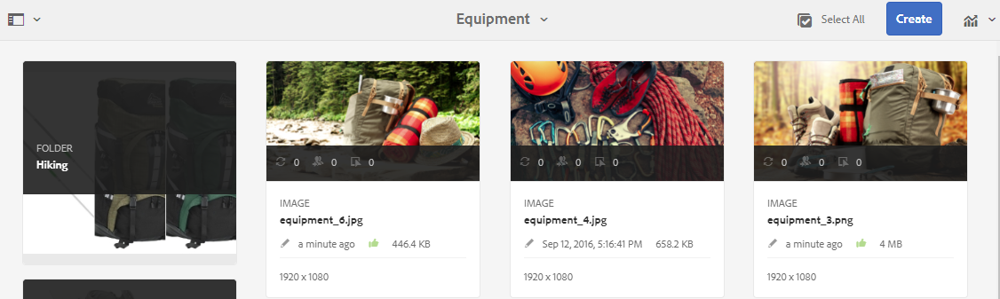

# 查看資料夾資產和集合 {#review-folder-assets-and-collections}

為資料夾或系列中的資產設定審核工作流程，並與審核者或創意合作夥伴分享，以尋求意見回應。

[!DNL Adobe Experience Manager Assets] 可讓您針對資料夾或系列中的資產設定臨機審核工作流程，並與審核者或創意合作夥伴共用該工作流程，以尋求意見回應。

您可以將審閱工作流與項目關聯，也可以建立獨立的審閱任務。

共用資產後，審核者可以核准或拒絕資產。 通知會在工作流程的不同階段傳送，以通知預期的收件者有關完成各種工作的資訊。 例如，當您共用資料夾或系列時，審核者會收到資料夾／系列已共用以供審核的通知。

審核者完成審核（批准或拒絕資產）後，您會收到審核完成通知。

## 為資料夾{#creating-a-review-task-for-folders}建立審核任務

1. 從[!DNL Assets]用戶介面中，選擇要為其建立審閱任務的資料夾。
1. 在工具欄中，按一下「建立審閱任務」****以開啟「審閱任務」]**頁。**[!UICONTROL &#x200B;如果您在工具列中看不到選項，請按一下「**[!UICONTROL 更多]**」，然後選取選項。

1. （可選）從&#x200B;**[!UICONTROL Project]**&#x200B;清單中，選擇要與審閱任務關聯的項目。 預設情況下，將選擇&#x200B;**[!UICONTROL 無]**&#x200B;選項。 如果不想將任何項目與審閱任務關聯，請保留此選項。

   >[!NOTE]
   >
   >只有您具有編輯器級權限（或更高）的項目才會顯示在&#x200B;**[!UICONTROL Projects]**&#x200B;清單中。

1. 輸入複查任務的名稱，然後從&#x200B;**[!UICONTROL 分配給]**&#x200B;清單中選擇批准者。

   >[!NOTE]
   >
   >在&#x200B;**[!UICONTROL Assign To]**&#x200B;清單中，選定項目的成員／組可作為批准者。

1. 輸入複查任務的說明、任務優先順序和到期日。

   

1. 在「高級」頁籤中，輸入要用於建立URI的標籤。

   

1. 按一下&#x200B;**[!UICONTROL 提交]** ，然後按一下&#x200B;**[!UICONTROL 完成]**&#x200B;關閉確認消息。 新任務的通知將發送給批准者。
1. 以核准者身分登入[!DNL Assets]，並導覽至[!DNL Assets] UI。 若要核准資產，請按一下「通知」**[!UICONTROL ，然後從清單中選取檢閱工作。]**

   

1. 在&#x200B;**[!UICONTROL 查看任務]**&#x200B;頁中，檢查查看任務的詳細資訊，然後按一下&#x200B;**[!UICONTROL 查看]**。
1. 在&#x200B;**[!UICONTROL 檢閱工作]**&#x200B;頁面中，選取資產，然後按一下&#x200B;**[!UICONTROL 核准／拒絕]**&#x200B;以核准或拒絕（視情況而定）。

   

1. 按一下工具欄上的&#x200B;**[!UICONTROL Complete]**。 在對話框中，輸入注釋，然後按一下&#x200B;**[!UICONTROL Complete]**&#x200B;進行確認。
1. 導覽至[!DNL Assets]使用者介面並開啟資料夾。 資產的核准狀態圖示會顯示在卡片檢視和清單檢視中。

   **卡片檢視**

   

   **清單檢視**

   

## 為系列{#creating-a-review-task-for-collections}建立審閱任務

1. 從「系列」頁面中，選擇要為其建立審閱任務的系列。
1. 在工具欄中，按一下「建立審閱任務」****以開啟「審閱任務」]**頁。**[!UICONTROL &#x200B;如果您在工具列上看不到選項，請按一下「**[!UICONTROL 更多]**」，然後選取選項。

1. （可選）從&#x200B;**[!UICONTROL Project]**&#x200B;清單中，選擇要與審閱任務關聯的項目。 預設情況下，將選擇&#x200B;**[!UICONTROL 無]**&#x200B;選項。 如果不想將任何項目與審閱任務關聯，請保留此選項。

   >[!NOTE]
   >
   >只有您具有編輯器級權限（或更高）的項目才會顯示在&#x200B;**[!UICONTROL Projects]**&#x200B;清單中。

1. 輸入複查任務的名稱，然後從&#x200B;**[!UICONTROL 分配給]**&#x200B;清單中選擇批准者。

   >[!NOTE]
   >
   >在&#x200B;**[!UICONTROL Assign To]**&#x200B;清單中，選定項目的成員／組可作為批准者。

1. 輸入複查任務的說明、任務優先順序和到期日。

   

1. 按一下&#x200B;**[!UICONTROL 提交]** ，然後按一下&#x200B;**[!UICONTROL 完成]**&#x200B;關閉確認消息。 新任務的通知將發送給批准者。
1. 以批准者身份登入[!DNL Assets]並導覽至[!DNL Assets]主控台。 若要核准資產，請按一下「通知」**[!UICONTROL ，然後從清單中選取檢閱工作。]**
1. 在&#x200B;**[!UICONTROL 查看任務]**&#x200B;頁中，檢查查看任務的詳細資訊，然後按一下&#x200B;**[!UICONTROL 查看]**。
1. 系列中的所有資產都會顯示在檢閱頁面上。 選擇資產，然後按一下「核准／拒絕」以核准或拒絕資產（視情況而定）。****

   

1. 按一下工具欄上的&#x200B;**[!UICONTROL Complete]**。 在對話框中，輸入注釋，然後按一下&#x200B;**[!UICONTROL Complete]**&#x200B;進行確認。
1. 導覽至「系列」主控台，然後開啟系列。 資產的核准狀態圖示會同時出現在「卡片」和「清單」檢視中。

   

   *圖：資訊卡檢視。*

   

   *圖：清單檢視。*
