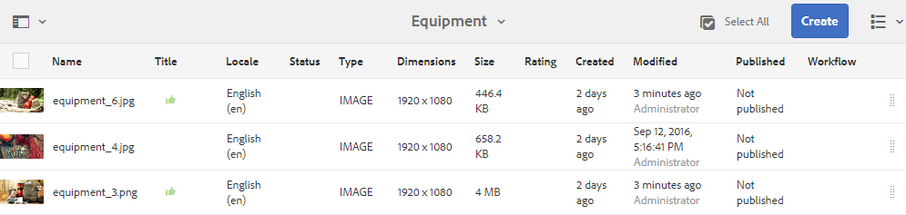
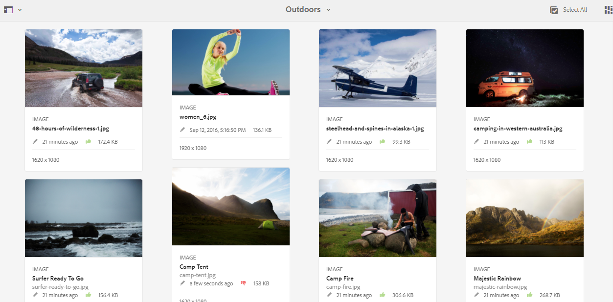

# 查看資料夾資產和集合 {#review-folder-assets-and-collections}

| 版本 | 文章連結 |
| -------- | ---------------------------- |
| AEM as a Cloud Service  | [按一下這裡](https://experienceleague.adobe.com/docs/experience-manager-cloud-service/content/assets/manage/bulk-approval.html?lang=en) |
| AEM 6.5 | 本文 |
| AEM 6.4 | [按一下這裡](https://experienceleague.adobe.com/docs/experience-manager-64/assets/using/bulk-approval.html?lang=en) |

為資料夾或集合中的資產設定審核工作流程，並與審核者或創意合作夥伴共用，以尋求意見回饋。

[!DNL Adobe Experience Manager Assets] 可讓您為資料夾或集合中的資產設定臨機檢閱工作流程，並與審核者或創意合作夥伴共用，以尋求意見反應。

您可以將審核工作流與項目關聯，或建立獨立的審核任務。

共用資產後，審閱者可以批准或拒絕這些資產。 在工作流程的各個階段發送通知，以通知預期的收件者完成各種任務。 例如，當您共用資料夾或集合時，審核者會收到資料夾/集合已共用以供審核的通知。

審核者完成審核（批准或拒絕資產）後，您會收到審核完成通知。

## 為資料夾建立審核任務 {#creating-a-review-task-for-folders}

1. 從 [!DNL Assets] 用戶介面，選擇要為其建立審閱任務的資料夾。
1. 在工具列中，按一下 **[!UICONTROL 建立審閱任務]**  開啟 **[!UICONTROL 審核任務]** 頁面。 如果您在工具列中看不到選項，請按一下 **[!UICONTROL 更多]** ，然後選取選項。

1. （選用）從 **[!UICONTROL 專案]** 清單中，選擇要與審閱任務關聯的項目。 依預設， **[!UICONTROL 無]** 選項。 如果您不想將任何項目與審閱任務關聯，請保留此選擇。

   >[!NOTE]
   >
   >在 **[!UICONTROL 專案]** 清單。

1. 輸入複核任務的名稱，然後從 **[!UICONTROL 指派給]** 清單。

   >[!NOTE]
   >
   >所選項目的成員/組在 **[!UICONTROL 指派給]** 清單。

1. 輸入複核任務的說明、任務優先順序和到期日。

   

1. 在「高級」頁簽中，輸入用於建立URI的標籤。

   

1. 按一下 **[!UICONTROL 提交]**，然後按一下 **[!UICONTROL 完成]** 以關閉確認訊息。 新任務的通知將發送給批准者。
1. 登入 [!DNL Assets] 作為核准者，並導覽至 [!DNL Assets] UI。 若要核准資產，請按一下 **[!UICONTROL 通知]** 然後從清單中選擇審閱任務。

   

1. 在 **[!UICONTROL 審核任務]** 頁，檢查審核任務的詳細資訊，然後按一下 **[!UICONTROL 檢閱]**.
1. 在 **[!UICONTROL 審核任務]** 頁面，選取資產，然後按一下 **[!UICONTROL 批准/拒絕]** 酌情批准或拒絕。

   

1. 按一下 **[!UICONTROL 完成]** 的上界。 在對話方塊中，輸入註解並按一下  **[!UICONTROL 完成]** 確認。
1. 導覽至 [!DNL Assets] 使用者介面並開啟資料夾。 資產的核准狀態圖示會顯示在卡片檢視和清單檢視中。

   **卡片檢視**

   

   **清單檢視**

   

## 為集合建立審核任務 {#creating-a-review-task-for-collections}

1. 從「集合」頁中，選擇要為其建立審閱任務的集合。
1. 在工具列中，按一下 **[!UICONTROL 建立審閱任務]**  開啟 **[!UICONTROL 審核任務]** 頁面。 如果您在工具列上看不到選項，請按一下 **[!UICONTROL 更多]** ，然後選取選項。

1. （選用）從 **[!UICONTROL 專案]** 清單中，選擇要與審閱任務關聯的項目。 依預設， **[!UICONTROL 無]** 選項。 如果您不想將任何項目與審閱任務關聯，請保留此選擇。

   >[!NOTE]
   >
   >在 **[!UICONTROL 專案]** 清單。

1. 輸入複核任務的名稱，然後從 **[!UICONTROL 指派給]** 清單。

   >[!NOTE]
   >
   >所選項目的成員/組在 **[!UICONTROL 指派給]** 清單。

1. 輸入複核任務的說明、任務優先順序和到期日。

   

1. 按一下 **[!UICONTROL 提交]**，然後按一下 **[!UICONTROL 完成]** 以關閉確認訊息。 新任務的通知將發送給批准者。
1. 登入 [!DNL Assets] 作為核准者，並導覽至 [!DNL Assets] 控制台。 若要核准資產，請按一下 **[!UICONTROL 通知]** 然後從清單中選擇審閱任務。
1. 在 **[!UICONTROL 審核任務]** 頁，檢查審核任務的詳細資訊，然後按一下 **[!UICONTROL 檢閱]**.
1. 集合中的所有資產都會顯示在審核頁面上。 選取資產，然後按一下 **[!UICONTROL 批准/拒絕]** 視情況核准或拒絕資產。

   

1. 按一下 **[!UICONTROL 完成]** 的上界。 在對話方塊中，輸入註解並按一下 **[!UICONTROL 完成]** 確認。
1. 導覽至「集合」主控台，然後開啟集合。 資產的核准狀態圖示會同時顯示在「卡片」和「清單」檢視中。

   

   *圖：卡片檢視。*

   

   *圖：清單檢視。*
