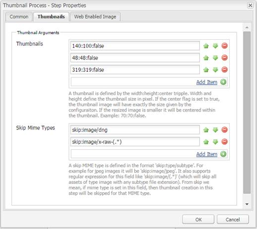

# 使用Camera Raw{#camera-raw-support}處理影像

您可以啟用[!DNL Adobe Camera Raw]支援來處理原始檔案格式，例如CR2、NEF和RAF，並以JPEG格式呈現影像。 [!DNL Adobe Experience Manager Assets]使用「軟體分發」中提供的[Camera Raw軟體包](https://experience.adobe.com/#/downloads/content/software-distribution/en/aem.html?package=/content/software-distribution/en/details.html/content/dam/aem/public/adobe/packages/aem630/product/assets/aem-assets-cameraraw-pkg)支援該功能。

>[!NOTE]
>
>此功能僅支援JPEG轉譯。 它在Windows 64位元、Mac OS和RHEL 7.x上都受支援。

要在[!DNL Experience Manager Assets]中啟用[!DNL Camera Raw]支援，請執行以下步驟：

1. 從軟體分發下載[Camera Raw軟體包](https://experience.adobe.com/#/downloads/content/software-distribution/en/aem.html?package=/content/software-distribution/en/details.html/content/dam/aem/public/adobe/packages/aem630/product/assets/aem-assets-cameraraw-pkg)。
1. 存取 `https://[aem_server]:[port]/workflow`. 開啟&#x200B;**[!UICONTROL DAM更新資產]**&#x200B;工作流程。
1. 開啟「處理縮圖」步驟&#x200B;**[!UICONTROL 。]**
1. 在&#x200B;**[!UICONTROL 縮圖]**&#x200B;標籤中提供以下配置：

   * **[!UICONTROL 縮圖]**:  `140:100:false, 48:48:false, 319:319:false`
   * **[!UICONTROL 略過 Mime 類型]**: `skip:image/dng, skip:image/x-raw-(.*)`

   

1. 在&#x200B;**[!UICONTROL Web Enabled Image]**&#x200B;標籤中，在&#x200B;**[!UICONTROL Skip List]**&#x200B;欄位中，指定`audio/mpeg, video/(.*), image/dng, image/x-raw-(.*)`。

   

1. 從側面板，在「縮圖建立」步驟&#x200B;**[!UICONTROL 下方新增**[!UICONTROL  Camera Raw/DNG處理常式&#x200B;]**步驟。]**
1. 在&#x200B;**[!UICONTROL Camera Raw/DNG處理常式]**&#x200B;步驟中，在&#x200B;**[!UICONTROL 參數]**&#x200B;標籤中新增下列設定：

   * **[!UICONTROL Mime類型]**: `image/dng` 和  `image/x-raw-(.*)`
   * **[!UICONTROL 命令]**:

      * `DAM_Raw_Converter ${directory}/${filename} ${directory} cq5dam.web.1280.1280.jpeg 1280 1280`
      * `DAM_Raw_Converter ${directory}/${filename} ${directory} cq5dam.thumbnail.319.319.jpeg 319 319`
      * `DAM_Raw_Converter ${directory}/${filename} ${directory} cq5dam.thumbnail.140.100.jpeg 140 100`
      * `DAM_Raw_Converter ${directory}/${filename} ${directory} cq5dam.thumbnail.48.48.jpeg 48 48`

   

1. 按一下「**[!UICONTROL 儲存]**」。

>[!NOTE]
>
>請確定上述組態與「Camera Raw和DNG處理步驟&#x200B;]**組態的範例DAM更新資產」相同。**[!UICONTROL 

您現在可以將Camera Raw檔案匯入「資產」。 安裝Camera Raw軟體包並配置所需的工作流後，側窗格清單中將顯示&#x200B;**[!UICONTROL Image Adjust]**&#x200B;選項。

*圖：側窗格中的選項。*

*圖：使用選項對影像進行輕量型編輯。*

將編輯保存到[!DNL Camera Raw]影像後，將為該影像生成新的格式副本`AdjustedPreview.jpg`。 對於[!DNL Camera Raw]以外的其他影像類型，變更會反映在所有轉譯中。

## 最佳做法、已知問題和限制{#best-practices}

此功能有下列限制：

* 此功能僅支援JPEG轉譯。 它在Windows 64位元、Mac OS和RHEL 7.x上都受支援。
* RAW和DNG格式不支援中繼資料回寫。
* [!DNL Camera Raw]程式庫在每次可處理的像素總數上有限制。 目前，不論先遇到何種條件，它都可處理檔案長邊最多65000像素，或512 MP。
