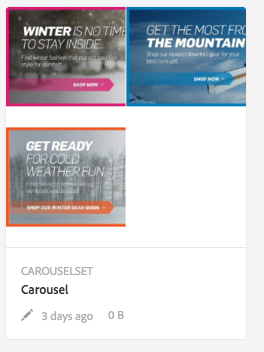
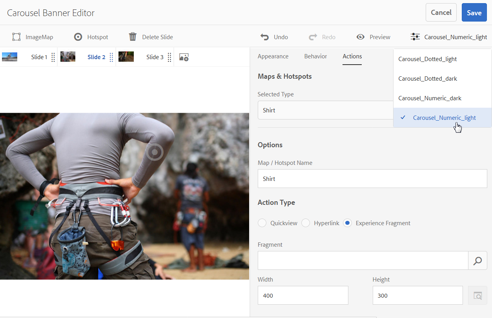

# 輪播橫幅{#carousel-banners}

輪播橫幅可讓行銷人員輕鬆建立互動式輪播促銷內容，並將內容傳送至任何畫面，藉此促進轉換。

建立和修改促銷橫幅中的主要內容可能很耗時，這會限制您快速發佈新內容或使其更具針對性的能力。 轉盤橫幅可讓您快速建立或修改旋轉橫幅。 您可以新增互動功能，例如連結至產品詳細資料或相關資源的熱點，並將其傳送至任何畫面，讓您更快將新的促銷內容推向市場。

轉盤橫幅是由具有單字的橫幅所指定 **[!UICONTROL 輪播集]**

在您的網站上，輪播橫幅看起來可能如下所示：

您可以在此處導覽影像（按一下數字）。 此外，幻燈片會根據您可以自訂的時間間隔自動旋轉。 您在轉盤橫幅中新增的影像同時支援連結區和影像地圖，讓使用者可以選取或移至超連結或存取「快速檢視」視窗。

在此範例中，使用者點選或按一下影像地圖並存取快速檢視視窗以取得手套：

## 觀看輪播橫幅的建立方式 {#watch-how-carousel-banners-are-created}

播放逐步解說 [輪播橫幅的建立方式](https://s7d5.scene7.com/s7viewers/html5/VideoViewer.html?videoserverurl=https://s7d5.scene7.com/is/content/&amp;emailurl=https://s7d5.scene7.com/s7/emailFriend&amp;serverUrl=https://s7d5.scene7.com/is/image/&amp;config=Scene7SharedAssets/Universal_HTML5_Video_social&amp;contenturl=https://s7d5.scene7.com/skins/&amp;asset=S7tutorials/InteractiveCarouselBanner)（10分33秒）。 您也會瞭解如何預覽、編輯及傳遞輪播橫幅。

>[!NOTE]
>
>必須將非管理員使用者新增至 **[!UICONTROL `dam-users`]** 群組才能建立或編輯輪播橫幅。 如果您在建立或編輯時遇到問題，請洽詢您的系統管理員，以便將您新增至 **[!UICONTROL `dam-users`]** 群組。

## 快速入門：輪播橫幅 {#quick-start-carousel-banners}

若要使用輪播橫幅快速上手：

1. [識別熱點和影像地圖變數](#identifying-hotspot-and-image-map-variables) (僅適用於使用Experience Manager Assets + Dynamic Media的客戶)

   首先，請識別現有Quickview實作所使用的動態變數，以便在Adobe Experience Manager Assets中的轉盤橫幅建立程式期間正確輸入熱點和影像地圖資料。

   >[!NOTE]
   >
   >如果您是Experience Manager Sites或電子商務客戶，則可以使用內建功能導覽至產品頁面，並在產品目錄中查詢現有SKU （庫存單位）。 您不需要手動輸入熱點或影像地圖變數。 檢視以下資訊： [設定電子商務](/help/commerce/cif-classic/administering/generic.md).
   >
   >
   >如果您是Experience Manager Assets和Dynamic Media客戶，請手動輸入連結區和影像地圖的資料，然後將發佈的URL或內嵌程式碼與協力廠商內容管理系統整合。

1. 可選：視需 [要建立轉盤集檢視器預設](/help/assets/managing-viewer-presets.md)。

   如果您是管理員，可以透過建立自己的轉盤檢視器預設集來自訂轉盤的行為和外觀。 主要優點在於您可以對多個輪播重複使用此自訂檢視器預設集。 不過，使用者可以選擇在編寫轉盤時直接自訂轉盤的行為和外觀。 如果您想要針對特定輪播進行特定設計，則此方法為偏好方法。

1. [上傳影像橫幅](#uploading-image-banners).

   上傳您想要互動的影像橫幅。

1. [建立轉盤集](#creating-carousel-sets).

   在輪播集中，使用者會瀏覽橫幅影像，並選取熱點或影像地圖以存取相關內容。

   若要在資產中建立轉盤集，請選取「 」 **[!UICONTROL 建立]**，然後選取 **[!UICONTROL 傳送集]**. 將資產新增至每張投影片並選取 **[!UICONTROL 儲存]**. 您也可以直接在編輯器中編輯轉盤的外觀和行為。

1. [將熱點或影像地圖新增至影像橫幅](#adding-hotspots-or-image-maps-to-an-image-banner).

   將一個或多個熱點或影像地圖新增至影像橫幅，並將每個熱點或影像地圖與連結、快速檢視或體驗片段等動作建立關聯。 新增熱點或影像地圖後，您可以發佈轉盤集來完成此工作。 發佈作業會建立內嵌程式碼，您可將其用於複製並套用至網站登陸頁面。

   另請參閱 [（選用）預覽轉盤橫幅](#optional-previewing-carousel-banners)  — 選擇性。 如有需要，您可以檢視轉盤集的表示方式，並測試其互動性。

1. [發佈輪播橫幅](#publishing-carousel-banners).

   您可以像發佈任何資產一樣發佈轉盤集。 在「資產」中，導覽至「轉盤集」並選取它，然後選取 **[!UICONTROL 發佈]**. 發佈轉盤集時會啟用URL和內嵌字串。

1. 執行下列任一項作業：

   * [將輪播橫幅新增至您的網站頁面](#adding-a-carousel-banner-to-your-website-page) 您可以將傳送橫幅URL或您已複製的內嵌程式碼新增至網站頁面。

      * [將輪播橫幅與現有的快速檢視整合](#integrating-the-carousel-banner-with-an-existing-quickview). 如果您使用協力廠商Web內容管理系統，則必須將新的轉盤橫幅與網站上現有的Quickview實作整合。

   * [在Experience Manager中將輪播橫幅新增至您的網站](/help/assets/adding-dynamic-media-assets-to-pages.md) 如果您是Experience Manager Sites客戶，可使用互動媒體元件，將轉盤集直接新增至Experience Manager中的頁面。

若要編輯轉盤集，請參閱 [編輯轉盤集](#editing-carousel-sets). 此外，您也可以檢視和編輯 [傳送集屬性](manage-assets.md#editing-properties).

## 識別熱點和影像地圖變數 {#identifying-hotspot-and-image-map-variables}

首先，識別現有Quickview實作所使用的動態變數，以便您可以在Experience Manager Assets中的轉盤集建立程式期間正確輸入熱點或影像地圖資料。

在Experience Manager Assets中將熱點或影像地圖新增至橫幅影像時，請指派SKU和選用的額外變數至每個熱點或影像地圖。 這類變數稍後會用於比對熱點或影像地圖與Quickview內容。

>[!NOTE]
>
>如果您是Experience Manager Sites和/或Experience Manager電子商務客戶，請略過此步驟。 您不需要手動識別熱點或影像地圖變數；您可以使用與電子商務的整合進行產品整合。 檢視以下資訊： [設定電子商務](/help/commerce/cif-classic/administering/generic.md). 此外，您也可以使用互動式元件，並將其新增至您的網頁。
>
>如果您是Experience Manager Assets或媒體客戶，您可以發佈URL或內嵌程式碼，然後與協力廠商內容管理系統整合，並手動識別熱點和影像地圖。

請務必正確識別要與熱點或影像地圖資料相關聯的變數數量和型別。 新增至橫幅影像的每個熱點或影像地圖都必須包含足夠的資訊，以明確識別現有後端系統中的產品。 同時，每個熱點或影像地圖不得包含超過必要的資料。 原因是這會使資料輸入流程過於複雜且進行中的熱點或影像地圖管理更容易出錯。

有不同的方式可識別要用於熱點或影像地圖資料的一組變數。

有時候，諮詢負責現有Quickview實作的IT專家就足夠了。 他們可能知道在系統中識別Quickview所需的最低資料集為何。 不過，通常也可以簡單地分析前端計畫碼的現有行為。

大部分的「快速檢視」實作都使用下列範例：

* 使用者在網站上啟動使用者介面元素。例如，點選 **[!UICONTROL 快速檢視]** 按鈕。
* 如有需要，網站會傳送Ajax請求至後端以載入快速檢視資料或內容。
* 快速檢視資料會轉譯成內容，以備在網頁上轉譯。
* 最後，前端程式碼會在畫面上以視覺化方式呈現此類內容。

接著，方法就是瀏覽已實作「快速檢視」功能的現有網站的不同區域。 觸發「快速檢視」，並擷取網頁為了載入「快速檢視」資料或內容而傳送的Ajax URL。

通常您不需要使用任何專門的偵錯工具。 現代的網頁瀏覽器配備能夠執行適當工作的網頁檢查器。 以下是一些包含網頁檢查器的網頁瀏覽器範例：

* 若要在Google Chrome中檢視所有傳出的HTTP要求，請按下F12 (Windows)或Command-Option-I (Mac)以開啟「開發人員工具」面板，然後選取「網路」索引標籤。
* 在Firefox中，您可以按F12 (Windows)或Command-Option-I (Mac)並使用其「網路」標籤來啟動Firebug外掛程式，或使用內建的偵測器工具及其「網路」標籤。

在瀏覽器中開啟網路監視時，會觸發頁面上的快速檢視。

現在，請在網路記錄檔中找到Quickview Ajax URL，並複製紀錄的URL以供日後分析。 通常當您觸發「快速檢視」時，會有許多要求傳送至伺服器。 通常，快速檢視Ajax URL是清單中的第一個專案。 它具有複雜的查詢字串部分或路徑，並且其回應MIME型別是 `text/html`， `text/xml`，或 `text/javascript`.

在此過程中，請務必使用不同的產品類別和型別，造訪您網站的不同區域。 原因在於「快速檢視」URL具有指定網站類別的共同部分，但只有在您造訪網站的其他區域時才會變更。

最簡單的情況是，快速檢視URL中的唯一變數部分是產品SKU。 在此情況下，將「熱點」或「影像地圖」新增至橫幅影像時，SKU值是您唯一需要的資料片段。

不過，在複雜的情況下，快速檢視URL會有與SKU不同的各種元素，例如類別ID、顏色代碼和大小代碼。 在這種情況下，每個元素都是您熱點中的獨立變數，或是輪播橫幅功能中的影像地圖資料定義。

請考量下列快速檢視URL範例及其產生的熱點或影像地圖變數：

<table>
 <tbody>
  <tr>
   <td>在查詢字串中找到單一SKU。</td>
   <td>
錄製的快速檢視URL包含以下專案：

    <ul>
     <li>
<code>https://server/json?productId=866558&amp;source=100</code>
 </li>
     <li>
<code>https://server/json?productId=1196184&amp;source=100</code>
 </li>
     <li>
<code>https://server/json?productId=1081492&amp;source=100</code>
 </li>
     <li>
<code>https://server/json?productId=1898294&amp;source=100</code>
 </li>
    </ul> 
URL中的唯一變數部分是 <code>productId=</code> 查詢字串引數，而且它顯然是SKU值。 因此，熱點或影像地圖只需要填入如下值的SKU欄位 <code>866558,</code> <code>1196184,</code> <code>1081492,</code> <code>1898294.</code>
 </td>
  </tr>
  <tr>
   <td>在URL路徑中找到單一SKU。</td>
   <td>
錄製的快速檢視URL包含以下專案：

    <ul>
     <li>
<code>https://server/product/6422350843</code>
 </li>
     <li>
<code>https://server/product/1607745002</code>
 </li>
     <li>
<code>https://server/product/0086724882</code>
 </li>
    </ul> 
變數部分位於路徑的最後一部分，並成為熱點/影像地圖的SKU值：<strong><code>6422350843</code>， <code>1607745002,</code> </strong><code>0086724882.</code>
 </td>
  </tr>
  <tr>
   <td>查詢字串中的SKU和類別ID。</td>
   <td>
錄製的快速檢視URL包含以下專案：

    <ul>
     <li>
<code>https://server/quickView/product/?category=1100004&amp;prodId=305466</code>
 </li>
     <li>
<code>https://server/quickView/product/?category=1100004&amp;prodId=310181</code>
 </li>
     <li>
<code>https://server/quickView/product/?category=1740148&amp;prodId=308706</code>
 </li>
    </ul> 
在這種情況下，URL中有兩個不同的部分。 SKU會儲存在 <code>prodId</code> 引數和類別ID會儲存在 <code>category=</code>引數。
 
因此，熱點/影像地圖定義是配對。 即SKU值和稱為的額外變數 <code>categoryId</code>. 產生的配對如下：

    <ul>
     <li>
SKU是 <strong><code>305466</code></strong> 和 <code>categoryId</code> 是 <code>1100004</code>.
 </li>
     <li>
SKU是 <strong><code>310181</code></strong> 和 <code>categoryId</code> 是 <strong><code>1100004</code></strong>.
 </li>
     <li>
SKU是 <strong><code>308706</code></strong> 和 <code>categoryId</code> 是 <strong><code>1740148</code></strong>.
 </li>
    </ul> </td>
  </tr>
 </tbody>
</table>

## 上傳影像橫幅 {#uploading-image-banners}

如果您已上傳要使用的影像，請繼續進行下一個步驟， [建立轉盤集](#creating-carousel-sets). 請注意，轉盤中使用的影像必須在啟用Dynamic Media後上傳。

若要上傳影像橫幅，請參閱 [上傳資產](/help/assets/manage-assets.md).

## 建立轉盤集 {#creating-carousel-sets}

>[!NOTE]
>
>必須將非管理員使用者新增至 **[!UICONTROL `dam-users`]** 群組才能建立或編輯輪播橫幅。 如果您在建立或編輯時遇到問題，請洽詢您的系統管理員，以便將您新增至 **[!UICONTROL `dam-users`]** 群組。

**若要建立轉盤集：**

1. 在「資產」中，導覽至您要建立轉盤集的資料夾，然後前往 **[!UICONTROL 建立]** > **[!UICONTROL 傳送集]**.
1. 在輪播橫幅編輯器頁面上，選取 **[!UICONTROL 點選以開啟資產選擇器]** 以選取第一張投影片的影像。

   在輪播橫幅編輯器頁面上，執行下列任一項作業：

   * 在頁面的左上角附近，選取 **[!UICONTROL 新增幻燈片]** 圖示。

   * 在頁面中間附近，選取 **[!UICONTROL 點選以開啟資產選擇器]**.

   選取以選取您要納入轉盤集的資產。 選取的資產上面有核取標籤圖示。完成後，在頁面的右上角附近，選取 **[!UICONTROL 選取]**.

   使用「資產選擇器」，您可以輸入關鍵字並點選或按一下「退貨」來搜尋 **[!UICONTROL 資產]**。您也可以套用篩選條件來調整搜尋結果。您可以依路徑、系列、檔案類型和標籤來篩選。選取篩選，然後選取 **[!UICONTROL 篩選]** 圖示來切換工作流程。 點選「檢視」圖示並選取「欄檢視」、「卡片檢視」或「清 **[!UICONTROL 單檢視」]**, **[!UICONTROL 以變更]**&#x200B;檢視 ****。

   另請參閱 [使用選取器](/help/assets/working-with-selectors.md) 以取得詳細資訊。

1. 繼續新增投影片，直到在轉盤集內新增所有要旋轉的影像為止。
1. （可選）執行下列任一項作業：

   * 如有必要，請拖曳投影片以重新排序集合清單中的影像。
   * 若要刪除影像，請選取該影像，然後選取 **[!UICONTROL 刪除幻燈片]** （在工具列上）。

   * 若要套用預設集，在頁面右上角附近，選取預設集下拉式清單，然後選取要一次套用至預設集的預設集。

   若要刪除幻燈片，請選取幻燈片，然後在工具列上選取 **[!UICONTROL 刪除幻燈片]**. 若要移動投影片，請選取重新排序圖示，並按住並移至所需位置。

1. 在幻燈片中新增影像後，您可以在影像中新增熱點、影像地圖或兩者。 另請參閱 [將熱點或影像地圖新增至影像橫幅](#adding-hotspots-or-image-maps-to-an-image-banner).
1. 您可以變更轉盤集的視覺設計和行為。 選取 **[!UICONTROL 行為]** 和 **[!UICONTROL 外觀]** 索引標籤並調整輪播橫幅的顯示方式或特定元件的行為。 另請參閱 [管理檢視器預設集](/help/assets/viewer-presets.md) 有關如何使用檢視器編輯器的詳細資訊。

   >[!NOTE]
   >
   >對於輪播橫幅，您可以調整下列專案：
   >
   >    * 影像顯示的持續時間。 依預設，每個影像會顯示9秒。
   >    * 動畫。 依預設，每個幻燈片切換都是淡化。 您可以將其變更為幻燈片切換。
   >    * 按鈕的樣式。 使用者可以點選每個點或數字來旋轉橫幅。 您可以變更設定指示器按鈕出現的位置（如果是數值或虛線樣式），以及大小。
   >    * 變更影像地圖的醒目提示樣式或用於連結區的圖示。
   >    * 編輯檢視器預設集之前，請先選擇要讓預設集以哪個樣式為依據。 如果您未選擇樣式，當您開始編輯檢視器預設集時，如果您決定變更為其他預設集，則會遺失所有變更。
   >
   >另請參閱 [轉盤橫幅的特殊考量事項](/help/assets/managing-viewer-presets.md#special-considerations-for-creating-a-carousel-banner-viewer-preset) 以取得檢視器編輯器的詳細指示和詳細資訊。

   您也可以預覽轉盤橫幅的顯示方式。 另請參閱 [（選用）預覽轉盤橫幅](#optional-previewing-carousel-banners).

1. 選取 **[!UICONTROL 儲存]** 完成後。

## 將熱點或影像地圖新增至影像橫幅 {#adding-hotspots-or-image-maps-to-an-image-banner}

您可以使用轉盤集編輯器，將熱點或影像地圖新增至橫幅。

新增熱點或影像地圖時，可將它們定義為快速檢視快顯顯示、超連結或體驗片段。

另請參閱 [體驗片段](/help/sites-authoring/experience-fragments.md).

>[!NOTE]
>
>將檢視器嵌入體驗片段時，不支援轉盤橫幅中的社群媒體分享工具。
>
>若要解決此問題，您可以使用或建立沒有社群媒體分享工具的檢視器預設集。 這類檢視器預設集可讓您成功將其嵌入體驗片段中。

將熱點或影像地圖新增至影像時，請記得儲存作業。 在您目前的建立/編輯作業階段期間，支援頁面右上角附近的「復原」和「重做」選項。

當您完成建立轉盤橫幅時，可以選擇性使用預覽，檢視轉盤橫幅向客戶呈現的呈現方式。

另請參閱 [（選用）預覽轉盤橫幅](#optional-previewing-carousel-banners).

>[!NOTE]
>
>當您新增熱點至中的影像時 [互動影像](/help/assets/interactive-images.md) 或是輪播橫幅，熱點資訊會儲存在相同的中繼資料位置。 該位置是相對於影像位置的相對位置，無論該影像是互動影像或輪播橫幅皆然。 這項功能表示您可以在任一檢視器中輕鬆重複使用相同的影像，以及其定義的熱點資料。
>
>但是請注意，轉盤橫幅支援也可能包含熱點的影像上的影像地圖，互動式影像則否。 如果您打算建立使用相同影像的互動式影像或輪播橫幅，請記住此規則。 請考慮改用相同影像的個別復本來建立互動影像和輪播橫幅。

>[!NOTE]
>
>如果您使用熱點編輯互動式影像並裁切影像，則會移除您的熱點。

另請參閱 [新增影像地圖](/help/assets/image-maps.md).

**若要將熱點或影像地圖新增至影像橫幅：**

1. 在「資產」中，導覽至您想要互動的轉盤集。
1. 選取轉盤集並選取 **[!UICONTROL 編輯]**. 「轉盤檢視器編輯器」隨即開啟。
1. 選取您要讓幻燈片互動的幻燈片。
1. 在頁面的左上角附近，選取 **[!UICONTROL 熱點]** 或 **[!UICONTROL 影像地圖]**.
1. 執行下列任一項作業：

   * 連結區：在影像上，選取您要顯示連結區的位置。
   * 針對影像地圖：在影像上，選取「 」，然後從左上方拖曳至右下方，建立影像地圖區域。 您可以拖曳邊角來調整影像地圖的大小。

   如有必要，請將熱點或影像地圖拖曳到新位置。 視需要新增更多熱點或影像地圖。

   若要刪除熱點或影像地圖，請選取 **[!UICONTROL 動作]** 標籤。 在「地 **[!UICONTROL 圖與熱點]** 」標題下，從「選定類型 **** 」下拉菜單中，選擇要刪除的熱點或影像映射的名稱。選取 **[!UICONTROL 垃圾桶]** 圖示加以選取，然後選取「 」 **[!UICONTROL 刪除]**.

1. 在「名稱」文字欄位中，輸入熱點或影像對映的名稱。 此名稱也會顯示在 **[!UICONTROL 地圖與熱點]** 下拉式清單。 提供名稱可讓您日後決定變更熱點或影像地圖時，輕鬆識別熱點或影像地圖。
1. 在「 」中執行下列任一項作業 **[!UICONTROL 動作]** 標籤：

   * 選取 **[!UICONTROL 快速檢視]**.

      * 如果您是Experience Manager Sites和電子商務客戶，請選取「產品選擇器」圖示（放大鏡）以開啟「選取產品」頁面。 選取您要使用的產品，然後選取頁面右上角的核取記號，即可返迴轉盤橫幅編輯器。
      * 如果您不是Experience Manager Sites或電子商務客戶

         * 另請參閱 [識別熱點變數](#identifying-hotspot-and-image-map-variables) 如果要定義這些變數。
         * 然後，手動輸入SKU值。 在「SKU值」文字欄位中，輸入產品的SKU （庫存單位），這是您提供的每個不同產品或服務的唯一識別碼。 輸入的SKU值會自動填入Quickview範本的變數部分，讓系統知道將點選的熱點與特定SKU的Quickview建立關聯。
         * （選擇性）如果快速檢視中有其他變數您必須用來進一步識別產品，請選取「 」 **[!UICONTROL 新增一般變數]**. 在文字欄位中，指定額外的變數。 例如， category=Mens是新增的變數。

         * 另請參閱 [使用選取器](/help/assets/working-with-selectors.md) 以取得詳細資訊。

   * 選取 **[!UICONTROL 超連結]**.

      * 如果您是Experience Manager Sites客戶，請選取「網站選擇器」圖示（資料夾）以導覽至URL。
        >[!NOTE]
        >
        >如果您的互動式內容有具有相對URL的連結，尤其是指向Experience Manager Sites頁面的連結，則無法採用URL型連結方法。

      * 如果您是獨立客戶，請在HREF文字欄位中指定連結網頁的完整URL路徑。

   請務必指定要在新的瀏覽器分頁（建議的預設值）或相同的分頁中開啟連結。

   另請參閱 [使用選取器](/help/assets/working-with-selectors.md) 以取得詳細資訊。

   * 選取 **[!UICONTROL 體驗片段]**.

      * 如果您是Experience Manager Sites客戶，請選取「搜尋」圖示（放大鏡）以開啟「體驗片段」頁面。 選取您要使用的體驗片段，然後選取 **[!UICONTROL 選取]** 位於頁面的右上角，方便您返回「熱點管理」頁面。
另請參閱 [體驗片段](/help/sites-authoring/experience-fragments.md).

      * 指定體驗片段在橫幅上顯示的寬度和高度。

        >[!NOTE]
        >
        >將檢視器嵌入體驗片段時，不支援轉盤橫幅中的社群媒體分享工具。
        >
        >若要解決此問題，請建立沒有社群媒體分享工具的檢視器預設集。 這類檢視器預設集可讓您成功將其嵌入體驗片段中。

   

   您也可以預覽轉盤橫幅的顯示方式。 另請參閱 [（選用）預覽轉盤橫幅](#optional-previewing-carousel-banners).

1. 選取「**[!UICONTROL 儲存]**」。
1. 發佈轉盤集。 發佈作業會建立可在網站頁面上使用的內嵌程式碼或URL。 如果您是Experience Manager Sites客戶，可以將轉盤集直接新增至您的網頁。

   另請參閱 [發佈資產](/help/assets/publishing-dynamicmedia-assets.md).

   另請參閱 [新增輪播集至您的網站登陸頁面](#adding-a-carousel-banner-to-your-website-page)

## 編輯轉盤集 {#editing-carousel-sets}

>[!NOTE]
>
>必須將非管理員使用者新增至 **[!UICONTROL `dam-users`]** 群組才能建立或編輯輪播橫幅。 如果您在建立或編輯時遇到問題，請洽詢您的系統管理員，以便將您新增至 **[!UICONTROL dam-users]** 群組。

您可以對轉盤集執行各種編輯任務，如下所示：

* 將幻燈片新增至輪播集。 另請參閱 [使用選取器](/help/assets/working-with-selectors.md).
* 重新排序轉盤集中的幻燈片。
* 刪除轉盤集中的資產。
* 套用檢視器預設集。
* 刪除轉盤集。
* 新增或編輯熱點及影像地圖。 另請參閱 [使用選取器](/help/assets/working-with-selectors.md).

**若要編輯轉盤集：**

1. 執行下列任一項作業：

   * 暫留在轉盤集資產上，然後選取「 」 **[!UICONTROL 編輯]** （鉛筆圖示）。
   * 將滑鼠指標暫留在轉盤集資產上，選取 **[!UICONTROL 選取]** （勾選圖示），然後選取 **[!UICONTROL 編輯]** （在工具列上）。

   * 選取「轉盤集」資產，然後在頁面左上角選取「 」 **[!UICONTROL 編輯]** （鉛筆圖示）。

1. 若要編輯轉盤集，請執行下列任一項作業：

   * 若要新增幻燈片，請選取 **[!UICONTROL 新增幻燈片]** 圖示然後導覽至您要新增至該幻燈片的資產，並選取核取標籤。
   * 若要重新排列投影片，請將投影片拖曳至新的位置（選取重新排列圖示以移動專案）。
   * 若要新增熱點或影像地圖，請選取熱點或影像地圖圖示，並參閱 [新增連結區和影像地圖](#adding-hotspots-or-image-maps-to-an-image-banner).
   * 若要編輯轉盤集的外觀或行為，請選取 **[!UICONTROL 外觀]** 標籤或 **[!UICONTROL 行為]** 標籤，然後設定您想要的選項。
   * 若要編輯熱點或影像地圖，請在適當的投影片上，選取熱點或影像地圖，然後視需要在 **[!UICONTROL 動作]** 標籤。
   * 若要刪除幻燈片，請選取幻燈片，然後選取 **[!UICONTROL 刪除幻燈片]** （在工具列上）。
   * 若要套用預設集，在頁面右上角附近，選取 **[!UICONTROL 預設集]** 下拉式清單，然後選取檢視器預設集。
   * 若要刪除整個轉盤集，請導覽至轉盤集，選取該集，然後選取「 」 **[!UICONTROL 刪除]**.

   >[!NOTE]
   >
   >如果您使用熱點編輯互動式影像並裁切影像，則會移除您的熱點。
   >
   >

## （選用）預覽轉盤橫幅 {#optional-previewing-carousel-banners}

您可以使用「預覽」來檢視轉盤橫幅提供給客戶的顯示情形，以及測試轉盤橫幅熱點與影像地圖，以確保其運作如預期。

當您對輪播橫幅感到滿意時，可以將其發佈。
另請參閱 [將視訊或影像檢視器內嵌在網頁上](/help/assets/embed-code.md).
另請參閱 [將URL連結至您的網頁應用程式](/help/assets/linking-urls-to-yourwebapplication.md). 如果您的互動式內容有具有相對URL的連結，尤其是指向Experience Manager Sites頁面的連結，則無法採用URL型連結方法。
另請參閱 [將Dynamic Media資產新增至頁面](/help/assets/adding-dynamic-media-assets-to-pages.md).

您可以從轉盤編輯器（偏好方法）預覽轉盤橫幅，或從 **[!UICONTROL 檢視者]** 清單。

**若要預覽輪播橫幅：**

1. 在 **[!UICONTROL 資產]**，導覽至您已建立的現有輪播橫幅，並選取以開啟它。
1. 選取&#x200B;**[!UICONTROL 編輯]**。
1. 在工具列右角的檢視器預設集清單中，選取檢視器以預覽輪播橫幅。

   

1. 選取 **[!UICONTROL 預覽]**.
1. 選取影像上的熱點或影像地圖，以便測試其相關動作。

**若要從「檢視器」清單預覽輪播橫幅：**

1. 在 **[!UICONTROL 資產]**，導覽至您已建立的現有輪播橫幅，並選取以開啟它。
1. 在「預覽」頁面的左上角附近，選取「內容」圖示。
1. 在 **[!UICONTROL 檢視者]** 在頁面左側的面板中，選取您要使用的輪播橫幅檢視器預設集名稱。
1. 選取影像上的熱點或影像地圖，以便測試其相關動作。

## 發佈輪播橫幅 {#publishing-carousel-banners}

發佈輪播以便使用。 發佈轉盤集時會啟用URL和內嵌程式碼。 它也會將轉盤發佈至Dynamic Media雲端，此雲端與CDN整合，用於可擴充和高效能的傳送。

>[!NOTE]
>
>如果您使用具有傳送橫幅之熱點的現有互動式影像，則必須在發佈傳送橫幅後個別發佈互動式影像。
>
>此外，如果您修改轉盤橫幅中正在使用的預先存在已發佈互動影像，則必須先發佈互動影像，這些變更才會反映在轉盤橫幅中。

另請參閱 [發佈Dynamic Media資產](/help/assets/publishing-dynamicmedia-assets.md) 以取得如何發佈轉盤橫幅的資訊。

## 將輪播橫幅新增至您的網站頁面 {#adding-a-carousel-banner-to-your-website-page}

在您上傳橫幅影像以建立轉盤、新增熱點及/或影像地圖至橫幅並發佈轉盤集後，您現在就可以將其新增至您現有的網站頁面了。

>[!NOTE]
>
>如果您是Experience Manager Sites客戶，可以將互動媒體元件拖曳至頁面，直接將輪播橫幅新增至頁面。 另請參閱 [將Dynamic Media資產新增至頁面](/help/assets/adding-dynamic-media-assets-to-pages.md).

不過，如果您是獨立的Experience Manager資產客戶，可以手動將輪播橫幅新增至您的網站登陸頁面，如本節所述。

1. 複製已發佈轉盤集的內嵌程式碼。
另請參閱 [將視訊或影像檢視器內嵌在網頁上](/help/assets/embed-code.md).

1. 將您從Experience Manager Assets複製的內嵌程式碼新增至網頁。
複製的內嵌程式碼會回應，因此必須自動符合頁面的內嵌區域。

## 將輪播橫幅與現有的快速檢視整合 {#integrating-the-carousel-banner-with-an-existing-quickview}

>[!NOTE]
>
>此步驟僅適用於獨立Experience Manager Assets客戶。

此程式的最後一步是將轉盤橫幅與網站上現有的快速檢視實作整合。 每個Quickview實作都是獨一無二，而且需要涉及前端IT人員協助的特定方法。

現有的快速檢視實施通常代表一連串在網頁上發生的相互關聯動作，其順序如下：

1. 使用者會在您網站的使用者介面中觸發元素。
1. 前端程式碼會根據步驟1所觸發的使用者介面元素來取得快速檢視URL。
1. 前端程式碼會使用在步驟2中取得的URL傳送Ajax要求。
1. 後端邏輯會將對應的快速檢視資料或內容傳回前端程式碼。
1. 前端程式碼會載入快速檢視資料或內容。
1. 前端程式碼可選擇將載入的快速檢視資料轉換為HTML表示法。
1. 前端程式碼會顯示模型對話方塊或面板，並在畫面上為一般使用者呈現HTML內容。

這些呼叫不代表網頁邏輯可從任意步驟呼叫的獨立公用API呼叫。 相反地，這是一種鏈結呼叫，下個步驟的每一個都會隱藏在上一個步驟的最後一個階段（回撥）。

在輪播橫幅取代步驟1和部分步驟2的同時，當使用者在輪播橫幅中點選熱點或影像地圖時，檢視器會處理這類互動。 檢視器會將事件傳回至包含先前新增之所有熱點或影像地圖資料的網頁。

在此類事件處理常式中，前端程式碼會執行下列動作：

* 聆聽轉盤橫幅所發出的事件。
* 根據熱點或影像地圖資料建構快速檢視URL。
* 觸發從後端載入快速檢視並在畫面上呈現以供顯示的程式。

Experience Manager Assets傳回的內嵌程式碼已備有備註的現成事件處理常式。

因此，只需取消註解程式碼，並將虛擬處理常式本文取代為特定網頁專用的程式碼。

建構快速檢視URL的程式與用來識別先前涵蓋的熱點和影像地圖變數的程式相反。

另請參閱 [識別熱點和影像地圖變數](#identifying-hotspot-and-image-map-variables).

觸發「快速檢視」URL及啟動「快速檢視」面板的最後一個步驟，極有可能需要您IT部門的前端IT人員協助。 他們最瞭解如何透過適當的步驟準確觸發Quickview實施，並擁有現成的Quickview URL。

## 使用 Quickview 建立自訂快顯視窗 {#using-quickviews-to-create-custom-pop-ups}

另請參閱 [使用Quickview建立自訂快顯視窗](/help/assets/custom-pop-ups.md).
