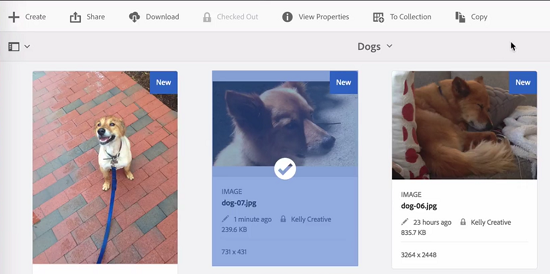

# [!DNL Experience Manager] DAM {#check-in-and-check-out-files-in-assets}中的登入和登出檔案

[!DNL Adobe Experience Manager Assets] 可讓您取出要編輯的資產，並在完成變更後將其存回。結帳資產後，只有您可以編輯、註解、發佈、移動或刪除資產。 簽出資產會鎖定資產。 在您將資產存回[!DNL Assets]之前，其他使用者無法對資產執行上述任何操作。 不過，他們仍可變更鎖定資產的中繼資料。

若要能夠登出／登入資產，您需要有其「寫入」存取權。

此功能可協助防止其他使用者覆寫作者所做的變更，讓多位使用者在跨團隊編輯工作流程時共同作業。

## 查看資產{#checking-out-assets}

1. 從[!DNL Assets]使用者介面中，選取您要結帳的資產。 您也可以選取多個資產以結帳。
1. 在工具欄中，按一下&#x200B;**[!UICONTROL Checkout]**。
**[!UICONTROL Checkout]**&#x200B;選項切換為&#x200B;**[!UICONTROL Checkin]**。
若要確認其他使用者是否可以編輯您簽出的資產，請以其他使用者的身分登入。 鎖定符號會顯示在已簽出的資產的縮圖上。

   

   選取資產。 請注意，工具列不會顯示任何選項，讓您編輯、註解、發佈或刪除資產。

   

   您可以按一下「檢視屬性」，編輯已鎖定資產的中繼資料。****

1. 按一下「編輯」，以在編輯模式中開啟資產。****

   

1. 編輯資產並儲存變更。 例如，裁切影像並儲存。

   

   您也可以選擇註解或發佈資產。

1. 從[!DNL Assets]介面中選擇編輯的資產，然後從工具欄中按一下&#x200B;**[!UICONTROL 簽入]**。 已修改的資產已簽入[!DNL Assets]，可供其他使用者編輯。

## 強制簽入{#forced-check-in}

管理員可以簽入由其他用戶簽出的資產。

1. 以管理員身分登入[!DNL Assets]。
1. 從[!DNL Assets]使用者介面中，選取一或多個已由其他使用者簽出的資產。

   

1. 在工具欄中，按一下「釋放鎖定」。 ]****[!UICONTROL &#x200B;資產已登入，可供其他使用者編輯。

## 最佳做法和限制{#tips-limitations}

* 可以刪除包含已簽出資產檔案的&#x200B;*資料夾*。 在刪除資料夾之前，請確定使用者未簽出任何數位資產。

>[!MORELIKETHIS]
>
>* [瞭解Experience Manager案頭應用程式的登入與登出](https://experienceleague.adobe.com/docs/experience-manager-desktop-app/using/using.html?lang=en#how-app-works2)
>* [教學課程影片，以瞭解在Assets中存回和取出](https://experienceleague.adobe.com/docs/experience-manager-learn/assets/collaboration/check-in-and-check-out.html)

