# 設定Dynamic Media - Scene7模式{#configuring-dynamic-media-scene-mode}

如果您針對不同環境（例如開發、測試和生產）使用Adobe Experience Manager設定，請針對其中每個環境設定Dynamic Media雲端服務。

## Dynamic Media - Scene7模式的架構圖 {#architecture-diagram-of-dynamic-media-scene-mode}

下列架構圖表說明Dynamic Media - Scene7模式的運作方式。

透過新架構，Experience Manager負責主要來源資產，以及與Dynamic Media同步，以處理及發佈資產：

1. 主要來源資產上傳至Experience Manager後，會複製到Dynamic Media。 屆時，Dynamic Media會處理所有資產處理和轉譯產生作業，例如視訊編碼和影像的動態變體。
(在Dynamic Media - Scene7模式中，預設的上傳檔案大小為2 GB以下。 若要啟用最多15 GB的2 GB上傳檔案大小，請參閱[（選用）設定Dynamic Media - Scene7模式以上傳大於2 GB的資產](#optional-config-dms7-assets-larger-than-2gb)。)
1. 產生轉譯後，Experience Manager可以安全地存取及預覽遠端Dynamic Media轉譯（不會將二進位檔傳回Experience Manager執行個體）。
1. 內容準備好發佈並核准後，就會觸發Dynamic Media服務，將內容推送至傳遞伺服器，並在CDN （內容傳遞網路）快取內容。

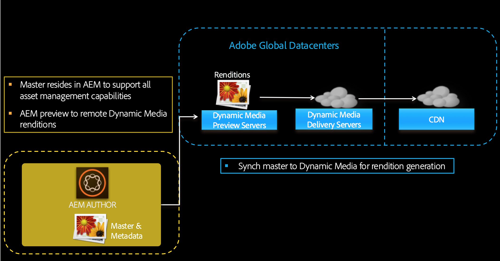

>[!IMPORTANT]
>
>下列功能清單需要您使用Adobe Experience Manager - Dynamic Media隨附的現成可用CDN。 這些功能不支援任何其他自訂CDN。
>
>* [智慧型影像](/help/assets/imaging-faq.md)
>* [快取失效](/help/assets/invalidate-cdn-cache-dynamic-media.md)
>* [直接連結保護](/help/assets/hotlink-protection.md)
>* [HTTP/2內容傳遞](/help/assets/http2.md)
>* cdn層級的URL重新導向
>* Akamai ChinaCDN (for optimal delivery in China)

## Enable Dynamic Media in Scene7 mode {#enabling-dynamic-media-in-scene-mode}

[Dynamic Media](https://business.adobe.com/products/experience-manager/assets/dynamic-media.html) is disabled by default. To take advantage of Dynamic Media features, you must enable it.

>[!WARNING]
>
>Dynamic Media - Scene7 mode is for the *Experience Manager Author instance only*. As such, you must configure `runmode=dynamicmedia_scene7` on the Experience Manager Author instance, *not* the Experience Manager Publish instance.

To enable Dynamic Media, start up Experience Manager using `dynamicmedia_scene7` run mode from the command line by entering the following in a terminal window (example port used is 4502):

```shell {.line-numbers}
java -Xms4096m -Xmx4096m -Doak.queryLimitInMemory=500000 -Doak.queryLimitReads=500000 -jar cq-quickstart-6.5.0.jar -gui -r author,dynamicmedia_scene7 -p 4502
```

## (Optional) Migrate Dynamic Media presets and configurations from 6.3 to 6.5 Zero Downtime {#optional-migrating-dynamic-media-presets-and-configurations-from-to-zero-downtime}

Upgrading Experience Manager Dynamic Media from 6.3 to 6.4 or 6.5 now includes the ability for zero downtime deployments. To migrate all your presets and configurations from `/etc` to `/conf` in CRXDE Lite, be sure you run the following curl command.

>[!NOTE]
>
>If you run your Experience Manager instance in compatibility mode – that is, you have the compatibility packaged installed – you do not need to run these commands.

For all upgrades, either with or without the compatibility package, you can copy the default, out-of-the-box viewer presets that originally came with Dynamic Media by running the following Linux® curl command:

`curl -u admin:admin -X POST https://<server_address>:<server_port>/libs/settings/dam/dm/presets/viewer.pushviewerpresets.json`

To migrate any custom viewer presets and configurations that you have created from `/etc` to `/conf`, run the following Linux® curl command:

`curl -u admin:admin -X POST https://<server_address>:<server_port>/libs/settings/dam/dm/presets.migratedmcontent.json`

## Install feature pack 18912 for bulk asset migration {#installing-feature-pack-for-bulk-asset-migration}

The installation of feature pack 18912 is *optional*.

Feature pack 18912 lets you either bulk ingest assets by way of FTP, or migrate assets from either Dynamic Media - Hybrid mode or Dynamic Media Classic into Dynamic Media - Scene7 mode on Experience Manager. It is available from [Adobe Professional Services](https://business.adobe.com/customers/consulting-services/main.html).

See [Install feature pack 18912 for bulk asset migration](/help/assets/bulk-ingest-migrate.md) for more information.

## Create a Dynamic Media Configuration in Cloud Services {#configuring-dynamic-media-cloud-services}

<!--
**Before you configure Dynamic Media** - After you receive your provisioning email with Dynamic Media credentials, you must open the [Dynamic Media Classic desktop application](https://experienceleague.adobe.com/docs/dynamic-media-classic/using/getting-started/signing-out.html#getting-started), then sign in to your account to change your password. The password provided in the provisioning email is system-generated and intended to be a temporary password only. It is important that you update the password so that Dynamic Media Cloud Service is set up with the correct credentials.

   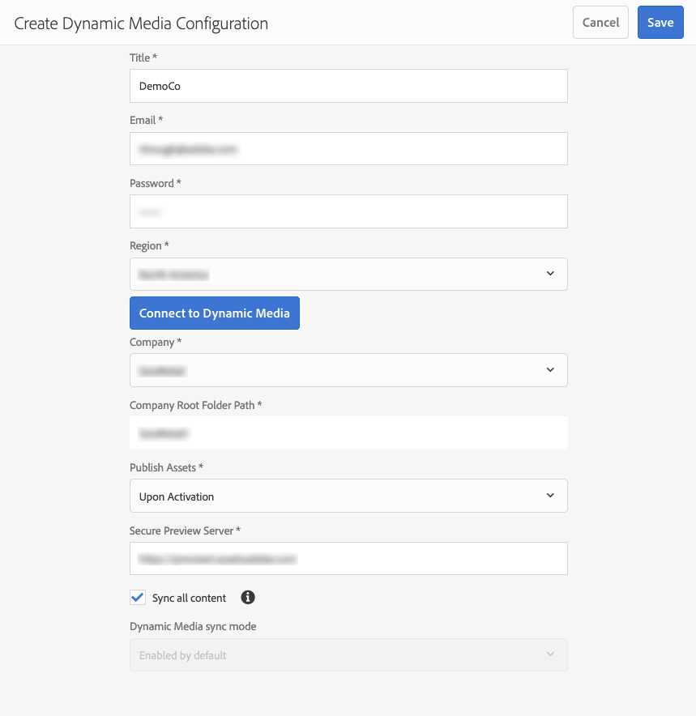

**To create a Dynamic Media Configuration in Cloud Services:**
-->

1. In Experience Manager Author mode, select the Experience Manager logo to access the global navigation console and select the Tools icon, then go to **[!UICONTROL Cloud Services]** > **[!UICONTROL Dynamic Media Configuration]**.
1. On the Dynamic Media Configuration Browser page, in the left pane, select **[!UICONTROL global]** (do not select the folder icon to the left of **[!UICONTROL global]**), then select **[!UICONTROL Create]**.
1. On the **[!UICONTROL Create Dynamic Media Configuration]** page, enter a title, the Dynamic Media account email address, password, then select your region. This information is provided to you by Adobe in the provisioning email. Contact Adobe Customer Support if you did not receive the email.

   Select **[!UICONTROL Connect to Dynamic Media]**.

1. 在&#x200B;**[!UICONTROL 變更密碼]**&#x200B;對話方塊的&#x200B;**[!UICONTROL 新密碼]**&#x200B;欄位中，輸入包含8-25個字元的新密碼。 密碼至少必須包含下列其中一項：

   * 大寫字母
   * 小寫字母
   * 數字
   * 特殊字元： `# $ & . - _ : { }`

   **[!UICONTROL 目前密碼]**&#x200B;欄位是刻意預先填入且隱藏在互動中。

   如有必要，您可以選取密碼眼睛圖示來顯示密碼，以檢查您已輸入或重新輸入的密碼的拼字。 再次選取圖示以隱藏密碼。

1. 在&#x200B;**[!UICONTROL 重複密碼]**&#x200B;欄位中，重新輸入新密碼，然後選取&#x200B;**[!UICONTROL 完成]**。

   當您在&#x200B;**[!UICONTROL 建立Dynamic Media設定]**&#x200B;頁面的右上角選取「**[!UICONTROL 儲存]**」時，新密碼便會儲存。

   如果您在&#x200B;**[!UICONTROL 變更密碼]**&#x200B;對話方塊中選取&#x200B;**[!UICONTROL 取消]**，當您儲存新建立的Dynamic Media組態時，仍必須輸入新密碼。

   另請參閱[變更Dynamic Media密碼](#change-dm-password)。

1. 連線成功時，請設定下列專案。 需要以星號(*)標示的標題：

   * **[!UICONTROL 公司]** - Dynamic Media帳戶的名稱。
     >[!IMPORTANT]
     >
     >Experience Manager的執行個體僅支援雲端服務中的一個Dynamic Media設定；請勿新增多個設定。 Experience Manager執行個體上的多個Dynamic Media設定&#x200B;_不_&#x200B;受Adobe支援或建議。

     <!-- CQDOC-19579 and CQDOC-19612 -->

     另請參閱[設定Dynamic Media公司別名帳戶](/help/assets/dm-alias-account.md)。

   * **[!UICONTROL 公司根資料夾路徑]**

   * **[!UICONTROL 發佈Assets]** — 您可以從下列三個選項中選擇：
      * **[!UICONTROL 立即]**&#x200B;表示上傳資產時，系統會內嵌資產並立即提供URL/內嵌。 發佈資產不需要使用者介入。
      * **[!UICONTROL 啟動時]**&#x200B;表示您必須先明確發佈資產，才能提供URL/內嵌連結。<br><!-- CQDOC-17478, Added March 9, 2021-->從Experience Manager 6.5.8開始，Experience Manager發佈執行個體僅會在&#x200B;**[!UICONTROL 啟動時]**&#x200B;發佈模式中反映正確的Dynamic Media中繼資料值，例如`dam:scene7Domain`和`dam:scene7FileStatus`。 若要啟用此功能，請安裝Service Pack 8，然後重新啟動Experience Manager。 前往Sling設定管理員。 尋找`Scene7ActivationJobConsumer Component`的設定或建立新的設定)。 選取&#x200B;**[!UICONTROL Dynamic Media發佈後復寫中繼資料]**&#x200B;核取方塊，然後選取&#x200B;**[!UICONTROL 儲存]**。

        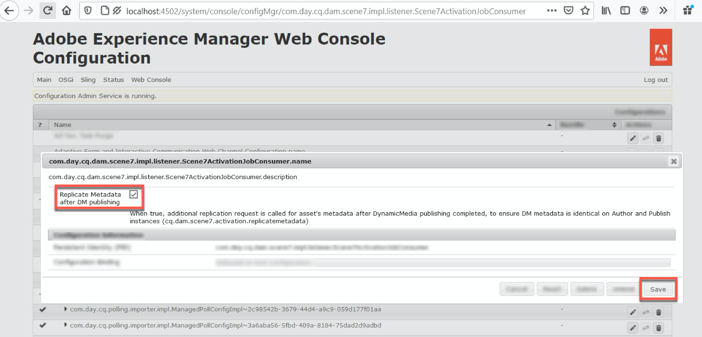

      * **[!UICONTROL 選擇性發佈]**&#x200B;此選項可讓您控制在Dynamic Media中發佈哪些資料夾。 它可讓您使用智慧型裁切或動態轉譯等功能，或決定哪些資料夾僅在Experience Manager中發佈以供預覽。 這些相同的資產&#x200B;*不是*&#x200B;發佈在Dynamic Media中以供在公用網域中傳送。<br>您可以在&#x200B;**[!UICONTROL Dynamic Media雲端組態]**&#x200B;中設定此選項，或者，如果您偏好設定，也可以選擇在資料夾的&#x200B;**[!UICONTROL 屬性]**&#x200B;中的資料夾層級設定此選項。<br>請參閱[在Dynamic Media中使用選擇性發佈](/help/assets/selective-publishing.md)。<br>如果您稍後變更此組態，或稍後在資料夾層級變更，這些變更只會影響您從此時間點上傳的新資產。 資料夾中現有資產的發佈狀態維持不變，直到您從&#x200B;**[!UICONTROL 快速發佈]**&#x200B;或&#x200B;**[!UICONTROL 管理出版物]**&#x200B;對話方塊手動變更為止。

   * **[!UICONTROL 安全預覽伺服器]** — 可讓您指定安全轉譯預覽伺服器的URL路徑。 也就是說，產生轉譯後，Experience Manager可以安全地存取及預覽遠端Dynamic Media轉譯（不會將二進位檔傳回Experience Manager執行個體）。
除非您有特殊安排使用您公司的伺服器或特殊伺服器，否則Adobe建議您保留此設定為已指定。

   * **[!UICONTROL 同步處理所有內容]** - <!-- NEW OPTION, CQDOC-15371, Added March 4, 2020-->預設為選取。 如果您想要選擇性地在同步至Dynamic Media時包含或排除資產，請取消選取此選項。 取消選取此選項可讓您從下列兩個Dynamic Media同步模式中選擇：

   * **[!UICONTROL Dynamic Media同步模式]**
      * **[!UICONTROL 預設為啟用]** — 除非您特別標籤要排除的資料夾，否則預設會將設定套用至所有資料夾。<!-- you can then deselect the folders that you do not want the configuration applied to.-->
      * **[!UICONTROL 預設為停用]** — 在您明確標示選取的資料夾以同步處理至Dynamic Media之前，此設定不會套用至任何資料夾。
若要將選取的資料夾標示為同步處理至Dynamic Media，請選取資產資料夾，然後在工具列上選取&#x200B;**[!UICONTROL 屬性]**。 在&#x200B;**[!UICONTROL 詳細資料]**&#x200B;標籤的&#x200B;**[!UICONTROL Dynamic Media同步模式]**&#x200B;下拉式清單中，從下列三個選項中選擇。 完成後，選取&#x200B;**[!UICONTROL 儲存]**。 *請記住：如果您先前選取&#x200B;**[!UICONTROL 同步所有內容]**，則無法使用這三個選項。* 另請參閱[在Dynamic Media](/help/assets/selective-publishing.md)的資料夾層級使用選擇性發佈。
         * **[!UICONTROL 已繼承]** — 資料夾上沒有明確的同步值；而是從資料夾的其中一個上階資料夾或雲端設定中的預設模式繼承同步值。 繼承的詳細狀態會透過工具提示顯示。
         * **[!UICONTROL 啟用子資料夾]** — 包含此子樹狀結構中的所有專案，以便同步至Dynamic Media。 資料夾特定的設定會覆寫雲端設定中的預設模式。
         * **[!UICONTROL 已停用子資料夾]** — 排除此子樹狀結構中的所有專案，使其無法同步至Dynamic Media。

   >[!NOTE]
   >
   >不支援Dynamic Media - Scene7模式中的版本設定。 此外，延遲啟動僅適用於在「編輯動態媒體設定」頁面中的「發佈資產 **&#x200B;**&#x200B;**&#x200B;**」設定為「啟動時」，然後只適用於在首次啟動資產時。
   >
   >資產啟動後，所有更新都會立即上線發佈至S7傳送。

1. 選取「**[!UICONTROL 儲存]**」。
1. 為了在Dynamic Media內容發佈之前安全地預覽內容，Experience Manager Author使用權杖型驗證，因此Experience Manager Author預設會預覽Dynamic Media內容。 不過，您可以「允許列出」更多IP，讓使用者存取安全地預覽內容。 若要在Experience Manager中設定此動作，請參閱[設定影像伺服器的Dynamic Media發佈設定 — 安全性索引標籤](/help/assets/dm-publish-settings.md#security-tab)。

如果您想進一步自訂設定，例如啟用ACL （存取控制清單）許可權，您可以選擇在Dynamic Media - Scene7模式[&#128279;](#optional-configuring-advanced-settings-in-dynamic-media-scene-mode)的 （選擇性）設定進階設定下完成任何工作。

<!--
1. To securely preview Dynamic Media content before it gets published, Experience Manager uses token-based validation and hence Experience Manager Author previews Dynamic Media content by default. However, you can *allowlist* more IPs to provide users access to securely preview content. To set up this action in Experience Manager, see [Configure Dynamic Media Publish Setup for Image Server - Security tab](/help/assets/dm-publish-settings.md#security-tab).     * In Experience Manager Author mode, select the Experience Manager logo to access the global navigation console.
    * In the left rail, select the **[!UICONTROL Tools]** icon, then go to **[!UICONTROL Assets]** > **[!UICONTROL Dynamic Media Publish Setup]**.
    * On the Dynamic Media Image Server page, in the **[!UICONTROL Publish Context]** drop-down list, select **[!UICONTROL Test Image Serving]**.
    * Select the **[!UICONTROL Security]** tab.
    * For the **[!UICONTROL Client address]**, select **[!UICONTROL Add]**.
    * Enter the IP address of the Experience Manager Author instance (not Dispatcher IP).
    * In the upper-right corner of the page, select **[!UICONTROL Save]**.
    -->

您現在已完成基本設定；您已準備好使用Dynamic Media - Scene7模式。

### 變更Dynamic Media密碼 {#change-dm-password}

Dynamic Media中的密碼到期日設為目前系統日期起的100年。

密碼至少必須包含下列其中一項：

* 大寫字母
* 小寫字母
* 數字
* 特殊字元： `# $ & . - _ : { }`

如有必要，您可以選取密碼眼睛圖示來顯示密碼，以檢查您已輸入或重新輸入的密碼的拼字。 再次選取圖示以隱藏密碼。

當您在&#x200B;**[!UICONTROL 編輯Dynamic Media設定]**&#x200B;頁面的右上角選取&#x200B;**[!UICONTROL 儲存]**&#x200B;時，變更的密碼便會儲存。

**若要變更Dynamic Media的密碼：**

1. 在Experience Manager作者模式中，選取Experience Manager標誌以存取全域導覽主控台。
1. 在主控台左側，選取[工具]圖示，然後前往&#x200B;**[!UICONTROL 雲端服務] > [!UICONTROL 動態媒體設定]**。
1. 在[Dynamic Media設定瀏覽器]頁面的左窗格中，選取&#x200B;**[!UICONTROL 全域]**。 請勿選取&#x200B;**[!UICONTROL 全域]**&#x200B;左側的資料夾圖示。 然後，選取&#x200B;**[!UICONTROL 編輯]**。
1. 在&#x200B;**[!UICONTROL 編輯Dynamic Media組態]**&#x200B;頁面的&#x200B;**[!UICONTROL 密碼]**&#x200B;欄位正下方，選取&#x200B;**[!UICONTROL 變更密碼]**。
1. 在&#x200B;**[!UICONTROL 變更密碼]**&#x200B;對話方塊中，執行下列動作：

   * 在&#x200B;**[!UICONTROL 新密碼]**&#x200B;欄位中輸入新密碼。

     **[!UICONTROL 目前密碼]**&#x200B;欄位是刻意預先填入且隱藏在互動中。

   * 在&#x200B;**[!UICONTROL 重複密碼]**&#x200B;欄位中，重新輸入新密碼，然後選取&#x200B;**[!UICONTROL 完成]**。

1. 在&#x200B;**[!UICONTROL 編輯Dynamic Media設定]**&#x200B;頁面的右上角，選取&#x200B;**[!UICONTROL 儲存]**，然後選取&#x200B;**[!UICONTROL 確定]**。

## （選用）在Dynamic Media - Scene7模式下設定進階設定 {#optional-configuring-advanced-settings-in-dynamic-media-scene-mode}

如果您想要進一步自訂Dynamic Media - Scene7模式的設定和設定，或最佳化其效能，您可以完成下列&#x200B;*選擇性*&#x200B;工作中的一或多個：

* [（選用）在Dynamic Media - Scene7模式下啟用ACL許可權](#optional-enable-acl)

* [（可選）設定Dynamic Media - Scene7模式以上傳大於2 GB的資產](#optional-config-dms7-assets-larger-than-2gb)

* [（選用） Dynamic Media - Scene7模式設定的設定與設定](#optional-setup-and-configuration-of-dynamic-media-scene7-mode-settings)

* [（可選）調整Dynamic Media - Scene7模式的效能](#optional-tuning-the-performance-of-dynamic-media-scene-mode)

* [（可選）篩選要複製的資產](#optional-filtering-assets-for-replication)

### （選用）在Dynamic Media - Scene7模式下啟用存取控制清單許可權 {#optional-enable-acl}

當您在AEM上執行Dynamic Media - Scene7模式時，它目前會將`/is/image`個要求轉送至「安全預覽影像伺服」，而不檢查PlatformServerServlet上的ACL （存取控制清單）許可權。 但是，您可以&#x200B;*啟用* ACL許可權。 這樣做會轉寄授權的`/is/image`要求。 如果使用者無權存取資產，則會顯示「403 — 禁止」錯誤。

**若要在Dynamic Media - Scene7模式中啟用ACL許可權：**

1. 從Experience Manager瀏覽至&#x200B;**[!UICONTROL 工具]** > **[!UICONTROL 作業]** > **[!UICONTROL 網頁主控台]**。

   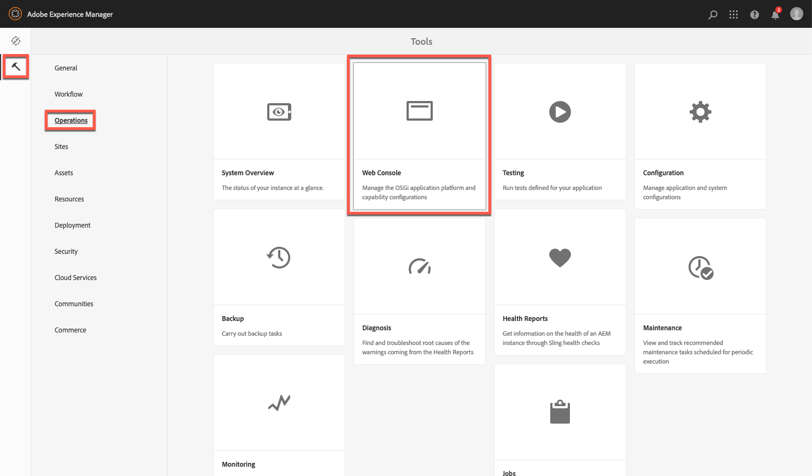

1. 新的瀏覽器標籤會開啟&#x200B;**[!UICONTROL Adobe Experience Manager Web主控台組態]**&#x200B;頁面。

   

1. 在頁面上，捲動至名稱&#x200B;*Adobe CQ Scene7 PlatformServer*。

1. 在名稱的右側，選取鉛筆圖示（**[!UICONTROL 編輯組態值]**）。

1. 在&#x200B;**com.adobe.cq.dam.s7imaging.impl.ps.PlatformServerServlet.name**&#x200B;頁面上，選取下列兩個設定的核取方塊：

   * `com.adobe.cq.dam.s7imaging.impl.ps.PlatformServerServlet.cache.enable.name` — 啟用時，此設定會快取120秒（兩分鐘） （預設）的許可權結果以儲存。
   * `com.adobe.cq.dam.s7imaging.impl.ps.PlatformServerServlet.validate.userAccess.name` — 啟用時，此設定會在使用者透過Dynamic Media影像伺服器預覽資產時，驗證使用者的存取權。

   

1. 在頁面的右下角附近，選取&#x200B;**[!UICONTROL 儲存]**。

### （可選）設定Dynamic Media - Scene7模式以上傳大於2 GB的資產 {#optional-config-dms7-assets-larger-than-2gb}

在Dynamic Media - Scene7模式中，預設的資產上傳檔案大小為2 GB以下。 不過，您可以選擇設定大於2 GB與最大15 GB的資產上傳。

如果您打算使用此功能，請注意下列必要條件和要點：

* 您必須在Dynamic Media - Scene7模式下執行具有Service Pack 6.5.4.0或更新版本的Experience Manager 6.5。
* 僅&#x200B;[*Managed Services*](https://business.adobe.com/products/experience-manager/managed-services.html)客戶支援此大型上傳功能。
* 請確定您的Experience Manager執行個體已設定Amazon S3或Microsoft® Azure Blob儲存空間。

  >[!NOTE]
  >
  >使用存取金鑰和機密金鑰設定Azure Blob儲存體，因為Blob儲存體設定中的AzureSas不支援此大型上傳功能。

* Oak的[直接二進位存取下載](https://jackrabbit.apache.org/oak/docs/features/direct-binary-access.html)已啟用（不需要Oak的&#x200B;*直接二進位存取上傳*）。

  若要啟用直接二進位存取下載，請在資料存放區組態中設定屬性`presignedHttpDownloadURIExpirySeconds > 0`。 值應該要夠長，才能下載較大的二進位檔，並且可能還要重試。

* 不會上傳大於15 GB的Assets。 （大小限制是在下方的步驟8中設定。）
* 在資料夾上觸發&#x200B;**[!UICONTROL Dynamic Media重新處理]**&#x200B;資產工作流程時，它會重新處理任何已與Dynamic Media公司同步的大型資產。 不過，如果資料夾中尚未同步任何大型資產，系統不會上傳資產。 因此，若要同步Dynamic Media中現有的大型資產，您可以對個別資產執行&#x200B;**[!UICONTROL Dynamic Media重新處理]**&#x200B;資產工作流程。

**若要設定Dynamic Media - Scene7模式以上傳大於2 GB的資產：**

1. 在Experience Manager中，選取Experience Manager標誌以存取全域導覽主控台，然後導覽至&#x200B;**[!UICONTROL 工具]** > **[!UICONTROL 一般]** > **[!UICONTROL CRXDE Lite]**。

1. 在CRXDE Lite視窗中，執行下列任一項作業：

   * 在左側邊欄中，導覽至下列路徑：

     `/libs/dam/gui/content/assets/jcr:content/actions/secondary/create/items/fileupload`

   * 將上方路徑複製並貼到工具列下方的CRXDE Lite路徑欄位中，然後按`Enter`。

1. 在左側邊欄中，以滑鼠右鍵按一下`fileupload`，然後從彈出式選單中選取&#x200B;**[!UICONTROL 覆蓋節點]**。

   

1. 在「覆蓋節點」對話方塊中，選取&#x200B;**[!UICONTROL 符合節點型別]**&#x200B;核取方塊以啟用（開啟）選項，然後選取&#x200B;**[!UICONTROL 確定]**。

   

1. 從CRXDE Lite視窗，執行下列任一項作業：

   * 在左側邊欄中，導覽至下列覆蓋節點路徑：

     `/apps/dam/gui/content/assets/jcr:content/actions/secondary/create/items/fileupload`

   * 將上方路徑複製並貼到工具列下方的CRXDE Lite路徑欄位中，然後按`Enter`。

1. 在&#x200B;**[!UICONTROL Properties]**&#x200B;索引標籤的&#x200B;**[!UICONTROL Name]**&#x200B;欄下，找到`sizeLimit`。
1. 在`sizeLimit`名稱的右側，**[!UICONTROL 值]**&#x200B;欄下，按兩下值欄位。
1. 輸入適當的值（位元組），以便將大小限制增加到所需的上載大小上限。 例如，若要將上傳資產大小限制增加到10 GB，請在值欄位中輸入`10737418240`。
您可以輸入最多15 GB （`2013265920`位元組）的值。 在此情況下，不會上傳大於15 GB的已上傳資產。

   

1. 在CRXDE Lite視窗的左上角附近，選取&#x200B;**[!UICONTROL 全部儲存]**。

   *現在執行下列動作，設定Adobe Granite工作流程外部處理作業處理常式的逾時：*

1. 在Experience Manager中，選取Experience Manager標誌以存取全域導覽主控台。
1. 執行下列其中一項：

   * 導覽至下列URL路徑：

     `localhost:4502/system/console/configMgr/com.adobe.granite.workflow.core.job.ExternalProcessJobHandler`

   * 將上方路徑複製並貼到瀏覽器的URL欄位中。 請務必將`localhost:4502`取代為您自己的Experience Manager執行個體。

1. 在&#x200B;**[!UICONTROL Adobe Granite工作流程外部處理作業處理常式]**&#x200B;對話方塊的&#x200B;**[!UICONTROL 最大逾時]**&#x200B;欄位中，將值設定為`18000`秒（5小時）。 預設值為10800秒（3小時）。

   

1. 在對話方塊的右下角，選取&#x200B;**[!UICONTROL 儲存]**。

   *現在執行下列動作，設定Scene7直接二進位上傳程式步驟的逾時：*

1. 在Experience Manager中，選取Experience Manager標誌以存取全域導覽主控台。
1. 導覽至&#x200B;**[!UICONTROL 工具]** > **[!UICONTROL 工作流程]** > **[!UICONTROL 模型]**。
1. 在工作流程模型頁面上，選取&#x200B;**[!UICONTROL Dynamic Media編碼視訊]**。
1. 在工具列上，選取&#x200B;**[!UICONTROL 編輯]**。
1. 在工作流程頁面上，按兩下&#x200B;**[!UICONTROL Scene7直接二進位上傳]**&#x200B;程式步驟。
1. 在「**[!UICONTROL 步驟屬性]**」對話方塊的「**[!UICONTROL 一般]**」標籤下方的「**[!UICONTROL 進階設定]**」標題的「**[!UICONTROL 逾時]**」欄位中，輸入`18000`秒（5小時）的值。 預設值為`3600`秒（一小時）。
1. 選取&#x200B;**[!UICONTROL 確定]**。
1. 選取&#x200B;**[!UICONTROL 同步]**。
1. 對&#x200B;**[!UICONTROL DAM更新資產]**&#x200B;工作流程模型和&#x200B;**[!UICONTROL 動態媒體重新處理]**&#x200B;工作流程模型重複步驟14至21。

### （選用） Dynamic Media - Scene7模式設定的設定與設定 {#optional-setup-and-configuration-of-dynamic-media-scene7-mode-settings}

<!-- When you are in run mode `dynamicmedia_scene7`, use the Dynamic Media Classic user interface to change your Dynamic Media settings. -->

* [設定影像伺服器的Dynamic Media發佈設定](/help/assets/dm-publish-settings.md)
* [設定Dynamic Media一般設定](/help/assets/dm-general-settings.md)
* [設定色彩管理](#configuring-color-management)
* [編輯支援格式的MIME型別](#editing-mime-types-for-supported-formats)
* [針對不支援的格式新增MIME型別](#adding-mime-types-for-unsupported-formats)
* [建立批次集預設集以自動生成影像集和迴轉集](#creating-batch-set-presets-to-auto-generate-image-sets-and-spin-sets) （在Dynamic Media Classic使用者介面中完成）

#### 設定影像伺服器的Dynamic Media發佈設定 {#publishing-setup-for-image-server}

「Dynamic Media發佈設定」頁面會建立預設設定，用來決定如何從Adobe Dynamic Media伺服器將資產傳送至網站或應用程式。

請參閱[設定影像伺服器的Dynamic Media發佈設定](/help/assets/dm-publish-settings.md)。

#### 設定Dynamic Media一般設定 {#configuring-application-general-settings}

設定Dynamic Media **[!UICONTROL 發佈伺服器名稱]** URL和&#x200B;**[!UICONTROL 原始伺服器名稱]** URL。 您也可以指定&#x200B;**[!UICONTROL 上載至應用程式]**&#x200B;設定和&#x200B;**[!UICONTROL 預設上載選項]**，全部根據您的特定使用案例。

請參閱[設定Dynamic Media一般設定](/help/assets/dm-general-settings.md)。

#### 設定色彩管理 {#configuring-color-management}

Dynamic Media色彩管理可讓您校正資產的色彩。 With color correction, ingested assets retain their color space (RGB, CMYK, Gray) and embedded color profile. When you request a dynamic rendition, the image color is corrected into the target color space using CMYK, RGB, or Gray output.

See [Configure Image Presets](/help/assets/managing-image-presets.md).

>[!NOTE]
>
>By default, the system shows 15 renditions when you select **[!UICONTROL Renditions]** and 15 viewer presets when you select **[!UICONTROL Viewers]** in the asset&#39;s Detail view. 您可以提高此限制。 See [Increase the number of image presets that display](/help/assets/managing-image-presets.md#increasing-or-decreasing-the-number-of-image-presets-that-display) or [Increase the number of viewer presets that display](/help/assets/managing-viewer-presets.md#increasing-the-number-of-viewer-presets-that-display).

#### 編輯支援格式的MIME型別 {#editing-mime-types-for-supported-formats}

You can define which asset types are processed by Dynamic Media and customize advanced asset processing parameters. For example, you can specify asset processing parameters to do the following:

* Convert an Adobe PDF to an eCatalog asset.
* Convert an Adobe Photoshop Document (.PSD) to a banner template asset for personalization.
* Rasterize an Adobe Illustrator file (.AI) or an Adobe Photoshop Encapsulated PostScript® file (.EPS).
* [Video profiles](/help/assets/video-profiles.md) and [Imaging profiles](/help/assets/image-profiles.md) can be used to define processing of videos and images, respectively.

See [Uploading Assets](/help/assets/manage-assets.md#uploading-assets).

**To edit MIME types for supported formats:**

1. 在Experience Manager中，選取Experience Manager標誌以存取全域導覽主控台，然後導覽至&#x200B;**[!UICONTROL 工具]** > **[!UICONTROL 一般]** > **[!UICONTROL CRXDE Lite]**。
1. In the left rail, navigate to the following:

   `/conf/global/settings/cloudconfigs/dmscene7/jcr:content/mimeTypes`

   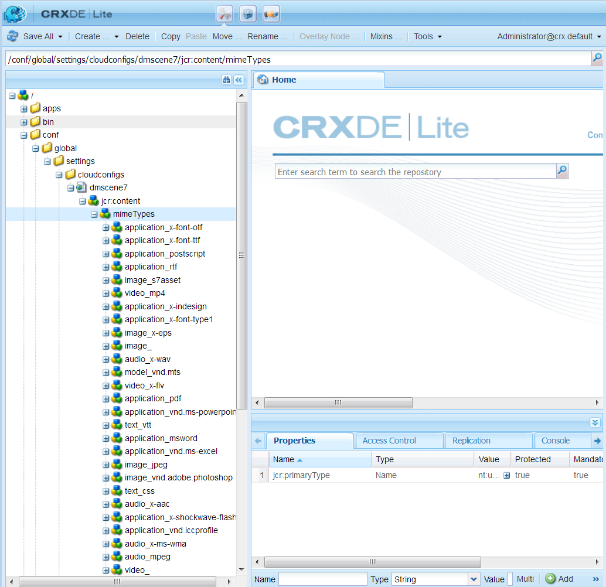

1. Under the mimeTypes folder, select a mime type.
1. On the right side of the CRXDE Lite page, in the lower portion:

   * Double-click the **[!UICONTROL enabled]** field. By default all asset mime types are enabled (set to **[!UICONTROL true]**), which means the assets are synched to Dynamic Media for processing. If you wish to exclude this asset mime type from being processed, change this setting to **[!UICONTROL false]**.

   * Double-select **[!UICONTROL jobParam]** to open its associated text field. See [Supported Mime Types](/help/assets/assets-formats.md#supported-mime-types) for a list of permitted processing parameter values that you can use for a given mime type.

1. 執行下列任一項作業：

   * Repeat steps 3-4 to edit more MIME types.
   * On the menu bar of the CRXDE Lite page, select **[!UICONTROL Save All]**.

1. In the upper-left corner of the page, select **[!UICONTROL CRXDE Lite]** to return to Experience Manager.

#### Adding MIME types for unsupported formats {#adding-mime-types-for-unsupported-formats}

You can add custom MIME types for unsupported formats in Experience Manager Assets. Ensure any new node that you add in CRXDE Lite is not deleted by Experience Manager by moving the MIME type before `image_`. Also, be sure that its enabled value is set to **[!UICONTROL false]**.

**To add MIME types for unsupported formats:**

1. 從Experience Manager瀏覽至&#x200B;**[!UICONTROL 工具]** > **[!UICONTROL 作業]** > **[!UICONTROL 網頁主控台]**。

   

1. 新的瀏覽器標籤會開啟&#x200B;**[!UICONTROL Adobe Experience Manager Web主控台組態]**&#x200B;頁面。

   

1. 在頁面上，向下捲動至名稱 *Adobe CQ Scene7 Asset MIME類型Service* ，如下列螢幕擷取所示。 To the right of the name, select the **[!UICONTROL Edit the configuration values]** (pencil icon).

   

1. On the **Adobe CQ Scene7 Asset MIME type Service** page, select any plus sign icon &lt;+>. The location in the table where you select the plus sign to add the new mime type is trivial.

   

1. Type `DWG=image/vnd.dwg` in the empty text field that you just added.

   The example `DWG=image/vnd.dwg` is for demonstration purposes only. The MIME type that you add here can be any other unsupported format.

   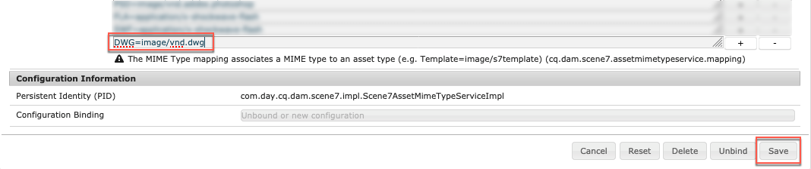

1. In the lower-right corner of the page, select **[!UICONTROL Save]**.

   At this point, you can close the browser tab that has the open Adobe Experience Manager Web Console Configuration page.

1. Return to the browser tab that has your open Experience Manager console.
1. From Experience Manager, navigate to **[!UICONTROL Tools]** > **[!UICONTROL General]** > **[!UICONTROL CRXDE Lite]**.

   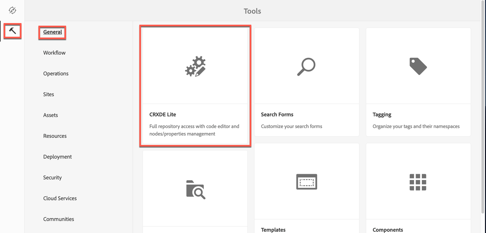

1. In the left rail, navigate to the following:

   `conf/global/settings/cloudconfigs/dmscene7/jcr:content/mimeTypes`

1. Drag the mime type `image_vnd.dwg` and drop it directly above `image_` in the tree as seen in the following screenshot.

   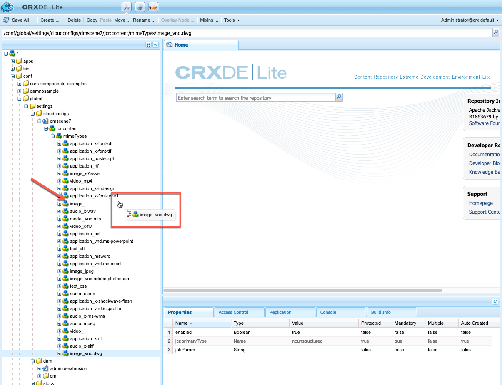

1. With the mime type `image_vnd.dwg` still selected, from the **[!UICONTROL Properties]** tab, in the **[!UICONTROL enabled]** row, under the **[!UICONTROL Value]** column header, double-select the value to open the **[!UICONTROL Value]** drop-down list.
1. Type `false` in the field (or select **[!UICONTROL false]** from the drop-down list).

   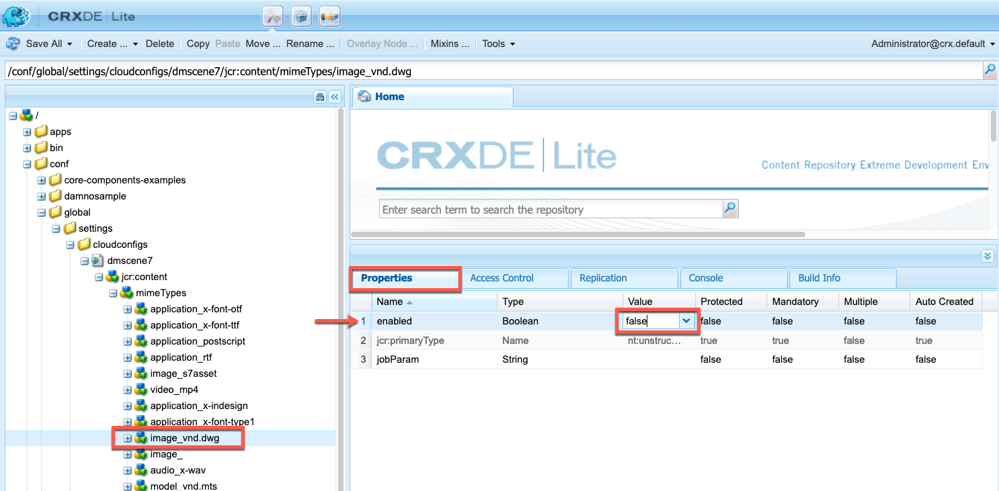

1. Near the upper-left corner of the CRXDE Lite page, select **[!UICONTROL Save All]**.

#### 建立批次集預設集以自動生成影像集和迴轉集 {#creating-batch-set-presets-to-auto-generate-image-sets-and-spin-sets}

資產上傳至Dynamic Media時，使用批次集預設集可自動建立影像集或迴轉集。

首先，定義資產在集中分組的命名慣例。 然後建立批次集預設集，這是一組唯一命名、獨立完成的指示。 它必須定義如何使用符合預設方式中定義的命名約定的影像來建構集合。

上傳檔案時，Dynamic Media會自動建立一個集合，其中包含與作用中預設集中定義的命名慣例相符的所有檔案。

##### 設定預設命名

建立用於任何批次集預設集配方中的預設命名慣例。 在批次集預設集定義中選取的預設命名慣例可能是貴公司批次產生集所需的一切。 會建立批次集預設集，以使用您定義的預設命名慣例。 當公司定義的預設命名出現例外時，您可以針對特定內容集建立所需之替代自訂命名慣例的批次集預設集。

雖然設定預設命名慣例並非使用批次集預設集功能所必需，但最佳實務建議您使用預設命名慣例。 它可讓您定義要分組在集合中命名慣例的元素，以便簡化批次集合的建立。

或者，您可以使用&#x200B;**[!UICONTROL 檢視代碼]**，但沒有可用的表單欄位。 在此檢視中，您會完全使用規則運算式來建立命名慣例定義。

定義、比對和基本名稱有兩個元素可用。 這些欄位可讓您定義命名慣例的所有元素，並識別用來命名包含這些元素的集的慣例部分。 公司的個別命名慣例通常會對每個元素使用一行或多行定義。 您可以針對唯一的定義使用儘可能多的線條，並將它們分組為不同的元素，例如「主影像」、「顏色」元素、「替代檢視」元素和「色票」元素。

**設定預設命名：**

1. 開啟[Dynamic Media Classic案頭應用程式](https://experienceleague.adobe.com/docs/dynamic-media-classic/using/getting-started/signing-out.html#getting-started)，然後登入您的帳戶。

   布建時Adobe已提供您的憑證和登入詳細資訊。 如果您沒有這項資訊，請聯絡Adobe客戶支援。

1. 在靠近頁面頂端的導覽列上，導覽至&#x200B;**[!UICONTROL 設定]** > **[!UICONTROL 應用程式設定]** > **[!UICONTROL 批次集預設集]** > **[!UICONTROL 預設命名]**。
1. 選擇 **[!UICONTROL 「查看表單]** 」或「 **[!UICONTROL 查看代碼」]** ，以指定要查看的方式並輸入有關每個元素的資訊。

   您可以選取&#x200B;**[!UICONTROL 檢視程式碼]**&#x200B;核取方塊，以檢視表單選取專案旁邊的規則運算式值建置。 如果表單檢視會因任何原因限制您，您可以輸入或變更這些值，以協助定義命名慣例的元素。 如果無法在表單檢視中剖析您的值，則表單欄位會變為非使用中。

   >[!NOTE]
   >
   >停用的表單欄位不會驗證您的規則運算式是否正確。 您會看到針對「結果」行之後的每個元素所建置的規則運算式結果。 完整的規則運算式會顯示在頁面底部。

1. 視需要展開每個元素，然後輸入要使用的命名慣例。
1. 視需要執行下列任一項作業：

   * 選取&#x200B;**[!UICONTROL 新增]**&#x200B;為元素新增其他命名慣例。
   * 選取&#x200B;**[!UICONTROL 移除]**&#x200B;以刪除元素的命名慣例。

1. 執行下列任一項作業：

   * 選取「**[!UICONTROL 另存新檔]**」並輸入預設集名稱。
   * 如果您正在編輯現有的預設集，請選取&#x200B;**[!UICONTROL 儲存]**。

##### 建立批次集預設集

Dynamic Media使用批次集預設集將資產組織成影像集（替代影像、顏色選項、360度迴轉），以便在檢視器中顯示。 批次集預設集會在Dynamic Media中隨著資產上傳程式自動執行。

您可以建立、編輯和管理批次集預設集。 批次集預設集定義有兩種形式：一種可供您設定的預設命名慣例使用，另一種可供您即時建立的自訂命名慣例使用。

您可以使用表單欄位方法來定義批次集預設集，或使用程式碼方法來讓您使用規則運算式。 如同在「預設命名」中一樣，您可以在在「表單檢視」中定義的同時選擇「檢視程式碼」，並使用規則運算式來建置定義。 或者，您可以取消勾選任一檢視以僅使用其中一個。

**若要建立批次集預設集：**

1. 開啟[Dynamic Media Classic案頭應用程式](https://experienceleague.adobe.com/docs/dynamic-media-classic/using/getting-started/signing-out.html#getting-started)，然後登入您的帳戶。

   布建時Adobe已提供您的憑證和登入詳細資訊。 如果您沒有這項資訊，請聯絡Adobe客戶支援。

1. 在靠近頁面頂端的導覽列上，導覽至&#x200B;**[!UICONTROL 設定]** > **[!UICONTROL 應用程式設定]** > **[!UICONTROL 批次集預設集]** > **[!UICONTROL 批次集預設集]**。

   **[!UICONTROL 檢視表單]** （在[詳細資料]頁面的右上角設定）是預設檢視。

1. 在「預設集清單」面板中，選取&#x200B;**[!UICONTROL 新增]**&#x200B;以啟動畫面右側「詳細資料」面板中的定義欄位。
1. 在「詳細資訊」面板的「預設集名稱」欄位中，輸入預設集的名稱。
1. 在「批次集型別」下拉式選單中，選取預設集型別。
1. 執行下列任一項作業：

   * 如果您使用先前在&#x200B;**[!UICONTROL 應用程式設定]** > **[!UICONTROL 批次集預設集]** > **[!UICONTROL 預設命名]**&#x200B;下設定的預設命名慣例，請展開&#x200B;**[!UICONTROL 資產命名慣例]**，然後在「檔案命名」下拉式清單中，選取&#x200B;**[!UICONTROL 預設]**。

   * 若要在設定預設集時定義新的命名慣例，請展開&#x200B;**[!UICONTROL 資產命名慣例]**，然後在「檔案命名」下拉式清單中，選取&#x200B;**[!UICONTROL 自訂]**。

1. 針對「順序」，定義影像在Dynamic Media中分組後的顯示順序。

   根據預設，您的資產會依字母數字排序。 不過，您可以使用逗號分隔的規則運算式清單來定義順序。

1. 在「設定命名與建立慣例」中，請為您在「資產命名慣例」中定義的基本名稱指定字尾或字首。 此外，定義在Dynamic Media資料夾結構中建立資料集的位置。

   如果您定義大量集合，請將這些集合與包含資產本身的資料夾分開。 例如，建立「影像集」資料夾，並將產生的影像集放在此處。

1. 在[詳細資料]面板中，選取[**[!UICONTROL 儲存]**]。
1. 選取新預設集名稱旁的&#x200B;**[!UICONTROL 作用中]**。

   啟用預設集可確保當您將資產上傳到Dynamic Media時，會套用批次集預設集以產生該集合。

##### 建立批次集預設集以自動產生2D迴轉集

您可以使用批次集型別&#x200B;**[!UICONTROL 多軸迴轉集]**&#x200B;來建立可自動產生2D迴轉集的配方。 影像分組會使用Row和Column規則運算式，好讓影像資產在多維度陣列中的對應位置中正確對齊。 多軸旋轉集中沒有最小或最大列數或欄數。

例如，假設您要建立名為`spin-2dspin`的多軸迴轉集。 您有一組包含三列的迴轉集影像，每一列12個影像。 影像的命名方式如下：

```xml {.line-numbers}
spin-01-01
 spin-01-02
 …
 spin-01-12
 spin-02-01
 …
 spin-03-12
```

您可以使用此資訊來建立「批次集型態」配方，如下所示：


迴轉集之共用資產名稱部分的群組已新增到&#x200B;**[!UICONTROL 符合]**&#x200B;欄位（反白顯示）。 包含行和列的資產名稱的變數部分將分別添加到 **[!UICONTROL 行]** 和 **[!UICONTROL 列欄位中]** 。

上傳和發佈回轉集時，您會啟用「上傳工作選項」對話方塊中「批次集預設集」下方所列的2D回轉集 **[!UICONTROL 方式名稱]**&#x200B;**&#x200B;** 。

**若要建立批次集預設集以自動產生2D迴轉集：**

1. 開啟[Dynamic Media Classic案頭應用程式](https://experienceleague.adobe.com/docs/dynamic-media-classic/using/getting-started/signing-out.html#getting-started)，然後登入您的帳戶。

   布建時Adobe已提供您的憑證和登入詳細資訊。 如果您沒有這項資訊，請聯絡Adobe客戶支援。

1. 在靠近頁面頂端的導覽列上，導覽至&#x200B;**[!UICONTROL 設定]** > **[!UICONTROL 應用程式設定]** > **[!UICONTROL 批次集預設集]** > **[!UICONTROL 批次集預設集]**。

   **[!UICONTROL 檢視表單]** （在[詳細資料]頁面的右上角設定）是預設檢視。

1. 在「預設集清單」面板中，選取&#x200B;**[!UICONTROL 新增]**&#x200B;以啟動畫面右側「詳細資料」面板中的定義欄位。
1. 在「詳細資訊」面板的「預設集名稱」欄位中，輸入預設集的名稱。
1. 在「批次集類型」下拉式功能表中，選擇「資產 **[!UICONTROL 集」]**。
1. 在「子型別」下拉式清單中，選取&#x200B;**[!UICONTROL 多軸迴轉集]**。
1. 展開&#x200B;**[!UICONTROL 資產命名慣例]**，然後在[檔案命名]下拉式清單中，選取[自訂]&#x200B;**&#x200B;**。
1. 使用「 **[!UICONTROL 比對]** 」(Match **[!UICONTROL )和 (可選) 「基本名稱]** 」(Base Name)屬性，定義組成群組之影像資產的命名規則運算式。

   例如，您的常值Match規則運算式可能如下所示：

   `(w+)-w+-w+`

1. 展開&#x200B;**[!UICONTROL 列欄位置]**，然後定義2D迴轉集陣列中影像資產位置的名稱格式。

   使用括弧括住檔案名稱中的列或欄位置。

   例如，針對列規則運算式，如下所示：

   `\w+-R([0-9]+)-\w+`

   或

   `\w+-(\d+)-\w+`

   對於欄規則運算式，可能如下所示：

   `\w+-\w+-C([0-9]+)`

   或

   `\w+-\w+-C(\d+)`

   上述範例僅供示範之用。 您可以視需要建立規則運算式。

   >[!NOTE]
   >
   >如果列和欄規則運算式的組合無法判斷資產在多維度迴轉集陣列中的位置，則資產不會新增到迴轉集內。 也會記錄錯誤。

1. 在「設定命名與建立慣例」中，請為您在「資產命名慣例」中定義的基本名稱指定字尾或字首。

   此外，定義在Dynamic Media Classic資料夾結構中建立迴轉集的位置。

   如果您定義大量集合，請將這些集合與包含資產本身的資料夾分開。 例如，建立「迴轉集」資料夾，將產生的迴轉集放在此處。

1. 在[詳細資料]面板中，選取[**[!UICONTROL 儲存]**]。
1. 選取新預設集名稱旁的&#x200B;**[!UICONTROL 作用中]**。

   啟用預設集可確保當您將資產上傳到Dynamic Media時，會套用批次集預設集以產生該集合。

### （可選）調整Dynamic Media - Scene7模式的效能 {#optional-tuning-the-performance-of-dynamic-media-scene-mode}

為了讓Dynamic Media - Scene7模式能夠順暢運作，Adobe建議使用下列同步效能/可擴充性微調提示：

* 更新用於處理不同檔案格式的預定義「工作」引數。
* 更新預先定義的Granite工作流程（視訊資產）佇列背景工作執行緒。
* 更新預先定義的Granite暫時性工作流程（影像和非視訊資產）佇列工作者執行緒。
* 正在更新與Dynamic Media Classic伺服器的最大上傳連線。

#### 更新預先定義的作業引數以處理不同的檔案格式

您可以調整工作引數，以便在上傳檔案時更快地處理。 例如，如果您上傳PSD檔案，但不想以範本處理這些檔案，您可以將圖層擷取設為false （關閉）。 在這種情況下，調整的工作引數會顯示如下： `process=None&createTemplate=false`。

如果您確實要開啟範本建立，請使用下列引數： `process=MaintainLayers&layerNaming=AppendName&createTemplate=true`。

<!-- THIS PARAGRAPH WAS REPLACED WITH THE TWO PARAGRAPHS DIRECTLY ABOVE BASED ON CQDOC-17657 You can tune job parameters for faster processing when you upload files. For example, if you are uploading PSD files, but do not want to process them as templates, you can set layer extraction to false (off). In such case, the tuned job parameter would appear as `process=None&createTemplate=false`. -->

Adobe建議對PDF、PostScript®和PSD檔案使用下列「調整」工作引數：

<!-- OLD PDF JOB PARAMETERS `pdfprocess=Rasterize&resolution=150&colorspace=Auto&pdfbrochure=false&keywords=false&links=false` -->

<!-- OLD POSTSCRIPT JOB PARAMETERS `psprocess=Rasterize&psresolution=150&pscolorspace=Auto&psalpha=false&psextractsearchwords=false&aiprocess=Rasterize&airesolution=150&aicolorspace=Auto&aialpha=false` -->

| 檔案類型 | 建議的工作引數 |
| ---| ---|
| PDF | `pdfprocess=Thumbnail&resolution=150&colorspace=Auto&pdfbrochure=false&keywords=false&links=false` |
| PostScript® | `psprocess=Rasterize&psresolution=150&pscolorspace=Auto&psalpha=false&psextractsearchwords=false&aiprocess=Thumbnail&airesolution=150&aicolorspace=Auto&aialpha=false` |
| PSD | `process=None&layerNaming=AppendName&anchor=Center&createTemplate=false&extractText=false&extendLayers=false` |

<!-- CQDOC-17657 for PSD entry in table above -->

若要更新任何這些引數，請依照[啟用MIME型別Assets/Dynamic Media Classic上傳工作引數支援](/help/sites-administering/scene7.md#enabling-mime-type-based-assets-scene-upload-job-parameter-support)中的步驟操作。

#### 更新Granite暫時性工作流程佇列 {#updating-the-granite-transient-workflow-queue}

Granite傳輸工作流程佇列已用於&#x200B;**[!UICONTROL DAM更新資產]**&#x200B;工作流程。 在Dynamic Media中，它用於影像擷取和處理。

**若要更新Granite暫時性工作流程佇列：**

1. 瀏覽至[https://localhost:4502/system/console/configMgr](https://localhost:4502/system/console/configMgr)並搜尋&#x200B;**佇列： Granite暫時性工作流程佇列**。

   >[!NOTE]
   >
   >必須進行文字搜尋，而非直接URL，因為OSGi PID是動態產生的。

1. 在&#x200B;**[!UICONTROL 最大平行工作]**&#x200B;欄位中，將數字變更為所要的值。

   您可以增加&#x200B;**[!UICONTROL 個最大平行工作]**，以充分支援將大量檔案上傳至Dynamic Media。 確切的值取決於硬體容量。 在某些情況下（即初始移轉或一次性大量上傳），您可以使用較大的值。 但是請注意，使用很大的數值（例如核心數的兩倍）可能會對其他並行活動產生負面影響。 因此，請根據您的特定使用案例來測試和調整值。

<!--
By default, the maximum number of parallel jobs depends on the number of available CPU cores. For example, on a 4-core server, it assigns 2 worker threads. (A value between 0.0&ndash;1.0 is ratio based, or any numbers greater than 1 will assign the number of worker threads.)

   Adobe recommends that 32 **[!UICONTROL Maximum Parallel Jobs]** be configured to adequately support heavy upload of files to Dynamic Media Classic (Scene7).
   -->

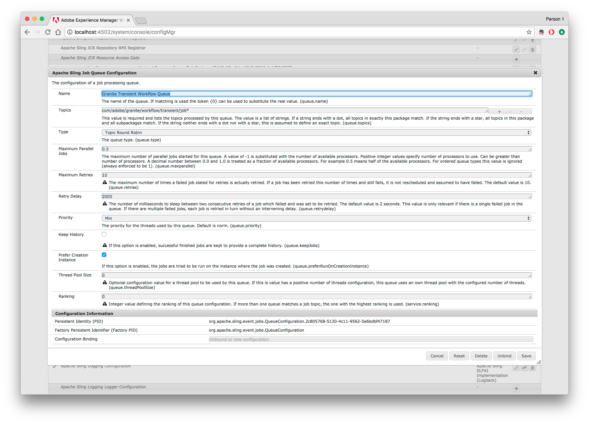

1. 選取「**[!UICONTROL 儲存]**」。

#### 更新Granite工作流程佇列 {#updating-the-granite-workflow-queue}

Granite工作流程佇列用於非暫時性工作流程。 在Dynamic Media中，它以前是使用&#x200B;**[!UICONTROL Dynamic Media編碼視訊]**&#x200B;工作流程來處理視訊。

**更新Granite工作流程佇列：**

1. 瀏覽至`https://<server>/system/console/configMgr`並搜尋&#x200B;**佇列： Granite工作流程佇列**。

   >[!NOTE]
   >
   >必須進行文字搜尋，而非直接URL，因為OSGi PID是動態產生的。

1. 在&#x200B;**[!UICONTROL 最大平行工作]**&#x200B;欄位中，將數字變更為所要的值。

   您可以增加最大平行工作數量，以充分支援將大量檔案上傳至Dynamic Media。 確切的值取決於硬體容量。 在某些情況下（即初始移轉或一次性大量上傳），您可以使用較大的值。 但是請注意，使用很大的數值（例如核心數的兩倍）可能會對其他並行活動產生負面影響。 因此，請根據您的特定使用案例來測試和調整值。

   

1. 選取「**[!UICONTROL 儲存]**」。

#### 更新Dynamic Media Classic上傳連線 {#updating-the-scene-upload-connection}

Scene7上傳連線設定會將Experience Manager資產同步至Dynamic Media Classic伺服器。

**若要更新Dynamic Media Classic上傳連線：**

1. 導覽至 `https://<server>/system/console/configMgr/com.day.cq.dam.scene7.impl.Scene7UploadServiceImpl`
1. 在&#x200B;**[!UICONTROL 連線數目]**&#x200B;欄位和/或&#x200B;**[!UICONTROL 作用中工作逾時]**&#x200B;欄位中，視需要變更數目。

   **[!UICONTROL 連線數目]**&#x200B;設定會控制Experience Manager允許上傳至Dynamic Media的HTTP連線數目上限；通常預先定義的10個連線值就足夠了。

   **[!UICONTROL 作用中工作逾時]**&#x200B;設定會決定已上傳之Dynamic Media資產在傳遞伺服器上發佈的等待時間。 此值預設為2100秒（35分鐘）。

   對於大多數使用案例，設定2100已足夠。

   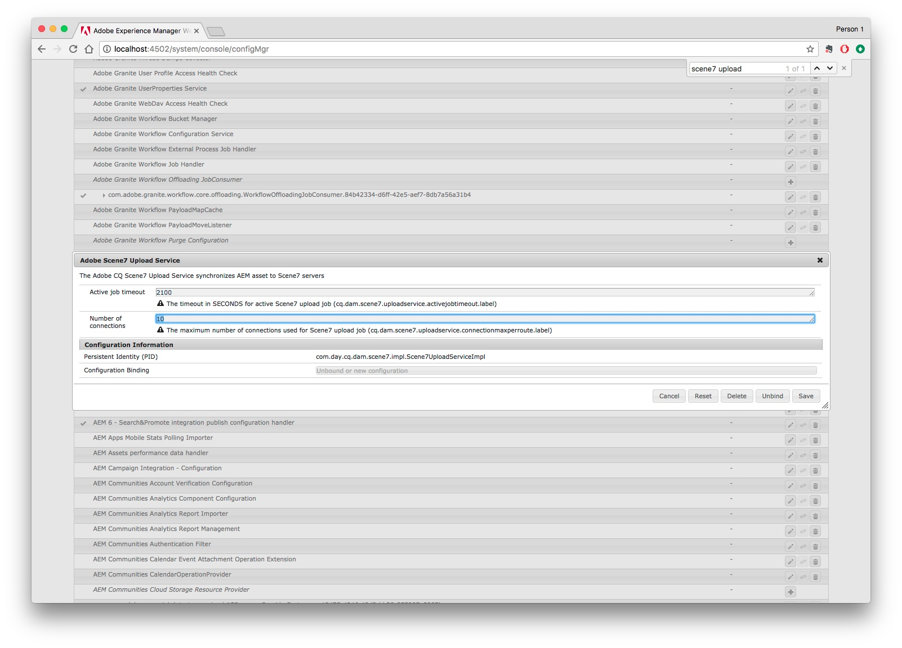

1. 選取「**[!UICONTROL 儲存]**」。

### （可選）篩選要複製的資產 {#optional-filtering-assets-for-replication}

在非Dynamic Media部署中，您會將Experience Manager作者環境中的&#x200B;*所有*&#x200B;資產（包括影像和視訊）復寫至Experience Manager發佈節點。 This workflow is necessary because the Experience Manager Publish servers also deliver the assets.

However, in Dynamic Media deployments, because assets are delivered by way of the Cloud Service, there is no need to replicate those same assets to Experience Manager publish nodes. Such a &quot;hybrid publishing&quot; workflow avoids extra storage costs and longer processing times to replicate assets. Other content, such as Site pages, continue to be served from the Experience Manager publish nodes.

The filters provide a way for you to *exclude* assets from being replicated to the Experience Manager publish node.

#### Use default asset filters for replication {#using-default-asset-filters-for-replication}

If you use Dynamic Media for imaging, or video, or both, you can use the default filters that Adobe provides as-is. The following filters are active by default:

|   | 篩選器 | Mime 類型 | 轉譯 |
| --- | --- | --- | --- |
| Dynamic Media Image Delivery | filter-image<br>filter-sets | Starts with **image/**<br> Contains **applications/** and end with **set**. | The out-of-the-box &quot;filter-images&quot; (applies to single images assets, including interactive images) and &quot;filter-sets&quot; (applies to Spin Sets, Image Sets, Mixed Media Sets, and Carousel Sets) will:<br>• Exclude from replication the original image and static image renditions. |
| Dynamic Media Video Delivery | filter-video | Starts with **video/** | The out-of-the-box &quot;filter video&quot; will:<br>• Exclude from replication the original video and static thumbnail renditions. |

>[!NOTE]
>
>Filters apply to MIME types and cannot be path-specific.

#### Customize asset filters for replication {#customizing-asset-filters-for-replication}

1. In Experience Manager, select the Experience Manager logo to access the global navigation console and navigate to **[!UICONTROL Tools]** > **[!UICONTROL General]** > **[!UICONTROL CRXDE Lite]**.
1. In the left folder tree, navigate to `/etc/replication/agents.author/publish/jcr:content/damRenditionFilters` to review the filters.

   

1. To define the Mime Type for the filter, you can locate the Mime Type as follows:

   In the left rail, expand `content > dam > <locate_your_asset> > jcr:content > metadata`, and then in the table, locate `dc:format`.

   The following graphic is an example of an asset&#39;s path to `dc:format`.

   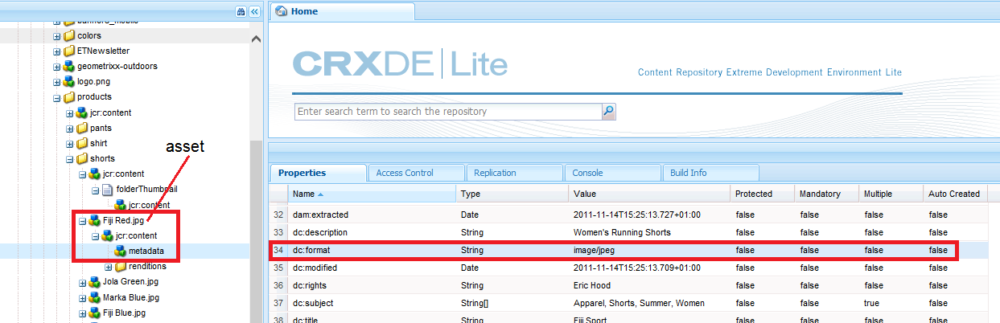

   Notice that the `dc:format` for the asset `Fiji Red.jpg` is `image/jpeg`.

   To have this filter apply to all images, regardless of their format, set the value to `image/*` where `*` is a regular expression that is applied to all images of any format.

   To have the filter apply only to images of the type JPEG, enter a value of `image/jpeg`.

1. Define what renditions you want to include or exclude from replication.

   Characters that you can use to filter for replication include the following:

   | Character to use | How it filters assets for replication |
   | --- | --- |
   | * | 萬用字元 |
   | + | Includes assets for replication |
   | - | Excludes assets from replication |

   導覽至 `content/dam/<locate your asset>/jcr:content/renditions`。

   The following graphic is an example of an asset&#39;s renditions.

   

   If you only wanted to replicate the original, then you would enter `+original`.
