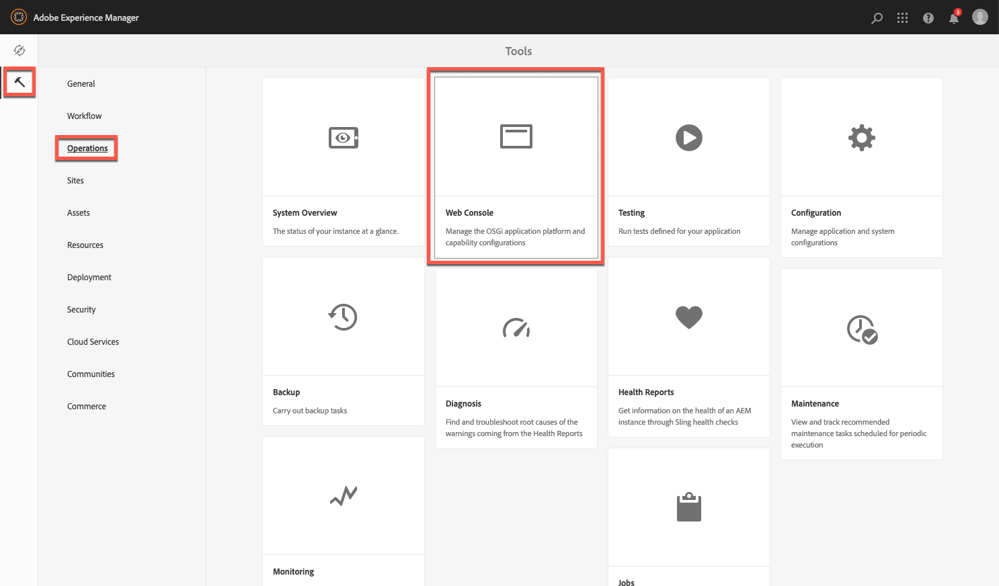

# 設定 Dynamic Media - Scene7 模式{#configuring-dynamic-media-scene-mode}

如果您使用針對不同環境（如開發、接移和生產）設定的Adobe Experience Manager，請為每個環境配置Dynamic MediaCloud Services。

## Dynamic Media-Scene7模式的體系結構圖{#architecture-diagram-of-dynamic-media-scene-mode}

以下架構圖說明Dynamic Media-Scene7模式的運作方式。

使用新架構時，Experience Manager負責主要來源資產，並與Dynamic Media同步處理及發佈資產：

1. 當主要來源資產上傳到Experience Manager時，它將複製到Dynamic Media。 此時，Dynamic Media會處理所有資產處理和轉譯產生，例如視訊編碼和影像的動態變體。<!-- (In Dynamic Media - Scene7 mode, be aware that you can only upload assets whose file sizes are 2 GB or less.) Jira ticket CQ-4286561 fixed this issue. DM-S7 NOW SUPPORTS THE UPLOAD OF ASSETS LARGER THAN 2 GB. -->
1. 產生轉譯後，Experience Manager可以安全地存取和預覽遠端Dynamic Media轉譯(不會將二進位檔傳回Experience Manager例項)。
1. 內容準備好發佈及核准後，會觸發Dynamic Media服務將內容推出至傳送伺服器，並在CDN（內容傳送網路）快取內容。


>[!NOTE]
>
>下列功能清單要求您使用隨附於Adobe Experience Manager-Dynamic Media的現成可用CDN。 這些功能不支援任何其他自訂CDN。
>
>* [智慧型影像](/help/assets/imaging-faq.md)
>* [快取失效](/help/assets/invalidate-cdn-cache-dynamic-media.md)
>* [熱連結保護](/help/assets/hotlink-protection.md)
>* [HTTP/2 內容傳送](/help/assets/http2.md)
>* CDN層級的URL重新導向
>* Akamai ChinaCDN（在中國以最佳方式傳送）


## 在Scene7模式下啟用Dynamic Media{#enabling-dynamic-media-in-scene-mode}

[動態](https://www.adobe.com/solutions/web-experience-management/dynamic-media.html) 媒體預設為停用。若要運用Dynamic Media功能，您必須啟用它。

>[!NOTE]
>
>Dynamic Media-Scene7模式僅用於Experience Manager作者實例。 因此，您必須在「Experience Manager作者」實例上配置`runmode=dynamicmedia_scene7`*not*「Experience Manager發佈」實例。

要啟用Dynamic Media，必須在終端窗口中輸入以下命令，從命令行使用`dynamicmedia_scene7`運行模式啟動Experience Manager（使用的埠為4502）:

```shell
java -Xms4096m -Xmx4096m -Doak.queryLimitInMemory=500000 -Doak.queryLimitReads=500000 -jar cq-quickstart-6.5.0.jar -gui -r author,dynamicmedia_scene7 -p 4502
```

## （可選）將Dynamic Media預設集和配置從6.3遷移到6.5零停機時間{#optional-migrating-dynamic-media-presets-and-configurations-from-to-zero-downtime}

將Dynamic MediaExperience Manager從6.3升級到6.4或6.5現在包括了零停機部署的能力。 要將所有預設集和配置從`/etc`遷移到CRXDE Lite中的`/conf`，請確保運行以下捲曲命令。

>[!NOTE]
>
>如果您在相容模式下運行Experience Manager實例——即，已安裝相容包——則無需運行這些命令。

對於所有升級，不論是否使用相容性套件，您都可以執行下列Linux® curl命令，複製Dynamic Media原始隨附的預設立即可用檢視器預設集：

`curl -u admin:admin -X POST https://<server_address>:<server_port>/libs/settings/dam/dm/presets/viewer.pushviewerpresets.json`

若要將您從`/etc`建立的任何自訂檢視器預設集和組態移轉至`/conf`，請執行下列Linux® curl命令：

`curl -u admin:admin -X POST https://<server_address>:<server_port>/libs/settings/dam/dm/presets.migratedmcontent.json`

## 安裝功能套件18912以進行大量資產移轉{#installing-feature-pack-for-bulk-asset-migration}

功能包18912的安裝是&#x200B;*可選*。

功能套件18912可讓您透過FTP大量內嵌資產，或從Dynamic Media-混合模式或Dynamic Media經典移轉資產至Dynamic Media-Scene7-Experience Manager模式。 可從[Adobe Professional Services](https://www.adobe.com/experience-cloud/consulting-services.html)取得。

如需詳細資訊，請參閱[安裝功能套件18912以進行大量資產移轉](/help/assets/bulk-ingest-migrate.md)。

## 在Cloud Services{#configuring-dynamic-media-cloud-services}中建立Dynamic Media配置

**配置Dynamic Media** -在您收到具有Dynamic Media認證的布建電子郵件後，必須開啟 [Dynamic MediaClassic案頭應用程式](https://experienceleague.adobe.com/docs/dynamic-media-classic/using/getting-started/signing-out.html#getting-started)，然後登入您的帳戶以更改密碼。提供電子郵件中提供的密碼是系統生成的，並僅用於臨時密碼。 請務必更新密碼，以便使用正確的認證來設定Dynamic MediaCloud Service。


**在Cloud Services中建立Dynamic Media配置**

1. 在Experience Manager中，點選Experience Manager標誌以存取全域導覽主控台，點選工具圖示，然後點選&#x200B;**[!UICONTROL Cloud Services>Dynamic Media組態]**。
1. 在「動態媒體設定瀏覽器」頁面的左側窗格中，點選 **[!UICONTROL global]** (不點選或選取全域左側的資料夾圖示 ****)，然後點選「 **[!UICONTROL 建立]**」。
1. 在&#x200B;**[!UICONTROL 建立Dynamic Media組態]**&#x200B;頁面上，輸入標題、Dynamic Media帳戶電子郵件地址、密碼，然後選取您的地區。 此資訊是透過布建電子郵件中的Adobe提供給您。 如果您未收到電子郵件，請聯絡Adobe客戶服務。

   點選&#x200B;**[!UICONTROL 連線至Dynamic Media]**。

   >[!NOTE]
   在您收到具有Dynamic Media認證的布建電子郵件後，請開啟[Dynamic Media Classic案頭應用程式](https://experienceleague.adobe.com/docs/dynamic-media-classic/using/getting-started/signing-out.html#getting-started)，然後登入您的帳戶以變更密碼。 提供電子郵件中提供的密碼是系統生成的，並僅用於臨時密碼。 請務必更新密碼，以便使用正確的憑據設定Dynamic MediaCloud Service。

1. 連接成功時，請設定以下內容。 需要星號(*)的標題：

   * **[!UICONTROL 公司]** -Dynamic Media帳戶的名稱。你有多個Dynamic Media賬戶。 例如，您可以有不同的子品牌、部門、階移或生產環境。

   * **[!UICONTROL 公司根資料夾路徑]**

   * **[!UICONTROL 發佈資產]** -您可以從下列三個選項中選擇：
      * **[!UICONTROL 立]** 即表示上傳資產時，系統會立即收錄資產並提供URL/內嵌。發佈資產不需要使用者干預。
      * **[!UICONTROL 「啟]** 動時」意指您必須先明確發佈資產，才能提供URL/內嵌連結。<br><!-- CQDOC-17478, Added March 9, 2021-->從Experience Manager6.5.8開始，Experience Manager發佈例項會反映精確的Dynamic Media中繼資料值， `dam:scene7Domain` 例 `dam:scene7FileStatus` 如 **[!UICONTROL 僅在Activationpublish]** 模式中。若要啟用此功能，請安裝Service Pack 8，然後重新啟動Experience Manager。 前往Sling Config Manager。 尋找`Scene7ActivationJobConsumer Component`的設定或建立新的設定)。 選取核取方塊&#x200B;**[!UICONTROL 在Dynamic Media發佈後複製中繼資料，然後點選**[!UICONTROL &#x200B;儲存&#x200B;]**。]**

         

      * **[!UICONTROL 選擇]** 發佈此選項可讓您控制在Dynamic Media發佈的資料夾。它可讓您使用智慧型裁切或動態轉譯等功能，或決定哪些資料夾會專門在Experience Manager中發佈以進行預覽。 這些相同資產是&#x200B;*not*，發佈於Dynamic Media，以便在公共網域中傳送。<br>您可以在「 **[!UICONTROL Dynamic Media雲端]** 設定」中設定此選項，或是選擇在資料夾的「屬性」中，在資料夾層級設定此選 **[!UICONTROL 項]**。<br>請參閱[在 Dynamic Media 中使用選擇性發佈。](/help/assets/selective-publishing.md)<br>如果您稍後變更此設定，或稍後在資料夾層級變更，這些變更只會影響您從該點開始上傳的新資產。資料夾中現有資產的發佈狀態會維持原狀，直到您從「快速發佈」(**[!UICONTROL Quick Publish)或「管理出版物」(Manage Publication)對話方塊手動變更資產。]******
   * **[!UICONTROL 安全預覽伺服器]** -可讓您指定安全轉譯預覽伺服器的URL路徑。也就是說，在產生轉譯後，Experience Manager可以安全地存取和預覽遠端的Dynamic Media轉譯(不會將二進位檔傳回至Experience Manager例項)。
除非您有特殊安排來使用您公司的伺服器或特殊伺服器，否則Adobe建議您依指定的方式保留此設定。

   * **[!UICONTROL 同步所有內容]** -預 <!-- NEW OPTION, CQDOC-15371, Added March 4, 2020-->設為「選取」。如果您想要選擇性地包含或排除同步至Dynamic Media的資產，請取消選取此選項。 取消選取此選項可讓您從下列兩種Dynamic Media同步模式中選擇：

   * **[!UICONTROL Dynamic Media 同步處理模式]**
      * **[!UICONTROL 預設啟用]** -預設情況下，配置將應用於所有資料夾，除非您專門為排除標籤資料夾。  <!-- you can then deselect the folders that you do not want the configuration applied to.-->
      * **[!UICONTROL 預設禁用]** -在您明確標籤要同步到Dynamic Media的選定資料夾之前，配置不會應用於任何資料夾。要將選定資料夾標籤為同步到Dynamic Media，請選擇資產資料夾，然後在工具欄上，按一下&#x200B;**[!UICONTROL 屬性]**。 在&#x200B;**[!UICONTROL Details]**&#x200B;標籤的&#x200B;**[!UICONTROL Dynamic Media同步模式]**&#x200B;下拉式清單中，從下列三個選項中選擇。 完成後，點選&#x200B;**[!UICONTROL Save]**。 *記住：如果您選取「同步所有內容工具」，這三個&#x200B;**選項將**無法使用。* 另請參 [閱Dynamic Media資料夾層級的「使用選擇性發佈」。](/help/assets/selective-publishing.md)
         * **[!UICONTROL 繼承]** -資料夾上沒有明確的同步值；資料夾會從其祖先資料夾或雲端設定的預設模式繼承同步值。繼承的詳細狀態會透過工具提示顯示。
         * **[!UICONTROL 為子資料夾啟用]** -包括此子樹中的所有內容，以便同步到Dynamic Media。資料夾特定的設定會覆寫雲端設定中的預設模式。
         * **[!UICONTROL 子檔案夾停用]** -排除此子樹中的所有項目，以免同步至Dynamic Media。

   >[!NOTE]
   DMS7中不支援版本修訂。 此外，延遲啟動僅適用於在「編輯動態媒體設定」頁面中的「發佈資產 ********」設定為「啟動時」，然後只適用於在首次啟動資產時。
   啟動資產後，任何更新都會立即即時發佈至S7傳送。

1. 點選&#x200B;**[!UICONTROL Save]**。
1. 若要在發佈Dynamic Media內容之前安全地預覽，您必須「允許列出」Experience Manager作者實例，才能連線至Dynamic Media:

   * 開啟[Dynamic Media經典案頭應用程式](https://experienceleague.adobe.com/docs/dynamic-media-classic/using/getting-started/signing-out.html#getting-started)，然後登入您的帳戶。 您的認證和登入詳細資訊是在布建時由Adobe提供。 如果您沒有此資訊，請聯絡技術支援。

   * 在頁面右上角的導覽列上，點選「**[!UICONTROL 設定>應用程式設定>發佈設定>影像伺服器」]**。

   * 在「影像伺服器發佈」頁面的「發佈內容」下拉式清單中，選取「測試影像伺服」**[!UICONTROL 。]**
   * 對於「Client Address Filter」（客戶端地址過濾器），請按一下「Add **[!UICONTROL （添加]**）」。
   * 要啟用（開啟）地址，請選中該複選框。 輸入Experience Manager作者實例的IP地址（不是Dispatcher IP）。
   * 點選&#x200B;**[!UICONTROL Save]**。

您現在已完成基本配置；您已準備好使用Dynamic Media-Scene7模式。

如果要進一步自定義配置，您可以選擇在[（可選）「在Dynamic Media-Scene7模式中配置高級設定」下完成任何任務。](#optional-configuring-advanced-settings-in-dynamic-media-scene-mode)

## （可選）在Dynamic Media-Scene7模式下配置高級設定{#optional-configuring-advanced-settings-in-dynamic-media-scene-mode}

如果要進一步自定義Dynamic Media-Scene7模式的配置和設定，或優化其效能，可以完成以下一個或多個&#x200B;*可選*&#x200B;任務：

* [（可選）Dynamic Media-Scene7模式設定和配置](#optional-setup-and-configuration-of-dynamic-media-scene7-mode-settings)

* [（可選）調整Dynamic Media-Scene7模式的效能](#optional-tuning-the-performance-of-dynamic-media-scene-mode)

* [（可選）篩選複製資產](#optional-filtering-assets-for-replication)

### （可選）Dynamic Media-Scene7模式設定的設定和配置{#optional-setup-and-configuration-of-dynamic-media-scene7-mode-settings}

當您處於運行模式`dynamicmedia_scene7`時，請使用Dynamic Media經典用戶介面更改您的Dynamic Media設定。

上述部分任務要求您開啟[Dynamic MediaClassic案頭應用程式](https://experienceleague.adobe.com/docs/dynamic-media-classic/using/getting-started/signing-out.html#getting-started)，然後登錄您的帳戶。

設定和設定工作包括：

* [影像伺服器的發佈設定](#publishing-setup-for-image-server)
* [配置應用程式常規設定](#configuring-application-general-settings)
* [設定色彩管理](#configuring-color-management)
* [編輯支援格式的MIME類型](#editing-mime-types-for-supported-formats)
* [為不支援的格式添加MIME類型](#adding-mime-types-for-unsupported-formats)
* [建立批次集預設集以自動產生影像集和回轉集](#creating-batch-set-presets-to-auto-generate-image-sets-and-spin-sets)

#### 影像伺服器{#publishing-setup-for-image-server}的發佈設定

「發佈設定」設定會決定預設從Dynamic Media傳送資產的方式。 如果未指定任何設定，Dynamic Media會根據「發佈設定」中定義的預設設定傳送資產。 例如，傳送不含解析度屬性的影像請求，會產生具有預設物件解析度設定的影像。

若要設定發佈設定：在Dynamic MediaClassic中，點選「**[!UICONTROL 設定>應用程式設定>發佈設定>影像伺服器」]**。

「影像伺服器」畫面會建立傳送影像的預設設定。 請參閱UI畫面，以取得每個設定的說明。

* **[!UICONTROL 請求屬性]** -這些設定會限制從伺服器傳送的影像。
* **[!UICONTROL 預設請求屬性]** -這些設定屬於影像的預設外觀。
* **[!UICONTROL 常用縮圖屬性]** -這些設定屬於縮圖影像的預設外觀。
* **[!UICONTROL 目錄欄位的預設值]**-這些設定與影像的解析度和預設縮略圖類型相關。
* **[!UICONTROL 色彩管理屬性]** -這些設定會決定使用哪些ICC色彩描述檔。
* **[!UICONTROL 相容性屬性]** -此設定可讓文字圖層中的前導和尾隨段落視為3.6版中的段落，以提供回溯相容性。
* **[!UICONTROL 本地化支援]** -這些設定可讓您管理多個地區設定屬性。它也可讓您指定地區對應字串，以便定義您要在檢視器中支援哪些語言。 有關設定&#x200B;**[本地化支援]**&#x200B;的詳細資訊，請參閱[設定資產本地化時的注意事項](https://help.adobe.com/en_US/scene7/using/WS997f1dc4cb0179f034e07dc31412799d19a-8000.html)。

#### 配置應用程式常規設定{#configuring-application-general-settings}

要開啟「應用程式常規設定」頁，請在「Dynamic Media經典全局導航」欄中，按一下「設定」>「應用程式設定」>「常規設定」]**。**[!UICONTROL 

**[!UICONTROL Servers]**  —— 在帳戶布建時，Dynamic Media會自動為您的公司提供指派的伺服器。這些伺服器可用來建構網站和應用程式的URL字串。 這些URL呼叫是您帳戶專屬的。 除非Adobe客戶服務明確指示，否則請勿變更任何伺服器名稱。

**[!UICONTROL 覆寫影像]** -Dynamic Media不允許兩個檔案具有相同名稱。每個項目的URL ID（檔案名稱減去副檔名）必須是唯一的。 這些選項指定如何上傳取代資產：不論是替換原稿還是變成重複。 重複資產會以&quot;-1&quot;（例如chair.tif會更名為chair-1.tif）重新命名。 這些選項會影響上傳至原始檔案夾以外的資產，或是副檔名與原始檔案不同的資產（例如JPG、TIF或PNG）。

* **[!UICONTROL 在目前資料夾中覆寫相同的基本影像名稱／副檔名]** -此選項是最嚴格的取代規則。它要求您將取代影像上傳至與原始影像相同的檔案夾，而取代影像的副檔名與原始影像的副檔名相同。 如果未滿足這些要求，則會建立重複項。

>[!NOTE]
要與Experience Manager保持一致，請始終選擇以下設定：**覆寫目前資料夾中的基本影像名稱／副檔名**

* **[!UICONTROL 在任何資料夾中覆寫相同的基本資產名稱／副檔名]** -要求取代影像的副檔名與原始影像相同（例如，chair.jpg必須取代chair.jpg，而非chair.tif）。不過，您可以將取代影像上傳至原始檔案夾以外的其他檔案夾。 更新後的影像位於新資料夾中；在其原始位置中無法再找到檔案
* **[!UICONTROL 在任何資料夾中覆寫相同的基本資產名稱(不論副檔名為何]** )-此選項是最包含的取代規則。您可以將取代影像上傳至原始檔案夾以外的其他檔案夾、以不同副檔名上傳檔案，並取代原始檔案。 如果原始檔案位於不同的檔案夾中，則取代影像會位於上傳檔案的新檔案夾中。

**[!UICONTROL 預設色彩描述檔]** -如需詳細 [資訊，](#configuring-color-management) 請參閱設定色彩管理。

>[!NOTE]
依預設，當您選取「轉譯」時，系統會顯示15個轉譯，當您在資產的詳細資料檢視中選取「檢視器 ******** 」時，系統會顯示15個檢視器預設集。您可以提高此限制。請參閱[增加顯示](/help/assets/managing-image-presets.md#increasing-or-decreasing-the-number-of-image-presets-that-display)或[的影像預設集數目增加顯示](/help/assets/managing-viewer-presets.md#increasing-the-number-of-viewer-presets-that-display)的檢視器預設集數目。


#### 配置色彩管理{#configuring-color-management}

動態媒體色彩管理可讓您為正確的資產加上色彩。 透過色彩校正，收錄的資產會保留其色域（RGB、CMYK、灰色）和內嵌的色彩描述檔。 當您請求動態轉譯時，會使用CMYK、RGB或「灰色」輸出，將影像色彩校正為目標色域。 請參閱[設定影像預設集](/help/assets/managing-image-presets.md)。

若要設定預設色彩屬性，以便在要求影像時啟用色彩校正：

1. 開啟[Dynamic Media經典案頭應用程式](https://experienceleague.adobe.com/docs/dynamic-media-classic/using/getting-started/signing-out.html#getting-started)，然後使用布建期間提供的認證登入您的帳戶。
1. 導覽至「**[!UICONTROL 設定>應用程式設定]**」。
1. 展開「發 **[!UICONTROL 布設定]** 」區域並選 **[!UICONTROL 取「影像伺服器」]**。設定發 **[!UICONTROL 布例項的預設值]** ，將「發佈內容」設 **** 定為「影像伺服」。
1. 捲動至您要變更的屬性。 例如，**[!UICONTROL 色彩管理屬性]**&#x200B;區域中的屬性。

   您可以設定下列色彩校正屬性：

   * **[!UICONTROL CMYK預設色域]** -預設CMYK色彩描述檔的名稱
   * **[!UICONTROL 灰階預設色域]** -預設灰階色彩描述檔的名稱
   * **[!UICONTROL RGB預設色域]** -預設RGB色彩描述檔的名稱
   * **[!UICONTROL 顏色轉換渲染方式]** -指定渲染方式。可接受的值為：**[!UICONTROL 感性]**、**[!UICONTROL 相對測冷]**、**[!UICONTROL 飽和]**、**[!UICONTROL 絕對測冷]**。 Adobe建議將&#x200B;**[!UICONTROL relative]**&#x200B;作為預設值。

1. 點選&#x200B;**[!UICONTROL Save]**。

例如，您可以將「 **[!UICONTROL RGB預設顏色空間]** 」設 *為sRGB*，將「 **[!UICONTROL CMYK預設顏色空間」設為]**** WebCobatedCholor。

這麼做會執行下列動作：

* 啟用RGB和CMYK影像的色彩校正。
* 沒有顏色描述檔的RGB影像假設在&#x200B;*sRGB*&#x200B;色域中。
* 沒有色彩描述檔的CMYK影像會假設在&#x200B;*WebCopated*&#x200B;色域中。
* 傳回RGB輸出的動態轉譯，在&#x200B;*sRGB*&#x200B;色域中傳回。
* 傳回CMYK輸出的動態轉譯，在&#x200B;*WebCopated*&#x200B;色域中傳回。

#### 編輯支援格式{#editing-mime-types-for-supported-formats}的MIME類型

您可以定義由Dynamic Media處理的資產類型，並自訂進階資產處理參數。 例如，您可以指定資產處理參數以執行下列動作：

* 將Adobe PDF轉換為eCatalog資產。
* 將Adobe Photoshop檔案(.PSD)轉換為橫幅範本資產，以利個人化。
* 柵格化Adobe Illustrator檔案(.AI)或Adobe Photoshop封裝的PostScript®檔案(.EPS)。
* [視訊](/help/assets/video-profiles.md) 描述檔 [和影](/help/assets/image-profiles.md) 像描述檔可分別用來定義視訊和影像的處理。

請參閱[上傳資產](/help/assets/manage-assets.md#uploading-assets)。

**要編輯支援格式的MIME類型：**

1. 在Experience Manager中，點選Experience Manager標誌以存取全域導覽主控台，然後點選&#x200B;**[!UICONTROL 工具>一般>CRXDE Lite]**。
1. 在左側導軌中，導覽至下列項目：

   `/conf/global/settings/cloudconfigs/dmscene7/jcr:content/mimeTypes`

   

1. 在mimeTypes資料夾下，選取MIME類型。
1. 在CRXDE Lite頁面的右側，在下方：

   * 按兩下&#x200B;**[!UICONTROL enabled]**&#x200B;欄位。 依預設會啟用所有資產MIME類型（設為&#x200B;**[!UICONTROL true]**），這表示資產會同步至Dynamic Media以進行處理。 如果您不想處理此資產MIME類型，請將此設定變更為&#x200B;**[!UICONTROL false]**。

   * 點選兩下&#x200B;**[!UICONTROL jobParam]**&#x200B;以開啟其相關的文字欄位。 有關允許的處理參數值清單，請參見[支援的Mime類型](/help/assets/assets-formats.md#supported-mime-types) ，您可以用於給定的MIME類型。

1. 執行下列任一項作業：

   * 重複步驟3-4以編輯更多MIME類型。
   * 在CRXDE Lite頁面的菜單欄上，按一下&#x200B;**[!UICONTROL 全部保存]**。

1. 在頁面的左上角，點選&#x200B;**[!UICONTROL CRXDE Lite]**&#x200B;以返回Experience Manager。

#### 為不支援的格式添加MIME類型{#adding-mime-types-for-unsupported-formats}

您可以在「Experience Manager資產」中為不支援的格式新增自訂MIME類型。 通過在`image_`之前移動MIME類型，確保CRXDE Lite不會刪除您在Experience Manager中添加的任何新節點。 此外，請確定其啟用值設為&#x200B;**[!UICONTROL false]**。

**要為不支援的格式添加MIME類型：**

1. 在Experience Manager中，按一下「**[!UICONTROL 工具>操作> Web Console]**」。

   

1. 新的瀏覽器頁籤開啟至&#x200B;**[!UICONTROL Adobe Experience ManagerWeb控制台配置]**&#x200B;頁。

   

1. 在頁面上，向下捲動至名稱 *Adobe CQ Scene7 Asset MIME類型Service* ，如下列螢幕擷取所示。在名稱的右側，點選「 **[!UICONTROL Edit the configuration values]** (pencil icon)(編輯配置值 (鉛筆圖示) 」。

   

1. 在&#x200B;**Adobe CQScene7資產MIME類型服務**&#x200B;頁面上，點選任何加號圖示&lt;+>。 您點選加號以新增MIME類型的表格位置很瑣碎。

   

1. 在您剛新增的空白文字欄位中鍵入`DWG=image/vnd.dwg`。

   範例`DWG=image/vnd.dwg`僅供圖例之用。 您在此處添加的MIME類型可以是任何其他不支援的格式。

   

1. 在頁面的右下角，點選&#x200B;**[!UICONTROL Save]**。

   此時，您可以關閉具有開啟的「Adobe Experience ManagerWeb控制台配置」頁的瀏覽器頁籤。

1. 返回具有開啟的Experience Manager控制台的瀏覽器頁籤。
1. 從Experience Manager中，點選「**[!UICONTROL 工具>一般>CRXDE Lite]**」。

   

1. 在左側導軌中，導覽至下列項目：

   `conf/global/settings/cloudconfigs/dmscene7/jcr:content/mimeTypes`

1. 拖曳MIME類型`image_vnd.dwg`，並將它直接拖曳至樹狀結構中的`image_`上方，如下列螢幕擷取所示。

   

1. 在&#x200B;**[!UICONTROL 屬性]**&#x200B;標籤中，在&#x200B;**[!UICONTROL enabled]**&#x200B;列的&#x200B;**[!UICONTROL 值]**&#x200B;欄標題下，按兩下值以開啟&#x200B;**[!UICONTROL 值]**&#x200B;下拉式清單。`image_vnd.dwg`
1. 在欄位中鍵入`false`（或從下拉式清單中選取&#x200B;**[!UICONTROL false]**）。

   

1. 在CRXDE Lite頁面的左上角附近，點選「Save All（全部保存）」。****

#### 建立批次集預設集以自動產生影像集和回轉集{#creating-batch-set-presets-to-auto-generate-image-sets-and-spin-sets}

使用批次集預設集，在資產上傳至Dynamic Media時，自動建立影像集或回轉集。

首先，定義資產在集合中分組的命名慣例。 然後，建立批集預設集，此預設集是一組唯一命名、獨立的指示。 它必須定義如何使用符合預設配方中已定義命名慣例的影像來建構設定。

上傳檔案時，Dynamic Media會自動建立一組檔案，其中包含所有符合作用中預設集中所定義之命名慣例的檔案。

**配置預設命名**

建立用於任何批集預設方式的預設命名慣例。 批集預設集定義中選取的預設命名慣例可能是您公司批次產生集所需的全部。 系統會建立批集預設，以使用您定義的預設命名慣例。 在公司定義的預設命名有例外的情況下，您可以針對特定內容集建立任意數量的批集預設集，其中包含所需的替代自訂命名慣例。

雖然使用批集預設功能不需要設定預設命名慣例，但最佳實務建議您使用預設命名慣例。 它可讓您定義您想要在一組中分組的命名慣例元素數目，以便簡化批次集的建立。

或者，您可以使用沒有表單欄位的&#x200B;**[!UICONTROL 檢視程式碼]**。 在此視圖中，您完全使用規則運算式建立命名約定定義。

定義可使用兩個元素： 「符合」和「基本名稱」。 這些欄位可讓您定義命名約定的所有元素，並識別用於命名包含這些元素的集合的約定部分。 公司的個別命名慣例通常會針對這些元素使用一或多行定義。 您可以使用任意多行來定義獨特元素，並將它們分組為不同的元素，例如主影像、顏色元素、替代檢視元素和色票元素。

**要配置預設命名：**

1. 開啟[Dynamic Media經典案頭應用程式](https://experienceleague.adobe.com/docs/dynamic-media-classic/using/getting-started/signing-out.html#getting-started)，然後登入您的帳戶。

   您的認證和登入詳細資訊是在布建時由Adobe提供。 如果您沒有此資訊，請聯絡技術支援。

1. 在頁面頂部附近的導覽列上，點選「**[!UICONTROL 設定>應用程式設定>批次集預設集>預設命名]**」。
1. 選擇 **[!UICONTROL 「查看表單]** 」或「 **[!UICONTROL 查看代碼」]** ，以指定要查看的方式並輸入有關每個元素的資訊。

   您可以選取「檢視程式碼」核取方塊，檢視表格選擇旁邊建立的規則運算式值。 ****&#x200B;如果表單視圖因任何原因限制您，您可以輸入或更改這些值，以幫助定義命名約定的元素。 如果無法在表單檢視中解析您的值，表單欄位會變為非作用中。

   >[!NOTE]
   取消啟用的表單欄位不會驗證規則運算式是否正確。 在「結果」(Result)行後，您會看到每個元素所建立的規則運算式的結果。 完整的規則運算式會顯示在頁面底部。

1. 視需要展開每個元素，並輸入您要使用的命名慣例。
1. 視需要執行下列任一操作：

   * 點選「**[!UICONTROL 新增]**」，新增元素的其他命名慣例。
   * 點選&#x200B;**[!UICONTROL Remove]**&#x200B;可刪除元素的命名慣例。

1. 執行下列任一項作業：

   * 點選&#x200B;**[!UICONTROL 另存新檔]**&#x200B;並輸入預設集的名稱。
   * 如果您正在編輯現有預設集，請點選「**[!UICONTROL 儲存]**」。

**建立批集預設集**

Dynamic Media使用批次集預設集將資產組織成一組影像（替代影像、顏色選項、360回轉），以便在檢視器中顯示。 批集預設集會自動在Dynamic Media的資產上傳程式旁邊執行。

您可以建立、編輯和管理批次集預設集。 批集預設定義有兩種形式：一個代表您可設定的預設命名慣例，另一個代表您即時建立的自訂命名慣例。

您可以使用表單欄位方法來定義批次集預設集，或使用程式碼方法來使用規則運算式。 如同在預設命名中，您可以在表單檢視中定義的同時選擇檢視程式碼，並使用規則運算式來建立定義。 或者，您可以取消選中任一視圖以獨佔使用一個視圖或另一個視圖。

**要建立批集預設集，請執行以下操作：**

1. 開啟[Dynamic Media經典案頭應用程式](https://experienceleague.adobe.com/docs/dynamic-media-classic/using/getting-started/signing-out.html#getting-started)，然後登入您的帳戶。

   您的認證和登入詳細資訊是在布建時由Adobe提供。 如果您沒有此資訊，請聯絡技術支援。

1. 在頁面頂部附近的導覽列上，點選「**[!UICONTROL 設定>應用程式設定>批次集預設集>批次集預設集]**」。

   **[!UICONTROL 「檢視表單]**」（如「詳細資料」頁面右上角的設定）是預設檢視。

1. 在「預設集清單」面板中，點選&#x200B;**[!UICONTROL Add]**&#x200B;以啟用畫面右側「詳細資料」面板中的定義欄位。
1. 在「詳細資料」面板的「預設集名稱」欄位中，輸入預設集的名稱。
1. 在「批次集類型」下拉式功能表中，選取預設類型。
1. 執行下列任一項作業：

   * 如果您使用先前在&#x200B;**[!UICONTROL 應用程式設定>批次集預設集>預設命名]**&#x200B;下設定的預設命名慣例，請展開&#x200B;**[!UICONTROL 資產命名慣例]**，然後在「檔案命名」下拉式清單中，點選&#x200B;**[!UICONTROL 預設]**。

   * 若要在設定預設時定義新的命名慣例，請展開&#x200B;**[!UICONTROL 資產命名慣例]**，然後在「檔案命名」下拉式清單中，點選&#x200B;**[!UICONTROL 自訂]**。

1. 對於「序列」順序，定義在將影像集分組到Dynamic Media後顯示影像的順序。

   依預設，資產會以英數字元排序。 不過，您可以使用逗號分隔的規則運算式清單來定義順序。

1. 對於「設定命名和建立約定」，請為在「資產命名約定」中定義的基本名稱指定尾碼或前置詞。 此外，定義集在Dynamic Media資料夾結構中的建立位置。

   如果您定義大量集合，請將這些集合與包含資產本身的檔案夾分開。 例如，建立「影像集」檔案夾，並將產生的集放在此處。

1. 在「Details（詳細資訊）」面板中，按一下「Save ]**（保存**[!UICONTROL ）」。
1. 點選新預設集名稱旁的&#x200B;**[!UICONTROL Active]**。

   啟動預設會確保在您將資產上傳至Dynamic Media時，會套用批次集預設集以產生該集。

**為自動生成2D回轉集建立批集預設集**

您可以使用批集類型&#x200B;**[!UICONTROL 多軸回轉集]**&#x200B;建立自動生成2D回轉集的方式。 影像群組使用「列」和「欄」規則運算式，讓影像資產在多維度陣列的對應位置中正確對齊。 在多軸回轉集中，沒有必須具有的最小或最大行數或列數。

例如，假設您要建立名為`spin-2dspin`的多軸回轉集。 您有一組回轉集影像，包含三列，每列12個影像。 這些影像的命名如下：

```
spin-01-01
 spin-01-02
 …
 spin-01-12
 spin-02-01
 …
 spin-03-12
```

使用此資訊，可以按如下方式建立批集類型處方：


回轉集的共用資產名稱部分的群組會新增至&#x200B;**Match**&#x200B;欄位（如反白顯示）。 包含行和列的資產名稱的變數部分將分別添加到 **行** 和 **列欄位中** 。

上傳和發佈回轉集時，您會啟用「上傳工作選項」對話方塊中「批次集預設集」下方所列的2D回轉集 **方式名稱****** 。

**要為自動生成2D回轉集建立批集預設，請執行以下操作：**

1. 開啟[Dynamic Media經典案頭應用程式](https://experienceleague.adobe.com/docs/dynamic-media-classic/using/getting-started/signing-out.html#getting-started)，然後登入您的帳戶。

   您的認證和登入詳細資訊是在布建時由Adobe提供。 如果您沒有此資訊，請聯絡技術支援。

1. 在頁面頂部附近的導覽列上，點選「設定&#x200B;**[!UICONTROL a1/> > [!UICONTROL 應用程式設定] > [!UICONTROL 批次設定預設集] > [!UICONTROL 批次設定預設集]**」。]

   **[!UICONTROL 「檢視表單]**」（如「詳細資料」頁面右上角的設定）是預設檢視。

1. 在「預設集清單」面板中，點選&#x200B;**[!UICONTROL Add]**&#x200B;以啟用畫面右側「詳細資料」面板中的定義欄位。
1. 在「詳細資料」面板的「預設集名稱」欄位中，輸入預設集的名稱。
1. 在「批集類型」下拉式功能表中，選擇「資產 **[!UICONTROL 集」]**。
1. 在「子類型」下拉清單中，選擇「**[!UICONTROL 多軸回轉集]**」。
1. 展開&#x200B;**[!UICONTROL 資產命名慣例]**，然後在「檔案命名」下拉式清單中，點選&#x200B;**[!UICONTROL 自訂]**。
1. 使用「 **[!UICONTROL 比對]** 」(Match **[!UICONTROL )和 (可選) 「基本名稱]** 」(Base Name)屬性，定義組成群組之影像資產的命名規則運算式。

   例如，您的常值「符合」規則運算式可能如下所示：

   `(w+)-w+-w+`

1. 展開&#x200B;**[!UICONTROL 列位置]**，然後定義2D回轉集陣列中影像資產位置的名稱格式。

   使用括弧在檔案名中包住行或列位置。

   例如，對於行規則運算式，它可以如下所示：

   `\w+-R([0-9]+)-\w+`

   或

   `\w+-(\d+)-\w+`

   對於欄規則運算式，其外觀如下：

   `\w+-\w+-C([0-9]+)`

   或

   `\w+-\w+-C(\d+)`

   上述範例僅供說明之用。 您可以建立您的規則運算式，但是您想要符合自己的需求。

   >[!NOTE]
   如果行和列規則運算式的組合無法確定資產在多維回轉集陣列中的位置，則資產不會添加到該集。 也會記錄錯誤。

1. 對於「設定命名和建立約定」，請為在「資產命名約定」中定義的基本名稱指定尾碼或前置詞。

   此外，定義在「Dynamic Media經典」資料夾結構內建立回轉集的位置。

   如果您定義大量集合，請將這些集合與包含資產本身的檔案夾分開。 例如，請建立「回轉集」檔案夾，將產生的集放在此處。

1. 在「Details（詳細資訊）」面板中，按一下「Save ]**（保存**[!UICONTROL ）」。
1. 點選新預設集名稱旁的&#x200B;**[!UICONTROL Active]**。

   啟動預設會確保在您將資產上傳至Dynamic Media時，會套用批次集預設集以產生該集。

### （可選）調整Dynamic Media-Scene7模式{#optional-tuning-the-performance-of-dynamic-media-scene-mode}的效能

為保持Dynamic Media-Scene7模式的平穩運行，Adobe建議使用以下同步效能／可擴充性微調提示：

* 更新預定義的作業參數，以處理不同的檔案格式。
* 更新預先定義的Granite工作流程（視訊資產）佇列工作程式執行緒。
* 更新預先定義的Granite暫時工作流程（影像和非視訊資產）佇列工作線程。
* 更新到Dynamic Media經典伺服器的最大上載連接數。

#### 更新預定義的作業參數，以處理不同的檔案格式

您可以在上傳檔案時調整工作參數，以加快處理速度。 例如，如果您上傳PSD檔案，但不想將它們當做範本處理，則可將圖層擷取設為false(off)。 在這種情況下，已調整的作業參數如下：`process=None&createTemplate=false`。

如果您確實想要開啟範本建立，請使用下列參數：`process=MaintainLayers&layerNaming=AppendName&createTemplate=true`。

<!-- THIS PARAGRAPH WAS REPLACED WITH THE TWO PARAGRAPHS DIRECTLY ABOVE BASED ON CQDOC-17657 You can tune job parameters for faster processing when you upload files. For example, if you are uploading PSD files, but do not want to process them as templates, you can set layer extraction to false (off). In such case, the tuned job parameter would appear as `process=None&createTemplate=false`. -->

Adobe建議對PDF、PostScript®和PSD檔案使用下列「已調整」的工作參數：

<!-- OLD PDF JOB PARAMETERS `pdfprocess=Rasterize&resolution=150&colorspace=Auto&pdfbrochure=false&keywords=false&links=false` -->

<!-- OLD POSTSCRIPT JOB PARAMETERS `psprocess=Rasterize&psresolution=150&pscolorspace=Auto&psalpha=false&psextractsearchwords=false&aiprocess=Rasterize&airesolution=150&aicolorspace=Auto&aialpha=false` -->

| 檔案類型 | 建議的作業參數 |
| ---| ---|
| PDF | `pdfprocess=Thumbnail&resolution=150&colorspace=Auto&pdfbrochure=false&keywords=false&links=false` |
| PostScript® | `psprocess=Rasterize&psresolution=150&pscolorspace=Auto&psalpha=false&psextractsearchwords=false&aiprocess=Thumbnail&airesolution=150&aicolorspace=Auto&aialpha=false` |
| PSD | `process=None&layerNaming=AppendName&anchor=Center&createTemplate=false&extractText=false&extendLayers=false` |

<!-- CQDOC-17657 for PSD entry in table above -->

要更新這些參數，請遵循[啟用基於MIME類型的資產/Dynamic Media經典上傳作業參數支援](/help/sites-administering/scene7.md#enabling-mime-type-based-assets-scene-upload-job-parameter-support)中的步驟。

#### 更新Granite瞬態工作流隊列{#updating-the-granite-transient-workflow-queue}

「Granite傳輸工作流程」佇列用於&#x200B;**[!UICONTROL DAM更新資產]**&#x200B;工作流程。 在Dynamic Media，它用於影像攝取和處理。

**要更新Granite瞬態工作流隊列，請執行以下操作：**

1. 導覽至[https://&lt;server>/system/console/configMgr](https://localhost:4502/system/console/configMgr)並搜尋&#x200B;**佇列：Granite Transient Workflow Queue**。

   >[!NOTE]
   由於OSGi PID是動態產生的，所以必須進行文字搜尋，而非直接URL。

1. 在&#x200B;**[!UICONTROL 最大並行作業數]**&#x200B;欄位中，將數字更改為所需值。

   您可以增加&#x200B;**[!UICONTROL 最大並行作業數]**，以充分支援將檔案重量上傳到Dynamic Media。 確切值取決於硬體容量。 在某些情況下——即初始移轉或一次性大量上傳——您可以使用大值。 但是，請注意，使用大值（如兩倍的內核數）可能會對其他併發活動產生負面影響。 因此，請根據您的特定使用案例來測試和調整值。

<!--    By default, the maximum number of parallel jobs depends on the number of available CPU cores. For example, on a 4-core server, it assigns 2 worker threads. (A value between 0.0 and 1.0 is ratio based, or any numbers greater than 1 will assign the number of worker threads.)

   Adobe recommends that 32 **[!UICONTROL Maximum Parallel Jobs]** be configured to adequately support heavy upload of files to Dynamic Media Classic (Scene7). -->


1. 點選&#x200B;**[!UICONTROL Save]**。

#### 更新Granite工作流隊列{#updating-the-granite-workflow-queue}

「Granite工作流程」佇列用於非暫時性工作流程。 在Dynamic Media，它使用&#x200B;**[!UICONTROL Dynamic Media編碼視訊工作流程來處理視訊。]**

**要更新Granite工作流隊列，請執行以下操作：**

1. 導覽至`https://<server>/system/console/configMgr`並搜尋&#x200B;**佇列：Granite Workflow Queue**。

   >[!NOTE]
   由於OSGi PID是動態產生的，所以必須進行文字搜尋，而非直接URL。

1. 在&#x200B;**[!UICONTROL 最大並行作業數]**&#x200B;欄位中，將數字更改為所需值。

   您可以增加「最大並行作業數」，以充份支援將檔案大量上傳至Dynamic Media。 確切值取決於硬體容量。 在某些情況下——即初始移轉或一次性大量上傳——您可以使用大值。 但是，請注意，使用大值（如兩倍的內核數）可能會對其他併發活動產生負面影響。 因此，請根據您的特定使用案例來測試和調整值。

   

1. 點選&#x200B;**[!UICONTROL Save]**。

#### 更新Dynamic Media經典上傳連接{#updating-the-scene-upload-connection}

「Scene7上傳連線」設定會同步Experience Manager資產至Dynamic Media經典伺服器。

**要更新Dynamic Media經典上傳連接：**

1. 導航到 `https://<server>/system/console/configMgr/com.day.cq.dam.scene7.impl.Scene7UploadServiceImpl`
1. 在&#x200B;**[!UICONTROL 連接數]**&#x200B;欄位和／或&#x200B;**[!UICONTROL 活動作業超時]**&#x200B;欄位中，根據需要更改數。

   **[!UICONTROL 連線數]**&#x200B;設定控制可Experience Manager到Dynamic Media上傳的HTTP連線數目上限；通常，十個連接的預定義值就足夠了。

   **[!UICONTROL 作用中工作逾時]**&#x200B;設定會決定已上傳Dynamic Media資產在傳送伺服器中發佈的等待時間。 此值預設為2100秒或35分鐘。

   對於大多數使用情況，2100的設定就足夠了。

   

1. 點選&#x200B;**[!UICONTROL Save]**。

### （可選）篩選複製資產{#optional-filtering-assets-for-replication}

在非Dynamic Media部署中，您會將&#x200B;*all*&#x200B;資產（影像和視訊）從Experience Manager作者環境複製到Experience Manager發佈節點。 此工作流程是必要的，因為Experience Manager發佈伺服器也會傳送資產。

不過，在Dynamic Media部署中，由於資產是透過Cloud Service傳送，因此不需要將這些相同的資產複製至Experience Manager發佈節點。 這種「混合式發佈」工作流程可避免額外的儲存成本以及複製資產的較長處理時間。 其他內容（例如網站頁面）仍會從Experience Manager發佈節點提供。

這些篩選條件可讓您透過&#x200B;*exclude*&#x200B;資產的方式，避免複製至Experience Manager發佈節點。

#### 使用複製{#using-default-asset-filters-for-replication}的預設資產篩選器

如果您使用Dynamic Media進行影像處理或視訊處理，或兩者皆使用，則可使用Adobe依現狀提供的預設濾鏡。 下列篩選器預設為作用中：

<table>
 <tbody>
  <tr>
   <td> </td>
   <td><strong>篩選</strong></td>
   <td><strong>Mime類型</strong></td>
   <td><strong>轉譯</strong></td>
  </tr>
  <tr>
   <td>Dynamic Media影像傳送</td>
   <td><p>濾鏡影像</p> <p>filter-sets</p> <p> </p> </td>
   <td><p>開頭為<strong>image/</strong></p> <p>包含<strong>application/</strong>，結尾為<strong>set</strong>。</p> </td>
   <td>現成可用的「濾鏡影像」（套用至單一影像資產，包括互動式影像）和「濾鏡集」（套用至旋轉集、影像集、混合媒體集和轉盤集）將：
    <ul>
     <li>不複製原始影像和靜態影像轉譯。</li>
    </ul> </td>
  </tr>
  <tr>
   <td>Dynamic Media視訊傳送</td>
   <td>filter-video</td>
   <td>開頭為<strong>video/</strong></td>
   <td>現成可用的「filter-video」將：
    <ul>
     <li>不複製原始視訊和靜態縮圖轉譯。<br /> <br /> </li>
    </ul> </td>
  </tr>
 </tbody>
</table>

>[!NOTE]
篩選器適用於MIME類型，且不能是特定路徑。

#### 自定義複製{#customizing-asset-filters-for-replication}的資產篩選器

1. 在Experience Manager中，點選Experience Manager標誌以存取全域導覽主控台，然後點選&#x200B;**[!UICONTROL 工具>一般>CRXDE Lite]**。
1. 在左資料夾樹中，導航到`/etc/replication/agents.author/publish/jcr:content/damRenditionFilters`以查看篩選器。

   

1. 要定義篩選器的Mime類型，可以按如下方式查找Mime類型：

   在左側導軌中，展開`content > dam > <locate_your_asset> > jcr:content > metadata`，然後在表格中找到`dc:format`。

   下圖是資產到`dc:format`的路徑範例。

   

   請注意，資產`Fiji Red.jpg`的`dc:format`是`image/jpeg`。

   若要讓此篩選器套用至所有影像，而不論其格式為何，請將值設定為`image/*`，其中`*`是套用至任何格式之所有影像的規則運算式。

   要使濾鏡僅應用於JPEG類型的影像，請輸入`image/jpeg`值。

1. 定義要包含或排除在複製中的轉譯。

   可用於篩選複製的字元包括：

<table>
 <tbody>
  <tr>
   <td><strong>要使用的字元</strong></td>
   <td><strong>如何篩選複製資產</strong></td>
  </tr>
  <tr>
   <td>*</td>
   <td>萬用字元</td>
  </tr>
  <tr>
   <td>+</td>
   <td>包括用於複製的資產。</td>
  </tr>
  <tr>
   <td>-</td>
   <td>排除複製中的資產。</td>
  </tr>
 </tbody>
</table>

導航到 `content/dam/<locate your asset>/jcr:content/renditions`.

下圖為資產轉譯的範例。


如果您只想複製原稿，則輸入`+original`。
