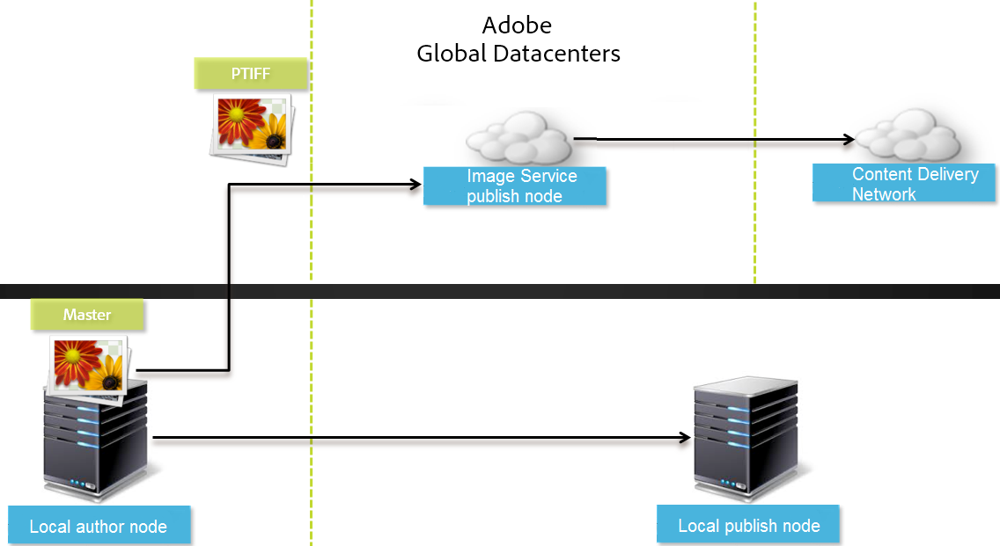
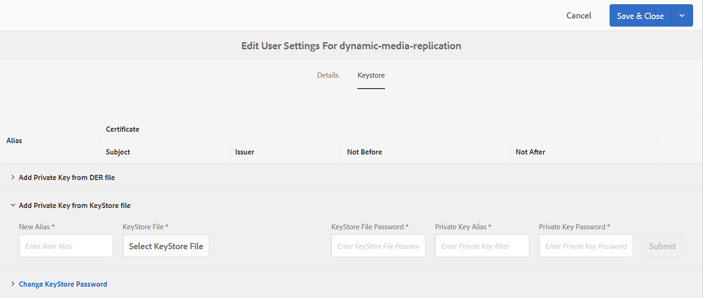
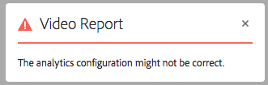
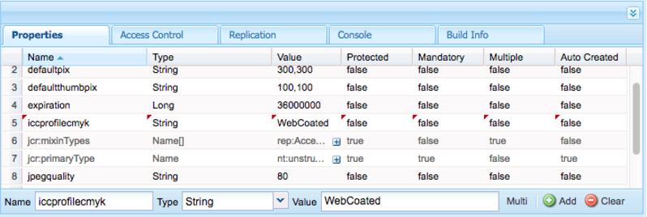

# 配置動態媒體——混合模式{#configuring-dynamic-media-hybrid-mode}

必須啟用並設定動態媒體混合功能，才能使用。 根據您的使用案例，動態媒體有數種支援 [的設定](#supported-dynamic-media-configurations)。

>[!NOTE]
>
>如果您要在Scene7執行模式中設定並執行動態媒體，請參閱 [設定動態媒體- Scene7模式](/help/assets/config-dms7.md)。
>
>如果您要以混合執行模式設定並執行動態媒體，請依照本頁的指示進行。

進一步瞭解如何在動態 [媒體](/help/assets/video.md) 中處理視訊。

>[!NOTE]
>
>如果您針對不同環境（例如開發環境、測試環境和即時生產環境）使用Adobe Experience Manager設定，您必須針對每個環境設定Dynamic Media Cloud Services。

>[!NOTE]
>
>如果您的動態媒體設定有問題，重要的地方是動態媒體專用的記錄檔。 當您啟用動態媒體時，會自動安裝下列程式碼：
>
>* `s7access.log`
>* `ImageServing.log`
>
>
這些資訊記錄在「監 [控與維護您的AEM例項」中](/help/sites-deploying/monitoring-and-maintaining.md)。

混合出版與發佈是Adobe Experience manager之外Dynamic media的核心功能。 混合出版可讓您從雲端而非AEM發佈節點傳送動態媒體資產，例如影像、集和視訊。

其他內容（例如動態媒體檢視器、網站頁面和靜態內容）仍將繼續從AEM發佈節點提供。

如果您是Dynamic media的客戶，您必須使用混合傳送方式來傳送所有Dynamic media內容。

## 適用於視訊的混合出版架構 {#hybrid-publishing-architecture-for-videos}


## 影像的混合出版架構 {#hybrid-publishing-architecture-for-images}



## 支援的動態媒體組態 {#supported-dynamic-media-configurations}

後面的配置任務參考以下術語：

| **期限** | **啟用動態媒體** | **說明** |
|---|---|---|
| AEM作者節點 | 綠色圓圈中的白色複選標籤 | 您部署到內部部署或透過受管理服務的作者節點。 |
| AEM發佈節點 | 紅方的白色X。 | 您部署至內部部署或透過受管理服務的發佈節點。 |
| 影像服務發佈節點 | 綠色圓圈中的白色勾號。 | 您在由Adobe管理的資料中心上執行的發佈節點。 指影像服務URL。 |

您可以選擇僅針對影像、視訊或影像和視訊實施動態媒體。 要確定為特定藍本配置動態媒體的步驟，請參考下表。

<table>
 <tbody>
  <tr>
   <td><strong>藍本</strong></td>
   <td ><strong>運作方式</strong></td>
   <td><strong>配置步驟</strong></td>
  </tr>
  <tr>
   <td>在生產中僅提供影像</td>
   <td>影像會透過Adobe全球資料中心的伺服器傳送，然後由CDN快取，以提供可擴充的效能和全球觸及面。</td>
   <td>
    <ol>
     <li>在AEM作者節 <strong>點上</strong> ，啟 <a href="#enabling-dynamic-media">用動態媒體</a>。</li>
     <li>在 <a href="#configuring-dynamic-media-cloud-services">Dynamic Media Cloud Services中設定影像</a>。</li>
     <li><a href="#configuring-image-replication">配置映像複製</a>。</li>
     <li><a href="#replicating-catalog-settings">複製目錄設定</a>。</li>
     <li><a href="#replicating-viewer-presets">複製檢視器預設集</a>。</li>
     <li><a href="#using-default-asset-filters-for-replication">使用複製的預設資產篩選</a>。</li>
     <li><a href="#configuring-dynamic-media-image-server-settings">設定動態媒體影像伺服器設定</a>。</li>
     <li><a href="#delivering-assets">傳遞資產</a>。</li>
    </ol> </td>
  </tr>
  <tr>
   <td>在預製作（開發、QE、舞台等）中僅提供影像。</td>
   <td>影像會透過AEM發佈節點傳送。 在此情況下，由於流量極低，所以無需將影像傳送至Adobe的資料中心。 另一項好處是，這可讓您在製作啟動之前，安全地預覽內容</td>
   <td>
    <ol>
     <li>在AEM作者節 <strong>點上</strong> ，啟 <a href="#enabling-dynamic-media">用動態媒體</a>。</li>
     <li>在AEM發 <strong>布節點</strong> ，啟 <a href="#enabling-dynamic-media">用動態媒體</a>。</li>
     <li><a href="#replicating-viewer-presets">複製檢視器預設集</a>。</li>
     <li>設定非 <a href="#setting-up-asset-filters-for-imaging-in-non-production-deployments">生產影像的資產篩選</a>。</li>
     <li><a href="#configuring-dynamic-media-image-server-settings">配置動態媒體影像伺服器設定。</a></li>
     <li><a href="#delivering-assets">傳遞資產。</a></li>
    </ol> </td>
  </tr>
  <tr>
   <td>在任何環境（製作、開發、QE、舞台等）中都只提供視訊</td>
   <td>視訊由CDN傳送和快取，以提供可擴充的效能和全球觸及面。 AEM發佈例項會傳送視訊海報影像（播放開始前顯示的視訊縮圖）。</td>
   <td>
    <ol>
     <li>在AEM作者節 <strong>點上</strong> ，啟 <a href="#enabling-dynamic-media">用動態媒體</a>。</li>
     <li>在AEM <strong>publish</strong> 節點上， <a href="#enabling-dynamic-media">啟用動態媒體</a> （發佈例項支援視訊海報影像並提供視訊播放的中繼資料）。</li>
     <li>在 <a href="#configuring-dynamic-media-cloud-services">Dynamic Media Cloud services中設定視訊。</a></li>
     <li><a href="#replicating-viewer-presets">複製檢視器預設集</a>。</li>
     <li>設定僅 <a href="#setting-up-asset-filters-for-video-only-deployments">限視訊的資產篩選</a>。</li>
     <li><a href="#delivering-assets">傳遞資產。</a></li>
    </ol> </td>
  </tr>
  <tr>
   <td>在製作時提供影像和視訊</td>
   <td><p>視訊由CDN傳送和快取，以提供可擴充的效能和全球觸及面。 影像和視訊海報影像是透過Adobe全球資料中心的伺服器傳送，然後由CDN快取，以提供可擴充的效能和全球觸及面。</p> <p>請參閱上一節，在預製中設定影像或視訊。 </p> </td>
   <td>
    <ol>
     <li>在AEM作者節 <strong>點上</strong> ，啟 <a href="#enabling-dynamic-media">用動態媒體</a>。</li>
     <li>在 <a href="#configuring-dynamic-media-cloud-services">Dynamic Media Cloud services中設定視訊。</a></li>
     <li>在 <a href="#configuring-dynamic-media-cloud-services">Dynamic Media Cloud Services中設定影像。</a></li>
     <li><a href="#configuring-image-replication">配置映像複製</a>。</li>
     <li><a href="#replicating-catalog-settings">複製目錄設定</a>。</li>
     <li><a href="#replicating-viewer-presets">複製檢視器預設集</a>。</li>
     <li><a href="#using-default-asset-filters-for-replication">使用預設資產篩選器進行複製。</a></li>
     <li><a href="#configuring-dynamic-media-image-server-settings">配置動態媒體影像伺服器設定。</a></li>
     <li><a href="#delivering-assets">傳遞資產。</a></li>
    </ol> </td>
  </tr>
 </tbody>
</table>

## 啟用動態媒體 {#enabling-dynamic-media}

[動態媒體](https://www.adobe.com/solutions/web-experience-management/dynamic-media.html) ，預設為停用。 若要運用動態媒體功能，您必須使用執行模式(例如 `dynamicmedia` 執行模式)來啟用動態 `publish` 媒體。 在啟用之前，請務必檢閱技 [術需求。](/help/sites-deploying/technical-requirements.md#dynamicmediaaddonprerequisites)

>[!NOTE]
>
>透過執行模式啟用動態媒體會取代AEM 6.1和AEM 6.0中的功能，您可透過將標幟設定為 `dynamicMediaEnabled` true來啟用動態媒體 ****。 此標幟在AEM 6.2和更新版本中沒有功能。 此外，您不需要重新啟動快速入門，就能啟用動態媒體。

透過啟用動態媒體，動態媒體功能將可在UI中使用，而且每個上傳的影像資產都會收到 *cqdam.pyramid.tiff* 轉譯，用於快速傳送動態影像轉譯。 這些PTIFF具有顯著的優點，包括(1)僅能管理單一主影像並即時產生無限轉譯，毋需額外儲存空間，以及(2)能夠使用互動式視覺效果，例如縮放、平移、回轉等。

如果您想在AEM中使用Dynamic Media Classic(Scene7)，除非您使用特定藍本，否則不應啟用「動態 [媒體」](/help/sites-administering/scene7.md#aem-scene-integration-versus-dynamic-media)。 除非您透過執行模式啟用動態媒體，否則動態媒體會停用。

要啟用動態媒體，必須從命令行或快速啟動檔案名啟用動態媒體運行模式。

**若要啟用動態媒體**

1. 在命令行上，啟動快速啟動時，請執行以下操作：

   * 在 `-r dynamicmedia` 啟動jar檔案時添加到命令行末尾。

   ```shell
   java -Xmx4096m -Doak.queryLimitInMemory=500000 -Doak.queryLimitReads=500000 -jar cq-quickstart-6.5.0.jar -r dynamicmedia
   ```

   如果您要發佈至s7delivery，則還需要包含下列trustStore引數：

   ```
   -Djavax.net.ssl.trustStore=<absoluteFilePath>/customerTrustStoreFileName>
   
    -Djavax.net.ssl.trustStorePassword=<passwordForTrustStoreFile>
   ```

1. 請求 `https://localhost:4502/is/image` 並確定影像伺服器現在正在執行。

   >[!NOTE]
   >
   >若要疑難排解Dynamic Media的問題，請參閱目錄中的下列記 `crx-quickstart/logs/` 錄檔：
   >
   >* ImageServer-&lt;PortId>-&lt;yyyy>&lt;mm>&lt;dd>.log - imageServer日誌提供用於分析內部ImageServer進程行為的統計和分析資訊。
   影像伺服器記錄檔名的範例： `ImageServer-57346-2020-07-25.log`
   * s7access-&lt;yyyy>&lt;mm>&lt;dd>.log - s7access記錄透過和記錄對Dynamic Media提出的每個 `/is/image` 請求 `/is/content`。
   這些記錄檔僅在啟用動態媒體時使用。 它們不包含在從頁 **面產生的Download Full** `system/console/status-Bundlelist` Package中；如果您有動態媒體問題，請在呼叫客戶支援時，將這兩個記錄檔附加至問題。

### 如果您將AEM安裝至不同的連接埠或內容路徑…… {#if-you-installed-aem-to-a-different-port-or-context-path}

如果您要將 [AEM部署至應用程式伺服器](/help/sites-deploying/application-server-install.md) ，並啟用「動態媒體」，則需要在外部 **化器中設定** self網域。 否則，資產的縮圖產生將無法正確處理動態媒體資產。

此外，如果在不同的埠或上下文路徑上運行快速啟動，則還必須更改自 **定義** 域。

啟用「動態媒體」時，會使用「動態媒體」產生影像資產的靜態縮圖轉譯。 若要產生縮圖以適用於動態媒體，AEM必須對自身執行URL要求，而且必須同時知道連接埠號碼和內容路徑。

在AEM中：

* 外 **部化器** 中的自 [](/help/sites-developing/externalizer.md) 我網域用來擷取埠號和內容路徑。
* 如果未 **配置自** 體域，則從Jetty HTTP服務檢索埠號和上下文路徑。

在AEM quickStart WAR部署中，無法衍生連接埠號碼和內容路徑，因此您必須設定 **自我** 網域。 請參 [閱外部化說明文](/help/sites-developing/externalizer.md) 件，瞭解如何設 **定self** 網域。

>[!NOTE]
在 [AEM Quickstart單機部署中](/help/sites-deploying/deploy.md)，自 **** 我網域通常不需要設定，因為可自動設定埠號和內容路徑。 但是，如果所有網路介面都關閉，則需要配置 **自定義** 域。

## 停用動態媒體 {#disabling-dynamic-media}

動態媒體預設未啟用。 不過，如果您先前已啟用動態媒體，您稍後可能會想要關閉它。

要在啟用動態媒體後禁用它，請刪除運行 `-r dynamicmedia` 模式標誌。

**若要在動態媒體啟用後停用**

1. 在命令行中，啟動快速啟動時，可以執行下列任一操作：

   * 啟動jar文 `-r dynamicmedia` 件時，不要添加到命令行。

   ```shell
   java -Xmx4096m -Doak.queryLimitInMemory=500000 -Doak.queryLimitReads=500000 -jar cq-quickstart-6.5.0.jar
   ```

1. Request `https://localhost:4502/is/image`. 您會收到動態媒體已停用的訊息。

   >[!NOTE]
   停用「動態媒體」執行模式後，會自動跳過產生轉譯 `cqdam.pyramid.tiff` 的工作流程步驟。 這也會停用動態轉譯支援和其他動態媒體功能。
   另請注意，在設定AEM伺服器後停用「動態媒體」執行模式時，該執行模式下上傳的所有資產現在都無效。

## （可選）將動態媒體預設集和組態從6.3移轉至6.5零停機時間 {#optional-migrating-dynamic-media-presets-and-configurations-from-to-zero-downtime}

如果您要將AEM Dynamic Media從6.3升級至6.5（現在包含零停機部署的功能），您必須執行下列curl命令，才能將所有預設集和組態從CRXDE `/etc` Lite移轉 `/conf` 至CRXDE Lite。

**注意**:如果您以相容模式執行AEM例項（即，您已安裝相容性封裝），就不需要執行這些命令。

對於所有升級，不論是否有相容性套件，您都可以執行下列Linux curl命令，複製Dynamic media原本隨附的預設立即可用檢視器預設集：

`curl -u admin:admin -X POST https://<server_address>:<server_port>/libs/settings/dam/dm/presets/viewer.pushviewerpresets.json`

若要將您建立的任何自訂檢視器預設集和組態移轉 `/etc` 至 `/conf`，請執行下列Linux curl命令：

`curl -u admin:admin -X POST https://<server_address>:<server_port>/libs/settings/dam/dm/presets.migratedmcontent.json`

## 配置映像複製 {#configuring-image-replication}

動態媒體影像傳送的運作方式是，從AEM Author發佈影像資產（包括視訊縮圖），並將其複製至Adobe的隨選複製服務(Replication Service URL)。 然後，資產會透過隨選影像傳送服務（影像服務URL）傳送。

您必須執行下列動作：

1. [設定驗證](#setting-up-authentication)。
1. [配置複製代理](#configuring-the-replication-agent)。

複製代理會發佈動態媒體資產，例如影像、視訊中繼資料，並設定至Adobe代管的影像服務。 預設情況下未啟用複製代理。

配置了複製代理後，您需要驗 [證並測試它是否已成功設定](#validating-the-replication-agent-for-dynamic-media)。 本節介紹這些過程。

>[!NOTE]
建立PTIFF的預設記憶體限制在所有工作流程中為3 GB。 例如，您可以在暫停其他工作流程時處理一個需要3 GB記憶體的影像，或並行處理10個每個影像需要300 MB的記憶體。
記憶體限制是可配置的，應符合系統資源可用性和正在處理的影像內容類型。 如果您擁有許多超大資產，而且系統記憶體充足，則可以增加此限制以確保並行處理影像。
超過最大記憶體限制的映像將被拒絕。
若要變更PTIFF建立的記憶體限制，請導覽至「工具>作業>網頁主控台> Adobe CQ Scene7 PTiffManager **[!UICONTROL 」，然後變]** 更maxMemory **** 值。

### 設定驗證 {#setting-up-authentication}

您需要在作者上設定複製驗證，以便將映像複製到動態媒體映像交付服務。 要執行此操作，請獲取KeyStore，然後將其保存在動態 **[!UICONTROL 媒體複製用戶下]** ，並進行配置。 在布建過程中，您的公司管理員應該收到一封歡迎電子郵件，其中包含KeyStore檔案和必要的憑證。 如果您未收到此訊息，請聯絡客戶服務。

**若要設定驗證**

1. 如果您尚未取得KeyStore檔案和密碼，請連絡客戶服務。 這是布建的一部分，它會將金鑰與您的帳戶建立關聯。
1. 在AEM中，點選AEM標誌以存取全域導覽主控台，然後點選「工具> **[!UICONTROL 安全性>使用者」]**。
1. 在「使用者管理」頁面上，導覽至動 **[!UICONTROL 態媒體複製使用者]** ，然後點選以開啟。

   

1. 在「編輯動態媒體複製的使用者設定」頁面中，點選「 **[!UICONTROL Keystore]** 」標籤，然後按一 **[!UICONTROL 下「建立KeyStore]**」。

   

1. 在「設定KeyStore訪問密碼」對話框中輸 **[!UICONTROL 入密碼並確認密碼]** 。

   >[!NOTE]
   記住您輸入的密碼。 以後配置複製代理時，需要再次輸入它。

   

1. 在「編 **[!UICONTROL 輯用戶設定：動態媒體複製]** 」頁面上，展開「從KeyStore檔案添加專用密鑰 **** 」區域並添加以下內容（請參見以下影像）:

   * 在「 **[!UICONTROL 新別名]** 」欄位中，輸入稍後在複製配置中使用的別名的名稱；例如， `replication`。
   * 點選 **[!UICONTROL KeyStore檔案]**。 導覽至Adobe提供給您的KeyStore檔案，選取它，然後點選「開 **[!UICONTROL 啟」]**。
   * 在「KeyStore檔 **[!UICONTROL 案密碼」欄位中]** ，輸入「KeyStore檔案密碼」。 這不是 **您在步驟** 5中建立的KeyStore密碼，而是Adobe在布建期間傳送給您的歡迎電子郵件中提供的KeyStore檔案密碼。 如果您未收到KeyStore檔案密碼，請聯絡Adobe客戶服務。
   * 在「私 **[!UICONTROL 密金鑰密碼]** 」欄位中，輸入私密金鑰密碼（可能與前一步驟中提供的私鑰密碼相同）。 Adobe會在布建期間傳送給您的歡迎電子郵件中提供私密金鑰密碼。 如果您未收到私密金鑰密碼，請聯絡Adobe客戶服務。
   * 在「私 **[!UICONTROL 鑰別名]** 」欄位中，輸入私鑰別名。 例如， `*companyname*-alias`。 Adobe會在布建期間傳送給您的歡迎電子郵件中提供私密金鑰別名。 如果您未收到私密金鑰別名，請聯絡Adobe客戶服務。
   

1. 點選 **[!UICONTROL 「儲存並關閉]** 」，將變更儲存給此使用者。

   接下來，您需要 [配置複製代理。](#configuring-the-replication-agent)

### 配置複製代理 {#configuring-the-replication-agent}

1. 在AEM中，點選AEM標誌以存取全域導覽主控台，然後點選「工具>部 **[!UICONTROL 署>複製>作者上的代理」]**。
1. 在「作者上的代理」頁面上，點 **[!UICONTROL 選「動態媒體混合影像複製(s7delivery)」]**。
1. 點選 **[!UICONTROL 編輯]**。
1. 點選「 **[!UICONTROL 設定]** 」標籤，然後輸入下列：

   * **[!UICONTROL 啟用]** -選中此複選框可啟用複製代理。
   * **[!UICONTROL 地區]** -設為適當的地區：北美、歐洲或亞洲
   * **[!UICONTROL 租用戶ID]** —— 此值是您發佈至複製服務的公司／租用戶的名稱。 此值是Adobe在布建期間傳送給您的歡迎電子郵件中提供的租用戶ID。 如果您未收到此訊息，請聯絡Adobe客戶服務。
   * **[!UICONTROL 密鑰儲存別名]** -該值與在設定身份驗證中生成密鑰時設定的**新別名** [值相同](#setting-up-authentication);例如， `replication`。 (請參閱設定驗 [證的步驟](#setting-up-authentication)7)。
   * **[!UICONTROL Key Store Password]** —— 這是您點選「Create keyStore」時建立的KeyStore **[!UICONTROL 密碼]**。 Adobe不提供此密碼。 請參閱設定驗 [證的步驟5](#setting-up-authentication)。
   下圖顯示了具有示例資料的複製代理：

   

1. 點選「 **[!UICONTROL 確定]**」。

### 驗證動態媒體的複製代理 {#validating-the-replication-agent-for-dynamic-media}

要驗證動態媒體的複製代理，請執行以下操作：

點選「 **[!UICONTROL 測試連線」]**。 輸出示例如下：

```shell
11.03.2016 10:57:55 - Transferring content for ReplicationAction{type=TEST, path[0]='/content/dam', time=1457722675402, userId='admin', revision='null'}
11.03.2016 10:57:55 - * Auth User: replication-receiver
11.03.2016 10:57:55 - * HTTP Version: 1.1
11.03.2016 10:57:55 - * Using OAuth 2.0 Authorization Grants
11.03.2016 10:57:55 - * OAuth 2.0 User: dynamic-media-replication
11.03.2016 10:57:55 - * OAuth 2.0 Token: '*****' initialized
11.03.2016 10:57:55 - Publishing: POST[https://replicate-na.assetsadobe.com:8580/is-publish/publish-receiver?Cmd=Test&RootId=xfpuu-6613]
11.03.2016 10:57:55 - Publish response: OK[]
11.03.2016 10:57:55 - Transfer succeeded in 141 ms for ReplicationAction{type=TEST, path[0]='/content/dam', time=1457722675402, userId='admin', revision='null'}
-------------------------------------------------------------------------------------------------------------------------------
Replication test succeeded
```

>[!NOTE]
您也可以執行下列任一操作來檢查：
* 檢查複製日誌以確保資產已複製。
* 發佈影像。 點選影像，然後在下拉 **[!UICONTROL 式選單中]** ，選取「檢視器」。 然後選取檢視器預設集，然後按一下「URL」，並複製／貼上瀏覽器中的URL，以確認您可以看到影像。


### 驗證疑難排解 {#troubleshooting-authentication}

在設定驗證時，以下是您在其解決方案中可能遇到的一些問題。 在選中這些選項之前，請確保已設定複製。

#### 問題：HTTP狀態碼401含訊息——需要授權 {#problem-http-status-code-with-message-authorization-required}

此問題可能是由於無法為用戶設定KeyStore所導致 `dynamic-media-replication` 的。

```shell
Replication test to s7delivery:https://s7bern.macromedia.com:8580/is-publish/
17.06.2016 18:54:43 - Transferring content for ReplicationAction{type=TEST, path[0]='/content/dam', time=1466214883309, userId='admin', revision='null'}
17.06.2016 18:54:43 - * Auth User: replication-receiver
17.06.2016 18:54:43 - * HTTP Version: 1.1
17.06.2016 18:54:43 - * Using OAuth 2.0 Authorization Grants
17.06.2016 18:54:43 - * OAuth 2.0 User: dynamic-media-replication
17.06.2016 18:54:43 - No OAuth token available. OAuth not initialized
17.06.2016 18:54:43 - * Using Client Auth SSL alias - replication-alias *
17.06.2016 18:54:43 - Publishing: POST[https://<localhost>:8580/is-publish//publish-receiver?Cmd=Test&RootId=brough]
17.06.2016 18:54:43 - Transfer failed for ReplicationAction{type=TEST, path[0]='/content/dam', time=1466214883309, userId='admin', revision='null'}. java.io.IOException: Failed to execute request
'https://<localhost>:8580/is-publish//publish-receiver?Cmd=Test&RootId=brough':
 Server returned status code 401 with message: Authorization required.
17.06.2016 18:54:43 - Error while replicating: com.day.cq.replication.ReplicationException: Transfer failed for ReplicationAction{type=TEST, path[0]='/content/dam', time=1466214883309,
 userId='admin', revision='null'}. java.io.IOException: Failed to execute request
'https://<localhost>:8580/is-publish//publish-receiver?Cmd=Test&RootId=brough':
 Server returned status code 401 with message: Authorization required.
```

**解決方案**:檢查是否 `KeyStore` 已將 **保存到動態媒體複製用戶** ，並提供了正確的密碼。

#### 問題：無法解密密鑰——無法解密資料 {#problem-could-not-decrypt-key-could-not-decrypt-data}

```xml
Replication test to s7delivery:https://<localhost>:8580/is-publish/
17.06.2016 19:00:16 - Transferring content for ReplicationAction{type=TEST, path[0]='/content/dam', time=1466215216662, userId='admin', revision='null'}
17.06.2016 19:00:16 - * Auth User: replication-receiver
17.06.2016 19:00:16 - * HTTP Version: 1.1
17.06.2016 19:00:16 - * Using OAuth 2.0 Authorization Grants
17.06.2016 19:00:16 - * OAuth 2.0 User: dynamic-media-replication
17.06.2016 19:00:16 - No OAuth token available. OAuth not initialized
17.06.2016 19:00:16 - * Using Client Auth SSL alias - replication-alias *
17.06.2016 19:00:16 - Transfer failed for ReplicationAction{type=TEST, path[0]='/content/dam', time=1466215216662, userId='admin', revision='null'}. java.lang.SecurityException: java.security.UnrecoverableKeyException: Could not decrypt key: Could not decrypt data.
```

**解決方案**:檢查密碼。 保存在複製代理中的密碼與用於建立密鑰庫的密碼不同。

#### 問題：InvalidAlgorithmParameterException {#problem-invalidalgorithmparameterexception}

此問題是由AEM Author例項中的設定錯誤所造成。 作者上的Java進程未獲得正確的資訊 `javax.net.ssl.trustStore`。 在複製日誌中看到以下錯誤：

```shell
14.04.2016 09:37:43 - Transfer failed for ReplicationAction{type=TEST, path[0]='/content/dam', time=1460651862089, userId='admin', revision='null'}. java.io.IOException: Failed to execute request 'https://<localhost>:8580/is-publish/publish-receiver?Cmd=Test&RootId=rbrough-osx2': java.lang.RuntimeException: Unexpected error: java.security.InvalidAlgorithmParameterException: the trustAnchors parameter must be non-empty
14.04.2016 09:37:43 - Error while replicating: com.day.cq.replication.ReplicationException: Transfer failed for ReplicationAction{type=TEST, path[0]='/content/dam', time=1460651862089, userId='admin', revision='null'}. java.io.IOException: Failed to execute request 'https://<localhost>:8580/is-publish/publish-receiver?Cmd=Test&RootId=rbrough-osx2': java.lang.RuntimeException: Unexpected error: java.security.InvalidAlgorithmParameterException: the trustAnchors parameter must be non-empty
```

或錯誤日誌：

```shell
07.25.2019 12:00:59.893 *ERROR* [sling-threadpool-db2763bb-bc50-4bb5-bb64-10a09f432712-(apache-sling-job-thread-pool)-90-com_day_cq_replication_job_s7delivery(com/day/cq/replication/job/s7delivery)] com.day.cq.replication.Agent.s7delivery.queue Error during processing of replication.

java.io.IOException: Failed to execute request 'https://replicate-na.assetsadobe.com:8580/is-publish/publish-receiver?Cmd=Test&RootId=rbrough-osx': java.lang.RuntimeException: Unexpected error: java.security.InvalidAlgorithmParameterException: the trustAnchors parameter must be non-empty
        at com.scene7.is.catalog.service.publish.atomic.PublishingServiceHttp.executePost(PublishingServiceHttp.scala:195)
```

**解決方案**:請確定AEM Author上的java進程已將系統屬性設 `-Djavax.net.ssl.trustStore=` 為有效的信任庫。

#### 問題：KeyStore未設定或未初始化 {#problem-keystore-is-either-not-set-up-or-it-is-not-initialized}

此問題可能是由Hot Fix，或功能套件覆寫動態媒體使用者或金鑰庫節點所造成。

複製日誌示例：

```shell
Replication test to s7delivery:https://replicate-na.assetsadobe.com/is-publish
02.08.2016 14:37:44 - Transferring content for ReplicationAction{type=TEST, path[0]='/content/dam', time=1470173864834, userId='admin', revision='null'}
02.08.2016 14:37:44 - * Auth User: replication-receiver
02.08.2016 14:37:44 - * HTTP Version: 1.1
02.08.2016 14:37:44 - * Using OAuth 2.0 Authorization Grants
02.08.2016 14:37:44 - * OAuth 2.0 User: dynamic-media-replication
02.08.2016 14:37:44 - Transfer failed for ReplicationAction{type=TEST, path[0]='/content/dam', time=1470173864834, userId='admin', revision='null'}. com.adobe.granite.keystore.KeyStoreNotInitialisedException: Uninitialised key store for user dynamic-media-replication
```

**解決方案**:

1. 定位至「用戶管理」頁：
   `localhost:4502/libs/granite/security/content/useradmin.html`
1. 在「使用者管理」頁面上，導覽至使 `dynamic-media-replication` 用者，然後點選以開啟。
1. 按一下「 **[!UICONTROL KeyStore]** 」標籤。 如果出 **[!UICONTROL 現「Create keyStore]** 」按鈕，則需要重做「Setting up Authentication arel [(以前設定驗證](#setting-up-authentication) )」下的步驟。
1. 如果必須重做KeyStore設定，則可能還需要 [再次配置複製代理](/help/assets/config-dynamic.md#configuring-the-replication-agent) 。

   重新配置s7delivery Replication Agent。
   `localhost:4502/etc/replication/agents.author/s7delivery.html`

1. 點選 **[!UICONTROL 測試連線]** ，以驗證設定是否有效。

#### 問題：發佈代理使用SSL而非OAuth {#problem-publish-agent-is-using-ssl-instead-of-oauth}

此問題可能是由Hot Fix或無法正確安裝或覆寫設定的功能套件所造成。

複製日誌示例：

```shell
01.08.2016 18:42:59 - Transferring content for ReplicationAction{type=TEST, path[0]='/content/dam', time=1470073379634, userId='admin', revision='null'}
01.08.2016 18:42:59 - * Auth User: replication-receiver
01.08.2016 18:42:59 - * HTTP Version: 1.1
01.08.2016 18:42:59 - * Using Client Auth SSL alias - replication-receiver *
01.08.2016 18:42:59 - Publishing: POST[https://replicate-eu.assetsadobe2.com:443/is-publish/publish-receiver?Cmd=Test&RootId=altayerstaging]
01.08.2016 18:42:59 - Transfer failed for ReplicationAction{type=TEST, path[0]='/content/dam', time=1470073379634, userId='admin', revision='null'}. java.io.IOException: Failed to execute request 'https://replicate-eu.assetsadobe2.com:443/is-publish/publish-receiver?Cmd=Test&RootId=rbroughstaging': Server returned status code 401 with message: Authorization required.
01.08.2016 18:42:59 - Error while replicating: com.day.cq.replication.ReplicationException: Transfer failed for ReplicationAction{type=TEST, path[0]='/content/dam', time=1470073379634, userId='admin', revision='null'}. java.io.IOException: Failed to execute request 'https://replicate-eu.assetsadobe2.com:443/is-publish/publish-receiver?Cmd=Test&RootId=rbroughstaging': Server returned status code 401 with message: Authorization required.
```

**解決方案：**

1. 在AEM中，按一下「 **[!UICONTROL 工具>一般> CRXDE Lite]**」。

   `localhost:4502/crx/de/index.jsp`

1. 導航到s7delivery Replication Agent節點。
   `localhost:4502/crx/de/index.jsp#/etc/replication/agents.author/s7delivery/jcr:content`

1. 將此設定添加到複製代理(值設定為 **[!UICONTROL True的布林]**):

   `enableOauth=true`

1. 在頁面左上角附近，點選「全 **[!UICONTROL 部儲存」]**。

### 測試您的配置 {#testing-your-configuration}

Adobe建議您對設定執行端對端測試。

在開始此測試之前，請確定您已執行下列作業：

* 已新增影像預設集。
* 在「 **[!UICONTROL 雲端服務」下設定「動態媒體設定」（6.3之前版本）]** 。 此測試需要影像服務URL

**若要測試您的設定**

1. 上傳影像資產。 (在「資產」中，點 **[!UICONTROL 選「建立>檔案]** 」並選取檔案。)
1. 等待工作流程完成。
1. 發佈影像資產。 (選取資產並點選「 **[!UICONTROL 快速發佈]**」)。
1. 開啟影像並點選「轉譯」，導覽至該影像的轉 **[!UICONTROL 譯]**。

   

1. 選取任何動態轉譯。
1. 按一 **[!UICONTROL 下]** 「URL」以取得此資產的URL。
1. 導覽至選取的URL，並檢查影像是否如預期般運作。

另一種測試已傳送資產的方法，是將req=exists附加至您的URL。

## Configuring Dynamic Media Cloud Services {#configuring-dynamic-media-cloud-services}

Dynamic Media cloud服務支援雲端服務，例如混合發佈和傳送影像和視訊、視訊分析和視訊編碼等。

在配置中，您需要輸入註冊ID、視頻服務URL、影像服務URL、複製服務URL和設定驗證。 您應該已在帳戶布建程式中收到所有這些資訊。 如果您未收到此資訊，請連絡您的Adobe Experience Manager管理員或Adobe技術支援以取得該資訊。

>[!NOTE]
在設定Dynamic Media cloud服務之前，請務必設定您的發佈例項。 在配置Dynamic Media cloud服務之前，您還必須設定複製。

若要設定動態媒體雲端服務：

1. 在AEM中，點選AEM標誌以存取全域導覽主控台，然後點選「 **[!UICONTROL 工具>雲端服務>動態媒體設定（6.3之前版本）]**」。
1. 在「動態媒體設定瀏覽器」頁面的左窗格中，選取全域 ****，然後點選 **[!UICONTROL 建立]**。
1. 在「建 **[!UICONTROL 立動態媒體設定]** 」對話方塊的「標題」欄位中，輸入標題。
1. 如果您要設定視訊的動態媒體，

   * 在「注 **[!UICONTROL 冊ID」欄位]** ，輸入您的註冊ID。
   * 在「視 **[!UICONTROL 訊服務URL ]**」欄位中，輸入動態媒體閘道的視訊服務URL。

1. 如果您要設定Dynamic Media以進行影像處理，請在「 **[!UICONTROL Image Service URL]** 」（影像服務URL）欄位中，輸入Dynamic Media閘道的影像服務URL。
1. 點選「 **[!UICONTROL 儲存]** 」可返回「動態媒體設定瀏覽器」頁面。
1. 點選AEM標誌以存取全域導覽主控台。

## 設定視訊報表 {#configuring-video-reporting}

您可以使用Dynamic Media Hybrid，在多個AEM安裝中設定視訊報告。

**** 使用時機：在您設定動態媒體設定（6.3之前版本）時，會啟動許多功能，包括視訊報告。 此設定會在地區性Analytics公司中建立報表套裝。 如果您設定多個「作者」節點，您會為每個節點建立個別的報表套裝。 因此，報告資料在安裝之間不一致。 此外，如果每個「作者」節點都參照相同的「混合發佈」伺服器，則上次「作者」安裝會變更所有視訊報表的目標報表套裝。 此問題會將Analytics系統的報表套裝過多過載。

**** 開始使用：完成下列三項工作，以設定視訊報告。

1. 在第一個「作者」節點上設定「動態媒體設定」（6.3之前版本）後，建立「視訊分析」預設套件。 此初始任務很重要，因為它允許新配置繼續使用相同的報表套裝。
1. 在設定動態媒體設定(6.3之前 ***版本)之*** 前，先將Video Analytics預設集套 ****** 件安裝至任何新的Author節點。
1. 驗證並調試軟體包安裝。

### 在設定第一個「作者」節點後建立「視訊分析預設」套件 {#creating-a-video-analytics-preset-package-after-configuring-the-first-author-node}

完成此工作後，您會擁有包含視訊分析預設集的套件檔案。 這些預設集包含報表套裝、追蹤伺服器、追蹤命名空間和Marketing cloud組織ID（若有的話）。

1. 如果您尚未這麼做，請設定動態媒體設定（6.3之前版本）。
1. （可選）檢視並複製報表套裝ID（您必須擁有JCR的存取權）。 雖然不需要有報表套裝ID，但可讓驗證更輕鬆。
1. 使用「包管理器」建立包。
1. 編輯套件以包含篩選。

   在AEM中： `/conf/global/settings/dam/dm/presets/analytics/jcr:content/userdata`

1. 建立套件。
1. 下載或共用Video Analytics預設集套件，以便與後續的新「作者」節點共用。

### 在您設定其他「作者」節點之前，先安裝「視訊分析」預設集套件 {#installing-the-video-analytics-preset-package-before-you-configure-additional-author-nodes}

在配置動態媒體配置( ***6.3版*** )之前，請務必完成此任務。 若無法這麼做，則會建立另一個未使用的報表套裝。 此外，即使視訊報告仍能正常運作，資料收集仍無法最佳化。

請確定第一個「作者」節點的「視訊分析」預設套件可在新的「作者」節點上存取。

1. 將您先前建立的Video Analytics預設套件上傳至Package Manager。
1. 安裝Video Analytics預設套件。
1. 設定動態媒體設定（6.3之前版本）。

### 驗證和調試軟體包安裝 {#verifying-and-debugging-the-package-installation}

1. 執行下列任一操作以驗證軟體包安裝，並在必要時調試軟體包安裝：

   * **透過JCR檢查「視訊分析」預設集**&#x200B;若要透過JCR檢查「視訊分析」預設集，您必須擁有CRXDE Lite的存取權。

      AEM —— 在CRXDE Lite中，導覽至 `/conf/global/settings/
dam/dm/presets/analytics/jcr:content/userdata`

      就是 `https://localhost:4502/crx/de/index.jsp#/conf/global/settings/dam/dm/presets/analytics/jcr%3Acontent/userdata`

      如果您沒有在「作者」節點上存取CRXDE Lite的權限，則可以透過「發佈」伺服器檢查預設集。

   * **透過影像伺服器檢查視訊分析預設集**

      您可以透過提出影像伺服器req=userdata要求，直接驗證視訊分析預設集。
例如，若要在「作者」節點上查看Analytics預設集，您可以提出下列要求：

      `https://localhost:4502/is/image/conf/global/settings/dam/dm/presets/analytics?req=userdata`

      若要驗證發佈伺服器上的預設集，您可以對發佈伺服器進行類似的直接要求。 在「作者」和「發佈」節點上的回應相同。 回應看起來類似下列：**

      ```
      marketingCloudOrgId=0FC4E86B573F99CC7F000101
       reportSuite=aemaem6397618-2018-05-23
       trackingNamespace=aemvideodal
       trackingServer=aemvideodal.d2.sc.omtrdc.net
      ```

   * **透過AEM** Tap **[!UICONTROL Tools > Assets > Video Reporting中的「視訊報告」工具，檢查「視訊分析」預設集]**

      `https://localhost:4502/mnt/overlay/dam/gui/content/s7dam/videoreports/videoreport.html`

      如果您看到下列錯誤訊息，報表套裝即可使用，但未填入。 在系統收集任何資料之前，在新安裝中此錯誤是正確且必要的。
   

   若要產生報告資料，請上傳並發佈一個視訊。 使用 **[!UICONTROL 複製URL]** ，並至少執行一次視訊。

   請注意，從視訊檢視器使用情況填入報表資料可能需要12小時。

   如果發生錯誤且報表套裝未正確設定，則會顯示下列警報。

   

   如果在您設定動態媒體設定（6.3之前版本）服務之前執行視訊報告，也會顯示此錯誤。

### 疑難排解視訊報告設定 {#troubleshooting-the-video-reporting-configuration}

* 在安裝期間，有時會逾時連線至Analytics API伺服器。 安裝會重試連線20次，但仍會失敗。 發生這種情況時，日誌檔案會記錄多個錯誤。 搜尋 `SiteCatalystReportService`.
* 不先安裝Analytics預設集套件，可能會建立新的報表套裝。
* 從AEM 6.3升級至AEM 6.4或AEM 6.4.1，然後設定「動態媒體設定」（6.3之前版本），仍會建立報表套裝。 此問題已知且已修正，適用於AEM 6.4.2。

### 關於視訊分析預設集 {#about-the-video-analytics-preset}

「視訊分析」預設集（有時簡稱為分析預設集）會儲存在「動態媒體」的「檢視器」預設集旁。 它基本上與檢視器預設集相同，但包含用於設定AppMeasurement和視訊心率報告的資訊。

預設集的屬性如下：

* `reportSuite`
* `trackingServer`
* `trackingNamespace`
* `marketingCloudOrgId` （舊版AEM中不存在）

AEM 6.4及更新版本將此預設集儲存在 `/conf/global/settings/dam/dm/presets/analytics/jcr:content/userdata`

## 複製目錄設定 {#replicating-catalog-settings}

您必須透過JCR，在設定程式中發佈自己的預設目錄設定。 要複製目錄設定：

1. 在「終端機」視窗中，執行下列動作：

   `curl -u admin:admin localhost:4502/libs/settings/dam/dm/presets/viewer.pushviewerpresets`

1. 在AEM中，導覽至CRXDE Lite中的下列位置（需要管理員權限）:

   `https://<*server*>:<*port*>/crx/de/index.jsp#/conf/global/settings/dam/dm/imageserver/`

1. 點選「復 **[!UICONTROL 制]** 」標籤。
1. 點選「 **[!UICONTROL 複製]**」。

## 複製檢視器預設集 {#replicating-viewer-presets}

若要使 *用檢視器預設集傳送資產，您必須複製／發佈檢視器* 預設集。 (所有檢視器預設集都必須 *啟動* 並複製，才能取得資產的URL或內嵌代碼。
如需詳 [細資訊，請參閱Publishing Viewer](/help/assets/managing-viewer-presets.md#publishing-viewer-presets) Presets。

>[!NOTE]
依預設，當您選取「轉譯」時，系統會顯示各種轉譯，當您在資產的詳細資料檢視中選取「檢視器 ******** 」時，系統會顯示各種檢視器預設集。 您可以增加或減少顯示的數目。 請參 [閱增加顯示的影像預設集數目](/help/assets/managing-image-presets.md#increasingthenumberofimagepresetsthatdisplay) , [或增加顯示的檢視器預設集數目](/help/assets/managing-viewer-presets.md#increasing-the-number-of-viewer-presets-that-display)。

## 篩選複製資產 {#filtering-assets-for-replication}

在非動態媒體部署中，您會將 *AEM作者環境* （包括影像和視訊）的所有資產複製至AEM發佈節點。 此工作流程是必要的，因為AEM發佈伺服器也會傳送資產。

不過，在動態媒體部署中，由於資產是透過雲端傳送，因此不需要將這些相同的資產複製至AEM發佈節點。 這種「混合式發佈」工作流程可避免額外的儲存成本以及複製資產的較長處理時間。 AEM發佈節點會持續提供其他內容，例如動態媒體檢視器、網站頁面和靜態內容。

除複製資產外，還複製下列非資產：

* 動態媒體傳送設定： `/conf/global/settings/dam/dm/imageserver/jcr:content`
* 影像預設集: `/conf/global/settings/dam/dm/presets/macros`
* 檢視器預設集: `/conf/global/settings/dam/dm/presets/viewer`

這些篩選條件可讓您排除 *資產* ，使其不複製至AEM發佈節點。

### 使用預設資產篩選器進行複製 {#using-default-asset-filters-for-replication}

如果您使用動態媒體進行(1)影像製作 **** ，或(2)影像和視訊製作，則可使用我們依現狀提供的預設濾鏡。 下列篩選器預設為作用中：

<table>
 <tbody>
  <tr>
   <td> </td>
   <td><strong>篩選</strong></td>
   <td><strong>Mime 類型</strong></td>
   <td><strong>轉譯</strong></td>
  </tr>
  <tr>
   <td>動態媒體影像傳送</td>
   <td><p>濾鏡影像</p> <p>filter-sets</p> <p> </p> </td>
   <td><p>以影 <strong>像／開頭</strong></p> <p>包含 <strong>應用程式/</strong> 且結尾 <strong>為set</strong>。</p> </td>
   <td>現成可用的「濾鏡影像」（套用至單一影像資產，包括互動式影像）和「濾鏡集」（套用至旋轉集、影像集、混合媒體集和轉盤集）將：
    <ul>
     <li>包含PTIFF影像和中繼資料以進行複製(任何以 <strong>cqdam開始的轉譯</strong>)。</li>
     <li>不複製原始影像和靜態影像轉譯。</li>
    </ul> </td>
  </tr>
  <tr>
   <td>動態媒體視訊傳送</td>
   <td>filter-video</td>
   <td>開始於 <strong>影片/</strong></td>
   <td>現成可用的「filter-video」將：
    <ul>
     <li>包含代理視訊轉譯、視訊縮圖／海報影像、中繼資料（父視訊和視訊轉譯）以進行複製(任何轉譯以 <strong>cqdam</strong>開頭)。</li>
     <li>排除原始視訊和靜態縮圖轉譯的複製。<br /><br /> <strong> 注 </strong>意：代理視訊轉譯不包含二進位檔，而只是節點屬性。 因此，對發佈者儲存庫大小沒有影響。</li>
    </ul> </td>
  </tr>
  <tr>
   <td>Dynamic Media Classic(Scene7)整合</td>
   <td><p>濾鏡影像</p> <p>filter-sets</p> <p>filter-video</p> </td>
   <td><p>以影 <strong>像／開頭</strong></p> <p>包含 <strong>應用程式/</strong> 且結尾 <strong>為set</strong>。</p> <p>開始於 <strong>影片/</strong></p> </td>
   <td><p>您可設定「傳輸URI」以指向您的AEM發佈伺服器，而非Adobe Dynamic Media Cloud複製服務URL。 設定此篩選條件可讓Dynamic Media Classic傳遞資產，而非AEM發佈例項。</p> <p>現成可用的「濾鏡影像」、「濾鏡集」和「濾鏡影片」將：</p>
    <ul>
     <li>包含PTIFF影像、Proxy視訊轉譯和中繼資料以進行複製。 但是，由於JCR中不存在這些AEM - Dynamic Media Classic整合的執行者，因此它們無效。</li>
     <li>排除複製原始影像、靜態影像轉譯、原始視訊和靜態縮圖轉譯。 Dynamic Media Classic會提供影像和視訊資產。</li>
    </ul> </td>
  </tr>
 </tbody>
</table>

>[!NOTE]
篩選器適用於MIME類型，不能是特定路徑。

### 設定僅限視訊部署的資產篩選 {#setting-up-asset-filters-for-video-only-deployments}

如果您使用僅限視訊的Dynamic Media，請依照下列步驟設定複製的資產篩選：

1. 在AEM中，點選AEM標誌以存取全域導覽主控台，然後點選「工具>部 **[!UICONTROL 署>複製>作者上的代理」]**。
1. 在「作者上的代理」頁面上，點選「 **[!UICONTROL 預設代理（發佈）]**」。
1. 點選 **[!UICONTROL 編輯]**。
1. 在「代 **[!UICONTROL 理設定]** 」對話框的「設定」頁籤中，選中「 **[!UICONTROL 啟用]****** 」以開啟代理。
1. 點選「 **[!UICONTROL 確定]**」。
1. 在AEM中，點選「 **[!UICONTROL 工具>一般> CRXDE Lite]**」。
1. 在左側資料夾樹中，導航到 `/etc/replication/agents.author/dynamic_media_replication/jcr:content/damRenditionFilters`
1. 找 **[!UICONTROL 到filter-video]**，按一下右鍵它並選擇 **[!UICONTROL Copy]**。
1. 在左側資料夾樹中，導航到 `/etc/replication/agents.author/publish`
1. 找 **[!UICONTROL 到jcr:content]**，按一下右鍵它並選擇 **[!UICONTROL 貼上]**。

這會設定AEM發佈例項，以傳送視訊海報影像以及播放所需的視訊中繼資料，而視訊本身則由Dynamic Media雲端服務傳送。 篩選器也會排除複製發佈例項中不需要的原始視訊和靜態縮圖轉譯。

### 為非生產部署中的映像設定資產篩選器 {#setting-up-asset-filters-for-imaging-in-non-production-deployments}

如果您在非生產部署中使用Dynamic Media進行映像，請遵循下列步驟，為複製設定資產篩選器：

1. 在AEM中，點選AEM標誌以存取全域導覽主控台，然後點選「工具>部 **[!UICONTROL 署>複製>作者上的代理」]**。
1. 在「作者上的代理」頁面上，點選「 **[!UICONTROL 預設代理（發佈）]**」。
1. 點選 **[!UICONTROL 編輯]**。
1. 在「代 **[!UICONTROL 理設定]** 」對話框的「設定」頁籤中，選中「 **[!UICONTROL 啟用]****** 」以開啟代理。
1. 點選「 **[!UICONTROL 確定]**」。
1. 在AEM中，點選「 **[!UICONTROL 工具>一般> CRXDE Lite]**」。
1. 在左側資料夾樹中，導航到 `/etc/replication/agents.author/dynamic_media_replication/jcr:content/damRenditionFilters`

   

1. 找 **[!UICONTROL 到濾鏡影像]**，以滑鼠右鍵按一下並選取「 **[!UICONTROL 複製」]**。
1. 在左側資料夾樹中，導航到 `/etc/replication/agents.author/publish`
1. 找到 **[!UICONTROL jcr:content]**，按一下右鍵它，然後選擇「 **[!UICONTROL 建立」>「建立節點」]**。 輸入類型 `damRenditionFilters` 的名稱 `nt:unstructured`。
1. 找 `damRenditionFilters`到，按一下右鍵並選擇 **[!UICONTROL 貼上]**。

這會設定AEM發佈例項，以將影像傳送至您的非生產環境。 篩選器也會排除複製發佈例項中不需要的原始影像和靜態轉譯。

>[!NOTE]
如果作者中有許多不同的篩選器，則每個代理都需要為其指派不同的用戶。 花崗岩程式碼會強制使用每位使用者一個篩選器模型。 每個篩選設定的使用者一律不同。
如果您在伺服器上使用多個篩選器——例如，一個要發佈的複製篩選器和s7delivery的第二個篩選器——則您需要確保這兩個篩選器在 **jcr:content** 節點中為其指派不同的 **userId** 。 請參閱下列影像：


### 自定義複製的資產篩選器 {#customizing-asset-filters-for-replication}

要選擇性地自定義複製的資產篩選器：

1. 在AEM中，點選AEM標誌以存取全域導覽主控台，然後點選「工 **[!UICONTROL 具>一般> CRXDE Lite]**」。
1. 在左側的資料夾樹狀結構中，導覽至 `/etc/replication/agents.author/dynamic_media_replication/jcr:content/damRenditionFilters` 檢視篩選器。

   

1. 要定義篩選器的Mime類型，可以按如下方式查找Mime類型：

   在左側導軌中，展 `content > dam > <locate_your_asset> >  jcr:content > metadata` 開，然後在表格中找到 **[!UICONTROL dc:format]**。

   下圖為資產dc:format路徑的範例。

   

   請注意， `dc:format` 資產的 `Fiji Red.jpg` 位置 `image/jpeg`。

   若要讓此濾鏡適用於所有影像（不論其格式為何），請將值設 `image/*` 定為 `*` 其中是規則運算式，可套用至任何格式的所有影像。

   要讓濾鏡僅應用於JPEG類型的影像，請輸入值 `image/jpeg`。

1. 定義要包含或排除在複製中的轉譯。

   可用於篩選複製的字元包括：

<table>
 <tbody>
  <tr>
   <td><strong>要使用的字元</strong></td>
   <td><strong>如何篩選複製資產</strong></td>
  </tr>
  <tr>
   <td>*</td>
   <td>萬用字元<br /> </td>
  </tr>
  <tr>
   <td>+</td>
   <td>包括用於複製的資產。</td>
  </tr>
  <tr>
   <td>-</td>
   <td>排除複製中的資產。</td>
  </tr>
 </tbody>
</table>

導航到 `content/dam/<locate your asset>/jcr:content/renditions`.

下圖為資產轉譯的範例。


使用上述範例，如果您只想複製PTIFF（金字塔TIFF），則可輸入 `+cqdam,*` 其中包含所有以開頭的轉譯 `cqdam`。 在範例中，該轉譯為 `cqdam.pyramid.tiff`。

如果您只想複製原稿，則可輸入 `+original`。

## 配置動態媒體映像伺服器設定 {#configuring-dynamic-media-image-server-settings}

設定動態媒體影像伺服器需要編輯Adobe CQ Scene7 imageServer套裝和Adobe CQ Scene7 PlatformServer套裝。

>[!NOTE]
動態媒體啟用後即 [可立即運作](#enabling-dynamic-media)。 不過，您可選擇將動態媒體影像伺服器設定為符合特定規格或需求，以微調您的安裝。

**先決條件**:配 *置Dynamic Media Image Server* 之前，請確保Windows的虛擬機包含Microsoft Visual C++庫的安裝。 必須有這些庫才能運行Dynamic Media Image Server。 您可 [以從這裡下載Microsoft Visual C++ 2010 Redistributable Package(x64)](https://www.microsoft.com/en-us/download/details.aspx?id=14632)。

要配置動態媒體映像伺服器設定：

1. 在AEM的左上角，點選 **[!UICONTROL Adobe Experience Manager]** ，以存取全域導覽主控台，然後點選「工 **[!UICONTROL 具>作業> Web Console]**」。
1. 在「Adobe Experience Manager Web Console設定」頁面上，點選「 **[!UICONTROL OSGi >設定」]** ，以列出目前在AEM中執行的所有搭售。

   動態媒體傳送伺服器位於清單中的下列名稱下：

   * `Adobe CQ Scene7 ImageServer`
   * `Adobe CQ Scene7 PlatformServer`

1. 在Adobe CQ Scene7 ImageServer右側的組合清單中，點選「編輯」圖示。
1. 在「Adobe CQ Scene7 ImageServer」對話方塊中，設定下列組態值：

   >[!NOTE]
   在大多數情況下，不需要更改預設值。 但是，如果確實更改了預設值，則必須重新啟動包才能使更改生效。

<table>
 <tbody>
  <tr>
   <td><strong>屬性</strong></td>
   <td><strong>預設值</strong></td>
   <td><strong>說明</strong></td>
  </tr>
  <tr>
   <td>TcpPort.name</td>
   <td><code><em>empty</em></code></td>
   <td>用於與ImageServer進程通信的埠號。 預設情況下會自動檢測空閒埠。</td>
  </tr>
  <tr>
   <td>AllowRemoteAccess.name</td>
   <td><code><em>empty</em></code></td>
   <td><p>允許或禁止遠程訪問ImageServer進程。 如果為false，則影像伺服器只會監聽localhost。</p> <p>指向localhost的預設外置設定需要指定特定VM實例的實際域或IP地址。 原因是localhost可能指向VM的父系統。</p> <p>VM的域或IP地址可能需要有主機檔案條目，以便能夠自行解析。</p> </td>
  </tr>
  <tr>
   <td>MaxRenderRgnPixels</td>
   <td>16兆帕</td>
   <td>呈現的最大大小（百萬像素）。</td>
  </tr>
  <tr>
   <td>MaxMessageSize</td>
   <td>16 MB</td>
   <td>傳送的最大消息大小(MB)。</td>
  </tr>
  <tr>
   <td>RandomAccessUrlTimeout</td>
   <td>20</td>
   <td>逾時值，表示ImageServer將等待JCR回應區間拼貼請求的時間長度（秒）。</td>
  </tr>
  <tr>
   <td>WorkerThreads</td>
   <td>10</td>
   <td>工作線程數。</td>
  </tr>
 </tbody>
</table>

1. 點選「 **[!UICONTROL 儲存]**」。
1. 在Adobe CQ Scene7 PlatformServer右側的搭售清單中，點選「編輯」 **[!UICONTROL 圖示]** 。
1. 在「Adobe CQ Scene7 PlatformServer」對話方塊中，設定下列預設值選項：

   >[!NOTE]
   Dynamic Media Image server使用其自己的磁碟快取來快取回應。 AEM HTTP快取和Dispacher無法用來快取來自動態媒體影像伺服器的回應。

   | **屬性** | **預設值** | **說明** |
   |---|---|---|
   | 已啟用快取 | 已核取 | 是否啟用響應快取。 |
   | 快取根 | 快取 | 到響應快取資料夾的一個或多個路徑。 相對路徑會針對內部s7imaging bundle資料夾進行解析。 |
   | 快取最大大小 | 200000000 | 響應快取的最大大小（以位元組為單位）。 |
   | 快取最大登入次數 | 100000 | 快取中允許的最大條目數。 |

### 預設資訊清單設定 {#default-manifest-settings}

預設資訊清單可讓您設定用來產生動態媒體傳送回應的預設值。 您可以微調品質（JPEG品質、解析度、重新取樣模式）、快取（過期），並防止轉譯過大的影像(defaultpix、defaultthumpix、maxpix)。

預設資訊清單設定的位置取自 **[!UICONTROL Adobe CQ Scene7 PlatformServer套裝的Catalog root]** default值 **** 。 依預設，此值位於「工具>一般> CRXDE Lite」 **[!UICONTROL 中的下列路徑]**:

`/conf/global/settings/dam/dm/imageserver/`


您可以輸入新值來更改屬性的值，如下表所述。

完成對預設資訊清單的變更後，請在頁面的左上角點選「全 **[!UICONTROL 部儲存」]**。

請確定您點選「 **[!UICONTROL Access Control]** 」（存取控制）標籤(位於「Properties」（屬性）標籤的右側)，然後為每個使用者和動態媒體複製使用者設定存取控制權限 `jcr:read` 。


資訊清單設定表及其預設值：

<table>
 <tbody>
  <tr>
   <td><strong>屬性</strong></td>
   <td><strong>預設值</strong></td>
   <td><strong>說明</strong></td>
  </tr>
  <tr>
   <td>bkgcolor</td>
   <td>FFFFFF</td>
   <td><p>預設背景顏色。 RGB值，用於填滿不含實際影像資料之回覆影像的任何區域。</p> <p>另請參 <a href="https://microsite.omniture.com/t2/help/en_US/s7/is_ir_api/is_api/image_catalog/r_bkgcolor.html">閱「影像服務</a> API」中的BkgColor。</p> </td>
  </tr>
  <tr>
   <td>defaultpix</td>
   <td>300,300</td>
   <td><p>預設檢視大小。 如果請求未明確使用wid=、hei=或scl=指定檢視大小，伺服器會限制回覆影像不大於此寬度和高度。</p> <p>指定為兩個整數，0或更大，以逗號分隔。 寬度和高度（以像素為單位）。 其中一個或兩個值都可設為0，以保持不受約束。 不適用於巢狀／內嵌請求。</p> <p>另請參 <a href="https://microsite.omniture.com/t2/help/en_US/s7/is_ir_api/is_api/image_catalog/r_defaultpix.html">閱Image Serving API中的</a> DefaultPix。</p> <p>不過，通常您使用檢視器預設集或影像預設集來傳送資產。 Defaultpix僅適用於未使用檢視器預設集或影像預設集的資產。</p> </td>
  </tr>
  <tr>
   <td>defaultthumbpix</td>
   <td>100,100</td>
   <td><p>預設縮圖大小。 用於縮圖請求(req=tmb)，而非屬性：:DefaultPix。</p> <p>如果縮圖要求(req=tmb)未明確指定大小，而未明確使用wid=、hei=或scl=指定檢視大小，則伺服器會限制回覆影像不大於此寬度和高度。</p> <p>指定為兩個整數，0或更大，以逗號分隔。 寬度和高度（以像素為單位）。 其中一個或兩個值都可設為0，以保持不受約束。 </p> <p>不適用於巢狀／內嵌請求。</p> <p>另請參 <a href="https://microsite.omniture.com/t2/help/en_US/s7/is_ir_api/is_api/image_catalog/r_defaultthumbpix.html">閱Image Serving API中的</a> DefaultThumbPix。 </p> </td>
  </tr>
  <tr>
   <td>過期</td>
   <td>36000000</td>
   <td><p>預設的用戶端快取上線時間。 提供預設的過期間隔，以備特定目錄記錄不包含有效的目錄：：過期值時使用。</p> <p>實數，0或更大。 自回覆資料產生以來，到期的毫秒數。 設為0，一律會立即使回覆影像過期，這會有效停用用戶端快取。 依預設，此值會設為10小時，這表示如果發佈新影像，舊影像離開使用者快取需要10小時。 如果您需要盡快清除快取，請聯絡客戶服務。</p> <p>另請參 <a href="https://marketing.adobe.com/resources/help/en_US/s7/is_ir_api/is_api/image_catalog/r_expiration.html">閱影像</a> 「伺服API」中的「有效期」。</p> </td>
  </tr>
  <tr>
   <td>jpegquality</td>
   <td>80</td>
   <td><p>預設JPEG編碼屬性。 指定JPEG回覆影像的預設屬性。</p> <p>整數和標幟，以逗號分隔。 第一個值在1.100範圍內，並定義品質。 第二個值可以是0表示正常行為，或者1表示禁用JPEG編碼器通常採用的RGB色度下採樣。</p> <p>另請參 <a href="https://microsite.omniture.com/t2/help/en_US/s7/is_ir_api/is_api/image_catalog/r_jpegquality.html">閱「影像服務</a> API」中的JpegQuality。</p> </td>
  </tr>
  <tr>
   <td>maxpix</td>
   <td>2000,2000</td>
   <td><p>回覆影像大小限制。 傳回給用戶端的回覆影像寬度和高度上限。</p> <p>如果請求導致寬度或高度大於屬性：:MaxPix的回覆影像，則伺服器會傳回錯誤。</p> <p>另請參 <a href="https://microsite.omniture.com/t2/help/en_US/s7/is_ir_api/is_api/image_catalog/r_maxpix.html">閱Image Serving</a> API中的MaxPix。</p> </td>
  </tr>
  <tr>
   <td>resmode</td>
   <td>SHARP2</td>
   <td><p>預設重新取樣模式。 指定用於縮放影像資料的預設重新採樣和插值屬性。</p> <p>在請求中未指定resMode=時使用。</p> <p>允許的值包括BILIN、BICUB或SHARP2。</p> <p>列舉。 若為bilin，則設為2；若為bicub，則設為3；若為sharp2內插模式，則設為4。 使用sharp2取得最佳效果。</p> <p>另請參 <a href="https://microsite.omniture.com/t2/help/en_US/s7/is_ir_api/is_api/image_catalog/r_is_cat_resmode.html">閱Image Serving API</a> 中的ResMode。</p> </td>
  </tr>
  <tr>
   <td>解析度</td>
   <td>72</td>
   <td><p>預設物件解析度。 提供預設物件解析度，以防特定目錄記錄未包含有效的目錄：:Resolution值。</p> <p>實數，大於0。 通常以每英吋像素表示，但也可以以其他單位表示，例如每米像素。</p> <p>另請參 <a href="https://microsite.omniture.com/t2/help/en_US/s7/is_ir_api/is_api/image_catalog/r_resolution.html">閱</a> Image Serving API中的解析度。</p> </td>
  </tr>
  <tr>
   <td>thumbnaitime</td>
   <td>1%,11%,21%,31%,41%,51%,61%,71%,81%,91%</td>
   <td>這些值代表視訊播放時間的快照，並會傳遞 <a href="https://encoding.com/">至encoding.com</a>。 如需詳 <a href="/help/assets/video.md#aboutvideothumbnails">細資訊，請參閱</a> 「關於視訊縮圖」。</td>
  </tr>
 </tbody>
</table>

## 設定動態媒體色彩管理 {#configuring-dynamic-media-color-management}

動態媒體色彩管理可讓您為預覽用的資產加上色彩校正。

透過色彩校正，收錄的資產會保留其色域(RGB、CMYK、Gray)，並在產生的金字塔TIFF轉譯中內嵌色彩描述檔。 當您請求動態轉譯時，影像色彩會校正為目標色域。 您可以在JCR的動態媒體發佈設定中設定輸出色彩描述檔。

Adobe色彩管理使用ICC描述檔，這是由國際色彩協會(ICC)定義的格式。

您可以使用CMYK、RGB或灰色輸出來設定動態媒體色彩管理和影像預設集。 請參閱 [設定影像預設集](/help/assets/managing-image-presets.md)。

進階使用案例可使用手動設定修飾 `icc=` 元來明確選取輸出色彩描述檔：

* `icc` - [https://marketing.adobe.com/resources/help/en_US/s7/is_ir_api/is_api/http_ref/r_icc.html](https://marketing.adobe.com/resources/help/en_US/s7/is_ir_api/is_api/http_ref/r_icc.html)

* `iccEmbed` - [https://marketing.adobe.com/resources/help/en_US/s7/is_ir_api/is_api/http_ref/r_iccembed.html](https://marketing.adobe.com/resources/help/en_US/s7/is_ir_api/is_api/http_ref/r_iccembed.html)

>[!NOTE]
只有在安裝了Feature Pack 12445後，才能使用標準的Adobe [色彩設定檔](https://www.adobeaemcloud.com/content/marketplace/marketplaceProxy.html?packagePath=/content/companies/public/adobe/packages/cq630/featurepack/cq-6.3.0-featurepack-12445) 。 所有功能包和服務包都可通過 [Package Share獲得](https://www.adobeaemcloud.com/content/packageshare.html)。 功能套件12445提供Adobe色彩描述檔。

### 安裝功能包12445 {#installing-feature-pack}

您必須安裝功能套件12445，才能使用動態媒體色彩管理功能。

**安裝功能套件12445**

1. 導覽至「 [Package Share](https://www.adobeaemcloud.com/content/packageshare.html) 」（封裝共用）並下載其中一 `cq-6.3.0-featurepack-12445`個。

   如需 [在AEM中使用「套件共用」和「套件」的詳細資訊，請參閱How to Work with Packages](/help/sites-administering/package-manager.md) 。

1. 安裝功能套件。

### 設定預設色彩描述檔 {#configuring-the-default-color-profiles}

安裝功能套件後，您需要設定適當的預設色彩描述檔，以便在請求RGB或CMYK影像資料時啟用色彩校正。

**若要設定預設色彩描述檔**

1. 在「工 **[!UICONTROL 具>一般> CRXDE Lite]**」中，導覽至 `/conf/global/settings/dam/dm/imageserver/jcr:content` 其中包含預設的Adobe色彩描述檔。

   

1. 通過滾動到「屬性」( **[!UICONTROL Properties]** )頁籤的底部並手動輸入屬性名稱、類型和值，添加顏色校正屬性，這些在下表中有說明。 輸入值後，點選「新 **[!UICONTROL 增]** 」，然 **[!UICONTROL 後「全部儲存]** 」以儲存值。

   色彩校正屬性在「色彩校正屬 **性」(Color Corrections Properties** )表格中說明。 可指派給色彩校正屬性的值位於「色彩描述檔」 **表格中** 。

   例如，Name **[!UICONTROL , add]**, select `iccprofilecmyk`Type **[!UICONTROL , add]** and `String``WebCoated`**** as Value Jorned. 然後點選 **[!UICONTROL 「新增]** 」，然後 **[!UICONTROL 點選「全部儲存]** 」以儲存您的值。

   

   **顏色校正屬性表**

<table>
 <tbody>
  <tr>
   <td><strong>屬性</strong></td>
   <td><strong>類型</strong></td>
   <td><strong>預設</strong></td>
   <td><strong>說明</strong></td>
  </tr>
  <tr>
   <td><a href="https://marketing.adobe.com/resources/help/en_US/s7/is_ir_api/is_api/image_catalog/r_iccprofilergb.html">iccprofilergb</a></td>
   <td>字串</td>
   <td>&lt;empty&gt;</td>
   <td>預設RGB顏色配置檔案的名稱。</td>
  </tr>
  <tr>
   <td><a href="https://marketing.adobe.com/resources/help/en_US/s7/is_ir_api/is_api/image_catalog/r_iccprofilecmyk.html">iccproficemchank</a></td>
   <td>字串</td>
   <td>&lt;empty&gt;</td>
   <td>預設CMYK色彩描述檔的名稱。</td>
  </tr>
  <tr>
   <td><a href="https://marketing.adobe.com/resources/help/en_US/s7/is_ir_api/is_api/image_catalog/r_iccprofilegray.html">iccprofilegray</a></td>
   <td>字串</td>
   <td>&lt;empty&gt;</td>
   <td>預設灰色描述檔的名稱。</td>
  </tr>
  <tr>
   <td><a href="https://marketing.adobe.com/resources/help/en_US/s7/is_ir_api/is_api/image_catalog/r_iccprofilesrcrgb.html">iccprofilicsercrgb</a></td>
   <td>字串</td>
   <td>&lt;empty&gt;</td>
   <td>沒有嵌入色彩描述檔的RGB影像所使用的預設RGB色彩描述檔名稱</td>
  </tr>
  <tr>
   <td><a href="https://marketing.adobe.com/resources/help/en_US/s7/is_ir_api/is_api/image_catalog/r_iccprofilesrccmyk.html">iccprofilesercmwank</a></td>
   <td>字串</td>
   <td>&lt;empty&gt;</td>
   <td>未嵌入色彩描述檔的CMYK影像所使用的預設CMYK色彩描述檔名稱。</td>
  </tr>
  <tr>
   <td><a href="https://marketing.adobe.com/resources/help/en_US/s7/is_ir_api/is_api/image_catalog/r_iccprofilesrcgray.html">iccprofilesrcgray</a></td>
   <td>字串</td>
   <td>&lt;empty&gt;</td>
   <td>未嵌入色彩描述檔的CMYK影像所使用的預設灰色描述檔名稱。</td>
  </tr>
  <tr>
   <td><a href="https://marketing.adobe.com/resources/help/en_US/s7/is_ir_api/is_api/image_catalog/r_iccblackpointcompensation.html">iccblackpointcompensation</a></td>
   <td>布林值 (Boolean)</td>
   <td>True</td>
   <td>指定在色彩校正期間是否應執行黑點補償。 Adobe建議您開啟此功能。</td>
  </tr>
  <tr>
   <td><a href="https://marketing.adobe.com/resources/help/en_US/s7/is_ir_api/is_api/image_catalog/r_iccdither.html">iccdither</a></td>
   <td>布林值 (Boolean)</td>
   <td>False</td>
   <td>指定在色彩校正期間是否應進行混色。</td>
  </tr>
  <tr>
   <td><a href="https://marketing.adobe.com/resources/help/en_US/s7/is_ir_api/is_api/image_catalog/r_iccrenderintent.html">iccrenderintent</a></td>
   <td>字串</td>
   <td>相對值</td>
   <td><p>指定渲染方式。 可接受的值為：感知 <strong>，相對，飽和，絕對。 </strong><i></i>Adobe建議 <strong>以相 </strong><i></i>對為預設值。</p> </td>
  </tr>
 </tbody>
</table>

>[!NOTE]
屬性名稱區分大小寫，且必須全部為小寫。

**色彩描述檔表格**

安裝了以下顏色配置檔案：

<table>
 <tbody>
  <tr>
   <th><p>名稱</p> </th>
   <th><p>色彩空間</p> </th>
   <th><p>說明</p> </th>
  </tr>
  <tr>
   <td>AdobeRGB</td>
   <td>RGB</td>
   <td>Adobe RGB(1998)</td>
  </tr>
  <tr>
   <td>AppleRGB</td>
   <td>RGB</td>
   <td>Apple RGB</td>
  </tr>
  <tr>
   <td>CIERGB</td>
   <td>RGB</td>
   <td>CIE RGB</td>
  </tr>
  <tr>
   <td>CoatedFogra27</td>
   <td>CMYK</td>
   <td>塗覆FOGRA27(ISO 12647-2:2004)</td>
  </tr>
  <tr>
   <td>CoatedFogra39</td>
   <td>CMYK</td>
   <td>塗覆FOGRA39(ISO 12647-2:2004)</td>
  </tr>
  <tr>
   <td>CobatedGraCol</td>
   <td>CMYK</td>
   <td>塗層GRACoL 2006(ISO 12647-2:2004)</td>
  </tr>
  <tr>
   <td>ColorMatchRGB</td>
   <td>RGB</td>
   <td>ColorMatch RGB</td>
  </tr>
  <tr>
   <td>EuropeISOCoated</td>
   <td>CMYK</td>
   <td>歐洲ISO塗層FOGRA27</td>
  </tr>
  <tr>
   <td>EuroscaleCoobed</td>
   <td>CMYK</td>
   <td>Euroscale Coopted v2</td>
  </tr>
  <tr>
   <td>EuroscaleUncoated</td>
   <td>CMYK</td>
   <td>Euroscale Uncoupted v2</td>
  </tr>
  <tr>
   <td>JapanColorCooverd</td>
   <td>CMYK</td>
   <td>Japan Color 2001 Coupted</td>
  </tr>
  <tr>
   <td>JapanColorSeppare</td>
   <td>CMYK</td>
   <td>《日本彩色2002報》</td>
  </tr>
  <tr>
   <td>JapanColorUncoated</td>
   <td>CMYK</td>
   <td>2001年日本彩色無塗層</td>
  </tr>
  <tr>
   <td>JapanColorWebCooved</td>
   <td>CMYK</td>
   <td>日本Color 2003 Web Copted</td>
  </tr>
  <tr>
   <td>JapanWebCoapted</td>
   <td>CMYK</td>
   <td>Japan Web Coopted(Ad)</td>
  </tr>
  <tr>
   <td>NewsprintSNAP2007</td>
   <td>CMYK</td>
   <td>美國新聞用紙(SNAP 2007)</td>
  </tr>
  <tr>
   <td>NTSC</td>
   <td>RGB</td>
   <td>NTSC(1953)</td>
  </tr>
  <tr>
   <td>PAL</td>
   <td>RGB</td>
   <td>PAL/SECAM</td>
  </tr>
  <tr>
   <td>ProPhoto</td>
   <td>RGB</td>
   <td>ProPhoto RGB</td>
  </tr>
  <tr>
   <td>PS4Default</td>
   <td>CMYK</td>
   <td>Photoshop 4預設CMYK</td>
  </tr>
  <tr>
   <td>PS5Default</td>
   <td>CMYK</td>
   <td>Photoshop 5預設CMYK</td>
  </tr>
  <tr>
   <td>張紙塗布</td>
   <td>CMYK</td>
   <td>美國張紙塗布v2</td>
  </tr>
  <tr>
   <td>張紙未塗覆</td>
   <td>CMYK</td>
   <td>美國張紙未塗覆v2</td>
  </tr>
  <tr>
   <td>SMPTE</td>
   <td>RGB</td>
   <td>SMPTE-C</td>
  </tr>
  <tr>
   <td>sRGB</td>
   <td>RGB</td>
   <td>sRGB IEC61966-2.1</td>
  </tr>
  <tr>
   <td>UncoatedFogra29</td>
   <td>CMYK</td>
   <td>未塗覆的FOGRA29(ISO 12647-2:2004)</td>
  </tr>
  <tr>
   <td>WebCoated</td>
   <td>CMYK</td>
   <td>美國網衣(SWOP)v2</td>
  </tr>
  <tr>
   <td>WebCoatedFogra28</td>
   <td>CMYK</td>
   <td>網頁塗層FOGRA28(ISO 12647-2:2004)</td>
  </tr>
  <tr>
   <td>WebCoatedGrade3</td>
   <td>CMYK</td>
   <td>塗網SWOP 2006三級紙</td>
  </tr>
  <tr>
   <td>WebCoatedGrade5</td>
   <td>CMYK</td>
   <td>塗網SWOP 2006五級紙</td>
  </tr>
  <tr>
   <td>WebUncoated</td>
   <td>CMYK</td>
   <td>U.S. Web Uncoved v2</td>
  </tr>
  <tr>
   <td>寬色域RGB</td>
   <td>RGB</td>
   <td>寬色域RGB</td>
  </tr>
 </tbody>
</table>

1. 點選「 **[!UICONTROL 全部儲存]**」。

例如，您可將 **[!UICONTROL iccprofilergb設為]** , `sRGB`iccprofilecmyk **[!UICONTROL 設為]** WebCoved ****。

這麼做會執行下列動作：

* 啟用RGB和CMYK影像的色彩校正。
* 沒有色彩描述檔的RGB影像會假設在 *sRGB* 色域中。
* 沒有色彩描述檔的CMYK影像會假設在 *WebCopted色彩空間中* 。
* 傳回RGB輸出的動態轉譯，會傳回到*sRGB *色彩空間。
* 傳回CMYK輸出的動態轉譯，會傳回至 *WebCopated* 色彩空間。

## 交付資產 {#delivering-assets}

完成上述所有工作後，就會從影像或視訊服務中提供啟動的動態媒體資產。 在AEM中，此功能會顯示在「 **[!UICONTROL Copy Image URL]**」、「 **[!UICONTROL Copy Viewer URL]**」、「 **[!UICONTROL Embed Viewer Code]**」和「WCM」中。

請參閱 [傳送動態媒體資產](/help/assets/delivering-dynamic-media-assets.md)。

<table>
 <tbody>
  <tr>
   <td><strong>當你……</strong></td>
   <td><strong>結果</strong></td>
  </tr>
  <tr>
   <td>複製影像URL</td>
   <td><p>「複製URL」對話方塊會顯示類似下列的URL（URL僅供展示之用）:</p> <p><code>https://IMAGESERVICEPUBLISHNODE/is/image/content/dam/path/to/Image.jpg?$preset$</code></p> <p>其中 <code>IMAGESERVICEPUBLISHNODE</code> 指影像服務URL。</p> <p>另請參閱 <a href="/help/assets/delivering-dynamic-media-assets.md">傳送動態媒體資產</a>。</p> </td>
  </tr>
  <tr>
   <td>複製檢視器URL</td>
   <td><p>「複製URL」對話方塊會顯示類似下列的URL（URL僅供展示之用）:</p> <p><code>https://PUBLISHNODE/etc/dam/viewers/s7viewers/html5/BasicZoomViewer.html?asset=/content/dam/path/to/Image.jpg&amp;config=/conf/global/settings/dam/dm/presets/viewer/Zoom_dark&amp;serverUrl=https://IMAGESERVICEPUBLISHNODE/is/image/&amp;contentRoot=%2F</code></p> <p>其中 <code>PUBLISHNODE</code> 指的是一般的AEM發佈節點， <code>IMAGESERVICEPUBLISHNODE</code> 而是指影像服務URL。</p> <p>另請參閱 <a href="/help/assets/delivering-dynamic-media-assets.md">傳送動態媒體資產</a>。</p> </td>
  </tr>
  <tr>
   <td>複製檢視器的內嵌代碼</td>
   <td><p>「複製內嵌代碼」對話方塊會顯示類似下列的程式碼片段（程式碼範例僅供展示之用）:</p> <p><code class="code">&lt;style type="text/css"&gt;
       #s7basiczoom_div.s7basiczoomviewer{
       width:100%;
       height:auto;
       }
       &lt;/style&gt;
       &lt;script
       type="text/javascript" src="https://PUBLISHNODE/etc/dam/viewers/s7viewers/html5/js/BasicZoomViewer.js"&gt;&lt;/script&gt;
       &lt;div id="s7basiczoom_div"&gt;&lt;/div&gt;
       &lt;script type="text/javascript"&gt;
       var s7basiczoomviewer = new s7viewers.BasicZoomViewer({
       "containerId" : "s7basiczoom_div",
       "params" : {
       "serverurl" : "https://IMAGESERVICEPUBLISHNODE/is/image/",
       "contenturl" : "https://PUBLISHNODE/",
       "config" : "/conf/global/settings/dam/dm/presets/viewer/Zoom_dark",
       "asset" : "/content/dam/path/to/Image.jpg" }
       }).init();
       &lt;/script&gt;</code></p> <p>其中 <code>PUBLISHNODE</code> 指的是一般的AEM發佈節點， <code>IMAGESERVICEPUBLISHNODE</code> 而是指影像服務URL。</p> <p>另請參閱 <a href="/help/assets/delivering-dynamic-media-assets.md">傳送動態媒體資產</a>。</p> </td>
  </tr>
 </tbody>
</table>

### WCM Dynamic Media和互動式媒體元件 {#wcm-dynamic-media-and-interactive-media-components}

參考動態媒體和互動媒體元件的WCM頁面參考傳送服務。
