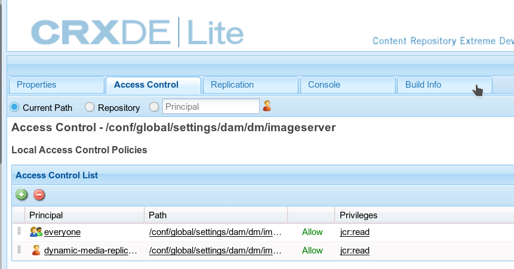

# 配置Dynamic Media — 混合模式 {#configuring-dynamic-media-hybrid-mode}

Dynamic Media混合型必須啟用和配置以供使用。 根據你的用例，Dynamic Media [支援的配置](#supported-dynamic-media-configurations)。

>[!NOTE]
>
>如果要在Scene7運行模式下配置和運行Dynamic Media，請參閱 [配置Dynamic Media-Scene7模式](/help/assets/config-dms7.md)。
>
>如果要在混合運行模式下配置和運行Dynamic Media，請按照本頁上的說明進行操作。

瞭解有關使用的更多資訊 [視頻](/help/assets/video.md) 在Dynamic Media。

>[!NOTE]
>
>如果您使用Adobe Experience Manager設定為不同的環境，如開發、試運行和即時生產環境，請為每個環境配置Dynamic MediaCloud Services。

>[!NOTE]
>
>如果您的Dynamic Media配置有問題，請查看特定於Dynamic Media的日誌檔案。 啟用Dynamic Media時，將自動安裝這些檔案：
>
>* `s7access.log`
>* `ImageServing.log`
>
>它們記錄在 [監視和維護您的Experience Manager實例](/help/sites-deploying/monitoring-and-maintaining.md)。

混合出版和交付是Dynamic Media在Adobe Experience Manager之外的一個核心特徵。 混合發佈允許您從雲而不是從Experience Manager發佈節點提供Dynamic Media資產，如影像、集和視頻。

其他內容，如Dynamic Media查看器、網站頁面和靜態內容，繼續從Experience Manager發佈節點提供。

如果您是Dynamic Media的客戶，則需要將混合交付作為所有Dynamic Media內容的交付機制。

## 用於視頻的混合發佈體系結構 {#hybrid-publishing-architecture-for-videos}


## 用於影像的混合發佈結構 {#hybrid-publishing-architecture-for-images}


## 支援的Dynamic Media配置 {#supported-dynamic-media-configurations}

以下配置任務參考以下術語：

| **術語** | **Dynamic Media已啟用** | **說明** |
|---|---|---|
| Experience Manager作者節點 | 綠色圓中的白色複選標籤 | 您部署到本地或通過Managed Services的作者節點。 |
| Experience Manager發佈節點 | 紅方的白色X。 | 您部署到本地或通過Managed Services的發佈節點。 |
| 映像服務發佈節點 | 綠色圓圈中的白色複選標籤。 | 您在由Adobe管理的資料中心上運行的發佈節點。 引用影像服務URL。 |

您可以選擇只為成像、只為視頻或為成像和視頻實施Dynamic Media。 要確定為特定方案配置Dynamic Media的步驟，請參閱下表。

<table>
 <tbody>
  <tr>
   <td><strong>方案</strong></td>
   <td ><strong>工作原理</strong></td>
   <td><strong>配置步驟</strong></td>
  </tr>
  <tr>
   <td>在生產中僅提供映像</td>
   <td>映像通過Adobe全球資料中心中的伺服器提供，然後由CDN快取，以實現可擴展的效能和全球範圍。</td>
   <td>
    <ol>
     <li>論Experience Manager <strong>作者</strong> 節點， <a href="#enabling-dynamic-media">啟用Dynamic Media</a>。</li>
     <li>在中配置映像 <a href="#configuring-dynamic-media-cloud-services">Dynamic MediaCloud Services</a>。</li>
     <li><a href="#configuring-image-replication">配置映像複製</a>。</li>
     <li><a href="#replicating-catalog-settings">複製目錄設定</a>。</li>
     <li><a href="#replicating-viewer-presets">複製查看器預設</a>。</li>
     <li><a href="#using-default-asset-filters-for-replication">使用預設資產篩選器進行複製</a>。</li>
     <li><a href="#configuring-dynamic-media-image-server-settings">配置Dynamic Media映像伺服器設定</a>。</li>
     <li><a href="#delivering-assets">交付資產</a>。</li>
    </ol> </td>
  </tr>
  <tr>
   <td>在預生產（開發、QE、階段等）中僅提供映像。</td>
   <td>影像通過Experience Manager發佈節點傳送。 在此情形中，由於流量極小，因此不需要將映像傳送到Adobe的資料中心。 而且它允許在產品發佈前安全預覽內容。</td>
   <td>
    <ol>
     <li>論Experience Manager <strong>作者</strong> 節點， <a href="#enabling-dynamic-media">啟用Dynamic Media</a>。</li>
     <li>論Experience Manager <strong>發佈</strong> 節點， <a href="#enabling-dynamic-media">啟用Dynamic Media</a>。</li>
     <li><a href="#replicating-viewer-presets">複製查看器預設</a>。</li>
     <li>設定 <a href="#setting-up-asset-filters-for-imaging-in-non-production-deployments">用於非生產影像的資產篩選器</a>。</li>
     <li><a href="#configuring-dynamic-media-image-server-settings">配置Dynamic Media映像伺服器設定。</a></li>
     <li><a href="#delivering-assets">交付資產。</a></li>
    </ol> </td>
  </tr>
  <tr>
   <td>在任何環境（生產、開發、QE、階段等）中僅提供ONLY視頻</td>
   <td>視頻由CDN提供和快取，以實現可擴展的效能和全球範圍。 視頻海報影像（在播放開始之前顯示的視頻縮略圖）由Experience Manager發佈實例傳送。</td>
   <td>
    <ol>
     <li>論Experience Manager <strong>作者</strong> 節點， <a href="#enabling-dynamic-media">啟用Dynamic Media</a>。</li>
     <li>論Experience Manager <strong>發佈</strong> 節點， <a href="#enabling-dynamic-media">啟用Dynamic Media</a> （發佈實例提供視頻海報影像並提供視頻播放的元資料）。</li>
     <li>在中配置視頻 <a href="#configuring-dynamic-media-cloud-services">Dynamic MediaCloud Services。</a></li>
     <li><a href="#replicating-viewer-presets">複製查看器預設</a>。</li>
     <li>設定 <a href="#setting-up-asset-filters-for-video-only-deployments">僅視頻的資產篩選器</a>。</li>
     <li><a href="#delivering-assets">交付資產。</a></li>
    </ol> </td>
  </tr>
  <tr>
   <td>在生產中同時提供影像和視頻</td>
   <td><p>視頻由CDN提供和快取，以實現可擴展的效能和全球範圍。 影像和視頻海報影像通過Adobe全球資料中心的伺服器提供，然後由CDN快取，以實現可擴展的效能和全球範圍。</p> <p>請參閱前幾節以在預製作中設定影像或視頻。 </p> </td>
   <td>
    <ol>
     <li>論Experience Manager <strong>作者</strong> 節點， <a href="#enabling-dynamic-media">啟用Dynamic Media</a>。</li>
     <li>在中配置視頻 <a href="#configuring-dynamic-media-cloud-services">Dynamic MediaCloud Services。</a></li>
     <li>在中配置映像 <a href="#configuring-dynamic-media-cloud-services">Dynamic MediaCloud Services。</a></li>
     <li><a href="#configuring-image-replication">配置映像複製</a>。</li>
     <li><a href="#replicating-catalog-settings">複製目錄設定</a>。</li>
     <li><a href="#replicating-viewer-presets">複製查看器預設</a>。</li>
     <li><a href="#using-default-asset-filters-for-replication">使用預設資產篩選器進行複製。</a></li>
     <li><a href="#configuring-dynamic-media-image-server-settings">配置Dynamic Media映像伺服器設定。</a></li>
     <li><a href="#delivering-assets">交付資產。</a></li>
    </ol> </td>
  </tr>
 </tbody>
</table>

## 啟用Dynamic Media {#enabling-dynamic-media}

[Dynamic Media](https://business.adobe.com/products/experience-manager/assets/dynamic-media.html) 預設情況下為禁用。 要利用Dynamic Media功能，必須使用 `dynamicmedia` 運行模式，例如， `publish` 運行模式。 啟用前，請確保查看 [技術要求](/help/sites-deploying/technical-requirements.md#requirements-for-aem-dynamic-media-add-on)。

>[!NOTE]
>
>通過運行模式啟用Dynamic Media將取代Experience Manager6.1和Experience Manager6.0中的功能，在該Dynamic Media中，通過設定 `dynamicMediaEnabled` 標籤 **[!UICONTROL 真]**。 此標誌在Experience Manager6.2及更高版本中沒有功能。 此外，您不需要重新啟動快速啟動以啟用Dynamic Media。

通過啟用Dynamic Media,UI中提供Dynamic Media功能，每個上傳的映像資產都接收 *cqdam.pyrabid.tiff* 用於快速傳遞動態影像格式副本的格式副本。 這些PTIFF具有以下顯著優勢：

* 僅管理單個主源映像並即時生成無限格式副本而無需任何其他儲存的能力。
* 使用互動式可視化（如縮放、平移和旋轉）的能力。

如果要在Experience Manager中使用Dynamic Media Classic，請勿啟用Dynamic Media，除非您使用 [特定方案](/help/sites-administering/scene7.md#aem-scene-integration-versus-dynamic-media)。 除非您通過運行模式啟用Dynamic Media，否則Dynamic Media將被禁用。

要啟用Dynamic Media，必須從命令行或快速啟動檔案名啟用Dynamic Media運行模式。

**要啟用Dynamic Media:**

1. 在命令行上，啟動快速啟動時，執行以下操作：

   * 添加 `-r dynamicmedia` 到命令行末尾。

   ```shellsession {.line-numbers}
   java -Xmx4096m -Doak.queryLimitInMemory=500000 -Doak.queryLimitReads=500000 -jar cq-quickstart-6.5.0.jar -r dynamicmedia
   ```

   如果要發佈到s7delivery，則還必須包括以下trustStore參數：

   ```shellsession {.line-numbers}
   -Djavax.net.ssl.trustStore=<absoluteFilePath>/customerTrustStoreFileName>
   
    -Djavax.net.ssl.trustStorePassword=<passwordForTrustStoreFile>
   ```

1. 請求 `https://localhost:4502/is/image` 並確保映像伺服器正在運行。

   >[!NOTE]
   >
   >要解決Dynamic Media的問題，請參閱 `crx-quickstart/logs/` 目錄：
   >
   >* ImageServer -&lt;portid>-&lt;yyyy>&lt;mm>&lt;dd>.log - ImageServer日誌提供用於分析內部ImageServer進程行為的統計資訊和分析資訊。

   映像伺服器日誌檔案名示例： `ImageServer-57346-2020-07-25.log`
   * s7訪問&lt;yyyy>&lt;mm>&lt;dd>.log - s7access日誌記錄通過以下方式向Dynamic Media發出的每個請求 `/is/image` 和 `/is/content`。

   這些日誌僅在啟用Dynamic Media時使用。 它們不包括在 **下載完整** 從 `system/console/status-Bundlelist` 頁面；在呼叫客戶支援(如果您有Dynamic Media問題)時，請將這兩個日誌都追加到問題上。

### 如果已將Experience Manager安裝到其他埠或上下文路徑…… {#if-you-installed-aem-to-a-different-port-or-context-path}

如果要部署 [Experience Manager到應用程式伺服器](/help/sites-deploying/application-server-install.md) 啟用Dynamic Media後，必須配置 **自域** 的子菜單。 否則，資產的縮略圖生成對Dynamic Media資產不能正常工作。

此外，如果在不同的埠或上下文路徑上運行快速啟動，還必須更改 **自域**。

啟用Dynamic Media後，將使用Dynamic Media生成影像資產的靜態縮略圖格式副本。 要使縮略圖生成在Dynamic Media正常工作，Experience Manager必須對自身執行URL請求，並且必須同時知道埠號和上下文路徑。

在Experience Manager:

* 的 **自域** 的 [外部化器](/help/sites-developing/externalizer.md) 用於檢索埠號和上下文路徑。
* 否 **自域** 已配置，從Jetty HTTP服務檢索埠號和上下文路徑。

在Experience ManagerQuickStart WAR部署中，無法派生埠號和上下文路徑，因此必須配置 **自域**。 請參閱 [外部化程式文檔](/help/sites-developing/externalizer.md) 如何配置 **自域**。

>[!NOTE]
在 [Experience Manager快速入門單機部署](/help/sites-deploying/deploy.md)的 **自域** 通常不需要配置，因為可以自動配置埠號和上下文路徑。 但是，如果所有網路介面都已關閉，則必須配置 **自域**。

## 禁用Dynamic Media  {#disabling-dynamic-media}

Dynamic Media在預設情況下未啟用。 但是，如果您以前啟用了Dynamic Media，則可以稍後將其關閉。

要在啟用Dynamic Media後禁用它，請刪除 `-r dynamicmedia` 運行模式標誌。

**禁用Dynamic Media:**

1. 在命令行上，啟動快速啟動時，可以執行以下任一操作：

   * 不添加 `-r dynamicmedia` 命令行。

   ```shellsession {.line-numbers}
   java -Xmx4096m -Doak.queryLimitInMemory=500000 -Doak.queryLimitReads=500000 -jar cq-quickstart-6.5.0.jar
   ```

1. 請求 `https://localhost:4502/is/image`。 您收到一條消息，說Dynamic Media已禁用。

   >[!NOTE]
   禁用Dynamic Media運行模式後，生成 `cqdam.pyramid.tiff` 格式副本會自動跳過。 它還禁用動態格式副本支援和其他Dynamic Media功能。
   另請注意，在配置Experience Manager伺服器後禁用了Dynamic Media運行模式時，在該運行模式下上載的所有資產現在都無效。

## （可選）將Dynamic Media預設和配置從6.3遷移到6.5零停機時間 {#optional-migrating-dynamic-media-presets-and-configurations-from-to-zero-downtime}

如果您正在升級Experience Manager-Dynamic Media從6.3升級到6.5（現在包括零停機部署的功能），則必須運行以下curl命令。 命令將所有預設和配置從 `/etc` 至 `/conf` CRXDE Lite。

>[!NOTE]
如果您在相容模式下運行Experience Manager實例，則無需運行這些命令。

對於所有升級，無論是否具有相容性軟體包，您都可以通過運行以下Linux® curl命令來複製Dynamic Media最初附帶的預設現成查看器預設：

`curl -u admin:admin -X POST https://<server_address>:<server_port>/libs/settings/dam/dm/presets/viewer.pushviewerpresets.json`

遷移您從中建立的任何自定義查看器預設和配置 `/etc` 至 `/conf`，運行以下Linux® curl命令：

`curl -u admin:admin -X POST https://<server_address>:<server_port>/libs/settings/dam/dm/presets.migratedmcontent.json`

## 配置映像複製 {#configuring-image-replication}

Dynamic Media影像交付工作是通過從Experience Manager作者發佈包括視頻縮略圖在內的影像資產，並將其複製到Adobe的按需複製服務（複製服務URL）。 然後通過按需影像傳送服務（影像服務URL）來傳送資產。

請執行下列動作：

1. [設定身份驗證](#setting-up-authentication)。
1. [配置複製代理](#configuring-the-replication-agent)。

複製代理將發佈Dynamic Media資產，如影像、視頻元資料，並將其設定到由Adobe承載的映像服務。 預設情況下未啟用複製代理。

配置複製代理後，必須 [驗證並test已成功設定](#validating-the-replication-agent-for-dynamic-media)。 本節介紹這些過程。

>[!NOTE]
建立PTIFF的預設記憶體限制在所有工作流中為3 GB。 例如，您可以在暫停其他工作流時處理一個需要3 GB記憶體的映像，也可以並行處理10個每個需要300 MB記憶體的映像。
所述儲存器限制是可配置的，並且適合於系統資源可用性和正在處理的影像內容的類型。 如果系統上有許多大型資產並且有足夠的記憶體，則可以增加此限制以確保並行處理影像。
要求超過最大記憶體限制的映像被拒絕。
要更改PTIFF建立的記憶體限制，請導航至 **[!UICONTROL 工具]** > **[!UICONTROL 操作]** > **[!UICONTROL Web控制台]** > **[!UICONTROL Adobe CQScene7PTiffManager]** 然後改變 **[!UICONTROL 最大記憶體]** 值。

### 設定身份驗證 {#setting-up-authentication}

在作者上設定複製身份驗證，以便您可以將映像複製到Dynamic Media映像交付服務。 您首先獲取KeyStore，然後將其保存在 **[!UICONTROL 動態媒體複製]** 並配置。 您的公司管理員在預配過程中收到了一封包含KeyStore檔案和必要憑據的歡迎電子郵件。 如果您未收到此資訊，請與Adobe客戶支援聯繫。

**設定身份驗證：**

1. 如果您尚未擁有KeyStore檔案和密碼，請聯繫Adobe客戶支援。 此資訊是置備的必要部分。 它將密鑰與你的帳戶關聯。

1. 在Experience Manager中，選擇Experience Manager徽標以訪問全局導航控制台，然後導航至 **[!UICONTROL 工具]** > **[!UICONTROL 安全]** > **[!UICONTROL 用戶]**。

1. 在「用戶管理」頁上，導航到 **[!UICONTROL 動態媒體複製]** ，然後選擇開啟。

   

1. 在「編輯動態媒體複製的用戶設定」頁中，選擇 **[!UICONTROL 密鑰庫]** ，然後選擇 **[!UICONTROL 建立密鑰儲存]**。

   

1. 輸入密碼並在 **[!UICONTROL 設定KeyStore訪問密碼]** 對話框。

   >[!NOTE]
   記住密碼，因為以後配置複製代理時必須再次輸入密碼。

   

1. 在 **[!UICONTROL 編輯動態媒體複製的用戶設定]** ，展開 **從KeyStore檔案添加私鑰** 區域並添加以下內容（請參閱下面的影像）:

   * 在 **[!UICONTROL 新建別名]** 欄位，輸入稍後要在複製配置中使用的別名的名稱。 例如，您可以 `replication` 化名。
   * 選擇 **[!UICONTROL 密鑰儲存檔案]**。 導航到按Adobe提供給您的KeyStore檔案，選擇它，然後選擇 **[!UICONTROL 開啟]**。
   * 在 **[!UICONTROL KeyStore檔案密碼]** 欄位中，輸入KeyStore檔案密碼。 此密碼為 **不** 在步驟5中建立的KeyStore密碼，但是是在設定期間發送給您的歡迎電子郵件中提供的KeyStore檔案密碼Adobe。 如果您未收到KeyStore檔案密碼，請與Adobe客戶支援聯繫。
   * 在 **[!UICONTROL 私鑰密碼]** 欄位中，輸入私鑰密碼（可以是上一步中提供的相同私鑰密碼）。 Adobe在預配期間向您發送的歡迎電子郵件中提供私鑰密碼。 如果您未收到私鑰密碼，請與Adobe客戶支援聯繫。
   * 在 **[!UICONTROL 私鑰別名]** 欄位，輸入私鑰別名。 比如說， `*companyname*-alias`。 Adobe在預配期間向您發送的歡迎電子郵件中提供私鑰別名。 如果您未收到私鑰別名，請與Adobe客戶支援聯繫。

   

1. 選擇 **[!UICONTROL 保存並關閉]** 保存對此用戶所做的更改。

   接下來，你必須 [配置複製代理](#configuring-the-replication-agent)。

### 配置複製代理 {#configuring-the-replication-agent}

1. 在Experience Manager中，選擇Experience Manager徽標以訪問全局導航控制台，然後導航至 **[!UICONTROL 工具]** > **[!UICONTROL 部署]** > **[!UICONTROL 複製]** > **[!UICONTROL 作者代理]**。
1. 在「作者上的代理」頁上，選擇 **[!UICONTROL Dynamic Media混合映像複製（s7交付）]**。
1. 選取&#x200B;**[!UICONTROL 編輯]**。
1. 選擇 **[!UICONTROL 設定]** ，然後輸入以下內容：

   * **[!UICONTROL 已啟用]**  — 選中此複選框以啟用複製代理。
   * **[!UICONTROL 區域]**  — 設定到相應區域：北美、歐洲或亞洲
   * **[!UICONTROL 租戶ID]**  — 此值是正在發佈到複製服務的公司/租戶的名稱。 此值是Adobe在預配期間向您發送的歡迎電子郵件中提供的租戶ID。 如果您未收到此資訊，請與Adobe客戶支援聯繫。
   * **[!UICONTROL 密鑰儲存別名]**  — 此值與 **新建別名** 在中生成鍵時設定的值 [設定身份驗證](#setting-up-authentication);比如說， `replication`。 (請參閱中的第7步 [設定身份驗證](#setting-up-authentication)。)
   * **[!UICONTROL 密鑰儲存密碼]**  — 點擊時建立的KeyStore密碼 **[!UICONTROL 建立密鑰儲存]**。 Adobe不提供此密碼。 請參閱第5步，共 [設定身份驗證](#setting-up-authentication)。

   下圖顯示了包含示例資料的複製代理：

   

1. 選擇 **[!UICONTROL 確定]**。

### 驗證Dynamic Media的複製代理 {#validating-the-replication-agent-for-dynamic-media}

要驗證Dynamic Media的複製代理，請執行以下操作：

選擇 **[!UICONTROL Test連接]**。 輸出示例如下：

```shell
11.03.2016 10:57:55 - Transferring content for ReplicationAction{type=TEST, path[0]='/content/dam', time=1457722675402, userId='admin', revision='null'}
11.03.2016 10:57:55 - * Auth User: replication-receiver
11.03.2016 10:57:55 - * HTTP Version: 1.1
11.03.2016 10:57:55 - * Using OAuth 2.0 Authorization Grants
11.03.2016 10:57:55 - * OAuth 2.0 User: dynamic-media-replication
11.03.2016 10:57:55 - * OAuth 2.0 Token: '*****' initialized
11.03.2016 10:57:55 - Publishing: POST[https://replicate-na.assetsadobe.com:8580/is-publish/publish-receiver?Cmd=Test&RootId=xfpuu-6613]
11.03.2016 10:57:55 - Publish response: OK[]
11.03.2016 10:57:55 - Transfer succeeded in 141 ms for ReplicationAction{type=TEST, path[0]='/content/dam', time=1457722675402, userId='admin', revision='null'}
-------------------------------------------------------------------------------------------------------------------------------
Replication test succeeded
```

>[!NOTE]
也可以通過執行以下操作之一來檢查：
* 檢查複製日誌以確保複製了資產。
* 發佈影像。 選擇影像並選擇 **[!UICONTROL 查看者]** 在下拉菜單中，選擇查看器預設。 選擇 **[!UICONTROL URL]**。 要驗證您是否可以查看影像，請在瀏覽器中複製並貼上URL路徑。
>


### 排除驗證故障 {#troubleshooting-authentication}

在設定身份驗證時，您可能會遇到一些與其解決方案一起遇到的問題。 在檢查這些問題之前，請確保已設定複製。

#### 問題：HTTP狀態代碼401，帶消息 — 需要授權 {#problem-http-status-code-with-message-authorization-required}

此問題可能是由於未能為 `dynamic-media-replication` 。

```shell
Replication test to s7delivery:https://s7bern.macromedia.com:8580/is-publish/
17.06.2016 18:54:43 - Transferring content for ReplicationAction{type=TEST, path[0]='/content/dam', time=1466214883309, userId='admin', revision='null'}
17.06.2016 18:54:43 - * Auth User: replication-receiver
17.06.2016 18:54:43 - * HTTP Version: 1.1
17.06.2016 18:54:43 - * Using OAuth 2.0 Authorization Grants
17.06.2016 18:54:43 - * OAuth 2.0 User: dynamic-media-replication
17.06.2016 18:54:43 - No OAuth token available. OAuth not initialized
17.06.2016 18:54:43 - * Using Client Auth SSL alias - replication-alias *
17.06.2016 18:54:43 - Publishing: POST[https://<localhost>:8580/is-publish//publish-receiver?Cmd=Test&RootId=brough]
17.06.2016 18:54:43 - Transfer failed for ReplicationAction{type=TEST, path[0]='/content/dam', time=1466214883309, userId='admin', revision='null'}. java.io.IOException: Failed to execute request
'https://<localhost>:8580/is-publish//publish-receiver?Cmd=Test&RootId=brough':
 Server returned status code 401 with message: Authorization required.
17.06.2016 18:54:43 - Error while replicating: com.day.cq.replication.ReplicationException: Transfer failed for ReplicationAction{type=TEST, path[0]='/content/dam', time=1466214883309,
 userId='admin', revision='null'}. java.io.IOException: Failed to execute request
'https://<localhost>:8580/is-publish//publish-receiver?Cmd=Test&RootId=brough':
 Server returned status code 401 with message: Authorization required.
```

**解決方案：**
檢查 `KeyStore` 已保存到 **動態媒體複製** 提供正確的密碼。

#### 問題：無法解密密鑰 — 無法解密資料 {#problem-could-not-decrypt-key-could-not-decrypt-data}

```xml
Replication test to s7delivery:https://<localhost>:8580/is-publish/
17.06.2016 19:00:16 - Transferring content for ReplicationAction{type=TEST, path[0]='/content/dam', time=1466215216662, userId='admin', revision='null'}
17.06.2016 19:00:16 - * Auth User: replication-receiver
17.06.2016 19:00:16 - * HTTP Version: 1.1
17.06.2016 19:00:16 - * Using OAuth 2.0 Authorization Grants
17.06.2016 19:00:16 - * OAuth 2.0 User: dynamic-media-replication
17.06.2016 19:00:16 - No OAuth token available. OAuth not initialized
17.06.2016 19:00:16 - * Using Client Auth SSL alias - replication-alias *
17.06.2016 19:00:16 - Transfer failed for ReplicationAction{type=TEST, path[0]='/content/dam', time=1466215216662, userId='admin', revision='null'}. java.lang.SecurityException: java.security.UnrecoverableKeyException: Could not decrypt key: Could not decrypt data.
```

**解決方案：**
檢查密碼。 在複製代理中保存的密碼與用於建立密鑰庫的密碼不同。

#### 問題：InvalidAlgorithmParameterException {#problem-invalidalgorithmparameterexception}

此問題是由Experience Manager作者實例中的配置錯誤引起的。 作者上的Java™進程未獲得正確的 `javax.net.ssl.trustStore`。 在複製日誌中看到以下錯誤：

```shell
14.04.2016 09:37:43 - Transfer failed for ReplicationAction{type=TEST, path[0]='/content/dam', time=1460651862089, userId='admin', revision='null'}. java.io.IOException: Failed to execute request 'https://<localhost>:8580/is-publish/publish-receiver?Cmd=Test&RootId=rbrough-osx2': java.lang.RuntimeException: Unexpected error: java.security.InvalidAlgorithmParameterException: the trustAnchors parameter must be non-empty
14.04.2016 09:37:43 - Error while replicating: com.day.cq.replication.ReplicationException: Transfer failed for ReplicationAction{type=TEST, path[0]='/content/dam', time=1460651862089, userId='admin', revision='null'}. java.io.IOException: Failed to execute request 'https://<localhost>:8580/is-publish/publish-receiver?Cmd=Test&RootId=rbrough-osx2': java.lang.RuntimeException: Unexpected error: java.security.InvalidAlgorithmParameterException: the trustAnchors parameter must be non-empty
```

或錯誤日誌：

```shell
07.25.2019 12:00:59.893 *ERROR* [sling-threadpool-db2763bb-bc50-4bb5-bb64-10a09f432712-(apache-sling-job-thread-pool)-90-com_day_cq_replication_job_s7delivery(com/day/cq/replication/job/s7delivery)] com.day.cq.replication.Agent.s7delivery.queue Error during processing of replication.

java.io.IOException: Failed to execute request 'https://replicate-na.assetsadobe.com:8580/is-publish/publish-receiver?Cmd=Test&RootId=rbrough-osx': java.lang.RuntimeException: Unexpected error: java.security.InvalidAlgorithmParameterException: the trustAnchors parameter must be non-empty
        at com.scene7.is.catalog.service.publish.atomic.PublishingServiceHttp.executePost(PublishingServiceHttp.scala:195)
```

**解決方案：**
確保Experience Manager作者上的Java™進程具有system屬性 `-Djavax.net.ssl.trustStore=` 設定為有效的信任儲存。

#### 問題：KeyStore未設定或未初始化 {#problem-keystore-is-either-not-set-up-or-it-is-not-initialized}

此問題可能是由熱修復程式或覆蓋動態媒體用戶或密鑰庫節點的功能包引起的。

複製日誌示例：

```shell
Replication test to s7delivery:https://replicate-na.assetsadobe.com/is-publish
02.08.2016 14:37:44 - Transferring content for ReplicationAction{type=TEST, path[0]='/content/dam', time=1470173864834, userId='admin', revision='null'}
02.08.2016 14:37:44 - * Auth User: replication-receiver
02.08.2016 14:37:44 - * HTTP Version: 1.1
02.08.2016 14:37:44 - * Using OAuth 2.0 Authorization Grants
02.08.2016 14:37:44 - * OAuth 2.0 User: dynamic-media-replication
02.08.2016 14:37:44 - Transfer failed for ReplicationAction{type=TEST, path[0]='/content/dam', time=1470173864834, userId='admin', revision='null'}. com.adobe.granite.keystore.KeyStoreNotInitialisedException: Uninitialised key store for user dynamic-media-replication
```

**解決方案:**

1. 導航到「用戶管理」頁：
   `localhost:4502/libs/granite/security/content/useradmin.html`
1. 在「用戶管理」頁上，導航到 `dynamic-media-replication` ，然後選擇開啟。
1. 選擇 **[!UICONTROL 密鑰儲存]** 頁籤。 如果 **[!UICONTROL 建立密鑰儲存]** 按鈕，則必須重做 [設定身份驗證](#setting-up-authentication) 早些。
1. 如果必須重做KeyStore設定，則必須 [配置複製代理](/help/assets/config-dynamic.md#configuring-the-replication-agent) 同樣。

   重新配置s7交付複製代理。
   `localhost:4502/etc/replication/agents.author/s7delivery.html`

1. 選擇 **[!UICONTROL Test連接]** 以便您驗證配置是否有效。

#### 問題：發佈代理正在使用SSL而不是OAuth {#problem-publish-agent-is-using-ssl-instead-of-oauth}

此問題可能是由於修補程式或功能包安裝不正確或覆蓋了設定所致。

複製日誌示例：

```shell
01.08.2016 18:42:59 - Transferring content for ReplicationAction{type=TEST, path[0]='/content/dam', time=1470073379634, userId='admin', revision='null'}
01.08.2016 18:42:59 - * Auth User: replication-receiver
01.08.2016 18:42:59 - * HTTP Version: 1.1
01.08.2016 18:42:59 - * Using Client Auth SSL alias - replication-receiver *
01.08.2016 18:42:59 - Publishing: POST[https://replicate-eu.assetsadobe2.com:443/is-publish/publish-receiver?Cmd=Test&RootId=altayerstaging]
01.08.2016 18:42:59 - Transfer failed for ReplicationAction{type=TEST, path[0]='/content/dam', time=1470073379634, userId='admin', revision='null'}. java.io.IOException: Failed to execute request 'https://replicate-eu.assetsadobe2.com:443/is-publish/publish-receiver?Cmd=Test&RootId=rbroughstaging': Server returned status code 401 with message: Authorization required.
01.08.2016 18:42:59 - Error while replicating: com.day.cq.replication.ReplicationException: Transfer failed for ReplicationAction{type=TEST, path[0]='/content/dam', time=1470073379634, userId='admin', revision='null'}. java.io.IOException: Failed to execute request 'https://replicate-eu.assetsadobe2.com:443/is-publish/publish-receiver?Cmd=Test&RootId=rbroughstaging': Server returned status code 401 with message: Authorization required.
```

**解決方案:**

1. 在Experience Manager中，導航到 **[!UICONTROL 工具]** > **[!UICONTROL 常規]** > **[!UICONTROL CRXDE Lite]**。

   `localhost:4502/crx/de/index.jsp`

1. 導航到s7交付複製代理節點。
   `localhost:4502/crx/de/index.jsp#/etc/replication/agents.author/s7delivery/jcr:content`

1. 將此設定添加到複製代理（值設定為的布爾值） **[!UICONTROL 真]**):

   `enableOauth=true`

1. 在頁面左上角附近，選擇 **[!UICONTROL 全部保存]**。

### Test配置 {#testing-your-configuration}

Adobe建議您對配置執行端到端test。

確保在開始此test之前已執行以下操作：

* 添加的影像預設。
* 配置 **[!UICONTROL Dynamic Media配置（6.3之前版）]** Cloud Services。 此test需要映像服務URL

**要test配置：**

1. 上載影像資產。 (在資產中，導航至 **[!UICONTROL 建立]** > **[!UICONTROL 檔案]** 並選擇檔案。)
1. 等待工作流完成。
1. 發佈影像資產。 (選擇資產並選擇 **[!UICONTROL 快速發佈]**。)
1. 通過開啟影像並點擊，導航到該影像的格式副本 **[!UICONTROL 格式副本]**。

   

1. 選擇任何動態格式副本。
1. 要獲取此資產的URL，請選擇 **[!UICONTROL URL]**。
1. 導航到選定的URL並檢查影像是否按預期行為。

test已交付資產的另一種方法是將req=exists附加到URL。

## 配置Dynamic MediaCloud Services {#configuring-dynamic-media-cloud-services}

Dynamic MediaCloud Service支援影像和視頻、視頻分析和視頻編碼等的混合發佈和交付。

作為配置的一部分，必須輸入註冊ID、視頻服務URL、影像服務URL、複製服務URL並設定身份驗證。 此資訊已通過電子郵件發送給您，作為帳戶設定過程的一部分。 如果您未收到此資訊，請與Adobe Experience Manager管理員或Adobe客戶支援聯繫以獲取此資訊。

>[!NOTE]
在設定Dynamic MediaCloud Services之前，請確保已設定發佈實例。 配置Dynamic MediaCloud Services之前，還必須設定複製。

**配置Dynamic MediaCloud Services:**

1. 在Experience Manager中，選擇Experience Manager徽標以訪問全局導航控制台，然後導航至 **[!UICONTROL 工具]** > **[!UICONTROL Cloud Services]** > **[!UICONTROL Dynamic Media配置（6.3之前版）]**。
1. 在「Dynamic Media配置瀏覽器」頁面的左窗格中，選擇 **[!UICONTROL 全球]**，然後選擇 **[!UICONTROL 建立]**。
1. 在 **[!UICONTROL 建立Dynamic Media配置]** 對話框，鍵入標題。
1. 如果你要配置Dynamic Media的視頻，

   * 在 **[!UICONTROL 註冊ID]** 鍵入註冊ID。
   * 在 **[!UICONTROL 視頻服務URL]** 欄位，輸入Dynamic Media網關的視頻服務URL。

1. 如果要配置Dynamic Media進行映像，請在 **[!UICONTROL 影像服務URL]** 欄位，輸入Dynamic Media網關的映像服務URL。
1. 選擇 **[!UICONTROL 保存]** 返回「Dynamic Media配置瀏覽器」頁。
1. 要訪問全局導航控制台，請選擇Experience Manager徽標。

## 配置視頻報告 {#configuring-video-reporting}

您可以使用Dynamic Media混合技術配置多個Experience Manager安裝的視頻報告。

**何時使用：** 在配置Dynamic Media配置（6.3之前版本）時，啟動了許多功能，包括視頻報告。 該配置在區域分析公司中建立報告套件。 如果配置了多個「作者」節點，則為每個節點建立一個單獨的報告套件。 因此，在安裝之間報告資料不一致。 此外，如果每個「作者」節點都引用了同一個混合發佈伺服器，則上次「作者」安裝會更改所有視頻報告的目標報告套件。 此問題使用過多的報告套件超載分析系統。

**開始：** 通過完成以下三項任務配置視頻報告。

1. 在第一個「作者」節點上配置Dynamic Media配置（6.3之前版本）後，建立視頻分析預設包。 此初始任務很重要，因為它允許新配置繼續使用同一報告套件。
1. 將視頻分析預設包安裝到任何 ***新*** 「作者」節點 ***先*** 配置Dynamic Media配置（6.3之前版本）。
1. 驗證並調試軟體包安裝。

### 在配置第一個「作者」節點後建立視頻分析預設包 {#creating-a-video-analytics-preset-package-after-configuring-the-first-author-node}

完成此任務後，將有一個包含視頻分析預設的包檔案。 這些預設包含報表套件、跟蹤伺服器、跟蹤命名空間和Experience Cloud組織ID（如果可用）。

1. 如果尚未配置Dynamic Media配置（6.3之前版本）。
1. （可選）查看和複製報表套件ID（您必須具有對JCR的訪問權限）。 雖然不需要報表套件ID，但它使驗證更加容易。
1. 使用包管理器建立包。
1. 編輯包以包含篩選器。

   在Experience Manager: `/conf/global/settings/dam/dm/presets/analytics/jcr:content/userdata`

1. 生成包。
1. 下載或共用視頻分析預設包，以便與後續的新作者節點共用。

### 在配置更多「作者」節點之前，請安裝視頻分析預設包 {#installing-the-video-analytics-preset-package-before-you-configure-additional-author-nodes}

確保完成此任務 ***先*** 配置Dynamic Media配置（6.3之前版本）。 如果無法執行此操作，則會建立另一個未使用的報告套件。 此外，即使視頻報告繼續正常工作，資料收集仍未優化。

確保在新的「作者」節點上可以訪問第一個「作者」節點中的「視頻分析」預設包。

1. 將先前建立的視頻分析預設包上載到包管理器。
1. 安裝視頻分析預設包。
1. 配置Dynamic Media配置（6.3之前版本）。

### 驗證並調試軟體包安裝 {#verifying-and-debugging-the-package-installation}

1. 執行下列任一操作以驗證並調試軟體包安裝：

   * **通過JCR檢查視頻分析預設**
要通過JCR檢查「視頻分析」預設，您必須具有CRXDE Lite。

      Experience Manager — 在CRXDE Lite中，導航到 `/conf/global/settings/dam/dm/presets/analytics/jcr:content/userdata`

      與 `https://localhost:4502/crx/de/index.jsp#/conf/global/settings/dam/dm/presets/analytics/jcr%3Acontent/userdata`

      如果您無權訪問「作者」節點上的CRXDE Lite，則可以通過「發佈」伺服器檢查預設。

   * **通過影像伺服器檢查視頻分析預設**

      通過發出影像伺服器req=userdata請求，可以直接驗證視頻分析預設。
例如，要查看「作者」節點上的「分析」預設，可以發出以下請求：

      `https://localhost:4502/is/image/conf/global/settings/dam/dm/presets/analytics?req=userdata`

      要驗證發佈伺服器上的預設，可以向發佈伺服器發出類似的直接請求。 「作者」和「發佈」節點上的響應相同。 響應如下所示：

      ```
      marketingCloudOrgId=0FC4E86B573F99CC7F000101
       reportSuite=aemaem6397618-2018-05-23
       trackingNamespace=aemvideodal
       trackingServer=aemvideodal.d2.sc.omtrdc.net
      ```

   * **通過Experience Manager中的視頻報告工具檢查視頻分析預設**
導航到 **[!UICONTROL 工具]** > **[!UICONTROL 資產]** > **[!UICONTROL 視頻報告]**

      `https://localhost:4502/mnt/overlay/dam/gui/content/s7dam/videoreports/videoreport.html`

      如果看到以下錯誤消息，則報告套件可用，但未填充。 在系統收集任何資料之前，在新安裝中，此錯誤是正確的，也是需要的。
   

   要生成報告資料，請上載和發佈一個視頻。 使用 **[!UICONTROL 複製URL]** 並至少播放一次視頻。

   從視頻查看器使用情況填充報告資料可能需要12小時。

   如果出現錯誤，且未正確設定報告套件，則顯示以下警報。

   

   如果在配置Dynamic Media配置（6.3之前）服務之前運行視頻報告，則還會顯示此錯誤。

### 診斷視頻報告配置 {#troubleshooting-the-video-reporting-configuration}

* 在安裝過程中，有時與Analytics API伺服器的連接超時。 安裝將重試20次連接，但仍然失敗。 出現這種情況時，日誌檔案會記錄多個錯誤。 搜尋 `SiteCatalystReportService`.
* 不先安裝分析預設包可能會導致建立新報告套件。
* 從6.3Experience Manager升級到6.4Experience Manager或6.4.1Experience Manager，然後配置Dynamic Media配置（6.3之前版本），仍然會建立報告套件。 此問題已知，並將針對Experience Manager6.4.2解決。

### 關於視頻分析預設 {#about-the-video-analytics-preset}

「視頻分析」預設（有時簡稱為「分析」預設）儲存在Dynamic Media的「查看器」預設旁邊。 它與查看器預設基本相同，但包含用於配置AppMeasurement和Video Heartbaet報告的資訊。

預設的屬性如下：

* `reportSuite`
* `trackingServer`
* `trackingNamespace`
* `marketingCloudOrgId` (舊Experience Manager中不存在)

Experience Manager6.4和更高版本將此預設保存在 `/conf/global/settings/dam/dm/presets/analytics/jcr:content/userdata`

## 複製目錄設定 {#replicating-catalog-settings}

通過JCR將您自己的預設目錄設定作為安裝過程的一部分發佈。 要複製目錄設定：

1. 在「終端」窗口中，運行以下命令：

   `curl -u admin:admin localhost:4502/libs/settings/dam/dm/presets/viewer.pushviewerpresets`

1. 在Experience Manager中，導航到CRXDE Lite中的以下位置（需要管理員權限）:

   `https://<*server*>:<*port*>/crx/de/index.jsp#/conf/global/settings/dam/dm/imageserver/`

1. 選擇 **[!UICONTROL 複製]** 頁籤。
1. 選擇 **[!UICONTROL 複製]**。

## 複製查看器預設 {#replicating-viewer-presets}

交付 *使用查看器預設的資產，必須複製/發佈* 查看器預設。 (必須激活所有查看器預設 *和* 已複製以獲取資產的URL或嵌入代碼。
請參閱 [發佈查看器預設](/help/assets/managing-viewer-presets.md#publishing-viewer-presets) 的子菜單。

>[!NOTE]
預設情況下，當您選擇 **[!UICONTROL 格式副本]** 當您選擇 **[!UICONTROL 查看者]** 的子菜單。 可以增加或減少所看到的數量。 請參閱 [增加顯示的影像預設數](/help/assets/managing-image-presets.md#increasing-or-decreasing-the-number-of-image-presets-that-display) 或 [增加顯示的查看器預設數](/help/assets/managing-viewer-presets.md#increasing-the-number-of-viewer-presets-that-display)。

## 篩選複製資產 {#filtering-assets-for-replication}

在非Dynamic Media部署中，您可以複製 *全部* 從Experience Manager作者環境到Experience Manager發佈節點的資產（影像和視頻）。 此工作流是必需的，因為Experience Manager發佈伺服器也會傳遞資產。

但是，在Dynamic Media部署中，由於資產通過雲傳輸，因此不需要將這些資產複製到Experience Manager發佈節點。 這樣的「混合發佈」工作流避免了額外的儲存成本和複製資產所需的較長處理時間。 其他內容，如Dynamic Media查看器、網站頁面和靜態內容，繼續從Experience Manager發佈節點提供。

除複製資產外，還複製下列非資產：

* Dynamic Media交付配置： `/conf/global/settings/dam/dm/imageserver/jcr:content`
* 影像預設集: `/conf/global/settings/dam/dm/presets/macros`
* 檢視器預設集: `/conf/global/settings/dam/dm/presets/viewer`

過濾器為您提供了 *排除* 將資產複製到Experience Manager發佈節點。

### 使用預設資產篩選器進行複製 {#using-default-asset-filters-for-replication}

如果在生產中使用Dynamic Media進行(1)成像 *或* (2)成像和視頻，然後可以使用Adobe提供的預設濾鏡。 預設情況下，以下篩選器處於活動狀態：

<table>
 <tbody>
  <tr>
   <td> </td>
   <td><strong>篩選</strong></td>
   <td><strong>Mime類型</strong></td>
   <td><strong>轉譯</strong></td>
  </tr>
  <tr>
   <td>Dynamic Media影像傳遞</td>
   <td><p>濾波影像</p> <p>過濾集</p> <p> </p> </td>
   <td><p>開始於 <strong>影像/</strong></p> <p>包含 <strong>應用程式/</strong> 結尾 <strong>集</strong>。</p> </td>
   <td>現成的「濾鏡影像」（適用於單個影像資產，包括互動式影像）和「濾鏡集」（適用於旋轉集、影像集、混合媒體集和旋轉盤集）將：
    <ul>
     <li>包括PTIFF影像和用於複製的元資料(任何格式副本以 <strong>卡克丹</strong>)。</li>
     <li>從複製中排除原始影像和靜態影像格式副本。</li>
    </ul> </td>
  </tr>
  <tr>
   <td>Dynamic Media視頻傳送</td>
   <td>濾視</td>
   <td>開始於 <strong>視頻/</strong></td>
   <td>現成的「濾鏡視頻」將：
    <ul>
     <li>包括代理視頻格式副本、視頻縮略圖/海報影像、元資料（父視頻格式副本和視頻格式副本）以進行複製(任何格式副本以 <strong>卡克丹</strong>)。</li>
     <li>從複製中排除原始視頻和靜態縮略圖格式副本。<br /> <br /> <strong>注：</strong> 代理視頻格式副本不包含二進位檔案，而只是節點屬性。 因此，對發佈伺服器儲存庫大小沒有影響。</li>
    </ul> </td>
  </tr>
  <tr>
   <td>Dynamic Media Classic(Scene7)一體化</td>
   <td><p>濾波影像</p> <p>過濾集</p> <p>濾視</p> </td>
   <td><p>開始於 <strong>影像/</strong></p> <p>包含 <strong>應用程式/</strong> 結尾 <strong>集</strong>。</p> <p>開始於 <strong>視頻/</strong></p> </td>
   <td><p>您將傳輸URI配置為指向Experience Manager發佈伺服器，而不是AdobeDynamic Media雲複製服務URL。 設定此篩選器可讓Dynamic Media Classic傳遞資產，而不是Experience Manager發佈實例。</p> <p>現成的「filter-images」、「filter-sets」和「filter-video」將：</p>
    <ul>
     <li>包括PTIFF影像、代理視頻格式副本和用於複製的元資料。 但是，由於JCR中不存在這些Experience Manager—Dynamic Media Classic整合 — 它實際上什麼也做不了。</li>
     <li>從複製中排除原始影像、靜態影像格式副本、原始視頻和靜態縮略圖格式副本。 相反，Dynamic Media Classic提供影像和視頻資產。</li>
    </ul> </td>
  </tr>
 </tbody>
</table>

>[!NOTE]
篩選器應用於MIME類型，且不能特定於路徑。

### 為僅視頻部署設定資產篩選器 {#setting-up-asset-filters-for-video-only-deployments}

如果您將Dynamic Media僅用於視頻，請按照以下步驟設定資產篩選器以進行複製：

1. 在Experience Manager中，選擇Experience Manager徽標以訪問全局導航控制台，然後導航至 **[!UICONTROL 工具]** > **[!UICONTROL 部署]** > **[!UICONTROL 複製]** > **[!UICONTROL 作者代理]**。
1. 在「作者上的代理」頁上，選擇 **[!UICONTROL 預設代理（發佈）]**。
1. 選取&#x200B;**[!UICONTROL 編輯]**。
1. 在 **[!UICONTROL 代理設定]** 對話框 **[!UICONTROL 設定]** 頁籤 **[!UICONTROL 已啟用]** 來啟動探員。
1. 選擇 **[!UICONTROL 確定]**。
1. 在Experience Manager中，導航到 **[!UICONTROL 工具]** > **[!UICONTROL 常規]** > **[!UICONTROL CRXDE Lite]**。
1. 在左資料夾樹中，導航到 `/etc/replication/agents.author/dynamic_media_replication/jcr:content/damRenditionFilters`
1. 定位 **[!UICONTROL 濾視]**，然後選擇 **[!UICONTROL 複製]**。
1. 在左資料夾樹中，導航到 `/etc/replication/agents.author/publish`
1. 定位 `jcr:content`，然後選擇 **[!UICONTROL 貼上]**。

這些步驟設定Experience Manager發佈實例以傳送播放所需的視頻海報影像和視頻元資料，而視頻本身由Dynamic MediaCloud Service傳送。 篩選器還從複製中排除原始視頻和靜態縮略圖格式副本，這些格式副本在發佈實例中不需要。

### 為非生產部署中的映像設定資產篩選器 {#setting-up-asset-filters-for-imaging-in-non-production-deployments}

如果在非生產部署中使用Dynamic Media進行映像，請按照以下步驟設定資產篩選器以進行複製：

1. 在Experience Manager中，選擇Experience Manager徽標以訪問全局導航控制台，然後導航至 **[!UICONTROL 工具]** > **[!UICONTROL 部署]** > **[!UICONTROL 複製]** > **[!UICONTROL 作者代理]**。
1. 在「作者上的代理」頁上，選擇 **[!UICONTROL 預設代理（發佈）]**。
1. 選取&#x200B;**[!UICONTROL 編輯]**。
1. 在 **[!UICONTROL 代理設定]** 對話框 **[!UICONTROL 設定]** 頁籤 **[!UICONTROL 已啟用]** 來啟動探員。
1. 選擇 **[!UICONTROL 確定]**。
1. 在Experience Manager中，導航到 **[!UICONTROL 工具]** > **[!UICONTROL 常規]** > **[!UICONTROL CRXDE Lite]**。
1. 在左資料夾樹中，導航到 `/etc/replication/agents.author/dynamic_media_replication/jcr:content/damRenditionFilters`

   

1. 定位 **[!UICONTROL 濾波影像]**，然後選擇 **[!UICONTROL 複製]**。
1. 在左資料夾樹中，導航到 `/etc/replication/agents.author/publish`
1. 定位 `jcr:content`，按一下右鍵它，然後轉到 **[!UICONTROL 建立]** > **[!UICONTROL 建立節點]**。 輸入名稱 `damRenditionFilters` 類型 `nt:unstructured`。
1. 定位 `damRenditionFilters`，然後選擇 **[!UICONTROL 貼上]**。

這些步驟設定Experience Manager發佈實例，以將映像傳送到非生產環境。 篩選器還從複製中排除原始影像和靜態格式副本，這在發佈實例上是不需要的。

>[!NOTE]
如果作者中有許多不同的篩選器，則每個代理需要為其分配一個不同的用戶。 花崗岩代碼強制實施每用戶一個過濾器模型。 每個篩選器設定始終有不同的用戶。
您是否在伺服器上使用多個篩選器？ 例如，一個用於要發佈的複製的篩選器，另一個用於s7交付的篩選器。 如果是，則必須確保這兩個篩選器具有不同的 **用戶ID** 分配給他們的 `jcr:content` 的下界。 請參閱以下影像：


### 自定義複製的資產篩選器（可選） {#customizing-asset-filters-for-replication}

1. 在Experience Manager中，選擇Experience Manager徽標以訪問全局導航控制台，然後導航至 **[!UICONTROL 工具]** > **[!UICONTROL 常規]** > **[!UICONTROL CRXDE Lite]**。
1. 在左資料夾樹中，導航到 `/etc/replication/agents.author/dynamic_media_replication/jcr:content/damRenditionFilters` 來查看篩選器。

   

1. 要定義篩選器的Mime類型，可以按如下方式查找Mime類型：

   在左滑軌中，展開 `content > dam > <locate_your_asset> >  jcr:content > metadata` 然後在表格中 `dc:format`。

   下圖是資產路徑的示例 `dc:format`。

   

   請注意 `dc:format` 為資產 `Fiji Red.jpg` 是 `image/jpeg`。

   要使此篩選器應用於所有影像，而不管其格式如何，請將值設定為 `image/*` 何處 `*` 是應用於任何格式的所有影像的規則運算式。

   要使篩選器僅應用於類型JPEG的影像，請輸入 `image/jpeg`。

1. 定義要包括或排除複製的格式副本。

   可用於篩選複製的字元包括：

   | 要使用的字元 | 它如何篩選資產以進行複製 |
   | --- | --- |
   | `*` | 萬用字元 |
   | `+` | 包括用於複製的資產 |
   | `-` | 從複製中排除資產 |

   導覽至 `content/dam/<locate your asset>/jcr:content/renditions`。

   下圖是資產格式副本的示例。

   

   使用上面的示例，如果只想複製PTIFF(金字塔TIFF)，則將輸入 `+cqdam,*` 包括以 `cqdam`。 在示例中，該格式副本 `cqdam.pyramid.tiff`。

   如果您只想複製原件，則 `+original`。

## 配置Dynamic Media映像伺服器設定 {#configuring-dynamic-media-image-server-settings}

配置Dynamic Media映像伺服器涉及編輯Adobe CQScene7映像伺服器捆綁包和Adobe CQScene7平台伺服器捆綁包。

>[!NOTE]
Dynamic Media的設計 [啟用後](#enabling-dynamic-media)。 但是，您可以選擇通過配置Dynamic Media映像伺服器來滿足特定規格或要求來微調安裝。

**先決條件** - *之前* 配置Dynamic Media映像伺服器，確保Windows®的虛擬機包括安裝Microsoft® Visual C++庫。 運行Dynamic Media映像伺服器需要這些庫。 你可以 [下載Microsoft® Visual C++ 2010可再發行軟體包(x64)](https://www.microsoft.com/en-us/download/details.aspx?id=26999)。

配置Dynamic Media映像伺服器設定：

1. 在Experience Manager的左上角，選擇 **[!UICONTROL Adobe Experience Manager]** 訪問全局導航控制台，然後導航至 **[!UICONTROL 工具]** > **[!UICONTROL 操作]** > **[!UICONTROL Web控制台]**。
1. 在「Adobe Experience ManagerWeb控制台配置」頁上，轉至 **[!UICONTROL OSGi]** > **[!UICONTROL 配置]** 列出當前在Experience Manager中運行的所有包。

   Dynamic Media交付伺服器在清單中以下名稱下找到：

   * `Adobe CQ Scene7 ImageServer`
   * `Adobe CQ Scene7 PlatformServer`

1. 在捆綁包清單中，在Adobe CQScene7ImageServer右側，選擇 **[!UICONTROL 編輯]** 表徵圖
1. 在Adobe CQScene7ImageServer對話框中，設定以下配置值：

   >[!NOTE]
   通常，不需要更改預設值。 但是，如果確實更改了預設值，則必須重新啟動束才能使更改生效。

   | 屬性 | 預設值 | 說明 |
   | --- | --- | --- |
   | `TcpPort.name` | *`empty`* | 用於與ImageServer進程通信的埠號。 預設情況下，會自動檢測到空閒埠。 |
   | `AllowRemoteAccess.name` | *`empty`* | 允許或禁止遠程訪問ImageServer進程。 如果為false，則映像伺服器僅偵聽本地主機。<br> 指向本地主機的預設外部化程式設定必須指定特定VM實例的實際域或IP地址。 原因是本地主機指向虛擬機的父系統。<br>VM的域或IP地址必須具有主機檔案條目，以便它能夠自行解析。 |
   | `MaxRenderRgnPixels` | 16兆帕 | 所呈現的最大大小（百萬像素）。 |
   | `MaxMessageSize` | 16 MB | 傳遞的最大消息大小(MB)。 |
   | `RandomAccessUrlTimeout` | 20 | 超時值，用於映像伺服器等待JCR響應範圍內的平鋪請求的時間（秒）。 |
   | `WorkerThreads` | 10 | 工作線程數。 |

1. 選取&#x200B;**[!UICONTROL 儲存]**。
1. 在捆綁包清單中，在Adobe CQScene7平台伺服器右側，選擇 **[!UICONTROL 編輯]** 表徵圖
1. 在「Adobe CQScene7平台伺服器」對話框中，設定以下預設值選項：

   >[!NOTE]
   Dynamic Media映像伺服器使用其自己的磁碟快取來快取響應。 Experience ManagerHTTP快取和Dispatcher不能用於快取來自Dynamic Media映像伺服器的響應。

   | 屬性 | 預設值 | 說明 |
   |---|---|---|
   | 已啟用快取 | 已核取 | 是否啟用響應快取 |
   | 快取根 | cache | 響應快取資料夾的一個或多個路徑。 相對路徑根據內部s7映像包資料夾進行解析。 |
   | 快取最大大小 | 200000000 | 響應快取的最大大小（以位元組為單位）。 |
   | 快取最大條目數 | 100000 | 快取中允許的最大條目數。 |

### 預設清單設定 {#default-manifest-settings}

預設清單允許您配置用於生成Dynamic Media傳遞響應的預設值。 您可以微調質量(JPEG質量、解析度、重採樣模式)、快取（過期），並防止渲染太大的影像(defaultpix、defaultthumbix、maxpix)。

預設清單配置的位置取自 **[!UICONTROL 目錄根]** 預設值 **[!UICONTROL Adobe CQScene7平台伺服器]** 捆綁。 預設情況下，此值位於以下路徑中 **[!UICONTROL 工具]** > **[!UICONTROL 常規]** > **[!UICONTROL CRXDE Lite]**

`/conf/global/settings/dam/dm/imageserver/`


您可以通過輸入新值來更改屬性的值，如下表所述。

更改完預設清單後，在頁面左上角，選擇 **[!UICONTROL 全部保存]**。

確保選擇 **[!UICONTROL 訪問控制]** 頁籤（位於「屬性」頁籤的右側），然後將訪問控制權限設定為 `jcr:read` 和動態媒體複製用戶。



清單設定及其預設值表：

| 屬性 | 預設值 | 說明 |
| --- | --- | --- |
| `bkgcolor` | `FFFFFF` | 預設背景顏色. RGB值，用於填充不包含實際影像資料的回復影像的任何區域。 另請參閱 [Bkg顏色](https://experienceleague.adobe.com/docs/dynamic-media-developer-resources/image-serving-api/image-serving-api/attributes/r-bkgcolor.html#image-serving-api) 的上界。 |
| `defaultpix` | `300,300` | 預設檢視大小. 如果請求未使用wid=、hei=或scl=顯式指定視圖大小，則伺服器將回復影像限制為不大於此寬度和高度。<br>指定為兩個整數，0或更大，用逗號分隔。 寬度和高度（以像素為單位）。 可以將其中一個或兩個值設定為0以保持它們不受約束。 不適用於嵌套/嵌入式請求。<br>另請參閱 [預設影像](https://experienceleague.adobe.com/docs/dynamic-media-developer-resources/image-serving-api/image-serving-api/attributes/r-defaultpix.html#image-serving-api) 的上界。<br>但通常，您使用查看器預設或影像預設來傳遞資產。 Defaultpix僅應用於未使用查看器預設或影像預設的資產。 |
| `defaultthumbpix` | `100,100` | 預設縮圖大小. 用於縮略圖請求（而非屬性：:DefaultPix）`req=tmb`)。<br>伺服器將回復影像限制為不大於此寬度和高度。 如果縮略圖請求(`req=tmb`)不顯式指定大小，也不顯式指定視圖大小 `wid=`。 `hei=`或 `scl=`。<br>指定為兩個整數，0或更大，用逗號分隔。 寬度和高度（以像素為單位）。 可以將其中一個或兩個值設定為0以保持它們不受約束。<br>不適用於嵌套/嵌入式請求。<br>另請參閱 [DefaultThumbPix](https://experienceleague.adobe.com/docs/dynamic-media-developer-resources/image-serving-api/image-serving-api/attributes/r-defaultthumbpix.html#image-serving-api) 的上界。 |
| `expiration` | `36000000` | 預設客戶端快取的生存時間。 如果特定目錄記錄不包含有效的目錄：:Expiration值，則提供預設的過期間隔。<br>實數，0或更大。 自生成回復資料以來到期為止的毫秒數。 設定為0時，始終立即使回復映像過期，這將有效地禁用客戶端快取。 預設情況下，此值設定為10小時，這意味著如果發佈新映像，則舊映像離開用戶的快取需要10小時。 如果您需要盡快清除快取，請與客戶支援聯繫。<br>另請參閱 [到期](https://experienceleague.adobe.com/docs/dynamic-media-developer-resources/image-serving-api/image-serving-api/attributes/r-expiration.html) 的上界。 |
| `jpegquality` | `80` | 預設JPEG編碼屬性。 指定JPEG回復影像的預設屬性。<br>整數數字和標誌，以逗號分隔。 第一個值在1.100範圍內，並定義質量。 對於正常行為，第二個值可以是0，或者是1，以禁用RGB編碼器使用的JPEG色度下採樣。<br>另請參閱 [Jpeg質量](https://experienceleague.adobe.com/docs/dynamic-media-developer-resources/image-serving-api/image-serving-api/attributes/r-jpegquality.html#image-serving-api) 的上界。 |
| `maxpix` | `2000,2000` | 回覆影像大小限制. 返回給客戶端的最大回復影像寬度和高度。<br>如果請求導致寬度或高度大於屬性：:MaxPix的回復影像，則伺服器將返回錯誤。<br>另請參閱 [最大圖](https://experienceleague.adobe.com/docs/dynamic-media-developer-resources/image-serving-api/image-serving-api/attributes/r-maxpix.html#image-serving-api) 的上界。 |
| `resmode` | `SHARP2` | 預設重新取樣模式. 指定用於縮放影像資料的預設重採樣和插值屬性。<br>使用時間 `resMode=` 未在請求中指定。<br>允許的值包括 `BILIN`。 `BICUB`或 `SHARP2`。<br>枚舉。 設定為2 `bilin`, 3 `bicub`，或4 `sharp2` 插值模式。 使用 `sharp2` 獲得最佳結果。<br>另請參閱 [Res模式](https://experienceleague.adobe.com/docs/dynamic-media-developer-resources/image-serving-api/image-serving-api/attributes/r-is-cat-resmode.html#image-serving-api) 的上界。 |
| `resolution` | `72` | 預設對象解析。 在特定目錄記錄不包含有效目錄：:Resolution值時提供預設對象解析。<br>實數，大於0。 通常以像素/英吋表示，但也可以以其他單位表示，如每米像素。<br>另請參閱 [解決](https://experienceleague.adobe.com/docs/dynamic-media-developer-resources/image-serving-api/image-serving-api/attributes/r-resolution.html#image-serving-api) 的上界。 |
| `thumbnailtime` | `1%,11%,21%,31%,41%,51%,61%,71%,81%,91%` | 這些值表示視頻播放時間的快照，並傳遞給 [編碼.com](https://www.encoding.com/)。 請參閱 [關於視頻縮略圖](/help/assets/video.md#about-video-thumbnails-in-dynamic-media-hybrid-mode) 的子菜單。 |

## 配置Dynamic Media顏色管理 {#configuring-dynamic-media-color-management}

Dynamic Media色彩管理允許您為預覽的正確資產著色。

通過顏色校正，攝取的資產將保留其顏色空間(RGB、CMYK、灰色)和生成的金字塔TIFF格式副本中的嵌入顏色配置檔案。 當您請求動態格式副本時，影像顏色將被更正為目標顏色空間。 在JCR的Dynamic Media發佈設定中配置輸出顏色配置檔案。

Adobe的顏色管理使用ICC（國際顏色聯盟）配置檔案，ICC定義的格式。

可以配置Dynamic Media色彩管理，並使用CMYK、RGB或灰色輸出配置影像預設。 請參閱 [配置影像預設](/help/assets/managing-image-presets.md)。

高級使用案例可以使用手動配置 `icc=` 顯式選擇輸出顏色配置檔案的修飾符：

* `icc` - [https://experienceleague.adobe.com/docs/dynamic-media-developer-resources/image-serving-api/image-serving-api/http-protocol-reference/command-reference/r-icc.html](https://experienceleague.adobe.com/docs/dynamic-media-developer-resources/image-serving-api/image-serving-api/http-protocol-reference/command-reference/r-icc.html)

* `iccEmbed` - [https://experienceleague.adobe.com/docs/dynamic-media-developer-resources/image-serving-api/image-serving-api/http-protocol-reference/command-reference/r-iccembed.html](https://experienceleague.adobe.com/docs/dynamic-media-developer-resources/image-serving-api/image-serving-api/http-protocol-reference/command-reference/r-iccembed.html)

>[!NOTE]
Adobe的顏色配置檔案的標準集僅在您 [軟體分發中的功能包12445](https://experience.adobe.com/#/downloads/content/software-distribution/en/aem.html?package=/content/software-distribution/en/details.html/content/dam/aem/public/adobe/packages/cq630/featurepack/cq-6.3.0-featurepack-12445) 已安裝。 所有功能包和服務包均位於 [軟體分發](https://experience.adobe.com/#/downloads/content/software-distribution/en/aem.html)。 功能包12445提供Adobe的顏色配置檔案。


### 安裝功能包12445 {#installing-feature-pack}

要使用Dynamic Media色彩管理功能，請安裝功能包12445。

**安裝功能包12445:**

1. 導航到 [軟體分發](https://experience.adobe.com/#/downloads/content/software-distribution/en/aem.html) 下載 `cq-6.3.0-featurepack-12445`。

   請參閱 [如何使用包](/help/sites-administering/package-manager.md) 有關使用包的詳細資訊，請參閱 [!DNL Adobe Experience Manager]。

1. 安裝功能包。

### 配置預設顏色配置檔案 {#configuring-the-default-color-profiles}

安裝功能包後，請配置適當的預設顏色配置檔案，以便在請求RGB或CMYK影像資料時啟用顏色校正。

**要配置預設顏色配置檔案，請執行以下操作：**

1. 在 **[!UICONTROL 工具]** > **[!UICONTROL 常規]** > **[!UICONTROL CRXDE Lite]**，導航 `/conf/global/settings/dam/dm/imageserver/jcr:content` 包含預設的Adobe Color配置檔案。

   

1. 通過滾動到 **[!UICONTROL 屬性]** 頁籤。 手動輸入屬性名稱、類型和值，如下表所述。 輸入值後，選擇 **[!UICONTROL 添加]** 然後 **[!UICONTROL 全部保存]** 保存值。

   顏色校正屬性在 **顏色更正屬性** 的子菜單。 可分配給顏色校正屬性的值位於 **顏色配置檔案** 的子菜單。

   例如，在 **[!UICONTROL 名稱]**&#x200B;添加 `iccprofilecmyk`選中 **[!UICONTROL 類型]** `String`，然後添加 `WebCoated` 作為 **[!UICONTROL 值]**。 然後選擇 **[!UICONTROL 添加]** 然後 **[!UICONTROL 全部保存]** 保存值。

   

   **顏色校正屬性表**

<table>
 <tbody>
  <tr>
   <td><strong>屬性</strong></td>
   <td><strong>類型</strong></td>
   <td><strong>預設</strong></td>
   <td><strong>說明</strong></td>
  </tr>
  <tr>
   <td><a href="https://experienceleague.adobe.com/docs/dynamic-media-developer-resources/image-serving-api/image-serving-api/attributes/r-iccprofilergb.html">iccprofilergb</a></td>
   <td>字串</td>
   <td>&lt;empty&gt;</td>
   <td>預設RGB顏色配置檔案的名稱。</td>
  </tr>
  <tr>
   <td><a href="https://experienceleague.adobe.com/docs/dynamic-media-developer-resources/image-serving-api/image-serving-api/attributes/r-iccprofilecmyk.html">肌橋</a></td>
   <td>字串</td>
   <td>&lt;empty&gt;</td>
   <td>預設CMYK顏色配置檔案的名稱。</td>
  </tr>
  <tr>
   <td><a href="https://experienceleague.adobe.com/docs/dynamic-media-developer-resources/image-serving-api/image-serving-api/attributes/r-iccprofilegray.html">影像灰度</a></td>
   <td>字串</td>
   <td>&lt;empty&gt;</td>
   <td>預設灰色配置檔案的名稱。</td>
  </tr>
  <tr>
   <td><a href="https://experienceleague.adobe.com/docs/dynamic-media-developer-resources/image-serving-api/image-serving-api/attributes/r-iccprofilesrcrgb.html">icprofilescrgb</a></td>
   <td>字串</td>
   <td>&lt;empty&gt;</td>
   <td>用於沒有嵌入顏色配置檔案的RGB影像的預設RGB顏色配置檔案的名稱</td>
  </tr>
  <tr>
   <td><a href="https://experienceleague.adobe.com/docs/dynamic-media-developer-resources/image-serving-api/image-serving-api/attributes/r-iccprofilesrccmyk.html">冰球衛星</a></td>
   <td>字串</td>
   <td>&lt;empty&gt;</td>
   <td>用於沒有嵌入顏色配置檔案的CMYK影像的預設CMYK顏色配置檔案的名稱。</td>
  </tr>
  <tr>
   <td><a href="https://experienceleague.adobe.com/docs/dynamic-media-developer-resources/image-serving-api/image-serving-api/attributes/r-iccprofilesrcgray.html">輪廓灰度</a></td>
   <td>字串</td>
   <td>&lt;empty&gt;</td>
   <td>用於沒有嵌入顏色配置檔案的CMYK影像的預設灰色配置檔案的名稱。</td>
  </tr>
  <tr>
   <td><a href="https://experienceleague.adobe.com/docs/dynamic-media-developer-resources/image-serving-api/image-serving-api/attributes/r-iccblackpointcompensation.html">黑點補償</a></td>
   <td>布林值</td>
   <td>True</td>
   <td>指定在顏色校正期間是否執行黑點補償。 Adobe建議開啟此設定。</td>
  </tr>
  <tr>
   <td><a href="https://experienceleague.adobe.com/docs/dynamic-media-developer-resources/image-serving-api/image-serving-api/attributes/r-iccdither.html">抖動</a></td>
   <td>布林值</td>
   <td>False</td>
   <td>指定是否在顏色校正期間進行抖動。</td>
  </tr>
  <tr>
   <td><a href="https://experienceleague.adobe.com/docs/dynamic-media-developer-resources/image-serving-api/image-serving-api/attributes/r-iccrenderintent.html">意圖</a></td>
   <td>字串</td>
   <td>相對值</td>
   <td><p>指定渲染方法。 可接受值為： <strong>感知、相對、飽和、絕對。 </strong><i></i>Adobe建議 <strong>相對 </strong><i></i>。</p> </td>
  </tr>
 </tbody>
</table>

>[!NOTE]
屬性名稱區分大小寫，且必須全部為小寫。

**顏色配置檔案表**

安裝了以下顏色配置檔案：

<table>
 <tbody>
  <tr>
   <th><p>名稱</p> </th>
   <th><p>顏色間距</p> </th>
   <th><p>說明</p> </th>
  </tr>
  <tr>
   <td>Adobe RGB</td>
   <td>RGB</td>
   <td>Adobe RGB(1998)</td>
  </tr>
  <tr>
   <td>AppleRGB</td>
   <td>RGB</td>
   <td>AppleRGB</td>
  </tr>
  <tr>
   <td>CIERGB</td>
   <td>RGB</td>
   <td>CIERGB</td>
  </tr>
  <tr>
   <td>CoatedFogra27</td>
   <td>CMYK</td>
   <td>塗層FOGRA27(ISO 12647-2:2004)</td>
  </tr>
  <tr>
   <td>CoatedFogra39</td>
   <td>CMYK</td>
   <td>塗層FOGRA39(ISO 12647-2:2004)</td>
  </tr>
  <tr>
   <td>塗層格拉科</td>
   <td>CMYK</td>
   <td>塗層GRACoL 2006(ISO 12647-2:2004)</td>
  </tr>
  <tr>
   <td>顏色匹配RGB</td>
   <td>RGB</td>
   <td>顏色匹配RGB</td>
  </tr>
  <tr>
   <td>歐洲ISOC</td>
   <td>CMYK</td>
   <td>歐洲ISO塗層FOGRA27</td>
  </tr>
  <tr>
   <td>塗層歐洲</td>
   <td>CMYK</td>
   <td>V2歐元級</td>
  </tr>
  <tr>
   <td>未塗層歐洲比例</td>
   <td>CMYK</td>
   <td>歐元級無塗層v2</td>
  </tr>
  <tr>
   <td>日本彩色塗層</td>
   <td>CMYK</td>
   <td>2001年日本彩色</td>
  </tr>
  <tr>
   <td>日本彩色報</td>
   <td>CMYK</td>
   <td>《2002年日本彩色報》</td>
  </tr>
  <tr>
   <td>日本顏色未塗層</td>
   <td>CMYK</td>
   <td>2001年日本彩色無塗層</td>
  </tr>
  <tr>
   <td>日本彩色網路塗層</td>
   <td>CMYK</td>
   <td>日本彩色2003網路塗層</td>
  </tr>
  <tr>
   <td>日本網路塗層</td>
   <td>CMYK</td>
   <td>日本Web Cobed（廣告）</td>
  </tr>
  <tr>
   <td>NewsprintSNAP2007</td>
   <td>CMYK</td>
   <td>美國新聞紙(SNAP 2007)</td>
  </tr>
  <tr>
   <td>NTSC</td>
   <td>RGB</td>
   <td>NTSC(1953)</td>
  </tr>
  <tr>
   <td>PAL</td>
   <td>RGB</td>
   <td>PAL/SECAM</td>
  </tr>
  <tr>
   <td>ProPhoto</td>
   <td>RGB</td>
   <td>ProPhotoRGB</td>
  </tr>
  <tr>
   <td>PS4Default</td>
   <td>CMYK</td>
   <td>Photoshop4預設CMYK</td>
  </tr>
  <tr>
   <td>PS5Default</td>
   <td>CMYK</td>
   <td>Photoshop5預設CMYK</td>
  </tr>
  <tr>
   <td>已塗布的單張</td>
   <td>CMYK</td>
   <td>美國單張紙塗布v2</td>
  </tr>
  <tr>
   <td>單張已取消塗布</td>
   <td>CMYK</td>
   <td>美國單張未塗層v2</td>
  </tr>
  <tr>
   <td>SMPTE</td>
   <td>RGB</td>
   <td>SMPTE-C</td>
  </tr>
  <tr>
   <td>sRGB</td>
   <td>RGB</td>
   <td>sRGB IEC61966-2.1</td>
  </tr>
  <tr>
   <td>UncoatedFogra29</td>
   <td>CMYK</td>
   <td>未塗層FOGRA29(ISO 12647-2:2004)</td>
  </tr>
  <tr>
   <td>塗層網</td>
   <td>CMYK</td>
   <td>美國網路塗層(SWOP)v2</td>
  </tr>
  <tr>
   <td>WebCoatedFogra28</td>
   <td>CMYK</td>
   <td>Web Cobided FOGRA28(ISO 12647-2:2004)</td>
  </tr>
  <tr>
   <td>WebCoatedGrade3</td>
   <td>CMYK</td>
   <td>SWOP 2006三級紙</td>
  </tr>
  <tr>
   <td>WebCoatedGrade5</td>
   <td>CMYK</td>
   <td>SWOP 2006五級紙</td>
  </tr>
  <tr>
   <td>未塗層網</td>
   <td>CMYK</td>
   <td>美國網路未塗層v2</td>
  </tr>
  <tr>
   <td>寬色域RGB</td>
   <td>RGB</td>
   <td>寬色域RGB</td>
  </tr>
 </tbody>
</table>

1. 選擇 **[!UICONTROL 全部保存]**。

例如，您可以設定 **[!UICONTROL iccprofilergb]** 至 `sRGB`, **[!UICONTROL 肌橋]** 至 **[!UICONTROL 塗層網]**。

這樣做將執行以下操作：

* 啟用RGB和CMYK影像的顏色校正。
* RGB影像沒有顏色配置檔案，則假定該影像位於 *sRGB* 顏色空間。
* 假定沒有顏色配置檔案的CMYK影像在 *塗層網* 顏色空間。
* 返回RGB輸出的動態格式副本，在*sRGB *顏色空間中返回。
* 返回CMYK輸出的動態格式副本，在 *塗層網* 顏色空間。

## 交付資產 {#delivering-assets}

完成上述所有任務後，將通過影像或視頻服務提供激活的Dynamic Media資產。 在Experience Manager中，此能力顯示在 **[!UICONTROL 複製影像URL]**。 **[!UICONTROL 複製查看器URL]**。 **[!UICONTROL 嵌入查看器代碼]**&#x200B;和WCM。

請參閱 [交付Dynamic Media資產](/help/assets/delivering-dynamic-media-assets.md)。

<table>
 <tbody>
  <tr>
   <td><strong>當你……</strong></td>
   <td><strong>結果</strong></td>
  </tr>
  <tr>
   <td>複製影像URL</td>
   <td><p>「複製URL」對話框顯示類似於以下內容的URL（URL僅用於演示）:</p> <p><code>https://IMAGESERVICEPUBLISHNODE/is/image/content/dam/path/to/Image.jpg?$preset$</code></p> <p>位置 <code>IMAGESERVICEPUBLISHNODE</code> 引用映像服務URL。</p> <p>另請參閱 <a href="/help/assets/delivering-dynamic-media-assets.md">交付Dynamic Media資產</a>。</p> </td>
  </tr>
  <tr>
   <td>複製查看器URL</td>
   <td><p>「複製URL」對話框顯示與以下內容類似的URL（URL僅用於演示）:</p> <p><code>https://PUBLISHNODE/etc/dam/viewers/s7viewers/html5/BasicZoomViewer.html?asset=/content/dam/path/to/Image.jpg&amp;config=/conf/global/settings/dam/dm/presets/viewer/Zoom_dark&amp;serverUrl=https://IMAGESERVICEPUBLISHNODE/is/image/&amp;contentRoot=%2F</code></p> <p>位置 <code>PUBLISHNODE</code> 引用常規Experience Manager發佈節點和 <code>IMAGESERVICEPUBLISHNODE</code> 引用映像服務URL。</p> <p>另請參閱 <a href="/help/assets/delivering-dynamic-media-assets.md">交付Dynamic Media資產</a>。</p> </td>
  </tr>
  <tr>
   <td>複製查看器的嵌入代碼</td>
   <td><p>「複製嵌入代碼」對話框顯示與以下內容類似的代碼段（代碼示例僅用於演示）:</p> <p><code class="code">&lt;style type="text/css"&gt;
       #s7basiczoom_div.s7basiczoomviewer{
       width:100%;
       height:auto;
       }
       &lt;/style&gt;
       &lt;script
       type="text/javascript" src="https://PUBLISHNODE/etc/dam/viewers/s7viewers/html5/js/BasicZoomViewer.js"&gt;&lt;/script&gt;
       &lt;div id="s7basiczoom_div"&gt;&lt;/div&gt;
       &lt;script type="text/javascript"&gt;
       var s7basiczoomviewer = new s7viewers.BasicZoomViewer({
       "containerId" : "s7basiczoom_div",
       "params" : {
       "serverurl" : "https://IMAGESERVICEPUBLISHNODE/is/image/",
       "contenturl" : "https://PUBLISHNODE/",
       "config" : "/conf/global/settings/dam/dm/presets/viewer/Zoom_dark",
       "asset" : "/content/dam/path/to/Image.jpg" }
       }).init();
       &lt;/script&gt;</code></p> <p>位置 <code>PUBLISHNODE</code> 引用常規Experience Manager發佈節點和 <code>IMAGESERVICEPUBLISHNODE</code> 引用映像服務URL。</p> <p>另請參閱 <a href="/help/assets/delivering-dynamic-media-assets.md">交付Dynamic Media資產</a>。</p> </td>
  </tr>
 </tbody>
</table>

### WCMDynamic Media和互動式媒體元件 {#wcm-dynamic-media-and-interactive-media-components}

引用Dynamic Media和Interactive Media元件的WCM頁面引用交付服務。
