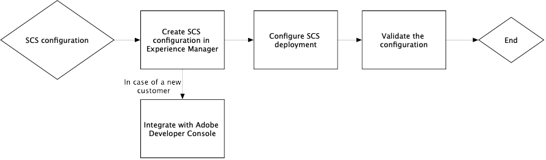

# 針對OAuth憑證的智慧標籤進行疑難排解 {#oauth-config}

需要開啟的授權設定，才能接受對[!DNL Adobe Experience Manager]應用程式的同意，以安全的方式與智慧內容服務互動。

>[!NOTE]
>
> 從2024年6月起，您無法建立新的JWT憑證。 此後，只會建立OAuth伺服器對伺服器認證。
> JWT整合僅對現有AMS和內部部署使用者持續運作至2025年1月。

## 新AMS使用者的OAuth設定 {#oauth-config-existing-ams-users}

如需新使用者的OAuth服務組態，請參考[智慧內容服務組態](#integrate-adobe-io)。 完成後，請依照這些[步驟](#prereqs-config-oauth-onprem)執行。

>[!NOTE]
>
>如有需要，您可以在[支援程式](https://experienceleague.adobe.com/zh-hant?lang=en&amp;support-tab=home#support)之後提交支援票證。

## 現有AMS使用者的OAuth設定 {#oauth-config-new-ams-users}

在執行此方法中的任何步驟之前，您必須先實作下列專案：

### 先決條件 {#prereqs-config-oauth-onprem}

OAuth設定需要下列先決條件：

* 在[Developer Console](https://developer.adobe.com/console/user/servicesandapis)中建立新的OAuth整合。 在下列步驟中使用`ClientID`、`ClientSecret`、`OrgID`和其他屬性：
* 下列檔案可在此路徑`/apps/system/config in crx/de`找到：
   * `com.adobe.granite.auth.oauth.accesstoken.provider.<randomnumbers>.config`
   * `com.adobe.granite.auth.ims.impl.IMSAccessTokenRequestCustomizerImpl.<randomnumber>.config`

### 現有AMS和On Prem使用者的OAuth設定 {#steps-config-oauth-onprem}

下列步驟可由系統管理員在&#x200B;**CRXDE**&#x200B;中執行。 AMS客戶可依照[支援程式](https://experienceleague.adobe.com/zh-hant?lang=en&amp;support-tab=home#support)，聯絡Adobe代表或提交支援票證。

1. 在`com.adobe.granite.auth.oauth.accesstoken.provider.<randomnumbers>.config`中新增或更新以下屬性：

   * `auth.token.provider.authorization.grants="client_credentials"`
   * `auth.token.provider.orgId="<OrgID>"`
   * `auth.token.provider.default.claims=("\"iss\"\ :\ \"<OrgID>\"")`
   * `auth.token.provider.scope="read_pc.dma_smart_content,\ openid,\ AdobeID,\ additional_info.projectedProductContext"`

     `auth.token.validator.type="adobe-ims-similaritysearch"`
   * 以新OAuth設定的使用者端識別碼更新`auth.token.provider.client.id`。
   * 將`auth.access.token.request`更新為`"https://ims-na1.adobelogin.com/ims/token/v3"`
1. 將檔案重新命名為`com.adobe.granite.auth.oauth.accesstoken.provider-<randomnumber>.config`。

   >[!IMPORTANT]
   >
   >以連字型大小(-)取代點(.)作為`<randomnumber>`的前置詞。

1. 在`com.adobe.granite.auth.ims.impl.IMSAccessTokenRequestCustomizerImpl.<randomnumber>.config`中執行以下步驟：
   * 透過新的OAuth整合，使用使用者端密碼更新auth.ims.client.secret屬性。
   * 將檔案重新命名為`com.adobe.granite.auth.ims.impl.IMSAccessTokenRequestCustomizerImpl-<randomnumber>.config`
1. 儲存內容存放庫開發主控台中的所有變更，例如CRXDE。
<!--
1. Navigate to `/system/console/configMgr` and replace the OSGi configuration from `.<randomnumber>` to `-<randomnumber>`.
1. Delete the old OSGi configuration for `"Access Token provider name: adobe-ims-similaritysearch"` in `/system/console/configMgr`.
-->
1. 在`System/console/configMgr`中，您可以同時看到舊組態檔和新組態檔。 刪除`com.adobe.granite.auth.ims.impl.IMSAccessTokenRequestCustomizerImpl`和存取權杖提供者名稱`adobe-ims-similaritysearch`的舊組態。 確保更新的設定僅就緒狀態，而不是舊的設定。
1. 重新啟動主控台。

## 驗證設定 {#validate-the-configuration}

完成設定後，您可以使用JMX MBean來驗證設定。 若要進行驗證，請按照以下步驟操作。

1. 在`https://[aem_server]:[port]`存取您的[!DNL Experience Manager]伺服器。

1. 移至&#x200B;**[!UICONTROL 工具]** > **[!UICONTROL 作業]** > **[!UICONTROL 網頁主控台]**&#x200B;以開啟OSGi主控台。 按一下&#x200B;**[!UICONTROL 主要] > [!UICONTROL JMX]**。

1. 按一下 `com.day.cq.dam.similaritysearch.internal.impl`。它會開啟&#x200B;**[!UICONTROL SimilaritySearch其他任務]**。

1. 按一下 `validateConfigs()`。在&#x200B;**[!UICONTROL 驗證組態]**&#x200B;對話方塊中，按一下&#x200B;**[!UICONTROL 叫用]**。

驗證結果會顯示在相同的對話方塊中。

>[!NOTE]
>
>如果發生`unsupported_grant_type`錯誤，請嘗試安裝Granite Hotfix。 請參閱[從服務帳戶(JWT)移轉至OAuth伺服器對伺服器認證](https://experienceleague.adobe.com/zh-hant/docs/experience-cloud-kcs/kbarticles/ka-24660)。

## 整合Adobe Developer Console {#integrate-adobe-io}

身為新使用者，當您與Adobe Developer Console整合時，[!DNL Experience Manager]伺服器會先透過Adobe Developer Console閘道驗證您的服務認證，再將您的要求轉送至智慧內容服務。 若要整合，您需要具有組織管理員許可權的Adobe ID帳戶，以及已購買並為您的組織啟用的Smart Content Service授權。

若要設定智慧內容服務，請遵循下列最上層步驟：

<!---->

1. 若要產生公開金鑰，請在[!DNL Experience Manager]中[建立Smart Content Service](#oauth-config)設定。 [下載公開憑證](#oauth-config)以進行OAuth整合。

1. *[如果您是現有使用者，則不適用]* [在Adobe Developer Console中建立整合](#create-adobe-i-o-integration)。

1. [使用Adobe Developer Console的API金鑰和其他認證來設定您的部署](#configure-smart-content-service)。

1. [測試設定](#validate-the-configuration)。

## 透過建立智慧內容服務設定來下載公開憑證 {#download-public-certificate}

公開憑證可讓您在Adobe Developer Console上驗證設定檔。

1. 在[!DNL Experience Manager]使用者介面中，存取&#x200B;**[!UICONTROL 工具]** > **[!UICONTROL Cloud Service]** > **[!UICONTROL 舊版Cloud Service]**。

1. 在Cloud Service頁面中，按一下&#x200B;**[!UICONTROL Assets智慧標籤]**&#x200B;底下的&#x200B;**[!UICONTROL 立即設定]**。

1. 在&#x200B;**[!UICONTROL 建立設定]**&#x200B;對話方塊中，指定智慧標籤設定的標題和名稱。 按一下&#x200B;**[!UICONTROL 建立]**。

1. 在&#x200B;**[!UICONTROL AEM Smart Content Service]**&#x200B;對話方塊中，使用以下值：

   **[!UICONTROL 服務URL]**： `https://smartcontent.adobe.io/<region where your Experience Manager author instance is hosted>`

   例如 `https://smartcontent.adobe.io/apac`。您可以將`na`、`emea`或`apac`指定為您的Experience Manager作者執行個體所在的區域。

   >[!NOTE]
   >
   >如果Experience Manager託管服務在2022年9月1日之前布建，請使用以下服務URL：
   >`https://mc.adobe.io/marketingcloud/smartcontent`

   **[!UICONTROL 授權伺服器]**： `https://ims-na1.adobelogin.com`

   其他欄位暫時保留空白（稍後提供）。 按一下&#x200B;**[!UICONTROL 「確定」]**。

   

   *圖：提供內容服務URL的智慧內容服務對話方塊*

   >[!NOTE]
   >
   >提供為[!UICONTROL 服務URL]的URL無法透過瀏覽器存取，且會產生404錯誤。 設定在[!UICONTROL 服務URL]引數的相同值下運作正常。 如需整體服務狀態與維護排程，請參閱[https://status.adobe.com](https://status.adobe.com)。

1. 按一下&#x200B;**[!UICONTROL 下載OAuth整合的公開憑證]**，然後下載公開憑證檔案`AEM-SmartTags.crt`。 此外，您不再需要在Adobe Developer主控台上傳此憑證。

   

   *圖：智慧標籤服務的設定。*

## 建立Adobe Developer Console整合 {#create-adobe-i-o-integration}

若要使用智慧內容服務API，請在Adobe Developer Console中建立整合，以取得[!DNL Experience Manager]中雲端設定的[!UICONTROL Assets智慧標籤服務設定]的[!UICONTROL API金鑰] (產生於Adobe Developer Console整合的[!UICONTROL 使用者端識別碼]欄位中)、[!UICONTROL 技術帳戶識別碼]、[!UICONTROL 組織識別碼]以及[!UICONTROL 使用者端密碼]。

1. 存取瀏覽器中的[https://developer.adobe.com/console/](https://developer.adobe.com/console/)。 選取適當的帳戶，並確認相關聯的組織角色是系統管理員。

1. 以任何所需的名稱建立專案。按一下&#x200B;**[!UICONTROL 「新增 API」]**。

1. 在&#x200B;**[!UICONTROL 新增 API]** 頁面上選取&#x200B;**[!UICONTROL 「Experience Cloud」]**，然後選取&#x200B;**[!UICONTROL 「智慧內容」]**。按一下&#x200B;**[!UICONTROL 下一步]**。

1. 選擇&#x200B;**[!UICONTROL OAuth伺服器對伺服器]**&#x200B;驗證方法。

1. 視需要新增/修改&#x200B;**[!UICONTROL 認證名稱]**。 按一下「**[!UICONTROL 下一步]**」。

1. 選取產品設定檔&#x200B;**[!UICONTROL 智慧內容服務]**。 按一下&#x200B;**[!UICONTROL 儲存設定的API]**。 OAuth API會新增至已連線的認證，以供進一步使用。 您可以複製[!UICONTROL API金鑰（使用者端識別碼）]或[!UICONTROL 從中產生存取權杖]。
<!--
1. On the **[!UICONTROL Select product profiles]** page, select **[!UICONTROL Smart Content Services]**. Click **[!UICONTROL Save configured API]**.

   A page displays more information about the configuration. Keep this page open to copy and add these values in [!UICONTROL Assets Smart Tagging Service Settings] of cloud configuration in [!DNL Experience Manager] to configure smart tags.

   

   *Figure: Details of integration in Adobe Developer Console*
-->

*圖：在Adobe Developer Console中設定的OAuth伺服器對伺服器*

## 設定智慧內容服務 {#configure-smart-content-service}

若要設定整合，請使用Adobe Developer Console整合中的[!UICONTROL 技術帳戶ID]、[!UICONTROL 組織識別碼]、[!UICONTROL 使用者端密碼]和[!UICONTROL 使用者端識別碼]欄位值。 建立智慧標籤雲端設定，可驗證來自[!DNL Experience Manager]部署的API要求。

1. 在[!DNL Experience Manager]中，瀏覽至&#x200B;**[!UICONTROL 工具]** > **[!UICONTROL Cloud Service]** > **[!UICONTROL 舊版Cloud Services]**&#x200B;以開啟[!UICONTROL Cloud Services]主控台。

1. 在&#x200B;**[!UICONTROL Assets智慧標籤]**&#x200B;底下，開啟上方建立的設定。 在服務設定頁面上，按一下&#x200B;**[!UICONTROL 編輯]**。

1. 在「 **[!UICONTROL AEM Smart Content Service]** 」對話方塊中 **[!UICONTROL ，使用「服務URL」和「授權伺服器」欄位的預先填入值]**&#x200B;**&#x200B;** 。

1. 針對欄位[!UICONTROL Api金鑰]、[!UICONTROL 技術帳戶ID]、[!UICONTROL 組織ID]和[!UICONTROL 使用者端密碼]，請複製並使用在[Adobe Developer Console整合](#create-adobe-i-o-integration)中產生的下列值。

   | [!UICONTROL Assets智慧標籤服務設定] | [!DNL Adobe Developer Console]整合欄位 |
   |--- |--- |
   | [!UICONTROL Api金鑰] | [!UICONTROL 使用者端識別碼] |
   | [!UICONTROL 技術帳戶ID] | [!UICONTROL 技術帳戶ID] |
   | [!UICONTROL 組織ID] | [!UICONTROL 組織識別碼] |
   | [!UICONTROL 使用者端密碼] | [!UICONTROL 使用者端密碼] |

>[!MORELIKETHIS]
>
>* [智慧標籤概觀及訓練方式](enhanced-smart-tags.md)
>* [設定智慧標籤](config-smart-tagging.md)
>* [有關智慧標籤的教學影片](https://experienceleague.adobe.com/docs/experience-manager-learn/assets/metadata/image-smart-tags.html?lang=zh-Hant)
