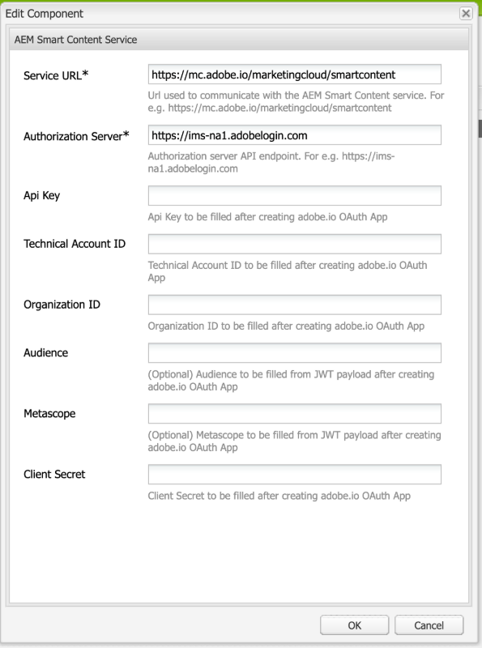
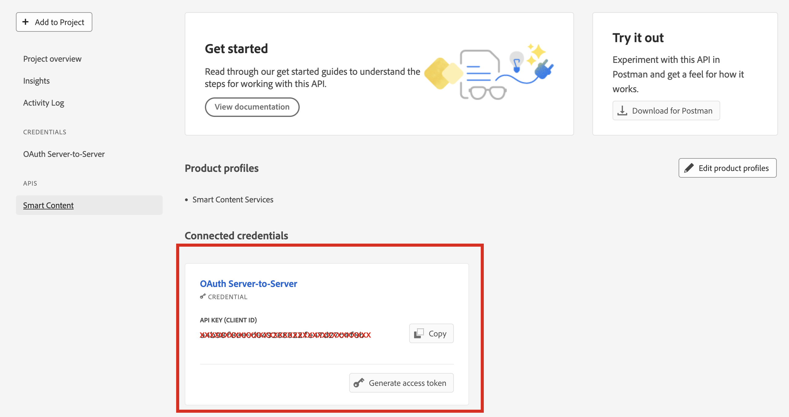

# 針對OAuth憑證的智慧標籤進行疑難排解 {#oauth-config}

需要開啟的授權設定才能將同意採納 [!DNL Adobe Experience Manager] 應用程式，以安全的方式與智慧內容服務互動。

>[!NOTE]
>
> 從2024年6月起，您無法建立新的JWT憑證。 此後，只會建立OAuth伺服器對伺服器認證。
> JWT整合僅對現有AMS和內部部署使用者持續運作至2025年1月。

## 新AMS使用者的OAuth設定 {#oauth-config-existing-ams-users}

請參閱 [智慧內容服務的設定](#integrate-adobe-io) 用於新使用者的OAuth服務設定。 完成後，請遵循以下步驟 [步驟](#prereqs-config-oauth-onprem).

>[!NOTE]
>
>如有需要，您可以依照以下說明提交支援票證 [支援流程](https://experienceleague.adobe.com/?lang=en&amp;support-tab=home#support).

## 現有AMS使用者的OAuth設定 {#oauth-config-new-ams-users}

在執行此方法中的任何步驟之前，您必須先實作下列專案：

### 先決條件 {#prereqs-config-oauth-onprem}

OAuth設定需要下列先決條件：

* 在中建立新的OAuth整合 [開發人員主控台](https://developer.adobe.com/console/user/servicesandapis). 使用 `ClientID`， `ClientSecret`， `OrgID`，以及下列步驟中的其他屬性：
* 下列檔案可在此路徑中找到 `/apps/system/config in crx/de`：
   * `com.**adobe**.granite.auth.oauth.accesstoken.provider.<randomnumbers>.config`
   * `com.adobe.granite.auth.ims.impl.IMSAccessTokenRequestCustomizerImpl.<randomnumber>.config`

### 為內部部署使用者設定OAuth {#steps-config-oauth-onprem}

1. 在中新增或更新以下屬性 `com.adobe.granite.auth.oauth.accesstoken.provider.<randomnumbers>.config`：

   * `auth.token.provider.authorization.grants="client_credentials"`
   * `auth.token.provider.orgId="<OrgID>"`
   * `auth.token.provider.default.claims=("\"iss\"\ :\ \"<OrgID>\"")`
   * `auth.token.provider.scope="read_pc.dma_smart_content,\ openid,\ AdobeID,\ additional_info.projectedProductContext"`
     `auth.token.validator.type="adobe-ims-similaritysearch"`
   * 更新 `auth.token.provider.client.id` 搭配新OAuth設定的使用者端ID。
   * 更新 `auth.access.token.request` 至 `"https://ims-na1.adobelogin.com/ims/token/v3"`
2. 將檔案重新命名為 `com.adobe.granite.auth.oauth.accesstoken.provider-<randomnumber>.config`.
3. 請在中執行以下步驟 `com.adobe.granite.auth.ims.impl.IMSAccessTokenRequestCustomizerImpl.<randomnumber>.config`：
   * 透過新的OAuth整合，使用使用者端密碼更新auth.ims.client.secret屬性。
   * 將檔案重新命名為 `com.adobe.granite.auth.ims.impl.IMSAccessTokenRequestCustomizerImpl-<randomnumber>.config`
4. 儲存內容存放庫開發主控台中的所有變更，例如CRXDE。
5. 瀏覽至 `/system/console/configMgr` 並從取代OSGi設定 `.<randomnumber>` 至 `-<randomnumber>`.
6. 刪除的舊OSGi設定 `"Access Token provider name: adobe-ims-similaritysearch"` 在 `/system/console/configMgr`.
7. 重新啟動主控台。

## 驗證設定 {#validate-the-configuration}

完成設定後，您可以使用JMX MBean來驗證設定。 若要進行驗證，請按照以下步驟操作。

1. 存取您的 [!DNL Experience Manager] 伺服器位置 `https://[aem_server]:[port]`.

1. 前往 **[!UICONTROL 工具]** > **[!UICONTROL 作業]** > **[!UICONTROL 網頁主控台]** 以開啟OSGi主控台。 按一下 **[!UICONTROL 主要] > [!UICONTROL JMX]**.

1. 按一下 `com.day.cq.dam.similaritysearch.internal.impl`。隨即開啟 **[!UICONTROL 相似性搜尋其他任務]**.

1. 按一下 `validateConfigs()`。在 **[!UICONTROL 驗證設定]** 對話方塊，按一下 **[!UICONTROL 叫用]**.

驗證結果會顯示在相同的對話方塊中。

## 整合Adobe Developer主控台 {#integrate-adobe-io}

身為新使用者，當您整合Adobe Developer Console時， [!DNL Experience Manager] 伺服器會先透過Adobe Developer主控台閘道驗證您的服務認證，再將您的要求轉送至智慧內容服務。 若要整合，您需要具有組織管理員許可權的Adobe ID帳戶，以及已購買並為您的組織啟用的Smart Content Service授權。

若要設定智慧內容服務，請遵循下列最上層步驟：

1. 若要產生公開金鑰， [建立智慧內容服務](#obtain-public-certificate) 中的設定 [!DNL Experience Manager]. [下載公開憑證](#obtain-public-certificate) 用於OAuth整合。

1. *[如果您是現有使用者，則不適用]* [在Adobe Developer主控台中建立整合](#create-adobe-i-o-integration).

1. [設定您的部署](#configure-smart-content-service) 從Adobe Developer主控台使用API金鑰和其他認證。

1. [測試設定](#validate-the-configuration)。

## 透過建立智慧內容服務設定來下載公開憑證 {#download-public-certificate}

公開憑證可讓您在Adobe Developer主控台驗證設定檔。

1. 在 [!DNL Experience Manager] 使用者介面，存取 **[!UICONTROL 工具]** > **[!UICONTROL Cloud Service]** > **[!UICONTROL 舊版Cloud Service]**.

1. 在Cloud Service頁面中，按一下 **[!UICONTROL 立即設定]** 在 **[!UICONTROL 資產智慧標籤]**.

1. 在 **[!UICONTROL 建立設定]** 對話方塊，指定智慧標籤設定的標題和名稱。 按一下&#x200B;**[!UICONTROL 建立]**。

1. 在 **[!UICONTROL AEM智慧內容服務]** 對話方塊，請使用下列值：

   **[!UICONTROL 服務URL]**： `https://smartcontent.adobe.io/<region where your Experience Manager author instance is hosted>`

   例如 `https://smartcontent.adobe.io/apac`。您可以指定 `na`， `emea`，或， `apac` 作為託管Experience Manager作者例項的地區。

   >[!NOTE]
   >
   >如果Experience Manager託管服務在2022年9月1日之前布建，請使用以下服務URL：
   >`https://mc.adobe.io/marketingcloud/smartcontent`

   **[!UICONTROL 授權伺服器]**： `https://ims-na1.adobelogin.com`

   其他欄位暫時保留空白（稍後提供）。 按一下&#x200B;**[!UICONTROL 「確定」]**。

   

   *圖：提供內容服務URL的智慧內容服務對話方塊*

   >[!NOTE]
   >
   >提供的URL為 [!UICONTROL 服務URL] 無法透過瀏覽器存取，並產生404錯誤。 若的值相同，則組態運作正常。 [!UICONTROL 服務URL] 引數。 如需整體服務狀態和維護排程，請參閱 [https://status.adobe.com](https://status.adobe.com).

1. 按一下 **[!UICONTROL 下載公開憑證以進行OAuth整合]**，並下載公開憑證檔案 `AEM-SmartTags.crt`. 此外，您不再需要在Adobe開發人員控制檯中上傳此憑證。

   

   *圖：智慧標籤服務的設定。*

## 建立Adobe Developer主控台整合 {#create-adobe-i-o-integration}

若要使用Smart Content Service API，請在Adobe Developer主控台中建立整合，以取得 [!UICONTROL API金鑰] (產生於 [!UICONTROL 使用者端ID] Adobe Developer欄位)， [!UICONTROL 技術帳戶ID]， [!UICONTROL 組織ID]、和 [!UICONTROL 使用者端密碼] 的 [!UICONTROL 資產智慧標籤服務設定] 中的雲端設定 [!DNL Experience Manager].

1. 存取 [https://developer.adobe.com/console/](https://developer.adobe.com/console/) 在瀏覽器中。 選取適當的帳戶，並確認相關聯的組織角色是系統管理員。

1. 以任何所需的名稱建立專案。按一下&#x200B;**[!UICONTROL 「新增 API」]**。

1. 在&#x200B;**[!UICONTROL 新增 API]** 頁面上選取&#x200B;**[!UICONTROL 「Experience Cloud」]**，然後選取&#x200B;**[!UICONTROL 「智慧內容」]**。按一下&#x200B;**[!UICONTROL 下一步]**。

1. 選擇 **[!UICONTROL OAuth伺服器對伺服器]** 驗證方法。

1. 新增/修改 **[!UICONTROL 認證名稱]** 視需要。 按一下「**[!UICONTROL 下一步]**」。

1. 選取產品設定檔 **[!UICONTROL 智慧內容服務]**. 按一下 **[!UICONTROL 儲存已設定的API]**. OAuth API會新增至已連線的認證下方，以供進一步使用。 您可以複製 [!UICONTROL API金鑰（使用者端ID）] 或 [!UICONTROL 產生存取權杖] 從它。
<!--
1. On the **[!UICONTROL Select product profiles]** page, select **[!UICONTROL Smart Content Services]**. Click **[!UICONTROL Save configured API]**.

   A page displays more information about the configuration. Keep this page open to copy and add these values in [!UICONTROL Assets Smart Tagging Service Settings] of cloud configuration in [!DNL Experience Manager] to configure smart tags.

   

   *Figure: Details of integration in Adobe Developer Console*
-->

*圖：在Adobe Developer主控台中設定的OAuth伺服器對伺服器*

## 設定智慧內容服務 {#configure-smart-content-service}

若要設定整合，請使用 [!UICONTROL 技術帳戶ID]， [!UICONTROL 組織ID]， [!UICONTROL 使用者端密碼]、和 [!UICONTROL 使用者端ID] Adobe Developer主控台整合中的欄位。 建立智慧標籤雲端設定，可驗證來自的API請求 [!DNL Experience Manager] 部署。

1. 在 [!DNL Experience Manager]，導覽至 **[!UICONTROL 工具]** > **[!UICONTROL Cloud Service]** > **[!UICONTROL 舊版Cloud Service]** 以開啟 [!UICONTROL Cloud Service] 主控台。

1. 在 **[!UICONTROL 資產智慧標籤]**，開啟上面建立的設定。 在服務設定頁面上，按一下 **[!UICONTROL 編輯]**.

1. 在「 **[!UICONTROL AEM Smart Content Service]** 」對話方塊中 **[!UICONTROL ，使用「服務URL」和「授權伺服器」欄位的預先填入值]****** 。

1. 針對欄位 [!UICONTROL Api金鑰]， [!UICONTROL 技術帳戶ID]， [!UICONTROL 組織ID]、和 [!UICONTROL 使用者端密碼]，複製並使用中產生的下列值 [Adobe Developer主控台整合](#create-adobe-i-o-integration).

   | [!UICONTROL 資產智慧標籤服務設定] | [!DNL Adobe Developer Console] 整合欄位 |
   |--- |--- |
   | [!UICONTROL Api金鑰] | [!UICONTROL 使用者端ID] |
   | [!UICONTROL 技術帳戶ID] | [!UICONTROL 技術帳戶ID] |
   | [!UICONTROL 組織ID] | [!UICONTROL 組織ID] |
   | [!UICONTROL 使用者端密碼] | [!UICONTROL 使用者端密碼] |

>[!MORELIKETHIS]
>
>* [概述及如何訓練智慧標籤](enhanced-smart-tags.md)
>* [設定智慧標籤](config-smart-tagging.md)
>* [有關智慧標籤的教學影片](https://experienceleague.adobe.com/docs/experience-manager-learn/assets/metadata/image-smart-tags.html)
