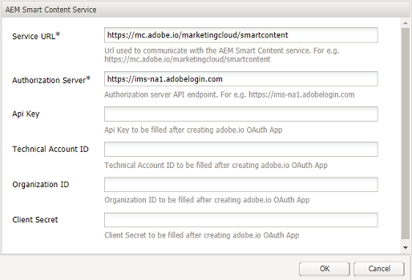
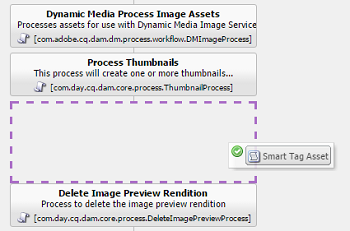
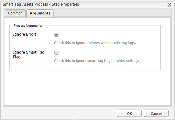

# 使用智慧型內容服務設定資產標籤 {#configure-asset-tagging-using-the-smart-content-service}

您可以使用Adobe I/O將Adobe Experience Manager(AEM)與智慧型內容服務整合。使用此設定從AEM存取Smart Content Service。

文章詳細說明了配置Smart Content service所需的下列主要工作。 在後端，AEM伺服器會先使用Adobe IO閘道驗證您的服務認證，然後再將您的請求轉送至Smart Content Service。

* 在AEM中建立Smart Content service設定以產生公開金鑰。 取得OAuth整合的公開憑證。
* 在Adobe I/O中建立整合，並上傳產生的公開金鑰。
* 使用API金鑰和Adobe I/O的其他認證來設定您的AEM例項。
* （可選）在資產上傳時啟用自動標籤。

## 必備條件 {#prerequisites}

在您使用智慧型內容服務之前，請確定以下各項以建立Adobe I/O整合：

* 具有組織管理員權限的Adobe ID帳戶。
* 您的組織已啟用智慧型內容服務。

## 取得公開憑證 {#obtain-public-certificate}

公開憑證可讓您在Adobe I/O上驗證您的個人檔案。

1. 從AEM使用者介面，點選AEM標誌，然後前往「工具>雲 **[!UICONTROL 端服務]**>舊 **[!UICONTROL 版雲端服務」]**。

1. 在「雲端服務」頁面中，點選／按一下「 **[!UICONTROL 資產智慧標籤]** 」 **[!UICONTROL 下的「立即設定」]**。
1. 在「建 **[!UICONTROL 立設定]** 」對話方塊中，指定「智慧標籤」設定的標題和名稱。 點選／按一下「 **[!UICONTROL 建立]**」。
1. 在「 **[!UICONTROL AEM智慧型內容服務]** 」對話方塊中，使用下列值：

   **[!UICONTROL 服務 URL]**: `https://mc.adobe.io/marketingcloud/smartcontent`

   **[!UICONTROL 授權伺服器]**: `https://ims-na1.adobelogin.com`

   現在將其他欄位留空（稍後將提供）。 點選／按一下「 **[!UICONTROL 確定]**」。

   

1. 點選／按一 **[!UICONTROL 下「下載OAuth整合的公用憑證]**」，然後下載公用憑證檔案 `AEM-SmartTags.crt`。

   

### 證書過期時重新配置 {#certrenew}

當憑證過期時，它不再受信任。 若要新增憑證，請依照下列步驟進行。 您無法為過期的憑證續約。

1. 以管理員身分登入您的AEM部署。 按一 **[!UICONTROL 下「工具]** >安 **[!UICONTROL 全性]** >使 **[!UICONTROL 用者]**」。

1. 找到並按 **[!UICONTROL 一下dam-update-service使用者]** 。 按一下「密鑰 **[!UICONTROL 庫]** 」頁籤。
1. 刪除具有過 **[!UICONTROL 期證書的]** 現有相似性search密鑰庫。 按一 **[!UICONTROL 下儲存並關閉]**。

   

   刪除Keystore中現有的相似性搜尋項目，以新增安全憑證

1. 導覽至「 **[!UICONTROL 工具]** > **[!UICONTROL 雲端服務]** >舊 **[!UICONTROL 版雲端服務」]**。 按一 **[!UICONTROL 下「資產智慧標籤]** >顯 **[!UICONTROL 示設定]** >可 **[!UICONTROL 用設定」]**。 按一下所需的設定。

1. 若要下載公用憑證，請按一下「 **[!UICONTROL 下載OAuth整合的公用憑證」]**。
1. 存取 [https://console.adobe.io](https://console.adobe.io) ，並導覽至「整合」頁面上現有的智慧 **[!UICONTROL 內容服務]** 。 上傳新憑證。 如需詳細資訊，請參閱「建立 [Adobe I/O整合」中的指示](#create-adobe-i-o-integration)。

## 建立Adobe I/O整合 {#create-adobe-i-o-integration}

若要使用Smart Content Service API，請在Adobe I/O中建立整合，以產生API金鑰、技術帳戶ID、組織ID和用戶端密碼。

1. 存取 [https://console.adobe.io](https://console.adobe.io/)。
1. 在「整 **[!UICONTROL 合]** 」頁面上，選取適當的帳戶並驗證關聯的組織角色是系統管理員。
1. 點選 **[!UICONTROL 新整合]**。
1. 在「建 **[!UICONTROL 立新整合」頁面]** ，選取「 **[!UICONTROL 存取API」]**。 點選「 **[!UICONTROL 繼續]**」。
1. 在「 **[!UICONTROL Experience Cloud]**」下方，選取「 **[!UICONTROL 智慧型內容」]**。 點選「 **[!UICONTROL 繼續]**」。

   

1. 在下一頁，選擇「新 **[!UICONTROL 增整合」]**。 點選／按一下「 **[!UICONTROL 繼續]**」。
1. 在「整 **[!UICONTROL 合詳細資訊]** 」頁面上，指定整合閘道的名稱並新增說明。
1. 在公 **[!UICONTROL 開金鑰憑證中]**，上 `AEM-SmartTags.crt` 傳您先前下載的檔案。
1. 點選／按一下「 **[!UICONTROL 建立整合」]**。
1. 若要檢視整合資訊，請點選／按一下「 **[!UICONTROL 繼續」以取得整合詳細資訊]**。

   

## 設定智慧型內容服務 {#configure-smart-content-service}

若要設定整合，請使用Adobe I/O整合中「技術帳戶ID」、「組織ID」、「用戶端密碼」、「授權伺服器」和「API金鑰」欄位的值。 建立智慧型標籤雲端設定可讓AEM例項的API要求驗證。

1. 從AEM使用者介面，點選／按一下AEM標誌。 導覽至「 **[!UICONTROL 工具>雲端服務>舊版雲端服務]** 」以開啟雲端服務主控台。
1. 在「資 **[!UICONTROL 產智慧標籤]**」下，開啟上述建立的設定。 在服務設定頁面上，按一下「 **[!UICONTROL 編輯]**」。
1. 在「 **[!UICONTROL AEM Smart Content Service]** 」對話方塊中 **[!UICONTROL ，使用「服務URL」和「授權伺服器」欄位的預先填入值]****** 。
1. 對於「 **[!UICONTROL API金鑰]**」、「 **[!UICONTROL Technical Account Id]**」、「 **[!UICONTROL Organization Id]**」和「Client Secret **[!UICONTROL 」欄位，請使]**&#x200B;用上述產生的值。

## 驗證配置 {#validate-the-configuration}

完成配置後，可使用JMX MBean來驗證配置。 若要驗證，請遵循下列步驟。

1. 在存取您的AEM伺服器 `https://[server]:[port]`。

1. 前往「 **[!UICONTROL 工具>作業> Web Console]** 」以開啟OSGi主控台。 按一 **[!UICONTROL 下「主要> JMX]**」。
1. 按一 **[!UICONTROL 下com.day.cq.dam.similaritysearch.internal.impl]**。 它會開啟「 **[!UICONTROL SimiliarySearch雜項工作」。]**
1. 按一 **[!UICONTROL 下validateConfigs()]**。 在「驗證 **[!UICONTROL 配置」對話]** ，按一下 **[!UICONTROL 調用]**。

   驗證結果會顯示在相同的對話方塊中。

## 在「更新資產」工作流程中啟用智慧標籤（可選） {#enable-smart-tagging-in-the-update-asset-workflow-optional}

1. 從AEM使用者介面，點選／按一下AEM標誌，然後前往「工具>工 **[!UICONTROL 作流程>模型」]**。
1. 在「工 **[!UICONTROL 作流模型]** 」頁面上，選擇 **** 「DAM更新資產」工作流模型。
1. 從工具列點選/ **[!UICONTROL 按一下]** 「編輯」。
1. 展開「側面板」以顯示步驟。 拖 **[!UICONTROL 曳DAM Workflow]** （DAM工作流程）區段中可用的智慧型標籤資產步驟，並將它置於「處理縮圖 **** 」步驟之後。

   

1. 在編輯模式中開啟步驟。 在「 **[!UICONTROL 進階設定]**」下，確定已選 **[!UICONTROL 取「處理常式進階]** 」選項。

   

1. 在「參 **[!UICONTROL 數]** 」頁籤中，如果希望工作流完成，即使自動標籤步驟失敗，請選擇「忽略錯誤 **** 」。

   

   若要在資產上傳時標籤資產，而不論資料夾上是否啟用智慧型標籤，請選取「忽略智慧 **[!UICONTROL 型標籤標籤」]**。

   

1. 點選 **[!UICONTROL 「確定]** 」以關閉流程步驟，然後儲存工作流程。

>[!MORELIKETHIS]
>
>* [管理智慧標籤](managing-smart-tags.md)
>* [智慧型標籤的概觀與訓練方法](enhanced-smart-tags.md)
>* [培訓智慧型內容服務的准則和規則](smart-tags-training-guidelines.md)
>* [有關如何設定智慧標籤的教學課程影片](https://docs.adobe.com/content/help/en/experience-manager-learn/assets/metadata/smart-tags-technical-video-setup.html)

