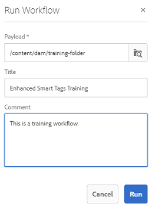

# 準備 [!DNL Assets] 用於智慧標籤 {#configure-asset-tagging-using-the-smart-content-service}

開始使用智慧內容服務標籤資產之前，請先整合 [!DNL Experience Manager Assets] 搭配Adobe Developer Console以運用的智慧服務 [!DNL Adobe Sensei]. 設定後，請使用一些影像和標籤來訓練服務。

>[!NOTE]
>
>* 新功能不再提供智慧內容服務 [!DNL Experience Manager Assets] 內部部署客戶。 已啟用此功能的現有內部部署客戶，可繼續使用智慧內容服務。
>* 智慧內容服務適用於現有 [!DNL Experience Manager Assets] 已啟用此功能的Managed Services客戶。
>* 新增 [!DNL Experience Manager Assets] Managed Services客戶可以依照本文所述的指示來設定智慧內容服務。

使用智慧內容服務之前，請確定下列事項：

* [使用 Adobe 開發人員控制台進行整合](#integrate-adobe-io).
* [訓練智慧內容服務](#training-the-smart-content-service).

* 安裝最新 [[!DNL Experience Manager] Service Pack](https://experienceleague.adobe.com/docs/experience-manager-release-information/aem-release-updates/aem-releases-updates.html).

## 使用 Adobe 開發人員控制台進行整合 {#integrate-adobe-io}

當您與Adobe Developer Console整合時， [!DNL Experience Manager] 伺服器會先透過Adobe Developer控制台閘道驗證您的服務憑證，再將您的要求轉送至智慧內容服務。 若要整合，您需要具有組織管理員權限的Adobe ID帳戶，以及為貴組織購買並啟用的智慧內容服務授權。

若要設定智慧內容服務，請遵循下列頂層步驟：

1. 若要產生公開金鑰， [建立智慧內容服務](#obtain-public-certificate) 配置 [!DNL Experience Manager]. [取得公開憑證](#obtain-public-certificate)以進行 OAuth 整合。

1. [在 Adobe 開發人員控制台中建立整合](#create-adobe-i-o-integration)，並上傳產生的公開金鑰。

1. [配置部署](#configure-smart-content-service) 使用Adobe Developer Console中的API金鑰和其他憑證。

1. [測試設定](#validate-the-configuration)。

1. （可選） [在資產上傳上啟用自動標籤](#enable-smart-tagging-in-the-update-asset-workflow-optional).

### 建立智慧內容服務設定以取得公開憑證 {#obtain-public-certificate}

公開憑證可讓您在 Adobe 開發人員控制台上驗證設定檔。

1. 在 [!DNL Experience Manager] 使用者介面，存取 **[!UICONTROL 工具]** > **[!UICONTROL Cloud Services]** > **[!UICONTROL 舊版Cloud Services]**.

1. 在「Cloud Services」頁面中，按一下 **[!UICONTROL 立即配置]** 在 **[!UICONTROL 資產智慧標籤]**.

1. 在 **[!UICONTROL 建立配置]** 對話框，指定智慧標籤配置的標題和名稱。 按一下&#x200B;**[!UICONTROL 建立]**。

1. 在 **[!UICONTROL AEM Smart Content Service]** 對話框，請使用以下值：

   **[!UICONTROL 服務 URL]**: `https://smartcontent.adobe.io/<region where your Experience Manager author instance is hosted>`

   例如, `https://smartcontent.adobe.io/apac`. 您可以指定 `na`, `emea`，或 `apac` 作為托管Experience Manager製作例項的地區。

   >[!NOTE]
   >
   >如果在2022年9月01日之前布建了Experience Manager托管服務，請使用以下服務URL:
   >`https://mc.adobe.io/marketingcloud/smartcontent`

   **[!UICONTROL 授權伺服器]**: `https://ims-na1.adobelogin.com`

   暫時將其他欄位留空（稍後將提供）。 按一下&#x200B;**[!UICONTROL 「確定」]**。

   

   *圖：提供內容服務URL的智慧型內容服務對話方塊*

   >[!NOTE]
   >
   >URL提供為 [!UICONTROL 服務URL] 無法透過瀏覽器存取，並產生404錯誤。 設定可正常運作，且值與 [!UICONTROL 服務URL] 參數。 有關整體服務狀態和維護計畫，請參閱 [https://status.adobe.com](https://status.adobe.com).

1. 按一下 **[!UICONTROL 下載公開憑證以進行OAuth整合]**，並下載公開憑證檔案 `AEM-SmartTags.crt`.

   

   *圖：智慧標籤服務的設定。*

#### 在憑證過期時重新設定 {#certrenew}

憑證過期後，即不再受信任。 您無法更新已過期的憑證。若要新增憑證，請依照下列步驟操作。

1. 以管理員身分登入您的 [!DNL Experience Manager] 部署。按一 **[!UICONTROL 下「工具]** >安 **[!UICONTROL 全性]** >使 **[!UICONTROL 用者]**」。

1. 找到 **[!UICONTROL dam-update-service]** 使用者後按一下該使用者。按一下 **[!UICONTROL 金鑰存放區]** 標籤。

1. 刪除憑證已過期的現有 **[!UICONTROL similaritysearch]** 金鑰存放區。按一下&#x200B;**[!UICONTROL 「儲存並關閉」]**。

   

   *圖：刪除現有 `similaritysearch` 金鑰存放區中的項目，以新增安全憑證。*

1. 導覽至「 **[!UICONTROL 工具]** > **[!UICONTROL 雲端服務]** >舊 **[!UICONTROL 版雲端服務」]**。按一 **[!UICONTROL 下「資產智慧標籤]** >顯 **[!UICONTROL 示設定]** >可 **[!UICONTROL 用設定」]**。按一下所需的設定。

1. 若要下載公開憑證，請按一下 **[!UICONTROL 下載公開憑證以進行OAuth整合]**.

1. 存取 [https://console.adobe.io](https://console.adobe.io) 並導覽至 **[!UICONTROL 整合]** 頁面。 上傳新憑證。 如需詳細資訊，請參閱 [建立Adobe Developer Console整合](#create-adobe-i-o-integration).

### 建立Adobe Developer Console整合 {#create-adobe-i-o-integration}

若要使用智慧內容服務API，請在Adobe Developer Console中建立整合以取得 [!UICONTROL API金鑰] (產生於 [!UICONTROL 用戶端ID] Adobe Developer主控台整合欄位), [!UICONTROL 技術帳戶ID], [!UICONTROL 組織ID]，和 [!UICONTROL 用戶端密碼] for [!UICONTROL 資產智慧標籤服務設定] 在 [!DNL Experience Manager].

1. 在瀏覽器中存取 [https://console.adobe.io](https://console.adobe.io/)。選取適當的帳戶，並確認相關聯的組織角色是系統管理員。

1. 以任何所需的名稱建立專案。按一下&#x200B;**[!UICONTROL 「新增 API」]**。

1. 在&#x200B;**[!UICONTROL 新增 API]** 頁面上選取&#x200B;**[!UICONTROL 「Experience Cloud」]**，然後選取&#x200B;**[!UICONTROL 「智慧內容」]**。按一下&#x200B;**[!UICONTROL 下一步]**。

1. 選取&#x200B;**[!UICONTROL 「上傳您的公開金鑰」]**。提供從 [!DNL Experience Manager] 下載的憑證檔案。畫面上會顯示[!UICONTROL 已成功上傳公開金鑰]訊息。按一下&#x200B;**[!UICONTROL 下一步]**。

   [!UICONTROL 建立新的服務帳戶(JWT)憑證] 頁面顯示服務帳戶的公開金鑰。

1. 按一下&#x200B;**[!UICONTROL 下一步]**。

1. 在&#x200B;**[!UICONTROL 選取產品設定檔]**&#x200B;頁面上，選取&#x200B;**[!UICONTROL 「智慧內容服務」]**。按一下&#x200B;**[!UICONTROL 「儲存已設定的 API」]**。

   此時會出現一個頁面，顯示更多關於設定的資訊。請保持此頁面開啟，以複製這些值並將其新增至 [!UICONTROL 資產智慧標籤服務設定] 在 [!DNL Experience Manager] 來設定智慧標籤。

   

   *圖：Adobe Developer Console整合的詳細資訊*

### 設定智慧內容服務 {#configure-smart-content-service}

若要設定整合，請使用 [!UICONTROL 技術帳戶ID], [!UICONTROL 組織ID], [!UICONTROL 用戶端密碼]，和 [!UICONTROL 用戶端ID] Adobe Developer控制台整合中的欄位。 建立智慧標籤雲端設定可讓驗證 [!DNL Experience Manager] 部署。

1. 在 [!DNL Experience Manager]，導覽至 **[!UICONTROL 工具]** > **[!UICONTROL Cloud Service]** > **[!UICONTROL 舊版Cloud Services]** 開啟 [!UICONTROL Cloud Services] 控制台。

1. 在 **[!UICONTROL 資產智慧標籤]**，開啟上述建立的設定。 在服務設定頁面上，按一下 **[!UICONTROL 編輯]**.

1. 在「 **[!UICONTROL AEM Smart Content Service]** 」對話方塊中 **[!UICONTROL ，使用「服務URL」和「授權伺服器」欄位的預先填入值]****** 。

1. 對於欄位 [!UICONTROL Api金鑰], [!UICONTROL 技術帳戶ID], [!UICONTROL 組織ID]，和 [!UICONTROL 用戶端密碼]，複製並使用中產生的下列值 [Adobe Developer Console整合](#create-adobe-i-o-integration).

   | [!UICONTROL 資產智慧標記服務設定] | [!DNL Adobe Developer Console] 整合欄位 |
   |--- |--- |
   | [!UICONTROL API 金鑰] | [!UICONTROL 用戶端ID] |
   | [!UICONTROL 技術帳戶 ID] | [!UICONTROL 技術帳戶ID] |
   | [!UICONTROL 組織 ID] | [!UICONTROL 組織 ID] |
   | [!UICONTROL 用戶端密碼] | [!UICONTROL 用戶端密碼] |

### 驗證設定 {#validate-the-configuration}

完成配置後，可以使用JMX MBean來驗證配置。 若要驗證，請遵循下列步驟。

1. 存取 [!DNL Experience Manager] 伺服器 `https://[aem_server]:[port]`.

1. 前往 **[!UICONTROL 工具]** > **[!UICONTROL 操作]** > **[!UICONTROL Web主控台]** 來開啟OSGi主控台。 按一下 **[!UICONTROL 主要] > [!UICONTROL JMX]**.

1. 按一下 `com.day.cq.dam.similaritysearch.internal.impl`. 開啟 **[!UICONTROL 相似性搜索其他任務]**.

1. 按一下 `validateConfigs()`. 在 **[!UICONTROL 驗證配置]** 對話框，按一下 **[!UICONTROL 叫用]**.

驗證結果將顯示在同一對話框中。

### 在 [!UICONTROL DAM更新資產] 工作流程（選用） {#enable-smart-tagging-in-the-update-asset-workflow-optional}

1. 在 [!DNL Experience Manager]，前往 **[!UICONTROL 工具]** > **[!UICONTROL 工作流程]** > **[!UICONTROL 模型]**.

1. 在「 **[!UICONTROL 工作流模型]** 」頁面上，選擇「**[!UICONTROL DAM 更新資產]** 」工作流模型。

1. 按一下工具列中的&#x200B;**[!UICONTROL 「編輯」]**。

1. 展開「側面板」以顯示步驟。拖 **[!UICONTROL 曳DAM Workflow]**  (DAM工作流程) 區段中可用的智慧型標籤資產步驟，並將其置於&#x200B;**[!UICONTROL 「處理縮 圖」]**&#x200B;步驟之後 。

   

   *圖：在「DAM 更新資產」工作流程中，在處理縮圖步驟之後新增智慧標記資產步驟。*

1. 在編輯模式中開啟步驟。在「 **[!UICONTROL 進階設定]**」下，確定已選取 **[!UICONTROL 「處理常式進階]** 」選項。

   

   *圖：設定DAM更新資產工作流程並新增智慧標籤步驟*

1. 在「參 **[!UICONTROL 數]** 」頁籤中，如果希望工作流完成，即使自動標籤步驟失敗，請選擇「忽略錯誤 **** 」。

   

   *圖：設定DAM更新資產工作流程以新增智慧標籤步驟並選取處理常式進階*

   若無論是否對資料夾啟用智慧標記，都要在資產上傳時標記資產，請選取&#x200B;**[!UICONTROL 「忽略智慧標記旗標」]**。

   

   *圖：設定DAM更新資產工作流程以新增智慧標籤步驟，並選取「忽略智慧標籤」標幟。*

1. 按一下&#x200B;**[!UICONTROL 「確定」]**&#x200B;關閉程序步驟，然後儲存工作流程。

## 訓練智慧內容服務 {#training-the-smart-content-service}

為了讓智慧內容服務識別您的業務分類，請在已包含與您的業務相關標籤的一組資產上執行該分類。 為了有效標籤您的品牌影像，智慧內容服務要求訓練影像符合特定准則。 經過培訓後，此服務可對類似的資產集套用相同的分類法。

您可以多次訓練服務，以改善其套用相關標籤的能力。 在每個訓練週期後，執行標籤工作流程並檢查資產是否已適當標籤。

您可以定期或根據需求對智慧內容服務進行培訓。

>[!NOTE]
>
>培訓工作流程僅在資料夾上執行。

### 培訓准則 {#guidelines-for-training}

為獲得最佳結果，培訓集中的影像符合以下准則：

**** 數量和大小：每個標籤至少30個影像。長邊至少500像素。

**一致性**:用於特定標籤的影像在視覺上類似。

例如，將這些影像標籤為 `my-party` （用於訓練），因為視覺上不類似。

**涵蓋範圍**:在訓練中對影像使用足夠的多樣性。 其理念是提供一些相當多樣化的範例，讓Experience Manager學會專注於正確的事物。 如果您要在視覺上不同的影像上套用相同的標籤，請至少包含五種類型的範例。

例如，對於標籤 *下姿態*，請加入更多類似下方醒目提示影像的訓練影像，讓服務在標籤時更準確地識別類似影像。

**干擾/障礙**:該服務對分散注意力較少的影像進行更好的訓練（顯著背景、不相關的伴奏，如主題對象/人）。

例如，對於標籤 *休閒鞋*)，第二張影像不是好的訓練候選者。

**** 完整性：如果影像符合多個標籤的資格，請先新增所有適用的標籤，再加入影像以進行訓練。例如，對於標籤，例如 `raincoat` 和 `model-side-view`，請先在符合資格的資產上新增兩個標籤，再加入以進行訓練。

>[!NOTE]
>
>智慧內容服務在您的標籤上進行訓練，並將它們套用至其他影像的能力，取決於您用於訓練的影像品質。 為獲得最佳結果，Adobe建議您使用視覺上類似的影像來訓練每個標籤的服務。

### 定期培訓 {#periodic-training}

您可以啟用智慧內容服務，以定期訓練資料夾內的資產和相關標籤。 開啟 [!UICONTROL 屬性] 資產資料夾的頁面，請選取 **[!UICONTROL 啟用智慧標籤]** 在 **[!UICONTROL 詳細資料]** ，然後儲存變更。

為資料夾選取此選項後， [!DNL Experience Manager] 會自動執行訓練工作流程，以訓練資料夾資產及其標籤上的智慧內容服務。 預設情況下，培訓工作流程每週在星期六的凌晨12:30運行。

### 隨選培訓 {#on-demand-training}

您可以視需要從工作流程主控台訓練智慧內容服務。

1. 在 [!DNL Experience Manager] 介面，轉到 **[!UICONTROL 工具]** > **[!UICONTROL 工作流程]** > **[!UICONTROL 模型]**.
1. 從 **[!UICONTROL 工作流程模型]** 頁面，選擇 **[!UICONTROL 智慧標籤訓練]** 工作流程，然後按一下 **[!UICONTROL 開始工作流程]** 的上界。
1. 在 **[!UICONTROL 執行工作流程]** 對話方塊，瀏覽至裝載資料夾，其中包含用於訓練服務的已標籤資產。
1. 指定工作流程的標題並新增註解。 然後，按一下 **[!UICONTROL 執行]**. 資產和標籤會提交以供訓練。

   

>[!NOTE]
>
>處理資料夾中的資產以進行訓練後，後續訓練週期中只會處理修改的資產。

### 查看培訓報告 {#viewing-training-reports}

若要檢查智慧內容服務是否在資產訓練集的標籤上接受訓練，請從報表控制台檢閱訓練工作流程報表。

1. 在 [!DNL Experience Manager] 介面，轉到 **[!UICONTROL 工具]** > **[!UICONTROL 資產]** > **[!UICONTROL 報表]**.
1. 在 **[!UICONTROL 資產報表]** 頁面，按一下 **[!UICONTROL 建立]**.
1. 選取 **[!UICONTROL 智慧標籤訓練]** 報告，然後按一下 **[!UICONTROL 下一個]** 的上界。
1. 指定報表的標題和說明。在「 **[!UICONTROL 排程報表]**」下，保 **[!UICONTROL 留「現在]** 」選項。如果您想要排程報表以供稍後使用，請選 **[!UICONTROL 取]** 「稍後」並指定日期和時間。然後，按一下 **[!UICONTROL 建立]** 的上界。
1. 在「資 **[!UICONTROL 產報表]** 」頁面中，選取您產生的報表。若要檢視報表，請按一下 **[!UICONTROL 檢視]** 的上界。
1. 檢閱報表的詳細資訊。

   報表會顯示您所訓練之標籤的訓練狀態。「培訓狀態」欄 **[!UICONTROL 中的綠色]** ，表示智慧型內容服務已接受標籤的培訓。黃色表示服務未針對特定標籤進行完整訓練。在這種情況下，請使用特定標籤新增更多影像，並執行培訓工作流程，以完全在標籤上訓練服務。

   如果在此報告中看不到您的標籤，請針對這些標籤再次執行訓練工作流程。

1. 若要下載報表，請從清單中選取報表，然後按一下 **[!UICONTROL 下載]** 的上界。 報表會以Microsoft Excel試算表的形式下載。

## 限制 {#limitations}

* 增強的智慧標籤是以學習影像及其標籤的模型為基礎。 這些模型在識別標籤時並非總是十分完美。 智慧內容服務的目前版本有下列限制：

   * 無法識別影像中的細微差異。 例如，纖薄與普通襯衫。
   * 無法根據影像的微小模式/部分識別標籤。 例如T恤上的標誌。
   * 在 [!DNL Experience Manager] 支援。 如需語言清單，請參閱 [智慧內容服務發行說明](https://experienceleague.adobe.com/docs/experience-manager-64/release-notes/smart-content-service-release-notes.html).

* 若要搜尋具有智慧標籤的資產（一般或增強），請使用 [!DNL Assets] Omnisearch（全文搜尋）。 智慧標籤沒有單獨的搜尋述詞。

>[!MORELIKETHIS]
>
>* [智慧標籤的概觀及訓練方法](enhanced-smart-tags.md)
>* [關於智慧標籤的教學課程影片](https://experienceleague.adobe.com/docs/experience-manager-learn/assets/metadata/image-smart-tags.html)

