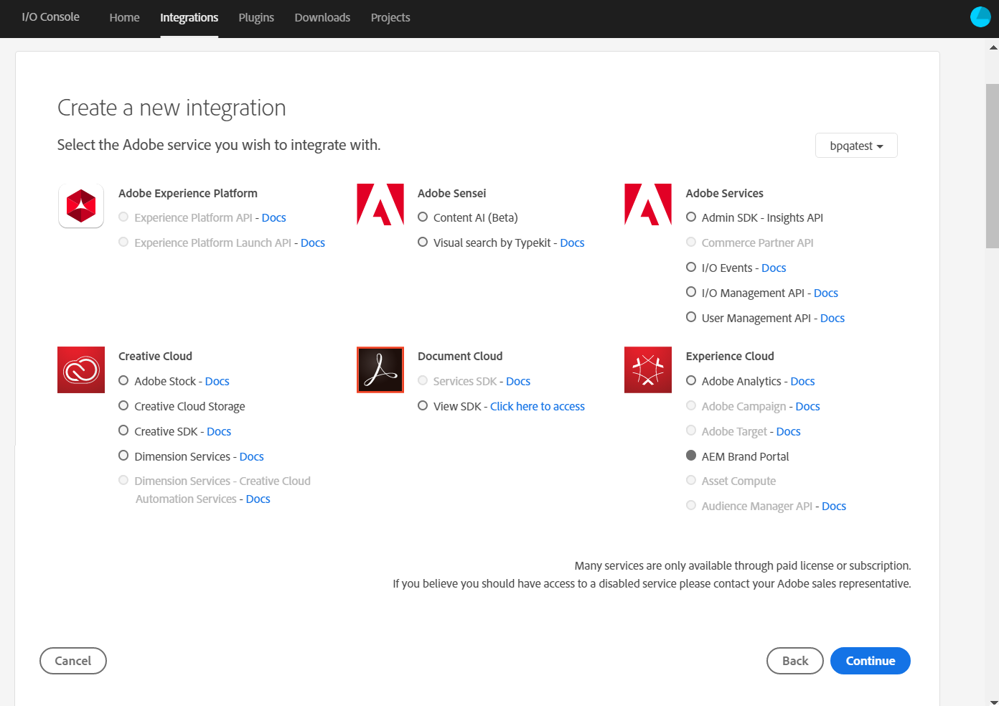
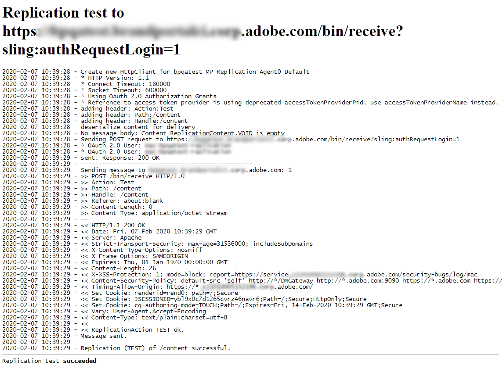

# 使用品牌入口網站設定AEM資產 {#configure-integration-65}

Adobe Experience Manager(AEM)Assets是透過Adobe I/O以品牌入口網站設定，Adobe I/O會購買IMS Token以授權您的品牌入口網站租用戶。

>[!NOTE]
>
>AEM 6.5.4.0及更新版本支援透過Adobe I/O以品牌入口網站設定AEM資產。
>
>之前，品牌入口網站是透過舊版OAuth閘道在傳統使用者介面中設定，該閘道使用JWT代號交換來取得IMS存取代號以進行授權。
>
>自2020年4月6日起，不再支援透過舊版OAuth進行的設定，並變更為透過Adobe I/O進行設定。
>
>如果您是舊版OAuth閘道上具備設定的現有品牌入口網站使用者，建議您刪除現有的設定並在Adobe I/O上建立新的設定。
>
>但是，如果不修改配置，現有配置將繼續工作。

本說明說明下列兩個使用案例：
* [新配置](#configure-new-integration-65):如果您是新的品牌入口網站使用者，並想要使用品牌入口網站設定您的AEM Assets作者例項，則可以在Adobe I/O上建立新的設定。
* [升級配置](#upgrade-integration-65):如果您是現有的品牌入口網站使用者，且AEM Assets作者實例在舊版OAuth閘道上設定了品牌入口網站，建議您刪除現有的設定並在Adobe I/O上建立新的設定。

提供的資訊基於以下假設：閱讀本「說明」的人熟悉下列技術：

* 安裝、設定和管理Adobe Experience Manager和AEM套件

* 使用Linux和Microsoft Windows作業系統

## 必備條件 {#prerequisites}

您需要下列項目才能設定具有品牌入口網站的AEM資產：

* 具有最新Service Pack的AEM Assets作者執行個體。
* 品牌入口網站租用戶URL。
* 對品牌入口網站的IMS組織具有系統管理員權限的使用者。

[下載並安裝AEM 6.5](#aemquickstart)

[下載並安裝最新的AEM Service Pack](#servicepack)

### 下載並安裝AEM 6.5 {#aemquickstart}

建議您讓AEM 6.5來設定AEM作者例項。 如果您沒有啟動並執行AEM，請從下列位置下載它：

* 如果您是現有的AEM客戶，請從 [Adobe授權網站下載AEM 6.5](http://licensing.adobe.com)。

* 如果您是Adobe合作夥伴，請使用 [Adobe合作夥伴培訓計畫](https://adobe.allegiancetech.com/cgi-bin/qwebcorporate.dll?idx=82357Q) ，申請AEM 6.5。

下載AEM後，如需設定AEM作者例項的指示，請參閱「部署 [與維護」](https://helpx.adobe.com/experience-manager/6-5/sites/deploying/using/deploy.html#defaultlocalinstall)。

### 下載並安裝AEM最新Service Pack {#servicepack}

如需詳細指示，請參閱

* [AEM 6.5 Service Pack發行說明](https://helpx.adobe.com/experience-manager/6-5/release-notes/sp-release-notes.html)

**如果您找不到** 最新的AEM套件或Service Pack，請連絡支援。

## Create configuration {#configure-new-integration-65}

如果您是第一次使用品牌入口網站設定AEM資產，請在所列順序中執行下列步驟：
1. [取得公開憑證](#public-certificate)
1. [建立Adobe I/O整合](#createnewintegration)
1. [建立IMS帳戶設定](#create-ims-account-configuration)
1. [設定雲端服務](#configure-the-cloud-service)
1. [測試設定](#test-integration)

### 建立IMS設定 {#create-ims-configuration}

IMS設定會以AEM Assets作者例項驗證您的品牌入口網站租用戶。

IMS配置包括兩個步驟：

* [取得公開憑證](#public-certificate)
* [建立IMS帳戶設定](#create-ims-account-configuration)

### 取得公開憑證 {#public-certificate}

公開憑證可讓您在Adobe I/O上驗證個人檔案。

1. 登入您的AEM Assets author instance預設URL:http:// localhost:4502/aem/start.html
1. 從「 **Security** **[!UICONTROL 」面板，導覽至「]** Security **[!UICONTROL >]** Adobe IMS Configurations Tools」。

   

1. Adobe IMS設定頁面隨即開啟。

   按一下 **[!UICONTROL 建立]**。

   這會帶您前往 **[!UICONTROL Adobe IMS技術帳戶設定頁面]** 。

1. 依預設會開 **啟「認證** 」標籤。

   在 **Cloud Solution中**，選取 **[!UICONTROL Adobe品牌入口網站]**。

1. 標籤核取方 **[!UICONTROL 塊「建立新憑證]** 」並指 **定憑證的** 別名。 別名用作對話框的名稱。

1. 按一 **[!UICONTROL 下建立憑證]**。 將出現對話框。 按一下 **[!UICONTROL 確定]** ，生成公共證書。

   

1. 按一 **[!UICONTROL 下「下載公開金鑰]** 」，並將 ** AEM-Adobe-IMS.crt憑證檔案儲存在您的電腦上。 憑證檔案用來 [建立Adobe I/O整合](#createnewintegration)。

   

1. 按一 **[!UICONTROL 下「下一步]**」。

   在「帳 **戶** 」索引標籤中，您建立Adobe IMS帳戶，但您需要整合詳細資訊。 請立即開啟此頁面。

   開啟新標籤並建 [立Adobe I/O整合](#createnewintegration) ，以取得IMS帳戶設定的整合詳細資訊。

### 建立Adobe I/O整合 {#createnewintegration}

Adobe I/O整合會產生API金鑰、用戶端密碼和裝載(JWT)，這是設定IMS帳戶設定所需的。

1. 使用品牌入口網站租用戶之IMS組織的系統管理員權限登入Adobe I/O Console。

   預設URL: [https://console.adobe.io/](https://console.adobe.io/)

1. 按一 **[!UICONTROL 下建立整合]**。

1. 選取 **[!UICONTROL 存取API]**，然後按一下 **[!UICONTROL 繼續]**。

   

1. 建立新的整合頁面隨即開啟。

   從下拉式清單中選擇您的組織。

   在 **[!UICONTROL Experience Cloud]**，選取 **[!UICONTROL AEM品牌入口網站]** ，然後按一下「 **[!UICONTROL 繼續]**」。

   如果您已停用「品牌入口網站」選項，請確定您已從 **[!UICONTROL Adobe服務選項上方的下拉式方塊中選取正確的組織]** 。 如果您不瞭解您的組織，請聯絡您的管理員。

   

1. 指定整合的名稱和說明。 按一 **[!UICONTROL 下「從電腦選取檔案]** 」，並上傳 `AEM-Adobe-IMS.crt` 在「取得公用憑證」區 [段中下載的檔案](#public-certificate) 。

1. 選擇組織的配置檔案。

   或者，選取預設的描述檔 **[!UICONTROL 資產品牌入口網站]** ，然後按 **[!UICONTROL 一下「建立整合」]**。 會建立整合。

1. 按一 **[!UICONTROL 下「繼續」以整合詳細資訊]** ，以檢視整合資訊。

   複製 **[!UICONTROL API金鑰]**

   按一 **[!UICONTROL 下「擷取用戶端密碼]** 」並複製用戶端密碼。

   

1. 導航到 **[!UICONTROL JWT]** 頁籤，並複製 **[!UICONTROL JWT裝載]**。

   API金鑰、用戶端密碼金鑰和JWT裝載資訊將用來建立IMS帳戶設定。

### 建立IMS帳戶設定 {#create-ims-account-configuration}

請確定您已執行下列步驟：

* [取得公開憑證](#public-certificate)
* [建立Adobe I/O整合](#createnewintegration)

**建立IMS帳戶設定的步驟：**

1. 開啟「IMS設定」頁面的「帳 **[!UICONTROL 戶]** 」標籤。 您在「取得公開的憑證」一節的結尾處保 [持頁面開啟](#public-certificate)。

1. 指定 **[!UICONTROL IMS帳戶]** 的標題。

   在授 **[!UICONTROL 權伺服器]**，輸入URL: [https://ims-na1.adobelogin.com/](https://ims-na1.adobelogin.com/)

   在「建立Adobe I/O」整合結束時貼上您已複製的API金鑰、用戶端密碼和JWT裝載 。

   按一下 **[!UICONTROL 建立]**。

   會建立整合。

   

   >[!CAUTION]
   >
   >僅建立一個IMS設定。 請勿建立多個IMS組態。

1. 選擇IMS設定，然後按一下「 **[!UICONTROL Check Health」(檢查健康]**)。 將出現一個對話框。

   按一下 **[!UICONTROL 檢查]**。 在成功連線時，會出 *現成功擷取的Token* 訊息。

   

      

### 設定雲端服務 {#configure-the-cloud-service}

執行下列步驟以建立品牌入口網站雲端服務設定：

1. 登入您的AEM Assets作者實例

   預設URL:http:// localhost:4502/aem/start.html
1. 從「工 **具** 」  雲端服務>> AEM品牌入口網站」 ****。

   品牌入口網站設定頁面隨即開啟。

1. 按一下 **[!UICONTROL 建立]**。

1. 指定 **[!UICONTROL 配置的]** 「標題」。

   選取您在步驟中建立的IMS設定，建立 [IMS帳戶設定](#create-ims-account-configuration)。

   在「 **[!UICONTROL 服務URL]**」中，輸入您的品牌入口網站租用戶URL。

   

1. 按一 **[!UICONTROL 下儲存並關閉]**。 雲端設定已建立。 您的AEM Assets作者實例現在已與品牌入口網站租用戶整合。

### Test configuration {#test-integration}

1. 登入您的AEM Assets作者實例

   預設URL:http:// localhost:4502/aem/start.html

1. 從「工 **具** 」  航至「部署」>「複製」 ****。

   

1. 複製頁開啟。

   按一 **[!UICONTROL 下作者上的代理]**。

   

1. 為每個租用戶建立四個複製代理。

   找到您品牌門戶租用戶的複製代理。

   按一下複製代理URL。

   

   >[!NOTE]
   >
   >複製代理並行工作，共用作業分配，使發佈速度提高了原始速度的四倍。 在設定雲端服務後，不需要額外的設定，就可啟用依預設啟用的複製代理，以啟用多個資產的並行發佈。

   >[!NOTE]
   >
   >請避免禁用任何複製代理，因為這可能導致某些資產的複製失敗。

1. 若要驗證AEM Assets作者和品牌入口網站之間的連線，請按一下「 **[!UICONTROL 測試連線」]**。

   

1. 查看測試結果底部以驗證複製是否成功。

   

   >[!NOTE]
   >
   >複製代理並行工作，共用作業分配，使發佈速度提高了原始速度的四倍。 在設定雲端服務後，不需要額外的設定，就可啟用依預設啟用的複製代理，以啟用多個資產的並行發佈。

1. 對所有四個複製代理逐一驗證測試結果。

   >[!NOTE]
   >
   >請避免禁用任何複製代理，因為這可能導致某些資產的複製失敗。

您的AEM Assets作者實例已成功設定品牌入口網站。 您現在可以：

* [將資產從AEM Assets發佈至品牌入口網站](../assets/brand-portal-publish-assets.md)
* [將資料夾從AEM Assets發佈至品牌入口網站](../assets/brand-portal-publish-folder.md)
* [將系列從AEM Assets發佈至品牌入口網站](../assets/brand-portal-publish-collection.md)
* [設定「資產來源補充](https://docs.adobe.com/content/help/en/experience-manager-brand-portal/using/asset-sourcing-in-brand-portal/brand-portal-asset-sourcing.html) 」，讓品牌入口網站使用者將資產貢獻並發佈至AEM資產。

## 升級配置 {#upgrade-integration-65}

在所列順序中執行以下步驟以升級現有配置：
1. [驗證正在運行的作業](#verify-jobs)
1. [刪除現有配置](#delete-existing-configuration)
1. [建立設定](#configure-new-integration-65)

### 驗證正在運行的作業 {#verify-jobs}

在您進行任何修改之前，請確定您的AEM Assets作者實例上沒有執行任何發佈工作。 為此，您可以驗證所有四個複製代理，並確保隊列是理想／空的。

1. 登入您的AEM Assets作者實例

   預設URL:http:// localhost:4502/aem/start.html

1. 從「工 **具** 」  航至「部署」>「複製」 ****。

1. 複製頁開啟。

   按一 **[!UICONTROL 下作者上的代理]**。

   

1. 找到您品牌門戶租用戶的複製代理。

   確保所有復 **制代理的隊列都為Idle** ，則未激活任何發佈作業。

   

### 刪除現有配置 {#delete-existing-configuration}

刪除現有配置時，必須運行以下檢查清單。
* 刪除所有四個複製代理
* 刪除雲端服務
* 刪除MAC用戶

1. 登入您的AEM Assets作者例項，並以管理員身分開啟CRX Lite。

   預設URL:http:// localhost:4502/crx/de/index.jsp

1. 導覽至 `/etc/replications/agents.author` 並刪除您品牌入口網站租用戶的所有4個複製代理。

   

1. 導覽至 `/etc/cloudservices/mediaportal` 並刪除雲 **端服務設定**。

   

1. 導覽至 `/home/users/mac` 並刪除您 **品牌入口網站的** MAC使用者。

   

您現在可 [以在Adobe I/O的AEM](#configure-new-integration-65) 6.5作者實例上建立設定。

<!--
   Comment Type: draft

   <li> </li>
   -->

<!--
   Comment Type: draft

   <li>Step text</li>
   -->

複製成功後，您可以將資產、檔案夾和系列發佈至品牌入口網站。 如需詳細資訊，請參閱：

* [將資產發佈至品牌入口網站](/help/assets/brand-portal-publish-assets.md)
* [將資料夾發佈至品牌入口網站](/help/assets/brand-portal-publish-folder.md)
* [將系列發佈至品牌入口網站](/help/assets/brand-portal-publish-collection.md)
