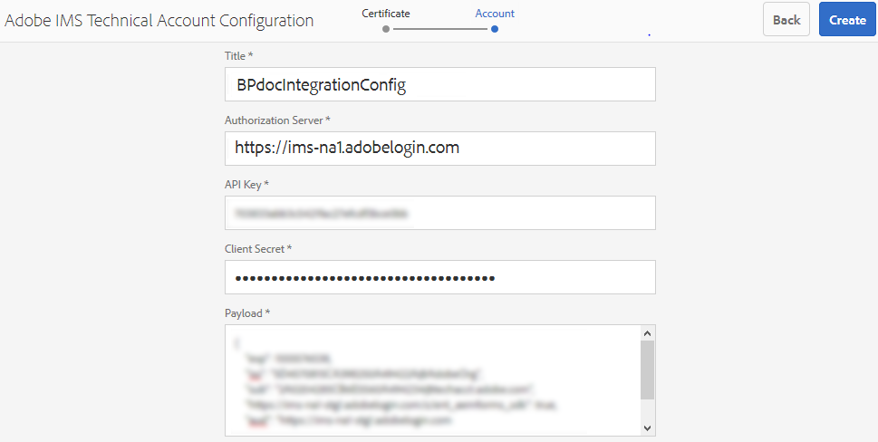

# 使用 Brand Portal 設定 AEM Assets {#configure-integration-65}

Adobe Experience Manager(AEM)Assets是透過Adobe Developer Console以品牌入口網站設定，Adobe Developer Console會購買IMS Token以授權您的品牌入口網站租用戶。

>[!NOTE]
>
>AEM 6.5.4.0及更新版本支援透過Adobe Developer Console以品牌入口網站設定AEM資產。
>
>之前，品牌入口網站是透過舊版OAuth閘道在傳統使用者介面中設定，該閘道使用JWT代號交換來取得IMS存取代號以進行授權。
>
>自2020年4月6日起，不再支援透過舊版OAuth進行的設定，並變更為透過Adobe Developer Console進行設定。

>[!TIP]
>
>***僅限現有客戶***
>
>建議您繼續使用現有的舊版OAuth閘道設定。 萬一您遇到舊版OAuth閘道設定的問題，請刪除現有的設定，並透過Adobe Developer Console建立新的設定。

本說明說明下列兩個使用案例：
* [新配置](#configure-new-integration-65): 如果您是新的品牌入口網站使用者，並想要使用品牌入口網站設定您的AEM Assets作者例項，則可以在Adobe Developer Console上建立新的設定。
* [升級配置](#upgrade-integration-65): 如果您是現有的品牌入口網站使用者，且AEM Assets作者實例在舊版OAuth閘道上設定了品牌入口網站，建議您刪除現有的設定並在Adobe Developer Console上建立新的設定。

提供的資訊基於以下假設：閱讀本「說明」的人熟悉下列技術：

* 安裝、設定和管理Adobe Experience Manager和AEM套件。

* 使用Linux和Microsoft Windows作業系統。

## 必備條件 {#prerequisites}

您需要下列項目才能使用 Brand Portal 設定 AEM Assets：

* 具有最新Service Pack的AEM Assets作者執行個體。
* Brand Portal 租用戶 URL。
* 在 Brand Portal 租用戶的 IMS 組織具有系統管理員權限的使用者。

[下載並安裝AEM 6.5](#aemquickstart)

[下載並安裝最新的AEM Service Pack](#servicepack)

### 下載並安裝AEM 6.5 {#aemquickstart}

建議您讓AEM 6.5來設定AEM作者例項。 如果您沒有啟動並執行AEM，請從下列位置下載：

* 如果您是現有的AEM客戶，請從 [Adobe授權網站下載AEM 6.5](http://licensing.adobe.com)。

* 如果您是Adobe合作夥伴，請使用 [Adobe合作夥伴培訓計畫](https://adobe.allegiancetech.com/cgi-bin/qwebcorporate.dll?idx=82357Q) ，申請AEM 6.5。

下載AEM後，如需設定AEM作者例項的指示，請參閱「部署 [與維護」](https://helpx.adobe.com/experience-manager/6-5/sites/deploying/using/deploy.html#defaultlocalinstall)。

### 下載並安裝AEM最新Service Pack {#servicepack}

如需詳細指示，請參閱

* [AEM 6.5 Service Pack發行說明](https://helpx.adobe.com/tw/experience-manager/6-5/release-notes/sp-release-notes.html)

**如果您找不到最新的AEM套件或Service Pack** ，請連絡客戶服務。

## 建立設定 {#configure-new-integration-65}

使用品牌入口網站設定AEM資產需要在AEM Assets作者實例和Adobe Developer Console中進行設定。

1. 在AEM Assets作者例項中，建立IMS帳戶並產生公開憑證（公開金鑰）。

1. 在Adobe Developer Console中，為您的品牌入口網站租用戶（組織）建立專案。

1. 在專案下，使用公開金鑰來設定API，以建立服務帳戶(JWT)連線。

1. 獲取服務帳戶憑據和JWT裝載資訊。

1. 在AEM Assets作者例項中，使用服務帳戶認證和JWT裝載來設定IMS帳戶。

1. 在AEM Assets作者例項中，使用IMS帳戶和品牌入口端端點（組織URL）來設定品牌入口網站雲端服務。

1. 將資產從AEM Assets作者例項發佈至品牌入口網站，以測試設定。

>[!NOTE]
>
>品牌入口網站的租用戶只能設定一個AEM Assets作者例項。
>
>請勿設定具有多個AEM Assets作者例項的品牌入口網站租用戶。

如果您是第一次使用品牌入口網站設定AEM資產，請在所列順序中執行下列步驟：
1. [取得公開憑證](#public-certificate)
1. [建立服務帳戶(JWT)連接](#createnewintegration)
1. [設定IMS帳戶](#create-ims-account-configuration)
1. [設定雲端服務](#configure-the-cloud-service)
1. [測試設定](#test-integration)

### 建立 IMS 設定 {#create-ims-configuration}

IMS 設定會以 AEM Assets 作者例項驗證您的 Brand Portal 租用戶。

IMS 設定包括兩個步驟：

* [取得公開憑證](#public-certificate)
* [設定IMS帳戶](#create-ims-account-configuration)

### 取得公開憑證 {#public-certificate}

公開憑證可讓您在Adobe Developer Console上驗證您的個人檔案。

1. 登入您的AEM Assets作者實例。 預設URL為
   `http:// localhost:4502/aem/start.html`
1. From the **Tools**  panel, navigate to **[!UICONTROL Security]** > **[!UICONTROL Adobe IMS Configurations]**.

   

1. 在「Adobe IMS設定」頁面中，按一下「 **[!UICONTROL 建立]**」。

1. 您已重新導向至「 **[!UICONTROL Adobe IMS技術帳戶設定」頁面]** 。 By default, the **Certificate** tab opens.

   選取雲端解決方 **[!UICONTROL 案Adobe Brand Portal]**。

1. 勾選核取方塊&#x200B;**[!UICONTROL 建立新憑證]**&#x200B;並指定憑證的&#x200B;**別名**。別名的作用是對話方塊的名稱。

1. 按一下&#x200B;**[!UICONTROL 建立憑證]**。然後，在對 **[!UICONTROL 話方塊中]** ，按一下「確定」以產生公用憑證。

   

1. Click **[!UICONTROL Download Public Key]** and save the certificate (.crt) file on your machine.

   此憑證檔案將用於進一步步驟，以針對您的品牌入口網站租用戶設定API，並在Adobe Developer Console中產生服務帳戶認證。

   

1. 按一下&#x200B;**[!UICONTROL 下一步]**。

   在「帳 **戶** 」標籤中，您建立Adobe IMS帳戶，但您需要在Adobe Developer Console中產生的服務帳戶認證。 暫時保持此頁面開啟。

   在Adobe Developer Console中開啟新 [標籤並建立服務帳戶(JWT)連線](#createnewintegration) ，以取得用於設定IMS帳戶的認證和JWT裝載。

### 建立服務帳戶(JWT)連接 {#createnewintegration}

在Adobe Developer Console中，專案和API是在組織（品牌入口網站租用戶）層級設定。 設定API會在Adobe Developer Console中建立服務帳戶(JWT)連線。 有兩種方法可用來設定API：產生金鑰對（私用和公開金鑰）或上傳公開金鑰。 若要使用Brand Portal設定AEM Assets作者實例，您必須在AEM Assets作者實例中產生公用憑證（公用金鑰），並透過上傳公用金鑰在Adobe Developer Console中建立認證。 此公開金鑰用來設定所選品牌入口網站組織的API，並產生服務帳戶的認證和JWT裝載。 這些認證可進一步用於在AEM Assets作者例項中設定IMS帳戶。 在設定IMS帳戶後，您就可以在AEM Assets作者例項中設定品牌入口網站雲端服務。

執行以下步驟以生成服務帳戶憑據和JWT裝載：

1. 以IMS組織（品牌入口網站租用戶）的系統管理員權限登入Adobe Developer Console。 預設URL為

   [https://www.adobe.com/go/devs_console_ui](https://www.adobe.com/go/devs_console_ui)

   >[!NOTE]
   >
   >請確定您已從右上角的下拉式清單（組織清單）中選取正確的IMS組織（品牌入口網站租用戶）。

1. Click **[!UICONTROL Create new project]**. 系統會為您的組織建立空白專案。

   按一 **[!UICONTROL 下「編輯專案]** 」以更新「 **[!UICONTROL 專案標題]** 」和「說 **[!UICONTROL 明」]**，然後按 ****&#x200B;一下「儲存」。

   

1. 在「專案概述」標籤中，按一下「 **[!UICONTROL 新增API」]**。

   

1. 在「新增API」視窗中，選取「 **[!UICONTROL AEM品牌入口網站」]** ，然後按一 **[!UICONTROL 下「下一步]**」。

   請確定您擁有AEM品牌入口網站服務的存取權。

1. 在「設定API」視窗中，按一下「 **[!UICONTROL 上傳公開金鑰」]**。 然後，按一 **[!UICONTROL 下「選取檔案]** 」，並上傳您已在取得公用憑證區段中下載的公 [用憑證(.crt](#public-certificate) 檔案)。

   按一下&#x200B;**[!UICONTROL 下一步]**。

   

1. 驗證公共證書並按一下「 **[!UICONTROL Next（下一步）]**」。

1. 選取預設產品設定檔 **[!UICONTROL Assets Brand Portal]** ，然後按一 **[!UICONTROL 下「儲存設定」]**。

   

1. 在設定API後，您會重新導向至API概觀。 在左邊導覽的「憑 **[!UICONTROL 據」下]**，單 **[!UICONTROL 擊「服務帳戶(JWT)」]**。

   >[!NOTE]
   >
   >您可以視需要檢視憑證並執行其他動作（產生JWT Token、複製憑證詳細資訊、擷取用戶端密碼等）。

1. 從「客 **[!UICONTROL 戶端認證]** 」標籤複製 **[!UICONTROL 客戶端ID]**。

   Click **[!UICONTROL Retrieve Client Secret]** and copy the **[!UICONTROL client secret]**.

   

1. Navigate to the **[!UICONTROL Generate JWT]** tab and copy the **[!UICONTROL JWT Payload]**.

您現在可以使用用戶端ID（API金鑰）、用戶端密碼和JWT裝載，在 [AEM Assets雲端例項中設定IMS](#create-ims-account-configuration) 帳戶。

<!--
### Create Adobe I/O integration {#createnewintegration}

Adobe I/O integration generates API Key, Client Secret, and Payload (JWT) which is required in setting up the IMS Account configurations.

1. Login to Adobe I/O Console with system administrator privileges on the IMS organization of the Brand Portal tenant.

   Default URL: [https://console.adobe.io/](https://console.adobe.io/) 

1. Click **[!UICONTROL Create Integration]**.

1. Select **[!UICONTROL Access an API]**, and click **[!UICONTROL Continue]**.

   

1. Create a new integration page opens. 
   
   Select your organization from the drop-down list.

   In **[!UICONTROL Experience Cloud]**, Select **[!UICONTROL AEM Brand Portal]** and click **[!UICONTROL Continue]**. 

   If the Brand Portal option is disabled for you, ensure that you have selected correct organization from the drop-down box above the **[!UICONTROL Adobe Services]** option. If you do not know your organization, contact your administrator.

   

1. Specify a name and description for the integration. Click **[!UICONTROL Select a File from your computer]** and upload the `AEM-Adobe-IMS.crt` file downloaded in the [obtain public certificates](#public-certificate) section.

1. Select the profile of your organization. 

   Or, select the default profile **[!UICONTROL Assets Brand Portal]** and click **[!UICONTROL Create Integration]**. The integration is created.

1. Click **[!UICONTROL Continue to integration details]** to view the integration information. 

   Copy the **[!UICONTROL API Key]** 
   
   Click **[!UICONTROL Retrieve Client Secret]** and copy the Client Secret key.

   

1. Navigate to **[!UICONTROL JWT]** tab, and copy the **[!UICONTROL JWT payload]**.

   The API Key, Client Secret key, and JWT payload information will be used to create IMS account configuration.
-->

### 建立 IMS 帳戶設定 {#create-ims-account-configuration}

請確認您已執行下列步驟：

* [取得公開憑證](#public-certificate)
* [建立服務帳戶(JWT)連接](#createnewintegration)

執行下列步驟以設定您在取得公用憑證時所建立 [的IMS帳戶](#public-certificate)。

1. 開啟「IMS設定」並導覽至「帳 **[!UICONTROL 戶]** 」標籤。 您在取得公開憑證時 [仍保持開啟頁面](#public-certificate)。

1. 指定 IMS 帳戶的&#x200B;**[!UICONTROL 標題]**。

   在&#x200B;**[!UICONTROL 授權伺服器]**，輸入 URL：[https://ims-na1.adobelogin.com/](https://ims-na1.adobelogin.com/)

   將用戶端ID貼入您建立服務帳戶(JWT)連線時複製的API金鑰、用戶 [端密碼和JWT裝載中](#createnewintegration)。

   按一下&#x200B;**[!UICONTROL 建立]**。

   已設定IMS帳戶。

   

1. 選取 IMS 設定，然後按一下&#x200B;**[!UICONTROL 檢查健康狀態]**。

   在對 **[!UICONTROL 話方塊中]** ，按一下「勾選」。 成功設定時，會顯示訊息，指出 *Token已成功擷取*。

   

>[!CAUTION]
>
>您只能有一個IMS設定。 請勿建立多個 IMS 組態。
>
>確保IMS配置通過健康檢查。 如果配置未通過健康檢查，則無效。 您必須刪除它並建立新的有效設定。

### 設定雲端服務 {#configure-the-cloud-service}

執行下列步驟以建立品牌入口網站雲端服務：

1. 登入您的AEM Assets作者實例。

1. From the **Tools**  panel, navigate to **[!UICONTROL Cloud Services]** > **[!UICONTROL AEM Brand Portal]**.

1. 在「品牌入口網站設定」頁面中，按一下「 **[!UICONTROL 建立]**」。

1. 指定設定的&#x200B;**[!UICONTROL 標題]**。

   選取您在設定IMS帳戶時所建 [立的IMS設定](#create-ims-account-configuration)。

   In the **[!UICONTROL Service URL]**, enter your Brand Portal tenant (organization) URL.

   

1. 按一下&#x200B;**[!UICONTROL 儲存並關閉]**。雲端設定此時已建立。您的AEM Assets作者例項現在已設定為品牌入口網站租用戶。

### 測試設定 {#test-integration}

執行以下步驟以驗證配置：

1. 登入您的AEM Assets雲端例項。

1. From the **Tools**  panel, navigate to **[!UICONTROL Deployment]** > **[!UICONTROL Replication]**.

   

1. 在「複製」頁中，按一下「作 **[!UICONTROL 者上的代理」]**。

   

1. 為每個租用戶建立四個複製代理。

   找到您品牌門戶租用戶的複製代理。

   按一下複製代理URL。

   

   >[!NOTE]
   >
   >複製代理並行工作，共用作業分配，使發佈速度提高了原始速度的四倍。 在設定雲端服務後，不需要額外的設定，就可啟用依預設啟用的複製代理，以啟用多個資產的並行發佈。

1. 若要驗證 AEM Assets 和 Brand Portal 之間的連線，請按一下&#x200B;**[!UICONTROL 測試連線]**。

   

   頁面底部會顯示訊息，指出您的測試封裝已成功傳送。

   

1. 對所有四個複製代理逐一驗證測試結果。

   >[!NOTE]
   >
   >避免禁用任何複製代理。 這可能會導致某些資產的複製失敗。

您的AEM Assets作者實例已成功設定為品牌入口網站，您現在可以：

* [從 AEM Assets 發佈資產到 Brand Portal](../assets/brand-portal-publish-assets.md)
* [從 AEM Assets 發佈資料夾到 Brand Portal](../assets/brand-portal-publish-folder.md)
* [從 AEM Assets 發佈集合到 Brand Portal](../assets/brand-portal-publish-collection.md)
* [設定「資產來源補充](https://docs.adobe.com/content/help/en/experience-manager-brand-portal/using/asset-sourcing-in-brand-portal/brand-portal-asset-sourcing.html) 」，讓品牌入口網站使用者將資產貢獻並發佈至AEM資產。

## 升級配置 {#upgrade-integration-65}

在所列順序中執行以下步驟以升級現有配置：
1. [驗證正在運行的作業](#verify-jobs)
1. [刪除現有配置](#delete-existing-configuration)
1. [建立設定](#configure-new-integration-65)

### 驗證正在運行的作業 {#verify-jobs}

在您進行任何修改之前，請確定您的AEM Assets作者實例上沒有執行任何發佈工作。 為此，您可以驗證所有四個複製代理，並確保隊列為空。

1. 登入您的AEM Assets作者實例。

1. 從「工 **具** 署 **[!UICONTROL 」>「部署復]******&#x200B;制」。

1. 在「複製」頁中，按一下「作 **[!UICONTROL 者上的代理」]**。

   

1. 找到您品牌門戶租用戶的複製代理。

   確保所有復 **制代理的隊列都為Idle** ，則未激活任何發佈作業。

   

### 刪除現有配置 {#delete-existing-configuration}

刪除現有配置時，必須運行以下檢查清單。
* 刪除所有四個複製代理
* 刪除雲端服務
* 刪除MAC用戶

1. 登入您的AEM Assets作者例項，並以管理員身分開啟CRX Lite。 預設URL為

   `http:// localhost:4502/crx/de/index.jsp`

1. 導覽至 `/etc/replications/agents.author` 並刪除您品牌入口網站租用戶的所有4個複製代理。

   

1. 導覽至 `/etc/cloudservices/mediaportal` 並刪除雲 **端服務設定**。

   

1. 導覽至 `/home/users/mac` 並刪除您 **品牌入口網站的** MAC使用者。

   

您現在可 [以透過](#configure-new-integration-65) Adobe Developer Console在AEM 6.5作者實例上建立設定。

<!--
   Comment Type: draft

   <li> </li>
   -->

<!--
   Comment Type: draft

   <li>Step text</li>
   -->

