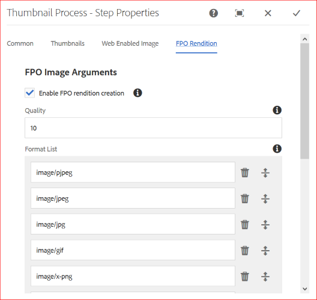

# 生成僅用於放置的Adobe InDesign格式副本 {#fpo-renditions}

| 版本 | 文章連結 |
| -------- | ---------------------------- |
| AEM as a Cloud Service  | [按一下這裡](https://experienceleague.adobe.com/docs/experience-manager-cloud-service/content/assets/admin/configure-fpo-renditions.html?lang=en) |
| AEM 6.5 | 本文 |

當將大規模資產從Experience Manager放入Adobe InDesign文檔時，創意專業人士必須等待一段相當長的時間 [放置資產](https://helpx.adobe.com/indesign/using/placing-graphics.html)。 同時，阻止用戶使用InDesign。 這會中斷創意流，並對用戶體驗造成負面影響。 Adobe允許臨時將小型格式副本放在InDesign文檔中以開始。 當需要最終輸出時，原始的全解析度資產將替換後台的臨時格式副本。 背景中的非同步更新加快了設計過程以提高生產效率，並且不會妨礙創造過程。

Adobe Experience Manager(AEM)提供僅用於放置的格式副本(FPO)。 這些FPO格式副本的檔案大小較小，但長寬比相同。 如果FPO格式副本不可用於資產，Adobe InDesign將改用原始資產。 此回退機制確保創作工作流不中斷即可繼續。

## 生成FPO格式副本的方法 {#approach-to-generate-fpo-renditions}

Experience Manager允許許多方法處理可用於生成FPO格式副本的影像。 最常見的兩種方法是使用內置的Experience Manager工作流和使用ImageMagick。 使用這兩種方法，可以配置新上載的資產和Experience Manager中存在的資產的格式副本生成。

可以使用ImageMagick處理影像，包括生成FPO格式副本。 這樣的格式副本被下採樣，即，如果原始影像的PPI大於72，則格式副本的像素尺寸按比例減小。 請參閱 [安裝並配置ImageMagick以與Experience Manager Assets協作](best-practices-for-imagemagick.md)。

|  | 使用Experience Manager的內置工作流 | 使用ImageMagick工作流 | 備注 |
|--- |--- |---|--- |
| 對於新資產 | 啟用FPO格式副本([幫助](#generate-renditions-of-new-assets-using-aem-workflow)) | 在Experience Manager工作流中添加ImageMagick命令行([幫助](#generate-renditions-of-new-assets-using-imagemagick)) | Experience Manager為每次上載執行DAM更新資產工作流。 |
| 對於現有資產 | 在新的專用Experience Manager工作流中啟用FPO格式副本([幫助](#generate-renditions-of-existing-assets-using-aem-workflow)) | 在新的專用Experience Manager工作流中添加ImageMagick命令行([幫助](#generate-renditions-of-existing-assets-using-imagemagick)) | 可以按需或批量建立現有資產的FPO格式副本。 |

>[!CAUTION]
>
>通過修改預設工作流的副本建立工作流以生成格式副本。 它防止在Experience Manager更新時覆蓋您的更改，例如安裝新的Service Pack。

## 使用Experience Manager工作流生成新資產的格式副本 {#generate-renditions-of-new-assets-using-aem-workflow}

以下是配置DAM更新資產工作流模型以啟用格式副本生成的步驟：

1. 按一下 **[!UICONTROL 工具]** > **[!UICONTROL 工作流]** > **[!UICONTROL 模型]**。 選擇 **[!UICONTROL DAM更新資產]** 模型，按一下 **[!UICONTROL 編輯]**。

1. 選擇 **[!UICONTROL 處理縮略圖]** 按一下 **[!UICONTROL 配置]**。

1. 按一下 **[!UICONTROL FPO格式副本]** 頁籤。 選擇 **[!UICONTROL 啟用FPO格式副本建立]**。

   

1. 調整 **[!UICONTROL 質量]** 添加或修改 **[!UICONTROL 格式清單]** 值。 預設情況下，要生成FPO格式副本的MIME類型清單為pjpeg、jpeg、jpg、gif、png、x-png和tiff。 按一下 **[!UICONTROL 完成]**。

   >[!NOTE]
   >
   >檔案類型JPEG、GIF、PNG、TIFF、PSD和BMP支援格式副本生成。

1. 要激活更改，請按一下 **[!UICONTROL 同步]**。

>[!NOTE]
>
>一側大於1280像素的影像不會保留FPO格式副本中的像素尺寸。

## 使用ImageMagick生成新資產的格式副本 {#generate-renditions-of-new-assets-using-imagemagick}

在Experience Manager中，在上載新資產時執行DAM更新資產工作流。 要使用ImageMagick處理新上載的資產的格式副本，請向工作流模型添加新命令。

1. 按一下 **[!UICONTROL 工具]** > **[!UICONTROL 工作流]** > **[!UICONTROL 模型]**。

1. 選擇 **[!UICONTROL DAM更新資產]** 模型，按一下 **[!UICONTROL 編輯]**。

1. 按一下 **[!UICONTROL 切換側面板]** 在左上角搜索命令行步驟。

1. 拖動 **[!UICONTROL 命令行]** 步驟並在 **[!UICONTROL 處理縮略圖]** 的子菜單。

1. 選擇 **[!UICONTROL 命令行]** 按一下 **[!UICONTROL 配置]**。

1. 將所需資訊添加為自定義 **[!UICONTROL 標題]** 和 **[!UICONTROL 說明]**。 例如，FPO格式副本（由ImageMagick提供）。

1. 在 **[!UICONTROL 參數]** 頁籤，添加相關 **[!UICONTROL MIME類型]** 提供應用命令的檔案格式清單。

   

1. 在 **[!UICONTROL 參數]** 的 **[!UICONTROL 命令]** 部分，添加相關的ImageMagick命令以生成FPO格式副本。

   下面是一個示例命令，它以JPEG格式生成FPO格式副本，以10%的質量設定將其下採樣為72 PPI，並通過平整輸出來處理多層Adobe Photoshop檔案：

   `convert -quality 10% -units PixelsPerInch ${filename} -resample 72 -flatten cq5dam.fpo.jpeg`

1. 要激活更改，請按一下 **[!UICONTROL 同步]**。

有關ImageMagick命令行功能的詳細資訊，請參見 [https://imagemagick.org](https://imagemagick.org)。

## 使用Experience Manager工作流生成現有資產的格式副本 {#generate-renditions-of-existing-assets-using-aem-workflow}

要使用Experience Manager工作流生成現有資產的FPO格式副本，請建立一個使用內置FPO格式副本選項的專用工作流模型。

1. 按一下 **[!UICONTROL 工具]** > **[!UICONTROL 工作流]** > **[!UICONTROL 模型]**。

1. 要建立模型，請按一下 **[!UICONTROL 建立]** > **[!UICONTROL 建立模型]**。

1. 添加有意義的 **[!UICONTROL 標題]** 和 **[!UICONTROL 名稱]**。

1. 選取模型，然後按一下 **[!UICONTROL 編輯]**。 按一下 **[!UICONTROL 頁面資訊]** > **[!UICONTROL 開啟屬性]**，然後選擇 **[!UICONTROL 臨時工作流]**。 這提高了可擴充性和效能。

1. 按一下&#x200B;******[!UICONTROL 儲存並關閉]**。

1. 按一下 **[!UICONTROL 切換側面板]** 在左上角，並搜索進程縮略圖步驟。

1. 選擇 **[!UICONTROL 處理縮略圖]** 按一下 **[!UICONTROL 配置]**。 關注 [使用Experience Manager工作流生成新資產格式副本的配置](#generate-renditions-of-new-assets-using-aem-workflow)。

1. 要激活更改，請按一下 **[!UICONTROL 同步]**。

## 使用ImageMagick生成現有資產的格式副本 {#generate-renditions-of-existing-assets-using-imagemagick}

要使用ImageMagick處理功能生成現有資產的FPO格式副本，請建立使用ImageMagick命令行執行此操作的專用工作流模型。

1. 按照步驟1到步驟3執行 [使用Experience Manager工作流生成現有資產格式副本的配置](#generate-renditions-of-existing-assets-using-aem-workflow) 的子菜單。

1. 按照從第4步到第8步 [使用ImageMagick生成新資產格式副本的配置](#generate-renditions-of-new-assets-using-imagemagick) 的子菜單。

## 查看FPO格式副本 {#view-fpo-renditions}

在工作流完成後，您可以檢查生成的FPO格式副本。 在Experience Manager Assets用戶介面中，按一下資產以開啟大型預覽。 開啟左滑軌，然後選擇「格式副本」。 或者，使用鍵盤快捷鍵 `Alt + 3` 的子菜單。

按一下 **[!UICONTROL FPO格式副本]** 載入其預覽。 或者，可以按一下右鍵格式副本並將其保存到檔案系統。

## 提示和限制 {#tips-limitations}

* 要使用基於ImageMagick的配置，請將ImageMagick與Experience Manager安裝在同一台電腦上。
* 要生成許多資產或整個儲存庫的FPO格式副本，請在低通信量持續時間內規劃和執行工作流。 為大量資產生成FPO格式副本是一項資源密集型活動，Experience Manager伺服器必須具有足夠的處理能力和可用記憶體。
* 有關效能和可擴充性，請參見 [精調影像](performance-tuning-guidelines.md)。
* 有關資產的一般命令行處理，請參見 [命令行處理程式處理資產](media-handlers.md)。
