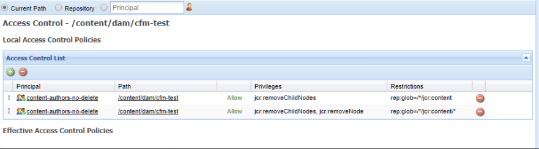

# 內容片段 - 刪除考量事項 {#content-fragments-delete-considerations}

在AEM中定義內容片段刪除原則前，請先檢閱這些重要考量事項。 內容片段是傳遞無頭內容的強大工具，刪除這些片段的含意必須謹慎考量。

## 權限 — 刪除或不刪除 {#permissions-delete-or-not-delete}

刪除內容的能力強大，但可能很敏感，許多行業需要限制和控制這些權限的分配方式。

關於刪除權限，內容片段必須在兩個層級考量：

1. **內容片段為單一實體。**

   * **使用案例**:需要編輯/更新內容片段 — 並刪 **除整個片段的使用者**。
   * **權限**:可  以透過「使 [用者」及/或「群組管理」來指派Deletepermission](/help/sites-administering/security.md#managing-permissions)。

2. **組成內容片段的多個子實體；例如，變異、子節點。**

   內容片段編輯器的基本操作要求可以刪除這種暫時的子元素。 例如，在操縱變異時；編輯中繼資料或管理相關內容時，也會一併啟用。

   * **使用案例**:需要編輯/更新內容片段的使用者， **不允許刪除整個片段**。
   * **權限**:請參 [閱僅編輯器功能所需的權限](#permissions-required-for-editor-functionality-only)。

>[!NOTE]
>
>當使用者沒有任何[Delete](/help/sites-administering/security.md#actions)權限時，內容片段編輯器會以&#x200B;*唯讀*&#x200B;模式運作。

>[!NOTE]
>
>另請參閱[如何在AEM](/help/sites-administering/audit-user-management-operations.md)中審核用戶管理操作。

## 僅編輯器功能所需的權限 {#permissions-required-for-editor-functionality-only}

對於需要編輯/更新內容片段而不允許他們刪除整個片段的使用者 ****，必須指派特定權限，因為內容片段編輯器的基本操作要求可以刪除暫時的子元素。

例如，在操縱變異時；編輯中繼資料或管理相關內容時，也會一併啟用。

>[!NOTE]
>
>編輯/更新內容片段所需的刪除權限，包含在透過「使用者」和/或「群組管理」指派的「刪除」權限[中。](/help/sites-administering/security.md#managing-permissions)

編輯/更新片段所需的權限需要套用至包含內容片段的節點，或適當的父節點（位於`/content/dam`下的任何層級）。 當指派給此父節點時，權限會套用至該分支內的所有節點。

例如，會保留所有內容片段的資料夾，例如：

* `/content/dam/contentfragments`

>[!CAUTION]
>
>也可以設定`/content/dam`的權限，因為所有內容片段都儲存在此處。
>
>不過，此動作也會將相同的刪除權限套用至&#x200B;*all*&#x200B;其他資產類型。

允許特定使用者和/或群組編輯/更新內容片段的權限先決條件為：

>[!NOTE]
>
>此清單顯示所需的所有權限，而不只是刪除權限。

* 對於內容片段節點或資料夾：

   * `jcr:addChildNodes`, `jcr:modifyProperties`

* 對於所有內容片段的`jcr:content`節點：

   * `jcr:addChildNodes`,  `jcr:modifyProperties` 和  `jcr:removeChildNodes`

* 對於所有內容片段`jcr:content`下的所有節點：

   * `jcr:addChildNodes`, `jcr:modifyProperties` 和 `jcr:removeChildNodes`,  `jcr:removeNode`

這些`remove`權限必須在CRXDE Lite](/help/sites-administering/user-group-ac-admin.md#access-right-management)內使用訪問控制清單進行管理。[

`add`和`modify`權限也可以在CRXDE Lite中管理，或使用「用戶管理」控制台。

例如，組`content-authors-no-delete`的`remove`權限定義：

