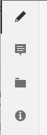

# 管理內容片段{#managing-content-fragments}

內容片段會儲存為&#x200B;**Assets**，因此主要是從&#x200B;**Assets**&#x200B;主控台管理。

>[!NOTE]
>
>內容片段隨後用於編寫頁面；請參閱使用內容片段進行頁面編寫](/help/sites-authoring/content-fragments.md)。[

## 建立內容片段 {#creating-content-fragments}

### 建立內容模型 {#creating-a-content-model}

[在建立具](/help/assets/content-fragments/content-fragments-models.md) 有結構化內容的內容片段之前，請啟用並建立內容片段模型。

>[!NOTE]
>
>如需範本的詳細資訊，請參閱[開發內容片段](/help/sites-developing/customizing-content-fragments.md);用於簡單內容片段。

### 建立內容片段 {#creating-a-content-fragment}

建立內容片段的方法（基本上）對於簡單和結構化片段都相同：

1. 導覽至您 **要建立** 片段的「資產」檔案夾。
1. 依序選 **擇「建立**」、「 **內容片段** 」以開啟精靈。
1. 嚮導的第一步要求您指定新片段的基礎。

   * 這可以是：

      * [範本](/help/sites-developing/content-fragment-templates.md)  — 例如簡 **單片段**

      * [模型](/help/assets/content-fragments/content-fragments-models.md)  — 用於建立需要結構化內容的片段；例如，機 **** 場模型
   * 將顯示所有可用的模板和模型。

   選取後，使用&#x200B;**Next**&#x200B;繼續。

   

1. 在「屬 **性** 」步驟中指定：

   * **基本**

      * **標題**

         片段標題。

         必要.

      * **說明**

      * **標記**
   * **進階**

      * **名稱**

         名稱；將用來形成URL。

         強制；會自動從標題衍生出，但可更新。

1. 選擇 **Create**  (建立) 以完成操作，然後選擇 **Open** the fragment for editing (開啟片段以進行編輯) 或返回控制 **台完成**。

## 內容片段的動作 {#actions-for-a-content-fragment}

在&#x200B;**Assets**&#x200B;主控台中，一系列動作可供內容片段使用，包括：

* 從工具列；選取片段後，所有適當的動作皆可使用。
* 作為[快速操作](/help/sites-authoring/basic-handling.md#quick-actions);個別片段卡片可用的動作子集。

選取片段以顯示包含適用動作的工具列：

* **下載**

   * 將片段儲存為ZIP檔案；您可以定義是否要包含元素、變數、中繼資料。

* **建立**
* **結帳**
* **屬性**

   * 可讓您檢視和/或編輯片段的中繼資料。

* **編輯**

   * 可讓您[開啟片段以編輯內容](/help/assets/content-fragments/content-fragments-variations.md)及其元素、變異、相關內容和中繼資料。

* **管理標記**
* **至集合**

   * 新增片段至集合。
   * 當[將集合與片段](/help/assets/content-fragments/content-fragments-assoc-content.md#adding-associated-content)關聯時，也可以執行此操作。

* **複製**/**貼上**

* **移動**
* **快速發佈**
* **管理發佈**
* **刪除**

>[!NOTE]
>
>其中許多是[資產](/help/assets/manage-assets.md)和/或[AEM案頭應用程式](https://docs.adobe.com/content/help/en/experience-manager-desktop-app/using/using.html)的標準動作。

## 開啟片段編輯器 {#opening-the-fragment-editor}

若要開啟片段以進行編輯：

>[!CAUTION]
>
>若要編輯內容片段，您需要[適當的權限](/help/sites-developing/customizing-content-fragments.md#asset-permissions)。 如果您遇到問題，請與系統管理員聯繫。

1. 使用&#x200B;**Assets**&#x200B;控制台導覽至內容片段的位置。
1. 開啟片段以進行編輯，方法為：

   * 按一下/點選片段或片段連結（取決於主控台檢視）。
   * 選取片段，然後從工具列中選取&#x200B;**編輯**。

   片段編輯器將開啟：

   

   >[!NOTE]
   >
   >1. 內容頁面上已參考片段時，會顯示訊息。
   >2. 可使用&#x200B;**切換側面板**&#x200B;表徵圖隱藏/顯示側面板。

1. 使用側面板中的圖示，導覽這三個模式：

   * 變數：[編輯內容](#editing-the-content-of-your-fragment)和[管理變數](#creating-and-managing-variations-within-your-fragment)

   * [註解](/help/assets/content-fragments/content-fragments-variations.md#annotating-a-content-fragment)
   * [相關聯的內容](#associating-content-with-your-fragment)
   * [中繼資料](#viewing-and-editing-the-metadata-properties-of-your-fragment)

   

1. 進行更改後，根據需要使用&#x200B;**Save**&#x200B;或&#x200B;**Cancel**。

   >[!NOTE]
   >
   >「儲 **存** 」和「取 **消」都會退出編輯器——請參閱「** 儲存」、「取消」和「版本」，以取得有關這兩個選項如何對內容片段運作的完整資訊。

## 儲存、取消和版本 {#save-cancel-and-versions}

>[!NOTE]
>
>也可以從時間軸](/help/assets/content-fragments/content-fragments-managing.md#timeline-for-content-fragments)建立、比較和還原版本。[

編輯器有兩個選項：

* **儲存**

   會儲存最新變更並退出編輯器。

   >[!CAUTION]
   >
   >若要編輯內容片段，您需要[適當的權限](/help/sites-developing/customizing-content-fragments.md#asset-permissions)。 如果您遇到問題，請與系統管理員聯繫。

   >[!NOTE]
   >
   >在選取&#x200B;**Save**&#x200B;之前，可以保留在編輯器中並進行一系列更改。

   >[!CAUTION]
   >
   >除了僅儲存您的變更，**Save**&#x200B;也會更新任何參考，並確保視需要刷新Dispatcher。 這些變更可能需要時間處理。 因此，對於大型/複雜/重載的系統，可能會產生效能影響。
   >
   >
   >使用&#x200B;**Save**，然後快速重新輸入片段編輯器以進行並儲存進一步的變更時，請記住這一點。

* **取消**

   會退出編輯器，而不儲存最新變更。

編輯您的內容片段AEM時，會自動建立版本，以確保在您&#x200B;**取消**&#x200B;變更時，可以還原先前的內容：

1. 開啟內容片段以編輯AEM時，會檢查是否有Cookie型Token，指出是否存在&#x200B;*編輯工作階段*:

   1. 如果找到代號，則會將片段視為現有編輯工作階段的一部分。
   2. 如果代號為&#x200B;*不可用，且使用者開始編輯內容，則會建立版本，並將此新編輯工作階段的代號傳送至用戶端，並儲存於Cookie中。*

2. 雖然有&#x200B;*作用中*&#x200B;編輯工作階段，但每600秒就會自動儲存所編輯的內容（預設值）。

   >[!NOTE]
   >
   >可使用`/conf`機制配置自動保存間隔。
   >
   >
   >預設值，請參閱：
   >
   >
   >`/libs/settings/dam/cfm/jcr:content/autoSaveInterval`

3. 如果用戶選擇&#x200B;**取消**&#x200B;編輯，則恢復在編輯會話開始時建立的版本，並刪除令牌以結束編輯會話。
4. 如果使用者選取&#x200B;**Save**&#x200B;編輯，則更新的元素/變數會持續存在，並移除代號以結束編輯工作階段。

## 編輯片段的內容 {#editing-the-content-of-your-fragment}

開啟片段後，您可以使用[Variations](/help/assets/content-fragments/content-fragments-variations.md)標籤來製作內容。

## 在片段中建立和管理變體 {#creating-and-managing-variations-within-your-fragment}

建立主內容後，您就可以建立和管理該內容的[變體](/help/assets/content-fragments/content-fragments-variations.md)。

## 將內容與您的片段關聯 {#associating-content-with-your-fragment}

您也可以[將內容](/help/assets/content-fragments/content-fragments-assoc-content.md)與片段關聯。 這會提供連線，讓資產（即影像）在新增至內容頁面時，可（選擇性）與片段搭配使用。

## 檢視和編輯片段的中繼資料（屬性） {#viewing-and-editing-the-metadata-properties-of-your-fragment}

您可以使用[Metadata](/help/assets/content-fragments/content-fragments-metadata.md)索引標籤來檢視和編輯片段的屬性。

## 內容片段時間軸 {#timeline-for-content-fragments}

除了標準選項外，[時間軸](/help/assets/manage-assets.md#timeline)還提供內容片段的特定資訊和動作：

* 查看有關版本、注釋和注釋的資訊
* 版本動作

   * **[回復到此版本](#reverting-to-a-version)** （選擇現有片段，然後選擇特定版本）

   * **[與目前的](#comparing-fragment-versions)** 比較（選取現有片段，然後選取特定版本）

   * 新增&#x200B;**Label**&#x200B;及/或&#x200B;**Comment**（選取現有片段，然後選取特定版本）

   * **另存為版本** （選取現有片段，然後是時間軸底部的向上箭頭）

* 註解動作

   * **刪除**

>[!NOTE]
>
>評論包括：
>
>* 所有資產的標準功能
>* 在時間軸中製作
>* 與片段資產相關

>
>
註解（適用於內容片段）包括：
>
>* 在片段編輯器中輸入
>* 特定於片段內選取的文字區段

>

例如：

## 比較片段版本 {#comparing-fragment-versions}

在您選取特定版本後，可從[時間軸](/help/assets/content-fragments/content-fragments-managing.md#timeline-for-content-fragments)中使用&#x200B;**Compare to Current**&#x200B;動作。

此選項將開啟：

* **目前**（最新）版本（左）

* 所選版本&#x200B;**v&lt;*x.y*>**（右）

它們會並排顯示，其中：

* 會強調顯示任何差異

   * 已刪除的文本 — 紅色
   * 插入的文本 — 綠色
   * 已更換文字 — 藍色

* 全螢幕圖示可讓您自行開啟任一版本；然後切換回平行檢視
* 您可以&#x200B;**還原**&#x200B;到特定版本
* **** Donewill會將您傳回主控台

>[!NOTE]
>
>比較片段時無法編輯片段內容。

## 回復為版本  {#reverting-to-a-version}

您可以還原為片段的特定版本：

* 直接從[時間軸](/help/assets/content-fragments/content-fragments-managing.md#timeline-for-content-fragments)。

   選擇所需的版本，然後選擇&#x200B;**還原為此版本**&#x200B;操作。

* 當[將版本與當前版本](/help/assets/content-fragments/content-fragments-managing.md#comparing-fragment-versions)比較時，您可以&#x200B;**還原**&#x200B;到所選版本。

## 發佈和參考片段 {#publishing-and-referencing-a-fragment}

>[!CAUTION]
>
>如果您的片段是以模型為基礎，則應確定[模型已發佈](/help/assets/content-fragments/content-fragments-models.md#publishing-a-content-fragment-model)。
>
>如果您發佈的內容片段尚未發佈模型，則選取清單會指出此點，且模型將會隨片段發佈。

內容片段必須發佈以便在發佈環境中使用。 可發佈：

* 建立後；從&#x200B;**Assets**&#x200B;控制台。
* 當您[發佈使用片段](/help/sites-authoring/content-fragments.md#publishing)的頁面時；片段會列在頁面參考中。

>[!CAUTION]
>
>發佈和/或參考片段後，製作者開啟片段並再次編輯時AEM會顯示警告。 這將警告對片段的變更也會影響參考的頁面。

## 刪除片段 {#deleting-a-fragment}

刪除片段：

1. 在&#x200B;**Assets**&#x200B;主控台中，導覽至內容片段的位置。
2. 選取片段。

   >[!NOTE]
   >
   >**Delete**&#x200B;動作無法作為快速動作使用。

3. 從工具欄中選擇&#x200B;**刪除**。
4. 確認&#x200B;**Delete**&#x200B;動作。

   >[!CAUTION]
   >
   >如果片段已在頁面中參考，您會看到警告訊息，並需要確認您要繼續執行強制刪 **除**。片段及其內容片段元件將會從任何內容頁面中刪除。
