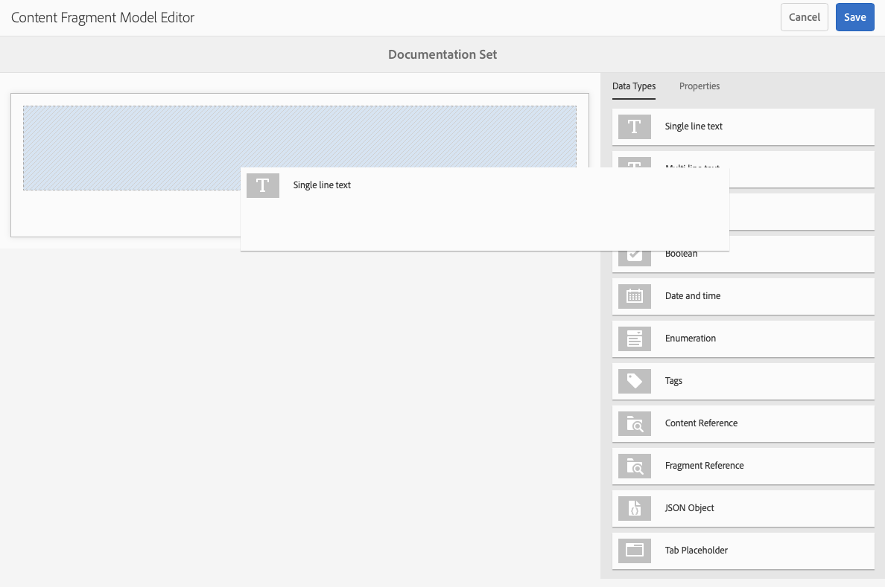

# 內容片段模型 {#content-fragment-models}

AEM中的內容片段模型為您的定義了內容結構 [內容片段，](/help/assets/content-fragments/content-fragments.md) 作為Headless內容的基礎。

若要使用內容片段模式，您可以：

1. [為您的執行個體啟用內容片段模型功能](/help/assets/content-fragments/content-fragments-configuration-browser.md)
1. [建立](#creating-a-content-fragment-model)、和 [設定](#defining-your-content-fragment-model)，您的內容片段模型
1. [啟用您的內容片段模型](#enabling-disabling-a-content-fragment-model) 用於建立內容片段時
1. [在所需的Assets資料夾上允許您的內容片段模型](#allowing-content-fragment-models-assets-folder) 透過設定 **原則**.

## 建立內容片段模型 {#creating-a-content-fragment-model}

1. 導覽至 **工具**， **資產**，然後開啟 **內容片段模型**.
1. 導覽至適合您的檔案夾 [設定](/help/assets/content-fragments/content-fragments-configuration-browser.md).
1. 使用 **建立** 以開啟精靈。

   >[!CAUTION]
   >
   >如果[尚未啟用使用內容片段模型](/help/assets/content-fragments/content-fragments-configuration-browser.md)，則&#x200B;**建立**&#x200B;選項將無法使用。

1. 指定「模 **型標題」**。您也可以新增 **標籤**， a **說明**，並選取 **啟用模型** 至 [啟用模型](#enabling-disabling-a-content-fragment-model) 如有需要。

   

1. 使用 **建立** 以儲存空白模型。 將顯示一則訊息，指出動作是否成功，您可以選取 **開啟** 立即編輯模型，或 **完成** 以返回主控台。

## 定義內容片段模型 {#defining-your-content-fragment-model}

內容片段模式透過以下選項有效定義了結果內容片段的結構 **[資料型別](#data-types)**. 使用模型編輯器，您可以新增資料型別的例項，然後進行設定以建立必填欄位：

>[!CAUTION]
>
>編輯現有內容片段模型可能會影響相依片段。

1. 導覽至 **工具**， **資產**，然後開啟 **內容片段模型**.

1. 導覽至容納您的內容片段模式的資料夾。

1. 開啟所需的模型 **編輯**；使用快速動作，或選取模型，然後從工具列選取動作。

   開啟模型編輯器後，會顯示：

   * 左：欄位已定義
   * 右：資 **料類型** ，可用於建立欄位( **和屬性** ，以供建立欄位後使用)

   >[!NOTE]
   >
   >當欄位為 **必填**，則 **標籤** 左窗格中會標示星號(**&#42;**)。

   

1. **新增欄位的方式**

   * 將欄位的所需資料型別拖曳至所需位置：

      

   * 將欄位新增至模型後，右側面板會顯示 **屬性** 可針對該特定資料型別定義的屬性。 您可以在此處定義該欄位的必要專案。

      * 許多屬性含義一目瞭然，如需更多詳細資訊，請參閱 [屬性](#properties).
      * 輸入 **欄位標籤** 將自動完成 **屬性名稱**   — 如果為空白，則之後可手動更新。

         >[!CAUTION]
         >
         >手動更新屬性時 **屬性名稱** 對於資料型別，請注意，名稱只能包含A-Z、a-z、0-9和下劃線「_」作為特殊字元。
         >
         >如果在舊版AEM中建立的模型包含非法字元，請移除或更新這些字元。
      例如：

      


1. **移除欄位**

   選取必填欄位，然後按一下/點選垃圾桶圖示。 系統會要求您確認動作。

   

1. 新增所有必要欄位，並視需要定義相關屬性。 例如：

   

1. 選取 **儲存** 以保留定義。

## 資料類型 {#data-types}

您可選取一些資料型別來定義模型：

* **單行文字**
   * 新增一行或多行文字的欄位；可以定義長度上限
* **多行文字**
   * 可以是RTF、純文字或Markdown的文字區域
* **數字**
   * 新增一或多個數字欄位
* **布林值**
   * 新增布林值核取方塊
* **日期和時間**
   * 新增日期和/或時間
* **列舉**
   * 新增一組核取方塊、選項按鈕或下拉式清單欄位
* **標記**
   * 允許片段作者存取及選取標籤區域
* **內容參考**
   * 參考任何型別的其他內容；可用於 [建立巢狀內容](#using-references-to-form-nested-content)
   * 如果參照了影像，您可以選擇顯示縮圖
* **片段參考**
   * 參考其他內容片段；可用於 [建立巢狀內容](#using-references-to-form-nested-content)
   * 可以設定此資料類型以允許片段作者：
      * 直接編輯參考的片段。
      * 根據適當的模型建立新的內容片段
* **JSON 物件**
   * 允許內容片段作者在片段的對應元素中輸入JSON語法。
      * 允許AEM儲存您從其他服務複製/貼上的直接JSON。
      * JSON將會通過，並在GraphQL中輸出為JSON。
      * 內容片段編輯器中包含JSON語法醒目提示、自動完成和錯誤醒目提示。
* **標籤預留位置**
   * 允許引進索引標籤，以便在編輯內容片段內容時使用。
這會在模型編輯器中顯示為分隔線，分隔內容資料型別清單的各個區段。 每個例項代表新索引標籤的開始。
在片段編輯器中，每個例項都會顯示為一個索引標籤。

      >[!NOTE]
      >
      >此資料型別僅用於格式設定，AEM GraphQL結構描述會忽略此資料型別。

## 屬性 {#properties}

許多屬性的含義一目瞭然，對於某些屬性，其他詳細資訊如下：


* **屬性名稱**

   手動更新資料型別的此屬性時，請注意名稱 **必須** contain *僅限* A-Z、a-z、0-9和下劃線「_」作為特殊字元。

   >[!CAUTION]
   >
   >如果在舊版AEM中建立的模型包含非法字元，請移除或更新這些字元。

* **呈現為**
在片段中實現/轉譯欄位的各種選項。 這通常可讓您定義作者將看到欄位的單一例項，還是允許建立多個例項。

* **欄位標籤**
輸入 
**欄位標籤** 將自動產生 **屬性名稱**，然後可視需要手動更新。

* **驗證**
基本驗證可透過以下機制提供： **必填** 屬性。 有些資料型別有額外的驗證欄位。 另請參閱 [驗證](#validation) 以取得更多詳細資料。

* 對於「多行」 **資料類型** ，可將「預設類型 **** 」定義為：

   * **RTF**
   * **Markdown**
   * **純文字**

   如果未指定，則預設值 **RTF文字** 用於此欄位。

   在內容 **片段模型中變更「預設類型** 」，只會在編輯器中開啟並儲存該片段後，對現有、相關的內容片段生效。

* **獨特**
從目前模型建立的所有內容片段中，內容（適用於特定欄位）必須是唯一的。

   這是用來確保內容作者不能重複已新增到相同模型其他片段中的內容。

   例如， **單行文字** 已呼叫的欄位 `Country` 在內容片段模型中，不能有值 `Japan` 兩個相依內容片段中的。 嘗試第二個執行個體時將發出警告。

   >[!NOTE]
   >
   >確保每個語言根的唯一性。

   >[!NOTE]
   >
   >變數可以有相同的 *獨特* 值代表相同片段的變數，但與其他片段變數中使用的值不同。

* 另請參閱 **[內容參考](#content-reference)** 以取得該特定資料型別及其屬性的詳細資訊。

* 另請參閱 **[片段參考（巢狀片段）](#fragment-reference-nested-fragments)** 以取得該特定資料型別及其屬性的詳細資訊。

<!--
* **Translatable**
  Checking the **Translatable** checkbox on a field in the Content Fragment Model editor will:

  * Ensure the field's property name is added to the translation configuration, context `/content/dam/<sites-configuration>`, if not already present. 
  * For GraphQL: set a `<translatable>` property on the Content Fragment field to `yes`, to allow GraphQL query filter for JSON output with only translatable content.
-->

## 驗證  {#validation}

各種資料型別現在包含定義在結果片段中輸入內容時的驗證需求的可能性：

* **單行文字**
   * 與預先定義的規則運算式比較。
* **數字**
   * 檢查特定值。
* **內容參考**
   * 測試特定型別的內容。
   * 只能參考指定檔案大小或更小的資產。
   * 只能參考預先定義的寬度和/或高度範圍（以畫素為單位）內的影像。
* **片段參考**
   * 測試特定內容片段模型。

## 使用參照來形成巢狀內容 {#using-references-to-form-nested-content}

內容片段可使用下列任一種資料型別來形成巢狀內容：

* **[內容參考](#content-reference)**
   * 提供其他內容的簡單參考；任何型別。
   * 可以為一個或多個引用（在產生的片段中）進行配置。

* **[片段參考](#fragment-reference-nested-fragments)** （巢狀片段）
   * 參考其他片段，視指定的特定模型而定。
   * 可讓您包含/擷取結構化資料。

      >[!NOTE]
      >
      >此方法特別值得關注，結合 [透過GraphQL使用內容片段的Headless內容傳送](/help/assets/content-fragments/content-fragments-graphql.md).
   * 可以為一個或多個參考（在產生的片段中）設定。

>[!NOTE]
>
>AEM對下列專案具有週期性保護：
>
>* 內容參考
   >  這可防止使用者新增對目前片段的引用。 這可能會導致空的片段引用選取器對話方塊。
>
>* GraphQL中的片段參考
   >  如果您建立深層查詢來傳回彼此參照的多個內容片段，則第一次出現時將傳回null。


### 內容參考 {#content-reference}

內容參考可讓您轉譯來自其他來源的內容；例如，影像或內容片段。

除了標準屬性之外，您還可以指定：

* 此 **根路徑** 任何參考內容
* 可參考的內容型別
* 檔案大小限制
* 如果影像被參照：
   * 顯示縮圖
   * 高度和寬度的影像限制


### 片段參考（巢狀片段） {#fragment-reference-nested-fragments}

片段參考會參考一或多個內容片段。 此功能在擷取內容以供應用程式使用時特別有意義，因為它可讓您擷取具有多個圖層的結構化資料。

例如：

* 定義員工詳細資訊的模型，包括：
   * 定義僱主（公司）的模型參考

```xml
type EmployeeModel {
    name: String
    firstName: String
    company: CompanyModel
}

type CompanyModel {
    name: String
    street: String
    city: String
}
```

>[!NOTE]
>
>這與以下內容特別相關： [透過GraphQL使用內容片段的Headless內容傳送](/help/assets/content-fragments/content-fragments-graphql.md).

除了標準屬性之外，您還可以定義：

* **呈現為**:

   * **多欄位**  — 片段作者可以建立多個個別參考

   * **片段參考**  — 允許片段作者選取片段的單一參考

* **模型型別**
可以選取多個模型。 製作內容片段時，必須使用這些模型建立任何參考的片段。

* **根路徑**
這會為引用的任何片段指定根路徑。

* **允許建立片段**

   這將允許片段作者根據適當的模型建立新片段。

   * **片段參考複合**  — 允許片段作者透過選擇多個片段來建立複合

   

>[!NOTE]
>
>已建立重複保護機制。 它禁止使用者在片段參考中選取目前的內容片段。 這可能會導致空的片段引用選取器對話方塊。
>
>GraphQL中也有片段參考的週期性保護。 如果您在兩個相互參照的內容片段之間建立深層查詢，則會傳回null。

## 啟用或停用內容片段模型 {#enabling-disabling-a-content-fragment-model}

為了完全控制內容片段模型的使用，它們有一個您可以設定的狀態。

### 啟用內容片段模型 {#enabling-a-content-fragment-model}

建立模型後，需要啟用模型，以便：

* 可在建立新內容片段時選擇。
* 可在內容片段模型中參照。
* 可供GraphQL使用；因此會產生結構描述。

若要啟用被標示為的模型：

* **草稿** ：mew （從未啟用）。
* **已停用** ：已特別停用。

您使用 **啟用** 選項來自：

* 選取所需的「模型」時，上方工具列。
* 對應的「快速動作」(Quick Action) （將滑鼠移到所需的模型上）。


### 停用內容片段模型 {#disabling-a-content-fragment-model}

也可以停用模型，以便：

* 模型無法再用來作為建立基礎 *新* 內容片段。
* 不過：
   * GraphQL結構描述會持續產生，且仍可查詢（以避免影響JSON API）。
   * 您仍可以從GraphQL端點查詢及傳回任何以模型為基礎的內容片段。
* 該模型無法再參照，但現有參照保持不變，並且仍可從GraphQL端點查詢和傳回。

停用標籤為的模型 **已啟用** 您使用 **停用** 選項來自：

* 選取所需的「模型」時，上方工具列。
* 對應的「快速動作」(Quick Action) （將滑鼠移到所需的模型上）。


## 允許資產資料夾中的內容片段模型 {#allowing-content-fragment-models-assets-folder}

若要實作內容控管，您可以設定 **原則** ，以控制允許在該資料夾中建立片段的內容片段模型。

>[!NOTE]
>
>其機制類似於 [允許頁面範本](/help/sites-authoring/templates.md#allowing-a-template-author) 在頁面的進階屬性中用於頁面及其子頁面。

若要設定 **原則** 的 **允許的內容片段模型**：

1. 導覽並開啟 **屬性** ，以取得所需的Assets資料夾。

1. 開啟 **原則** 索引標籤，您可以在其中設定：

   * **繼承自`<folder>`**

      建立新的子資料夾時，會自動繼承原則；如果子資料夾需要允許與父資料夾不同的模型，則可以重新設定原則（並中斷繼承）。

   * **允許的內容片段模型 (依路徑)**

      可允許多個模型。

   * **允許的內容片段模型（依標籤）**

      可允許多個模型。
   

1. **儲存** 任何變更。

允許用於資料夾的內容片段模型的解析如下：
* 此 **原則** 的 **允許的內容片段模型**.
* 如果為空，請嘗試使用繼承規則來決定原則。
* 如果繼承鏈結未傳遞結果，則檢視 **Cloud Services** 該資料夾的設定（也請先直接設定，然後透過繼承設定）。
* 如果上述任何一項均未傳遞任何結果，則該資料夾不允許有模型。

## 刪除內容片段模型 {#deleting-a-content-fragment-model}

>[!CAUTION]
>
>刪除內容片段模型可能會影響相依片段。

若要刪除內容片段模型：

1. 導覽至 **工具**， **資產**，然後開啟 **內容片段模型**.

1. 導覽至容納您的內容片段模式的資料夾。
1. 選取您的模型，然後 **刪除** （從工具列）。

   >[!NOTE]
   >
   >如果參照了模型，將會發出警告。 採取適當行動。

## 發佈內容片段模型 {#publishing-a-content-fragment-model}

內容片段模型需要在任何相關內容片段發佈時/之前發佈。

若要發佈內容片段模型：

1. 導覽至 **工具**， **資產**，然後開啟 **內容片段模型**.

1. 導覽至容納您的內容片段模式的資料夾。
1. 選取您的模型，然後 **發佈** （從工具列）。
主控台中將會指出已發佈狀態。

   >[!NOTE]
   >
   >如果您發佈的內容片段尚未發佈模型，選擇清單將指出這一點，模型將隨片段一起發佈。

## 取消發佈內容片段模型 {#unpublishing-a-content-fragment-model}

如果任何片段未參考內容片段模型，則可取消發佈這些模型。

若要取消發佈內容片段模型：

1. 導覽至 **工具**， **資產**，然後開啟 **內容片段模型**.

1. 導覽至容納您的內容片段模式的資料夾。
1. 選取您的模型，然後 **取消發佈** （從工具列）。
主控台中將會指出已發佈狀態。

## 內容片段模式 — 屬性 {#content-fragment-model-properties}

您可以編輯 **屬性** 的內容片段模型：

* **基本**
   * **模型標題**
   * **標記**
   * **說明**
   * **上傳影像**
