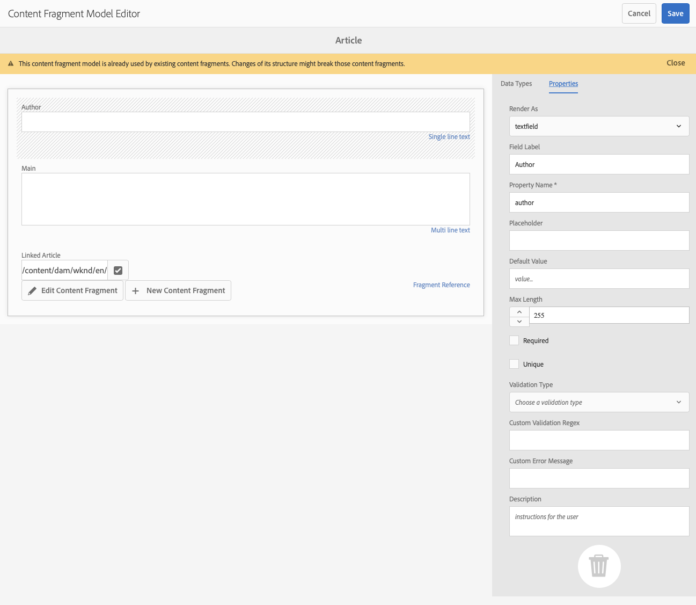

# AEM GraphQL API以搭配內容片段使用 {#graphql-api-for-use-with-content-fragments}

了解如何搭配AEM GraphQL API使用Adobe Experience Manager(AEM)中的內容片段進行無頭式內容傳送。

AEM GraphQL API搭配內容片段使用，主要是以標準的開放原始碼GraphQL API為基礎。

在AEM中使用GraphQL API，可在無頭式CMS實作中，有效率地將內容片段傳送至JavaScript用戶端：

* 避免像REST一樣迭代API請求，
* 確保傳送內容僅限於特定需求，
* 允許大量傳送要呈現為單一API查詢回應所需的內容。

>[!NOTE]
>
>GraphQL目前用於Adobe Experience Manager(AEM)的兩種（個別）情況：
>
>* [AEM商務會透過GraphQL取用來自商務平台的資料](/help/commerce/cif/integrating/magento.md).
>* AEM內容片段可與AEM GraphQL API(以標準GraphQL為基礎的自訂實作)搭配使用，提供結構化內容以供您的應用程式使用。


## GraphQL API {#graphql-api}

GraphQL是：

* &quot;*...API的查詢語言，以及使用您現有資料完成這些查詢的執行階段。 GraphQL提供API中資料的完整且易於理解的說明，讓客戶能夠確切要求所需內容，而無需其他任何內容，更輕鬆隨時間演變API，並啟用功能強大的開發人員工具。*」。

   請參閱 [GraphQL.org](https://graphql.org)

* &quot;*...靈活API層的開放規格。 將GraphQL放在您現有的後端，以前所未有的速度建置產品…….*」。

   請參閱 [探索GraphQL](https://www.graphql.com).

* *&quot;。..由Facebook於2012年在內部開發的資料查詢語言和規格，2015年公開開放。 它提供了基於REST的體系結構的替代方案，其目的是提高開發人員的工作效率，並最大限度地減少資料傳輸量。 GraphQL被數百個規模的組織用於生產……」*

   請參閱 [GraphQL Foundation](https://foundation.graphql.org/).

<!--
"*Explore GraphQL is maintained by the Apollo team. Our goal is to give developers and technical leaders around the world all of the tools they need to understand and adopt GraphQL.*". 
-->

如需GraphQL API的詳細資訊，請參閱下列章節（以及其他許多資源）:

* At [graphql.org](https://graphql.org):

   * [GraphQL簡介](https://graphql.org/learn)

   * [GraphQL規範](https://spec.graphql.org/)

* At [graphql.com](https://graphql.com):

   * [指南](https://www.graphql.com/guides/)

   * [教學課程](https://www.graphql.com/tutorials/)

   * [案例分析](https://www.graphql.com/case-studies/)

GraphQL for AEM實作以標準GraphQL Java程式庫為基礎。 請參閱：

* [graphQL.org - Java](https://graphql.org/code/#java)

* [GraphQL Java at GitHub](https://github.com/graphql-java)

### GraphQL術語 {#graphql-terminology}

GraphQL使用下列項目：

* **[查詢](https://graphql.org/learn/queries/)**

* **[結構和類型](https://graphql.org/learn/schema/)**:

   * 結構由AEM根據內容片段模型產生。
   * GraphQL會使用您的結構，說明GraphQL for AEM實作允許的類型和操作。

* **[欄位](https://graphql.org/learn/queries/#fields)**

* **[GraphQL 端點](#graphql-aem-endpoint)**
   * AEM中的路徑，可回應GraphQL查詢並提供GraphQL結構的存取。

   * 請參閱 [啟用GraphQL端點](#enabling-graphql-endpoint) 以取得詳細資訊。

請參閱 [(GraphQL.org)GraphQL簡介](https://graphql.org/learn/) 全面詳情，包括 [最佳實務](https://graphql.org/learn/best-practices/).

### GraphQL查詢類型 {#graphql-query-types}

透過GraphQL，您可以執行查詢以傳回：

* A **單次登入**

* A **[條目清單](https://graphql.org/learn/schema/#lists-and-non-null)**

AEM提供將查詢（兩種類型）轉換為 [持續查詢](/help/assets/content-fragments/persisted-queries.md),Dispatcher和CDN可快取這些資料。

### GraphQL查詢最佳作法（Dispatcher和CDN） {#graphql-query-best-practices}

此 [持續查詢](/help/assets/content-fragments/persisted-queries.md) 是用於發佈執行個體的建議方法，如下所示：

* 快取
* 由AEM集中管理

>[!NOTE]
>
>作者上通常沒有Dispatcher/CDN，因此使用持續的查詢不會帶來任何好處；除了測試它們。

不建議使用POST請求的GraphQL查詢，因為它們未進行快取，因此在預設例項上，Dispatcher會設定為封鎖這類查詢。

雖然GraphQL也支援GET要求，但這些可能會達到限制（例如URL的長度），而這些限制可以使用持續查詢來避免。

>[!NOTE]
>
>未來某個時間點可能會淘汰執行直接查詢的功能。

## GraphQL for AEM端點 {#graphql-aem-endpoint}

端點是用來存取GraphQL for AEM的路徑。 使用此路徑，您（或您的應用程式）可以：

* 存取GraphQL架構，
* 傳送您的GraphQL查詢，
* 接收回應(對您的GraphQL查詢)。

AEM中有兩種端點類型：

* 全域
   * 可供所有網站使用。
   * 此端點可使用所有Sites設定中的所有內容片段模型(定義於 [配置瀏覽器](/help/assets/content-fragments/content-fragments-configuration-browser.md#enable-content-fragment-functionality-in-configuration-browser))。
   * 如果有任何內容片段模型應在Sites設定之間共用，則應在全域Sites設定下建立。
* 站點配置：
   * 與Sites設定對應，如 [配置瀏覽器](/help/assets/content-fragments/content-fragments-configuration-browser.md#enable-content-fragment-functionality-in-configuration-browser).
   * 特定於指定的站點/項目。
   * Sites設定的特定端點會使用該特定Sites設定的內容片段模型，以及全域Sites設定的內容片段模型。

>[!CAUTION]
>
>內容片段編輯器可允許一個網站設定的內容片段參考另一個網站設定的內容片段（透過政策）。
>
>在這種情況下，並非所有內容都可使用Sites配置特定的端點進行檢索。
>
>內容作者應控制此情境；例如，建議將共用內容片段模型置於全域網站設定下，這樣做可能會很實用。

GraphQL for AEM全域端點的存放庫路徑為：

`/content/cq:graphql/global/endpoint`

您的應用程式可在請求URL中使用下列路徑：

`/content/_cq_graphql/global/endpoint.json`

若要啟用GraphQL for AEM的端點，您必須：

* [啟用您的GraphQL端點](#enabling-graphql-endpoint)
* [發佈您的GraphQL端點](#publishing-graphql-endpoint)

### 啟用GraphQL端點 {#enabling-graphql-endpoint}

若要啟用GraphQL端點，您必須先具備適當的設定。 請參閱 [內容片段 — 設定瀏覽器](/help/assets/content-fragments/content-fragments-configuration-browser.md).

>[!CAUTION]
>
>若 [尚未啟用內容片段模型的使用](/help/assets/content-fragments/content-fragments-configuration-browser.md), **建立** 選項將無法使用。

要啟用相應的端點，請執行以下操作：

1. 導覽至 **工具**, **資產**，然後選取 **GraphQL**.
1. 選擇 **建立**。
1. 此 **建立新的GraphQL端點** 對話框將開啟。 您可以在此處指定：
   * **名稱**:端點名稱；您可以輸入任何文字。
   * **使用GraphQL結構**:使用下拉式清單來選取所需的網站/專案。

   >[!NOTE]
   >
   >對話方塊中會顯示下列警告：
   >
   >* *如果未妥善管理，GraphQL 端點可能會導致資料安全性和效能問題。在建立端點後，請務必設定適當的權限。*


1. 確認為 **建立**.
1. 此 **後續步驟** 對話框將提供指向安全控制台的直接連結，以便您能夠確保新建立的端點具有適當的權限。

   >[!CAUTION]
   >
   >端點可供所有人存取。 這可能會（尤其是在發佈執行個體上）帶來安全疑慮，因為GraphQL查詢可能會對伺服器造成重量負載。
   >
   >您可以在端點上設定與您的使用案例相應的ACL。

### 發佈GraphQL端點 {#publishing-graphql-endpoint}

選取新端點，然後 **發佈** 讓它在所有環境中都能完全使用。

>[!CAUTION]
>
>端點可供所有人存取。
>
>在發佈例項上，這可能會造成安全疑慮，因為GraphQL查詢可能會對伺服器造成重量負載。
>
>您必須在端點上設定與您的使用案例相適用的ACL。

## GraphiQL介面 {#graphiql-interface}

標準的實施 [GraphiQL](https://graphql.org/learn/serving-over-http/#graphiql) 介面可與AEM GraphQL搭配使用。

>[!NOTE]
>
>GraphiQL包含在AEM的所有環境中（但只有在配置端點時才能存取/顯示）。
>
>在以前的版本中，安裝GraphiQL IDE時需要一個包。 如果您已安裝此程式碼，現在可將其移除。

此介面允許您直接輸入和測試查詢。

例如：

* `http://localhost:4502/content/graphiql.html`

這提供語法醒目提示、自動完成、自動建議等功能，以及歷史記錄和線上檔案：


>[!NOTE]
>
>如需詳細資訊，請參閱 [使用GraphiQL IDE](/help/assets/content-fragments/graphiql-ide.md).

## 製作和發佈環境的使用案例 {#use-cases-author-publish-environments}

使用案例取決於AEM環境的類型：

* 發佈環境；用於：
   * JS應用程式的查詢資料（標準使用案例）

* 製作環境；用於：
   * 查詢資料以用於「內容管理目的」：
      * AEM中的GraphQL目前是唯讀API。
      * REST API可用於CR(u)D操作。

## 權限 {#permission}

權限是存取資產所需的權限。

GraphQL查詢是在基礎請求的AEM使用者權限下執行。 如果使用者沒有某些片段的讀取存取權（儲存為資產），則這些片段不會成為結果集的一部分。

此外，使用者必須擁有GraphQL端點的存取權，才能執行GraphQL查詢。

## 結構產生 {#schema-generation}

GraphQL是強制類型的API，這表示資料必須依類型清楚地建構和組織。

GraphQL規格提供一系列准則，說明如何建立強大的API，以詢問特定執行個體上的資料。 若要這麼做，用戶端必須擷取 [結構](#schema-generation)，包含查詢所需的所有類型。

針對內容片段，GraphQL結構（結構和類型）以 **已啟用** [內容片段模型](/help/assets/content-fragments/content-fragments-models.md) 及其資料類型。

>[!CAUTION]
>
>所有GraphQL結構(衍生自已 **已啟用**)可透過GraphQL端點讀取。
>
>這意味著，您需要確保沒有敏感資料可用，因為這些資料可能會以這種方式洩露；例如，這包括可以在模型定義中顯示為欄位名稱的資訊。

例如，如果使用者建立的內容片段模型稱為 `Article`，則AEM會產生物件 `article` 屬於 `ArticleModel`. 此類型中的欄位與模型中定義的欄位和資料類型相對應。

1. 內容片段模型：

   

1. 對應的GraphQL架構（GraphiQL自動檔案輸出）:
   

   這會顯示產生的類型 `ArticleModel` 包含數個 [欄位](#fields).

   * 其中三個由使用者控制： `author`, `main` 和 `referencearticle`.

   * 其他欄位是由AEM自動新增的，是提供特定內容片段相關資訊的實用方法；在本例中， `_path`, `_metadata`, `_variations`. 這些 [輔助欄位](#helper-fields) 標籤有 `_` 區分使用者定義的項目和自動產生的項目。

1. 使用者根據文章模型建立內容片段後，就可透過GraphQL詢問。 如需範例，請參閱 [範例查詢](/help/assets/content-fragments/content-fragments-graphql-samples.md#graphql-sample-queries) (根據 [與GraphQL搭配使用的範例內容片段結構](/help/assets/content-fragments/content-fragments-graphql-samples.md#content-fragment-structure-graphql))。

在GraphQL for AEM中，結構是彈性的。 這表示每次建立、更新或刪除內容片段模型時，都會自動產生內容片段模型。 更新內容片段模型時，也會重新整理資料架構快取。

Sites GraphQL服務會監聽（在背景）對內容片段模型所做的任何修改。 檢測到更新時，只重新生成該架構的該部分。 此最佳化可節省時間並提供穩定性。

例如，如果您：

1. 安裝包含 `Content-Fragment-Model-1` 和 `Content-Fragment-Model-2`:

   1. GraphQL類型 `Model-1` 和 `Model-2` 即會產生。

1. 然後修改 `Content-Fragment-Model-2`:

   1. 僅 `Model-2` GraphQL類型將會更新。

   1. 而 `Model-1` 會保持不變。

>[!NOTE]
>
>請務必注意，以備您想透過REST api或其他方式，對內容片段模型執行大量更新時使用。

此結構會透過與GraphQL查詢相同的端點提供，且用戶端會處理以擴充功能呼叫結構的事實 `GQLschema`. 例如，執行簡單 `GET` 要求 `/content/cq:graphql/global/endpoint.GQLschema` 會導致輸出具有Content-type的架構： `text/x-graphql-schema;charset=iso-8859-1`.

### 結構產生 — 取消發佈的模型 {#schema-generation-unpublished-models}

巢狀內嵌內容片段時，可能會發佈上層內容片段模型，但未發佈參考模型。

>[!NOTE]
>
>AEM UI可防止此情況發生，但如果以程式設計方式或使用內容套件進行發佈，便可能發生。

發生此情況時，AEM會產生 *不完整* 上層內容片段模型的結構。 這表示會從架構中移除片段參考（取決於未發佈的模型）。

## 欄位 {#fields}

在結構中，有兩個基本類別的個別欄位：

* 您產生的欄位。

   選取 [欄位類型](#field-types) 可用來根據您如何設定內容片段模型來建立欄位。 欄位名稱取自 **屬性名稱** 欄位 **資料類型**.

   * 還有 **呈現為** 屬性，因為使用者可以設定某些資料類型；例如，作為單行文字或多欄位。

* GraphQL for AEM也會產生許多 [輔助欄位](#helper-fields).

   這些用於識別內容片段，或用於取得有關內容片段的詳細資訊。

### 欄位類型 {#field-types}

GraphQL for AEM支援類型清單。 所有支援的內容片段模型資料類型和對應的GraphQL類型皆會呈現：

| 內容片段模型 — 資料類型 | GraphQL類型 | 說明 |
|--- |--- |--- |
| 單行文字 | 字串， [字串] |  用於簡單字串，例如作者名稱、位置名稱等。 |
| 多行文本 | 字串 |  用於輸出文本，例如物品的本體 |
| 數量 |  漂浮， [浮點數] | 用於顯示浮點數和規則數 |
| 布林值 |  布林值 |  用於顯示複選框→簡單的true/false語句 |
| 日期和時間 | 日曆 |  用於以ISO 8086格式顯示日期和時間。 根據選取的類型，AEM GraphQL中有三種可用的方式： `onlyDate`, `onlyTime`, `dateTime` |
| 列舉 |  String |  用於從建立模型時定義的選項清單中顯示選項 |
|  標記 |  [String] |  用來顯示代表AEM中所用標籤之字串的清單 |
| 內容參考資料 |  String |  用於顯示AEM中其他資產的路徑 |
| 片段引用 |  *模型類型* |  用於參照建立模型時定義的特定模型類型的另一個內容片段 |

### 協助欄位 {#helper-fields}

除了使用者產生欄位的資料類型，GraphQL for AEM也會產生許多 *協助者* 欄位，以協助識別內容片段，或提供有關內容片段的其他資訊。

#### 路徑 {#path}

路徑欄位是作為GraphQL中的識別碼。 它代表AEM存放庫內的內容片段資產路徑。 我們選擇此作為內容片段的識別碼，因為它：

* 在AEM中是唯一的，
* 很容易被牽引。

下列程式碼會顯示根據內容片段模型建立的所有內容片段路徑 `Person`.

```xml
{
  personList {
    items {
      _path
    }
  }
}
```

若要擷取特定類型的單一內容片段，您也必須先判斷其路徑。 例如：

```xml
{
  personByPath(_path: "/content/dam/path/to/fragment/john-doe") {
    item {
      _path
      firstName
      name
    }
  }
}
```

請參閱 [範例查詢 — 單一特定城市片段](/help/assets/content-fragments/content-fragments-graphql-samples.md#sample-single-specific-city-fragment).

#### 中繼資料 {#metadata}

透過GraphQL,AEM也會公開內容片段的中繼資料。 中繼資料是描述內容片段的資訊，例如內容片段的標題、縮圖路徑、內容片段的說明、建立日期等。

由於中繼資料是透過結構編輯器產生，因此沒有特定結構，因此， `TypedMetaData` 已實作GraphQL類型，以公開內容片段的中繼資料。 `TypedMetaData` 顯示按以下標量類型分組的資訊：

| 欄位 |
|--- |
| `stringMetadata:[StringMetadata]!` |
| `stringArrayMetadata:[StringArrayMetadata]!` |
| `intMetadata:[IntMetadata]!` |
| `intArrayMetadata:[IntArrayMetadata]!` |
| `floatMetadata:[FloatMetadata]!` |
| `floatArrayMetadata:[FloatArrayMetadata]!` |
| `booleanMetadata:[BooleanMetadata]!` |
| `booleanArrayMetadata:[booleanArrayMetadata]!`  |
| `calendarMetadata:[CalendarMetadata]!` |
| `calendarArrayMetadata:[CalendarArrayMetadata]!` |

每個標量類型表示單個名稱值對或名稱值對陣列，其中該對的值屬於其分組的類型。

例如，如果您想要擷取內容片段的標題，我們知道此屬性是字串屬性，因此我們會查詢所有字串中繼資料：

要查詢元資料：

```xml
{
  personByPath(_path: "/content/dam/path/to/fragment/john-doe") {
    item {
      _path
      _metadata {
        stringMetadata {
          name
          value
        }
      }
    }
  }
}
```

如果您檢視「產生的GraphQL」結構，可以檢視所有中繼資料GraphQL類型。 所有模型類型都具有相同 `TypedMetaData`.

>[!NOTE]
>
>**一般和陣列中繼資料的差異**
>請記住 `StringMetadata` 和 `StringArrayMetadata` 兩者都指儲存在存放庫中的內容，而非擷取儲存庫的方式。
>
>例如，通過調用 `stringMetadata` 欄位中，您會收到儲存在存放庫中、作為 `String` ，若 `stringArrayMetadata` 您會收到儲存在存放庫中、儲存為 `String[]`.

請參閱 [中繼資料的範例查詢 — 列出題為GB的獎項中繼資料](/help/assets/content-fragments/content-fragments-graphql-samples.md#sample-metadata-awards-gb).

#### 變數 {#variations}

此 `_variations` 欄位已實作，以簡化查詢內容片段所含變數的程式。 例如：

```xml
{
  personByPath(_path: "/content/dam/path/to/fragment/john-doe") {
    item {
      _variations
    }
  }
}
```

請參閱 [範例查詢 — 具有已命名變數的所有城市](/help/assets/content-fragments/content-fragments-graphql-samples.md#sample-cities-named-variation).

>[!NOTE]
>
>如果內容片段不存在指定的變數，則主變數會傳回為（後援）預設值。

<!--
## Security Considerations {#security-considerations}
-->

## GraphQL變數 {#graphql-variables}

GraphQL允許在查詢中放置變數。 如需詳細資訊，請參閱 [GraphQL變數檔案](https://graphql.org/learn/queries/#variables).

例如，若要取得類型的所有內容片段 `Article` 具有特定變數時，您可以指定變數 `variation` 在GraphiQL中。


```xml
### query
query GetArticlesByVariation($variation: String!) {
    articleList(variation: $variation) {
        items {
            _path
            author
            _variations
        }
    }
}
 
### in query variables
{
    "variation": "uk"
}
```

## GraphQL指示 {#graphql-directives}

在GraphQL中，可以根據稱為GraphQL指示的變數變更查詢。

例如，您可以在 `adventurePrice` 欄位（在查詢中） `AdventureModels`，根據變數 `includePrice`.


```xml
### query
query GetAdventureByType($includePrice: Boolean!) {
  adventureList {
    items {
      adventureTitle
      adventurePrice @include(if: $includePrice)
    }
  }
}
 
### in query variables
{
    "includePrice": true
}
```

## 篩選 {#filtering}

您也可以在GraphQL查詢中使用篩選來傳回特定資料。

篩選使用以邏輯運算子和運算式為基礎的語法。

例如，下列（基本）查詢會篩選名稱為 `Jobs` 或 `Smith`:

```xml
query {
  personList(filter: {
    name: {
      _logOp: OR
      _expressions: [
        {
          value: "Jobs"
        },
        {
          value: "Smith"
        }
      ]
    }
  }) {
    items {
      name
      firstName
    }
  }
}
```

如需更多範例，請參閱：

* 的 [GraphQL for AEM擴充功能](#graphql-extensions)

* [使用此範例內容和結構的範例查詢](/help/assets/content-fragments/content-fragments-graphql-samples.md#graphql-sample-queries-sample-content-fragment-structure)

   * 而 [範例內容與結構](/help/assets/content-fragments/content-fragments-graphql-samples.md#content-fragment-structure-graphql) 準備用於示例查詢

* [基於WKND項目的查詢示例](/help/assets/content-fragments/content-fragments-graphql-samples.md#sample-queries-using-wknd-project)

## GraphQL for AEM — 擴充功能摘要 {#graphql-extensions}

使用GraphQL for AEM的查詢基本操作符合標準GraphQL規格。 若為具有AEM的GraphQL查詢，有幾個擴充功能：

* 如果您需要單一結果：
   * 使用模型名稱；eg city

* 如果您希望得到結果清單：
   * 新增 `List` 至模型名稱；例如，  `cityList`
   * 請參閱 [範例查詢 — 所有城市的所有資訊](#sample-all-information-all-cities)

* 篩選 `includeVariations` 包含在 `List` 查詢類型。  若要擷取查詢結果中的內容片段變化，請 `includeVariations` 篩選器必須設為 `true`.

   >[!CAUTION]
   >篩選 `includeVariations` 不能與系統生成的欄位一起使用 `_variation`.

* 如果要使用邏輯OR:
   * use ` _logOp: OR`
   * 請參閱 [Sample Query — 名為「Jobs」或「Smith」的所有人員](/help/assets/content-fragments/content-fragments-graphql-samples.md#sample-all-persons-jobs-smith)

* 邏輯AND也存在，但（通常）是隱含的

* 您可以查詢與內容片段模型內欄位對應的欄位名稱
   * 請參閱 [示例查詢 — 公司CEO和員工的完整詳細資訊](/help/assets/content-fragments/content-fragments-graphql-samples.md#sample-full-details-company-ceos-employees)

* 除了模型中的欄位之外，還有一些系統生成的欄位（前面有下划線）:

   * 內容：

      * `_locale` :揭示語言；基於語言管理器
         * 請參閱 [指定地區的多個內容片段的查詢範例](/help/assets/content-fragments/content-fragments-graphql-samples.md#sample-wknd-multiple-fragments-given-locale)
      * `_metadata` :顯示片段的中繼資料
         * 請參閱 [中繼資料的範例查詢 — 列出題為GB的獎項中繼資料](/help/assets/content-fragments/content-fragments-graphql-samples.md#sample-metadata-awards-gb)
      * `_model` :允許查詢內容片段模型（路徑和標題）
         * 請參閱 [從模型中查詢內容片段模型的範例](/help/assets/content-fragments/content-fragments-graphql-samples.md#sample-wknd-content-fragment-model-from-model)
      * `_path` :存放庫內內容片段的路徑
         * 請參閱 [範例查詢 — 單一特定城市片段](/help/assets/content-fragments/content-fragments-graphql-samples.md#sample-single-specific-city-fragment)
      * `_reference` :顯示參照；在RTF編輯器中包含內嵌參考
         * 請參閱 [具有預先擷取的參考之多個內容片段的查詢範例](/help/assets/content-fragments/content-fragments-graphql-samples.md#sample-wknd-multiple-fragments-prefetched-references)
      * `_variation` :顯示內容片段中的特定變體

         >[!NOTE]
         >
         >如果內容片段不存在指定的變數，則主變數會傳回為（後援）預設值。

         >[!CAUTION]
         >系統產生的欄位 `_variation` 無法與篩選器搭配使用 `includeVariations`.

         * 請參閱 [範例查詢 — 具有已命名變數的所有城市](/help/assets/content-fragments/content-fragments-graphql-samples.md#sample-cities-named-variation)
      * `_tags` :顯示包含標籤之內容片段或變體的ID;這是 `cq:tags` 識別碼。

         * 請參閱 [查詢示例 — 標籤為城市分行的所有城市的名稱](/help/assets/content-fragments/content-fragments-graphql-samples.md#sample-names-all-cities-tagged-city-breaks)
         * 請參閱 [附加特定標籤之指定模型的內容片段變異查詢範例](/help/assets/content-fragments/content-fragments-graphql-samples.md#sample-wknd-fragment-variations-given-model-specific-tag)

         >[!NOTE]
         >
         >您也可以列出內容片段的中繼資料來查詢標籤。
   * 操作：

      * `_operator` :應用特定運算子； `EQUALS`, `EQUALS_NOT`, `GREATER_EQUAL`, `LOWER`, `CONTAINS`, `STARTS_WITH`
         * 請參閱 [示例查詢 — 沒有「Jobs」名稱的所有人員](/help/assets/content-fragments/content-fragments-graphql-samples.md#sample-all-persons-not-jobs)
         * 請參閱 [範例查詢 — 所有冒險，其中 `_path` 開頭為特定首碼](/help/assets/content-fragments/content-fragments-graphql-samples.md#sample-wknd-all-adventures-cycling-path-filter)
      * `_apply` :具體條件；例如，  `AT_LEAST_ONCE`
         * 請參閱 [範例查詢 — 對項目必須至少發生一次的陣列進行篩選](/help/assets/content-fragments/content-fragments-graphql-samples.md#sample-array-item-occur-at-least-once)
      * `_ignoreCase` :在查詢時忽略大小寫
         * 請參閱 [示例查詢 — 名稱中包含SAN的所有城市（不考慮大小寫）](/help/assets/content-fragments/content-fragments-graphql-samples.md#sample-all-cities-san-ignore-case)


* GraphQL聯合類型受支援：

   * use `... on`
      * 請參閱 [具有內容參考之特定模型的內容片段查詢範例](/help/assets/content-fragments/content-fragments-graphql-samples.md#sample-wknd-fragment-specific-model-content-reference)

* 查詢巢狀片段時回退：

   * 如果請求的變異不存在於巢狀片段中，則 **主版** 將會傳回變數。

<!--
## Persisted Queries (Caching) {#persisted-queries-caching}

After preparing a query with a POST request, it can be executed with a GET request that can be cached by HTTP caches or a CDN.

This is required as POST queries are usually not cached, and if using GET with the query as a parameter there is a significant risk of the parameter becoming too large for HTTP services and intermediates.

Persisted queries must always use the endpoint related to the [appropriate Sites configuration](#graphql-aem-endpoint); so they can use either, or both:

* The Global configuration and endpoint
  The query has access to all Content Fragment Models.
* Specific Sites configuration(s) and endpoint(s)
  Creating a persisted query for a specific Sites configuration requires a corresponding Sites-configuration-specific endpoint (to provide access to the related Content Fragment Models). 
  For example, to create a persisted query specifically for the WKND Sites configuration, a corresponding WKND-specific Sites configuration, and a WKND-specific endpoint must be created in advance.

>[!NOTE]
>
>See [Enable Content Fragment Functionality in Configuration Browser](/help/assets/content-fragments/content-fragments-configuration-browser.md#enable-content-fragment-functionality-in-configuration-browser) for more details.
>
>The **GraphQL Persistence Queries** need to be enabled, for the appropriate Sites configuration. 

For example, if there is a particular query called `my-query`, which uses a model `my-model` from the Sites configuration `my-conf`:

* You can create a query using the `my-conf` specific endpoint, and then the query will be saved as following: 
`/conf/my-conf/settings/graphql/persistentQueries/my-query`
* You can create the same query using `global` endpoint, but then the query will be saved as following:
`/conf/global/settings/graphql/persistentQueries/my-query`

>[!NOTE]
>
>These are two different queries - saved under different paths. 
>
>They just happen to use the same model - but via different endpoints.


Here are the steps required to persist a given query:

1. Prepare the query by PUTing it to the new endpoint URL `/graphql/persist.json/<config>/<persisted-label>`.

   For example, create a persisted query:

   ```xml
   $ curl -X PUT \
       -H 'authorization: Basic YWRtaW46YWRtaW4=' \
       -H "Content-Type: application/json" \
       "http://localhost:4502/graphql/persist.json/wknd/plain-article-query" \
       -d \
   '{
     articleList {
       items{
           _path
           author
           main {
               json
           }
       }
     }
   }'
   ```

1. At this point, check the response.

   For example, check for success:

     ```xml
     {
       "action": "create",
       "configurationName": "wknd",
       "name": "plain-article-query",
       "shortPath": "/wknd/plain-article-query",
       "path": "/conf/wknd/settings/graphql/persistentQueries/plain-article-query"
     }
     ```

1. You can then replay the persisted query by GETing the URL `/graphql/execute.json/<shortPath>`.

   For example, use the persisted query:

   ```xml
   $ curl -X GET \
       http://localhost:4502/graphql/execute.json/wknd/plain-article-query
   ```

1. Update a persisted query by POSTing to an already existing query path.

   For example, use the persisted query:

   ```xml
   $ curl -X POST \
       -H 'authorization: Basic YWRtaW46YWRtaW4=' \
       -H "Content-Type: application/json" \
       "http://localhost:4502/graphql/persist.json/wknd/plain-article-query" \
       -d \
   '{
     articleList {
       items{
           _path
           author
           main {
               json
           }
         referencearticle {
           _path
         }
       }
     }
   }'
   ```

1. Create a wrapped plain query.

   For example:

   ```xml
   $ curl -X PUT \
       -H 'authorization: Basic YWRtaW46YWRtaW4=' \
       -H "Content-Type: application/json" \
       "http://localhost:4502/graphql/persist.json/wknd/plain-article-query-wrapped" \
       -d \
   '{ "query": "{articleList { items { _path author main { json } referencearticle { _path } } } }"}'
   ```

1. Create a wrapped plain query with cache control.

   For example:

   ```xml
   $ curl -X PUT \
       -H 'authorization: Basic YWRtaW46YWRtaW4=' \
       -H "Content-Type: application/json" \
       "http://localhost:4502/graphql/persist.json/wknd/plain-article-query-max-age" \
       -d \
   '{ "query": "{articleList { items { _path author main { json } referencearticle { _path } } } }", "cache-control": { "max-age": 300 }}'
   ```

1. Create a persisted query with parameters:

   For example:

   ```xml
   $ curl -X PUT \
       -H 'authorization: Basic YWRtaW46YWRtaW4=' \
       -H "Content-Type: application/json" \
       "http://localhost:4502/graphql/persist.json/wknd/plain-article-query-parameters" \
       -d \
   'query GetAsGraphqlModelTestByPath($apath: String!, $withReference: Boolean = true) {
     articleByPath(_path: $apath) {
       item {
         _path
           author
           main {
           plaintext
           }
           referencearticle @include(if: $withReference) {
           _path
           }
         }
       }
     }'
   ```

1. Executing a query with parameters.

   For example:

   ```xml
   $ curl -X POST \
       -H 'authorization: Basic YWRtaW46YWRtaW4=' \
       -H "Content-Type: application/json" \
       "http://localhost:4502/graphql/execute.json/wknd/plain-article-query-parameters;apath=%2fcontent2fdam2fwknd2fen2fmagazine2falaska-adventure2falaskan-adventures;withReference=false"

   $ curl -X GET \
       "http://localhost:4502/graphql/execute.json/wknd/plain-article-query-parameters;apath=%2fcontent2fdam2fwknd2fen2fmagazine2falaska-adventure2falaskan-adventures;withReference=false"
   ```

1. To execute the query on publish, the related persist tree need to replicated

   * Using a POST for replication:

     ```xml
     $curl -X POST   http://localhost:4502/bin/replicate.json \
       -H 'authorization: Basic YWRtaW46YWRtaW4=' \
       -F path=/conf/wknd/settings/graphql/persistentQueries/plain-article-query \
       -F cmd=activate
     ```

   * Using a package:
     1. Create a new package definition.
     1. Include the configuration (for example, `/conf/wknd/settings/graphql/persistentQueries`).
     1. Build the package.
     1. Replicate the package.

   * Using replication/distribution tool.
     1. Go to the Distribution tool.
     1. Select tree activation for the configuration (for example, `/conf/wknd/settings/graphql/persistentQueries`).

   * Using a workflow (via workflow launcher configuration):
     1. Define a workflow launcher rule for executing a workflow model that would replicate the configuration on different events (for example, create, modify, amongst others).

1. Once the query configuration is on publish, the same principles apply, just using the publish endpoint.

   >[!NOTE]
   >
   >For anonymous access the system assumes that the ACL allows "everyone" to have access to the query configuration.
   >
   >If that is not the case it will not be able to execute.

   >[!NOTE]
   >
   >Any semicolons (";") in the URLs need to be encoded.
   >
   >For example, as in the request to Execute a persisted query:
   >
   >```xml
   >curl -X GET \ "http://localhost:4502/graphql/execute.json/wknd/plain-article-query-parameters%3bapath=%2fcontent2fdam2fwknd2fen2fmagazine2falaska-adventure2falaskan-adventures;withReference=false"
   >```

## Querying the GraphQL endpoint from an External Website {#query-graphql-endpoint-from-external-website}

To access the GraphQL endpoint from an external website you need to configure the:

* [CORS Filter](#cors-filter)
* [Referrer Filter](#referrer-filter)
-->

### CORS篩選器 {#cors-filter}

>[!NOTE]
>
>如需AEM中CORS資源共用原則的詳細概述，請參閱 [了解跨原始資源共用(CORS)](https://experienceleague.adobe.com/docs/experience-manager-learn/foundation/security/understand-cross-origin-resource-sharing.html#understand-cross-origin-resource-sharing-(cors)).

若要存取GraphQL端點，必須在客戶Git存放庫中設定CORS原則。 若要這麼做，請為所需端點新增適當的OSGi CORS設定檔案。

此配置必須指定受信任的網站源 `alloworigin` 或 `alloworiginregexp` 必須授予其存取權。

例如，若要授予對GraphQL端點和持續查詢端點的存取權， `https://my.domain` 您可以使用：

```xml
{
  "supportscredentials":true,
  "supportedmethods":[
    "GET",
    "HEAD",
    "POST"
  ],
  "exposedheaders":[
    ""
  ],
  "alloworigin":[
    "https://my.domain"
  ],
  "maxage:Integer":1800,
  "alloworiginregexp":[
    ""
  ],
  "supportedheaders":[
    "Origin",
    "Accept",
    "X-Requested-With",
    "Content-Type",
    "Access-Control-Request-Method",
    "Access-Control-Request-Headers"
  ],
  "allowedpaths":[
    "/content/_cq_graphql/global/endpoint.json",
    "/graphql/execute.json/.*"
  ]
}
```

如果您已設定端點的虛名路徑，也可以在 `allowedpaths`.

### 推薦者篩選器 {#referrer-filter}

除了CORS設定，反向連結篩選器還必須設定為允許從第三方主機存取。

若要這麼做，請新增適當的OSGi反向連結篩選設定檔案，該設定檔案可：

* 指定受信任的網站主機名；heer `allow.hosts` 或 `allow.hosts.regexp`,
* 授予此主機名稱的存取權。

例如，若要授予具有反向連結之請求的存取權 `my.domain` 您可以：

```xml
{
    "allow.empty":false,
    "allow.hosts":[
      "my.domain"
    ],
    "allow.hosts.regexp":[
      ""
    ],
    "filter.methods":[
      "POST",
      "PUT",
      "DELETE",
      "COPY",
      "MOVE"
    ],
    "exclude.agents.regexp":[
      ""
    ]
}
```

>[!CAUTION]
>
>客戶仍有責任：
>
>* 僅授予受信任域的訪問權限
>* 確保未公開任何敏感資訊
>* 不使用通配符 [*] 語法；這將會停用GraphQL端點的已驗證存取權，並將其公開給全世界。


>[!CAUTION]
>
>所有GraphQL [綱要](#schema-generation) (衍生自已 **已啟用**)可透過GraphQL端點讀取。
>
>這意味著，您需要確保沒有敏感資料可用，因為這些資料可能會以這種方式洩露；例如，這包括可以在模型定義中顯示為欄位名稱的資訊。

## 驗證 {#authentication}

請參閱 [內容片段的遠端AEM GraphQL查詢驗證](/help/assets/content-fragments/graphql-authentication-content-fragments.md).

<!-- to be addressed later -->

<!--
## Sorting {#sorting}
-->

<!-- to be addressed later -->

<!--
## Paging {#paging}
-->

## 常見問題集 {#faqs}

出現的問題：

1. **Q**:&quot;*AEM的GraphQL API與Query Builder API有何不同？*&quot;

   * **A**:&quot;*AEM GraphQL API提供JSON輸出的總計控制，且是查詢內容的業界標準。
日後AEM將計畫投資AEM GraphQL API。*&quot;

## 教學課程 — AEM Headless和GraphQL快速入門 {#tutorial}

尋找實作教學課程？ 結帳 [AEM Headless和GraphQL快速入門](https://experienceleague.adobe.com/docs/experience-manager-learn/getting-started-with-aem-headless/graphql/overview.html) 端對端教學課程，說明如何在無頭CMS情境中，使用AEM GraphQL API建置和公開內容，並供外部應用程式使用。
