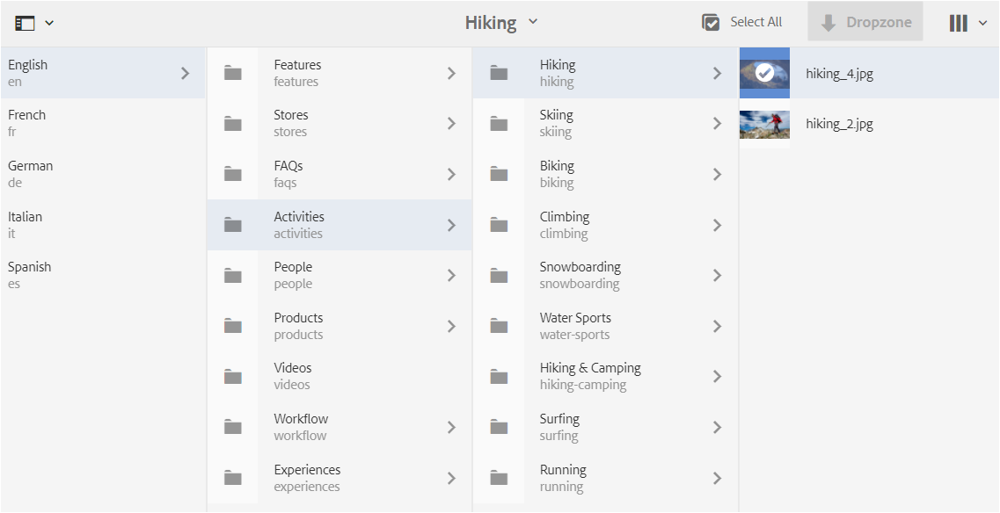

# 為內容片段建立翻譯項目 {#creating-translation-projects-for-content-fragments}

除資產外，Adobe Experience Manager(AEM)資產還支援語言複製工作流 [內容片段](/help/assets/content-fragments/content-fragments.md) （含變體）。 在內容片段上運行語言複製工作流不需要其他優化。 在每個工作流中，發送整個內容片段以供翻譯。

可以在內容片段上運行的工作流類型與為資產運行的工作流類型完全相同。 此外，每個工作流類型中可用的選項與資產的相應工作流類型下的可用選項相匹配。

可以在內容片段上運行以下類型的語言複製工作流：

**建立和翻譯**

在此工作流中，要翻譯的內容片段將被複製到要翻譯的語言的語言的語言根中。 此外，根據您選擇的選項，將在「項目」控制台中為內容片段建立翻譯項目。 根據設定，可以手動啟動翻譯項目，或允許在建立翻譯項目後立即自動運行。

**更新語言副本**

當源內容片段被更新或修改時，相應的語言環境/語言特定內容片段需要重新解碼。 該更新語言複製工作流翻譯另外一組內容片段並將其包括在特定語言環境的語言副本中。 在這種情況下，翻譯的內容片段被添加到已經包含先前翻譯的內容片段的目標資料夾中。

## 建立和轉換工作流 {#create-and-translate-workflow}

「建立和轉換」工作流包括以下選項。 與每個選項相關聯的過程步驟與與資產的相應選項相關聯的過程步驟相似。

* 僅建立結構：有關過程步驟，請參見 [僅為資產建立結構](translation-projects.md#create-structure-only)。
* 建立新的翻譯項目：有關過程步驟，請參見 [為資產建立新的翻譯項目](translation-projects.md#create-a-new-translation-project)。
* 添加到現有翻譯項目：有關過程步驟，請參見 [添加到資產的現有轉換項目](translation-projects.md#add-to-existing-translation-project)。

## 更新語言副本工作流 {#update-language-copies-workflow}

「更新語言副本」工作流包含以下選項。 與每個選項相關聯的過程步驟與與資產的相應選項相關聯的過程步驟相似。

* 建立新的翻譯項目：有關過程步驟，請參見 [為資產建立新的翻譯項目](translation-projects.md#create-a-new-translation-project) （更新工作流）。
* 添加到現有翻譯項目：有關過程步驟，請參見 [添加到資產的現有轉換項目](translation-projects.md#add-to-existing-translation-project) （更新工作流）。

您還可以為片段建立臨時語言副本，類似於為資產建立臨時副本的方式。 有關詳細資訊，請參閱 [為資產建立臨時語言副本](translation-projects.md#creating-temporary-language-copies)。

## 翻譯混合媒體片段 {#translating-mixed-media-fragments}

可AEM以翻譯包含各種類型媒體資產和集合的內容片段。 如果翻譯包含內嵌資產的內容片段，則這些資產的翻譯副本將儲存在目標語言根下。

如果內容片段包括集合，則集合內的資產與內容片段一起被翻譯。 資產的翻譯副本儲存在與源語言根目錄下源資產的物理位置相匹配的位置的適當目標語言根目錄中。

要能夠翻譯包括混合媒體的內容片段，請首先編輯預設翻譯框架以啟用內聯資產和與內容片段關聯的集合的翻譯。

1. 按一下/點擊AEM徽標，然後導航至 **[!UICONTROL 工具>部署>Cloud Services]**。
1. 定位 **[!UICONTROL 翻譯整合]** 在 **[!UICONTROL Adobe Marketing Cloud]**，按一下/點擊 **[!UICONTROL 顯示配置]**。

   

1. 在可用配置清單中，按一下/點擊 **[!UICONTROL 預設配置（翻譯整合配置）]** 開啟 **[!UICONTROL 預設配置]** 的子菜單。

   

1. 按一下 **[!UICONTROL 編輯]** 來顯示 **[!UICONTROL 翻譯配置]** 對話框。

   

1. 導航到 **[!UICONTROL 資產]** ，然後選擇 **[!UICONTROL 內嵌媒體資產和關聯集合]** 從 **[!UICONTROL 翻譯內容片段資產]** 清單框。 按一下/點擊 **[!UICONTROL 確定]** 的子菜單。

   

1. 從英文根資料夾中，開啟內容片段。

   

1. 按一下/點擊 **[!UICONTROL 插入資產]** 表徵圖

   

1. 將資產插入內容片段。

   

1. 按一下/點擊 **[!UICONTROL 關聯內容]** 表徵圖

   

1. 按一下/點擊 **[!UICONTROL 關聯內容]**。

   

1. 選擇集合併將其包含到內容片段中。 按一下/點擊 **[!UICONTROL 保存]**。

   

1. 選擇內容片段，然後按一下/點擊 **[!UICONTROL 全球導航]** 表徵圖
1. 選擇 **[!UICONTROL 引用]** 的子菜單。 **[!UICONTROL 引用]** 的子菜單。

   

1. 按一下/點擊 **[!UICONTROL 語言副本]** 在 **[!UICONTROL 副本]** 顯示語言副本。

   

1. 按一下/點擊 **[!UICONTROL 建立和翻譯]** 顯示 **[!UICONTROL 建立和翻譯]** 對話框。

   

1. 從 **[!UICONTROL 目標語言]** 清單框。

   

1. 從 **[!UICONTROL 項目]** 清單框。

   

1. 在中指定項目的標題 **[!UICONTROL 項目標題]** 框，然後按一下/點擊 **建立**。

   

1. 導航到 **[!UICONTROL 項目]** 控制台，並開啟所建立的翻譯項目的項目資料夾。

   

1. 按一下/點擊項目磁貼以開啟項目詳細資訊頁面。

   

1. 在「翻譯作業」磁貼中，驗證要翻譯的資產數。
1. 從 **[!UICONTROL 翻譯作業]** 平鋪，啟動翻譯作業。

   

1. 按一下「翻譯作業」磁貼底部的橢圓以顯示翻譯作業的狀態。

   

1. 按一下/點擊內容片段以檢查已轉換的關聯資產的路徑。

   

1. 在「集合」控制台中查看集合的語言副本。

   

   請注意，僅翻譯集合的內容。 集合本身不被翻譯。

1. 導航到已轉換的關聯資產的路徑。 觀察已翻譯的資產儲存在目標語言根下。

   

1. 導航到與內容片段一起翻譯的集合中的資產。 請注意，資產的翻譯副本以適當的目標語言根儲存。

   

   >[!NOTE]
   >
   >將內容片段添加到現有項目或執行更新工作流的過程與資產的相應過程類似。 有關這些程式的指導，請參閱有關資產的程式。
