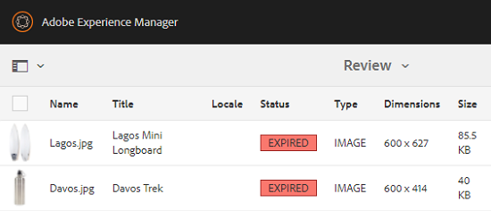

# 資產的 Digital Rights Management {#digital-rights-management-in-assets}

| 版本 | 文章連結 |
| -------- | ---------------------------- |
| AEM as a Cloud Service  | [按一下這裡](https://experienceleague.adobe.com/docs/experience-manager-cloud-service/content/assets/manage/drm.html?lang=en) |
| AEM 6.5 | 本文章 |

數位資產通常與指定使用條款與期間的授權相關聯。 因為 [!DNL Adobe Experience Manager Assets] 已與 [!DNL Experience Manager] 平台，您可以有效率地管理資產到期資訊和資產狀態。 您也可以將授權資訊與資產建立關聯。

## 資產有效期 {#asset-expiration}

資產到期是強制執行資產授權要求的有效方式。 這可確保在已發佈資產過期時將其取消發佈，從而避免出現任何授權違規的可能性。 沒有管理員許可權的使用者無法編輯、複製、移動、發佈和下載過期的資產。

您可以在以下位置檢視資產的到期狀態： [!DNL Assets] 卡片檢視和清單檢視中的主控台。

*圖：在清單檢視中 [!UICONTROL 狀態] 欄顯示 [!UICONTROL 已過期] 橫幅。*

您可以在以下位置檢視資產的到期狀態： [!UICONTROL 時間表] 在左側邊欄中。

>[!NOTE]
>
>對於不同時區的使用者，資產到期日的顯示方式會有所不同。

您也可以檢視中資產的到期狀態 **[!UICONTROL 引用]** 邊欄。 它可管理資產到期狀態以及複合資產和參照的子資產、集合和專案之間的關係。

1. 導覽至您要檢視參照網頁和複合資產的資產。
1. 選取資產並開啟 **[!UICONTROL 引用]** 在左側邊欄中。 對於已到期的資產， [!UICONTROL 引用] 邊欄顯示到期狀態 **[!UICONTROL 資產已過期]** 在頂端。

   

   如果資產具有過期的子資產，則 [!UICONTROL 引用] 邊欄顯示狀態 **[!UICONTROL 資產已過期的子資產]**.

   

### 搜尋過期的資產 {#search-expired-assets}

您可以在「搜尋」面板中搜尋過期的資產，包括過期的子資產。

1. 在 [!DNL Assets] 主控台，按一下 **[!UICONTROL 搜尋]** 工具列以顯示Omnisearch方塊。

1. 將游標置於Omnisearch方塊中，選取 `Enter` 鍵以顯示搜尋結果頁面。
1. 在左側邊欄中開啟搜尋面板。 按一下 **[!UICONTROL 到期狀態]** 選項以展開它。

   

1. 選擇 **[!UICONTROL 已過期]**. 篩選搜尋結果後，只會顯示已過期的資產。

當您選擇 **[!UICONTROL 已過期]** 選項， [!DNL Assets] 控制檯只會顯示複合資產所參考的過期資產和子資產。 參考過期子資產的複合資產不會在子資產過期後立即顯示。 相反地，它們會在以下時間後顯示： [!DNL Experience Manager] 偵測到這些工具會在下次排程器執行時參考過期的子資產。

如果您將已發佈資產的到期日修改為早於目前排程器週期的日期，排程仍會在下次執行時偵測此資產為已到期資產，並據此反映其狀態。

此外，如果故障或錯誤阻止排程器在目前週期中偵測到已到期的資產，排程器會在下一個週期中重新檢查這些資產，並偵測其已到期狀態。

若要啟用 [!DNL Assets] 主控台若要顯示參照的複合資產以及過期的子資產，請設定 **[!UICONTROL Adobe CQ DAM到期通知]** 中的工作流程 [!DNL Experience Manager] 組態管理員。

1. 開啟 [!DNL Experience Manager] 組態管理員。
1. 選擇 **[!UICONTROL Adobe CQ DAM到期通知]**. 根據預設， **[!UICONTROL 基於時間的排程器]** 選取，排程工作以在特定時間檢查資產是否已過期的子資產。 工作完成後，具有過期子資產和參考資產的資產會在搜尋結果中顯示為過期。

1. 要定期運行作業，請清除「基於時 **[!UICONTROL 間的調度程式規則]** 」欄位，並在「定期調度程式」欄位中以秒為單 **[!UICONTROL 位修改時間]** 。例如，範例運算式 `0 0 0 * * ?` 會在00小時觸發工作。
1. 選取 **[!UICONTROL 傳送電子郵件]** ，在資產過期時接收電子郵件。

   >[!NOTE]
   >
   >僅限資產建立者（上傳特定資產到的人） [!DNL Assets])會在資產過期時收到電子郵件。 另請參閱 [如何設定電子郵件通知](/help/sites-administering/notification.md) 以取得關於整體設定電子郵件通知的其他詳細資訊 [!DNL Experience Manager] 層級。

1. 在 **[!UICONTROL 事先通知（以秒為單位）]** 欄位，指定當您想要收到有關到期的通知，資產到期之前的時間秒數。 資產建立者會在資產到期前收到訊息，通知您資產將在指定時間後到期。 資產過期後，您會收到另一則通知，確認資產已過期。 此外，過期資產也會停用。

1. 按一下「**[!UICONTROL 儲存]**」。

## 資產狀態 {#asset-states}

此 [!DNL Assets] 主控台可顯示資產的各種狀態。 根據特定資產的目前狀態，其卡片檢視會顯示描述其狀態的標籤，例如，已過期、已發佈、已核准、已拒絕等。

1. 在 [!DNL Assets] 使用者介面，選取資產。
1. 按一下 **[!UICONTROL 發佈]** 工具列中的。 如果您沒有看到 **發佈** 在工具列上，按一下 **[!UICONTROL 更多]** 在工具列上並找到 **[!UICONTROL 發佈]**  選項。
1. 選擇 **[!UICONTROL 發佈]** ，然後關閉確認對話方塊。
1. 結束選取模式。 資產的發佈狀態會顯示在卡片檢視的資產縮圖底部。 在清單檢視中，「已發佈」欄會顯示資產的發佈時間。

   

1. 若要顯示其資產詳細資訊頁面，請前往 [!DNL Assets] 介面，選取資產並按一下 **[!UICONTROL 屬性]** .

1. 在 [!UICONTROL 進階] 索引標籤中，設定資產的到期日 **[!UICONTROL 過期]** 欄位。

   

   *圖： [!UICONTROL 進階] 索引標籤在資產中 [!UICONTROL 屬性] 頁面以設定資產有效期。*

1. 按一下 **[!UICONTROL 儲存]** 然後按一下 **[!UICONTROL 關閉]** 以顯示「資產」主控台。
1. 資產的發佈狀態會指出卡片檢視中資產縮圖底部的過期狀態。 在清單檢視中，資產的狀態會顯示為 **[!UICONTROL 已過期]**.

   

1. 在 [!DNL Assets] 主控台，選取資料夾並在資料夾上建立稽核任務。
1. 稽核及核准/拒絕稽核任務中的資產，然後按一下 **[!UICONTROL 完成]**.
1. 導覽至您建立稽核任務的資料夾。 您核准/拒絕的資產狀態會顯示在卡片檢視的底部。 在清單檢視中，核准和到期狀態會顯示在適當的欄中。

   

1. 若要根據資產的狀態來搜尋資產，請按一下 **[!UICONTROL 搜尋]**  以顯示Omnisearch列。
1. 選取 `Return` 並按一下 [!DNL Experience Manager] 以顯示「搜尋」面板。
1. 在搜尋面板中，按一下 **[!UICONTROL 發佈狀態]** 並選取 **[!UICONTROL 已發佈]** 若要在中搜尋已發佈的資產 [!DNL Assets].

   

1. 按一下 **[!UICONTROL 核准狀態]** 並按一下適當的選項，以搜尋已核准或已拒絕的資產。

   

1. 若要根據資產的到期狀態來搜尋資產，請在「搜尋」面 **[!UICONTROL 板中選取「到期狀態]** 」，然後選擇適當的選項。

   

1. 您也可以根據各種搜尋面向下的狀態組合來搜尋資產。 例如，您可以在搜尋Facet中選取適當的選項，以搜尋已在稽核任務中核准且尚未過期的已發佈資產。

   

## Digital Rights Management於 [!DNL Assets] {#digital-rights-management-in-assets-1}

此功能強制接受授權合約，您才能從下載授權資產 [!DNL Adobe Experience Manager Assets].

如果您選取受保護的資產並按一下 **[!UICONTROL 下載]**，您會重新導向至授權頁面以接受授權合約。 如果您不接受授權合約，則 **[!UICONTROL 下載]** 選項無法使用。

如果選取範圍包含多個受保護的資產，請一次選取一個資產、接受授權合約，然後繼續下載資產。

如果符合下列任一條件，資產即視為受保護：

* 資產中繼資料屬性 `xmpRights:WebStatement` 指向包含資產授權協定的頁面的路徑。
* 資產中繼資料屬性的值 `adobe_dam:restrictions` 是指定授權合約的原始HTML。

>[!NOTE]
>
>位置 `/etc/dam/drm/licenses` 用於儲存舊版中的授權 [!DNL Experience Manager] 已過時。
>
>如果您建立或修改許可證頁面，或將它們從先前的 [!DNL Experience Manager] 發行版本，Adobe建議您將它們儲存在 `/apps/settings/dam/drm/licenses` 或 `/conf/&ast;/settings/dam/drm/licenses`.

### 下載受DRM保護的資產 {#downloading-drm-assets}

1. 在卡片檢視中，選取您要下載的資產，然後按一下 **[!UICONTROL 下載]**.
1. 在「版 **[!UICONTROL 權管理]** 」頁面中，從清單中選取您要下載的資產。
1. 在 [!UICONTROL 授權] 窗格，選擇 **[!UICONTROL 同意]**. 資產旁會出現核取標籤。 按一下 **[!UICONTROL 下載]** 選項。

   >[!NOTE]
   >
   >此 **[!UICONTROL 下載]** 只有當您選擇同意受保護資產的授權合約時，才會啟用此選項。 但是，如果您的選擇同時包含受保護和未受保護的資產，則只有受保護的資產會列在窗格和 **[!UICONTROL 下載]** 啟用選項以下載未受保護的資產。 若要同時接受多個受保護資產的授權合約，請從清單中選取資產，然後選擇「同 **[!UICONTROL 意」]**。

   

1. 在對話方塊中，按一下 **[!UICONTROL 下載]** 以下載資產或其轉譯。
