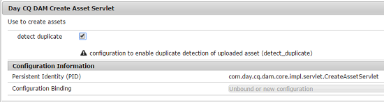

# 可偵測重複資產 {#enable-detection-of-duplicate-assets}

如果您嘗試上傳存在於Adobe Experience Manager(AEM)Assets中的資產，重複偵測功能會將其識別為重複。 預設會停用重複偵測。 要啟用該功能，請執行以下步驟：

1. 存取以開啟「AEM Web Console設定」頁 `https://[aem_server]:[port]/system/console/configMgr`面。
1. 編輯servlet日CQ DAM創 **[!UICONTROL 建資產的配置]**。
1. 選取「偵 **[!UICONTROL 測重複]** 」選項，然後按一下／點選「 **[!UICONTROL 儲存」]**。

   

   *圖：在servlet中選擇檢測重複選項*

AEM Assets現在已啟用偵測重複功能。 當使用者嘗試上傳AEM中存在的資產時，系統會檢查衝突並指出衝突。 資產使用儲存於的SHA-1雜湊來識別，這表 `jcr:content/metadata/dam:sha1`示不論檔案名稱為何，都會偵測到重複資產。

>[!MORELIKETHIS]
>
>* [現有儲存庫中重複的資產（社區成員的教程）](https://experience-aem.blogspot.com/2019/06/aem-65-find-duplicate-assets-binaries-in-existing-repository.html)

