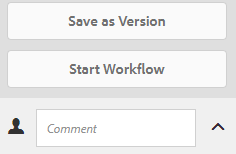

# 了解、套用和組織智慧標籤 {#enhanced-smart-tags}

| 版本 | 文章連結 |
| -------- | ---------------------------- |
| AEM as a Cloud Service  | [按一下這裡](https://experienceleague.adobe.com/docs/experience-manager-cloud-service/content/assets/manage/smart-tags.html?lang=en) |
| AEM 6.5 | 本文 |

處理數位資產的組織，在資產中繼資料中越來越多地使用分類法控制的辭匯。 基本上，它包含員工、合作夥伴和客戶通常用來參考和搜尋特定類別的數位資產的關鍵字清單。 使用分類控制的辭匯來標籤資產，可確保輕鬆識別及擷取資產。

與自然語言辭匯相比，根據商業分類法標籤數位資產有助於使其與公司的業務一致，並確保搜尋中出現最相關的資產。

例如，汽車製造商可以用型號標籤汽車影像，以便在搜索各種型號的影像以設計促銷活動時，只顯示相關影像。

若要讓智慧內容服務套用正確的標籤，請加以訓練以辨識您的分類法。 若要訓練服務，請先組織一組最能說明這些資產的資產和標籤。 為協助服務學習，請將這些標籤套用至資產，並執行訓練工作流程。

標籤完成訓練並準備就緒後，服務現在可以透過標籤工作流程將這些標籤套用至資產。

在背景中，智慧內容服務會使用Adobe Sensei AI架構，根據您的標籤結構和商業分類訓練其影像識別演算法。 然後，系統會使用此內容智慧，將相關標籤套用至不同的資產集。

智慧內容服務是托管於 [!DNL Adobe Developer Console]. 若要在 [!DNL Adobe Experience Manager]，系統管理員必須將 [!DNL Experience Manager] 部署 [!DNL Adobe Developer Console].

總而言之，以下是使用智慧內容服務的主要步驟：

* 上線
* 檢閱資產和標籤（分類法定義）
* 訓練智慧內容服務
* 自動標籤

## 先決條件和支援的格式 {#prerequisites}

您必須先確定下列項目，才能建立上的整合 [!DNL Adobe Developer Console]:

* 具有組織管理員權限的Adobe ID帳戶。
* 為貴組織啟用智慧內容服務。
* 要將智慧內容服務基本包添加到部署，請獲得許可 [!DNL Adobe Experience Manager Sites] 基本包和 [!DNL Assets] 附加元件。

服務會將智慧標籤套用至下列MIME類型的資產：

* `image/jpeg`
* `image/tiff`
* `image/png`
* `image/bmp`
* `image/gif`
* `image/pjpeg`
* `image/x-portable-anymap`
* `image/x-portable-bitmap`
* `image/x-portable-graymap`
* `image/x-portable-pixmap`
* `image/x-rgb`
* `image/x-xbitmap`
* `image/x-xpixmap`
* `image/x-icon`
* `image/photoshop`
* `image/x-photoshop`
* `image/psd`
* `image/vnd.adobe.photoshop`

服務會套用智慧標籤至下列MIME類型的資產轉譯：

* `image/jpeg`
* `image/pjpeg`
* `image/png`

## 上線 {#onboarding}

智慧內容服務可作為 [!DNL Experience Manager]. 購買後，系統會傳送電子郵件給您組織的管理員，並附上連結 [!DNL Adobe I/O].

管理員可以遵循該連結，將智慧內容服務與 [!DNL Experience Manager]. 將服務與 [!DNL Experience Manager Assets]，請參閱 [設定智慧標籤](config-smart-tagging.md).

當管理員設定服務並將使用者新增至 [!DNL Experience Manager].

## 檢閱資產和標籤 {#reviewing-assets-and-tags}

上線後，您首先想要識別一組標籤，以便在您的業務環境中最能描述這些影像。

接下來，查看影像，以識別最能代表您產品滿足特定業務需求的一組影像。 確定組織集中的資產符合 [智慧內容服務訓練准則](/help/assets/config-smart-tagging.md#training-the-smart-content-service).

將資產新增至資料夾，並從屬性頁面將標籤套用至每個資產。 然後，對此資料夾運行培訓工作流。 已組織的資產集可讓智慧內容服務使用您的分類定義，有效訓練更多資產。

>[!NOTE]
>
>1. 培訓是一個不可撤銷的過程。 Adobe建議您先檢閱已組織資產集中的標籤，再訓練標籤上的智慧內容服務。
>1. 在訓練標籤之前，請參閱 [智慧內容服務訓練准則](/help/assets/config-smart-tagging.md#training-the-smart-content-service).
>1. 第一次訓練智慧內容服務時，Adobe建議您至少在兩個不同的標籤上訓練智慧內容服務。

## 了解 [!DNL Experience Manager] 使用智慧標籤搜尋結果 {#understandsearch}

依預設， [!DNL Experience Manager] 搜尋會將搜尋詞與 `AND` 條。 使用智慧標籤不會變更此預設行為。 使用智慧標籤會新增 `OR` 子句，查找與智慧標籤相關的任何搜索詞。 例如，請考慮搜尋 `woman running`. 只有 `woman` 或 `running` 預設情況下，中繼資料中的關鍵字不會出現在搜尋結果中。 不過，標籤有 `woman` 或 `running` 使用智慧標籤會出現在這類搜尋查詢中。 搜索結果是，

* 具有 `woman` 和 `running` 中繼資料中的關鍵字。

* 以任一關鍵字標示的資產智慧型。

會先顯示符合中繼資料欄位中所有搜尋詞的搜尋結果，接著顯示符合智慧標籤中任何搜尋詞的搜尋結果。 在上述範例中，搜尋結果的顯示約略順序為：

1. 匹配的 `woman running` 在各種中繼資料欄位中。
1. 匹配的 `woman running` 在智慧標籤中。
1. 匹配的 `woman` 或 `running` 在智慧標籤中。

>[!CAUTION]
>
>如果Lucene索引已用完 [!DNL Adobe Experience Manager]，則根據智慧標籤的搜尋將無法如預期運作。

## 自動標籤資產 {#tagging-assets-automatically}

在您訓練智慧內容服務後，可以觸發標籤工作流程，自動對不同的一組類似資產套用適當標籤。

您可以定期或在需要時運行標籤工作流。

>[!NOTE]
>
>標籤工作流程會同時在資產和資料夾上執行。

### 定期標籤 {#periodic-tagging}

您可以啟用智慧內容服務，以定期標籤資料夾中的資產。 開啟資產資料夾的屬性頁面，選取 **[!UICONTROL 啟用智慧標籤]** 在 **[!UICONTROL 詳細資料]** ，然後儲存變更。

為資料夾選取此選項後，智慧內容服務就會自動為資料夾中的資產加上標籤。 預設情況下，標籤工作流程每天凌晨12:00執行。

### 隨需標籤 {#on-demand-tagging}

您可以從工作流程控制台或時間軸觸發標籤工作流程，以立即標籤您的資產。

>[!NOTE]
>
>如果您從時間軸執行標籤工作流程，一次最多可對15個資產套用標籤。

#### 從工作流程主控台標籤資產 {#tagging-assets-from-the-workflow-console}

1. 在 [!DNL Experience Manager] 介面，轉到 **[!UICONTROL 工具]** > **[!UICONTROL 工作流程]** > **[!UICONTROL 模型]**.
1. 從 **[!UICONTROL 工作流程模型]** 頁面，選擇 **[!UICONTROL DAM智慧標籤資產]** 工作流程，然後按一下 **[!UICONTROL 開始工作流程]** 的上界。

   

1. 在 **[!UICONTROL 執行工作流程]** 對話方塊，瀏覽至包含您要自動套用標籤之資產的裝載資料夾。
1. 指定工作流程的標題和可選注釋。 按一下 **[!UICONTROL 執行]**.

   

   若要確認智慧內容服務是否正確標籤您的資產，請導覽至資產資料夾並檢閱標籤。

#### 從時間軸標籤資產 {#tagging-assets-from-the-timeline}

1. 從 [!DNL Assets] 使用者介面，選取包含您要套用智慧標籤之資產或特定資產的資料夾。
1. 從左上角開啟 **[!UICONTROL 時間表]**.
1. 從左側邊欄底部開啟動作，然後按一下 **[!UICONTROL 開始工作流程]**.

   

1. 選取 **[!UICONTROL DAM智慧標籤資產]** ，並指定工作流程的標題。
1. 按一下 **[!UICONTROL 開始]**. 工作流程會對資產套用標籤。 若要確認智慧內容服務是否已正確標籤您的資產，請導覽至資產資料夾並檢閱標籤。

>[!NOTE]
>
>在後續的標籤週期中，只有修改的資產會以新訓練的標籤再次標籤。 不過，如果標籤工作流程的最後一個與目前標籤週期之間的間隙超過24小時，即使未更改的資產也會加上標籤。 對於定期標籤工作流程，當時間間隔超過6個月時，會標籤未更改的資產。

## 組織或協調套用的智慧標籤 {#manage-smart-tags}

您可以組織智慧標籤，移除指派給品牌影像的任何不正確標籤，以便僅顯示最相關的標籤。

協調智慧標籤也可確保影像顯示在最相關標籤的搜尋結果中，以利調整影像的標籤式搜尋。 從本質上講，這有助於消除不相關影像在搜索結果中出現的可能性。

您也可以指派較高的排名給標籤，以提高其與影像的相關性。 提升影像的標籤，會增加搜尋特定標籤時影像出現在搜尋結果中的機率。

1. 在搜尋方塊中，使用標籤作為關鍵字來搜尋資產。
1. 若要識別您找不到與搜尋相關的影像，請檢閱搜尋結果。
1. 選取影像，然後按一下 **[!UICONTROL 管理標籤]** 的上界。
1. 從 **[!UICONTROL 管理標籤]** 頁面，檢閱標籤。 如果您不想要根據特定標籤來搜尋影像，請選取標籤，然後按一下 **[!UICONTROL 刪除]** 的上界。 或者，按一下 `x` 標籤旁邊顯示的符號。
1. （可選）若要指派較高的排名給標籤，請選取標籤，然後按一下 **[!UICONTROL 提升]** 的上界。 您促銷的標籤會移至 **[!UICONTROL 標籤]** 區段。
1. 按一下 **[!UICONTROL 儲存]** 然後按一下 **[!UICONTROL 確定]**
1. 導覽至 **[!UICONTROL 屬性]** 頁面。 請注意，您促銷的標籤已獲指派更相關性，且顯示在搜尋結果的前面。

## 提示和限制 {#tips-best-practices-limitations}

* 要訓練模型，請使用最合適的影像。 無法還原培訓或無法刪除培訓模型。 標籤的正確性取決於當前培訓，因此請小心。
* 智慧內容服務每年最多只能使用200萬個標籤的影像。 處理和標籤的任何重複影像都計為已標籤影像。
* 如果您從時間軸執行標籤工作流程，一次最多可對15個資產套用標籤。
* 智慧標籤只適用於PNG和JPG影像格式。 因此，如果支援的資產以這兩種格式建立轉譯，就會使用智慧標籤加上標籤。
