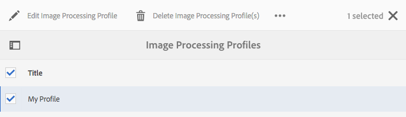

# Dynamic Media影像配置檔案 {#image-profiles}

上載影像時，可以通過將影像配置檔案應用到資料夾在上載時自動裁剪影像。

>[!NOTE]
>
>Smart Crop僅在Dynamic Media-Scene7模式下可用。

>[!IMPORTANT]
>
>影像配置檔案不適用於PDF、動畫GIF或INDD(Adobe InDesign)檔案。

## 裁剪選項 {#crop-options}

在映像上實施Smart Crop時，Adobe建議採用以下最佳做法並強制實施以下限制：

| 限制類型 | 最佳實踐 | 已實現的限制 |
| --- | --- | --- |
| 每個映像的智慧作物數 | 5 | 100 |

另請參閱 [Dynamic Media限制](/help/assets/limitations.md)。

<!-- CQDOC-16069 for paragraph directly below -->

智慧裁剪坐標與縱橫比相關。 對於影像配置檔案中的各種智慧裁剪設定，如果對於影像配置檔案中添加的尺寸而言長寬比相同，則向Dynamic Media發送相同的長寬比。 Adobe建議您使用相同的裁剪區域。 這樣做可確保不會影響影像配置檔案中使用的不同尺寸。

您建立的每個智慧裁剪生成都需要額外的處理。 例如，添加5個以上的Smart Crop縱橫比可導致資產吞吐率降低。 它還會增加系統的負載。 因為您可以在資料夾級別應用Smart Crop，所以Adobe建議您在資料夾上使用它 *僅* 需要它的地方。

您有兩個影像裁剪選項，可從中選擇。 您還可以選擇自動建立顏色和影像色板。

| 選項 | 使用時機 | 說明 |
| --- | --- | --- |
| 像素裁切 | 僅基於尺寸批量裁剪影像。 | 要使用此選項，請選擇 **[!UICONTROL 像素裁剪]** 從「裁剪選項」下拉清單中。  要從影像的兩側裁剪，請輸入要從影像的任何一側或每一側裁剪的像素數。 剪切的影像量取決於影像檔案中的ppi（像素/英吋）設定。  「影像輪廓」像素裁剪按以下方式呈現： ·值為「上」、「下」、「左」和「右」。 ·左上角被視為 `0,0` 像素裁剪是從那裡計算的。 ·裁剪起點：左為X，上為Y ·水準計算：原始影像的水準像素尺寸減左後減右。 ·垂直計算：垂直像素高度減去頂部，然後減去底部。  例如，假設您有4000 x 3000像素的影像。 您使用值：上=250，下=500，左=300，右=700。  從左上部(300,250)使用填充空間（4000-300-700、3000-250-500或3000,2250）的作物。 |
| 智慧型裁切 | 基於視覺焦點批量裁剪影像。 | Smart Crop利用Adobe Sensei人工智慧的力量，快速實現影像批量裁剪的自動化。 Smart Crop自動檢測任何影像中的焦點並將其裁剪到焦點，以捕獲預期的興趣點，而不管螢幕大小。
 
要使用智慧裁剪，請選擇 **[!UICONTROL 智慧裁剪]** 從「裁剪選項」下拉清單中，然後在「響應影像裁剪」的右側啟用（開啟）該功能。
 
大、中和小的預設斷點大小通常涵蓋在移動和平板電腦設備、台式機和橫幅上使用的大多數映像的全部大小。 如果需要，可編輯「大」(Large)、「中」(Medium)和「小」(Small)的預設名稱。
 
要添加更多斷點，請選擇 **[!UICONTROL 添加裁剪]** 要刪除裁剪，請選擇「垃圾桶」表徵圖。 |
| 顏色及影像樣本 | Bulk為每個影像生成一個影像樣本。 | **注釋**:Smart Swatch在Dynamic Media Classic不受支援。  自動從顯示顏色或紋理的產品影像中定位和生成高質量色板。  要使用顏色和影像色板，請選擇 **[!UICONTROL 智慧裁剪]** 從「裁剪選項」下拉清單，然後到「顏色和影像色板」的右側，啟用（開啟）該功能。 在「寬度」和「高度」文本框中輸入像素值。  雖然所有影像作物都可從「格式副本」(Regfrests)導軌獲得，但色板僅通過「複製URL」功能使用。 使用您自己的查看元件在站點上渲染色板。 (此規則的例外是旋轉木馬橫幅。 Dynamic Media為旋轉木馬條幅中使用的色板提供查看元件。)  **使用影像色板** &#x200B;影像色板的URL很簡單。 是：  `/is/image/company/&lt;asset_name&gt;:Swatch` 何處 `:Swatch` 附加到資產請求。  **使用顏色色板** &#x200B;要使用顏色色板，請 `req=userdata` 請求，具體如下： `/is/image/&lt;company_name&gt;/&lt;swatch_asset_name&gt;:Swatch?req=userdata`  例如，以下是Dynamic Media Classic的色板資產： `https://my.company.com:8080/is/image/DemoCo/Sleek:Swatch` 這是樣本資產的對應 `req=userdata` URL: `https://my.company.com:8080/is/image/DemoCo/Sleek:Swatch?req=userdata`  的 `req=userdata` 響應如下： `SmartCropDef=Swatch SmartCropHeight=200.0` `SmartCropRect=0.421671,0.389815,0.0848564,0.0592593,200,200` `SmartCropType=Swatch` `SmartCropWidth=200.0` `SmartSwatchColor=0xA56DB2`  您還可以請求 `req=userdata` XML或JSON格式的響應，如下面各個URL示例中所示： `https://my.company.com:8080/is/image/DemoCo/Sleek:Swatch?req=userdata,json` `https://my.company.com:8080/is/image/DemoCo/Sleek:Swatch?req=userdata,xml`  **注：** 建立您自己的WCM元件以請求顏色色板並分析 `SmartSwatchColor` 屬性，由24位RGB十六進位值表示。  另請參閱 [`userdata` 查看器參考指南](https://experienceleague.adobe.com/docs/dynamic-media-developer-resources/image-serving-api/image-serving-api/http-protocol-reference/command-reference/req/r-userdata.html)。 |

## 不銳利化遮色片 {#unsharp-mask}

您可以使 **[!UICONTROL 用「銳利化遮色片]** 」來微調最終縮減取樣影像的銳利化濾鏡效果。可以控制效果強度、效果半徑（以像素計量）以及忽略的對比度閾值。 此效果使用的選項與Adobe Photoshop *非銳化蒙版* 的子菜單。

>[!NOTE]
>
>非銳化蒙版僅應用於PTIFF（金字塔形）中縮放的格式副本，這些格式副本的縮放幅度大於50%。 這意味著，圖片中最大大小的格式副本不受非銳化蒙版影響，而較小大小的格式副本（如縮略圖）會被更改（並顯示非銳化蒙版）。

在 **[!UICONTROL 非銳化蒙版]**，您具有以下過濾選項：

| 選項 | 說明 |
| --- | --- |
| 數量 | 控制應用於邊緣像素的對比度量。 預設值為1.75。對於高解析度影像，可將其增加到高達5。 將Amount視為過濾器強度的度量。 範圍是0-5。 |
| 半徑 | 決定邊緣像素周圍會影響銳利化的像素數量。若是高解析度影像，輸入介於 1 到 2 之間的值。低數值只會銳利化邊緣的像素；高數值會銳利化較寬的像素範圍。正確的值取決於影像大小。預設值為0.2。範圍是0-250。 |
| 臨界值 | 確定應用非銳化蒙版濾鏡時要忽略的對比度範圍。換句話說，此選項確定銳化的像素在被視為邊緣像素和銳化之前必須與周圍區域有多大差異。 為了避免引入雜訊，用0-255之間的值進行實驗。 |

銳化在 [銳化影像](/help/assets/assets/sharpening_images.pdf)。

## 建立Dynamic Media影像配置檔案 {#creating-image-profiles}

要為其它資產類型定義高級處理參數，請參閱 [配置資產處理](config-dms7.md#configuring-asset-processing)。

請參閱 [處理元資料、影像和視頻的配置檔案](processing-profiles.md)。

另請參閱 [組織使用處理配置檔案的數字資產的最佳做法](/help/assets/organize-assets.md)。

**要建立Dynamic Media映像配置檔案：**

1. 選擇Adobe Experience Manager徽標並導航至 **[!UICONTROL 工具]** > **[!UICONTROL 資產]** > **[!UICONTROL 影像配置檔案]**。
1. 選擇 **[!UICONTROL 建立]** 以便您添加影像配置檔案。
1. 輸入非銳化蒙版、裁切或色板或兩者的配置檔案名稱和值。

   使用特定於其預期目的的配置檔案名稱。 例如，如果要建立僅生成色板的配置檔案 — 即禁用（關閉）智慧裁剪，啟用（開啟）顏色和影像色板 — 請使用配置檔案名稱「智慧色板」。

   另請參 [閱智慧型裁切和智慧型色票選項](#crop-options)[和遮色片銳利化](#unsharp-mask)。

   

1. 選擇 **[!UICONTROL 保存]**。 新建立的配置檔案將出現在可用配置檔案清單中。

## 編輯或刪除Dynamic Media影像配置檔案 {#editing-or-deleting-image-profiles}

1. 選擇Experience Manager徽標並導航至 **[!UICONTROL 工具]** > **[!UICONTROL 資產]** > **[!UICONTROL 影像配置檔案]**。
1. 選擇要編輯或刪除的影像配置檔案。 要編輯它，請選擇 **[!UICONTROL 編輯影像配置檔案]**。 要刪除它，請選擇 **[!UICONTROL 刪除影像配置檔案]**。

   

1. 如果編輯，則保存更改。 如果刪除，請確認要刪除配置檔案。

## 將Dynamic Media影像配置檔案應用於資料夾 {#applying-an-image-profile-to-folders}

將影像配置檔案分配給資料夾時，任何子資料夾都會自動從其父資料夾繼承配置檔案。 此工作流意味著您只能將一個影像配置檔案分配給資料夾。 因此，請仔細考慮上載、儲存、使用和存檔資產所在的資料夾結構。

如果為資料夾分配了不同的影像配置檔案，則新配置檔案將覆蓋以前的配置檔案。 以前現有的資料夾資產保持不變。 新配置檔案將應用於稍後添加到資料夾的資產。

在用戶介面中使用卡中顯示的配置檔案名稱來指示分配了配置檔案的資料夾。

<!-- When you add smart crop to an existing image profile, you need to re-trigger the [DAM Update Asset workflow](assets-workflow.md) if you want to generate crops for existing assets in your asset repository. -->

您可以將映像配置檔案應用於特定資料夾或全局應用於所有資產。

您可以在資料夾中重新處理資產，該資料夾中已存在您稍後更改的現有映像配置檔案。 請參閱 [編輯資料夾的處理配置檔案後，重新處理資料夾中的資產](processing-profiles.md#reprocessing-assets)。

### 將Dynamic Media映像配置檔案應用於特定資料夾 {#applying-image-profiles-to-specific-folders}

您可以從「工具」菜單或在資料夾內的「屬性」中將影像配置檔案應 **[!UICONTROL 用到資料夾]******。本節將說明如何以兩種方式將映像配置檔案應用於資料夾。

已為其分配配置檔案的資料夾將通過資料夾名稱正下方的配置檔案名稱顯示來指示。

您可以重新處理資料夾中的資產，該資料夾中已有您稍後更改的現有視頻配置檔案。 請參閱 [編輯資料夾的處理配置檔案後，重新處理資料夾中的資產](processing-profiles.md#reprocessing-assets)。

#### 將Dynamic Media影像配置檔案應用到配置檔案用戶介面中的資料夾 {#applying-image-profiles-to-folders-from-profiles-user-interface}

1. 選擇Experience Manager徽標並導航至 **[!UICONTROL 工具]** > **[!UICONTROL 資產]** > **[!UICONTROL 影像配置檔案]**。
1. 選擇要應用於資料夾或多個資料夾的影像配置檔案。

   

1. 選擇 **[!UICONTROL 將處理配置檔案應用於資料夾]** 並選擇要用於接收新上載資產的資料夾或多個資料夾，然後選擇 **[!UICONTROL 應用]**。 已為其分配配置檔案的資料夾將通過資料夾名稱正下方的配置檔案名稱顯示來指示。

#### 將Dynamic Media映像配置檔案應用於「屬性」中的資料夾 {#applying-image-profiles-to-folders-from-properties}

1. 選擇Experience League徽標並導航至 **[!UICONTROL 資產]**。 然後導航到要應用影像配置檔案的資料夾的父資料夾。
1. 在資料夾上，選擇複選標籤以選擇它，然後選擇 **[!UICONTROL 屬性]**。
1. 選擇 **[!UICONTROL 影像配置檔案]** 頁籤。 從 **[!UICONTROL 配置檔案名稱]** 下拉清單，選擇配置檔案，然後選擇 **[!UICONTROL 保存並關閉]**。 已為其分配配置檔案的資料夾將通過資料夾名稱正下方的配置檔案名稱顯示來指示。

   

### 全局應用Dynamic Media影像配置檔案 {#applying-an-image-profile-globally}

除了將配置檔案應用到資料夾外，您還可以全局應用一個配置檔案，以便任何資料夾中上載到Experience Manager資產的任何內容都應用了選定的配置檔案。

您可以重新處理資料夾中的資產，該資料夾中已有您稍後更改的現有視頻配置檔案。 請參閱 [在編輯資料夾的處理配置檔案後重新處理資料夾中的資產](processing-profiles.md#reprocessing-assets)。

**要全局應用Dynamic Media映像配置檔案：**

1. 執行下列任一項作業：

   * 導航到 `https://&lt;AEM server&gt;/mnt/overlay/dam/gui/content/assets/foldersharewizard.html/content/dam` 並應用相應的配置檔案，然後選擇 **[!UICONTROL 保存]**。

      

   * 導航到CRXDE Lite到以下節點： `/content/dam/jcr:content`。

      添加屬性 `imageProfile:/conf/global/settings/dam/adminui-extension/imageprofile/<name of image profile>` 選擇 **[!UICONTROL 全部保存]**。

      

## 編輯單個影像的智慧裁剪或智慧色板 {#editing-the-smart-crop-or-smart-swatch-of-a-single-image}

>[!NOTE]
>
>Smart Crop僅在Dynamic Media-Scene7模式下可用。

您可以手動重新對齊或調整影像的智慧裁剪窗口大小，以進一步細化其焦點。

編輯智慧裁剪並保存後，更改將隨處傳播，無論您對特定影像使用裁剪。

如有必要，您可以重新運行智慧裁剪以再次生成附加作物。

另請參閱 [編輯多個影像的智慧裁剪或智慧色板](#editing-the-smart-crop-or-smart-swatch-of-multiple-images)。

**要編輯單個影像的智慧裁剪或智慧色板，請執行以下操作：**

1. 選擇Experience Manager徽標並導航至 **[!UICONTROL 資產]**，然後到應用了智慧裁剪或智慧樣本影像配置檔案的資料夾。

1. 選擇資料夾，以便開啟其內容。
1. 選擇要調整其智慧裁剪或智慧色板的影像。
1. 在工具欄中，選擇 **[!UICONTROL 智慧裁剪]**。

1. 執行下列任一操作：

   * 在頁面的右上角附近，向左或向右拖動滑塊條以分別增大或減小影像顯示。
   * 在影像上，拖動角手柄以調整裁剪或色板的可視區域的大小。
   * 在影像上，將框/色板拖到新位置。 只能編輯影像色板；顏色色板是靜態的。
   * 在影像上方，選擇  **[!UICONTROL 還原]** 撤消所有編輯內容並恢復原始裁剪或色板。

1. 在頁面右上角附近，選擇 **[!UICONTROL 保存]**，然後選擇 **[!UICONTROL 關閉]** 返回到資產資料夾。

## 編輯多個影像的智慧裁剪或智慧色板 {#editing-the-smart-crop-or-smart-swatch-of-multiple-images}

將包含智慧裁剪的影像配置檔案應用到資料夾後，該資料夾中的所有影像都將應用裁剪。 如果需要，您可以 *手動* 在多個影像中重新對齊或調整智慧裁剪窗口的大小，以進一步細化其焦點。

編輯智慧裁剪並保存後，更改將隨處傳播，無論您對特定影像使用裁剪。

如有必要，您可以重新運行智慧裁剪以再次生成附加作物。

**要編輯多個影像的智慧裁剪或智慧色板：**

1. 選擇Experience Manager徽標並導航至 **[!UICONTROL 資產]**，然後轉到應用了智慧裁剪或智慧樣本影像配置檔案的資料夾。
1. 在資料夾上，選擇 **[!UICONTROL 更多操作]** (...)表徵圖，然後選擇 **[!UICONTROL 智慧裁剪]**。

1. 在 **[!UICONTROL 編輯智慧作物]** 頁，執行下列任一操作：

   * 調整頁面上影像的查看大小。

      在斷點名稱下拉清單的右側，向左或向右拖動滑塊以更改可視影像顯示的大小。

      

   * 根據斷點名稱篩選可視影像清單。 在以下示例中，在斷點名稱「Medium」上過濾影像。

      在頁面右上角的下拉清單中，選擇斷點名稱以篩選您看到的影像。 （請參閱上圖。）

      

   * 調整智慧裁剪框的大小。 執行下列任一操作：

      * 如果影像僅具有智慧裁剪或智慧色板，則在影像上拖動裁剪框的角手柄以調整裁剪的可視區域的大小。
      * 如果影像既具有智慧裁剪又具有智慧色板，則在影像上拖動裁剪框的角手柄以調整裁剪的可視區域的大小。 或者，選擇影像下方的智慧色板（顏色色板是靜態的），然後拖動裁剪框的角手柄以調整色板的可視區域的大小。

      

   * 移動智慧裁剪框。 執行下列任一操作：

      * 如果影像僅具有智慧裁剪或智慧色板，則將裁剪框拖到新位置。
      * 如果影像既具有智慧裁剪又具有智慧色板，則在影像上將智慧裁剪框拖動到新位置。 或者，選擇影像下方的智慧色板（顏色色板是靜態的），然後將智慧色板裁剪框拖到新位置。

      

   * 撤消所有編輯並恢復原始智慧裁剪或智慧色板（僅適用於當前編輯會話）。

      選擇 **[!UICONTROL 還原]** 影像上方。

      

1. 在頁面右上角附近，選擇 **[!UICONTROL 保存]**，然後選擇 **[!UICONTROL 關閉]** 返回到資產資料夾。

## 從資料夾中刪除Dynamic Media映像配置檔案 {#removing-an-image-profile-from-folders}

從資料夾中刪除影像配置檔案時，任何子資料夾都會自動從其父資料夾中繼承刪除配置檔案。 但是，對資料夾中已發生的檔案的任何處理都保持不變。

您可以從「工具」功能表內的資料夾中移除影像配置檔案，或者如果您位於資料夾中，則可以從「屬性」( **[!UICONTROL Properties)中移除影像配置檔案]******。本節將說明如何以兩種方式從資料夾中刪除映像配置檔案。

### 通過配置式用戶介面從資料夾中刪除Dynamic Media影像配置式 {#removing-image-profiles-from-folders-via-profiles-user-interface}

1. 選擇Experience Manager徽標並導航至 **[!UICONTROL 工具]** > **[!UICONTROL 資產]** > **[!UICONTROL 影像配置檔案]**。
1. 選擇要從資料夾或多個資料夾中刪除的影像配置檔案。
1. 選擇 **[!UICONTROL 從資料夾中刪除處理配置檔案]** 並選擇要用於從中刪除配置檔案的資料夾或多個資料夾，然後選擇 **[!UICONTROL 刪除]**。

   您可以確認影像配置檔案不再應用於資料夾，因為該名稱不再出現在資料夾名稱下。

### 通過「屬性」從資料夾中刪除Dynamic Media影像配置檔案 {#removing-image-profiles-from-folders-via-properties}

1. 選擇Experience Manager徽標並導航 **[!UICONTROL 資產]** 然後轉到要從中刪除映像配置檔案的資料夾。
1. 在資料夾上，選擇複選標籤以選擇它，然後選擇 **[!UICONTROL 屬性]**。
1. 選擇 **[!UICONTROL 影像配置檔案]** 頁籤。
1. 從 **[!UICONTROL 配置檔案名稱]** 下拉清單，選擇 **[!UICONTROL 無]**，然後選擇 **[!UICONTROL 保存並關閉]**。

   已為其分配配置檔案的資料夾將通過資料夾名稱正下方的配置檔案名稱顯示來指示。
