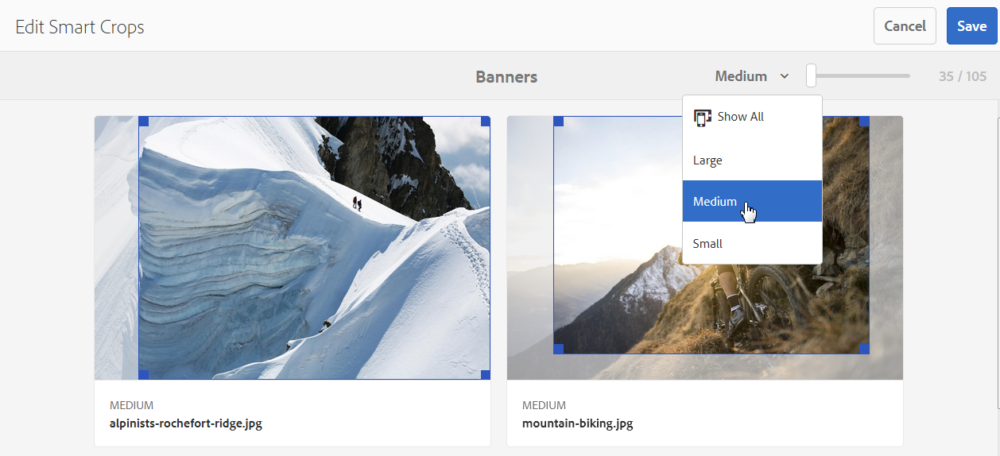
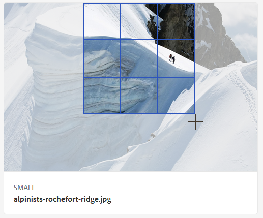

# Dynamic Media 影像設定檔 {#image-profiles}

上傳影像時，您可以透過將影像描述檔套用至資料夾，在上傳時自動裁切影像。

>[!IMPORTANT]
>
>·智慧型裁切功能僅適用於Dynamic Media - Scene7模式。
·影像描述檔不適用於PDF、動畫GIF或INDD(Adobe InDesign)檔案。

## 裁切選項 {#crop-options}

當您在影像上實作智慧型裁切時，Adobe會建議下列最佳實務並強制執行下列限制：

| 限制類型 | 最佳實務 | 限制 |
| --- | --- | --- |
| 每個影像的智慧作業數 | 5 | 100 |

另請參閱 [Dynamic Media限制](/help/assets/limitations.md).

<!-- CQDOC-16069 for paragraph directly below -->

智慧型裁切座標取決於外觀比例。 針對影像設定檔中的各種智慧型裁切設定，如果影像設定檔中新增的維度的外觀比例相同，則會將相同的外觀比例傳送至Dynamic Media。 Adobe建議您使用相同的裁切區域。 這樣做可確保對影像設定檔中使用的不同維度沒有影響。

您建立的每個智慧型裁切產生都需要額外處理。 例如，新增超過五個智慧型裁切長寬比可能會導致資產擷取速度緩慢。 這也會增加系統的負載。 由於您可以在資料夾層級套用智慧型裁切，因此Adobe建議您在資料夾上使用智慧型裁切 *僅限* 需要的地方。

**定義影像設定檔中智慧型裁切的准則**
為了控制智慧型裁切的使用，並為處理時間和裁切的儲存進行最佳化，Adobe建議下列准則和提示：

* 請避免建立具有相同寬度和高度值的重複智慧型裁切設定檔。
* 根據裁切維度為智慧型裁切命名，而非根據最終用途。 這麼做有助於最佳化多個頁面上使用單一維度的重複項目。
* 為特定資料夾和子資料夾建立頁面式/資產類型式的影像設定檔，而非套用至所有資料夾或所有資產的通用智慧型裁切設定檔。
* 您套用至子資料夾的影像設定檔會覆寫套用至資料夾的影像設定檔。
* 為特定資料夾和子資料夾建立頁面式/資產類型式的影像設定檔，而非套用至所有資料夾或所有資產的通用智慧型裁切設定檔。
* 您套用至子資料夾的影像設定檔會覆寫套用至資料夾的影像設定檔。
* 理想情況下，每個影像要有10-15個智慧裁切，以針對螢幕比例和處理時間進行最佳化。

<!--
* Image assets that are going to have a smart crop applied to them must be a minimum of 50 x 50 pixels or larger. CQDOC-20087
* An Image Profile that contains duplicate smart crop dimensions is not permitted. CQDOC-20087
* Duplicate named Image Profiles that have smart crop options set are not permitted. CQDOC-20087
* Create page-wise/asset type-wise Image Profiles for specific folders and subfolders instead of a common smart crop profile that is applied to all folders or all assets.
* An Image Profile that you apply to subfolders overrides an Image Profile that is applied to the folder.
* Ideally, have 10-15 smart crops per image to optimize for screen ratios and processing time. -->
<!-- * Avoid creating duplicate smart crop profiles that have the same width and height values. 
* Name smart crops based on crop dimensions, not on end usage. Doing so helps to optimize for duplicates where a single dimension is used on multiple pages. -->

您有兩個影像裁切選項可供選擇：像素裁切或智慧型裁切。 您也可以選擇自動建立顏色和影像色票。

>[!IMPORTANT]
·Adobe建議您檢閱任何產生的裁切和色票，以確保這些裁切和色票適當且與您的品牌和值相關。
·智慧型裁切不支援CMYK影像格式。

| 選項 | 使用時機 | 說明 |
| --- | --- | --- |
| 像素裁切 | 僅根據維度大量裁切影像。 | 若要使用此選項，請選取 **[!UICONTROL 像素裁切]** 從「裁切選項」下拉式清單中。  要從影像的兩側裁切，請輸入要從影像的任何一側或每一側裁切的像素數。 影像被裁切的程度取決於影像檔案中的ppi設定（每英吋像素）。  影像描述檔像素裁切會以下列方式呈現： ·值為上、下、左、右。 ·左上角被視為 `0,0` 像素裁切從那裡計算出來。 ·裁切起始點：左為X，上為Y ·水準計算：原始影像的水準像素尺寸減去「左」，然後減去「右」。 ·垂直計算：垂直像素高度減去「頂部」，然後減去「底部」。  例如，假設您有4000 x 3000像素影像。 您使用值：Top=250, Bottom=500, Left=300, Right=700。  從左上角(300,250)使用填充空間(4000-300-700、3000-250-500或3000,2250)裁切。 |
| 智慧型裁切 | 根據影像的視覺焦點來大量裁切影像。 | 智慧型裁切運用Adobe Sensei中人工智慧的強大功能，大量快速自動裁切影像。 智慧型裁切功能會自動偵測任何影像中的焦點並裁切至焦點，以擷取預期的興趣點（無論螢幕大小）。
 
要使用智慧裁切，請選擇 **[!UICONTROL 智慧型裁切]** 從「裁切選項」下拉式清單，然後在「回應式影像裁切」的右側，啟用（開啟）功能。
 
大、中和小的預設斷點大小通常涵蓋移動和平板電腦設備、台式機和橫幅上使用的大多數影像的全部大小。 如果需要，可以編輯「大」、「中」和「小」的預設名稱。
 
要添加更多斷點，請選擇 **[!UICONTROL 新增裁切]** 若要刪除裁切，請選取垃圾桶圖示。 |
| 顏色及影像樣本 | Bulk為每個影像生成一個影像色票。 | **附註**:Dynamic Media Classic不支援智慧色票。  從顯示顏色或紋理的產品影像自動定位並生成高質量色板。  要使用顏色和影像色板，請選擇 **[!UICONTROL 智慧型裁切]** 從「裁切選項」下拉式清單，然後在「顏色」和「影像色票」的右側，啟用（開啟）功能。 在「寬度」和「高度」文本框中輸入像素值。  雖然所有影像裁切都可從「轉譯」邊欄使用，但僅透過「複製URL」功能使用色票。 使用您自己的檢視元件，在您的網站上轉譯色票。 (此規則的例外是輪播橫幅。 Dynamic Media提供輪播橫幅中所用色票的檢視元件。)  **使用影像色票** &#x200B;影像色票的URL簡單明瞭。 是：  `/is/image/company/&lt;asset_name&gt;:Swatch` where `:Swatch` 會附加至資產請求。  **使用顏色色板** &#x200B;若要使用顏色色票，請建立 `req=userdata` 請求，並包含下列項目： `/is/image/&lt;company_name&gt;/&lt;swatch_asset_name&gt;:Swatch?req=userdata`  例如，下列是Dynamic Media Classic中的色票資產： `https://my.company.com:8080/is/image/DemoCo/Sleek:Swatch` 以下是色票資產對應的 `req=userdata` URL: `https://my.company.com:8080/is/image/DemoCo/Sleek:Swatch?req=userdata`  此 `req=userdata` 回應如下： `SmartCropDef=Swatch SmartCropHeight=200.0` `SmartCropRect=0.421671,0.389815,0.0848564,0.0592593,200,200` `SmartCropType=Swatch` `SmartCropWidth=200.0` `SmartSwatchColor=0xA56DB2`  您也可以要求 `req=userdata` XML或JSON格式的回應，如下列個別URL範例所示： `https://my.company.com:8080/is/image/DemoCo/Sleek:Swatch?req=userdata,json` `https://my.company.com:8080/is/image/DemoCo/Sleek:Swatch?req=userdata,xml`  **注意：** 建立您自己的WCM元件以要求色票，並剖析 `SmartSwatchColor` 屬性，由24位RGB十六進位值表示。  另請參閱 [`userdata` 檢視器參考指南中的](https://experienceleague.adobe.com/docs/dynamic-media-developer-resources/image-serving-api/image-serving-api/http-protocol-reference/command-reference/req/r-userdata.html). |

## 不銳利化遮色片 {#unsharp-mask}

您可以使 **[!UICONTROL 用「銳利化遮色片]** 」來微調最終縮減取樣影像的銳利化濾鏡效果。您可以控制效果的強度、效果半徑（以像素計量），以及忽略的對比度臨界值。 此效果使用的選項與Adobe Photoshop *不銳利化遮色片* 篩選。

>[!NOTE]
不銳利化遮色片只會套用至縮減取樣超過50%的PTIFF（金字塔Tiff）內縮減縮放的轉譯。 這表示Ptiff中大小最大的轉譯不受遮色片銳利化影響，而大小較小的轉譯（例如縮圖）則有所變更（並顯示遮色片銳利化）。

在 **[!UICONTROL 不銳利化遮色片]**，您有下列篩選選項：

| 選項 | 說明 |
| --- | --- |
| 數量 | 控制套用至邊緣像素的對比度量。 預設值為1.75。對於高解析度影像，可將其增加到最高5。 將「量」視為篩選強度的測量。 範圍是0-5。 |
| 半徑 | 決定邊緣像素周圍會影響銳利化的像素數量。若是高解析度影像，輸入介於 1 到 2 之間的值。低數值只會銳利化邊緣的像素；高數值會銳利化較寬的像素範圍。正確的值取決於影像大小。預設值為0.2。範圍為0-250。 |
| 臨界值 | 確定應用不銳利化遮色片濾鏡時要忽略的對比度範圍。換句話說，此選項可決定銳化像素與周圍區域的差異程度，之後才會被視為邊緣像素且銳化。 為避免引入雜訊，請使用0-255之間的值進行實驗。 |

銳利化在 [銳利化影像](/help/assets/assets/sharpening_images.pdf).

## 建立Dynamic Media影像設定檔 {#creating-image-profiles}

若要定義其他資產類型的進階處理參數，請參閱 [設定資產處理](config-dms7.md#configuring-asset-processing).

請參閱 [處理中繼資料、影像和視訊的設定檔](processing-profiles.md).

另請參閱 [組織數位資產以使用處理設定檔的最佳實務](/help/assets/organize-assets.md).

**若要建立Dynamic Media影像設定檔：**

1. 選取Adobe Experience Manager標誌並導覽至 **[!UICONTROL 工具]** > **[!UICONTROL 資產]** > **[!UICONTROL 影像設定檔]**.
1. 選擇 **[!UICONTROL 建立]** 以便您可以新增影像設定檔。
1. 輸入描述檔名稱和值，以用於遮色片、裁切或色票，或兩者。

   使用符合其預定用途的設定檔名稱。 例如，如果要建立僅生成色板的配置檔案，即禁用（關閉）智慧裁切，啟用（開啟）顏色和影像色板 — 使用配置檔案名「智慧色板」。

   另請參 [閱智慧型裁切和智慧型色票選項](#crop-options)[和遮色片銳利化](#unsharp-mask)。

   

1. 選取&#x200B;**[!UICONTROL 儲存]**。新建立的配置檔案將顯示在可用配置檔案清單中。

## 編輯或刪除Dynamic Media影像設定檔 {#editing-or-deleting-image-profiles}

1. 選取Experience Manager標誌並導覽至 **[!UICONTROL 工具]** > **[!UICONTROL 資產]** > **[!UICONTROL 影像設定檔]**.
1. 選擇要編輯或刪除的「影像配置檔案」。 若要編輯，請選取 **[!UICONTROL 編輯影像設定檔]**. 若要移除，請選取 **[!UICONTROL 刪除影像設定檔]**.

   

1. 如果編輯，則保存更改。 如果刪除，請確認您要移除設定檔。

## 將Dynamic Media影像設定檔套用至資料夾 {#applying-an-image-profile-to-folders}

將映像配置檔案分配給資料夾時，任何子資料夾都會自動從其父資料夾繼承配置檔案。 此工作流程表示您只能將一個影像設定檔指派給資料夾。 因此，請仔細考慮上傳、儲存、使用和封存資產的資料夾結構。

如果為資料夾分配了不同的影像配置檔案，則新配置檔案將覆蓋前一個配置檔案。 先前的資料夾資產維持不變。 新設定檔會套用至稍後新增至資料夾的資產。

在用戶介面中，會使用卡片中顯示的配置檔案名稱來指示已為其分配配置檔案的資料夾。

<!-- When you add smart crop to an existing Image Profile, you need to re-trigger the [DAM Update Asset workflow](assets-workflow.md) if you want to generate crops for existing assets in your asset repository. -->

您可以將影像設定檔套用至特定資料夾，或全域套用至所有資產。

您可以重新處理資料夾中的資產，該資料夾中已有您後來變更的現有影像設定檔。 請參閱 [編輯資料夾中的資產處理設定檔後，重新處理該資料夾中的資產](processing-profiles.md#reprocessing-assets).

### 將Dynamic Media影像設定檔套用至特定資料夾 {#applying-image-profiles-to-specific-folders}

您可以從 **[!UICONTROL 工具]** ，或者如果您位於資料夾中，則從 **[!UICONTROL 屬性]**. 本節介紹如何以兩種方式將映像配置檔案應用到資料夾。

已為其分配配置檔案的資料夾將通過資料夾名稱正下方的配置檔案名稱顯示來指示。

若資料夾中已有您之後已變更的現有視訊設定檔，您可以重新處理該資料夾中的資產。 請參閱 [編輯資料夾中的資產處理設定檔後，重新處理該資料夾中的資產](processing-profiles.md#reprocessing-assets).

#### 將Dynamic Media影像設定檔套用至設定檔使用者介面的資料夾 {#applying-image-profiles-to-folders-from-profiles-user-interface}

1. 選取Experience Manager標誌並導覽至 **[!UICONTROL 工具]** > **[!UICONTROL 資產]** > **[!UICONTROL 影像設定檔]**.
1. 選擇要應用於資料夾或多個資料夾的影像配置檔案。

   

1. 選擇 **[!UICONTROL 將處理設定檔套用至資料夾]** ，然後選取您要用來接收新上傳資產的資料夾或多個資料夾，並選取 **[!UICONTROL 套用]**. 已為其分配配置檔案的資料夾將通過資料夾名稱正下方的配置檔案名稱顯示來指示。

#### 從屬性將Dynamic Media影像設定檔套用至資料夾 {#applying-image-profiles-to-folders-from-properties}

1. 選取Experience League標誌並導覽至 **[!UICONTROL 資產]**. 然後導覽至您要套用影像描述檔之資料夾的父資料夾。
1. 在資料夾中，選取要選取的核取記號，然後選取 **[!UICONTROL 屬性]**.
1. 選取 **[!UICONTROL 影像設定檔]** 標籤。 從 **[!UICONTROL 設定檔名稱]** 下拉式清單，選取設定檔，然後選取 **[!UICONTROL 儲存並關閉]**. 已為其分配配置檔案的資料夾將通過資料夾名稱正下方的配置檔案名稱顯示來指示。

   

### 全域套用Dynamic Media影像設定檔 {#applying-an-image-profile-globally}

除了將設定檔套用至資料夾之外，您也可以全域套用一個設定檔，讓任何資料夾中上傳至Experience Manager資產的內容都會套用選取的設定檔。

若資料夾中已有您之後已變更的現有視訊設定檔，您可以重新處理該資料夾中的資產。 請參閱 [在您編輯了資料夾的處理設定檔後，重新處理資料夾中的資產](processing-profiles.md#reprocessing-assets).

**若要全域套用Dynamic Media影像設定檔：**

1. 執行下列任一項作業：

   * 導覽至 `https://&lt;AEM server&gt;/mnt/overlay/dam/gui/content/assets/foldersharewizard.html/content/dam` 並應用適當的配置檔案並選擇 **[!UICONTROL 儲存]**.

      

   * 導覽至CRXDE Lite至下列節點： `/content/dam/jcr:content`.

      新增屬性 `imageProfile:/conf/global/settings/dam/adminui-extension/imageprofile/<name of image profile>` 選取 **[!UICONTROL 全部儲存]**.

      

## 編輯單一影像的智慧型裁切或智慧型色票 {#editing-the-smart-crop-or-smart-swatch-of-a-single-image}

>[!IMPORTANT]
·智慧型裁切功能僅適用於Dynamic Media - Scene7模式。

您可以手動重新對齊或調整影像的智慧型裁切視窗大小，以進一步細化其焦點。

編輯智慧型裁切並儲存後，變更會傳播至您對特定影像使用裁切的所有位置。

如有必要，您可以重新執行智慧型裁切，再次產生其他裁切。

另請參閱 [編輯多個影像的智慧型裁切或智慧型色票](#editing-the-smart-crop-or-smart-swatch-of-multiple-images).

**要編輯單個影像的智慧型裁切或智慧型色票：**

1. 選取Experience Manager標誌並導覽至 **[!UICONTROL 資產]**，然後套用至智慧型裁切或智慧型色票影像描述檔的資料夾。

1. 選取資料夾，以開啟其內容。
1. 選擇要調整其智慧裁切或智慧色票的影像。
1. 在工具列中，選取 **[!UICONTROL 智慧型裁切]**.

1. 執行下列任一操作：

   * 在頁面的右上角附近，向左或向右拖動滑桿，分別增加或減少影像顯示。
   * 在影像上，拖動角手柄以調整裁切或色板的可視區域的大小。
   * 在影像上，將方塊/色票拖曳至新位置。 只能編輯影像色板；色票為靜態。
   * 在影像上方，選取  **[!UICONTROL 還原]** 還原所有編輯內容，並還原原始裁切或色票。

1. 在頁面的右上角附近，選取 **[!UICONTROL 儲存]**，然後選取 **[!UICONTROL 關閉]** 返回資產資料夾。

## 編輯多個影像的智慧型裁切或智慧型色票 {#editing-the-smart-crop-or-smart-swatch-of-multiple-images}

>[!IMPORTANT]
·智慧型裁切功能僅適用於Dynamic Media - Scene7模式。

將包含智慧型裁切的影像描述檔套用至資料夾後，該資料夾中的所有影像都會套用裁切至它們。 如果需要，您可以 *手動* 重新對齊或調整多個影像中智慧型裁切窗口的大小，以進一步細化其焦點。

編輯智慧型裁切並儲存後，變更會傳播至您對特定影像使用裁切的所有位置。

如有必要，您可以重新執行智慧型裁切，再次產生其他裁切。

**要編輯多個影像的智慧型裁切或智慧型色票：**

1. 選取Experience Manager標誌並導覽至 **[!UICONTROL 資產]**，則會套用至智慧型裁切或智慧型色票影像描述檔的資料夾。
1. 在資料夾中，選取 **[!UICONTROL 更多動作]** (...)圖示，然後選取 **[!UICONTROL 智慧型裁切]**.

1. 在 **[!UICONTROL 編輯智慧裁切]** 頁面，執行下列任一操作：

   * 調整頁面上影像的檢視大小。

      在斷點名稱下拉清單的右側，向左或向右拖動滑塊條，以更改可視影像顯示的大小。

      

   * 根據斷點名稱篩選可視影像清單。 在以下示例中，在斷點名稱「Medium」上篩選影像。

      在頁面的右上角附近，從下拉式清單中選取斷點名稱，以篩選您看到的影像。 （請參閱上圖）。

      

   * 調整智慧型裁切框的大小。 執行下列任一操作：

      * 如果影像只有智慧型裁切或智慧型色票，請在影像上拖動裁切框的角手柄，以調整裁切的可視區域的大小。
      * 如果影像同時具有智慧型裁切和智慧型色板，請在影像上拖動裁切框的角手柄以調整裁切的可視區域的大小。 或者，在影像下方選取智慧色板（顏色色板為靜態色板），然後拖動裁切框的角手柄以調整色板的可視區域的大小。

      

   * 移動智慧型裁切框。 執行下列任一操作：

      * 如果影像具有智慧型裁切或僅智慧型色票，請在影像上將裁切框拖曳至新位置。
      * 如果影像同時具有智慧型裁切和智慧型色票，請在影像上將智慧型裁切方塊拖曳至新位置。 或者，選取影像下方的智慧型色板（色板為靜態色板），然後將智慧型色板裁切框拖到新位置。

      

   * 還原所有編輯內容並還原原始的智慧型裁切或智慧型色票（僅適用於目前的編輯工作階段）。

      選擇 **[!UICONTROL 還原]** 在影像上方。

      

1. 在頁面的右上角附近，選取 **[!UICONTROL 儲存]**，然後選取 **[!UICONTROL 關閉]** 返回資產資料夾。

## 從資料夾移除Dynamic Media影像設定檔 {#removing-an-image-profile-from-folders}

從資料夾中移除影像配置檔案時，任何子資料夾都會自動從其父資料夾中繼承移除配置檔案。 不過，資料夾內發生的檔案處理仍維持不變。

您可以從 **[!UICONTROL 工具]** ，或者如果您位於資料夾中，則從 **[!UICONTROL 屬性]**. 本節介紹如何以兩種方式從資料夾中刪除映像配置檔案。

### 透過Profiles使用者介面，從資料夾中移除Dynamic Media影像設定檔 {#removing-image-profiles-from-folders-via-profiles-user-interface}

1. 選取Experience Manager標誌並導覽至 **[!UICONTROL 工具]** > **[!UICONTROL 資產]** > **[!UICONTROL 影像設定檔]**.
1. 選擇要從資料夾或多個資料夾中刪除的影像配置檔案。
1. 選擇 **[!UICONTROL 從資料夾中移除處理設定檔]** ，然後選擇要用於從中刪除配置檔案的資料夾或多個資料夾，並選擇 **[!UICONTROL 移除]**.

   您可以確認「影像描述檔」不再套用至資料夾，因為名稱不再出現在資料夾名稱下方。

### 透過屬性從資料夾中移除Dynamic Media影像設定檔 {#removing-image-profiles-from-folders-via-properties}

1. 選取Experience Manager標誌並導覽 **[!UICONTROL 資產]** ，然後轉到要從中刪除映像配置檔案的資料夾。
1. 在資料夾中，選取要選取的核取記號，然後選取 **[!UICONTROL 屬性]**.
1. 選取 **[!UICONTROL 影像設定檔]** 標籤。
1. 從 **[!UICONTROL 設定檔名稱]** 下拉清單，選擇 **[!UICONTROL 無]**，然後選取 **[!UICONTROL 儲存並關閉]**.

   已為其分配配置檔案的資料夾將通過資料夾名稱正下方的配置檔案名稱顯示來指示。
