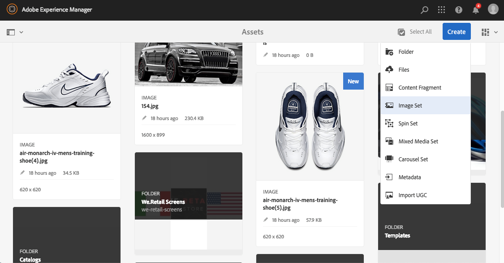
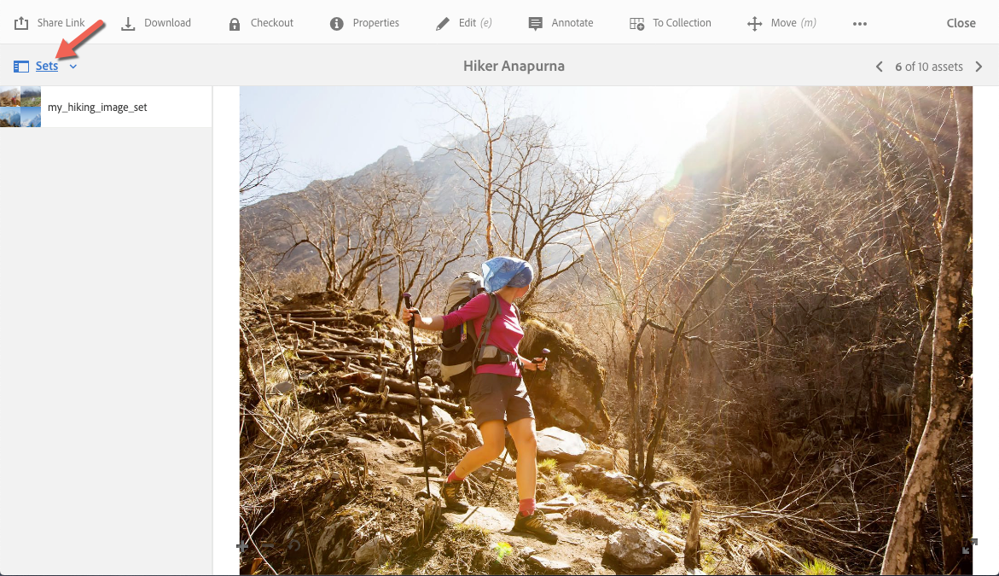

# 影像集 {#image-sets}

影像集為使用者提供整合式檢視體驗，使用者可透過選取縮圖影像來檢視專案的不同檢視。 影像集可讓您呈現專案的替代檢視，而檢視器可提供縮放工具，以便更密切地檢查影像。

影像集由帶有單字的橫幅指定 `IMAGESET`. 此外，如果已發佈影像集，則會顯示以 **[!UICONTROL World]** 圖示表示的發佈日期與上次修改日期(以 **** Pencil圖示表示)在橫幅上。

在「影像集」中，您也可以建立「影像集」並新增縮圖，以建立色票。

當您想要以不同的顏色、圖樣或成品顯示專案時，此應用程式非常有用。 若要使用色票建立「影像集」，您需要為要呈現給使用者的每個不同顏色、圖樣或完成建立一個影像。 您還需要每個顏色、圖樣或光潔度使用一個顏色、圖樣或光潔度色票。

例如，假設您要以不同的顏色清單呈現大寫字的影像；清單為紅色、綠色和藍色。 在此情況下，您需要三個相同帽子的鏡頭。 您需要一個紅色鏡頭，一個綠色鏡頭，一個藍色鏡頭。 您還需要紅色、綠色和藍色色票。 色票可作為縮圖，供使用者在色票集檢視器中選取，以檢視紅色計費、綠色計費或藍色計費的次數上限。

>[!NOTE]
>
>如需Assets使用者介面的詳細資訊，請參閱 [管理資產](/help/assets/manage-assets.md).

建立影像集時，Adobe會建議下列最佳作法並強制進行下列限制：

| 限制型別 | 最佳實務 | 強加的限制 |
| --- | --- | --- |
| 每個集的重複資產數 | 無重複專案 | 20‡ |
| 每組影像的最大數量 | 每組5至10個影像 | 1000 |

‡最佳實務是集合中不要有重複的資產。 單一資產的限製為20個重複專案。 如果您為該資產新增另一個重複專案（在該集合內），請求會傳回錯誤或忽略重複專案。

另請參閱 [Dynamic Media限制](/help/assets/limitations.md).

## 快速入門：影像集 {#quick-start-image-sets}

**快速上手並執行：**

1. [上傳您的主要來源影像以供多個檢視](#uploading-assets-in-image-sets).

   首先，上傳影像集的影像。 當您選擇影像時，請記得您的客戶可以在影像集檢視器中放大影像。 請確定影像在最大尺寸中至少為2000畫素，以獲得最佳縮放細節。 Dynamic Media可轉譯每張影像高達2500萬畫素。 例如，您可以使用5000 x 5000 MP的影像，或任何其他大小組合，最大可達25 MP。

   另請參閱 [Dynamic Media — 支援的點陣影像格式](/help/assets/assets-formats.md#supported-raster-image-formats-dynamic-media) 以取得「影像集」支援的格式清單。

<!--    Adobe Experience Manager Assets supports many image file formats, but lossless TIFF, PNG, and EPS images are recommended. -->

1. [建立影像集](#creating-image-sets).

   在「影像集」中，使用者可在「影像集檢視器」中選取縮圖影像。

   若要在資產中建立影像集，請前往 **[!UICONTROL 建立]** > **[!UICONTROL 影像集]**. 然後，新增影像並選取 **[!UICONTROL 儲存]**.

   您也可以透過自動建立影像集 [批次集預設集](/help/assets/config-dms7.md).
   >[!IMPORTANT]
   >
   >批次集由IPS (Image Production System)建立，作為資產擷取的一部分，僅適用於Dynamic Media - Scene7模式。

   另請參閱 [準備影像集資產以上傳和上傳您的檔案](#uploading-assets-in-image-sets).

   另請參閱 [使用選取器](/help/assets/working-with-selectors.md).

1. 新增 [影像集檢視器預設集](/help/assets/managing-viewer-presets.md)，視需要。

   管理員可以建立或修改影像集檢視器預設集。 若要檢視含有檢視器預設集的影像集，請選取「影像集」，然後在左側導軌下拉式選單中選取「 」 **[!UICONTROL 檢視者]**.

   瀏覽至 **[!UICONTROL 工具]** > **[!UICONTROL 資產]** > **[!UICONTROL 檢視器預設集]** 如果您想要建立或編輯檢視器預設集。

1. （可選） [檢視影像集](/help/assets/image-sets.md#viewing-image-sets) 使用批次集預設集建立的。
1. [預覽影像集](/help/assets/previewing-assets.md).

   選取「影像集」，即可預覽。 選取縮圖圖示，以便您可以在選取的檢視器中檢查影像集。 您可以從以下選擇不同的檢視器： **[!UICONTROL 檢視者]** 功能表，可從左側導軌下拉式功能表取得。

1. [發佈影像集](/help/assets/publishing-dynamicmedia-assets.md).

   發佈影像集時會啟用URL和內嵌程式碼。 此外，您必須 [發佈任何自訂檢視器預設集](/help/assets/managing-viewer-presets.md) 您已建立的。 現成可用的檢視器預設集已發佈。

1. [將URL連結至您的網頁應用程式](/help/assets/linking-urls-to-yourwebapplication.md) 或 [內嵌視訊或影像檢視器](/help/assets/embed-code.md).

   Experience Manager Assets會為影像集建立URL呼叫，並在您發佈影像集後加以啟用。 您可以在預覽資產時複製這些URL。 或者，您也可以將它們內嵌在網站上。

   選取「影像集」，然後在左側導軌下拉式選單中選取「檢 **[!UICONTROL 視器]**」。

   另請參閱 [將影像集連結至網頁](/help/assets/linking-urls-to-yourwebapplication.md) 和 [內嵌視訊或影像檢視器](/help/assets/embed-code.md).

若要編輯影像集，請參閱 [編輯影像集](#editing-image-sets). 此外，您也可以檢視和編輯 [影像集屬性](/help/assets/manage-assets.md#editing-properties).

如果您無法建立集合，請參閱影像和集合，位置在： [疑難排解Dynamic Media - Scene7模式](/help/assets/troubleshoot-dms7.md#images-and-sets).

## 上傳影像集中的資產 {#uploading-assets-in-image-sets}

首先，上傳影像集的影像。 當您選擇影像時，請記得您的客戶可以在影像集檢視器中放大影像。 請確定影像在最大尺寸中至少為2000畫素。 影像集支援許多影像檔案格式，但建議使用不失真TIFF、PNG和EPS影像。

您可以依原有方式上傳影像集的影像 [在Assets中上傳任何其他資產](/help/assets/manage-assets.md#uploading-assets).

另請參閱 [Dynamic Media — 支援的點陣影像格式](/help/assets/assets-formats.md#supported-raster-image-formats-dynamic-media) 以取得「影像集」支援的格式清單。

### 準備影像集資產以供上傳 {#preparing-image-set-assets-for-upload}

在建立影像集之前，請確定影像的大小和格式正確。

若要建立多檢視「影像集」，您需要顯示不同檢視點的專案或顯示相同專案的不同外觀的影像。 目標是要強調專案的重要功能，讓檢視者能夠完整瞭解專案外觀或作用。

因為使用者可以在「影像集」中縮放影像，請確定影像在最大尺寸中至少為2000畫素。 <!-- Assets support many image file formats, but lossless TIFF, PNG, and EPS images are recommended. -->

>[!NOTE]
>
>此外，如果您使用縮圖來表示產品色票，則必須執行下列動作：
>
>您需要相同影像的暈映或不同快照，以不同的顏色、圖樣或完成顯示影像。 您還需要對應至不同顏色、圖樣或最終處理的縮圖檔案。 例如，若要呈現縮圖，且「影像集」以黑色、棕色和綠色顯示同一夾克，您需要：
>
>* 同一件夾克的黑色、棕色和綠色照片。
>* 黑色、棕色和綠色的縮圖。

## 建立影像集 {#creating-image-sets}

您可以透過使用者介面或API建立影像集。 本節說明如何在UI中建立影像集。

>[!NOTE]
>
>您也可以透過自動建立影像集 [批次集預設集](/help/assets/config-dms7.md#creating-batch-set-presets-to-auto-generate-image-sets-and-spin-sets).
>**重要：** 批次集由IPS (Image Production System)建立，作為資產擷取的一部分，僅適用於Dynamic Media - Scene7模式。

將資產新增至集時，資產會自動以字母數字順序新增。 在新增資產後，您可以手動重新排序或排序資產。

>[!NOTE]
>
>檔案名稱中有「，」（逗號）的資產不支援影像集。

建立影像集時，Adobe會建議下列最佳作法並強制進行下列限制：

| 限制型別 | 最佳實務 | 強加的限制 |
| --- | --- | --- |
| 每個集的重複資產數 | 無重複專案 | 20‡ |
| 每組影像的最大數量 | 每組5至10個影像 | 1000 |

‡最佳實務是集合中不要有重複的資產。 單一資產的限製為20個重複專案。 如果您為該資產新增另一個重複專案（在該集合內），請求會傳回錯誤或忽略重複專案。

另請參閱 [Dynamic Media限制](/help/assets/limitations.md).

**若要建立影像集：**

1. 在Experience Manager中，選取Experience Manager標誌以存取全域導覽主控台，然後前往 **[!UICONTROL 導覽]** > **[!UICONTROL 資產]**. 導覽至您要建立影像集的位置，然後前往 **[!UICONTROL 建立]** > **[!UICONTROL 影像集]** 以開啟「影像集編輯器」頁面。

   您也可以從包含資產的資料夾內建立資產集。

   

1. 在「影像集編輯器」頁面的 **[!UICONTROL 標題]** 欄位，輸入影像集的名稱。 該名稱會出現在整個影像集的橫幅中。 選擇性地輸入說明。

   

1. 執行下列任一項作業：

   * 在「影像集編輯器」頁面的左上角附近，選取 **[!UICONTROL 新增資產]**.

   * 在「影像集編輯器」頁面中間附近，選取 **[!UICONTROL 點選以開啟資產選擇器]**.

   選取您要納入影像集的資產。 選取的資產上面有核取標籤圖示。完成後，在頁面的右上角附近，選取 **[!UICONTROL 選取]**.

   使用「資產選擇器」，您可以輸入關鍵字並點選或按一下「退貨」來搜尋 **[!UICONTROL 資產]**。您也可以套用篩選條件來調整搜尋結果。您可以依路徑、系列、檔案類型和標籤來篩選。選取篩選，然後選取 **[!UICONTROL 篩選]** 圖示來切換工作流程。 點選「檢視」圖示並選取「欄檢視」、「卡片檢視」或「清 **[!UICONTROL 單檢視」]**, **[!UICONTROL 以變更]**&#x200B;檢視 ****。

   另請參閱 [使用選取器](/help/assets/working-with-selectors.md).

   

1. 將資產新增至集時，資產會自動以字母數字順序新增。 在新增資產後，您可以手動重新排序或排序資產。

   如有必要，請將資產的「重新排序」圖示拖曳至資產檔案名稱的右側，以將影像重新排序至集清單的上方或下方。

   

   如果您想要變更縮圖或色票，請選取 **+** **縮圖** 圖示並導覽至您想要的縮圖或色票。 選取完所有影像後，請選取 **[!UICONTROL 儲存]**.

1. （可選）執行下列任一項作業：

   * 若要刪除影像，請選取該影像，然後選取 **[!UICONTROL 刪除資產]**.

   * 若要套用預設集，在頁面右上角附近，選取 **[!UICONTROL 預設集]**，然後選取要一次套用至所有資產的預設集。

   >[!NOTE]
   >
   >建立影像集時，您可以變更影像集縮圖，或允許Experience Manager根據影像集中的資產自動選取縮圖。 若要選取縮圖，請選取 **[!UICONTROL 變更縮圖]** 在「影像集編輯器」頁面的「標題」欄位上方，然後選取任何影像（您也可以導覽至其他檔案夾以尋找影像）。 如果您已選取縮圖，然後決定要讓Experience Manager從「影像集」產生縮圖，請選取「 」 **[!UICONTROL 切換至]** > **[!UICONTROL 自動縮圖]**.

1. 選取&#x200B;**[!UICONTROL 儲存]**。您新建立的影像集會顯示在您建立的資料夾中。

## 檢視影像集 {#viewing-image-sets}

您可以在使用者介面中建立影像集，或自動使用 [批次集預設集](/help/assets/config-dms7.md#creating-batch-set-presets-to-auto-generate-image-sets-and-spin-sets).

>[!IMPORTANT]
>
>批次集由IPS建立 [影像生產系統] 做為資產擷取的一部分，僅適用於Dynamic Media - Scene7模式。)

不過，使用批次集預設集建立的集可以 *非* 會出現在使用者介面中。 您可以使用三種不同的方式檢視這些集合。 （即使您在使用者介面中建立影像集，這些方法仍可使用）。

* 開啟個別資產的屬性。 屬性會指出所選取資產被參考或所屬成員的設定。 如果要檢視整個集合，請選取集合的名稱。

  

* 來自任何組的成員映像。選取 **[!UICONTROL 集合]** 功能表以顯示資產所屬的集。

  

* 在搜尋中，您可以選取 **[!UICONTROL 篩選]**，然後展開 **[!UICONTROL Dynamic Media]** 並選取 **[!UICONTROL 集合]**.

  搜尋會傳回在UI中手動建立，或透過批次集預設集自動建立的相符集。 對於自動化集，搜尋查詢是使用「開頭為」搜尋條件執行的，不同於以使用「包含」搜尋條件為基礎的Experience Manager搜尋。 將篩選設定為 **[!UICONTROL 集合]** 搜尋自動化集合的唯一方法。

  

>[!NOTE]
>
>您可以透過使用者介面檢視集合，如中所述 [編輯影像集](#editing-image-sets).

## 編輯影像集 {#editing-image-sets}

您可以對「影像集」執行各種編輯工作，例如：

* 將影像新增至影像集。
* 重新排序影像集中的影像。
* 刪除影像集中的資產。
* 套用檢視器預設集。
* 刪除影像集。

**若要編輯影像集：**

1. 執行下列任一項作業：

   * 暫留在影像集資產上，然後選取「 」 **[!UICONTROL 編輯]** （鉛筆圖示）。
   * 將滑鼠指標暫留在影像集資產上，選取 **[!UICONTROL 選取]** （勾選圖示），然後選取 **[!UICONTROL 編輯]** （在工具列上）。
   * 在影像集資產上選取，然後選取 **[!UICONTROL 編輯]** （鉛筆圖示）。

1. 若要編輯「影像集」中的影像，請執行下列任一項作業：

   * 若要重新排序資產，請將影像拖曳至新位置（選取重新排序圖示以移動專案）。
   * 若要以遞增或遞減順序排序專案，請選取欄標題。
   * 若要新增資產或更新現有資產，請選取 **[!UICONTROL 新增資產]**. 導覽至某個資產，選取該資產，然後選取 **[!UICONTROL 選取]** 靠近頁面的右上角。
     >[!NOTE]
     >
     >如果您刪除Experience Manager用於縮圖的影像，改為另一個影像，則仍會顯示原始資產。
   * 若要刪除資產，請選取該資產，然後選取 **[!UICONTROL 刪除資產]**.
   * 若要套用預設集，在頁面右上角附近，選取 **[!UICONTROL 預設集]**，然後選取檢視器預設集。
   * 若要新增或變更縮圖，請選取資產右側旁的縮圖圖示。 導覽至新的縮圖或色票資產，選取該資產，然後選取 **[!UICONTROL 選取]**.
   * 若要刪除整個影像集，請導覽至該影像集，選取該影像集，然後選取 **[!UICONTROL 刪除]**.

   >[!NOTE]
   >
   >您可以導覽至影像集，選取「 」，編輯影像集中的影像 **[!UICONTROL 設定成員]** ，然後選取個別資產上的「鉛筆」圖示以開啟編輯視窗。

1. 選取 **[!UICONTROL 儲存]** 完成編輯時。

## 預覽影像集 {#previewing-image-sets}

另請參閱 [預覽資產](/help/assets/previewing-assets.md).

## 發佈影像集 {#publishing-image-sets}

另請參閱 [發佈資產](/help/assets/publishing-dynamicmedia-assets.md).
