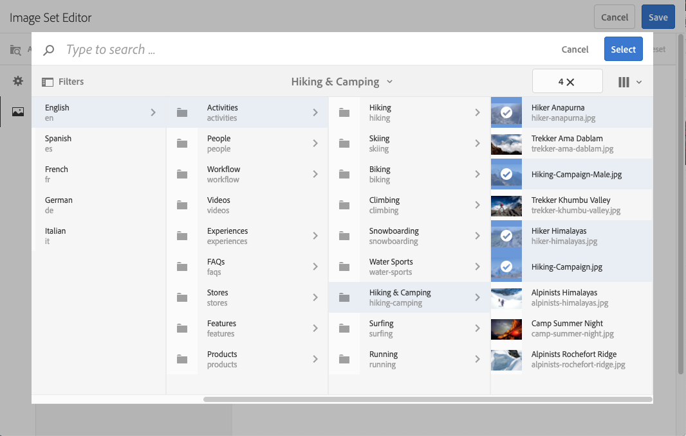
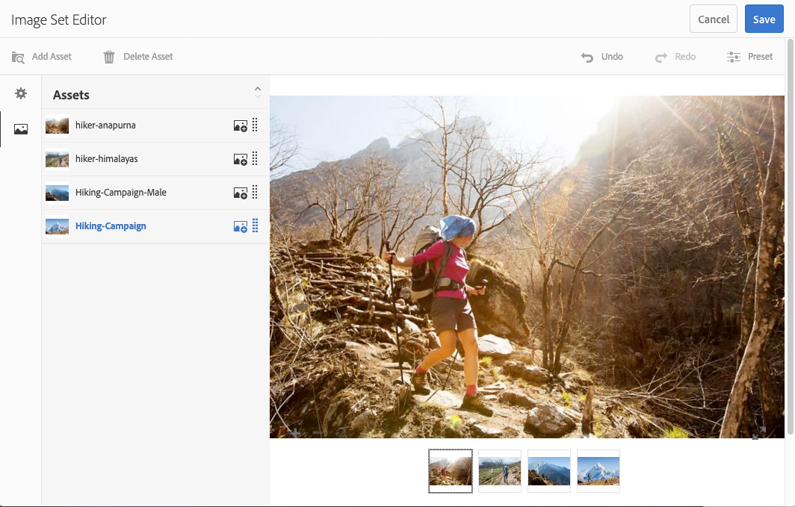

# 影像集 {#image-sets}

影像集可為使用者提供整合的檢視體驗，讓使用者按一下縮圖影像即可看見項目的不同檢視。 「影像集」可讓您呈現項目的替代檢視，而檢視器提供縮放工具，以密切檢查影像。

影像集由具有單字的橫幅指定 `IMAGESET`。此外，如果已發佈影像集，則會顯示以 **[!UICONTROL World]** 圖示表示的發佈日期與上次修改日期(以 **** Pencil圖示表示)在橫幅上。

在影像集內，您也可以建立「影像集」並新增縮圖來建立色票。

當要以不同顏色、模式或完成顯示項目時，此應用程式非常有用。 要使用顏色色板建立影像集，需要為要呈現給用戶的不同顏色、圖案或完成建立一個影像。 每種顏色、圖樣或完成還需要一個顏色、圖樣或完成色板。

例如，假設您想要呈現具有不同顏色鈔票的大寫影像；賬單是紅色、綠色和藍色的。 在這個情況下，你需要三槍一槍。 你需要一張紅色的，一張綠色的，一張藍色的。 您也需要紅色、綠色和藍色色票。 顏色色板用作縮圖，用戶可在「色板集查看器」中按一下該縮圖，以查看紅色計費、綠色計費或藍色計費的帽子。

>[!NOTE]
>
>如需Assets使用者介面的資訊，請參閱[管理資產](/help/assets/manage-assets.md)。

## 快速入門：影像集{#quick-start-image-sets}

**快速啟動並運行：**

1. [上傳多個檢視的主要來源影像](#uploading-assets-in-image-sets)。

   首先，上傳影像集的影像。 選擇影像時，請記住，客戶可以在影像集檢視器中放大影像。 請確定影像在最大尺寸中至少為2000像素，以獲得最佳縮放詳細資訊。 Dynamic Media可以每張2500萬像素的影像呈現。 例如，您可以使用5000 x 5000百萬像素影像或任何其它大小組合，最高2500萬像素。

   Adobe Experience Manager Assets支援許多影像檔案格式，但建議使用無損TIFF、PNG和EPS影像。

1. [建立影像集](#creating-image-sets)。

   在「影像集」中，用戶按一下「影像集查看器」中的縮圖影像。

   若要在「資產」中建立影像集，請點選或按一下「建立&#x200B;**** > **[!UICONTROL 影像集]**」。 然後，添加影像，然後按一下&#x200B;**[!UICONTROL Save]**。

   您也可以透過[批次集預設集](/help/assets/config-dms7.md)自動建立影像集。
   >[!IMPORTANT]
   >
   >批集由IPS(Image Production System)建立，作為資產提取的一部分，僅可在Dynamic Media - Scene7模式中使用。

   請參閱[準備要上傳和上傳檔案的影像集資產](#uploading-assets-in-image-sets)。

   請參閱[使用選取器](/help/assets/working-with-selectors.md)。

1. 視需要新增[影像集檢視器預設集](/help/assets/managing-viewer-presets.md)。

   管理員可以建立或修改影像集檢視器預設集。 若要檢視您使用檢視器預設集所設定的影像集，請選取該影像集，然後在左側導軌下拉式選單中，選取「**[!UICONTROL 檢視器]**」。

   如果要建立或編輯查看器預設集，請參閱&#x200B;**[!UICONTROL 工具]** > **[!UICONTROL 資產]** > **[!UICONTROL 查看器預設集]**。

1. （可選）[查看使用批集預設集建立的影像集](/help/assets/image-sets.md#viewing-image-sets)。
1. [預覽影像集](/help/assets/previewing-assets.md)。

   選取「影像集」，即可預覽。 按一下縮圖圖示，以便在選取的檢視器中檢查影像集。 您可以從&#x200B;**[!UICONTROL 檢視器]**&#x200B;選單中選擇不同的檢視器，該選單可從左側導軌下拉式選單中取得。

1. [發佈影像集](/help/assets/publishing-dynamicmedia-assets.md)。

   發佈影像集會啟用URL和內嵌程式碼。 此外，您必須[發佈您已建立的任何自訂檢視器預設集](/help/assets/managing-viewer-presets.md)。 已發佈現成可用的檢視器預設集。

1. [將URL連結至您的Web](/help/assets/linking-urls-to-yourwebapplication.md) 應用程 [式，或內嵌視訊或影像檢視器](/help/assets/embed-code.md)。

   Experience Manager資產會建立影像集的URL呼叫，並在您發佈影像集後啟用它們。 您可以在預覽資產時複製這些URL。 或者，您也可以將它們嵌入您的網站。

   選取「影像集」，然後在左側導軌下拉式選單中選取「檢 **[!UICONTROL 視器]**」。

   請參 [閱連結影像集至網頁](/help/assets/linking-urls-to-yourwebapplication.md)[和內嵌影片或影像檢視器](/help/assets/embed-code.md)。

要編輯影像集，請參閱[編輯影像集](#editing-image-sets)。 此外，還可以查看和編輯[影像集屬性](/help/assets/manage-assets.md#editing-properties)。

如果您建立集時遇到問題，請參閱[疑難排解Dynamic Media - Scene7模式](/help/assets/troubleshoot-dms7.md#images-and-sets)中的影像和集。

## 上傳影像集{#uploading-assets-in-image-sets}中的資產

首先，上傳影像集的影像。 選擇影像時，請記住，客戶可以在影像集檢視器中放大影像。 請確定影像在最大尺寸中至少為2000像素。影像集支援許多影像檔案格式，但建議使用無損TIFF、PNG和EPS影像。

您可以像上傳[資產](/help/assets/manage-assets.md#uploading-assets)中的任何其他資產一樣，上傳影像集的影像。

### 準備要上傳的影像集資產{#preparing-image-set-assets-for-upload}

建立影像集之前，請確定影像的大小和格式正確。

要建立多視圖影像集，您需要顯示不同視點的項目或顯示同一項目的不同方面的影像。 其目的是要反白標示項目的重要功能，讓檢視者能完整掌握項目的外觀或用途。

因為使用者可以在影像集中縮放影像，請確定影像在最大尺寸中至少為2000像素。 Assets支援許多影像檔案格式，但建議使用無損TIFF、PNG和EPS影像。

>[!NOTE]
>
>此外，如果您使用縮圖來指示產品色票，則必須執行下列操作：
>
>您需要同一影像的暈映或不同鏡頭，以不同的顏色、圖案或完整度顯示。 您還需要與不同顏色、圖案或結束相對應的縮圖檔案。 例如，若要以影像集呈現縮圖，並以黑色、棕色和綠色顯示相同的夾克，您需要：
>
>* 黑色、棕色和綠色的同一件夾克。
>* 黑色、棕色和綠色縮圖。

## 建立影像集{#creating-image-sets}

您可以透過使用者介面或API建立影像集。 本節說明如何在UI中建立影像集。

>[!NOTE]
>
>您也可以透過[批次集預設集](/help/assets/config-dms7.md#creating-batch-set-presets-to-auto-generate-image-sets-and-spin-sets)自動建立影像集。
>**重要：**&#x200B;批集由IPS(Image Production System)建立，作為資產提取的一部分，僅可在Dynamic Media - Scene7模式中使用。

將資產新增至資產集時，資產會以英數字元順序自動新增。 新增資產後，您可以手動重新排序或排序資產。

>[!NOTE]
>
>檔案名稱中為「，」（逗號）的資產不支援影像集。

**建立影像集**

1. 在Experience Manager中，點選Experience Manager標誌以存取全域導覽主控台，然後點選&#x200B;**[!UICONTROL Navigation]** > **[!UICONTROL Assets]**。 導覽至您要建立影像集的位置，然後點選「**[!UICONTROL Create]** > **[!UICONTROL Image Set]** 」以開啟「Image Set Editor」頁面。

   您也可以從包含資產的資料夾內建立資產集。

   

1. 在「影像集編輯器」頁的&#x200B;**[!UICONTROL Title]**&#x200B;欄位中，輸入影像集的名稱。 名稱會出現在影像集的橫幅中。 （可選）輸入說明。

   

1. 執行下列任一操作：

   * 在「影像集編輯器」頁面的左上角附近，點選「**[!UICONTROL 新增資產]**」。

   * 在「影像集編輯器」頁面的中間附近，點選&#x200B;**[!UICONTROL 點選以開啟「資產選取器」]**。
   點選以選取您要納入影像集的資產。 選取的資產上面有核取標籤圖示。完成後，在頁面右上角附近，點選「 **[!UICONTROL Select]** 」。

   使用「資產選擇器」，您可以輸入關鍵字並點選或按一下「退貨」來搜尋 **[!UICONTROL 資產]**。您也可以套用篩選條件來調整搜尋結果。您可以依路徑、系列、檔案類型和標籤來篩選。選取篩選，然後點選工具 **[!UICONTROL 列上的]** 「篩選」圖示。點選「檢視」圖示並選取「欄檢視」、「卡片檢視」或「清 **[!UICONTROL 單檢視」]**, **[!UICONTROL 以變更]**&#x200B;檢視 ****。

   請參閱[使用選取器](/help/assets/working-with-selectors.md)。

   

1. 將資產新增至資產集時，資產會以英數字元順序自動新增。 新增資產後，您可以手動重新排序或排序資產。

   如有必要，請將資產的「重新排序」圖示拖曳至資產檔案名稱的右側，以在設定清單上或下重新排序影像。

   

   如果您想要變更縮圖或色票，請按一 **下影像旁** 的+ **縮圖** 圖示，並導覽至您想要的縮圖或色票。選取完所有影像後，按一下「 **[!UICONTROL 儲存]**」。

1. （選用）執行下列任一操作：

   * 若要刪除影像，請選取影像並點選&#x200B;**[!UICONTROL 刪除資產]**。

   * 若要套用預設集，在頁面右上角附近，點選&#x200B;**[!UICONTROL Preset]**，然後選取一個預設集，一次套用至所有資產。
   >[!NOTE]
   >
   >建立影像集時，您可以變更影像集縮圖，或允許Experience Manager根據影像集中的資產自動選取縮圖。 若要選取縮圖，請點選「影像集編輯器」頁面上「標題」欄位上方的「變更縮圖 **** 」，然後選取任何影像 (您也可以導覽至其他檔案夾以尋找影像)。如果您已選取縮圖，然後決定要Experience Manager從影像集產生縮圖，請選取「**[!UICONTROL 切換至]** **[!UICONTROL 自動縮圖]**」。

1. 按一下「**[!UICONTROL 儲存]**」。新建立的「影像集」(Image Set)會顯示在您建立它的資料夾中。

## 查看影像集{#viewing-image-sets}

您可以在用戶介面中建立影像集，或自動使用[批集預設集](/help/assets/config-dms7.md#creating-batch-set-presets-to-auto-generate-image-sets-and-spin-sets)。

>[!IMPORTANT]
>
>批集由IPS [Image Production System]建立，作為資產提取的一部分，僅可在Dynamic Media - Scene7模式中使用。)

但是，使用批集預設集建立的集，do *not*&#x200B;將出現在用戶介面中。 您可以透過三種不同方式來檢視這些集合。 （即使您在使用者介面中建立影像集，這些方法仍可供使用）。

* 開啟個別資產的屬性。 屬性會指出所參考之選定資產或其成員的設定。 如果要查看整個集，請按一下集的名稱。

   

* 來自任何組的成員映像。選擇&#x200B;**[!UICONTROL 集]**&#x200B;菜單以顯示資產所屬的集。

   

* 在搜索中，可以選擇&#x200B;**[!UICONTROL Filter]**，然後展開&#x200B;**[!UICONTROL Dynamic Media]**&#x200B;並選擇&#x200B;**[!UICONTROL Sets]**。

   搜尋會傳回在UI中手動建立或透過批次集預設集自動建立的相符集。 對於自動集，搜尋查詢是使用「開頭為」搜尋條件來執行，這與以「包含」搜尋條件為基礎的Experience Manager搜尋不同。 將篩選器設定為&#x200B;**[!UICONTROL Sets]**&#x200B;是搜索自動集的唯一方法。

   

>[!NOTE]
>
>您可以透過使用者介面來檢視集，如[編輯影像集](#editing-image-sets)所述。

## 編輯影像集{#editing-image-sets}

您可以對影像集執行各種編輯任務，如：

* 將影像新增至影像集。
* 重新排序影像集中的影像。
* 刪除影像集中的資產。
* 套用檢視器預設集。
* 刪除影像集。

**要編輯影像集：**

1. 執行下列任一操作：

   * 暫留在「影像集」資產上，然後點選&#x200B;**[!UICONTROL Edit]**（鉛筆圖示）。
   * 暫留在「影像集」資產上，點選「**[!UICONTROL 選取]**」（核取標籤圖示），然後點選工具列上的「**[!UICONTROL 編輯]**」。
   * 點選「影像集」資產，然後點選工具列上的「 **[!UICONTROL Edit]**（鉛筆圖示）」。

1. 要編輯「影像集」中的影像，請執行以下操作之一：

   * 若要重新排序資產，請拖曳影像至新位置（選取重新排序圖示以移動項目）。
   * 若要依遞增或遞減順序排序項目，請按一下欄標題。
   * 若要新增資產或更新現有資產，請按一下「**[!UICONTROL 新增資產]**」。 導覽至資產，選取資產，然後點選頁面右上角的&#x200B;**[!UICONTROL 選取]**。

      >[!NOTE]
      >
      >如果您以其他影像取代縮圖，以刪除Experience Manager用於縮圖的影像，仍會顯示原始資產。
   * 若要刪除資產，請選取資產，然後點選或按一下「刪除資產」**[!UICONTROL 「]**」。
   * 若要套用預設集，在頁面右上角附近，點選&#x200B;**[!UICONTROL Preset]**，然後選取檢視器預設集。
   * 若要新增或變更縮圖，請選取資產右側的縮圖圖示。 導覽至新的縮圖或色票資產，選取它，然後點選&#x200B;**[!UICONTROL 選取]**。
   * 若要刪除整個影像集，請導覽至影像集，選取它，然後點選&#x200B;**[!UICONTROL Delete]**。

   >[!NOTE]
   >
   >您可以導覽至影像集，點選左側導軌中的「設定成員 **** 」，然後點選個別資產上的「鉛筆」圖示以開啟編輯視窗，以編輯影像集中的影像。

1. 完成編輯時，點選「**[!UICONTROL 儲存]**」。

## 預覽影像集{#previewing-image-sets}

請參閱「預覽資產](/help/assets/previewing-assets.md)」。[

## 發佈影像集{#publishing-image-sets}

請參閱[發佈資產](/help/assets/publishing-dynamicmedia-assets.md)。
