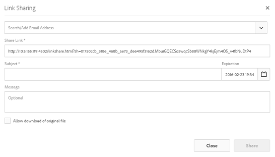

# 透過連結分享資產 {#asset-link-sharing}

Adobe Experience Manager(AEM)Assets可讓您與組織成員及外部實體（包括合作夥伴和廠商）以URL形式共用資產、檔案夾和系列。 透過連結分享資產是讓外部廠商可使用資源的便利方式，而不需要先登入AEM Assets。

>[!NOTE]
>
>您需要對要作為連結共用的資料夾或資產具有編輯ACL權限。

## 共用資產 {#sharelink}

若要產生您要與使用者共用之資產的URL，請使用「連結共用」對話方塊。 具有管理員權限或在位置具有讀取權 `/var/dam/share` 限的使用者可檢視與其共用的連結。

>[!NOTE]
>
>在您與使用者共用連結之前，請確定已設定Day CQ Mail Service。 如果您嘗試共用連結而未先設定Day CQ [Mail服務，就會發生錯誤](/help/assets/link-sharing.md#configmailservice)。

1. 在「資產」使用者介面中，選取要以連結形式共用的資產。
1. 在工具列中，按一下／點選「共 **[!UICONTROL 用連結]**。

   資產連結會在「共用連結」欄位中 **[!UICONTROL 自動建立]** 。 複製此連結並與使用者共用。 連結的預設有效期為一天。

   

   *圖：與連結共用對話方塊*

   或者，繼續執行本程式的步驟3-7以新增電子郵件收件者、設定連結的過期時間，並從對話方塊傳送。

   >[!NOTE]
   >
   >如果您想要將AEM Author例項的連結共用給外部實體，請確定您只針對請求公開下列URL（用於連結共用） `GET` 。 封鎖其他URL以確保AEM Author的安全性。
   >
   >* http://&lt;aem_server>:&lt;port>/linkshare.html
   * http://&lt;aem_server>:&lt;port>/linksharepreview.html
   * http://&lt;aem_server>:&lt;port>/linkexpired.html

   >[!NOTE]
   如果共用資產移至不同位置，其連結將停止運作。 重新建立連結並與使用者重新共用。

1. 從Web主控台開啟 **[!UICONTROL Day CQ Link Externalizer]** configuration，並在 **[!UICONTROL Domains]**  (網域) 欄位中修改下列屬性，並針對每個欄位提及值：

   * 本機
   * 作者
   * 發佈
   對於本機和作者屬性，請分別提供本機和作者實例的URL。 如果您執行單一AEM作者例項，本機和作者屬性的值都相同。 對於發佈，請提供發佈例項的URL。

1. 在「連結共用」對話方 **[!UICONTROL 塊的電子郵件地址方塊中]** ，輸入您要共用連結之使用者的電子郵件ID。您也可以與多位使用者共用連結。

   如果使用者是您組織的成員，請從顯示在輸入區域下方清單中的建議電子郵件ID中，選取使用者的電子郵件ID。 對於外部使用者，輸入完整的電子郵件ID，然後從清單中選取它。

   要啟用發送給用戶的電子郵件，請在第CQ天郵件服務中配置SMTP服 [務器詳細資訊](#configmailservice)。

   

   直接從「連結共用」對話方塊分享資產連結

   >[!NOTE]
   如果您輸入非您組織成員之使用者的電子郵件ID,「外部使用者」會加上使用者的電子郵件ID前置詞。

1. 在「主 **[!UICONTROL 體]** 」方塊中，輸入您要共用之資產的主體。
1. 在「消 **[!UICONTROL 息]** 」框中，輸入可選消息。
1. 在「過 **[!UICONTROL 期]** 」欄位中，使用日期選擇器指定連結的到期日期和時間。 依預設，到期日是從您共用連結的日期開始的一週。

   

1. 若要讓使用者下載原始影像以及轉譯，請選取「允 **[!UICONTROL 許下載原始檔案」]**。

   >[!NOTE]
   依預設，使用者只能下載您以連結形式共用之資產的轉譯。

1. 按一下&#x200B;**[!UICONTROL 「共用」]**。訊息會確認連結是透過電子郵件與使用者共用。
1. 若要檢視共用資產，請按一下／點選傳送給使用者之電子郵件中的連結。 共用資產會顯示在 **[!UICONTROL Adobe Marketing Cloud頁面中]** 。

   

   若要切換至清單檢視，請按一下／點選工具列中的版面選項。

1. 若要產生資產的預覽，請按一下/點選共用資產。若要關閉預覽並返回 **[!UICONTROL Marketing Cloud]** ，請按一下工具列中的「上 **[!UICONTROL 一步]** 」。如果您已共用資料夾，請按一下/點選「 **[!UICONTROL 上層資料夾]** 」以返回上層資料夾。

   

   >[!NOTE]
   AEM支援產生下列MIME類型資產的預覽：JPG、PNG、GIF、BMP、INDD、PDF和PPT。 您只能下載其他MIME類型的資產。

1. 若要下載共用資產，請點選工 **[!UICONTROL 具列中的]** 「選取」，按一下／點選資產，然後從工具列中按一下／點選「 **[!UICONTROL 下載]** 」。

   

1. 若要檢視您共用為連結的資產，請前往「資產」UI並點選Experience Manager標誌。 從清 **[!UICONTROL 單選擇]** 「導覽」，以顯示「導覽」窗格。
1. 從「導覽」窗格中，選 **[!UICONTROL 擇「共用連結]** 」以顯示共用資產清單。
1. 若要取消共用資產，請選取資產，然後從工具列點選／按 **[!UICONTROL 一下]** 「取消共用」。 之後會出現確認訊息。 資產的項目會從清單中移除。

## 配置日CQ郵件服務 {#configmailservice}

1. 在Experience manager首頁上，導覽至「工 **[!UICONTROL 具]** > **[!UICONTROL 作業]** > **[!UICONTROL Web主控台]**」。
1. 從服務清單中，找到 **[!UICONTROL Day CQ Mail Service]**。
1. Tap **[!UICONTROL Edit]** beside the service, and configure the following parameters for **[!UICONTROL Day CQ Mail Service]** with the details mentioned against their names:

   * SMTP伺服器主機名：電子郵件伺服器主機名
   * SMTP伺服器埠：電子郵件伺服器端
   * SMTP用戶：電子郵件伺服器使用者名稱
   * SMTP密碼：電子郵件伺服器密碼
   

1. 按一下／點選「 **[!UICONTROL 儲存]**」。

## 配置最大資料大小 {#maxdatasize}

當您使用「連結共用」功能從共用的連結下載資產時，AEM會從儲存庫壓縮資產階層，然後以ZIP檔案傳回資產。 但是，在ZIP檔案中壓縮的資料量沒有限制的情況下，大量資料會遭受壓縮，造成JVM中記憶體錯誤。 為防止系統因此遭受潛在的拒絕服務攻擊，請使用 **[!UICONTROL Configuration Manager中Day CQ的]** Max Content Size（未壓縮）  Day CQ DAM Adhoc Asset Share Proxy servlet參數配置最大大小。 如果資產的未壓縮大小超過設定的值，資產下載請求便會遭拒。 預設值為100 MB。

1. 按一下/點選AEM標誌，然後前往「工 **[!UICONTROL 具]** > **[!UICONTROL 作業]** >網 **[!UICONTROL 頁主控台]**」。
1. 從Web主控台中，找到 **[!UICONTROL Day CQ DAM Adhoc Asset Share Proxy servlet設定]** 。
1. 在編輯模 **[!UICONTROL 式中開啟「日CQ DAM臨機資產共用代理Servlet]** 」設定，並修改「最大內容大小 (未壓縮) 」 **[!UICONTROL 參數的值]** 。

   

1. 儲存變更。

## Best practices and troubleshooting {#bestpractices}

* 資產檔案夾或名稱中包含空白字元的系列可能無法共用。
* 如果使用者無法下載共用資產，請洽詢您的AEM管理員下 [載限制](#maxdatasize) 。
* 如果您無法傳送含有共用資產連結的電子郵件，或如果其他使用者無法收到您的電子郵件，請洽詢您的AEM管理員( [是否已設定](#configmailservice) 電子郵件服務)。
* 如果您無法使用連結共用功能來共用資產，請確定您擁有適當的權限。 請參閱 [分享資產](#sharelink)。
