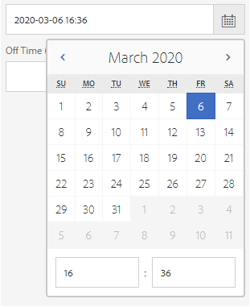
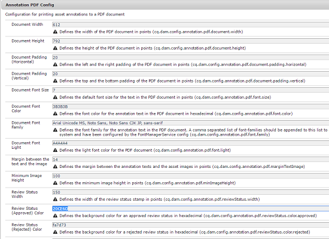

# 管理您的數位資產 {#manage-digital-assets}

在 [!DNL Adobe Experience Manager Assets]，您可以做的不只是儲存及管理資產。 [!DNL Experience Manager] 提供企業級資產管理功能。 您可以編輯和共用資產、執行進階搜尋，以及建立數十種支援檔案格式的多種轉譯。 您也可以管理版本和數位權限、自動處理資產、管理和管理中繼資料、使用註解進行協作等。

本文主要介紹基本的資產管理任務，如建立或上傳；元資料更新；複製、移動和刪除；發佈、取消發佈和搜尋資產。 若要了解使用者介面，請參閱 [開始使用assets使用者介面](/help/sites-authoring/basic-handling.md). 若要管理內容片段，請參閱 [管理內容片段](/help/assets/content-fragments/content-fragments-managing.md) 資產。

## 建立資料夾 {#creating-folders}

組織資產集合時(例如，全部 `Nature` 影像，您可以建立資料夾以將它們保持在一起。 您可以使用資料夾來分類及組織資產。 [!DNL Experience Manager Assets] 不要求您組織資料夾中的資產，以提高運作效率。

>[!NOTE]
>
>* 共用 [!DNL Assets] 類型的資料夾 `sling:OrderedFolder` 共用至Experience Cloud時不支援。 如果要共用資料夾，請不選擇 [!UICONTROL 已訂購] 建立資料夾時。
>* [!DNL Experience Manager] 不允許使用 `subassets` word作為資料夾的名稱。 它是為包含複合資產子資產的節點保留的關鍵字。


1. 導覽至您要建立資料夾的數位資產資料夾中的位置。 在功能表中，按一下 **[!UICONTROL 建立]**. 選擇 **[!UICONTROL 新資料夾]**.
1. 在 **[!UICONTROL 標題]** 欄位，提供資料夾名稱。 依預設，DAM會使用您提供的標題作為資料夾名稱。 建立資料夾後，您可以覆寫預設值並指定其他資料夾名稱。
1. 按一下&#x200B;**[!UICONTROL 建立]**。您的資料夾會顯示在數位資產資料夾中。

不支援下列（以空格分隔的）字元清單：

* 資產檔案名稱不能包含下列任一字元： `* / : [ \\ ] | # % { } ? &`
* 資產資料夾名稱不能包含下列任一字元： `* / : [ \\ ] | # % { } ? \" . ^ ; + & \t`

請勿在資產檔案名稱的副檔名中加入特殊字元。

## 上傳資產 {#uploading-assets}

<!-- TBD the following:
Move this section into a new article. CQDOC-14874 ticket is created for this.
In this complete article, replace emphasis with UICONTROL where appropriate.
-->

您可以從本機資料夾或網路磁碟上傳各種類型的資產(包括影像、PDF檔案、RAW檔案等)至 [!DNL Experience Manager Assets].

>[!NOTE]
>
>在Dynamic Media - Scene7模式中，預設資產上傳檔案大小為2 GB或更小。 若要設定大於2 GB至15 GB的資產上傳，請參閱 [（選用）設定Dynamic Media - Scene7模式，以上傳大於2 GB的資產](/help/assets/config-dms7.md#optional-config-dms7-assets-larger-than-2gb).

您可以選擇將資產上傳至資料夾，且無論資料夾是否已指派處理設定檔。

若資料夾已指派處理設定檔，設定檔名稱會顯示在卡片檢視的縮圖上。 在清單檢視中，描述檔名稱會出現在 **處理設定檔** 欄。 請參閱 [處理設定檔](/help/assets/processing-profiles.md).

上傳資產之前，請確定資產位於 [格式](/help/assets/assets-formats.md) the [!DNL Experience Manager Assets] 支援。

1. 在 [!DNL Assets] 使用者介面，導覽至您要新增數位資產的位置。
1. 若要上傳資產，請執行下列其中一項操作：

   * 在工具列上，按一下 **[!UICONTROL 建立]**. 然後在功能表上，按一下 **[!UICONTROL 檔案]**. 您可以視需要重新命名顯示對話方塊中的檔案。
   * 在支援HTML5的瀏覽器中，將資產直接拖曳至 [!DNL Assets] 使用者介面。 不會顯示要更名檔案的對話框。

   

   若要選取多個檔案，請選取 `Ctrl` 或 `Command` 鍵並在檔案選取器對話方塊中選取資產。 使用iPad時，一次只能選取一個檔案。

   您可以暫停上傳大型資產（大於500 MB），稍後從同一頁繼續。 按一下 **[!UICONTROL 暫停]** 上傳開始時顯示的進度列旁邊。

   

資產視為大型資產的大小可設定。 例如，您可以將系統設為將大於1000 MB（而非500 MB）的資產視為大型資產。 在這種情況下， **[!UICONTROL 暫停]** 上傳大於1000 MB的資產時，進度列上會顯示。

此 [!UICONTROL 暫停] 選項不會顯示檔案大於1000 MB時上傳的檔案小於1000 MB。 不過，如果取消少於1000-MB的檔案上傳，則 **[!UICONTROL 暫停]** 選項。

若要修改大小限制，請設定 `chunkUploadMinFileSize` 屬性 `fileupload` 節點。

當您按一下 **[!UICONTROL 暫停]**，則會切換至 **[!UICONTROL 播放]** 選項。 若要繼續上傳，請按一下 **[!UICONTROL 播放]**.

若要取消持續上傳，請按一下關閉(`X`)。 取消上傳操作時， [!DNL Assets] 刪除資產的已部分上傳部分。

能夠繼續上傳在低頻寬情況和網路故障中特別有用，因為上傳大型資產需要很長時間。 您可以暫停上傳操作，並在情況改善時稍後繼續。 繼續時，上傳會從您暫停的點開始。

在上傳作業期間， [!DNL Experience Manager] 會將要上傳的資產部分儲存為CRX存放庫中的資料區塊。 上傳完成時， [!DNL Experience Manager] 將這些區塊整合至存放庫中的單一資料區塊中。

要配置未完成的區塊上載作業的清除任務，請轉至 `https://[aem_server]:[port]/system/console/configMgr/org.apache.sling.servlets.post.impl.helper.ChunkCleanUpTask`.

>[!CAUTION]
>
>預設值為500 MB且區塊大小為50 MB時，就會觸發區塊上傳。 如果您編輯 [Apache Jackrabbit Oak TokenConfiguration](https://experienceleague.adobe.com/docs/experience-cloud-kcs/kbarticles/KA-16464.html) 並設定 `timeout configuration` 若時間少於資產上傳所需的時間，當資產上傳進行中時，您會遇到工作階段逾時情況。 因此，請變更 `chunkUploadMinFileSize` 和 `chunksize` 以便每個區塊要求都會重新整理工作階段。
>
>在憑證過期逾時、延遲、頻寬和預期的同時上傳的情況下，最高值可讓您確保已挑選下列項目：
>
>* 確保在上載過程中為可能導致憑據過期的檔案啟用區塊上載。
>
>* 確保每個區塊在憑據過期之前完成。


如果您上傳的資產名稱與資產相同，且在上傳資產的位置已可用，則會顯示警告對話方塊。

您可以選取重新命名已上傳的新資產，以取代現有資產、建立其他版本，或保留兩者。 如果您取代現有資產，則會刪除資產的中繼資料以及您對現有資產所做的任何先前修改（例如注釋或裁切）。 如果您選擇保留這兩個資產，新資產會以數字重新命名 `1` 附加至名稱。


>[!NOTE]
>
>選取 **[!UICONTROL 取代]** 在 [!UICONTROL 名稱衝突] 對話框中，將為新資產重新生成資產ID。 此ID與先前資產的ID不同。
>
>如果啟用「資產分析」，可追蹤曝光次數或點按次數 [!DNL Adobe Analytics]，重新產生的資產ID會讓上為資產擷取的資料失效 [!DNL Analytics].

如果您上傳的資產存在於 [!DNL Assets], **[!UICONTROL 檢測到重複項]** 對話方塊會警告您嘗試上傳重複資產。 只有在 `SHA 1` 現有資產的二進位檢查加總值與您上傳之資產的檢查加總值相符。 在這種情況下，資產名稱並不重要。

>[!NOTE]
>
>此 [!UICONTROL 檢測到重複項] 對話框僅在啟用重複檢測功能時顯示。 若要啟用重複偵測功能，請參閱 [啟用重複檢測](/help/assets/duplicate-detection.md).


若要在 [!DNL Assets]，按一下 **[!UICONTROL 保留]**. 若要刪除您上傳的重複資產，請按一下 **[!UICONTROL 刪除]**.

[!DNL Experience Manager Assets] 防止上傳檔案名稱中含有禁止字元的資產。 如果您嘗試上傳檔案名稱包含不允許的字元或更多字元的資產， [!DNL Assets] 顯示警告訊息並停止上傳，直到您移除這些字元或上傳並且允許名稱為止。

若要符合貴組織的特定檔案命名慣例，請 [!UICONTROL 上傳資產] 對話方塊可讓您為上傳的檔案指定長名稱。

不過，不支援下列（以空格分隔的）字元清單：

* 資產檔案名稱不得包含 `* / : [ \\ ] | # % { } ? &`
* 資產資料夾名稱不得包含 `* / : [ \\ ] | # % { } ? \" . ^ ; + & \t`

請勿在資產檔案名稱的副檔名中加入特殊字元。


此外， [!DNL Assets] 使用者介面會顯示您上傳的最新資產，或您先建立的資料夾。

如果您在檔案上傳前取消上傳操作， [!DNL Assets] 停止上傳目前的檔案並重新整理內容。 不過，不會刪除已上傳的檔案。

上傳進度對話方塊，位於 [!DNL Assets] 顯示成功上傳的檔案的計數以及無法上傳的檔案。

### 串列上傳 {#serialuploads}

大量上傳大量資產會耗用大量的I/O資源，這可能會對您的 [!DNL Assets] 部署。 尤其是，如果您的網際網路連線速度緩慢，上傳時間會因磁碟I/O尖峰而大幅增加。此外，您的網頁瀏覽器可能會對POST請求數量施加額外限制 [!DNL Assets] 可處理同時上傳的資產。 因此，上傳作業會失敗或過早終止。 換句話說， [!DNL Experience Manager Assets] 可能會在擷取大量檔案時遺失某些檔案，或完全無法擷取任何檔案。

為了克服這種情況， [!DNL Assets] 在大量上傳作業期間一次內嵌一個資產（串列上傳），而非同時內嵌所有資產。

資產的串列上傳預設為啟用。 若要停用功能並允許同時上傳，請覆蓋 `fileupload` 節點，並設定 `parallelUploads` 屬性 `true`.

### 使用FTP上傳資產 {#uploading-assets-using-ftp}

Dynamic Media可透過FTP伺服器批次上傳資產。 如果您要上傳大型資產(>1 GB)或上傳整個資料夾和子資料夾，應使用FTP。 您甚至可以設定FTP上傳，以定期執行。

>[!NOTE]
>
>在Dynamic Media - Scene7模式中，預設資產上傳檔案大小為2 GB或更小。 若要設定大於2 GB至15 GB的資產上傳，請參閱 [（選用）設定Dynamic Media - Scene7模式，以上傳大於2 GB的資產](/help/assets/config-dms7.md#optional-config-dms7-assets-larger-than-2gb).

>[!NOTE]
>
>若要在Dynamic Media - Scene7模式下透過FTP上傳資產，請在 [!DNL Experience Manager] 製作例項。 連絡人 [Adobe客戶支援](https://experienceleague.adobe.com/?support-solution=General#support) 若要存取FP-18912並完成FTP帳戶的設定。 如需詳細資訊，請參閱 [安裝Feature Pack 18912以大量移轉資產](/help/assets/bulk-ingest-migrate.md).
>
>如果您使用FTP來上傳資產，則 [!DNL Experience Manager] 會被忽略。 系統會改用Dynamic Media Classic中定義的檔案處理規則。

**使用FTP上傳資產**

1. 使用您選擇的FTP用戶端，使用您從布建電子郵件收到的FTP使用者名稱和密碼登入FTP伺服器。 在FTP用戶端中，將檔案或資料夾上傳至FTP伺服器。

1. 開啟 [Dynamic Media Classic案頭應用程式](https://experienceleague.adobe.com/docs/dynamic-media-classic/using/intro/dynamic-media-classic-desktop-app.html#system-requirements-dmc-app)，然後登入您的帳戶。

   配置時，Adobe提供了您的憑據和登錄。 如果您沒有此資訊，請聯絡Adobe客戶支援。

1. 在全域導覽列上，按一下 **[!UICONTROL 上傳]**.
1. 在「上傳」頁面左上角附近，按一下 **[!UICONTROL 透過FTP]** 標籤。
1. 在頁面左側，選擇要上傳檔案的FTP資料夾；在頁面的右側，選擇目標資料夾。
1. 在頁面的右下角附近，按一下 **[!UICONTROL 作業選項]** 然後，根據您選取之資料夾中的資產，設定您想要的選項。

   請參閱 [上傳作業選項](#upload-job-options).

   >[!NOTE]
   >
   >透過FTP上傳資產時，您在Dynamic Media Classic(S7)中設定的上傳工作選項，會取代在 [!DNL Experience Manager].

1. 在「上載作業選項」對話框的右下角，按一下 **[!UICONTROL 儲存]**.
1. 在「上傳」頁面的右下角，按一下 **[!UICONTROL 提交上傳]**.

   若要檢視上傳進度，請在全域導覽列上，按一下 **[!UICONTROL 工作]**. 「作業」頁面會顯示上傳的進度。 您可以繼續在 [!DNL Experience Manager] 並隨時返回Dynamic Media Classic中的「工作」頁面，以檢閱進行中的工作。
要取消正在執行的上載作業，請按一下 **[!UICONTROL 取消]** 在「持續時間」旁邊。

#### 上傳作業選項 {#upload-job-options}

| 上傳選項 | 子選項 | 說明 |
|---|---|---|
| 工作名稱 |  | 在文本欄位中預填的預設名稱包括用戶輸入的名稱部分和日期和時間戳。 您可以使用預設名稱，或輸入您為此上傳作業建立的名稱。 <br>作業以及其他上傳和發佈作業會記錄在「作業」頁面上，您可在此檢查作業的狀態。 |
| 上傳後發佈 |  | 自動發佈您上傳的資產。 |
| 任何檔案夾內若有基本資產名稱相同者 (無論副檔名為何)，將予以覆寫 |  | 如果您希望上傳的檔案以相同名稱取代現有檔案，請選取此選項。 此選項的名稱可能不同，具體取決於 **[!UICONTROL 應用程式設定]** > **[!UICONTROL 一般設定]** > **[!UICONTROL 上傳至應用程式]** > **[!UICONTROL 覆寫影像]**. |
| 上傳時解壓縮Zip或Tar檔案 |  |  |
| 作業選項 |  | 按一下 **[!UICONTROL 作業選項]** 這樣你就可以開啟 [!UICONTROL 上傳作業選項] 對話框，然後選擇影響整個上載作業的選項。 所有檔案類型的這些選項都相同。<br>您可以從「應用程式一般設定」頁面開始，選擇上傳檔案的預設選項。 要開啟此頁，請選擇 **[!UICONTROL 設定]** > **[!UICONTROL 應用程式設定]**. 選取 **[!UICONTROL 預設上傳選項]** 選項 [!UICONTROL 上傳作業選項] 對話框。 |
|  | 時間 | 選取一次性或循環。 若要設定循環作業，請選擇「重複」選項（每日、每週、每月或自訂），以指定何時要重複執行FTP上傳作業。 然後視需要指定排程選項。 |
|  | 包含子資料夾 | 上傳要上傳之資料夾內的所有子資料夾。 上傳的資料夾及其子資料夾的名稱會自動輸入 [!DNL Experience Manager Assets]. |
|  | 裁切選項 | 要從影像的側面手動裁切，請選擇「裁切」菜單，然後選擇「手動」。 然後輸入要從影像的任何一側或每一側裁切的像素數。 影像被裁切的程度取決於影像檔案中的ppi設定（每英吋像素）。 例如，如果影像顯示150 ppi，而您在「上」、「右」、「下」和「左」文字方塊中輸入75，則會從每側裁切半英吋。<br> 要自動從影像中裁切空白像素，請開啟「裁切」菜單，選擇「手動」，然後在「頂部」、「右」、「底部」和「左側」欄位中輸入像素測量，以便從側面裁切。 您也可以在「裁切」(Crop)菜單中選擇「修剪」(Trim)，然後選擇以下選項：<br> **根據** <ul><li>**顏色**  — 選擇顏色選項。 然後選取「角」菜單，選擇影像的角，該角的顏色最能代表要裁切的空白顏色。</li><li>**透明度**  — 選擇透明度選項。<br> **容許度**  — 拖動滑塊以指定0到1的公差。對於基於顏色的修剪，指定0以僅在像素與在影像的角中選定的顏色完全匹配時裁剪像素。 接近1的數字會產生更多的顏色差異。<br>要根據透明度進行修剪，請指定0隻在像素為透明時裁剪像素。 接近1的數字使透明度更高。</li></ul><br>這些裁切選項不具破壞性。 |
|  | 色彩描述檔選項 | 建立用於傳送的最佳化檔案時，請選擇色彩轉換：<ul><li>預設顏色保留：當影像包含顏色空間資訊時，保持源影像的顏色；沒有顏色轉換。 目前幾乎所有的影像都已內嵌適當的色彩設定檔。 但是，如果CMYK源影像不包含嵌入的顏色配置檔案，則這些顏色將轉換為sRGB（標準紅綠藍）顏色空間。 sRGB是在網頁上顯示影像的建議色域。</li><li>保留原始顏色空間：保留原始顏色，點上不進行任何顏色轉換。 對於沒有內嵌顏色描述檔的影像，任何顏色轉換都使用在「發佈」設定中設定的預設顏色描述檔來完成。 顏色配置檔案可能與使用此選項建立的檔案中的顏色不一致。 因此，建議您使用「預設顏色保留」選項。</li><li>自訂從>到<br> 開啟菜單，以便選擇「轉換自」和「轉換至」顏色空間。 此高級選項將覆蓋嵌入源檔案中的任何顏色資訊。 當您提交的所有影像都包含不正確或遺失的色彩設定檔資料時，請選取此選項。</li></ul> |
|  | 影像編輯選項 | 可以保留影像中的剪裁蒙版，並選擇顏色輪廓。<br> 請參閱 [在上傳時設定影像編輯選項](#setting-image-editing-options-at-upload). |
|  | Postscript選項 | 您可以柵格化PostScript®檔案、裁切檔案、維護透明背景、選擇解析度，以及選擇顏色空間。<br> 請參閱 [設定PostScript和Illustrator上傳選項](#setting-postscript-and-illustrator-upload-options). |
|  | Photoshop選項 | 您可以從Adobe® Photoshop®檔案建立範本、維護圖層、指定圖層的命名方式、擷取文字，以及指定如何將影像錨定到範本中。<br> 不支援範本 [!DNL Experience Manager].<br> 請參閱 [設定Photoshop上傳選項](#setting-photoshop-upload-options). |
|  | PDF選項 | 您可以柵格化檔案、提取搜索詞和連結、自動生成eCatalog、設定解析度，以及選擇顏色空間。<br>中不支援eCatalog [!DNL Experience Manager]. <br> 請參閱 [設定PDF上傳選項](#setting-pdf-upload-options). |
|  | Illustrator選項 | 您可以柵格化Adobe Illustrator®檔案、維護透明背景、選擇解析度，以及選擇顏色空間。<br> 請參閱 [設定PostScript和Illustrator上傳選項](#setting-postscript-and-illustrator-upload-options). |
|  | 視訊選項 | 您可以選擇「視訊預設集」來轉換視訊檔案的程式碼。<br> 請參閱 [設定eVideo上傳選項](#setting-evideo-upload-options). |
|  | 批次集預設集 | 若要從上傳的檔案建立影像集或回轉集，請按一下您要使用之預設集的「作用中」欄。 您可以選取多個預設集。 在Dynamic Media Classic的「應用程式設定/批集預設集」頁面中建立預設集。<br> 請參閱 [配置批集預設集以自動生成影像集和回轉集](config-dms7.md#creating-batch-set-presets-to-auto-generate-image-sets-and-spin-sets) 若要進一步了解如何建立批次集預設集。<br> 請參閱 [在上傳時設定批次集預設集](#setting-batch-set-presets-at-upload). |

#### 設定上傳時影像編輯的選項 {#setting-image-editing-options-at-upload}

上傳影像檔案(包括AI、EPS和PSD檔案)時，您可以在 [!UICONTROL 上傳作業選項] 對話框：

* 從影像邊緣裁切空白字元（請參閱上表說明）。
* 從影像的側面手動裁切（請參閱上表中的說明）。
* 選擇顏色配置檔案（請參閱上表中的選項說明）。
* 從剪裁路徑建立遮色片。
* 使用非銳利化遮色片選項銳利化影像
* 挖空背景

<!--
| Option | Sub-option | Description |
|---|---|---|
| Create Mask From Clipping Path | | Create a mask for the image based on its clipping path information. This option applies to images created with image-editing applications in which a clipping path was created. |
| Unsharp Masking | | Lets you fine-tune a sharpening filter effect on the final downsampled image, controlling the intensity of the effect, the radius of the effect (as measured in pixels), and a threshold of contrast that is ignored.<br> This effect uses the same options as Photoshop’s Unsharp Mask filter. Contrary to what the name suggests, Unsharp Mask is a sharpening filter. Under Unsharp Masking, set the options you want. Setting options are described in the following: |
| | Amount | Controls the amount of contrast that is applied to edge pixels.<br> Think of it as the intensity of the effect. The main difference between the amount values of Unsharp Mask in Dynamic Media and the amount values in Adobe Photoshop, is that Photoshop has an amount range of 1% to 500%. Whereas, in Dynamic Media, the value range is 0.0 to 5.0. A value of 5.0 is the rough equivalent of 500% in Photoshop; a value of 0.9 is the equivalent of 90%, and so on. |
| | Radius | Controls the radius of the effect. The value range is 0-250.<br> The effect is run on all pixels in an image and radiates out from all pixels in all directions. The radius is measured in pixels. For example, to get a similar sharpening effect for a 2000 x 2000 pixel image and 500 x 500 pixel image, you would set a radius of two pixels on the 2000 x 2000 pixel image and a radius value of one pixel on the 500 x 500 pixel image. A larger value is used for an image that has more pixels. |
| | Threshold | Threshold is a range of contrast that is ignored when the Unsharp Mask filter is applied. It is important so that no "noise" is introduced to an image when this filter is used. The value range is 0-255, which is the number of brightness steps in a grayscale image. 0=black, 128=50% gray and 255=white.<br> For example, a threshold value of 12 ignores slight variations is skin tone brightness to avoid adding noise, but still add edge contrast to areas such as where eyelashes meet skin.<br> For example, if you have a photo of someone’s face, the Unsharp Mask affects the parts of the image, such as where eyelashes and skin meet to create an obvious area of contrast, and the smooth skin itself. Even the smoothest skin exhibits subtle changes in brightness values. If you do not use a threshold value, the filter accentuates these subtle changes in skin pixels. In turn, a noisy and undesirable effect is created while contrast on the eyelashes is increased, enhancing sharpness.<br> To avoid this issue, a threshold value is introduced that tells the filter to ignore pixels that do not change contrast dramatically, like smooth skin.<br> In the zipper graphic shown earlier, notice the texture next to the zippers. Image noise is exhibited because the threshold values were too low to suppress the noise. |
| | Monochrome | Select to unsharp-mask image brightness (intensity).<br> Deselect to unsharp-mask each color component separately. |
| Knockout Background | | Automatically removes the background of an image when you upload it. This technique is useful to draw attention to a particular object and make it stand out from a busy background. Select to enable or “turn on” the Knockout Background feature and the following sub-options: |
| | Corner | Required.<br> The corner of the image that is used to define the background color to knockout.<br> You can choose from **Upper Left**, **Bottom Left**, **Upper Right**, or **Bottom Right**. |
| | Fill Method | Required.<br> Controls pixel transparency from the Corner location that you set.<br> You can choose from the following fill methods: <ul><li>**Flood Fill** - turns all pixels transparent that match the Corner that you have specified and are connected to it.</li><li>**Match Pixel** - turns all matching pixels transparent, regardless of their location on the image.</li></ul> |
| | Tolerance | Optional.<br> Controls the allowable amount of variation in pixel color matching based on the Corner location that you set.<br> Use a value of 0.0 to match pixel colors exactly or, use a value of 1.0 to allow for the greatest variation. |
-->

#### 設定PostScript和Illustrator上傳選項 {#setting-postscript-and-illustrator-upload-options}

上傳PostScript(EPS)或Illustrator(AI)影像檔案時，可以以多種方式格式化它們。 您可以柵格化檔案、維護透明背景、選擇解析度和選擇顏色空間。 可在 [!UICONTROL 上傳作業選項] 對話框 [!UICONTROL PostScript選項] 和 [!UICONTROL Illustrator選項].

| 選項 | 子選項 | 說明 |
|---|---|---|
| 處理 |  | 選擇 **[!UICONTROL 光柵化]** 將檔案中的向量圖形轉換為點陣圖格式。 |
| 在渲染的影像中保持透明背景 |  | 保持檔案的背景透明度。 |
| 解析度 |  | 確定解析度設定。 此設定決定檔案中每英吋顯示的像素數。 |
| 色彩空間 |  | 選擇「顏色空間」菜單，然後從以下顏色空間選項中選擇： |
|  | 自動檢測 | 保留檔案的顏色空間。 |
|  | 強制為RGB | 轉換為RGB顏色空間。 |
|  | 強制為CMYK | 轉換為CMYK顏色空間。 |
|  | 強制為灰度 | 轉換為灰度顏色空間。 |

#### 設定Photoshop上傳選項 {#setting-photoshop-upload-options}

Photoshop檔案(PSD)檔案最常用於建立影像範本。 上傳PSD檔案時，可以從檔案自動建立影像範本(選取 [!UICONTROL 建立範本] 選項)。

如果您使用檔案建立範本，Dynamic Media會從含圖層的PSD檔案建立多個影像；它會為每個圖層建立一個影像。

使用 [!UICONTROL 裁切選項] 和 [!UICONTROL 色彩描述檔選項]，如上所述，並搭配Photoshop上傳選項。

>[!NOTE]
>
>不支援範本 [!DNL Experience Manager].

| 選項 | 子選項 | 說明 |
|---|---|---|
| 維護圖層 |  | 將PSD中的圖層（如果有的話）分割為個別資產。 資產層仍與PSD相關聯。 您可以在「詳細資訊」視圖中開啟PSD檔案並選取圖層面板來查看它們。 |
| 建立範本 |  | 從PSD檔案中的圖層建立模板。 |
| 擷取文字 |  | 擷取文字，讓使用者能在檢視器中搜尋文字。 |
| 延伸圖層以符合背景大小 |  | 將撕開的影像層的大小擴展到背景層的大小。 |
| 圖層命名 |  | PSD檔案中的圖層會上傳為個別影像。 |
|  | 圖層名稱 | 在影像的圖層名稱后面命名PSD檔案。 例如，原始PSD檔案中名為「價格標籤」的圖層會變成名為「價格標籤」的影像。 但是，如果PSD檔案中的圖層名稱是預設的Photoshop圖層名稱（背景、第1層、第2層等），則影像的名稱將以PSD檔案中的圖層號命名。 不會以其預設圖層名稱命名。 |
|  | Photoshop和圖層編號 | 在PSD檔案中的圖層編號後命名影像，忽略原始圖層名稱。 影像的名稱為Photoshop檔案名稱及附加的圖層編號。 例如，名為Spring Ad.psd的檔案的第二層名為Spring Ad_2，即使它在Photoshop中具有非預設名稱亦然。 |
|  | Photoshop和圖層名稱 | 在PSD檔案後面命名影像，後面跟圖層名稱或圖層編號。 如果PSD檔案中的圖層名稱是預設的Photoshop圖層名稱，則使用圖層號。 例如，在名為SpringAd的PSD檔案中，名為Price Tag的層名為Spring Ad_Price Tag。 預設名為Layer 2的層稱為Spring Ad_2。 |
| 錨點 |  | 指定如何將影像錨定在從PSD檔案生成的分層合成生成的模板中。 預設情況下，錨點為中心。 中心錨點允許替換影像最好地填充相同的空間，而不管替換影像的長寬比如何。 當參考範本並使用參數替代時，具有替代此影像的不同方面的影像會有效佔據相同的空間。 如果您的應用程式需要替換影像以填充模板中已分配的空間，請更改為其他設定。 |

#### 設定PDF上傳選項 {#setting-pdf-upload-options}

上傳PDF檔案時，可以以多種方式格式化該檔案。 您可以裁切其頁面、擷取搜尋字詞、輸入每英吋像素的解析度，然後選擇顏色空間。 PDF檔案通常包含修剪邊界、裁切標籤、註冊標籤和其他打印機標籤。 上傳PDF檔案時，您可以從頁面的兩側裁切這些標籤。

>[!NOTE]
>
>中不支援eCatalog [!DNL Experience Manager].

從下列選項中選擇：

| 選項 | 子選項 | 說明 |
|---|---|---|
| 處理 | 點陣化 | （預設）拆分PDF檔案中的頁面，並將向量圖形轉換為點陣圖影像。 如果要建立eCatalog，請選擇此選項。 |
| 提取 | 搜尋字詞 | 從PDF檔案中擷取字詞，以便在eCatalog檢視器中依關鍵字搜尋檔案。 |
|  | 連結 | 從PDF檔案中擷取連結，並將其轉換為eCatalog檢視器中使用的影像地圖。 |
| 從多個頁面自動產生eCatalogPDF |  | 從PDF檔案自動建立eCatalog。 eCatalog會以您上傳的PDF檔案命名。 (只有在上傳PDF檔案時柵格化該檔案時，才可使用此選項。) |
| 解析度 |  | 確定解析度設定。 此設定決定每英吋顯示的PDF檔案像素數。 預設為150。 |
| 色彩空間 |  | 選擇「顏色空間」菜單，然後為PDF檔案選擇顏色空間。 大多數PDF檔案都有RGB和CMYK顏色影像。 線上檢視較偏好RGB色域。 |
|  | 自動偵測 | 保留PDF檔案的色域。 |
|  | 強制為 RGB | 轉換為RGB顏色空間。 |
|  | 強制為 CMYK | 轉換為CMYK顏色空間。 |
|  | 強制為灰階 | 轉換為灰度顏色空間。 |

#### 設定eVideo上傳選項 {#setting-evideo-upload-options}

若要透過從各種視訊預設集中選擇來轉換視訊檔案。

| 選項 | 子選項 | 說明 |
|---|---|---|
| 適應性影片 |  | 單一編碼預設集可搭配任何外觀比例來建立視訊，以傳送至行動裝置、平板電腦和桌上型電腦。 使用此預設集編碼的已上傳來源影片會以固定高度設定。 不過，寬度會自動縮放以保留視訊的外觀比例。 <br>最佳實務是使用最適化視訊編碼。 |
| 單一編碼預設集 | 排序編碼預設集 | 選擇 **[!UICONTROL 名稱]** 或 **[!UICONTROL 大小]** 如果您想要依名稱或解析度大小，排序「案頭」、「行動裝置」和「平板電腦」底下列出的編碼預設集。 |
|  | 桌面 | 建立MP4檔案，將串流或漸進式視訊體驗提供至桌上型電腦。 選擇一個或多個縱橫比，其中包含所需的解析度大小和目標資料速率。 |
|  | 行動 | 建立MP4檔案以在iPhone或Android™行動裝置上傳送。 選擇一個或多個縱橫比，其中包含所需的解析度大小和目標資料速率。 |
|  | 平板電腦 | 建立MP4檔案以在iPad或Android™平板電腦裝置上傳送。 選擇一個或多個縱橫比，其中包含所需的解析度大小和目標資料速率。 |

#### 在上傳時設定批次集預設集 {#setting-batch-set-presets-at-upload}

如果您想從上傳的影像自動建立影像集或回轉集，請按一下您要使用之預設集的「作用中」欄。 您可以選取多個預設集。

請參閱 [配置批集預設集以自動生成影像集和回轉集](/help/assets/config-dms7.md#creating-batch-set-presets-to-auto-generate-image-sets-and-spin-sets) 若要進一步了解如何建立批次集預設集。

### 串流上傳 {#streamed-uploads}

如果您將許多資產上傳至Adobe Experience Manager，對伺服器的I/O請求會大幅增加，進而降低上傳效率，甚至可能導致部分上傳任務逾時。 [!DNL Experience Manager Assets] 支援資產的串流上傳。 串流上傳會先避免將資產儲存在伺服器上的臨時資料夾中，再複製到存放庫，借此在上傳作業期間減少磁碟I/O。 資料會直接傳輸至存放庫。 如此一來，上傳大型資產的時間和逾時的可能性就會降低。 依預設會在 [!DNL Assets].

>[!NOTE]
>
>若Adobe Experience Manager在JEE伺服器上執行，且servlet-api版本低於3.1，則會停用串流上傳。

### 解壓縮包含資產的ZIP封存 {#extractzip}

您可以像上傳任何其他支援的資產一樣上傳ZIP封存檔。 相同的檔案名規則適用於ZIP檔案。 [!DNL Experience Manager] 可讓您將ZIP封存解壓縮至DAM位置。 如果封存檔未包含ZIP作為副檔名，請使用內容來啟用檔案類型偵測。

一次選取一個ZIP封存，按一下 **[!UICONTROL 解壓縮封存]**，然後選取目標資料夾。 選擇要處理衝突的選項（如果有）。 如果ZIP檔案中的資產存在於目的地資料夾中，您可以選取下列其中一個選項：略過擷取、取代現有檔案、透過重新命名來保留兩個資產，或建立版本。

提取完成後， [!DNL Experience Manager] 通知您。 同時 [!DNL Experience Manager] 解壓縮郵遞區號，您就可以繼續工作而不中斷解壓縮。


功能的部分限制包括：

* 如果目的地存在同名的資料夾，系統會從ZIP檔案擷取現有資料夾中的資產。
* 如果您取消提取，系統不會刪除已提取的資產。
* 您無法同時選取兩個ZIP檔案並解壓縮。 一次只能解壓縮一個ZIP封存。
* 上傳ZIP封存時，如果上傳對話方塊顯示500伺服器錯誤，請在安裝後重試 [最新Service Pack](/help/release-notes/release-notes.md).

## 預覽資產 {#previewing-assets}

若要預覽資產，請依照下列步驟操作。

1. 從 [!DNL Assets] 使用者介面，導覽至您要預覽的資產位置。
1. 按一下所需的資產，以便開啟它。

1. 在預覽模式中，縮放選項可用於 [支援的影像類型](/help/assets/assets-formats.md#supported-raster-image-formats) （使用互動式編輯）。

   若要放大資產，請按一下 `+` （或按一下資產上的放大鏡）。 若要縮小，請按一下 `-`. 放大時，可通過平移來密切查看影像的任何區域。 重設縮放箭頭會將您帶回原始檢視。 要將視圖重置為原始大小，請按一下 **[!UICONTROL 重設]** .

**僅使用鍵盤鍵預覽資產**

若要使用鍵盤預覽資產，請依照下列步驟操作：

1. 從 [!DNL Assets] 使用者介面，使用導覽至所需資產 `Tab` 和方向鍵。

1. Press `Enter` 索引鍵，讓您能夠開啟。 您可以在預覽模式中放大資產。

1. 若要放大資產：
   1. 使用 `Tab` 將焦點移至放大選項的鍵。
   1. 使用 `Enter` 縮放影像的鍵。

   若要縮小，請使用 `Tab` 將焦點置於縮小選項上，然後按鍵 `Enter`.

1. 使用 `Shift` + `Tab` 將焦點移回影像上的鍵。

1. 使用方向鍵在縮放的影像周圍移動。

>[!MORELIKETHIS]
>
>* [預覽Dynamic Media Assets](/help/assets/previewing-assets.md).
>* [檢視子資產](managing-linked-subassets.md#viewing-subassets).


## 編輯屬性和中繼資料 {#editing-properties}

1. 導覽至您要編輯其中繼資料的資產位置。

1. 選取資產，然後從工具列中選取 **[!UICONTROL 屬性]** 以便您檢視資產的屬性。 或者，選擇 **[!UICONTROL 屬性]** 在資產卡上快速執行動作。

   

1. 在 [!UICONTROL 屬性] 頁面中，編輯各種標籤下的中繼資料屬性。 例如，在 **[!UICONTROL 基本]** 頁簽，編輯標題和說明。

   >[!NOTE]
   >
   >版面 [!UICONTROL 屬性] 頁面和可用的中繼資料屬性取決於基礎的中繼資料結構。 了解如何修改 [!UICONTROL 屬性] 頁面，請參閱 [中繼資料結構](/help/assets/metadata-schemas.md).

1. 若要排程啟動資產的特定日期/時間，請使用「準時」欄位旁的日 **[!UICONTROL 期選擇器]** 。

   

   *圖：使用日期選擇器來排程資產啟動。*

1. 若要在特定持續時間後停用資產，請從旁邊的日期選擇器選擇停用日期/時間 **[!UICONTROL 關閉時間]** 欄位。 停用日期應晚於資產的啟用日期。 在 [!UICONTROL 關閉時間]，資產及其轉譯無法透過 [!DNL Assets] 網頁介面或透過HTTP API。

1. 在 **[!UICONTROL 標籤]** 欄位，選取一或多個標籤。 若要新增自訂標籤，請在方塊中輸入標籤名稱並選取 `Enter`. 新標籤會儲存於 [!DNL Experience Manager]. [!DNL YouTube] 需要標籤才能發佈。 請參閱 [將影片發佈至YouTube](video.md#publishing-videos-to-youtube).

   >[!NOTE]
   >
   >若要建立標籤，您需要的寫入權限： `/content/cq:tags/default` 在CRX存放庫中。

1. 若要提供資產評等，請按一下 **[!UICONTROL 進階]** 標籤，然後按一下適當位置的星號來指派所需的評等。

   

   您指派給資產的評等分數會顯示在 **[!UICONTROL 您的評等]**. 從對資產進行評級的使用者收到的資產平均評級分數顯示在下方 **[!UICONTROL 評等]**. 此外，對平均評等分數有貢獻的評等分數分割，會顯示在 **[!UICONTROL 評等劃分]**. 您可以根據平均評等分數來搜尋資產。

1. 若要檢視資產的使用量統計資料，請按一下 **[!UICONTROL 前瞻分析]** 標籤。

   使用情況統計資料包括：

   * 檢視或下載資產的次數
   * 使用資產的管道/裝置
   * 最近使用資產的創意解決方案

   如需詳細資訊，請參閱 [Assets Insights](/help/assets/asset-insights.md).

1. 按一下&#x200B;**[!UICONTROL 「儲存並關閉」]**。
1. 導覽至 [!DNL Assets] 使用者介面。 編輯的中繼資料屬性（包括標題、說明、評等等）會顯示在「卡片」檢視的資產卡片上，以及「清單」檢視的相關欄下。

## 複製資產 {#copying-assets}

複製資產或資料夾時，會複製整個資產或資料夾，及其內容結構。 複製的資產或資料夾會在目標位置複製。 來源位置的資產未變更。

資產特定復本的少數屬性不會結轉。 例如：

* 資產ID、建立日期和時間，以及版本和版本記錄。 這些屬性中有些由屬性表示 `jcr:uuid`, `jcr:created`，和 `cq:name`.

* 每個資產及其每個轉譯的建立時間和參考路徑都是唯一的。

保留其他屬性和中繼資料資訊。 複製資產時不會建立部分復本。

1. 在 [!DNL Assets] 介面，選取一或多個資產，然後按一下 **[!UICONTROL 複製]** 的上界。 或者，選取 **[!UICONTROL 複製]**  從資產卡執行快速動作。

   >[!NOTE]
   >
   >如果您使用 [!UICONTROL 複製] 快速動作時，一次只能複製一個資產。

1. 導覽至您要複製資產的位置。

   >[!NOTE]
   >
   >如果您複製相同位置的資產， [!DNL Experience Manager] 自動產生名稱的變數。 例如，如果您複製標題為 `Square`, [!DNL Experience Manager] 自動為其副本生成標題為 `Square1`.

1. 按一下 **[!UICONTROL 貼上]**  資產選項。 然後資產會複製到此位置。

   >[!NOTE]
   >
   >此 **[!UICONTROL 貼上]** 選項，直到貼上作業完成為止。

## 移動和重新命名資產 {#moving-or-renaming-assets}

當您將資產（或資料夾）移至其他位置時，資產（或資料夾）不會重複，這與複製資產時不同。 資產（或資料夾）會放置在目標位置，並從來源位置移除。 您也可以在將資產移至新位置時重新命名資產。
如果您要將已發佈的資產移至其他位置，您可以選擇重新發佈資產。 依預設，已發佈資產的移動操作會自動取消發佈。 如果作者選取 [!UICONTROL 重新發佈] 選項。


若要移動資產或資料夾：

1. 導覽至您要移動的資產位置。

1. 選取資產，然後按一下 **[!UICONTROL 移動]** 選項。
   

1. 在 [!UICONTROL 移動資產] 嚮導中，執行下列操作之一：

   * 指定資產移動後的名稱。 然後按一下 **[!UICONTROL 下一個]** 繼續。

   * 按一下 **[!UICONTROL 取消]** 來停止程式。
   >[!NOTE]
   >
   >* 如果新位置沒有具有該名稱的資產，您可以為資產指定相同的名稱。 不過，如果將資產移至資產名稱相同的位置，則應使用不同的名稱。 如果您使用相同的名稱，系統會自動產生名稱的變數。 例如，如果資產的名稱為Square，則系統會為其副本產生名稱Square1。
   >* 重新命名時，檔案名稱中不允許使用空格。


1. 在 **[!UICONTROL 選擇目標]** 對話框，執行下列操作之一：

   * 導覽至資產的新位置，然後按一下 **[!UICONTROL 下一個]** 繼續。

   * 按一下 **[!UICONTROL 返回]** 返回 **[!UICONTROL 重新命名]** 螢幕。

1. 如果要移動的資產有任何參考頁面、資產或集合，則 **[!UICONTROL 調整參照]** 標籤旁 **[!UICONTROL 選擇目標]** 標籤。

   在 **[!UICONTROL 調整參照]** 畫面：

   * 指定要根據新詳細資訊調整的參考，然後按一下 **[!UICONTROL 移動]** 繼續。

   * 從 **[!UICONTROL 調整]** 欄，選取/取消選取資產的參考。
   * 按一下 **[!UICONTROL 返回]** 返回 **[!UICONTROL 選擇目標]** 螢幕。

   * 按一下 **[!UICONTROL 取消]** 以停止移動操作。

   如果您未更新參考，它們會繼續指向資產的先前路徑。 如果調整參照，參照會更新為新資產路徑。

### 使用拖曳作業移動資產 {#move-using-drag}

您可以將資產（或資料夾）拖曳至目標位置，而非使用 [!UICONTROL 移動] 選項。 不過，只有在清單檢視中才能執行此操作。

拖曳資產以移動資產時不會開啟 [!UICONTROL 移動資產] 精靈，因此您在移動時無法取得重新命名資產的選項。 此外，已發佈的資產會在拖曳後重新發佈，而無須尋求使用者的重新發佈核准。


## 管理轉譯 {#managing-renditions}

1. 您可以新增或移除資產的轉譯，但原始資產除外。 導覽至您要新增或移除轉譯的資產位置。

1. 按一下資產以開啟其頁面。
1. 在Experience Manager介面中，選取 **[!UICONTROL 轉譯]** 從清單中。
1. 在 **[!UICONTROL 轉譯]** 面板中，檢視為資產產生的轉譯清單。

   

   >[!NOTE]
   >
   >依預設， [!DNL Assets] 不會以預覽模式顯示資產的原始轉譯。 如果您是管理員，則可使用覆蓋來設定 [!DNL Assets] 以在預覽模式中顯示原始格式副本。

1. 選取轉譯以檢視或刪除轉譯。

   **刪除轉譯**

   從 **[!UICONTROL 轉譯]** ，然後按一下 **[!UICONTROL 刪除轉譯]**  選項。 資產處理完成後，無法大量刪除轉譯。 對於個別資產，您可以從使用者介面手動移除轉譯。 對於多個資產，您可以自訂Experience Manager以刪除特定轉譯或刪除資產，然後重新上傳已刪除的資產。

   **上傳新的轉譯**

   導覽至資產的資產詳細資訊頁面，然後按一下 **[!UICONTROL 新增轉譯]**  選項，上傳資產的新轉譯。

   >[!NOTE]
   >
   >如果您從「轉譯」面板選取轉譯 **** ，工具列會變更上下文，並僅顯示與轉譯相關的動作。選項，例如 [!UICONTROL 上傳轉譯] 選項。 若要在工具列中檢視這些選項，請導覽至資產的詳細資訊頁面。

   您可以為要顯示在影像或視訊資產詳細資訊頁面中的轉譯設定維度。 根據您指定的維度， [!DNL Assets] 以完全或最接近的維度顯示轉譯。

   若要在資產詳細資料層級設定影像的轉譯尺寸，請覆蓋節 `renditionpicker` 點(`libs/dam/gui/content/assets/assetpage/jcr:content/body/content/content/items/assetdetail/items/col1/items/assetview/renditionpicker`)並設定width屬性的值。設定屬性 **[!UICONTROL 大小（長）(KB)]** 以取代寬度，讓您可以根據影像大小自訂資產詳細資料頁面上的轉譯。 對於基於大小的定製，如果匹配的 `preferOriginal` 格式副本的大小大於原始格式副本的大小，則屬性會為原始格式副本指定首選項。

   同樣，您也可以通過覆蓋來自定義「注釋」頁影像 `libs/dam/gui/content/assets/annotate/jcr:content/body/content/content/items/content/renditionpicker`.

   

   若要設定視訊資產的轉譯維度，請導覽至 `videopicker` 節點(位於 `/libs/dam/gui/content/assets/assetpage/jcr:content/body/content/content/items/assetdetail/items/col1/items/assetview/videopicker`，覆蓋節點，然後編輯適當的屬性。

   >[!NOTE]
   >
   >只有具有HTML5相容視訊格式的瀏覽器才支援視訊註解。 此外，根據瀏覽器，支援不同的視訊格式。 不過，MXF視訊格式尚不支援視訊註解。

如需產生和檢視子資產的詳細資訊，請參閱 [管理子資產](managing-linked-subassets.md#generate-subassets).

## 刪除資產 {#deleting-assets}

若要刪除資產，使用者需要的刪除權限 `dam/asset`. 如果您只有修改權限，則只能編輯資產中繼資料和新增註解至資產。 不過，您無法刪除資產或其中繼資料。

若要解析或移除其他頁面中傳入的參照，請先更新相關的參照，再刪除資產。 若要禁止使用者刪除參考的資產並保留中斷的連結，請使用覆蓋圖停用強制刪除選項。

若要刪除資產或包含資產的資料夾：

1. 導覽至資產位置或您要刪除的資料夾。

1. 選取資產或資料夾，然後按一下 **[!UICONTROL 刪除]**  的上界。

   確認刪除後：

   * 如果資產沒有參考，則會刪除資產。

   * 如果資產有參考，則會出現錯誤訊息通知您 **參考一或多個資產**. 您可以選取&#x200B;**[!UICONTROL 強制刪除]**&#x200B;或&#x200B;**[!UICONTROL 取消]**。
   >[!NOTE]
   >
   >* 若要解析或移除其他頁面中傳入的參照，請先更新相關的參照，再刪除資產。 此外，使用覆蓋來停用強制刪除選項，以禁止使用者刪除參考的資產並留下中斷的連結。
   >* 可以刪除 *資料夾* 包含已簽出的資產檔案。 刪除資料夾前，請確定使用者未簽出任何數位資產。


>[!NOTE]
>
>如果您使用上述方法從使用者介面中刪除資料夾，則也會刪除相關的使用者群組。
>
>但是，現有的備援、未使用和自動產生的使用者群組可透過 `clean` 方法（在您的製作例項中）`http://[server]:[port]/system/console/jmx/com.day.cq.dam.core.impl.team%3Atype%3DClean+redundant+groups+for+Assets`)。

## 下載資產 {#downloading-assets}

請參閱 [從Experience Manager下載資產](/help/assets/download-assets-from-aem.md).

## 發佈或取消發佈資產 {#publish-assets}

在上傳、處理或編輯您的資產後 [!DNL Experience Manager] 製作時，您會將資產發佈至發佈伺服器。 發佈可讓資產公開使用。 取消發佈動作會將資產從發佈伺服器中移除，但不會從編寫伺服器移除。

以取得 [!DNL Dynamic Media]，請參閱 [發佈 [!DNL Dynamic Media] 資產](/help/assets/publishing-dynamicmedia-assets.md).

1. 導覽至您要發佈或要從發佈環境中移除的資產或資產資料夾位置（取消發佈）。

1. 選取您要取消發佈的資產或資料夾，然後按一下 **[!UICONTROL 管理出版物]**  選項。 或者，若要快速發佈，請選取 **[!UICONTROL 快速發佈]** 選項。 如果要發佈的資料夾包含空資料夾，則不會發佈空資料夾。

1. 選取 **[!UICONTROL 發佈]** 或 **[!UICONTROL 取消發佈]** 選項。

   
   *圖：發佈和取消發佈選項及排程選項。*

1. 選擇 **[!UICONTROL 現在]** 立即對資產採取行動或選擇 **[!UICONTROL 稍後]** 來排程動作。 選擇日期和時間 **[!UICONTROL 稍後]** 選項。 按一下&#x200B;**[!UICONTROL 下一步]**。

1. 發佈時，如果資產參考其他資產，其參考會列在精靈中。 系統只會顯示自上次發佈後取消發佈或修改的參照。 選擇要發佈的參照。

1. 取消發佈時，如果資產參考其他資產，請選擇您要取消發佈的參考。 按一下 **[!UICONTROL 取消發佈]**. 在確認對話方塊中，按一下 **[!UICONTROL 取消]** 若要停止動作，或按一下 **[!UICONTROL 取消發佈]** 確認在指定日期取消發佈資產。

了解發佈或取消發佈資產或資料夾的相關下列限制和秘訣：

* 選項為 [!UICONTROL 管理出版物] 僅適用於具有復寫權限的使用者帳戶。
* 取消發佈複雜資產時，僅取消發佈資產。 請避免取消發佈參考，因為其他已發佈的資產可能會參照這些參考。
* 未發佈空資料夾。
* 如果您發佈的資產經過處理，則只會發佈原始內容。 遺失轉譯。 等待處理完成，然後在處理完成後發佈或重新發佈資產。

## 已關閉的使用者群組 {#closed-user-group}

封閉使用者群組(CUG)可用來限制對發佈自之特定資產資料夾的存取 [!DNL Experience Manager]. 如果為資料夾建立CUG，則對資料夾（包括資料夾資產和子資料夾）的訪問權限僅限於分配的成員或組。 若要存取資料夾，使用者必須使用其安全憑證登入。

CUG是限制存取資產的額外方式。 您也可以為資料夾設定登入頁面。

1. 從 [!DNL Assets] 介面，然後按一下 [!UICONTROL 屬性] 選項，以便顯示「屬性」頁。
1. 從 **[!UICONTROL 權限]** 頁簽，添加成員或組 **[!UICONTROL 封閉用戶組]**.

   

1. 若要在使用者存取資料夾時顯示登入畫面，請選取 **[!UICONTROL 啟用]** 選項。 接著，選取 [!DNL Experience Manager]，並儲存變更。

   

   >[!NOTE]
   >
   >如果您未指定登入頁面的路徑， [!DNL Experience Manager] 顯示發佈例項中的預設登入頁面。

1. 發佈資料夾，然後嘗試從發佈執行個體存取資料夾。 隨即顯示登入畫面。
1. 如果您是CUG成員，請輸入您的安全憑據。 資料夾會顯示在 [!DNL Experience Manager] 驗證您。

## 搜尋資產 {#assetsearch}

搜尋資產是使用數位資產管理系統的核心。 此功能對於創意人員、業務使用者和行銷人員對資產的健全管理，或DAM管理員的管理，都很重要。

如需簡單、進階和自訂搜尋，以探索及使用最合適的資產，請參閱 [在Experience Manager中搜尋資產](search-assets.md).

## 快速動作 {#quick-actions}

一次只有一個資產的快速動作圖示可用。視您的裝置而定，執行下列動作以顯示快速動作圖示：

* 觸摸設備：觸摸並按住。 例如，在iPad上，您可以點選並按住資產，以顯示快速動作。
* 非接觸裝置：暫留指針。 例如，在案頭裝置上，如果將指標暫留在資產縮圖上，則會顯示快速動作列。

### 導覽及選取資產 {#navigating-and-selecting-assets}

您可以使用 **[!UICONTROL 選擇]** 選項。

在清單檢視和欄檢視中， **[!UICONTROL 選擇]** 選項。

在卡片檢視中， **[!UICONTROL 選擇]** 選項會顯示為快速動作。

瀏覽資料夾或 [!DNL Assets] 瀏覽器的使用者介面中，您可以使用 [!UICONTROL 全選] 選項。 起初，卡片檢視中只會載入100個資產，清單檢視中只會載入200個資產。 當您捲動搜尋結果頁面時，檢視中會載入更多資產。 此 [!UICONTROL 全選] 選項僅選取載入的資產。

如需詳細資訊，請參閱 [檢視及選取您的資源](/help/sites-authoring/basic-handling.md#viewing-and-selecting-resources).

## 編輯影像 {#editing-images}

中的編輯工具 [!DNL Assets] 介面可讓您對影像資產執行小型編輯工作。 您可以裁切、旋轉、翻轉和對影像執行其他編輯工作。 您也可以將影像地圖新增至資產。

>[!NOTE]
>
>對於某些元件，全螢幕模式有其他可用選項。

1. 執行下列其中一項操作，以在編輯模式中開啟資產：

   * 選取資產，然後按一下 **[!UICONTROL 編輯]** 的下一頁。
   * 按一下 **[!UICONTROL 編輯]** 選項（顯示在卡片檢視中的資產上）。
   * 按一下 **[!UICONTROL 編輯]** 從工具列 .

1. 若要裁切影像，請按一下 **[!UICONTROL 裁切]** .

1. 從清單中選取所需的選項。裁切區域會根據您選擇的選項出現在影像上。「自 **由手形** 」選項可讓您裁切影像，而不受任何外觀比例限制。

1. 選取要裁切的區域，並在影像上調整大小或重新定位。

1. 使用 **[!UICONTROL 還原]**  和 **[!UICONTROL 取消復原]**  分別回復到未裁切影像或保留已裁切影像的選項。
1. 按一下適當的 **[!UICONTROL 旋轉]** 選項可順時針或逆時針旋轉影像。

   

1. 按一下適當的 **[!UICONTROL 翻轉]** 選項  或垂直 .

1. 要完成影像編輯，請按一下 **[!UICONTROL 完成]** . 按一下 **完成** 也會開始重新產生轉譯。

>[!NOTE]
>
>BMP、GIF、PNG和JPEG檔案格式支援影像編輯。

您也可以使用影像編輯器新增影像地圖。 如需詳細資訊，請參閱 [新增影像地圖](/help/assets/image-maps.md).

>[!NOTE]
>
>要編輯TXT檔案，請設定 **Day CQ Link Externalizer** 從Configuration Manager。

## 時間軸 {#timeline}

時間軸可讓您檢視所選項目的各種事件，例如資產的作用中工作流程、註解/註解、活動記錄檔和版本。


*圖：排序資產的時間軸項目。*

>[!NOTE]
>
>在 [集合主控台](/help/assets/manage-collections.md#navigating-the-collections-console), **[!UICONTROL 全部顯示]** 清單提供僅檢視註解和工作流程的選項。 此外，時間軸只會針對控制台中列出的頂層集合顯示。 如果您導覽至任何系列內，畫面不會顯示。

>[!NOTE]
>
>時間軸包含數個 [內容片段專用選項](/help/assets/content-fragments/content-fragments-managing.md#timeline-for-content-fragments).

## 為資產加上注釋 {#annotating}

註解是在影像或影片中新增的註解或說明性附註。 註解可讓行銷人員共同作業，並提供資產的相關意見。

只有HTML5相容視訊格式的瀏覽器才支援視訊註解。 視訊格式 [!DNL Assets] 支援視瀏覽器而定。 不過，MXF視訊格式尚不支援視訊註解。

>[!NOTE]
>
>針對內容片段， [註解會在片段編輯器中建立](/help/assets/content-fragments/content-fragments-variations.md#annotating-a-content-fragment).

1. 導覽至您要新增註解的資產位置。
1. 按一下 **[!UICONTROL 注釋]** 選項，其中一個項目為：

   * [快速動作](/help/assets/manage-assets.md#quick-actions)
   * 在選取資產或導覽至資產頁面後，從工具列中選取。

1. 在時間軸底部的 **[!UICONTROL 「注釋]** 」方塊中新增注釋。或者，在影像上標籤一個區域，並在「添加註釋」( **[!UICONTROL Add Annotation]** )對話框中添加註釋。

1. 要通知用戶注釋，請指定用戶的電子郵件地址並添加註釋。 例如，要通知Aaron MacDonald注釋，請輸入@aa。 清單中顯示所有匹配用戶的提示。 從清單中選擇Aaron的電子郵件地址，以便您可以用注釋標籤該人員。 同樣地，您可以在批注內或批注前後的任意位置標籤更多用戶。

   

   >[!NOTE]
   >
   >若為非管理員使用者，只有當使用者具有下列的讀取權限時，才會顯示建議： `/home` CRXDE中的路徑。

1. 添加註釋後，按一下 **[!UICONTROL 新增]** 來保存它。 向Aaron發送注釋通知。

   >[!NOTE]
   >
   >您可以先新增多個註解，再儲存。

1. 按一下 **[!UICONTROL 關閉]** 退出「注釋」模式。
1. 若要檢視通知，請登入 [!DNL Assets] 使用Aaron MacDonald的憑據，然後按一下 **[!UICONTROL 通知]** 選項來檢視通知。

   >[!NOTE]
   >
   >您也可以將註解新增至視訊資產。 為視訊加上註解時，播放器會暫停，讓您在影格上加上註解。 如需詳細資訊，請參閱 [管理視訊資產](/help/assets/managing-video-assets.md). MXF視訊格式尚不支援視訊註解。

1. 若要選擇不同的顏色，以便區分使用者，請按一下「設定檔」選項，然後按一下 **[!UICONTROL 我的偏好設定]**.

   

   在 **[!UICONTROL 註解顏色]** 框，然後按一下 **[!UICONTROL 接受]**.

   

>[!NOTE]
>
>您也可以將註解新增至集合。 不過，如果集合包含子集合，則只能向父集合添加註釋/注釋。 「注釋」選項不適用於子集合。

### 查看保存的注釋 {#viewing-saved-annotations}

一次只能查看一個批注。

>[!NOTE]
>
>如果要選擇多個注釋，則用戶介面上會顯示最新的注釋。
>
>僅支援多選，以便將註解的資產列印為PDF。

**若要檢視資產的已儲存註解：**

1. 前往資產位置，然後開啟資產頁面。

1. 在Experience Manager介面中，選擇 **[!UICONTROL 時間表]**.
1. 從時間軸 **[!UICONTROL 的「顯示全部]** 」清單中，選取「注 **[!UICONTROL 釋]** 」以根據註解來篩選結果。

   按一下 **[!UICONTROL 時間表]** 框（如果要查看影像上的相應注釋）。

   

   按一下 **[!UICONTROL 刪除]**，以刪除特定留言。

### 打印注釋 {#printing-annotations}

如果資產有註解，或已經受審核工作流，則您可以將資產連同注釋和審核狀態打印為PDF檔案，以便離線審核。

您也可以選擇僅打印注釋或查看狀態。

>[!NOTE]
>
>您可以在將已註解的資產列印為PDF時選取多個註解。

要打印注釋並查看狀態，請按一下 **[!UICONTROL 列印]** 並遵循精靈中的指示。 此 **[!UICONTROL 列印]** 只有當資產至少為其分配了一個注釋或審閱狀態時，選項才會顯示在工具欄中。

1. 從 [!DNL Assets] 介面，開啟資產的預覽頁面。
1. 執行下列任一操作：

   * 要打印所有注釋和審閱狀態，請跳過步驟3並直接轉到步驟4。
   * 要打印特定注釋和審閱狀態，請開啟 [時間表](/help/assets/manage-assets.md#timeline) 然後轉到步驟3。

1. 要打印特定注釋，請從時間軸中選擇注釋。

   

   要僅打印審閱狀態，請從時間軸中選擇它。

1. 按一下 **[!UICONTROL 列印]** 的上界。

1. 從「打印」對話框中，選擇要在PDF上顯示注釋/審閱狀態的位置。 例如，如果希望在包含已打印影像的頁面的右上角打印注釋/狀態，請使用 **左上角** 設定。 預設會選取。

   您可以根據要在打印的PDF中顯示注釋/狀態的位置選擇其他設定。如果您希望註解/狀態顯示在與印刷資產不同的頁面中，請選擇「下 **[!UICONTROL 一頁」]**。

1. 按一下 **[!UICONTROL 列印]**. 根據您在步驟2中選擇的選項，產生的PDF會在指定位置顯示註解/狀態。例如，如果您選擇使用左上角設定打印注釋和審閱狀態 **** ，則生成的輸出類似於此處所示的PDF檔案。

   

1. 下載  或列印  PDF，使用右上角的選項。

   >[!NOTE]
   >
   >如果資產有子資產，您可以列印所有子資產及其特定的頁面註解。

   要編輯呈現的PDF檔案的外觀，例如字型顏色、大小和樣式，請開啟 **[!UICONTROL 注釋PDF配置]** 從Configuration Manager修改所需選項。 例如，若要變更已核准狀態的顯示顏色，請修改對應欄位中的顏色代碼。 有關更改注釋字型顏色的資訊，請參見 [註解](/help/assets/manage-assets.md#annotating).

   

   返回呈現的PDF檔案並重新整理。 重新整理的PDF會反映您所做的變更。

如果資產包含外文（尤其是非拉丁語）的註解，您必須先在 [!DNL Experience Manager] 來打印這些注釋。 在配置CQ-DAM-Handler-Gibson字型管理器服務時，提供所需語言字型的位置路徑。

1. 從URL開啟「CQ-DAM-Handler-Gibson字型管理器服務」設定頁面 `https://[aem_server]:[port]/system/console/configMgr/com.day.cq.dam.handler.gibson.fontmanager.impl.FontManagerServiceImpl`.
1. 要配置CQ-DAM-Handler-Gibson字型管理器服務，請執行以下操作之一：

   * 在「系統字型」目錄選項中，指定系統上字型目錄的完整路徑。 例如，如果您是Mac使用者，可將路徑指定為 */Library/Fonts* （在「系統字型」目錄選項中）。 [!DNL Experience Manager] 從此目錄中讀取字型。
   * 建立名為的目錄 `fonts` 內 `crx-quickstart` 檔案夾。 CQ-DAM-Handler-Gibson Font Manager Service會自動在位置擷取字型 `crx-quickstart/fonts`. 您可以從Adobe伺服器字型目錄選項內覆寫此預設路徑。

   * 在系統中為字型建立資料夾，並將所需字型儲存在資料夾中。 然後，在「客戶字型」目錄選項中指定該資料夾的完整路徑。

1. 從URL存取「註解PDF」設定 `https://[aem_server]:[4502]/system/console/configMgr/com.day.cq.dam.core.impl.annotation.pdf.AnnotationPdfConfig`.
1. 使用正確的字型系列集配置「注釋」PDF，如下所示：

   * 納入字串 `<font_family_name_of_custom_font, sans-serif>` 在「字型系列」選項中。 例如，如果要以CJK（中文、日文和韓文）打印注釋，請包括字串 `Arial Unicode MS, Noto Sans, Noto Sans CJK JP, sans-serif` （在「字型系列」選項中）。 如果要以印地語打印注釋，請下載相應的字型，並將字型系列配置為Arial® Unicode MS®、Noto Sans、Noto Sans CJK JP、Noto Sans Devalagari、sans-serif。

1. 重新啟動 [!DNL Experience Manager] 部署。

以下是如何設定的範例 [!DNL Experience Manager] 要以CJK（中文、日文和韓文）打印注釋，請執行以下操作：

1. 從以下連結下載Google Noto CJK字型，並將其儲存在字型管理器服務中配置的字型目錄中。

   * 全部以一個超CJK字型顯示： [https://www.google.com/get/noto/help/cjk/](https://www.google.com/get/noto/help/cjk/)
   * Noto Sans（適用於歐洲語言）: [https://www.google.com/get/noto/](https://www.google.com/get/noto/)
   * 您所選擇的語言的無字型： [https://www.google.com/get/noto/](https://www.google.com/get/noto/)

1. 通過將font-family參數設定為 `Arial Unicode MS, Noto Sans, Noto Sans CJK JP, sans-serif`. 此配置預設可用，適用於所有歐洲和中日韓語言。
1. 如果您選擇的語言與步驟2中提到的語言不同，請在預設字型系列中附加適當（以逗號分隔）的項。

## 建立、管理、預覽和回復資產版本 {#asset-versioning}

版本設定會建立數位資產在特定時間點的快照。版本設定有助於稍後將資產還原為先前狀態。 例如，如果您想要還原對資產所做的變更，請還原未編輯的資產版本。 在 [!DNL Experience Manager]，您可以建立版本、檢視目前修訂版本、檢視兩個影像版本之間並排的差異，以及將資產還原為其舊版。

您可以在 [!DNL Experience Manager] 在下列情況下：

* 上傳檔案名稱相同且位於相同位置的資產。 可以是新資產或相同資產的修改版本。
* 在中編輯影像 [!DNL Experience Manager] 並儲存變更。
* 編輯資產的中繼資料。
* 使用 [!DNL Experience Manager] 案頭應用程式來簽出現有資產、編輯資產，以及 [上傳您的變更](https://experienceleague.adobe.com/docs/experience-manager-desktop-app/using/using.html#edit-assets-upload-updated-assets).

您也可以透過工作流程啟用自動版本設定。 當您建立資產的版本時，中繼資料和轉譯會與版本一併儲存。 轉譯是相同影像的替代項目，例如上傳之JPEG檔案的PNG轉譯。

1. 導覽至您要建立版本的資產位置，然後按一下以開啟預覽。 從頁面的左上角開啟功能表，然後選取 **[!UICONTROL 時間表]**.

   

   *圖：從頁面的左上角開啟功能表並選取 [!UICONTROL 時間表] 選項。*

1. 若要建立資產版本：

   * 按一下 **[!UICONTROL 動作]** 在底部。
   * 按一下 **[!UICONTROL 另存為版本]** 以便您為資產建立版本。 （可選）添加標籤和注釋。
   * 按一下 **[!UICONTROL 建立]** 來建立版本。

      

      *圖：從 [!UICONTROL 時間表] 左側欄。*

1. 若要檢視資產版本：

   * 按一下 **[!UICONTROL 全部顯示]** in [!UICONTROL 時間表].
   * 按一下 **[!UICONTROL 版本]**. 為資產建立的所有版本都會列在左側邊欄。

   * 選取資產的特定版本，然後按一下 **[!UICONTROL 預覽版本]**.

1. 若要回復成舊版資產，請執行下列動作。 回復之後，此版本會顯示在 [!DNL Assets] 介面，可供使用。

   * 按一下資產的版本。 （可選）添加標籤和注釋。
   * 按一下 **[!UICONTROL 回復到此版本]**.

      

      *圖：選取版本並回復至該版本。 這會成為目前的版本，然後可供DAM使用者使用。*

1. 若要比較兩個版本的影像，請遵循下列步驟：
   * 按一下要與目前版本比較的版本。
   * 將滑桿拖曳至左側，將此版本疊加在目前版本上並進行比較。

   

   *圖：使用滑桿來輕鬆比較資產的選定版本與目前版本。*

### 啟動資產的工作流程 {#starting-a-workflow-on-an-asset}

若要套用工作流程以處理資產，請參閱 [啟動資產的工作流程](/help/assets/assets-workflow.md#apply-a-workflow-to-an-asset).

## 集合 {#collections}

集合是一組已排序的資產。 使用集合在使用者之間共用相關資產，或將類似資產叢集在一起，以便輕鬆探索。

* 集合可以包含不同位置的資產，因為它們只包含這些資產的參考。 每個集合會維護資產的參考完整性。
* 您可以與具有不同權限層級的多個使用者共用集合，包括編輯、檢視等。

若要了解集合管理的詳細資訊，請參閱 [管理集合](/help/assets/manage-collections.md).

## 在案頭應用程式或Adobe資產連結中檢視資產時，隱藏過期的資產 {#hide-expired-assets-via-acp-api}

[!DNL Experience Manager] 案頭應用程式可從Windows或Mac案頭存取DAM存放庫。 Adobe資產連結可讓您從支援的 [!DNL Creative Cloud] 案頭應用程式。

從內瀏覽資產時 [!DNL Experience Manager] 使用者介面中，不會顯示過期的資產。 若要防止從案頭應用程式和「資產連結」瀏覽資產時檢視、搜尋及擷取過期的資產，管理員可以執行下列設定。 此配置適用於所有用戶，而不考慮管理員權限。

執行以下CURL命令。 確保在上的讀取訪問 `/conf/global/settings/dam/acpapi/` 適用於存取資產的使用者。 屬於 `dam-user` 群組預設具有權限。

```curl
curl -v -u admin:admin --location --request POST 'http://localhost:4502/conf/global/settings/dam/acpapi/configuration/_jcr_content' \
--header 'Content-Type: application/x-www-form-urlencoded' \
--data-urlencode 'jcr:title=acpapiconfig' \
--data-urlencode 'hideExpiredAssets=true' \
--data-urlencode 'hideExpiredAssets@TypeHint=Boolean' \
--data-urlencode 'jcr:primaryType=nt:unstructured' \
--data-urlencode '../../jcr:primaryType=sling:Folder'
```

若要了解更多資訊，請參閱 [使用案頭應用程式瀏覽DAM資產](https://experienceleague.adobe.com/docs/experience-manager-desktop-app/using/using.html#browse-search-preview-assets) 和 [如何使用Adobe資產連結](https://helpx.adobe.com/enterprise/admin-guide.html/enterprise/using/manage-assets-using-adobe-asset-link.ug.html).
